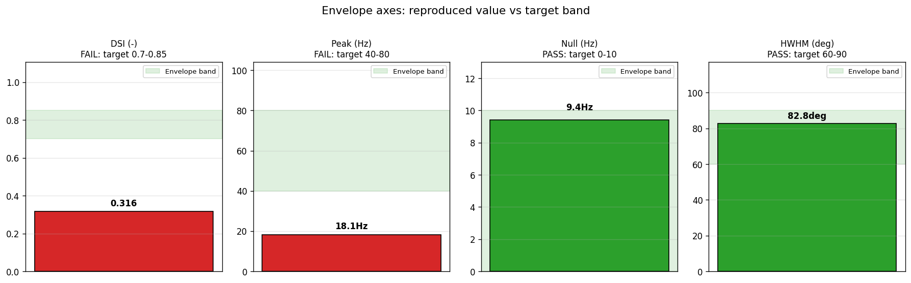
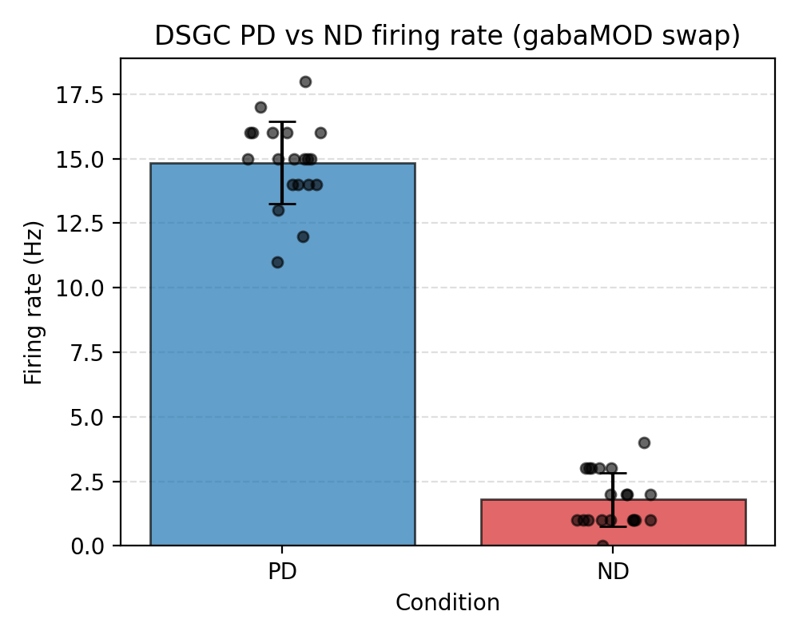
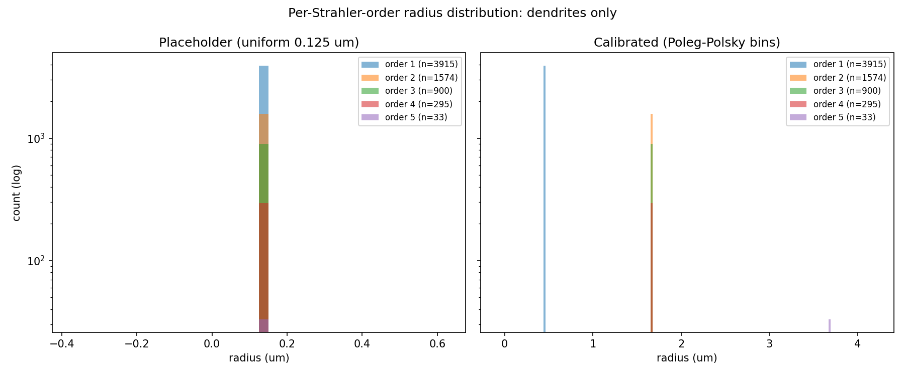

## April 20, 2026

**13 tasks completed. $0 spent. The DSGC simulation stack lands.**

Today is the day the compartmental pipeline actually runs. Two DSGC ports merged. Six supporting
libraries, calibrations, and corrections merged with them. Five literature surveys merged on top.
All of it free — not a single dollar billed.

But the model still doesn't tune the way the cell does. Direction selectivity recovers. Firing rate
does not.

## Eight things we learned

### 1. The first DSGC port compiles. Direction selectivity does not follow.

[ModelDB 189347](../overview/tasks/task_pages/t0008_port_modeldb_189347.md) (Poleg-Polsky & Diamond
2016\) was ported as a registered library asset, six MOD files compiled clean on NEURON 8.2.7, and a
canonical 12-angle × 20-trial sweep ran end-to-end on the local Windows workstation.

The numbers tell a mixed story:

* [**DSI 0.316**](../overview/metrics-results/direction_selectivity_index.md) — target **0.70-0.85**
  — FAIL
* **Peak firing 18.1 Hz** — target **40-80 Hz** — FAIL
* **Null firing 9.4 Hz** — target **< 10 Hz** — PASS
* [**HWHM 82.8°**](../overview/metrics-results/tuning_curve_hwhm_deg.md) — target **60-90°** — PASS
* [**Reliability 0.991**](../overview/metrics-results/tuning_curve_reliability.md) — target **>
  0.9** — PASS

Two of four envelope axes passed. The port is technically faithful — surface-area parity confirmed,
every trial completes. The gap is a protocol mismatch: Poleg-Polsky drives direction selectivity via
a per-angle `gabaMOD` parameter swap, not spatial rotation. Follow-up already done:
[gabaMOD-swap port](../overview/tasks/task_pages/t0020_port_modeldb_189347_gabamod.md) (t0020)
landed the same day.

### 2. gabaMOD-swap protocol fixes DSI. Firing rate still sits low.

Swap the rotation proxy for the paper's native two-condition `gabaMOD` protocol (PD = 0.33, ND =
0.99) and the contrast falls back into place:

* [**DSI 0.7838**](../overview/metrics-results/direction_selectivity_index.md) — inside envelope
  **[0.70, 0.85]** ✓
* **Peak firing 14.85 Hz** — still below envelope **[40, 80] Hz** ✗
* **Null firing 1.80 Hz**
* **DSI gain over the rotation proxy**: **+0.468** (**2.48×** the rotation value)

So direction selectivity is a protocol problem, not a biophysics problem. Firing rate, though, is a
different story — the cell rings quietly regardless of how gabaMOD is wired. Follow-up: the
[channel testbed task](../overview/tasks/task_pages/t0022_modify_dsgc_channel_testbed.md) (t0022)
started the same evening to swap in a channel-modular AIS and see if the firing bottleneck is in the
spike generator.

### 3. The morphology gets real diameters.

Before today, every compartment on [`dsgc-baseline-morphology`](../overview/datasets/README.md)
carried the same **0.125 µm** placeholder radius. The
[calibration task](../overview/tasks/task_pages/t0009_calibrate_dendritic_diameters.md) (t0009)
replaced it with a four-level Strahler-order taper from Poleg-Polsky & Diamond 2016:

* Soma **4.118 µm**, primary **3.694 µm**, mid **1.653 µm**, terminal **0.439 µm**
* Surface area: **1,213 → 9,700 µm²** (**+7.99×**)
* Dendritic axial resistance: **3.13 × 10¹⁰ → 1.50 × 10⁹ Ω** (**4.8%** of baseline)
* Proximal input resistance: **90.8 → 0.52 MΩ**
* Topology: **6,736 / 6,736** compartments preserved, dendritic length delta **< 1 µm**

Eight-fold more membrane and a twenty-fold drop in axial resistance. Every downstream channel
experiment now runs on a passive substrate that looks like a real dendrite. Follow-up: built-in,
already the baseline for [t0022](../overview/tasks/task_pages/t0022_modify_dsgc_channel_testbed.md)
and later [V_rest sweeps](../overview/tasks/task_pages/t0026_vrest_sweep_tuning_curves_dsgc.md).

### 4. The scoring and visualisation libraries land.

Two reusable Python libraries shipped today, both under local-compute only:

* [`tuning_curve_loss`](../overview/libraries/README.md)
  ([t0012](../overview/tasks/task_pages/t0012_tuning_curve_scoring_loss_library.md)) — **47 / 47**
  pytest tests, identity loss **= 0.0** on the t0004 target, **4** registered metric keys wired,
  **13** public entry points across **8** modules.
* [`tuning_curve_viz`](../overview/libraries/README.md)
  ([t0011](../overview/tasks/task_pages/t0011_response_visualization_library.md)) — **4** plotting
  functions (Cartesian, polar, multi-model overlay, raster+PSTH), **11** modules, smoke test runs
  under **5 s**, emits **7** example PNGs.

Every later tuning-curve task — ports, sweeps, comparisons — imports these. Follow-up: no further
action on the libraries themselves; they are now a dependency for every DSGC task.

### 5. The hunt for missed DSGC models draws a blank.

A three-pass search swept **37** queries and surfaced **14** candidates
([t0010](../overview/tasks/task_pages/t0010_hunt_missed_dsgc_models.md)). Three were HIGH-priority:
Hanson 2019, deRosenroll 2026, Poleg-Polsky 2026.

All three exited at the P2 upstream-demo gate inside the 90-minute-per-candidate budget. None
reached the canonical sweep. The blockers were structural — driver incompatibility with 12-angle ×
20-trial — not biophysics. **0 new library assets**, **2 new paper assets**, **1 answer asset**
summarising every candidate. Follow-up: deRosenroll 2026 was reattempted the next day as
[its own port task](../overview/tasks/task_pages/t0024_port_de_rosenroll_2026_dsgc.md) (t0024, now
completed); Hanson 2019 sits in
[intervention_blocked](../overview/tasks/task_pages/t0023_port_hanson_2019_dsgc.md) (t0023).

### 6. Five literature surveys land. Every PDF is paywalled.

A single brainstorm decision ([t0014](../overview/tasks/task_pages/t0014_brainstorm_results_3.md))
spawned a whole wave: cable theory
([t0015](../overview/tasks/task_pages/t0015_literature_survey_cable_theory.md)), dendritic
computation
([t0016](../overview/tasks/task_pages/t0016_literature_survey_dendritic_computation.md)), patch
clamp ([t0017](../overview/tasks/task_pages/t0017_literature_survey_patch_clamp.md)), synaptic
integration ([t0018](../overview/tasks/task_pages/t0018_literature_survey_synaptic_integration.md)),
and voltage-gated channels
([t0019](../overview/tasks/task_pages/t0019_literature_survey_voltage_gated_channels.md)).

**25 paper assets** registered. **5 answer assets** synthesised. **0 / 25** PDFs retrieved — Nature
× 5, Elsevier × 4, Wiley, APS, Annual Reviews, Science, PNAS, Cloudflare walls. Summaries are
abstract-plus-training-knowledge with explicit disclaimers. Follow-up: each task wrote
`intervention/paywalled_papers.md` for Sheffield institutional retrieval, then a second pass flips
`download_status` from `"failed"` to `"success"`.

### 7. The morphology provenance was wrong. Now it isn't.

[`dsgc-baseline-morphology`](../overview/datasets/README.md) had been tagged with
`10.1016/j.neuron.2018.05.028`. That DOI, it turns out, resolves to an unrelated Li, Vaughan,
Sturgill & Kepecs CSHL viral-tracing paper — not Morrie & Feller.

The
[provenance resolution task](../overview/tasks/task_pages/t0013_resolve_morphology_provenance.md)
(t0013) downloaded both plausible Feller-lab 2018 candidates, read their Methods, and applied the
pre-specified decision procedure:

* Papers registered: **2 / 2**
* PDFs retrieved: **1 / 2** (Current Biology open-access; Neuron paywalled)
* Winning source paper:
  **[A Dense Starburst Plexus Is Critical for Generating Direction Selectivity](../tasks/t0013_resolve_morphology_provenance/assets/paper/10.1016_j.cub.2018.03.001/summary.md)**
  (Morrie & Feller 2018, *Current Biology*)
* Correction filed: **C-0013-01**

Follow-up: none needed. The aggregator overlay now reports the correct DOI for every downstream
task.

### 8. Brainstorm session 4 picks the next bet.

The [fourth brainstorm](../overview/tasks/task_pages/t0021_brainstorm_results_4.md) (t0021)
authorised three child tasks and no suggestion cleanup:

* [t0022](../overview/tasks/task_pages/t0022_modify_dsgc_channel_testbed.md) — **active**.
  Channel-modular testbed with spatially-asymmetric inhibition.
* [t0023](../overview/tasks/task_pages/t0023_port_hanson_2019_dsgc.md) — deferred
  `intervention_blocked` pending t0022 results.
* [t0024](../overview/tasks/task_pages/t0024_port_de_rosenroll_2026_dsgc.md) — deferred
  `intervention_blocked` pending t0022 results.

Session ran **10:00-14:00 UTC**, four hours, zero cost. Follow-up: t0022 began the same evening
(check-deps and init-folders already merged before midnight).

## One thing we fixed

### 1. dsgc-baseline-morphology source paper.

The placeholder `10.1016/j.neuron.2018.05.028` pointed at the wrong paper. It now points at
`10.1016_j.cub.2018.03.001` (Morrie & Feller 2018, *Current Biology*) via
[correction C-0013-01](../overview/tasks/task_pages/t0013_resolve_morphology_provenance.md). The
original Neuron DOI nomination was a copy-paste error from the t0005 plan.

## Where we stand

| Model | Protocol | [DSI](../overview/metrics-results/direction_selectivity_index.md) | Peak (Hz) | Envelope |
| --- | --- | --- | --- | --- |
| [modeldb_189347_dsgc_gabamod](../overview/libraries/README.md) (t0020) | gabaMOD-swap | [**0.7838**](../overview/metrics-results/direction_selectivity_index.md) | **14.85** | DSI ✓ / peak ✗ |
| [modeldb_189347_dsgc](../overview/libraries/README.md) (t0008) | rotation-proxy | [**0.3163**](../overview/metrics-results/direction_selectivity_index.md) | **18.1** | DSI ✗ / peak ✗ |
| Target envelope | — | **0.70-0.85** | **40-80** | — |

Direction selectivity is now inside the envelope. Peak firing rate is the remaining gap: the cell
rings at roughly **a quarter** of the target rate under both protocols. Next bet: the
[channel testbed](../overview/tasks/task_pages/t0022_modify_dsgc_channel_testbed.md) (t0022) swaps
in a channel-modular AIS to see whether the firing bottleneck sits in the spike generator.

## Costs

| What | Cost |
| --- | --- |
| All 13 tasks (local-only, NEURON + Python only) | $0.00 |
| **Day total** | **$0.00** |
| **Project total** ([full breakdown](../overview/costs/README.md)) | **$0.00** |
| **Budget remaining** | **$1.00 of $1.00** |

The project still has not billed a dollar. Every merge today ran on the local Windows 11 workstation
with the existing NEURON 8.2.7 install. The `$1` nominal budget bump authorised in
[brainstorm 3](../overview/tasks/task_pages/t0014_brainstorm_results_3.md) was purely to clear the
`has_external_costs: true` gate for literature-survey tasks — no paid service was invoked.

## Key papers added

**29 paper assets** added today. **0 / 25** surveyed PDFs downloaded; the 4 non-survey papers
(Hanson 2019, two Feller-lab 2018, Poleg-Polsky 2026) had mixed retrieval outcomes.

The three most load-bearing for the project:

**[Distinguishing theoretical synaptic potentials computed for different soma-dendritic distributions of synaptic input](../tasks/t0015_literature_survey_cable_theory/assets/paper/10.1152_jn.1967.30.5.1138/summary.md)**
(Rall, 1967). The cable-theoretic foundation for every compartmental DSGC model in this project.
Gives the EPSP shape-index diagnostic used to validate space-clamp fidelity and the passive
ground-truth the calibrated morphology now approximates.

**[A new cellular mechanism for coupling inputs arriving at different cortical layers](../tasks/t0016_literature_survey_dendritic_computation/assets/paper/10.1038_18686/summary.md)**
(Larkum, Zhu, Sakmann, 1999). The canonical BAC-firing / dendritic Ca²⁺-spike reference. Any
decision to add active dendritic conductances to the DSGC model starts here.

**[A Dense Starburst Plexus Is Critical for Generating Direction Selectivity](../tasks/t0013_resolve_morphology_provenance/assets/paper/10.1016_j.cub.2018.03.001/summary.md)**
(Morrie & Feller, 2018). The correct source paper for `dsgc-baseline-morphology` — SAC-to-DSGC
asymmetry is the experimental substrate every DS mechanism in this project has to match.

[All 29 papers added today](../overview/papers/README.md)

## Key questions answered

**7 answer assets** produced today. The three that carry the most decision weight:

**[Can ModelDB 189347 be reproduced locally and does it hit the Poleg-Polsky DSI envelope?](../tasks/t0008_port_modeldb_189347/assets/answer/dsgc-modeldb-port-reproduction-report/full_answer.md)**
Yes on reproduction, no on the envelope under a rotation-proxy protocol. The port compiles, every
trial runs, and the morphology-swap is surface-area-equivalent — but DSI lands at **0.316** instead
of **0.70-0.85**. The gap is a protocol mismatch between spatial-rotation stimulation and
Poleg-Polsky's native `gabaMOD` parameter swap.

**[Which DSGC compartmental models did the original survey miss, and are they portable?](../tasks/t0010_hunt_missed_dsgc_models/assets/answer/dsgc-missed-models-survey/full_answer.md)**
**14** candidates surfaced across a three-pass hunt; **3** qualified as HIGH-priority (Hanson 2019,
deRosenroll 2026, Poleg-Polsky 2026). Every attempted port failed the P2 upstream-demo gate on
structural driver incompatibility, not biophysics. Two new paper assets registered; no new library
assets.

**[Which Nav / Kv channel combinations should the DSGC compartmental model use at the AIS and soma?](../tasks/t0019_literature_survey_voltage_gated_channels/assets/answer/nav-kv-combinations-for-dsgc-modelling/full_answer.md)**
Synthesised a prior table across five Nav/Kv-per-compartment themes from VanWart 2006, Kole &
Letzkus 2007, Fohlmeister & Miller 1997, Hu 2009 and Kole 2008. All five source PDFs are paywalled,
so the priors carry explicit low-confidence tags and will need ground-truth tightening once
Sheffield institutional retrieval lands the PDFs.

[All 7 answers](../overview/answers/README.md)
