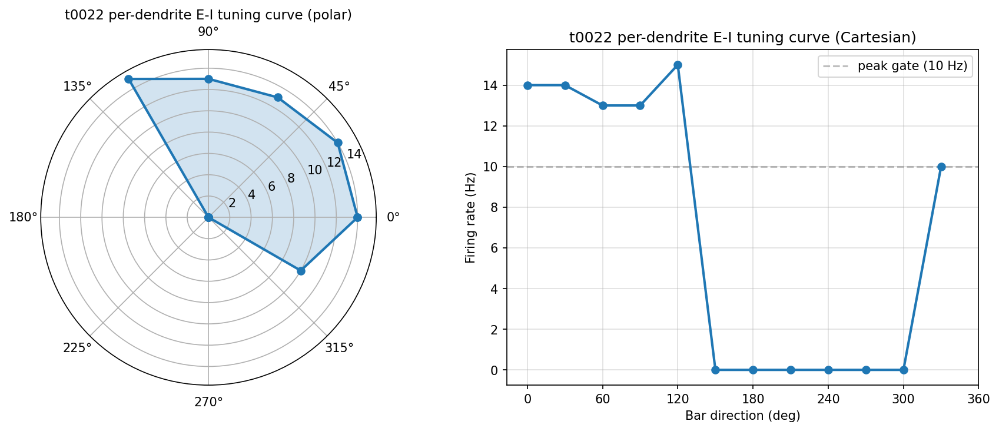
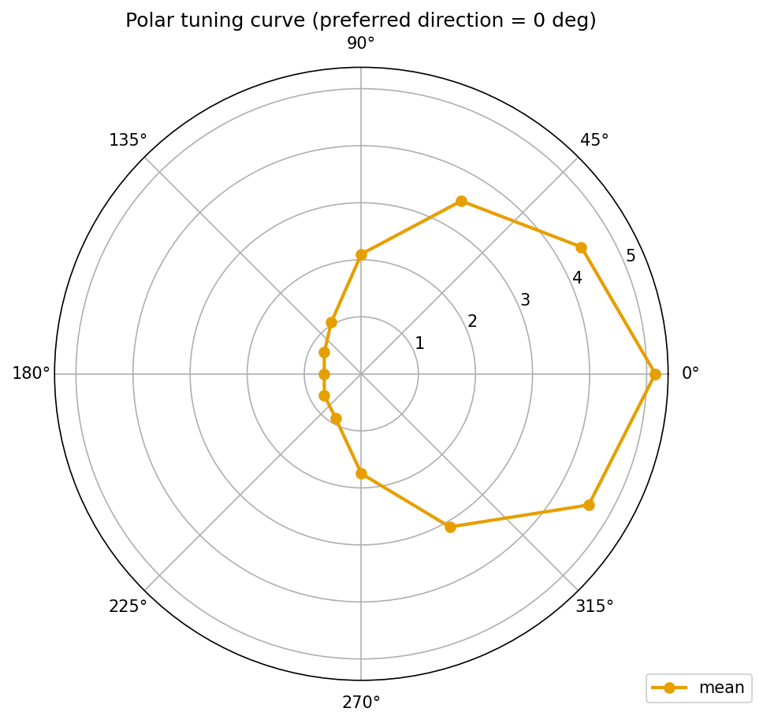

[← Apr 20, 2026](2026-04-20.md) | [Index](README.md) | [Apr 22, 2026 →](2026-04-22.md)

---

## April 21, 2026

**5 tasks completed. $0 spent.**

Yesterday the stack compiled. Today it runs. Two fresh DSGC ports merged, a V_rest sweep exposed how
differently they react to depolarisation, and a 15-paper morphology survey drew the shape of the
next round of experiments.

DSI is no longer the problem. Peak firing rate still is.

## Five things we learned

### 1. The dendritic testbed saturates DSI at 1.0.

The [channel-modular testbed](../../overview/tasks/task_pages/t0022_modify_dsgc_channel_testbed.md)
drives direction selectivity through per-dendrite E-I scheduling (E leads I by **+10 ms** in the
preferred half-plane; I leads E by **10 ms** in the null half-plane) on top of a 5-region AIS. The
12-angle × 10-trial sweep says:

* [**DSI 1.0**](../../overview/metrics-results/direction_selectivity_index.md) — gate ≥ 0.5 ✓ (up from
  **0.316** at [t0008](../../overview/tasks/task_pages/t0008_port_modeldb_189347.md) and **0.7838** at
  [t0020](../../overview/tasks/task_pages/t0020_port_modeldb_189347_gabamod.md))
* **Peak firing 15 Hz** at 120° — gate ≥ 10 Hz ✓, envelope **[40, 80] Hz** ✗
* **Null firing 0 Hz** across 150-300° — silenced by early inhibition
* [**HWHM 116.25°**](../../overview/metrics-results/tuning_curve_hwhm_deg.md) — broader than t0008's
  82.81°; the 120° lit half-plane covers 5 of 12 angles
* [**RMSE 10.48 Hz**](../../overview/metrics-results/tuning_curve_rmse.md) vs t0004 target — closest of
  the three siblings

The DSGC lineage now has three ports on the same Poleg-Polsky & Diamond 2016 skeleton, each with a
different DSI mechanism. DSI = 1.0 is too deterministic — real cells sit in the 0.5-0.8 band.
Follow-up: [S-0022-05](../../overview/suggestions/README.md) queues a Poisson-noise sweep to moderate
DSI down into the literature envelope, and [S-0022-02](../../overview/suggestions/README.md) sweeps
Nav1.6 density in the distal AIS to chase the peak-rate gap.

### 2. The de Rosenroll port flies. The paper's signature does not.

The [de Rosenroll 2026 port](../../overview/tasks/task_pages/t0024_port_de_rosenroll_2026_dsgc.md)
vendors the upstream Zenodo repo (`a23f642a`) and drives the 341-section cell through the
8-direction paper protocol and the project-standard 12-angle protocol under correlated (ρ=0.6) and
uncorrelated (ρ=0.0) AR(2) release noise — **800 trials, ~4h15m** on the local workstation.

It reproduces direction selectivity:

| Condition | DSI | Paper target | Verdict |
| --- | --- | --- | --- |
| 12-ang, correlated (ρ=0.6) | [**0.7759**](../../overview/metrics-results/direction_selectivity_index.md) | — | — |
| 12-ang, uncorrelated (ρ=0.0) | [**0.8557**](../../overview/metrics-results/direction_selectivity_index.md) | — | — |
| 8-dir, correlated | **0.8182** | **[0.30, 0.50]** | ✗ |
| 8-dir, uncorrelated | **0.8351** | **[0.18, 0.35]** | ✗ |
| Correlation-drop fraction | **0.000** | **≥ 0.20** | ✗ |

Uncorrelated DSI is *higher* than correlated — the opposite of the paper. The correlation-drop
signature is the whole point of de Rosenroll 2026, and the port does not reproduce it. The miss is
recorded in `intervention/port_fidelity_miss.md` as a first-class finding, not swept under the rug.
Peak firing **5.15 Hz** — the same lineage-wide firing-rate gap everyone else has.

Why did it fail? The AR(2) correlation was applied at per-terminal Exp2Syn drivers, not across the
spatially-distributed SAC varicosity release network the paper names as causal. Follow-up:
[S-0024-01](../../overview/suggestions/README.md) queues a full upstream `SacNetwork` port as a sibling
library to close REQ-5.

### 3. V_rest sweeps show two different cells.

The [V_rest sweep](../../overview/tasks/task_pages/t0026_vrest_sweep_tuning_curves_dsgc.md) covers
**-90 mV to -20 mV in 10 mV steps** on both ports. **1,056 trials** total. The two models react
differently enough that they might as well be different species:

* **t0022 DSI**: **0.046** → **0.6555** — **14× modulation**, sharp peak at **V_rest=-60 mV**
* **t0024 DSI**: **0.3606** → **0.6746** — **1.9× modulation**, U-shaped, maxima at the extremes
* **t0022 peak firing**: **6 Hz** at -90 mV, rises monotonically to **129 Hz** at -30 mV, then
  collapses to **26 Hz** at -20 mV as Na inactivation bites
* **t0024 peak firing**: **1.5 Hz** → **7.6 Hz** monotone; no collapse at -20 mV
* **t0022 HWHM**: **0.77°** at V≤-80 mV (near-binary) versus **180°** at -30/-40 mV (no tuning)
* **t0024 HWHM**: **65-83°** across the full V_rest range — AR(2) noise smooths everything

Three things land. First, the firing-rate ceiling everyone has been chasing isn't a channel-density
story — t0022 hits **129 Hz** when V_rest is moved to -30 mV. Second, t0024's AR(2) noise dominates
whatever dendritic geometry is doing — DSI barely moves. Third, Na inactivation at V_rest=-20 mV is
a cliff t0022 falls off and t0024 doesn't, suggesting different channel physiology drives each port.
Follow-up: [S-0026-06](../../overview/suggestions/README.md) queues TTX-block and NMDA-block sweeps at
each V_rest to separate the mechanisms; [S-0026-02](../../overview/suggestions/README.md) queues an
AR(2) rho × V_rest sweep on t0024.

### 4. Brainstorm 5 picks the sweep. The sweep lands the same day.

[Brainstorm session 5](../../overview/tasks/task_pages/t0025_brainstorm_results_5.md) ran in the gap
between the t0024 merge and the next round. Four researcher questions — model count, DSI = 1
saturation, HWHM definition, stimulus length — got answered. One follow-up got queued: a V_rest
sweep, polar output, both ports.

Session to merge: under six hours. Follow-up: done — the V_rest sweep is item 3 above.

### 5. The morphology corpus grows by 15 papers. The next sweep picks itself.

The
[morphology-and-DS modelling survey](../../overview/tasks/task_pages/t0027_literature_survey_morphology_ds_modeling.md)
adds **15 new paper assets**, bringing the corpus to **20 papers** spanning retinal SAC and DSGC
models, fly lobula-plate VS and T4 neurons, primate SAC, cat V1 cortex, and the TREES-toolbox
framework. **13 PDFs retrieved, 2 paywalled** (Kim2014, Sivyer2013).

Three mechanisms replicate across the corpus: **asymmetric SAC inhibition**, **electrotonic
compartmentalisation**, and **kinetic tiling of bipolar input** (sustained-proximal,
transient-distal). One contradiction sits unresolved: Sivyer2013 and Schachter2010 argue DSGC DS
*requires* active dendritic conductances, while
[Dan2018](../../tasks/t0027_literature_survey_morphology_ds_modeling/assets/paper/10.1038_s41598-018-23998-9/summary.md)
(fly VS) and
[Gruntman2018](../../tasks/t0027_literature_survey_morphology_ds_modeling/assets/paper/10.1038_s41593-017-0046-4/summary.md)
(fly T4) show passive cable — even a collapsed single compartment — producing DS in invertebrate
systems.

Three corpus-wide gaps: **dendritic diameter** is swept in only one paper
([Wu2023](../../tasks/t0027_literature_survey_morphology_ds_modeling/assets/paper/10.1017_S0952523823000019/summary.md),
primate SAC); **branch order** is untouched in DSGCs; **branch-angle at fixed length** is untouched
everywhere.

The recommended next experiment falls out cleanly: [S-0027-01](../../overview/suggestions/README.md) —
distal-dendrite length scaling (1.0×, 1.25×, 1.5×) on t0022. If passive transfer-resistance
weighting (Dan2018) dominates, DSI drops >30% at 1.5×. If dendritic-spike branch independence
(Sivyer2013) dominates, DSI holds within 10%. One experiment, two competing mechanisms, clean
answer.

## Where we stand

| Model | Protocol | [DSI](../../overview/metrics-results/direction_selectivity_index.md) | Peak (Hz) | [HWHM (°)](../../overview/metrics-results/tuning_curve_hwhm_deg.md) |
| --- | --- | --- | --- | --- |
| [modeldb_189347_dsgc_dendritic](../../overview/tasks/task_pages/t0022_modify_dsgc_channel_testbed.md) (t0022) | per-dendrite E-I | [**1.000**](../../overview/metrics-results/direction_selectivity_index.md) | **15** | **116.25** |
| [de_rosenroll_2026_dsgc](../../overview/tasks/task_pages/t0024_port_de_rosenroll_2026_dsgc.md) (t0024) | AR(2) ρ=0.6 | [**0.7759**](../../overview/metrics-results/direction_selectivity_index.md) | **5.15** | **68.65** |
| [modeldb_189347_dsgc_gabamod](../../overview/tasks/task_pages/t0020_port_modeldb_189347_gabamod.md) (t0020) | gabaMOD-swap | [**0.7838**](../../overview/metrics-results/direction_selectivity_index.md) | **14.85** | — |
| [modeldb_189347_dsgc](../../overview/tasks/task_pages/t0008_port_modeldb_189347.md) (t0008) | rotation-proxy | [**0.3163**](../../overview/metrics-results/direction_selectivity_index.md) | **18.1** | **82.81** |
| Target envelope | — | **0.70-0.85** | **40-80** | **60-90** |

DSI is sorted. All three modern ports land in or above envelope. Peak firing rate at native V_rest
is still the gap — four ports, peaks of **5-18 Hz** against a target of **40-80 Hz**. But t0022's
V_rest sweep just showed **129 Hz** is reachable when V_rest is shifted to -30 mV. Gap to target:
**~25 Hz** at native V_rest. Next bet: distal-dendrite length scaling on t0022 (S-0027-01), and in
parallel a Nav1.6 distal-AIS density sweep (S-0022-02) to test whether the firing-rate ceiling is
geometry-driven or channel-driven.

## Costs

| What | Cost |
| --- | --- |
| All 5 tasks (local-only, NEURON + Python) | $0.00 |
| **Day total** | **$0.00** |
| **Project total** ([full breakdown](../../overview/costs/README.md)) | **$0.00** |
| **Budget remaining** | **$1.00 of $1.00** |

Zero billed. The biggest workload today — the t0024 port with 800 trials and the t0026 V_rest sweep
with 960 correlated trials — totalled about **7.5 h** of wall time on the local Windows workstation.
All five completions ran on the existing NEURON 8.2.7 install.

## Key papers added

**16 paper assets** added today (1 in
[t0024](../../overview/tasks/task_pages/t0024_port_de_rosenroll_2026_dsgc.md), 15 in
[t0027](../../overview/tasks/task_pages/t0027_literature_survey_morphology_ds_modeling.md)). The three
most load-bearing for the next round of experiments:

**[Direction selectivity is computed by active dendritic integration in retinal ganglion cells](../../tasks/t0027_literature_survey_morphology_ds_modeling/assets/paper/10.1038_nn.3565/summary.md)**
(Sivyer & Williams, 2013). The canonical argument that DSGC DS is computed by voltage-gated
dendritic conductances rather than synaptic inhibition alone. Directly load-bearing for S-0027-01
and S-0027-03 — if dendritic-spike branch independence is real, distal-length scaling and diameter
thickening should leave DSI intact.

**[Non-uniform weighting of local motion inputs underlies dendritic computation in the fly visual system](../../tasks/t0027_literature_survey_morphology_ds_modeling/assets/paper/10.1038_s41598-018-23998-9/summary.md)**
(Dan et al., 2018). The counter-argument: passive cable with transfer-resistance weighting suffices
for DS in fly VS neurons. If this mechanism extends to DSGCs, the geometry sweep plays out very
differently — the 1.5× distal-length condition should cost >30% of DSI.

**[Uncovering the "hidden" synaptic microarchitecture of the retinal direction selective circuit](../../tasks/t0024_port_de_rosenroll_2026_dsgc/assets/paper/10.1016_j.celrep.2025.116833/summary.md)**
(de Rosenroll et al., 2026). The source paper for the t0024 port. The correlation-drop signature
this paper reports is exactly what the port failed to reproduce, and the paper's emphasis on SAC
varicosity-level release architecture is what S-0024-01 will rebuild.

[All 16 papers added today](../../overview/papers/README.md)

## Key questions answered

**1 answer asset** produced today:

**[What variables of neuronal morphology have been shown by computational modeling to affect direction selectivity, by what mechanisms, and what gaps remain?](../../tasks/t0027_literature_survey_morphology_ds_modeling/assets/answer/morphology-direction-selectivity-modeling-synthesis/full_answer.md)**
Morphology shapes DS through dendritic length, branch order and branching pattern, dendritic
diameter, spatial and kinetic tiling of bipolar input, arbor asymmetry, and electrotonic
compartmentalisation of terminal branches. The load-bearing mechanisms are passive cable with
transfer-resistance weighting, local-global EPSP summation, space-time kinetic tiling,
dendritic-spike branch independence, and morphology-constrained asymmetric SAC inhibition. Gaps sit
in systematic sweeps of branch order and dendritic diameter on realistic reconstructions, morphology
× active-conductance joint manipulations at DSGC tips, and morphology-aware cortical and
invertebrate DS modelling.

[All answers](../../overview/answers/README.md)

---

[← Apr 20, 2026](2026-04-20.md) | [Index](README.md) | [Apr 22, 2026 →](2026-04-22.md)
