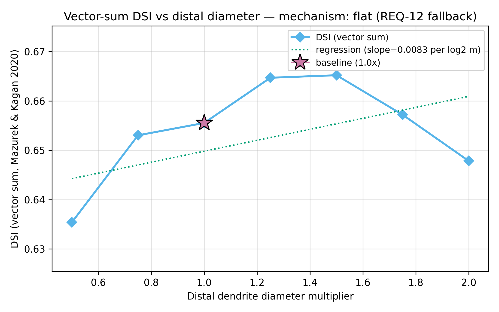
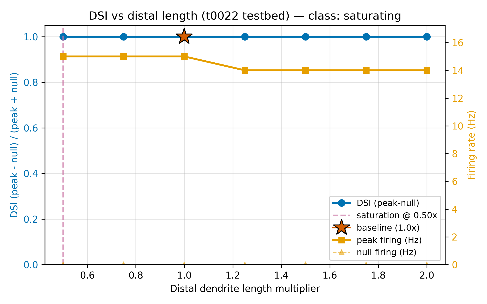
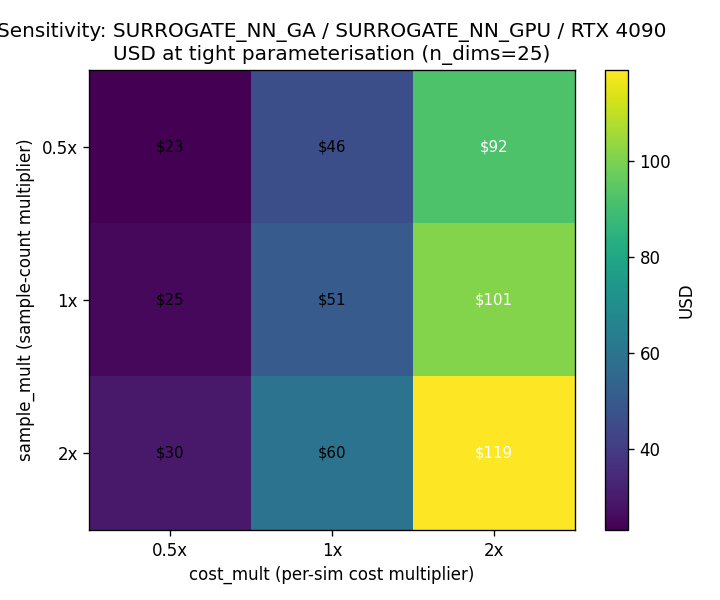

[← Apr 21, 2026](2026-04-21.md) | [Index](README.md) | [Apr 23, 2026 →](2026-04-23.md)

---

## April 22, 2026

**5 tasks completed. $0 spent.**

A busy loop day on the t0022 DSGC testbed. Two morphology sweeps and one planning task all landed,
bracketed by two brainstorm sessions. The sweeps returned a clean negative: neither distal length
nor distal diameter steers DSI on this testbed — the E-I schedule silences null firing and pins
primary DSI at **1.000** before cable mechanics matter. The planning task priced a future joint
morphology + top-10 VGC optimiser on Vast.ai GPU at **~$50** central, **$23-$119** sensitivity band.

Morphology is not the lever. Scheduling is.

## Four things we learned

### 1. Distal geometry doesn't steer DSI on the t0022 testbed.

Two sibling sweeps, same negative. The
[distal-length sweep](../../overview/tasks/task_pages/t0029_distal_dendrite_length_sweep_dsgc.md)
(t0029) covered **0.5×-2.0×** baseline length over **7 multipliers × 12 directions × 10 trials = 840
trials** in **~42 min**. The
[distal-diameter sweep](../../overview/tasks/task_pages/t0030_distal_dendrite_diameter_sweep_dsgc.md)
(t0030) covered the same **4× diameter range** in the same **840-trial** grid in **~115 min**.

Both produced the same flat primary-DSI curve:

* [**DSI (primary) = 1.000**](../../overview/metrics-results/direction_selectivity_index.md) at every
  length and every diameter — **zero dynamic range**
* [**Vector-sum DSI**](../../overview/metrics-results/direction_selectivity_index.md) (fallback):
  length sweep **0.664 → 0.643** (**-0.021** across 4× range); diameter sweep **0.635 → 0.665**
  (slope **0.0083/log2(mult)**, **p = 0.1773** — flat)
* **Peak firing rate**: **15 Hz → 14 Hz** on length; **15 Hz → 13 Hz** on diameter (single-Hz steps,
  no cliff)
* **Null firing rate**: **0 Hz** at every single one of the **14 sweep points** — that is the whole
  story

The mechanism is unambiguous.
[t0022](../../overview/tasks/task_pages/t0022_modify_dsgc_channel_testbed.md)'s per-dendrite E-I
scheduler uses **GABA_CONDUCTANCE_NULL_NS = 12 nS** delivered **10 ms before AMPA** on
null-direction trials — roughly **2× Schachter2010's compound null inhibition (~6 nS)**. That
oversized early shunt drives null firing to exactly **0 Hz** and pins the pref/null ratio at ceiling
regardless of what geometry does downstream. Vector-sum DSI, which uses all 12 directions, retains a
usable signal — but it is weak (range **~0.03**) and dwarfed by schedule effects.

Follow-up: [S-0030-01](../../overview/suggestions/README.md) queues a rerun with null-GABA halved to
**6 nS**, and [S-0029-01 / S-0030-02](../../overview/suggestions/README.md) queue Poisson-noise
desaturation (5 Hz background) to restore a rate-code noise floor before either sweep is repeated.
[S-0030-04](../../overview/suggestions/README.md) queues a **2-D length × diameter** grid to catch
interactions the marginal sweeps mask.

### 2. Neither Schachter2010 active amplification nor passive filtering is supported on this testbed.

The diameter sweep was designed as a mechanism discriminator.
[Schachter2010](../../overview/papers/README.md) predicts a **positive** DSI-vs-diameter slope (thicker
distal dendrites carry more active current). Classical passive filtering predicts a **negative**
slope (thicker distal dendrites load the soma and blunt tuning). The measured slope is **+0.0083 per
log2(multiplier), p = 0.1773** — indistinguishable from zero across a **4× diameter range**. The
**peak distal membrane voltage sits at ~-5 mV** at every diameter, so distal-spike thresholds are
cleared everywhere and neither mechanism gets a chance to act.

This is not a result about Schachter2010. It is a result about the t0022 testbed. The E-I schedule
over-delivers DSI before the mechanism under test can act. Until the schedule is fixed, any
morphology sweep on t0022 will produce the same flat curve.

Follow-up: [S-0030-03](../../overview/suggestions/README.md) queues a wider **0.25×-4.0× diameter
range** after the schedule fix, to probe extreme impedance regimes that might escape the ceiling;
[S-0030-05](../../overview/suggestions/README.md) queues a **non-uniform taper sweep** that recreates
the Schachter2010 **5-7× proximal-to-distal impedance gradient** instead of uniform scaling.

### 3. A joint morphology + top-10 VGC DSI optimisation would cost ~$50 on Vast.ai RTX 4090.

[t0033](../../overview/tasks/task_pages/t0033_plan_dsgc_morphology_channel_optimisation.md) priced a
future joint optimiser using the downloaded paper corpus only (no internet search), across **5
strategies × 3 compute modes × 3 GPU tiers** with a **3×3 sensitivity grid**. The recommended cell
is **Surrogate-NN-assisted GA** on **RTX 4090** with the **tight 25-parameter** committed
parameterisation (**5 Cuntz morphology scalars + 20 per-region channel gbar**):

* **Central estimate**: **$50.54**
* **Sensitivity band**: **$23-$119** under 0.5×/1×/2× perturbations to per-sim cost and sample count
* **Training cost dominates**: **$41.56** one-shot surrogate training vs **$8.98** inference on the
  GA inner loop
* **Rich 45-parameter envelope**: upper bound if every branch order and every region is exposed
* **CPU-96 comparator**: **$32.38** on Vast.ai (within the GPU sensitivity band, but surrenders
  future scaling headroom)

Empirical per-simulation wall-time is anchored on the
[t0026 V_rest sweep](../../overview/tasks/task_pages/t0026_vrest_sweep_tuning_curves_dsgc.md): **456
s** deterministic and **1,440 s** stochastic per full 12-angle × 10-trial protocol.

Follow-up: [S-0033-01](../../overview/suggestions/README.md) queues a **CoreNEURON GPU benchmark** to
validate the assumed **5× CPU-to-GPU speedup** (the largest unjustified assumption in the cost
model). [S-0033-02](../../overview/suggestions/README.md) queues instantiation of the currently-empty
**AIS_PROXIMAL / AIS_DISTAL / THIN_AXON** channel hooks on t0022 as an optimiser prerequisite.

### 4. Surrogate training dominates — and is where the leverage is.

The **$41.56** surrogate-training component is **82%** of the central **$50.54** recommended cost.
[Creative-thinking alternatives](../../tasks/t0033_plan_dsgc_morphology_channel_optimisation/research/research_code.md)
flagged two reductions with large headroom. **Multi-fidelity surrogates** (coarse-dt filter → full
re-score on top decile) project **2-3× training cost reduction**. **Transfer-learning warm-start**
from the existing t0022, t0024, and t0026 V_rest-sweep evaluations could replace half the
5,000-sample cold-start burn, pulling the cell to **~$30**.

Follow-up: [S-0033-03 (multi-fidelity prototype)](../../overview/suggestions/README.md) and
[S-0033-04 (transfer-learning warm-start)](../../overview/suggestions/README.md) are both high-priority
and both cheap to prototype. [S-0033-06](../../overview/suggestions/README.md) queues a reusable
**`dsgc_dsi_objective`** library that every strategy row in the cost model can call — the missing
piece between the plan and the first optimiser run.

## Where we stand

| Model | Protocol | [DSI (primary)](../../overview/metrics-results/direction_selectivity_index.md) | [DSI (vector-sum)](../../overview/metrics-results/direction_selectivity_index.md) | Peak (Hz) |
| --- | --- | --- | --- | --- |
| [t0022 dendritic testbed](../../overview/tasks/task_pages/t0022_modify_dsgc_channel_testbed.md) | per-dendrite E-I, 12-ang | [**1.000**](../../overview/metrics-results/direction_selectivity_index.md) | **0.656** | **15** |
| [t0029 distal-length sweep](../../overview/tasks/task_pages/t0029_distal_dendrite_length_sweep_dsgc.md) | t0022 × 7 length mult | [**1.000** across all 7](../../overview/metrics-results/direction_selectivity_index.md) | **0.643-0.664** | **14-15** |
| [t0030 distal-diameter sweep](../../overview/tasks/task_pages/t0030_distal_dendrite_diameter_sweep_dsgc.md) | t0022 × 7 diameter mult | [**1.000** across all 7](../../overview/metrics-results/direction_selectivity_index.md) | **0.635-0.665** | **13-15** |
| [t0024 de Rosenroll port](../../overview/tasks/task_pages/t0024_port_de_rosenroll_2026_dsgc.md) | AR(2) ρ=0.6 | [**0.7759**](../../overview/metrics-results/direction_selectivity_index.md) | — | **5.15** |
| Literature envelope | — | **0.70-0.85** | **0.70-0.85** | **40-80** |

Gap to the physiological DSI envelope: not applicable — the t0022 schedule over-delivers on primary
DSI and pins it at ceiling. The real gap is in **null firing rate**: **0 Hz** on every one of
**1,680 sweep trials** today, when the literature envelope needs null firing in the **1-10 Hz** band
to even have a ratio. Next bet: halve **GABA_CONDUCTANCE_NULL_NS** from **12 nS** to **6 nS**
(S-0030-01), or inject **5 Hz Poisson background** (S-0029-01, S-0030-02) — restore the noise floor,
then rerun the sweeps.

## Costs

| What | Cost |
| --- | --- |
| t0028 brainstorm session 6 | $0.00 |
| t0029 distal-length sweep (840 trials, ~42 min local CPU) | $0.00 |
| t0030 distal-diameter sweep (840 trials, ~115 min local CPU) | $0.00 |
| t0032 brainstorm session 7 | $0.00 |
| t0033 Vast.ai optimisation planner (local, downloaded-corpus only) | $0.00 |
| **Day total** | **$0.00** |
| **Project total** ([full breakdown](../../overview/costs/README.md)) | **$0.00** |
| **Budget remaining** | **$1.00 of $1.00** |

Zero billed. Two CPU sweeps totalling **~2h37m** of local NEURON 8.2.7 wall time plus two brainstorm
sessions and one planning task. No remote machines provisioned, no paid APIs called.

## Key papers added

No new papers added today.
[t0031](../../overview/tasks/task_pages/t0031_fetch_paywalled_kim2014_sivyer2013.md) (paywalled-PDF
fetch for Kim2014 and Sivyer2013) was authorised by t0028 but remained not-started — the research
loop prioritised the morphology sweeps and the Vast.ai planner ahead of the fetch.

## Key questions answered

**1 answer asset** produced today:

**[What is the Vast.ai GPU cost and recommended organisation of a joint DSGC morphology + top-10 voltage-gated channel DSI-maximisation task?](../../tasks/t0033_plan_dsgc_morphology_channel_optimisation/assets/answer/vastai-cost-of-joint-dsgc-morphology-channel-dsi-optimisation/full_answer.md)**
Surrogate-NN-assisted GA on a single RTX 4090 at **~$50** central cost (sensitivity **$23-$119**)
with **25 committed free parameters** (5 Cuntz morphology scalars + 20 per-region channel gbar).
Recommended strategy and compute tier sit at the cheapest corner of a **5 × 3 × 3** cost matrix
validated against the downloaded paper corpus. Confidence medium: the **5× CoreNEURON speedup** and
the surrogate-NN economics are external assumptions requiring an empirical validation task before
the optimiser is commissioned.

[All answers](../../overview/answers/README.md)

---

[← Apr 21, 2026](2026-04-21.md) | [Index](README.md) | [Apr 23, 2026 →](2026-04-23.md)
