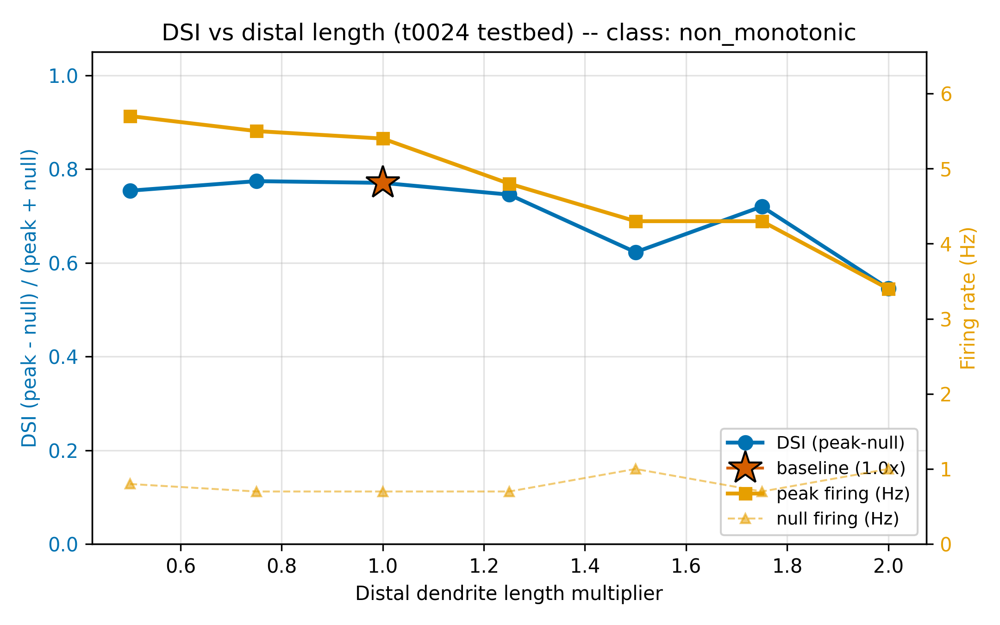
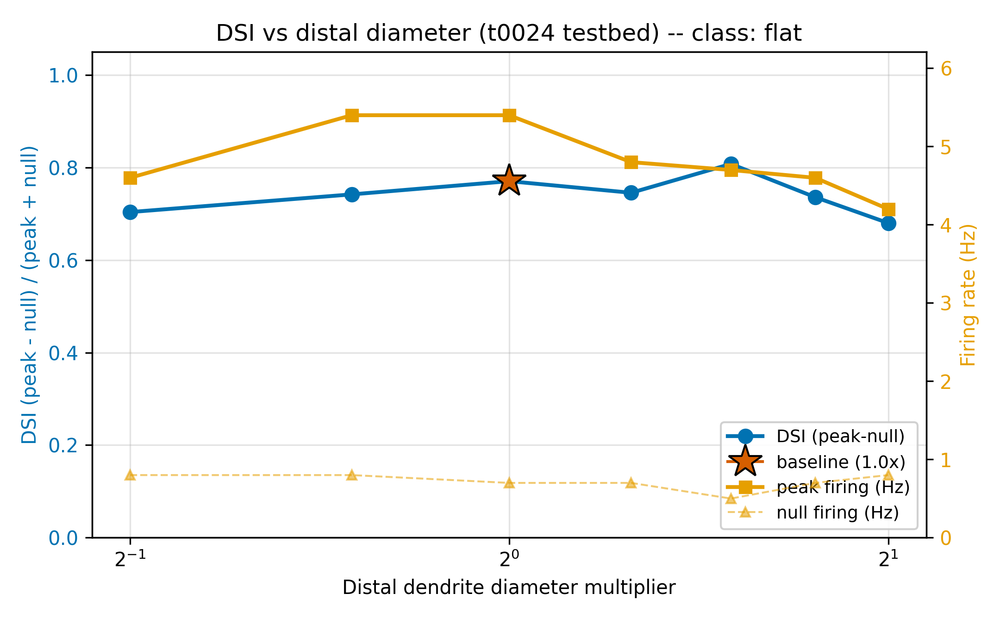
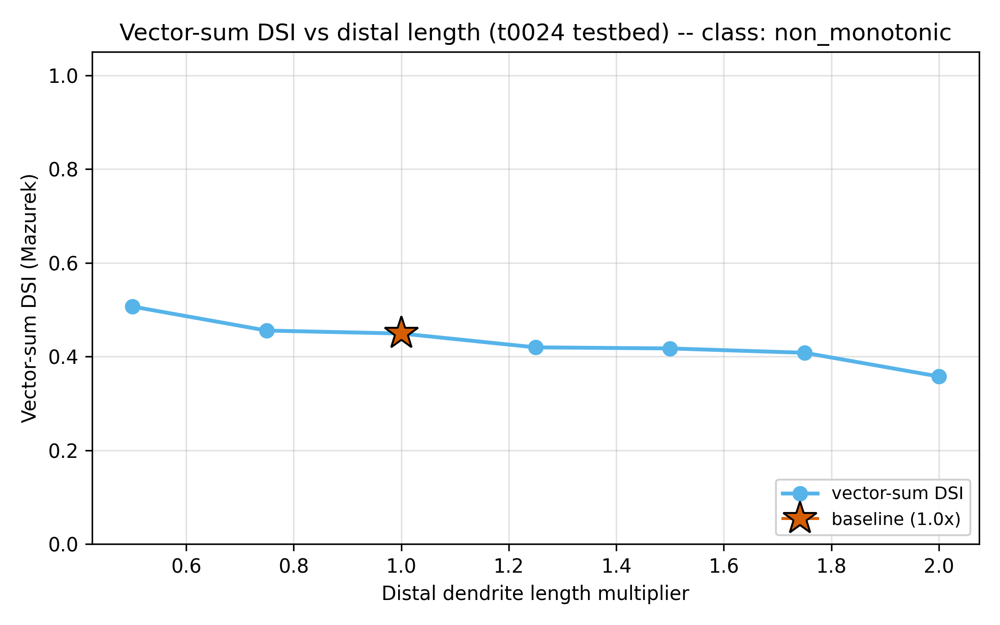

[← Apr 22, 2026](2026-04-22.md) | [Index](README.md)

---

## April 23, 2026

**2 tasks completed. $0 spent.**

t0029 and t0030 said "DSI is pinned at 1.0 on the t0022 testbed, you can't run morphology sweeps
here." Today we ran them on the t0024 port instead. Noise rescued them.

And a new asymmetry fell out: length matters. Diameter doesn't.

## Three things we learned

### 1. AR(2) noise makes DSI a real knob again.

On [t0022](../../overview/tasks/task_pages/t0022_modify_dsgc_channel_testbed.md) null firing is **0
Hz** across every configuration — the driver is deterministic and the null-half-plane GABA is
oversized. That pins [DSI](../../overview/metrics-results/direction_selectivity_index.md) at **1.000**
at every morphology tested in
[t0029](../../overview/tasks/task_pages/t0029_distal_dendrite_length_sweep_dsgc.md) and
[t0030](../../overview/tasks/task_pages/t0030_distal_dendrite_diameter_sweep_dsgc.md). No information.

On [t0024](../../overview/tasks/task_pages/t0024_port_de_rosenroll_2026_dsgc.md) the AR(2) release
noise (ρ=0.6) produces **0.70-1.00 Hz** null firing across every sweep point. Suddenly DSI is a real
measurement:

* [t0034](../../overview/tasks/task_pages/t0034_distal_dendrite_length_sweep_t0024.md) length sweep:
  DSI ranges [**0.545**](../../overview/metrics-results/direction_selectivity_index.md) at L=2.0× to
  [**0.774**](../../overview/metrics-results/direction_selectivity_index.md) at L=0.75× — absolute
  range **0.229**, slope **−0.1259** per unit multiplier, **p=0.038**
* [t0035](../../overview/tasks/task_pages/t0035_distal_dendrite_diameter_sweep_t0024.md) diameter
  sweep: DSI ranges **0.680**-**0.808** — absolute range **0.128**, slope **0.0041** per
  log₂(multiplier), **p=0.88**

The [Poisson-noise desaturation hypothesis](../../overview/suggestions/README.md) queued from t0029
(S-0029-01) is effectively vindicated. Follow-up: a dedicated
[AR(2) ρ sweep](../../overview/suggestions/README.md) (S-0034-02, high) at fixed morphology to isolate
how much of the length effect is noise-mediated vs cable biophysics.

### 2. Length modulates DSI. Diameter does not.

Same testbed (t0024), same protocol (12 directions × 10 trials × 7 multipliers, 840 trials each, ~3
h per sweep). Only the axis changed.

| Axis | DSI range | Slope | p | Shape |
| --- | --- | --- | --- | --- |
| [Length](../../overview/tasks/task_pages/t0034_distal_dendrite_length_sweep_t0024.md) | **0.545-0.774** | **−0.1259** | **0.038** | non-monotonic |
| [Diameter](../../overview/tasks/task_pages/t0035_distal_dendrite_diameter_sweep_t0024.md) | **0.680-0.808** | **0.0041** | **0.88** | flat |

Cable theory hands the explanation to us on a plate: **L/λ ∝ L · 1/√d**. A 4× length sweep shifts
the electrotonic length 4×. A 4× diameter sweep shifts it by only 2×. So half the dynamic range on
the same log axis — and on the t0024 testbed that's the difference between a significant effect and
noise.

The
[de Rosenroll 2026 paper](../../tasks/t0024_port_de_rosenroll_2026_dsgc/assets/paper/10.1016_j.celrep.2025.116833/summary.md)
itself models the distal arbor as a continuous cable with Ih and Nav — exactly the regime where L/λ
dominates and diameter at surface-density gbar approximately cancels (channel count scales as d,
axial load as d²). Follow-up: [zero-cost L/λ collapse analysis](../../overview/suggestions/README.md)
(S-0035-01, high) re-plots all existing t0034 + t0035 trials against L/λ — if the curves collapse
onto one, the asymmetry is cable theory and nothing else.

### 3. The DSI-vs-length curve falsifies both original hypotheses.

[t0027](../../overview/tasks/task_pages/t0027_literature_survey_morphology_ds_modeling.md) set up the
contest:
[**Dan2018**](../../tasks/t0027_literature_survey_morphology_ds_modeling/assets/paper/10.1038_s41598-018-23998-9/summary.md)
predicts **monotonic DSI growth with length** (passive transfer-resistance weighting).
[**Sivyer2013**](../../tasks/t0027_literature_survey_morphology_ds_modeling/assets/paper/10.1038_nn.3565/summary.md)
predicts **a saturating plateau** (dendritic-spike branch independence).

The t0034 data does neither:

* Primary DSI **non-monotonic** (peak at L=0.75×, falling to 0.545 at L=2.0×)
* Vector-sum DSI **monotonic decline**, R²=**0.91**, slope −0.0382
* Peak firing rate **5.70 Hz → 3.40 Hz** (−40%) — low-pass cable filtering fingerprint
* Preferred-direction angle jumps from **0°** at L≤1.25× to **330°** at L=1.5× and **30°** at L=2.0°
  — local-spike-failure transitions

Best fit: **passive cable filtering past an optimal electrotonic length** (Tukker2004, Hausselt2007)
with **superimposed spike-failure transitions** (Schachter2010) at L=1.5× and L=2.0×. A single
mechanism doesn't cover it. Follow-up:
[2D length × diameter grid](../../overview/suggestions/README.md) (S-0034-01, high) and
[per-compartment distal-spike detector](../../overview/suggestions/README.md) (S-0034-04, medium) to
localise the failure events.

## Where we stand

| Model | Protocol | DSI range | [Peak (Hz)](../../overview/metrics-results/tuning_curve_hwhm_deg.md) | [HWHM (°)](../../overview/metrics-results/tuning_curve_hwhm_deg.md) |
| --- | --- | --- | --- | --- |
| [t0024 @ L=0.75× (t0034 peak)](../../overview/tasks/task_pages/t0034_distal_dendrite_length_sweep_t0024.md) | AR(2) ρ=0.6 | [**0.774**](../../overview/metrics-results/direction_selectivity_index.md) | 5.60 | 64.3 |
| [t0024 @ L=1.5× (t0035 peak)](../../overview/tasks/task_pages/t0035_distal_dendrite_diameter_sweep_t0024.md) | AR(2) ρ=0.6 | [**0.808**](../../overview/metrics-results/direction_selectivity_index.md) | 5.00 | 63.6 |
| [t0024 baseline (t0024)](../../overview/tasks/task_pages/t0024_port_de_rosenroll_2026_dsgc.md) | AR(2) ρ=0.6 | [**0.776**](../../overview/metrics-results/direction_selectivity_index.md) | 5.15 | 68.7 |
| [t0022 all morphologies (t0029/t0030)](../../overview/tasks/task_pages/t0029_distal_dendrite_length_sweep_dsgc.md) | deterministic | [**1.000**](../../overview/metrics-results/direction_selectivity_index.md) | 14-15 | 71-116 |
| Park2014 envelope | — | **0.65 ± 0.05** | **40-80** | **60-90** |

DSI on t0024 sits inside the Park2014 envelope at every morphology tested — that problem is solved.
Peak firing rate is still **~30 Hz below the 40-80 Hz literature envelope** across the entire DSGC
lineage. Gap to target: **35 Hz**. Next bet:
[t0036](../../overview/tasks/task_pages/t0036_rerun_t0030_halved_null_gaba.md) is already running
(started 21:57Z local, ~2 h runtime) to unpin DSI on t0022 with halved null-GABA, so we can finally
do a four-cell cross-substrate comparison.

## Costs

| What | Cost |
| --- | --- |
| All 2 tasks (local CPU only, NEURON only) | $0.00 |
| **Day total** | **$0.00** |
| **Project total** ([full breakdown](../../overview/costs/README.md)) | **$0.00** |
| **Budget remaining** | **$1.00 of $1.00** |

Still zero billed. Two 840-trial sweeps (~6 h combined wall time) ran on the local Windows 11
workstation with NEURON 8.2.7. A third 840-trial sweep is in progress tonight. All of it continues
to fit inside the original **$1** nominal budget set in brainstorm session 3.

## Key papers added

**0 paper assets** added today. Both completed tasks were morphology-sweep experiments that reuse
the existing corpus (Dan2018, Sivyer2013, Tukker2004, Hausselt2007, Schachter2010, deRosenroll2026).
No literature-survey tasks today. [All papers in the corpus](../../overview/papers/README.md)

## Key questions answered

**0 answer assets** produced today. The two completed tasks are experiment-run type with no
answer-asset output. The closest thing to an answer is the length/diameter asymmetry finding in
[**§ 2 above**](#2-length-modulates-dsi-diameter-does-not), which will graduate into an answer asset
once the zero-cost L/λ collapse analysis ([S-0035-01](../../overview/suggestions/README.md)) confirms
the cable-theory explanation on existing data. [All answers](../../overview/answers/README.md)

---

[← Apr 22, 2026](2026-04-22.md) | [Index](README.md)
