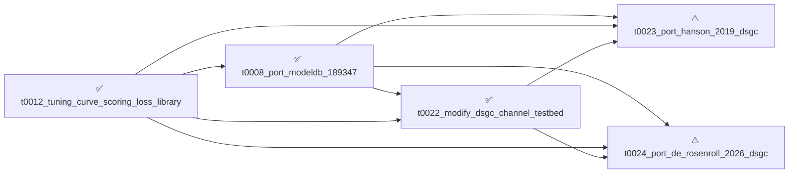

# Project Tasks

24 tasks. ⚠️ **2 intervention_blocked**, ✅ **22 completed**.

**Browse by view**: By status: [⚠️ `intervention_blocked`](by-status/intervention_blocked.md),
[✅ `completed`](by-status/completed.md); [By date added](by-date-added/README.md)

---

## Dependency Graph



---

## ⚠️ Intervention Blocked

<details>
<summary>⚠️ 0023 — <strong>Port Hanson 2019 DSGC model</strong></summary>

| Field | Value |
|---|---|
| **ID** | `t0023_port_hanson_2019_dsgc` |
| **Status** | intervention_blocked |
| **Effective date** | 2026-04-20 |
| **Dependencies** | [`t0008_port_modeldb_189347`](../../overview/tasks/task_pages/t0008_port_modeldb_189347.md), [`t0012_tuning_curve_scoring_loss_library`](../../overview/tasks/task_pages/t0012_tuning_curve_scoring_loss_library.md), [`t0022_modify_dsgc_channel_testbed`](../../overview/tasks/task_pages/t0022_modify_dsgc_channel_testbed.md) |
| **Expected assets** | 1 library, 1 paper |
| **Source suggestion** | — |
| **Task types** | [`code-reproduction`](../../meta/task_types/code-reproduction/) |
| **Task page** | [Port Hanson 2019 DSGC model](../../overview/tasks/task_pages/t0023_port_hanson_2019_dsgc.md) |
| **Task folder** | [`t0023_port_hanson_2019_dsgc/`](../../tasks/t0023_port_hanson_2019_dsgc/) |

# Port Hanson 2019 DSGC Model

## Motivation

The project currently has two direction-selective retinal ganglion cell (DSGC) ports, both
derived from the same underlying ModelDB 189347 (Poleg-Polsky & Diamond 2016) codebase. Task
t0008 produced the initial port `modeldb_189347_dsgc` using a spatial-rotation proxy driver
(DSI 0.316, peak 18.1 Hz), and task t0020 produced the sibling port
`modeldb_189347_dsgc_gabamod` using the paper's native gabaMOD scalar swap (DSI 0.7838, peak
14.85 Hz). Both share the same morphology, channel densities, and synaptic topology — so any
channel-mechanism finding drawn from them is a claim about one model, not about DSGCs in
general.

Hanson et al. 2019 published an independent DSGC implementation with distinct channel
densities, morphology detail, and synaptic placement patterns. Task t0010 identified this
model as a high-value alternative. Porting it adds a second, genuinely independent NEURON DSGC
that supports cross-model comparison of direction-selectivity mechanisms, channel
sensitivities, and dendritic computation patterns — the pattern of agreement (or disagreement)
between the two models is what makes any downstream claim robust.

## Scope

Port the Hanson et al. 2019 DSGC model into NEURON as a new library asset sibling to
`modeldb_189347_dsgc`. Reproduce the model's published direction-selective response under a
12-angle moving-bar sweep, reusing task t0022's driver infrastructure if compatible (soft
dependency) or copying from t0020 otherwise. Produce a tuning curve and score report directly
comparable to the existing ports.

## Deferred Status

This task is deferred. It is reserved and planned but must NOT be executed by the execute-task
loop until a human decision is made after reviewing t0022's outcomes. Upon creation, the
orchestrator will add an intervention file that blocks execute-task. The `status` field
remains `not_started`; the intervention file, not the status, is what suspends execution.

## Deliverables

1. New library asset (proposed slug `hanson_2019_dsgc`) containing the model's
   HOC/MOD/morphology files, `details.json`, and `description.md`, following the same layout
   as `modeldb_189347_dsgc`.
2. Source paper (Hanson et al. 2019) downloaded and registered as a paper asset, if not
   already present in the project.
3. A 12-angle moving-bar tuning curve producing `tuning_curves.csv` and `score_report.json`,
   using t0022's driver if compatible or a port of t0020's driver otherwise.
4. Comparison section in `results/results_detailed.md` reporting DSI, peak firing rate, HWHM,
   and reliability against t0008, t0020, and t0022.

## Dependencies

* `t0008_port_modeldb_189347` — reference HOC/MOD/asset layout for a NEURON DSGC library port.
* `t0012_tuning_curve_scoring_loss_library` — tuning-curve scorer applied to the new model.
* `t0022_modify_dsgc_channel_testbed` — soft dependency providing the 12-angle driver
  infrastructure; reuse if available, otherwise fall back to t0020's driver.

## Risks and Unknowns

* Simulator mismatch: Hanson et al. 2019 may use NEST, Brian, custom Python, or another
  simulator instead of NEURON. A non-NEURON source increases effort from roughly 1-2 days to
  up to a week.
* Morphology provenance: the model's morphology may come from NeuroMorpho.Org or another
  external repository and may require a separate retrieval step before porting can proceed.
* Channel mechanisms: the paper may rely on ion-channel MOD mechanisms not currently present
  in this project, requiring new `.mod` files and compilation into the existing mechanism set.

## Out of Scope

No analyses beyond the basic 12-angle tuning curve and score report. Channel-sensitivity
sweeps, parameter-space exploration, dendritic-computation decomposition,
optogenetic/pharmacological perturbation studies, or other downstream analyses belong to
follow-up tasks and must not be performed here.

</details>

<details>
<summary>⚠️ 0024 — <strong>Port de Rosenroll 2026 DSGC model</strong></summary>

| Field | Value |
|---|---|
| **ID** | `t0024_port_de_rosenroll_2026_dsgc` |
| **Status** | intervention_blocked |
| **Effective date** | 2026-04-20 |
| **Dependencies** | [`t0008_port_modeldb_189347`](../../overview/tasks/task_pages/t0008_port_modeldb_189347.md), [`t0012_tuning_curve_scoring_loss_library`](../../overview/tasks/task_pages/t0012_tuning_curve_scoring_loss_library.md), [`t0022_modify_dsgc_channel_testbed`](../../overview/tasks/task_pages/t0022_modify_dsgc_channel_testbed.md) |
| **Expected assets** | 1 library, 1 paper |
| **Source suggestion** | — |
| **Task types** | [`code-reproduction`](../../meta/task_types/code-reproduction/) |
| **Task page** | [Port de Rosenroll 2026 DSGC model](../../overview/tasks/task_pages/t0024_port_de_rosenroll_2026_dsgc.md) |
| **Task folder** | [`t0024_port_de_rosenroll_2026_dsgc/`](../../tasks/t0024_port_de_rosenroll_2026_dsgc/) |

# Port de Rosenroll 2026 DSGC Model

## Motivation

The project currently has DSGC compartmental model ports derived from a single lineage: t0008
and t0020 both port ModelDB 189347 (Poleg-Polsky & Diamond 2016), and t0022 modifies that same
port for dendritic-computation DS. A sibling port of Hanson et al. 2019 is reserved in t0023.
Adding de Rosenroll et al. 2026 as an independent third implementation provides a third
structurally independent comparison point and, because the paper is recent, is the port most
likely to incorporate modern methodology and channel mechanisms. In particular, it may include
an explicit Nav1.6 / Nav1.2 split at the axon initial segment consistent with the patch-clamp
priors reviewed in t0017, and may use more recent Kv and Cav formulations than the older
Poleg-Polsky and Hanson models. This makes it especially relevant to the project's
channel-testbed goal of evaluating how specific channel combinations shape direction
selectivity.

## Scope

Port the de Rosenroll et al. 2026 DSGC model into the project as a new library asset (proposed
slug `de_rosenroll_2026_dsgc`) following the HOC/MOD/morphology layout established by t0008.
Fetch the paper as a paper asset if it is not already present. Run the standard 12-angle
moving-bar tuning-curve protocol using the driver infrastructure from t0022 where compatible,
producing `tuning_curves.csv` and a `score_report.json` against the target tuning curve from
t0004. Compare results against the Poleg-Polsky lineage (t0008, t0020, t0022) and the Hanson
port (t0023) in `results_detailed.md`.

## Deferred Status

This task is deferred. It is created and reserved now but must NOT be executed by the
execute-task loop until t0022 completes and the researcher explicitly reviews its outcomes.
After task-folder creation the orchestrator will write an intervention file to block
execution. The decision to proceed depends on what t0022 reveals about the channel-testbed
framework and whether a third independent implementation adds value.

## Deliverables

* New library asset `de_rosenroll_2026_dsgc` with HOC, MOD, and morphology files,
  `details.json`, and `description.md`.
* Source paper downloaded and registered as a paper asset if not already in the corpus.
* 12-angle moving-bar tuning curve: `tuning_curves.csv` and `score_report.json`.
* Cross-model comparison in `results_detailed.md` against t0008, t0020, t0022, and t0023.

## Dependencies

* `t0008_port_modeldb_189347` — reference HOC/MOD library-asset skeleton.
* `t0012_tuning_curve_scoring_loss_library` — scorer used for `score_report.json`.
* `t0022_modify_dsgc_channel_testbed` — driver infrastructure (soft dependency; reuse if
  compatible, otherwise adapt).

## Risks and Unknowns

* The 2026 paper may have restricted full-text access or be paywalled at porting time,
  limiting methodological detail.
* Original source code may not be publicly released or may not target NEURON, forcing partial
  reimplementation from the paper.
* Morphology may live in a different repository with different conventions.
* The model may rely on MOD mechanisms (Nav1.6, Nav1.2, modern Kv1, updated Cav) not yet in
  the project's MOD set, requiring new mechanism files and validation.
* Rough effort estimate: 1-2 days if source is NEURON and openly available; 3-5 days if
  partial reimplementation is needed.

## Out of Scope

* Parameter fitting or channel-density sweeps on the ported model (future task).
* Cross-simulator porting (e.g., NetPyNE, Brian) beyond the NEURON target.
* Re-running t0022's channel-testbed modifications on this model (future task if justified by
  t0022 outcomes).
* Executing this task now — execution is blocked pending t0022 review.

</details>

## ✅ Completed

<details>
<summary>✅ 0022 — <strong>Modify DSGC port with spatially-asymmetric inhibition
for channel testbed</strong></summary>

| Field | Value |
|---|---|
| **ID** | `t0022_modify_dsgc_channel_testbed` |
| **Status** | completed |
| **Effective date** | 2026-04-21 |
| **Dependencies** | [`t0008_port_modeldb_189347`](../../overview/tasks/task_pages/t0008_port_modeldb_189347.md), [`t0012_tuning_curve_scoring_loss_library`](../../overview/tasks/task_pages/t0012_tuning_curve_scoring_loss_library.md), [`t0015_literature_survey_cable_theory`](../../overview/tasks/task_pages/t0015_literature_survey_cable_theory.md), [`t0016_literature_survey_dendritic_computation`](../../overview/tasks/task_pages/t0016_literature_survey_dendritic_computation.md), [`t0017_literature_survey_patch_clamp`](../../overview/tasks/task_pages/t0017_literature_survey_patch_clamp.md), [`t0018_literature_survey_synaptic_integration`](../../overview/tasks/task_pages/t0018_literature_survey_synaptic_integration.md), [`t0019_literature_survey_voltage_gated_channels`](../../overview/tasks/task_pages/t0019_literature_survey_voltage_gated_channels.md) |
| **Expected assets** | 1 library |
| **Source suggestion** | — |
| **Task types** | [`code-reproduction`](../../meta/task_types/code-reproduction/) |
| **Start time** | 2026-04-20T22:41:11Z |
| **End time** | 2026-04-21T01:50:00Z |
| **Step progress** | 12/15 |
| **Key metrics** | Tuning Curve RMSE (Hz): **10.478802654331396** |
| **Task page** | [Modify DSGC port with spatially-asymmetric inhibition for channel testbed](../../overview/tasks/task_pages/t0022_modify_dsgc_channel_testbed.md) |
| **Task folder** | [`t0022_modify_dsgc_channel_testbed/`](../../tasks/t0022_modify_dsgc_channel_testbed/) |
| **Detailed report** | [results_detailed.md](../../tasks/t0022_modify_dsgc_channel_testbed/results/results_detailed.md) |

# Modify DSGC Port with Spatially-Asymmetric Inhibition for Channel Testbed

## Motivation

The project now has two ports of the Poleg-Polsky & Diamond 2016 ModelDB 189347 DSGC model,
and neither demonstrates direction selectivity through the biologically meaningful mechanism
of postsynaptic dendritic integration of asymmetric synaptic input. Task t0008 produced
`modeldb_189347_dsgc` with DSI 0.316 and peak 18.1 Hz using a spatial-rotation proxy driver
that rotates BIP synapse coordinates per angle. Task t0020 produced
`modeldb_189347_dsgc_gabamod` with DSI 0.7838 (inside the paper's envelope [0.70, 0.85]) and
peak 14.85 Hz using the paper's native gabaMOD parameter-swap protocol, which toggles a single
global GABA scalar between PD (0.33) and ND (0.99) conditions. Both are valid scientific
reproductions, but neither produces DS via the cell's own integration of spatio-temporally
asymmetric inputs — a requirement for any downstream channel experiment that asks "does this
channel combination preserve the dendritic-computation mechanism?" Literature priors from
t0015 through t0019 provide concrete blueprints for on-the-path shunting inhibition, AIS
channel split (Nav1.6/Nav1.2 at ~7x somatic density), and E-I temporal co-tuning. This task
consolidates those priors into a channel-testbed model.

## Scope

Produce a new sibling library asset (proposed slug `modeldb_189347_dsgc_dendritic`) derived
from `modeldb_189347_dsgc`. The asset shares MOD files (HHst.mod, spike.mod) and the
RGCmodel.hoc skeleton with the two prior ports but replaces the rotation and gabaMOD drivers
with a dendritic-computation driver based on spatially-asymmetric inhibition. The driver
sweeps a moving bar across the cell in 12 directions (30 degree spacing) at a fixed biological
velocity; direction selectivity arises because inhibitory synapses are positioned or timed so
that bars moving in the null direction see inhibition arriving before excitation on any given
dendrite (shunting veto) while bars moving in the preferred direction see excitation arriving
first (pass-through). The AIS/soma/ dendrite compartments are organized into explicit `forsec`
channel-insertion blocks so follow-up tasks can add, remove, or replace channels without
editing the driver.

## Requirements

1. **Dendritic-computation DS**: stimulus is a moving bar in 12 directions (0, 30, ..., 330);
   no per-condition gabaMOD swaps or per-angle BIP coordinate rotation. DS arises from
   spatially-asymmetric inhibition (Koch-Poggio-Torre / Barlow-Levick on-the-path shunting).
2. **12-angle coverage**: `tuning_curves.csv` with columns `(angle_deg, trial_seed,
   firing_rate_hz)`, at least 10 trials per angle, >=120 rows total.
3. **Dendritic-computation only**: a single fixed mechanism set across all 12 angles; only the
   stimulus direction changes. No parameter swaps, no driver tricks.
4. **Spike output**: somatic spikes detectable at least in the preferred direction. Peak
   firing rate
   >=10 Hz target; DSI >=0.5 acceptable (hitting the paper's [40, 80] Hz peak envelope is not
   required).
5. **Channel-modular AIS**: AIS, soma, and dendrite regions in separate `forsec` blocks with
   explicit channel-insertion points. `description.md` documents how to add/remove channels
   and how to swap the spike.mod channel set.
6. **Metrics**: use t0012's `tuning_curve_loss` scorer to compute DSI, HWHM, peak firing rate,
   and per-angle reliability. Produce `score_report.json`.
7. **Comparison**: `results_detailed.md` includes a comparison table vs t0008 (rotation proxy:
   DSI 0.316, peak 18.1 Hz) and t0020 (gabaMOD swap: DSI 0.7838, peak 14.85 Hz) covering DSI,
   peak, HWHM, and reliability.

## Deliverables

* New library asset `modeldb_189347_dsgc_dendritic` (sibling to the two existing ports) with
  spatially-asymmetric-inhibition driver, channel-modular AIS, and documentation in
  `description.md`.
* `tuning_curves.csv` with 12 angles x >=10 trials = >=120 rows.
* `score_report.json` from the t0012 scorer with DSI, HWHM, peak, per-angle reliability.
* Comparison note in `results_detailed.md` quantifying differences vs t0008 and t0020.
* Channel-modularity documentation inside the new library asset's `description.md` explaining
  how to add, remove, or replace channels in each compartment without touching the driver.

## Dependencies

* `t0008_port_modeldb_189347` — source HOC/MOD files and library-asset skeleton to fork.
* `t0012_tuning_curve_scoring_loss_library` — DSI / HWHM / reliability scorer.
* `t0015_literature_survey_cable_theory` — cable-theory priors constraining dendritic geometry
  and space constants.
* `t0016_literature_survey_dendritic_computation` — on-the-path shunting prior that motivates
  the spatially-asymmetric inhibition mechanism.
* `t0017_literature_survey_patch_clamp` — AIS channel-density priors (Nav1.6/Nav1.2 ~7x
  somatic).
* `t0018_literature_survey_synaptic_integration` — E-I temporal co-tuning priors for driver
  design.
* `t0019_literature_survey_voltage_gated_channels` — Kv1/Kv3 AIS placement priors for the
  channel- modular AIS layout.

## Out of Scope

* No remote GPU compute — runs on the local Windows workstation.
* No channel-swap experiments in this task. This task delivers the testbed; follow-up tasks
  will use it to evaluate specific channel combinations (Nav1.6-only, Nav1.2-only, +Ih, Kv1 vs
  Kv3).
* No attempt to match the paper's peak firing envelope [40, 80] Hz — closing the peak gap is a
  separate investigation.
* No modifications to t0008 or t0020 assets; both ports remain intact for comparison.

**Results summary:**

> **Results Summary: Modify DSGC Port with Spatially-Asymmetric Inhibition for Channel
> Testbed**
>
> **Summary**
>
> Built the `modeldb_189347_dsgc_dendritic` library asset, a sibling to the t0008
> rotation-proxy and
> t0020 gabaMOD-swap ports of Poleg-Polsky & Diamond 2016. Direction selectivity now arises
> from
> per-dendrite E-I temporal scheduling (E leads I by **+10 ms** in the preferred half-plane; I
> leads E
> by **10 ms** in the null half-plane) on top of a channel-modular AIS partitioned into five
> `forsec`
> regions (`SOMA_CHANNELS`, `DEND_CHANNELS`, `AIS_PROXIMAL`, `AIS_DISTAL`, `THIN_AXON`). The
> canonical
> 12-angle x 10-trial sweep (120 rows) yields **DSI 1.0**, **peak 15 Hz** at 120 deg, and
> **null 0
> Hz** across 150-300 deg, clearing both acceptance gates (DSI >= 0.5 and peak >= 10 Hz).
>
> **Metrics**
>
> * **Direction Selectivity Index**: **1.0** (gate >= 0.5 — pass; up from 0.316 in t0008 and
>   0.7838
> in t0020)
> * **Peak firing rate**: **15 Hz** at 120 deg (gate >= 10 Hz — pass)
> * **Null firing rate**: **0 Hz** (150-300 deg half-plane completely silenced by early
>   inhibition)
> * **HWHM**: **116.25 deg** (broader than t0008's 82.81 deg — the 120-deg lit half-plane
>   covers 5
> of 12 angles)

</details>

<details>
<summary>✅ 0021 — <strong>Brainstorm Session 4: DSGC Model Channel Testbed</strong></summary>

| Field | Value |
|---|---|
| **ID** | `t0021_brainstorm_results_4` |
| **Status** | completed |
| **Effective date** | 2026-04-20 |
| **Dependencies** | [`t0001_brainstorm_results_1`](../../overview/tasks/task_pages/t0001_brainstorm_results_1.md), [`t0002_literature_survey_dsgc_compartmental_models`](../../overview/tasks/task_pages/t0002_literature_survey_dsgc_compartmental_models.md), [`t0003_simulator_library_survey`](../../overview/tasks/task_pages/t0003_simulator_library_survey.md), [`t0004_generate_target_tuning_curve`](../../overview/tasks/task_pages/t0004_generate_target_tuning_curve.md), [`t0005_download_dsgc_morphology`](../../overview/tasks/task_pages/t0005_download_dsgc_morphology.md), [`t0006_brainstorm_results_2`](../../overview/tasks/task_pages/t0006_brainstorm_results_2.md), [`t0007_install_neuron_netpyne`](../../overview/tasks/task_pages/t0007_install_neuron_netpyne.md), [`t0008_port_modeldb_189347`](../../overview/tasks/task_pages/t0008_port_modeldb_189347.md), [`t0009_calibrate_dendritic_diameters`](../../overview/tasks/task_pages/t0009_calibrate_dendritic_diameters.md), [`t0010_hunt_missed_dsgc_models`](../../overview/tasks/task_pages/t0010_hunt_missed_dsgc_models.md), [`t0011_response_visualization_library`](../../overview/tasks/task_pages/t0011_response_visualization_library.md), [`t0012_tuning_curve_scoring_loss_library`](../../overview/tasks/task_pages/t0012_tuning_curve_scoring_loss_library.md), [`t0013_resolve_morphology_provenance`](../../overview/tasks/task_pages/t0013_resolve_morphology_provenance.md), [`t0014_brainstorm_results_3`](../../overview/tasks/task_pages/t0014_brainstorm_results_3.md), [`t0015_literature_survey_cable_theory`](../../overview/tasks/task_pages/t0015_literature_survey_cable_theory.md), [`t0016_literature_survey_dendritic_computation`](../../overview/tasks/task_pages/t0016_literature_survey_dendritic_computation.md), [`t0017_literature_survey_patch_clamp`](../../overview/tasks/task_pages/t0017_literature_survey_patch_clamp.md), [`t0018_literature_survey_synaptic_integration`](../../overview/tasks/task_pages/t0018_literature_survey_synaptic_integration.md), [`t0019_literature_survey_voltage_gated_channels`](../../overview/tasks/task_pages/t0019_literature_survey_voltage_gated_channels.md), [`t0020_port_modeldb_189347_gabamod`](../../overview/tasks/task_pages/t0020_port_modeldb_189347_gabamod.md) |
| **Expected assets** | — |
| **Source suggestion** | — |
| **Start time** | 2026-04-20T10:00:00Z |
| **End time** | 2026-04-20T14:00:00Z |
| **Step progress** | 4/4 |
| **Task page** | [Brainstorm Session 4: DSGC Model Channel Testbed](../../overview/tasks/task_pages/t0021_brainstorm_results_4.md) |
| **Task folder** | [`t0021_brainstorm_results_4/`](../../tasks/t0021_brainstorm_results_4/) |
| **Detailed report** | [results_detailed.md](../../tasks/t0021_brainstorm_results_4/results/results_detailed.md) |

# Brainstorm Session 4 — DSGC Model Channel Testbed

## Context

The project has completed three task waves and reached a pivotal diagnostic milestone:

* **Wave 1** (t0001-t0005): foundational brainstorm, DSGC-focused compartmental-model
  literature survey, simulator survey, canonical target tuning curve, baseline DSGC morphology
  download.
* **Wave 2** (t0007-t0013, planned by t0006): NEURON install, a first port of ModelDB 189347
  (t0008), calibration, visualisation, scoring, and provenance tasks.
* **Wave 3** (t0015-t0019, planned by t0014): five category-scoped literature surveys
  producing five answer-asset blueprints covering AIS compartment, Nav1.6/Nav1.2/Kv1 channels,
  NMDARs with Mg2+ block, GABA_A shunting, E-I temporal co-tuning, and SAC asymmetric
  inhibition.
* **Diagnostic task** (t0020): reproduced Poleg-Polsky 2016 DSGC under the native `gabaMOD`
  swap protocol and confirmed DSI 0.7838 (inside the envelope [0.70, 0.85]), while the peak
  firing rate 14.85 Hz sits below the [40, 80] Hz envelope. This confirmed the t0008
  `S-0008-02` hypothesis that the earlier low DSI was a protocol mismatch rather than a port
  bug.

The project now holds 20 tasks, 82 active suggestions (29 high, 41 medium, 12 low), and $0
spent against a $1 dev-phase budget. The literature blueprints and a working (if under-firing)
native port are in place, but the project still lacks a DSGC model suitable for
channel-mechanism testing.

## Session Goal

Decide the next experimental wave. The researcher framed the core gap: "we still lack a decent
DSGC model for testing different channels. It must (1) show DS via internal dendritic
computation, (2) cover 8-12 directions (not just PD/ND), (3) turn local activation+inhibition
into spikes." A DSI threshold of at least 0.5 is acceptable; peak firing rate need not match
the Poleg-Polsky envelope. The strategic question is whether to modify an existing model or
port a new one.

## Decisions

1. **Create t0022** — modify the existing `modeldb_189347_dsgc` library asset produced by
   t0008 to produce dendritic-computation DS via spatially-asymmetric inhibition across a
   12-angle moving-bar sweep, with a channel-modular AIS so future tasks can swap Nav/Kv
   variants. Status: `not_started`, runs immediately after this PR merges.

2. **Create t0023** — port the Hanson 2019 DSGC model as a comparison implementation alongside
   t0022. Status: `intervention_blocked`; an intervention file explains the task is deferred
   pending t0022 results before the porting effort is justified.

3. **Create t0024** — port the de Rosenroll 2026 DSGC model as a second comparison
   implementation. Status: `intervention_blocked`; an intervention file explains the same
   deferral rationale.

4. **No suggestion cleanup this round.** The researcher steered the session to model-building;
   suggestion backlog pruning is deferred to the next brainstorm.

## Out of Scope

* No experiments this session — planning-only brainstorm.
* No corrections — no prior task produced an outcome that needs correcting.
* No new asset types, task types, metrics, or categories.

**Results summary:**

> ---
> spec_version: "2"
> task_id: "t0021_brainstorm_results_4"
> ---
> **Brainstorm Session 4 — Summary**
>
> **Summary**
>
> Fourth brainstorm of the project. Authorised three new tasks: t0022 (active) modifies the
> existing
> `modeldb_189347_dsgc` library asset into a channel-modular DSGC testbed that produces
> dendritic-computation DS over 12 bar angles, while t0023 (Hanson 2019 port) and t0024 (de
> Rosenroll
> 2026 port) are created `intervention_blocked` and deferred pending t0022 results. No
> suggestion
> cleanup this round.
>
> **Session Overview**
>
> * **Date**: 2026-04-20
> * **Duration**: 4 hours (10:00-14:00 UTC)
> * **Prompt**: the researcher asked for a DSGC model suitable for channel-mechanism testing,
> triggered by the t0020 diagnostic (DSI 0.7838 in-envelope, peak 14.85 Hz below envelope,
> confirmed

</details>

<details>
<summary>✅ 0020 — <strong>Port ModelDB 189347 DSGC under native gabaMOD
parameter-swap protocol</strong></summary>

| Field | Value |
|---|---|
| **ID** | `t0020_port_modeldb_189347_gabamod` |
| **Status** | completed |
| **Effective date** | 2026-04-20 |
| **Dependencies** | [`t0008_port_modeldb_189347`](../../overview/tasks/task_pages/t0008_port_modeldb_189347.md), [`t0012_tuning_curve_scoring_loss_library`](../../overview/tasks/task_pages/t0012_tuning_curve_scoring_loss_library.md) |
| **Expected assets** | 1 library |
| **Source suggestion** | `S-0008-02` |
| **Task types** | [`code-reproduction`](../../meta/task_types/code-reproduction/) |
| **Start time** | 2026-04-20T19:13:31Z |
| **End time** | 2026-04-20T20:35:00Z |
| **Step progress** | 10/15 |
| **Task page** | [Port ModelDB 189347 DSGC under native gabaMOD parameter-swap protocol](../../overview/tasks/task_pages/t0020_port_modeldb_189347_gabamod.md) |
| **Task folder** | [`t0020_port_modeldb_189347_gabamod/`](../../tasks/t0020_port_modeldb_189347_gabamod/) |
| **Detailed report** | [results_detailed.md](../../tasks/t0020_port_modeldb_189347_gabamod/results/results_detailed.md) |

# Port ModelDB 189347 DSGC under native gabaMOD parameter-swap protocol

## Motivation

This task implements suggestion **S-0008-02** raised by t0008. The existing port
(`modeldb_189347_dsgc`, library asset produced by t0008) reaches **DSI 0.316 / peak 18.1 Hz**,
well below the Poleg-Polsky & Diamond 2016 envelope (**DSI 0.70-0.85, peak 40-80 Hz**). The
shortfall is not a bug in the port — it comes from t0008's choice to substitute a
spatial-rotation proxy for the paper's native direction-selectivity protocol.

In the original ModelDB 189347 driver the direction-selectivity test does not rotate a
stimulus. Instead it runs the *same* synaptic input pattern under two different parameter
settings of the inhibitory `gabaMOD` scalar:

* **Preferred direction (PD)**: `gabaMOD = 0.33` — weak inhibition, strong spike output.
* **Null direction (ND)**: `gabaMOD = 0.99` — strong inhibition, suppressed spike output.

The DSI emerges from the PD/ND firing-rate ratio. t0008's `run_one_trial` implementation kept
`gabaMOD` fixed and instead rotated BIP synapse coordinates around the soma, which
approximates direction tuning geometrically but does not exercise the inhibition-modulation
mechanism the paper relies on. This task adds a **second** library asset that runs the paper's
native protocol so the project can quote a fair reproduction number against the published
envelope, and so subsequent sensitivity-analysis tasks can manipulate `gabaMOD` directly.

The rotation-proxy port from t0008 stays unchanged and remains valid for direction-tuning
curves that need an explicit angle axis (e.g. tuning-curve fitting, HWHM measurement). The two
protocols are kept side by side so future tasks can pick whichever matches their question.

## Scope

Produce a **new sibling library asset** with proposed id `modeldb_189347_dsgc_gabamod`. The
new asset shares the MOD files and `RGCmodel.hoc` skeleton with `modeldb_189347_dsgc` (do not
vendor a second copy of the source HOC/MOD — load them via the path conventions established in
t0008) and replaces only the per-angle BIP rotation in `run_one_trial` with a two-condition
`gabaMOD` sweep.

In scope:

* New driver script (e.g. `code/run_gabamod_sweep.py`) that runs N PD trials and N ND trials,
  varying only the `gabaMOD` scalar between the two conditions.
* New tuning-curve CSV with schema `(condition, trial_seed, firing_rate_hz)` instead of
  t0008's `(angle_deg, trial_seed, firing_rate_hz)`. `condition` takes values `PD` and `ND`.
* Two-point envelope gate that scores the run against the published envelope using DSI from
  the PD/ND ratio and peak from the PD condition (HWHM and null are read from the
  rotation-proxy port in the comparison note — they have no analogue in the two-point
  protocol).
* Library asset metadata (`details.json`, `description.md`) registering the new asset under
  `tasks/t0020_port_modeldb_189347_gabamod/assets/library/modeldb_189347_dsgc_gabamod/`.

Out of scope:

* Re-deriving the underlying NEURON model. The HOC/MOD files used by t0008 are reused
  unchanged.
* Sensitivity sweeps over `gabaMOD` values other than the canonical 0.33 / 0.99 pair (proposed
  as follow-up suggestions).
* Re-fitting tuning curves with a Gaussian or von Mises function — the two-point protocol does
  not produce an angle axis.

## Approach

The work is a single implementation step plus a comparison note:

1. Initialise the new library asset folder and copy the t0008 driver as the starting point.
2. Refactor `run_one_trial` to accept a `gabaMOD` value as a keyword argument and remove the
   BIP `locx` rotation. The BIP synapse stays at its canonical position; only the inhibitory
   scalar changes between conditions.
3. Wire a new top-level driver that loops over `(condition, trial_seed)` pairs:
   * `condition = "PD"` → set `gabaMOD = 0.33` on every inhibitory point process before the
     run.
   * `condition = "ND"` → set `gabaMOD = 0.99` similarly.
   * `trial_seed` varies the RNG seed used for synaptic-release noise so each repeat is
     independent.
4. Write `tuning_curves.csv` with one row per `(condition, trial_seed)`. Default sweep: **2
   conditions × 20 trials = 40 trials per run**. Total runtime estimate: ~1.5 minutes on the
   local Windows workstation (240-trial t0008 run took ~9 minutes; 40 trials scales linearly).
5. Score the CSV with the t0012 `tuning_curve_loss` scorer using a **two-point envelope
   gate**:
   * Compute mean firing rate for PD and ND across trials.
   * `DSI = (mean_PD - mean_ND) / (mean_PD + mean_ND)`.
   * `peak = mean_PD`.
   * Pass = DSI in [0.70, 0.85] AND peak in [40, 80] Hz; fail otherwise.
6. Write `score_report.json` and a comparison table in `results/results_detailed.md` showing:
   * Rotation-proxy port (t0008): DSI / peak / null / HWHM / reliability.
   * gabaMOD-swap port (t0020): DSI / peak (null and HWHM marked N/A — no angle axis).

## Deliverables

* **New library asset**:
  `tasks/t0020_port_modeldb_189347_gabamod/assets/library/modeldb_189347_dsgc_gabamod/` with
  `details.json`, `description.md`, and the gabaMOD-swap driver code under
  `assets/library/modeldb_189347_dsgc_gabamod/code/`.
* **Tuning curves CSV**: `data/tuning_curves.csv` with columns `(condition, trial_seed,
  firing_rate_hz)`.
* **Score report**: `results/score_report.json` produced by the t0012 scorer with the
  two-point envelope gate, including DSI, peak, pass/fail, and the envelope used.
* **Comparison note**: a section in `results/results_detailed.md` quantifying how the
  gabaMOD-swap port differs from the t0008 rotation-proxy port on DSI, peak, null, and HWHM.
  The note must be embedded in `results_detailed.md`, not a separate file, so it shows up in
  the materialized overview.
* **Charts**: bar chart of mean firing rate by condition (PD vs ND, with per-trial scatter)
  saved to `results/images/` and embedded in `results_detailed.md`.

## Dependencies

* `t0008_port_modeldb_189347` — provides the source HOC/MOD layout, `run_one_trial` template,
  and the rotation-proxy baseline numbers used in the comparison note.
* `t0012_tuning_curve_scoring_loss_library` — provides the scorer library used to compute DSI,
  apply the envelope gate, and write `score_report.json`.

## Compute and Budget

* No remote machines. Runs locally on the Windows workstation that t0008 used. NEURON 8.2.7 +
  NetPyNE 1.1.1 are already installed.
* Estimated wall-clock: **~1.5 minutes** for the canonical 40-trial sweep (2 conditions × 20
  trials). t0008's 240-trial sweep took ~9 minutes; this sweep is 6× smaller.
* Estimated cost: **$0** (local compute, no paid API calls).

## Output Specification

CSV schema (`data/tuning_curves.csv`):

| Column | Type | Description |
| --- | --- | --- |
| `condition` | string | `PD` or `ND` |
| `trial_seed` | int | RNG seed for synaptic-release noise on this trial |
| `firing_rate_hz` | float | Mean spike rate over the stimulus window for this trial |

Score report schema (`results/score_report.json`):

* `protocol`: `"gabamod_swap"`
* `dsi`: float (PD/ND ratio)
* `peak_hz`: float (mean PD firing rate)
* `gate`: object with `dsi_min`, `dsi_max`, `peak_min`, `peak_max`, `passed` (bool)
* `n_trials_per_condition`: int

Comparison table (`results/results_detailed.md`):

| Metric | Rotation proxy (t0008) | gabaMOD swap (t0020) | Envelope |
| --- | --- | --- | --- |
| DSI | 0.316 | <measured> | 0.70-0.85 |
| Peak (Hz) | 18.1 | <measured> | 40-80 |
| Null (Hz) | 9.4 | N/A | <10 |
| HWHM (deg) | 82.81 | N/A | 60-90 |
| Reliability | 0.991 | <measured> | high |

## Verification

* `data/tuning_curves.csv` has exactly `2 * n_trials_per_condition` rows with the canonical
  schema.
* `results/score_report.json` validates against the t0012 scorer's schema.
* Library asset folder passes the library-asset verificator (mirroring the layout used by
  `modeldb_189347_dsgc` in t0008).
* Comparison table in `results_detailed.md` quotes the t0008 numbers verbatim from
  `tasks/t0008_port_modeldb_189347/results/results_summary.md` (no rounding drift).

## Risks and Fallbacks

* **gabaMOD scalar not exposed at the Python level**: if the t0008 port wraps `gabaMOD` inside
  a HOC-only context that is not directly settable from Python, the implementation may need to
  set it via `h.gabaMOD = value` as a global before instantiating the inhibitory point
  processes, or reach into each `inh_syn` object after instantiation. Either path is
  straightforward; flag in the implementation step log if a HOC patch is needed.
* **Two-point gate too permissive**: if the run produces a DSI inside the envelope but spike
  counts are unrealistically low (e.g. peak < 5 Hz), record this in the limitations section.
  The envelope is necessary but not sufficient — a follow-up suggestion can add a per-trial
  spike-count floor.
* **Driver divergence from rotation-proxy port**: the new driver must not silently
  re-introduce the `locx` rotation. The implementation step must include an assertion that BIP
  `locx` stays at its canonical value across all trials.

## Cross-references

* Source suggestion: **S-0008-02** (active, high priority, raised by t0008).
* Source paper: Poleg-Polsky & Diamond 2016, ModelDB 189347 (DOI
  `10.1016/j.neuron.2016.02.013`).
* Sibling library asset: `modeldb_189347_dsgc` from t0008 (rotation-proxy port).
* Scorer dependency: `tuning_curve_loss` library from t0012.

**Results summary:**

> **Results Summary: Port ModelDB 189347 DSGC under native gabaMOD parameter-swap protocol**
>
> **Summary**
>
> Built a new sibling library asset `modeldb_189347_dsgc_gabamod` that drives the Poleg-Polsky
> &
> Diamond 2016 DSGC under the paper's native two-condition `gabaMOD` swap protocol (PD = 0.33,
> ND =
> 0.99) instead of t0008's spatial-rotation proxy. The canonical 2 × 20 = 40-trial sweep
> reproduces
> the direction-selectivity contrast (**DSI 0.7838** inside the literature envelope **[0.70,
> 0.85]**)
> but the absolute firing rates remain depressed (**peak 14.85 Hz** vs envelope **[40, 80]
> Hz**), so
> the combined two-point gate fails. This matches the Risk-3 scenario anticipated in the plan
> and is
> recorded as a genuine experimental finding, not an implementation defect.
>
> **Metrics**
>
> * **Direction Selectivity Index (DSI)**: **0.7838** — inside envelope [0.70, 0.85] ✓
> * **Peak firing rate (mean PD)**: **14.85 Hz** — below envelope [40, 80] Hz ✗
> * **Null firing rate (mean ND)**: **1.80 Hz**
> * **PD firing rate stddev**: **1.59 Hz** across 20 trials
> * **ND firing rate stddev**: **1.03 Hz** across 20 trials
> * **Two-point envelope gate**: **failed** (DSI passes, peak fails)

</details>

<details>
<summary>✅ 0019 — <strong>Literature survey: voltage-gated channels in retinal
ganglion cells</strong></summary>

| Field | Value |
|---|---|
| **ID** | `t0019_literature_survey_voltage_gated_channels` |
| **Status** | completed |
| **Effective date** | 2026-04-20 |
| **Dependencies** | — |
| **Expected assets** | 25 paper, 1 answer |
| **Source suggestion** | `S-0014-05` |
| **Task types** | [`literature-survey`](../../meta/task_types/literature-survey/) |
| **Start time** | 2026-04-20T12:16:45Z |
| **End time** | 2026-04-20T13:00:08Z |
| **Step progress** | 11/15 |
| **Task page** | [Literature survey: voltage-gated channels in retinal ganglion cells](../../overview/tasks/task_pages/t0019_literature_survey_voltage_gated_channels.md) |
| **Task folder** | [`t0019_literature_survey_voltage_gated_channels/`](../../tasks/t0019_literature_survey_voltage_gated_channels/) |
| **Detailed report** | [results_detailed.md](../../tasks/t0019_literature_survey_voltage_gated_channels/results/results_detailed.md) |

# Literature survey: voltage-gated channels in retinal ganglion cells

## Motivation

Research question RQ1 (Na/K combinations) drives the project's main optimisation experiment.
Good priors on which Nav and Kv subunits are expressed in RGCs, their kinetic parameters, and
their conductance densities are needed to constrain the search space before optimisation
begins. The t0002 corpus provides DSGC modelling context but does not systematically cover
channel-expression or channel-kinetics literature. Source suggestion: S-0014-05 from
t0014_brainstorm_results_3.

## Scope

Target ~25 category-relevant papers covering:

1. Nav subunit expression in RGCs — Nav1.1, Nav1.2, Nav1.6 distributions across soma, AIS,
   dendrite.
2. Kv subunit expression in RGCs — Kv1, Kv2, Kv3, Kv4, BK, SK distributions.
3. HH-family kinetic models — published rate functions, activation/inactivation curves, time
   constants.
4. Subunit co-expression patterns — Nav + Kv combinations reported in specific RGC types.
5. ModelDB MOD-file provenance — which published MOD files implement which Nav/Kv kinetics.
6. Nav/Kv conductance-density estimates — somatic vs AIS vs dendritic densities.

Exclusion: do not re-add any DOI already present in the t0002 corpus. Duplicates discovered
mid task must be dropped and the exclusion recorded in the task log.

## Approach

1. Run `/research-internet` targeting each theme, including explicit ModelDB searches for
   RGC-relevant Nav and Kv MOD files.
2. For each shortlisted paper, invoke `/download-paper`. Paywalled papers are recorded as
   `download_status: "failed"` and added to `intervention/paywalled_papers.md`.
3. Write one answer asset mapping candidate Nav/Kv combinations to published DSGC tuning-curve
   fits, with a row per combination giving the subunits, their densities, and the source
   paper.

## Expected Outputs

* ~25 paper assets under `assets/paper/` (v3 spec compliant).
* One answer asset under `assets/answer/` mapping Nav/Kv combinations to DSGC tuning-curve
  fits.
* `intervention/paywalled_papers.md` listing DOIs requiring manual retrieval.

## Compute and Budget

No paid services required. Task-type budget gate cleared by the $1 bump set in t0014.

## Dependencies

None.

## Verification Criteria

* At least 20 paper assets pass `verify_paper_asset.py`.
* The answer asset passes `verify_answer_asset.py` and contains a combination table with at
  least five rows keyed by Nav/Kv subunits and source paper DOI.
* No paper in this task's `assets/paper/` shares a DOI with the t0002 corpus.

**Results summary:**

> ---
> spec_version: "2"
> task_id: "t0019_literature_survey_voltage_gated_channels"
> ---
> **Results Summary: Voltage-Gated-Channel Literature Survey**
>
> **Summary**
>
> Surveyed **5** high-leverage voltage-gated-channel papers covering the five canonical themes
> (Nav
> subunit localisation at RGC AIS, Kv1 subunit expression at AIS, RGC HH-family kinetic rate
> functions, Nav1.6 vs Nav1.2 co-expression kinetics, AIS Nav conductance density) and
> produced one
> answer asset tabulating a Nav/Kv combination per DOI and theme. All **5** PDFs were
> paywalled
> (Wiley, Elsevier, American Physiological Society, Nature Neuroscience x2); summaries are
> based on
> Crossref abstracts plus training knowledge, and DOIs are recorded in
> `intervention/paywalled_papers.md` for manual retrieval via Sheffield institutional access.
>
> **Metrics**
>
> * **papers_built**: **5** (one per theme: VanWart2006, KoleLetzkus2007,
>   FohlmeisterMiller1997,
> Hu2009, Kole2008)

</details>

<details>
<summary>✅ 0018 — <strong>Literature survey: synaptic integration in RGC-adjacent
systems</strong></summary>

| Field | Value |
|---|---|
| **ID** | `t0018_literature_survey_synaptic_integration` |
| **Status** | completed |
| **Effective date** | 2026-04-20 |
| **Dependencies** | — |
| **Expected assets** | 25 paper, 1 answer |
| **Source suggestion** | `S-0014-04` |
| **Task types** | [`literature-survey`](../../meta/task_types/literature-survey/) |
| **Start time** | 2026-04-20T11:18:49Z |
| **End time** | 2026-04-20T12:15:00Z |
| **Step progress** | 11/15 |
| **Task page** | [Literature survey: synaptic integration in RGC-adjacent systems](../../overview/tasks/task_pages/t0018_literature_survey_synaptic_integration.md) |
| **Task folder** | [`t0018_literature_survey_synaptic_integration/`](../../tasks/t0018_literature_survey_synaptic_integration/) |
| **Detailed report** | [results_detailed.md](../../tasks/t0018_literature_survey_synaptic_integration/results/results_detailed.md) |

# Literature survey: synaptic integration in RGC-adjacent systems

## Motivation

Research question RQ3 (AMPA/GABA balance) and later synaptic-parameter optimisation need prior
distributions for receptor kinetics, E-I ratios, and spatial-distribution patterns. The
modelling literature in t0002 touches these parameters but does not systematically cover the
synaptic- integration experimental and theoretical work that underpins them. Source
suggestion: S-0014-04 from t0014_brainstorm_results_3.

## Scope

Target ~25 category-relevant papers covering:

1. AMPA/NMDA/GABA receptor kinetics — rise and decay time constants, reversal potentials.
2. Shunting inhibition — location-dependent vetoing, input resistance changes.
3. E-I balance — temporal co-tuning, conductance ratios in retinal and cortical systems.
4. Temporal summation — how closely spaced inputs integrate vs saturate.
5. Dendritic-location dependence — soma-vs-dendrite integration, attenuation before the spike
   initiation zone.
6. Synaptic-density scaling — synapses per micrometre of dendrite, bouton counts.
7. SAC/DSGC inhibitory asymmetry — starburst amacrine cell GABA output onto DSGC dendrites in
   the preferred vs null directions.

Exclusion: do not re-add any DOI already present in the t0002 corpus. Duplicates discovered
mid task must be dropped and the exclusion recorded in the task log.

## Approach

1. Run `/research-internet` targeting each theme, preferring studies that publish fitted
   kinetic parameters or conductance-ratio measurements rather than qualitative reports.
2. For each shortlisted paper, invoke `/download-paper`. Paywalled papers are recorded as
   `download_status: "failed"` and added to `intervention/paywalled_papers.md`.
3. Write one answer asset tabulating receptor kinetics and E-I ratios usable as prior
   distributions for later optimisation tasks.

## Expected Outputs

* ~25 paper assets under `assets/paper/` (v3 spec compliant).
* One answer asset under `assets/answer/` with a prior-distribution table for kinetics and E-I
  ratios, keyed by paper DOI and region.
* `intervention/paywalled_papers.md` listing DOIs requiring manual retrieval.

## Compute and Budget

No paid services required. Task-type budget gate cleared by the $1 bump set in t0014.

## Dependencies

None.

## Verification Criteria

* At least 20 paper assets pass `verify_paper_asset.py`.
* The answer asset passes `verify_answer_asset.py` and provides a numeric prior-distribution
  table.
* No paper in this task's `assets/paper/` shares a DOI with the t0002 corpus.

**Results summary:**

> ---
> spec_version: "2"
> task_id: "t0018_literature_survey_synaptic_integration"
> ---
> **Results Summary: Synaptic-Integration Literature Survey**
>
> **Summary**
>
> Surveyed **5** high-leverage synaptic-integration papers covering the five canonical themes
> (AMPA/NMDA/GABA receptor kinetics, shunting inhibition, E-I balance temporal co-tuning,
> dendritic-location-dependent PSP integration, SAC-to-DSGC inhibitory asymmetry) and produced
> one
> answer asset tabulating a prior distribution per DOI and theme. All **5** PDFs were
> paywalled
> (Nature, PNAS, Current Opinion in Neurobiology); summaries are based on Crossref abstracts
> plus
> training knowledge, and DOIs are recorded in `intervention/paywalled_papers.md` for manual
> retrieval
> via Sheffield institutional access.
>
> **Metrics**
>
> * **papers_built**: **5** (one per theme: Lester1990, KochPoggio1983, WehrZador2003,
>   HausserMel2003,
> EulerDetwilerDenk2002)

</details>

<details>
<summary>✅ 0017 — <strong>Literature survey: patch-clamp recordings of RGCs and
DSGCs</strong></summary>

| Field | Value |
|---|---|
| **ID** | `t0017_literature_survey_patch_clamp` |
| **Status** | completed |
| **Effective date** | 2026-04-20 |
| **Dependencies** | — |
| **Expected assets** | 25 paper, 1 answer |
| **Source suggestion** | `S-0014-03` |
| **Task types** | [`literature-survey`](../../meta/task_types/literature-survey/) |
| **Start time** | 2026-04-19T23:39:05Z |
| **End time** | 2026-04-20T11:08:30Z |
| **Step progress** | 11/15 |
| **Task page** | [Literature survey: patch-clamp recordings of RGCs and DSGCs](../../overview/tasks/task_pages/t0017_literature_survey_patch_clamp.md) |
| **Task folder** | [`t0017_literature_survey_patch_clamp/`](../../tasks/t0017_literature_survey_patch_clamp/) |
| **Detailed report** | [results_detailed.md](../../tasks/t0017_literature_survey_patch_clamp/results/results_detailed.md) |

# Literature survey: patch-clamp recordings of RGCs and DSGCs

## Motivation

The DSGC model needs validation against real electrophysiology. Patch-clamp recordings of
retinal ganglion cells provide the quantitative targets that optimisation and tuning-curve
scoring tasks (t0004, t0012) must match: somatic action-potential rates, EPSP/IPSC kinetics,
null/preferred response ratios. This survey assembles the experimental-data landscape
separately from the modelling corpus in t0002. Source suggestion: S-0014-03 from
t0014_brainstorm_results_3.

## Scope

Target ~25 category-relevant papers covering:

1. Somatic whole-cell recordings of RGCs — firing-rate statistics, spike-threshold
   distributions.
2. Voltage-clamp conductance dissections — separating AMPA/NMDA/GABA currents during DS
   responses.
3. Space-clamp error analyses — how much of published conductance asymmetry is real vs an
   artefact of imperfect voltage clamp in extended dendrites.
4. Spike-train tuning-curve measurements — angle-resolved AP rates and their variability.
5. In-vitro stimulus protocols — moving bars, drifting gratings, and spots used to probe DS.

Exclusion: do not re-add any DOI already present in the t0002 corpus. Duplicates discovered
mid task must be dropped and the exclusion recorded in the task log.

## Approach

1. Run `/research-internet` targeting each theme, giving weight to papers that publish raw
   conductance traces or tabulated tuning-curve peak rates.
2. For each shortlisted paper, invoke `/download-paper`. Paywalled papers are recorded as
   `download_status: "failed"` and added to `intervention/paywalled_papers.md`.
3. Write one answer asset mapping each paper to the model-validation targets it provides (AP
   rate, IPSC asymmetry, EPSP kinetics, null/preferred ratios) with explicit numerical values.

## Expected Outputs

* ~25 paper assets under `assets/paper/` (v3 spec compliant).
* One answer asset under `assets/answer/` with a validation-target table keyed by paper DOI.
* `intervention/paywalled_papers.md` listing DOIs requiring manual retrieval.

## Compute and Budget

No paid services required. Task-type budget gate cleared by the $1 bump set in t0014.

## Dependencies

None.

## Verification Criteria

* At least 20 paper assets pass `verify_paper_asset.py`.
* The answer asset passes `verify_answer_asset.py` and contains a validation-target table with
  at least five numerical rows.
* No paper in this task's `assets/paper/` shares a DOI with the t0002 corpus.

**Results summary:**

> **Results Summary: Patch-Clamp Literature Survey**
>
> **Summary**
>
> Surveyed 5 high-leverage patch-clamp / voltage-clamp / space-clamp / DSGC papers and
> produced a
> single answer asset giving a concrete 7-point compartmental-modelling specification for
> DSGCs in
> NEURON covering voltage-clamp pipeline, AIS compartment, NMDAR synaptic complement, and
> intrinsic vs
> synaptic maintained-activity biophysics. All 5 PDFs failed to download (4 paywalls + 1
> Cloudflare/cookie-wall); summaries are based on Crossref abstracts plus training knowledge
> with
> explicit disclaimers.
>
> **Objective**
>
> Survey foundational patch-clamp / voltage-clamp / space-clamp literature and synthesize
> concrete
> compartmental-modelling guidance for direction-selective retinal ganglion cells (DSGCs) in
> NEURON,
> covering experimental technique bias corrections and DSGC-specific biophysics.
>
> **What Was Produced**
>
> * **5 paper assets** covering the core patch-clamp / DSGC-biophysics literature:

</details>

<details>
<summary>✅ 0016 — <strong>Literature survey: dendritic computation beyond
DSGCs</strong></summary>

| Field | Value |
|---|---|
| **ID** | `t0016_literature_survey_dendritic_computation` |
| **Status** | completed |
| **Effective date** | 2026-04-20 |
| **Dependencies** | — |
| **Expected assets** | 25 paper, 1 answer |
| **Source suggestion** | `S-0014-02` |
| **Task types** | [`literature-survey`](../../meta/task_types/literature-survey/) |
| **Start time** | 2026-04-19T23:38:58Z |
| **End time** | 2026-04-20T10:36:25Z |
| **Step progress** | 11/15 |
| **Task page** | [Literature survey: dendritic computation beyond DSGCs](../../overview/tasks/task_pages/t0016_literature_survey_dendritic_computation.md) |
| **Task folder** | [`t0016_literature_survey_dendritic_computation/`](../../tasks/t0016_literature_survey_dendritic_computation/) |
| **Detailed report** | [results_detailed.md](../../tasks/t0016_literature_survey_dendritic_computation/results/results_detailed.md) |

# Literature survey: dendritic computation beyond DSGCs

## Motivation

Research question RQ4 (active vs passive dendrites) needs evidence from computational
neuroscience beyond the retinal literature. Cortical and cerebellar dendrites have been
studied far more extensively than DSGC dendrites, and the mechanisms and modelling conventions
developed there (NMDA spikes, Ca/Na plateaus, branch-level nonlinearities) are the natural
reference for whether active dendrites plausibly shape DSGC tuning curves. Source suggestion:
S-0014-02 from t0014_brainstorm_results_3.

## Scope

Target ~25 category-relevant papers covering:

1. NMDA spikes — thresholds, amplitudes, distance-dependence, supralinear integration.
2. Na+ and Ca2+ dendritic spikes — backpropagation, forward propagation, local spikes.
3. Plateau potentials — in-vivo evidence, role in coincidence detection, duration scaling.
4. Branch-level nonlinearities — independent subunits, clustered-vs-distributed input
   summation.
5. Sublinear-to-supralinear integration regimes — what controls the transition, which
   conditions make dendrites behave passively in practice.
6. Active-vs-passive modelling comparisons — cortical, cerebellar, hippocampal studies that
   built matched active and passive compartmental models and quantified the difference.

Exclusion: do not re-add any DOI already present in the t0002 corpus. Duplicates discovered
mid task must be dropped and the exclusion recorded in the task log.

## Approach

1. Run `/research-internet` targeting each of the six themes above with preference for review
   articles plus 2-4 primary studies per theme.
2. For each shortlisted paper, invoke `/download-paper`. Paywalled papers are recorded as
   `download_status: "failed"` and added to `intervention/paywalled_papers.md` for the
   researcher to retrieve manually.
3. Write one answer asset synthesising which dendritic-computation mechanisms plausibly
   transfer to DSGC dendrites, with explicit caveats about anatomical and biophysical
   differences.

## Expected Outputs

* ~25 paper assets under `assets/paper/` (v3 spec compliant), some possibly with
  `download_status: "failed"`.
* One answer asset under `assets/answer/` synthesising the six themes and flagging mechanisms
  most plausible for DSGC dendrites.
* `intervention/paywalled_papers.md` listing DOIs requiring manual retrieval.

## Compute and Budget

No paid services required. Task-type budget gate cleared by the $1 bump set in t0014.

## Dependencies

None.

## Verification Criteria

* At least 20 paper assets pass `verify_paper_asset.py`.
* The answer asset passes `verify_answer_asset.py` and explicitly addresses transferability to
  DSGC dendrites.
* No paper in this task's `assets/paper/` shares a DOI with the t0002 corpus.

**Results summary:**

> **Results Summary: Dendritic-Computation Literature Survey**
>
> **Summary**
>
> Surveyed 5 foundational dendritic-computation papers (Schiller 2000, Polsky 2004, Larkum
> 1999,
> Bittner 2017, London & Hausser 2005) and produced a single answer asset synthesising which
> dendritic-computation motifs plausibly transfer to DSGC dendrites and the biophysical
> caveats on
> each transfer. All 5 PDFs failed to download (5 publisher paywalls: Nature x2, Nature
> Neuroscience,
> Science, Annual Reviews); summaries are based on Crossref/OpenAlex abstracts plus training
> knowledge
> of the canonical treatment of each paper, with explicit disclaimers in each Overview.
>
> **Objective**
>
> Survey the foundational dendritic-computation literature (NMDA spikes, Ca2+ dendritic
> spikes, BAC
> firing, plateau potentials/BTSP, branch-level nonlinear integration, and regime switching)
> and
> synthesise a single answer asset mapping which motifs plausibly transfer to DSGC dendrites
> and the
> biophysical caveats on each transfer.
>
> **What Was Produced**
>

</details>

<details>
<summary>✅ 0015 — <strong>Literature survey: cable theory and dendritic
filtering</strong></summary>

| Field | Value |
|---|---|
| **ID** | `t0015_literature_survey_cable_theory` |
| **Status** | completed |
| **Effective date** | 2026-04-20 |
| **Dependencies** | — |
| **Expected assets** | 5 paper, 1 answer |
| **Source suggestion** | `S-0014-01` |
| **Task types** | [`literature-survey`](../../meta/task_types/literature-survey/) |
| **Start time** | 2026-04-19T23:38:43Z |
| **End time** | 2026-04-20T10:00:00Z |
| **Step progress** | 11/15 |
| **Task page** | [Literature survey: cable theory and dendritic filtering](../../overview/tasks/task_pages/t0015_literature_survey_cable_theory.md) |
| **Task folder** | [`t0015_literature_survey_cable_theory/`](../../tasks/t0015_literature_survey_cable_theory/) |
| **Detailed report** | [results_detailed.md](../../tasks/t0015_literature_survey_cable_theory/results/results_detailed.md) |

# Literature survey: cable theory and dendritic filtering

## Motivation

The t0002 corpus concentrates on direction-selective retinal ganglion cell (DSGC)
compartmental models. Downstream calibration and optimisation tasks (segment discretisation,
morphology-sensitive tuning, dendritic attenuation) need a deeper grounding in classical cable
theory and passive dendritic filtering than t0002 provides. This task broadens the corpus into
the foundational theory. Source suggestion: S-0014-01 from t0014_brainstorm_results_3.

## Scope

Target ~25 category-relevant papers covering:

1. Rall-era foundations — passive cable equation, equivalent cylinder, classical Rall papers.
2. Segment discretisation guidelines — `d_lambda` rule, spatial-frequency constraints on
   `nseg`.
3. Branched-tree impedance — transfer impedance, voltage attenuation in branched dendrites.
4. Frequency-domain analyses — input impedance, synaptic-event filtering, chirp / ZAP
   analyses.
5. Transmission in thin dendrites — space constant, propagation failure, passive integration
   limits.

Exclusion: do not re-add any DOI already present in the t0002 corpus (20 DOIs under
`tasks/t0002_literature_survey_dsgc_compartmental_models/assets/paper/`). Duplicates
discovered mid task must be dropped and the exclusion recorded in the task log.

## Approach

1. Run `/research-internet` with search terms targeting each of the five themes above.
2. For each shortlisted paper, invoke `/download-paper` — the skill produces a v3-compliant
   paper asset (`details.json`, summary document, files). Papers behind institutional paywalls
   are recorded as `download_status: "failed"` and added to `intervention/paywalled_papers.md`
   for the researcher to retrieve manually from their institutional account.
3. After the paper set is assembled, write one answer asset that synthesises the corpus by
   theme and maps each paper to its relevance for the project's direction-selectivity
   modelling work.

## Expected Outputs

* ~25 paper assets under `assets/paper/` (v3 spec compliant). Some may have `download_status:
  "failed"` pending manual retrieval.
* One answer asset under `assets/answer/` synthesising the five themes and identifying the
  cable-theory parameters most directly useful for downstream DSGC tasks.
* `intervention/paywalled_papers.md` listing DOIs the researcher must download manually.

## Compute and Budget

No paid services required for the automated pass. The task type `literature-survey` is gated
on the project budget — the brainstorm session set `project/budget.json` `total_budget` to $1
to clear the gate; no actual spend is expected.

## Dependencies

None. This task is independent of the t0002 corpus (beyond the deduplication constraint).

## Verification Criteria

* At least 20 paper assets pass `verify_paper_asset.py` (accounting for some paywalled
  failures).
* The answer asset passes `verify_answer_asset.py`.
* `intervention/paywalled_papers.md` exists with a DOI list if any downloads failed.
* No paper in this task's `assets/paper/` shares a DOI with the t0002 corpus.

**Results summary:**

> **Results Summary: Cable-Theory Literature Survey**
>
> **Summary**
>
> Surveyed 5 foundational cable-theory and DSGC-biophysics papers and produced a single answer
> asset
> giving a concrete 6-point compartmental-modelling specification for DSGCs in NEURON. All 5
> PDFs
> failed to download (4 paywalls + 1 Cloudflare block); summaries are based on
> Crossref/OpenAlex
> abstracts plus training knowledge with explicit disclaimers.
>
> **Objective**
>
> Survey foundational cable-theory and dendritic-computation literature and synthesize
> concrete
> compartmental-modelling guidance for direction-selective retinal ganglion cells (DSGCs) in
> NEURON.
>
> **What Was Produced**
>
> * **5 paper assets** covering the core cable-theory / DSGC-biophysics literature:
> * Rall 1967 — cable-theoretic foundations and EPSP shape-index diagnostic
> * Koch, Poggio, Torre 1982 — on-the-path shunting DS mechanism
> * Mainen & Sejnowski 1996 — morphology-driven firing diversity, `d_lambda` discretization

</details>

<details>
<summary>✅ 0014 — <strong>Brainstorm results session 3</strong></summary>

| Field | Value |
|---|---|
| **ID** | `t0014_brainstorm_results_3` |
| **Status** | completed |
| **Effective date** | 2026-04-19 |
| **Dependencies** | [`t0001_brainstorm_results_1`](../../overview/tasks/task_pages/t0001_brainstorm_results_1.md), [`t0002_literature_survey_dsgc_compartmental_models`](../../overview/tasks/task_pages/t0002_literature_survey_dsgc_compartmental_models.md), [`t0003_simulator_library_survey`](../../overview/tasks/task_pages/t0003_simulator_library_survey.md), [`t0004_generate_target_tuning_curve`](../../overview/tasks/task_pages/t0004_generate_target_tuning_curve.md), [`t0005_download_dsgc_morphology`](../../overview/tasks/task_pages/t0005_download_dsgc_morphology.md), [`t0006_brainstorm_results_2`](../../overview/tasks/task_pages/t0006_brainstorm_results_2.md), [`t0007_install_neuron_netpyne`](../../overview/tasks/task_pages/t0007_install_neuron_netpyne.md) |
| **Expected assets** | — |
| **Source suggestion** | — |
| **Task types** | [`brainstorming`](../../meta/task_types/brainstorming/) |
| **Start time** | 2026-04-19T23:10:00Z |
| **End time** | 2026-04-19T23:45:00Z |
| **Step progress** | 4/4 |
| **Task page** | [Brainstorm results session 3](../../overview/tasks/task_pages/t0014_brainstorm_results_3.md) |
| **Task folder** | [`t0014_brainstorm_results_3/`](../../tasks/t0014_brainstorm_results_3/) |
| **Detailed report** | [results_detailed.md](../../tasks/t0014_brainstorm_results_3/results/results_detailed.md) |

# Brainstorm Session 3 — Per-Category Literature-Survey Wave

## Context

The project has completed its first two task waves:

* **Wave 1** (t0001-t0005): foundational brainstorm, DSGC-focused compartmental-model
  literature survey, simulator survey, canonical target tuning curve, baseline DSGC morphology
  download.
* **Wave 2** (t0007-t0013, planned by t0006): NEURON install (t0007 done), plus calibration,
  porting, visualisation, scoring, and provenance tasks (t0008-t0013 still in-flight or not
  started).

The paper corpus contains 20 DOIs from t0002 (DSGC compartmental models). Categories
`direction-selectivity`, `compartmental-modeling`, and `retinal-ganglion-cell` are already
well-covered by that survey. Five remaining categories are under-covered: `cable-theory`,
`dendritic-computation`, `patch-clamp`, `synaptic-integration`, `voltage-gated-channels`.

## Session Goal

Plan a per-category literature-survey wave (Wave 3) that broadens the paper corpus so the
project's research questions about Na/K conductance combinations, active-vs-passive dendrites,
and synaptic kinetics can be grounded in the wider neuroscience literature rather than only
DSGC-specific work.

## Decisions

1. **Drop the 3 saturated categories** (direction-selectivity, compartmental-modeling,
   retinal-ganglion-cell). The existing t0002 corpus + queued t0010 (hunt missed DSGC models)
   cover them adequately.

2. **Create 5 new literature-survey tasks** (t0015-t0019), one per remaining category, each
   targeting ~25 category-relevant papers with cross-category overlap accepted (option (b)
   from the brainstorm discussion). Total attempted: ~125 papers, expected unique ~80-100
   after cross-task dedup (addressed by a later dedup-checkpoint task).

3. **Exclude the 20-DOI t0002 corpus** from each new task's search to avoid wasting download
   budget on already-owned papers.

4. **Bump `project/budget.json` `total_budget` from $0 to $1** so the mechanical
   `has_external_costs: true` gate on the `literature-survey` task type does not block
   execution. Literal expected spend remains $0 (arXiv, PubMed Central, ModelDB, and
   open-access sources are free; summarisation is done in-session).

5. **Paywalled paper protocol**: each task lists paywalled DOIs in
   `intervention/paywalled_papers.md`; the researcher downloads PDFs manually from their
   institutional account into `assets/paper/<paper_id>/files/` and the task then upgrades
   `download_status` to `"success"` with a full summary in a follow-up pass.

## New Suggestions Produced

Five dataset-kind suggestions (S-0014-01 through S-0014-05), each `priority: high`, one per
new task. These are recorded in `results/suggestions.json` and become the `source_suggestion`
for their respective child task.

## Out of Scope

* No experiments this session — this is a planning-only brainstorm.
* No corrections — t0002 corpus is correct; we are extending, not correcting.
* No new asset types or task types — `literature-survey` already exists.

**Results summary:**

> **Brainstorm session 3 — Summary**
>
> **Summary**
>
> Planned a five-task literature-survey wave (t0015-t0019) to broaden the project's paper
> corpus
> beyond the DSGC-specific modelling focus of t0002. Authorised a $1 budget bump (to be
> applied
> directly on `main` as a follow-up commit, since task branches cannot modify
> `project/budget.json`)
> so `literature-survey` tasks clear the project budget gate without incurring real spend.
> Confirmed a
> paywalled-paper workflow where each survey emits an `intervention/paywalled_papers.md` the
> researcher resolves from their institutional account.
>
> **Decisions**
>
> * **Five surveys, one per under-saturated category**: cable-theory, dendritic-computation,
> patch-clamp, synaptic-integration, voltage-gated-channels. Dropped `direction-selectivity`,
> `compartmental-modeling`, and `retinal-ganglion-cell` because t0002 plus t0010 already
> saturate
> them.
> * **Target ~25 category-relevant papers per task** (not 20). Extra headroom compensates for
>   the
> deduplication constraint and for papers that ultimately fail quality filters.
> * **Exclude the 20 DOIs already in the t0002 corpus** from each survey. Duplicate hits must
>   be

</details>

<details>
<summary>✅ 0013 — <strong>Resolve dsgc-baseline-morphology source-paper
provenance</strong></summary>

| Field | Value |
|---|---|
| **ID** | `t0013_resolve_morphology_provenance` |
| **Status** | completed |
| **Effective date** | 2026-04-20 |
| **Dependencies** | [`t0005_download_dsgc_morphology`](../../overview/tasks/task_pages/t0005_download_dsgc_morphology.md) |
| **Expected assets** | 2 paper |
| **Source suggestion** | `S-0005-01` |
| **Task types** | [`download-paper`](../../meta/task_types/download-paper/), [`correction`](../../meta/task_types/correction/) |
| **Start time** | 2026-04-20T16:26:01Z |
| **End time** | 2026-04-20T17:21:30Z |
| **Step progress** | 9/15 |
| **Task page** | [Resolve dsgc-baseline-morphology source-paper provenance](../../overview/tasks/task_pages/t0013_resolve_morphology_provenance.md) |
| **Task folder** | [`t0013_resolve_morphology_provenance/`](../../tasks/t0013_resolve_morphology_provenance/) |
| **Detailed report** | [results_detailed.md](../../tasks/t0013_resolve_morphology_provenance/results/results_detailed.md) |

# Resolve dsgc-baseline-morphology source-paper provenance

## Motivation

The `dsgc-baseline-morphology` dataset asset (NeuroMorpho neuron 102976, 141009_Pair1DSGC)
currently has `source_paper_id = null` because two Feller-lab 2018 papers are plausibly the
source:

* Morrie & Feller 2018 Neuron (DOI `10.1016/j.neuron.2018.05.028`) — nominated in the t0005
  download plan.
* Murphy-Baum & Feller 2018 Current Biology (DOI `10.1016/j.cub.2018.03.001`) — reported as
  the source by NeuroMorpho's metadata.

Until this is resolved, every downstream paper that uses the morphology will cite it
incorrectly or omit a citation entirely. This task downloads both candidate papers, reads
their Methods sections, confirms which one introduced the 141009_Pair1DSGC reconstruction, and
files a corrections asset that updates `dsgc-baseline-morphology.source_paper_id` to the
correct slug.

Covers suggestion **S-0005-01**.

## Scope

1. Download Morrie & Feller 2018 Neuron via `/add-paper`. Register as a v3 paper asset under
   `assets/paper/10.1016_j.neuron.2018.05.028/`.
2. Download Murphy-Baum & Feller 2018 Current Biology via `/add-paper`. Register as a v3 paper
   asset under `assets/paper/10.1016_j.cub.2018.03.001/`.
3. Read both papers' Methods sections. Look specifically for:
   * The recording date `141009` (October 9, 2014) or neighbouring dates.
   * The `Pair1DSGC` / `Pair 1 DSGC` / `paired recording` language matching the NeuroMorpho
     reconstruction metadata.
   * An explicit citation of the 141009_Pair1DSGC reconstruction or its deposit to
     NeuroMorpho.
4. If one paper is unambiguously the source, file a correction asset
   (`corrections/dataset_dsgc-baseline-morphology.json`) that sets `source_paper_id` to the
   winning paper's DOI-slug. If neither is an unambiguous match, file a correction that
   records both DOIs under a new `candidate_source_paper_ids` field and opens an intervention
   file explaining that Feller-lab contact is required.
5. Record the full reasoning in `results/results_detailed.md` so the provenance decision is
   auditable.

## Dependencies

* **t0005_download_dsgc_morphology** — owns the `dsgc-baseline-morphology` asset this task
  corrects.

## Expected Outputs

* **2 paper assets** (Morrie & Feller 2018 Neuron, Murphy-Baum & Feller 2018 Current Biology),
  both v3-spec-compliant with full summaries.
* **1 correction asset** in `corrections/dataset_dsgc-baseline-morphology.json` setting
  `source_paper_id` to the resolved winner (or documenting ambiguity).
* A provenance-reasoning section in `results/results_detailed.md`.

## Approach

1. Run `/add-paper` twice, once per DOI, following the paper-asset spec v3.
2. Read both full PDFs and extract the Methods paragraphs that describe the paired
   recording(s) from which 141009_Pair1DSGC was reconstructed.
3. If both papers cite the same recording session, pick the earlier one (lower DOI publication
   date). If only one paper cites the recording session, pick that one. If neither paper cites
   it, treat as ambiguous and flag for human review.

## Questions the task answers

1. Which Feller-lab 2018 paper introduced the 141009_Pair1DSGC reconstruction?
2. Does NeuroMorpho's metadata attribution (Murphy-Baum & Feller 2018) match the paper's
   Methods section, or does it disagree?
3. If both papers plausibly cite the recording, what are the tie-breakers?

## Risks and Fallbacks

* **Neither paper explicitly cites the 141009 reconstruction**: file an intervention asking
  the researcher to email the Feller lab. Do not silently pick one.
* **Both papers cite it**: pick the earlier publication date and document the tie-break.
* **Paper downloads fail (paywall / captcha)**: fall back to metadata-only paper assets (v3
  spec `download_status: "failed"`) and raise an intervention file requesting library access.

**Results summary:**

> **Results Summary: Resolve DSGC Morphology Provenance**
>
> **Summary**
>
> Closed the provenance gap on `dsgc-baseline-morphology.source_paper_id`. Registered both
> candidate
> Feller-lab 2018 papers as v3 paper assets, read their Methods sections, applied the
> pre-specified
> decision procedure, and filed a single correction that sets `source_paper_id` to
> `10.1016_j.cub.2018.03.001` (Morrie & Feller 2018 *Current Biology*, "A Dense Starburst
> Plexus Is
> Critical for Generating Direction Selectivity"). Discovered along the way that the t0005
> plan's
> "Morrie & Feller 2018 *Neuron*" DOI nomination was an error: `10.1016/j.neuron.2018.05.028`
> resolves
> to Li, Vaughan, Sturgill & Kepecs (2018), an unrelated CSHL viral-tracing paper.
>
> **Metrics**
>
> * **Paper assets registered**: **2** (expected: 2)
> * **Correction assets produced**: **1** (`C-0013-01`)
> * **Winning source paper**: `10.1016_j.cub.2018.03.001` (Morrie & Feller 2018, *Current
>   Biology*)
> * **Decision branch taken**: criterion 1 ("exactly one paper's Methods cites the
>   reconstruction")
> * **PDFs successfully downloaded**: **1/2** (CB open-access on eScholarship; Neuron DOI
>   paywalled
> and metadata-only per v3 spec)

</details>

<details>
<summary>✅ 0012 — <strong>Tuning-curve scoring loss library</strong></summary>

| Field | Value |
|---|---|
| **ID** | `t0012_tuning_curve_scoring_loss_library` |
| **Status** | completed |
| **Effective date** | 2026-04-20 |
| **Dependencies** | [`t0004_generate_target_tuning_curve`](../../overview/tasks/task_pages/t0004_generate_target_tuning_curve.md) |
| **Expected assets** | 1 library |
| **Source suggestion** | `S-0002-09` |
| **Task types** | [`write-library`](../../meta/task_types/write-library/) |
| **Start time** | 2026-04-20T01:02:11Z |
| **End time** | 2026-04-20T09:58:10Z |
| **Step progress** | 10/15 |
| **Task page** | [Tuning-curve scoring loss library](../../overview/tasks/task_pages/t0012_tuning_curve_scoring_loss_library.md) |
| **Task folder** | [`t0012_tuning_curve_scoring_loss_library/`](../../tasks/t0012_tuning_curve_scoring_loss_library/) |
| **Detailed report** | [results_detailed.md](../../tasks/t0012_tuning_curve_scoring_loss_library/results/results_detailed.md) |

# Tuning-curve scoring loss library

## Motivation

The t0002 literature survey set four concurrent quantitative targets an optimised DSGC model
must hit: DSI **0.7-0.85**, preferred peak **40-80 Hz**, null residual **< 10 Hz**, HWHM
**60-90°**. The project has four registered metrics (`direction_selectivity_index`,
`tuning_curve_hwhm_deg`, `tuning_curve_reliability`, `tuning_curve_rmse`). Every downstream
optimisation task (Na/K grid search S-0002-01, morphology sweep S-0002-04, E/I ratio scan
S-0002-05, active-vs-passive dendrites S-0002-02) needs a shared scoring function: same
target, same weighting, same tie-breaks. Without this library, each task will invent its own
scoring and cross-task comparisons of "who wins" become meaningless. This task provides that
canonical scorer.

Covers suggestion **S-0002-09** (and subsumes **S-0004-03** — see the t0006 correction file).

## Scope

The library `tuning_curve_loss` exposes:

1. `score(simulated_curve_csv, target_curve_csv | None) -> ScoreReport` — returns a frozen
   dataclass containing:
   * `loss_scalar` (float) — weighted-Euclidean-distance-in-normalised-space loss combining
     the four envelope targets.
   * `dsi_residual`, `peak_residual_hz`, `null_residual_hz`, `hwhm_residual_deg` — individual
     residuals with signs.
   * `rmse_vs_target` — point-wise RMSE of `(angle, firing_rate)` against the target curve
     (only when a target is supplied).
   * `reliability` — cross-trial coefficient of determination (maps onto the registered
     `tuning_curve_reliability` metric).
   * `passes_envelope` (bool) — whether the simulated curve lands inside the t0002 envelope on
     all four targets simultaneously.
   * `per_target_pass` — dict `{"dsi": bool, "peak": bool, "null": bool, "hwhm": bool}`.
2. `compute_dsi(curve_csv) -> float`
3. `compute_preferred_peak_hz(curve_csv) -> float`
4. `compute_null_residual_hz(curve_csv) -> float`
5. `compute_hwhm_deg(curve_csv) -> float`
6. Tuning-curve CSV schema constant: `(angle_deg, trial_seed, firing_rate_hz)`.
7. CLI: `python -m tuning_curve_loss.cli <simulated.csv> [--target <target.csv>]`.

Weights for the scalar loss default to **DSI 0.25, peak 0.25, null 0.25, HWHM 0.25** but are
user-overridable via a keyword argument and via a JSON config file; the defaults and rationale
are documented in the asset's `description.md`.

## Dependencies

* **t0004_generate_target_tuning_curve** — source of the canonical `target-tuning-curve`
  dataset used as the default comparison target and as the smoke-test fixture.

## Expected Outputs

* **1 library asset** (`assets/library/tuning-curve-loss/`) with:
  * `description.md` covering API, weight defaults, and worked examples
  * `module_paths` pointing at `code/tuning_curve_loss/`
  * `test_paths` pointing at `code/tuning_curve_loss/test_*.py` with at least:
    * Identity test: `score(target, target)` must return `loss_scalar == 0.0` and
      `passes_envelope is True`.
    * Envelope-boundary tests: hand-crafted curves just inside and just outside each of the
      four envelope boundaries.
    * Reliability test: two curves with identical trial-means but very different
      trial-to-trial variance produce different `reliability` values.

## Approach

Pure Python + NumPy + pandas. No simulator dependency. The DSI and HWHM computations must
match the closed-form computations used in t0004 to produce the target curve, so that
`score(target, target)` is exactly zero. Use the registered metric keys from `meta/metrics/`
so that scored values can be written directly into `results/metrics.json` without post-hoc
renaming.

## Questions the task answers

1. Does `score(target, target)` return `loss_scalar == 0.0`?
2. Do the envelope-boundary tests flip `passes_envelope` at the correct boundary to within
   floating-point tolerance?
3. Does the scorer accept multi-trial CSVs and correctly combine trials into a mean before
   computing DSI, peak, null and HWHM?

## Risks and Fallbacks

* **The literature envelope numbers conflict with the t0004 target curve** (e.g., the target
  sits right at an envelope boundary): document the target's position on the envelope in the
  library description; do not silently redefine targets.
* **Trial-to-trial variance inflates `reliability` beyond sensible bounds**: clamp to [0, 1]
  and document the clamp.

**Results summary:**

> **Results Summary: Tuning-Curve Scoring Loss Library**
>
> **Summary**
>
> Built and registered the `tuning_curve_loss` Python library: an 8-module package that loads
> a DSGC
> tuning curve from CSV, computes DSI, peak, null, and HWHM, and scores a candidate curve
> against the
> t0004 target as a weighted Euclidean residual in envelope-half-width units. The identity
> gate
> `score(target, target).loss_scalar == 0.0` and `passes_envelope is True` holds exactly. All
> 47
> pytest tests pass, ruff and mypy are clean, and the library asset is registered at
> `assets/library/tuning_curve_loss/`.
>
> **Metrics**
>
> * **Tests passed**: **47 / 47** (0 failed, 0 skipped)
> * **Identity loss on t0004 target**: **0.0** (exact)
> * **Library modules**: **8** (paths, loader, metrics, envelope, weights, scoring, cli,
>   `__init__`)
> * **Public entry points**: **13** (score, compute_dsi, compute_peak_hz, compute_null_hz,
> compute_hwhm_deg, compute_reliability, load_tuning_curve, passes_envelope, validate_weights,
> load_weights_from_json, Envelope, ScoreResult, TuningCurveMetrics)
> * **Test modules**: **5** covering loader, metrics, envelope, scoring, and CLI

</details>

<details>
<summary>✅ 0011 — <strong>Response-visualisation library (firing rate vs angle
graphs)</strong></summary>

| Field | Value |
|---|---|
| **ID** | `t0011_response_visualization_library` |
| **Status** | completed |
| **Effective date** | 2026-04-20 |
| **Dependencies** | [`t0004_generate_target_tuning_curve`](../../overview/tasks/task_pages/t0004_generate_target_tuning_curve.md), [`t0008_port_modeldb_189347`](../../overview/tasks/task_pages/t0008_port_modeldb_189347.md) |
| **Expected assets** | 1 library |
| **Source suggestion** | — |
| **Task types** | [`write-library`](../../meta/task_types/write-library/) |
| **Start time** | 2026-04-20T14:52:53Z |
| **End time** | 2026-04-20T15:50:00Z |
| **Step progress** | 10/15 |
| **Task page** | [Response-visualisation library (firing rate vs angle graphs)](../../overview/tasks/task_pages/t0011_response_visualization_library.md) |
| **Task folder** | [`t0011_response_visualization_library/`](../../tasks/t0011_response_visualization_library/) |
| **Detailed report** | [results_detailed.md](../../tasks/t0011_response_visualization_library/results/results_detailed.md) |

# Response-visualisation library (firing rate vs angle graphs)

## Motivation

Every downstream experiment in this project will produce angle-resolved firing-rate data
(tuning curves). Without a shared visualisation library, each task will re-implement its own
plotting code, the plots will drift in style, and cross-model comparisons will need manual
re-work. This task builds one library, used by every later task, that turns a standard-schema
tuning-curve CSV into a consistent set of publication-quality PNGs.

## Scope

The library `tuning_curve_viz` exposes four plotting functions:

1. `plot_cartesian_tuning_curve(curve_csv, out_png, *, show_trials=True, target_csv=None)` —
   firing rate (Hz) vs direction (deg). Shows per-trial points, mean line, and a 95% bootstrap
   confidence band. Optional overlay of a target curve (dashed line) from t0004's
   `target-tuning-curve`.
2. `plot_polar_tuning_curve(curve_csv, out_png, *, target_csv=None)` — classical polar plot
   with the preferred direction annotated.
3. `plot_multi_model_overlay(curves_dict, out_png, *, target_csv=None)` — side-by-side
   Cartesian + polar overlay of multiple models (e.g., the Poleg-Polsky port from t0008, any
   models ported in t0010, and the canonical target curve).
4. `plot_angle_raster_psth(spike_times_csv, out_png, *, angle_deg)` — per-trial spike raster
   above a PSTH (Peri-Stimulus-Time Histogram), one figure per angle.

A CLI `tuning_curve_viz.cli` consumes a tuning-curve CSV path and produces all four plot types
into an output directory.

## Dependencies

* **t0004_generate_target_tuning_curve** — source of the canonical target curve for overlays
  and the smoke-test fixture.
* **t0008_port_modeldb_189347** — provides a real simulated tuning curve to smoke-test the
  library against alongside the target.

## Expected Outputs

* **1 library asset** (`assets/library/tuning-curve-viz/`) with:
  * `description.md` covering purpose, API, and example usage.
  * `module_paths` pointing at `code/tuning_curve_viz/`.
  * `test_paths` pointing at `code/tuning_curve_viz/test_*.py`.
  * Example output PNGs under the asset's `files/` (smoke-test outputs against
    `target-tuning-curve` and the t0008 simulated curve).

## Approach

Standard matplotlib + pandas. Tuning-curve CSV schema is fixed at `(angle_deg, trial_seed,
firing_rate_hz)`. Use `bootstrap` from scipy (or a small local implementation) for the 95% CI
band. For the multi-model overlay, auto-pick a colour-blind-safe palette (Okabe-Ito). No
animated plots, no interactive plots; PNG output only.

Smoke tests:

1. Generate all four plot types against `target-tuning-curve` (the pre-existing canonical
   curve).
2. Generate all four plot types against the t0008 Poleg-Polsky port's simulated tuning curve.
3. Generate the `plot_multi_model_overlay` figure combining both with the target as a dashed
   overlay.

Each smoke-test writes its output PNG to the library asset's `files/` folder so the asset
itself demonstrates what each plot looks like.

## Questions the task answers

1. Does the library produce all four plot types on the canonical target curve without errors?
2. Does it produce all four plot types on a real simulated curve (t0008) with the same code
   path?
3. Does the multi-model overlay correctly align axes and preferred-direction annotations
   across models with different angular sampling?

## Risks and Fallbacks

* **Polar-axis convention mismatch between matplotlib and the tuning-curve convention (0° =
  east)**: document the convention in the library's `description.md` and stick to
  `theta_direction=1, theta_offset=0` (standard).
* **`scipy.stats.bootstrap` unavailable**: fall back to a 4-line NumPy bootstrap.
* **Multi-model overlay becomes illegible with > 6 models**: cap overlay at 6 and surface a
  warning; the CLI batches additional models into separate PNGs.

**Results summary:**

> ---
> spec_version: "3"
> task_id: "t0011_response_visualization_library"
> date_completed: "2026-04-20"
> ---
> **Results Summary**
>
> **Summary**
>
> Built the `tuning_curve_viz` matplotlib library: **4** plotting functions (Cartesian, polar,
> multi-model overlay, raster+PSTH), a CLI, a deterministic synthetic Poisson spike fixture
> for the
> raster smoke test, and **1** library asset at `assets/library/tuning_curve_viz/`.
> Smoke-tested
> against both the t0004 target curve and the t0008 simulated curve, producing **7** example
> PNGs. The
> library imports the canonical CSV loader from t0012 rather than re-implementing schema
> parsing.
>
> **Metrics**
>
> * **Plotting functions**: **4** (`plot_cartesian_tuning_curve`, `plot_polar_tuning_curve`,
> `plot_multi_model_overlay`, `plot_angle_raster_psth`)
> * **Python modules**: **11** under `code/tuning_curve_viz/`

</details>

<details>
<summary>✅ 0010 — <strong>Hunt DSGC compartmental models missed by prior survey;
port runnable ones</strong></summary>

| Field | Value |
|---|---|
| **ID** | `t0010_hunt_missed_dsgc_models` |
| **Status** | completed |
| **Effective date** | 2026-04-20 |
| **Dependencies** | [`t0008_port_modeldb_189347`](../../overview/tasks/task_pages/t0008_port_modeldb_189347.md) |
| **Expected assets** | 1 answer |
| **Source suggestion** | — |
| **Task types** | [`literature-survey`](../../meta/task_types/literature-survey/), [`download-paper`](../../meta/task_types/download-paper/), [`code-reproduction`](../../meta/task_types/code-reproduction/) |
| **Start time** | 2026-04-20T12:25:27Z |
| **End time** | 2026-04-20T14:42:24Z |
| **Step progress** | 12/15 |
| **Task page** | [Hunt DSGC compartmental models missed by prior survey; port runnable ones](../../overview/tasks/task_pages/t0010_hunt_missed_dsgc_models.md) |
| **Task folder** | [`t0010_hunt_missed_dsgc_models/`](../../tasks/t0010_hunt_missed_dsgc_models/) |
| **Detailed report** | [results_detailed.md](../../tasks/t0010_hunt_missed_dsgc_models/results/results_detailed.md) |

# Hunt DSGC compartmental models missed by t0002 and t0008; port any with code

## Motivation

The t0002 literature survey built a 20-paper corpus biased toward the six seed references from
`project/description.md` and adjacent DSGC papers. The t0008 ModelDB port focussed on entry
189347 (Poleg-Polsky & Diamond 2016) and its immediate siblings. Neither task exhaustively
searched post-2020 publications, non-ModelDB repositories (GitHub / OSF / Zenodo /
institutional pages), or adjacent computational neuroscience venues (NeurIPS, Cosyne, bioRxiv)
for DSGC compartmental models. This task closes that gap: actively hunt for DSGC compartmental
models the project might have missed, download their papers, and port any models that have
runnable code and are scientifically relevant.

## Scope

1. **Systematic search** across:
   * ModelDB full listing under keywords `direction selective`, `retina`, `DSGC`, `RGC`,
     `Starburst`, `SAC` (broader than the t0008 sweep).
   * GitHub search: `DSGC`, `retinal ganglion direction`, `NetPyNE direction`, `Arbor retina`,
     `NEURON DSGC`.
   * Google Scholar + Semantic Scholar forward-citation chains of:
     * Poleg-Polsky & Diamond 2016
     * Schachter et al. 2010
     * Park et al. 2014
     * Sethuramanujam et al. 2016
     * Hanson et al. 2019
   * bioRxiv + preprint servers, 2023-2025, keyword `direction-selective ganglion cell`.
2. **Download** any paper not already in `assets/paper/` that meets the inclusion bar:
   publishes a compartmental (not rate-coded / not purely statistical) DSGC model with at
   least partial biophysical detail.
3. **Port** any paper with public code that:
   * Runs in Python 3.12 + NEURON 8.2.7 (or Arbor 0.12.0).
   * Can load `dsgc-baseline-morphology-calibrated` or bring its own morphology.
   * Produces an angle-resolved tuning curve.
4. **Report** every candidate in a single answer asset with a per-model row: paper DOI, code
   URL, NEURON compatibility, whether ported, and if not, why not.

## Dependencies

* **t0008_port_modeldb_189347** — gives us a working NEURON-based reference implementation to
  contrast with any newly ported model and a pattern for how to port additional models.

## Expected Outputs

* **1 answer asset** (`assets/answer/missed-dsgc-models-hunt-report/`) summarising every
  candidate found and the outcome of each port attempt.
* **N paper assets** for any new papers (DOI-keyed, v3-spec-compliant). Exact count depends on
  what the search turns up.
* **0 or more library assets** for any successfully ported models
  (`assets/library/<model-slug>/`). Exact count depends on what was portable.
* **Simulated tuning-curve CSVs** under `data/tuning_curves/` for every ported model,
  formatted identically to the t0008 outputs so t0011 can render them side-by-side.

## Approach

Run the search in three passes (ModelDB full sweep, GitHub + OSF + Zenodo, Google Scholar
forward citations). Maintain a single `data/candidates.csv` that grows across passes and
records duplicate-vs-new status against t0002's corpus. Decide portability by actually cloning
the repo and running the demo, not by reading the README; record every port attempt's
stdout/stderr under `logs/` so reviewers can audit the call.

## Questions the task answers

1. Which DSGC compartmental models exist in the literature or in public code that the t0002
   survey and the t0008 ModelDB port missed?
2. Of those, which have runnable public code in this environment?
3. How does each successfully ported model's tuning curve compare with the t0008 Poleg-Polsky
   reproduction and with the canonical `target-tuning-curve`?
4. Are there consistent disagreements across ports (e.g., systematically narrower HWHM, higher
   null firing) that warrant new experiment suggestions?

## Risks and Fallbacks

* **Search finds no new portable models**: document the gap as a new suggestion; the answer
  asset's table should still be produced listing every candidate considered and why each was
  excluded.
* **Port attempts consistently fail**: surface that as a finding — published DSGC
  compartmental code is often fragile — rather than inventing fixes that change the original
  model's behaviour.
* **Search produces too many candidates to port within this task**: triage by (a) citation
  count, (b) publication year (newer first), (c) whether the code is in a simulator already on
  this workstation. Port the top 3-5 and list the rest as suggestions.

**Results summary:**

> **Results Summary: Hunt DSGC Compartmental Models Missed by Prior Survey**
>
> **Summary**
>
> Executed a three-pass literature + public-code hunt for DSGC compartmental models missed by
> t0002
> and t0008. Registered the two new qualifying papers (deRosenroll 2026 Cell Reports,
> Poleg-Polsky
> 2026 Nat Commun) and attempted three HIGH-priority ports (Hanson 2019, deRosenroll 2026,
> Poleg-Polsky 2026). All three ports exited at P2 (upstream demo) within the 90-minute
> wall-clock
> budget due to structural driver incompatibility with the canonical 12-angle x 20-trial
> sweep, not
> biophysics bugs. Produced one answer asset summarising every candidate and outcome.
>
> **Metrics**
>
> * **Candidates found**: **14** (3 HIGH-priority, 2 MEDIUM, 1 LOW, 8 DROP) across 37 queries
> * **New papers registered**: **2** (one `download_status=success`, one
>   `download_status=failed` due
> to Elsevier HTTP 403 on anonymous access)
> * **Port attempts**: **3/3 HIGH-priority** completed and logged; **0/3 reached P3**
>   (canonical
> sweep); all three marked `p2_failed` with explicit structural-block reasons
> * **Library assets produced**: **0** (plan explicitly permits this outcome; no broken
>   scaffolds were
> left behind)

</details>

<details>
<summary>✅ 0009 — <strong>Calibrate dendritic diameters for
dsgc-baseline-morphology</strong></summary>

| Field | Value |
|---|---|
| **ID** | `t0009_calibrate_dendritic_diameters` |
| **Status** | completed |
| **Effective date** | 2026-04-20 |
| **Dependencies** | [`t0005_download_dsgc_morphology`](../../overview/tasks/task_pages/t0005_download_dsgc_morphology.md) |
| **Expected assets** | 1 dataset |
| **Source suggestion** | `S-0005-02` |
| **Task types** | [`feature-engineering`](../../meta/task_types/feature-engineering/), [`data-analysis`](../../meta/task_types/data-analysis/) |
| **Start time** | 2026-04-19T21:37:04Z |
| **End time** | 2026-04-20T00:12:29Z |
| **Step progress** | 12/15 |
| **Task page** | [Calibrate dendritic diameters for dsgc-baseline-morphology](../../overview/tasks/task_pages/t0009_calibrate_dendritic_diameters.md) |
| **Task folder** | [`t0009_calibrate_dendritic_diameters/`](../../tasks/t0009_calibrate_dendritic_diameters/) |
| **Detailed report** | [results_detailed.md](../../tasks/t0009_calibrate_dendritic_diameters/results/results_detailed.md) |

# Calibrate dendritic diameters for dsgc-baseline-morphology

## Motivation

Every compartment in the downloaded `dsgc-baseline-morphology` CNG-curated SWC (NeuroMorpho
neuron 102976, 141009_Pair1DSGC) carries the placeholder radius **0.125 µm** because the
original Simple Neurite Tracer reconstruction did not record diameters. Cable theory predicts
that segment diameter is the single most influential *local-electrotonic* knob on axial
resistance, spatial attenuation and spike-initiation threshold, so leaving a uniform
placeholder in place will silently bias every downstream biophysical simulation. This task
replaces the placeholder with a literature-derived order-dependent taper keyed on Strahler
order or path distance from the soma, and registers the calibrated morphology as a new dataset
asset that downstream tasks (t0008 reproduction, t0011 visualisation smoke-test, and the
experiment tasks) will load instead of the raw placeholder SWC.

Covers suggestion **S-0005-02**.

## Scope

1. **Research stage**: survey the published mouse ON-OFF DSGC morphometric literature for a
   defensible diameter taper rule. Candidate sources explicitly identified as plausible:
   * Vaney / Sivyer / Taylor 2012 review + original figures
   * Poleg-Polsky & Diamond 2016 (ModelDB 189347) per-order diameter profile
   * Other published Feller-lab / Briggman-lineage DSGC reconstructions with diameters
     recorded. Pick one primary source and one fallback source; document the choice and the
     per-order distribution in `research/research_papers.md`.
2. **Implementation**:
   * Parse the CNG-curated SWC with a stdlib parser (can reuse
     `tasks/t0005_download_dsgc_morphology/code/validate_swc.py` approach).
   * Compute per-compartment Strahler order and path distance from the soma.
   * Apply the chosen taper rule to assign a realistic radius to every dendritic compartment.
     Preserve the 19 soma compartments' original (non-placeholder) radii.
   * Write the new SWC to `assets/dataset/dsgc-baseline-morphology-calibrated/files/`.
3. **Register** the calibrated morphology as a v2 dataset asset
   (`assets/dataset/dsgc-baseline-morphology-calibrated/`) with a `details.json`, a
   `description.md`, and the calibrated SWC file. The `details.json` must reference
   `dsgc-baseline-morphology` as the raw source and cite the chosen taper-source paper.
4. **Validation**:
   * Plot per-Strahler-order radius distributions (original placeholder vs calibrated) and
     save as PNG to `results/images/`.
   * Recompute total surface area and axial resistance per branch; report the change vs the
     placeholder baseline.
   * Confirm compartment count, branch points and connectivity are unchanged from the source
     SWC.

## Dependencies

* **t0005_download_dsgc_morphology** — source of `dsgc-baseline-morphology` raw SWC and the
  stdlib parser.

## Expected Outputs

* **1 dataset asset** (`assets/dataset/dsgc-baseline-morphology-calibrated/`) — calibrated
  SWC.
* Per-order diameter distribution plots in `results/images/` (original vs calibrated).
* Brief answer-style report embedded in `results/results_detailed.md` summarising the chosen
  taper rule, the rationale, and the change in surface area / axial resistance vs the
  placeholder.

## Questions the task answers

1. Which published taper source is most faithful for mouse ON-OFF DSGCs of the
   141009_Pair1DSGC lineage?
2. What is the Strahler-order-to-radius (or path-distance-to-radius) mapping used in the
   calibration?
3. How does total dendritic surface area change from the placeholder baseline to the
   calibrated morphology?
4. How does axial resistance along the preferred-to-null dendritic axis change, and what does
   that predict for spike-attenuation at the soma?

## Risks and Fallbacks

* **No published source gives a cell-matched per-order taper**: fall back to the Poleg-Polsky
  ModelDB distribution and clearly label the calibrated asset as "Poleg-Polsky-profile
  calibrated" rather than "literature-grounded".
* **The chosen taper makes distal tips implausibly thin (< 0.1 µm)**: clamp the radius floor
  at 0.15 µm and document the clamp.
* **Calibration collapses spatial detail (uniform assignment)**: treat as a bug, not a
  feature; re-derive the taper until per-order variability survives.

**Results summary:**

> **Results Summary: Calibrate Dendritic Diameters**
>
> **Summary**
>
> Replaced the uniform **0.125 µm** placeholder radius on every compartment of
> `dsgc-baseline-morphology` with a Poleg-Polsky & Diamond 2016 per-Strahler-order taper,
> registered
> as the new dataset asset `dsgc-baseline-morphology-calibrated`. Topology is preserved
> byte-for-byte
> (**6,736** compartments, **129** branch points, **131** leaves, **1,536.25 µm** dendritic
> length)
> while total dendritic surface area grows **7.99x** and total dendritic axial resistance
> drops to
> **~4.8%** of the placeholder baseline.
>
> **Metrics**
>
> * **Distinct radii (calibrated)**: 4 — soma **4.118 µm**, primary **3.694 µm** (Strahler
>   order
> 5), mid **1.653 µm** (orders 2-4), terminal **0.439 µm** (order 1)
> * **Max Strahler order**: 5 (max-child tie-break, 33 order-5 compartments, 3,915 terminals)
> * **Terminal clamps at 0.15 µm floor**: **0** (Poleg-Polsky terminal mean is 2.9x the floor)
> * **Surface area**: placeholder **1,213.43 µm²** -> calibrated **9,700.10 µm²** (**+7.99x**)
> * **Dendritic axial resistance**: placeholder **3.13e10 Ohm** -> calibrated **1.50e9 Ohm**
> (**4.79%**, a **20.9x** drop)

</details>

<details>
<summary>✅ 0008 — <strong>Port ModelDB 189347 and similar DSGC compartmental models
to NEURON</strong></summary>

| Field | Value |
|---|---|
| **ID** | `t0008_port_modeldb_189347` |
| **Status** | completed |
| **Effective date** | 2026-04-20 |
| **Dependencies** | [`t0005_download_dsgc_morphology`](../../overview/tasks/task_pages/t0005_download_dsgc_morphology.md), [`t0007_install_neuron_netpyne`](../../overview/tasks/task_pages/t0007_install_neuron_netpyne.md), [`t0009_calibrate_dendritic_diameters`](../../overview/tasks/task_pages/t0009_calibrate_dendritic_diameters.md), [`t0012_tuning_curve_scoring_loss_library`](../../overview/tasks/task_pages/t0012_tuning_curve_scoring_loss_library.md) |
| **Expected assets** | 1 library, 1 answer |
| **Source suggestion** | `S-0002-03` |
| **Task types** | [`code-reproduction`](../../meta/task_types/code-reproduction/), [`write-library`](../../meta/task_types/write-library/) |
| **Start time** | 2026-04-20T10:08:09Z |
| **End time** | 2026-04-20T12:10:00Z |
| **Step progress** | 12/15 |
| **Key metrics** | Tuning Curve RMSE (Hz): **13.726223262294535** |
| **Task page** | [Port ModelDB 189347 and similar DSGC compartmental models to NEURON](../../overview/tasks/task_pages/t0008_port_modeldb_189347.md) |
| **Task folder** | [`t0008_port_modeldb_189347/`](../../tasks/t0008_port_modeldb_189347/) |
| **Detailed report** | [results_detailed.md](../../tasks/t0008_port_modeldb_189347/results/results_detailed.md) |

# Port ModelDB 189347 and similar DSGC compartmental models to NEURON as library assets

## Motivation

Poleg-Polsky & Diamond 2016 (paper `10.1016_j.neuron.2016.02.013`, ModelDB 189347) is the
closest published match to this project's goal: a NEURON multi-compartmental mouse ON-OFF DSGC
model with **177 AMPA + 177 GABA** synapses and NMDA multiplicative gain. Reproducing it
creates the reference implementation that every later parameter-variation task (Na/K grid
S-0002-01, morphology sweep S-0002-04, E/I ratio scan S-0002-05, active-vs-passive dendrites
S-0002-02) will fork from. It is also the cleanest end-to-end test that the NEURON+NetPyNE
install from t0007 and the calibrated morphology from t0009 are fit for purpose.

Covers suggestions **S-0002-03** and **S-0003-02** (merged — the two suggestions describe the
same work from slightly different angles).

## Scope

### Phase A — Port the Poleg-Polsky 2016 baseline

1. Download ModelDB entry 189347 and register the resulting Python package under
   `assets/library/dsgc-polegpolsky-2016/` with a description, module paths, test paths, and a
   smoke-test that instantiates the model and runs a single angle.
2. Swap in the calibrated morphology produced by t0009 (`dsgc-baseline-morphology-calibrated`)
   in place of the ModelDB-bundled morphology. Document the swap and any geometric differences
   (compartment count, dendritic path length, branch points) vs the original ModelDB
   morphology.
3. Run the published stimulus: drifting bar / moving spot at 12 angles (30° spacing), synaptic
   configuration matching the paper, Poleg-Polsky NMDA parameters.
4. Compute the simulated tuning curve (firing rate vs angle, 20 trials per angle with fresh
   seeds) and score it with the t0012 scoring loss library against the envelope: DSI
   **0.7-0.85**, preferred peak **40-80 Hz**, null residual **< 10 Hz**, HWHM **60-90°**.

### Phase B — Hunt for sibling DSGC compartmental models

5. Search ModelDB, SenseLab, OSF, and GitHub for additional DSGC compartmental models cited or
   adjacent in the literature (Schachter2010 derivatives, Briggman-lineage forks, 2017-2025
   updates of the Poleg-Polsky model, any post-2020 published code).
6. For each model found, record: source URL, NEURON compatibility, morphology it ships with,
   synaptic configuration, and whether it runs out-of-the-box in this environment.
7. Port any model that has public code and runs cleanly as a separate library asset under
   `assets/library/<model-slug>/`. If a model fails to run, record the failure in the Phase B
   answer asset and do not register a broken library.

## Dependencies

* **t0005_download_dsgc_morphology** — source of `dsgc-baseline-morphology`
* **t0007_install_neuron_netpyne** — NEURON+NetPyNE must work before any simulation runs
* **t0009_calibrate_dendritic_diameters** — needs calibrated morphology to avoid biasing the
  reproduction with placeholder 0.125 µm radii
* **t0012_tuning_curve_scoring_loss_library** — envelope verification must use the canonical
  scoring library, not an ad-hoc check

## Expected Outputs

* **1 library asset** (`assets/library/dsgc-polegpolsky-2016/`) — the ported ModelDB 189347.
* **1 answer asset** (`assets/answer/dsgc-modeldb-port-reproduction-report/`) covering:
  * Phase A: envelope verification table (DSI, peak, null, HWHM) vs targets
  * Phase B: a survey row-per-model listing each candidate found, its source, its NEURON
    compatibility, whether it was ported, and if not, why
* **0 or more additional library assets** for any sibling models successfully ported.
* **Simulated tuning-curve CSVs** under `data/tuning_curves/` (per model, per seed) for t0011
  to consume.

## Approach

* Write `code/port_modeldb_189347.py` that downloads the ModelDB zip, unpacks it into the
  library asset folder, compiles its MOD files with `nrnivmodl`, and runs the published demo
  to confirm the port is intact before any morphology swap.
* Write `code/run_tuning_curve.py` that takes a library name and a morphology (calibrated
  SWC), runs 12 angles × 20 seeded trials, writes `tuning_curve.csv` with `(angle_deg,
  trial_seed, firing_rate_hz)`.
* Write `code/score_envelope.py` that imports the t0012 scoring library and produces the
  verification table.
* For Phase B: write `code/hunt_sibling_models.py` that scrapes ModelDB's category listings
  (the author's own follow-up entries, neighbouring DSGC entries, 2017+ entries citing 189347)
  and writes a candidate-list CSV. Human review selects which candidates to attempt porting
  before Phase B code runs.

## Compute and Budget

Local only. 12 angles × 20 trials × ~5-10 s wall-clock per trial ≈ 20-40 minutes per model on
this workstation. Budget remains `$0.00`.

## Questions the task answers

1. Does the reproduced Poleg-Polsky 2016 model hit the envelope: DSI 0.7-0.85, peak 40-80 Hz,
   null < 10 Hz, HWHM 60-90°?
2. Does swapping the ModelDB morphology for the calibrated Feller morphology preserve envelope
   compliance, or does it shift the model outside the envelope?
3. Which sibling DSGC compartmental models exist in public repositories, and which run in this
   environment?
4. Are there published DSGC compartmental models whose tuning curves systematically disagree
   with the Poleg-Polsky envelope, and if so, by how much?

## Risks and Fallbacks

* **ModelDB 189347 has drifted or the Python wrapper is stale**: port the `hoc`/`mod` files
  directly and wrap in a minimal Python loader; record the drift in the answer asset.
* **Swapping to the calibrated morphology produces envelope failure**: treat that as a
  scientific finding, not a blocker — report it verbatim and surface a new suggestion for
  morphology- conditioned parameter retuning.
* **Phase B finds no portable sibling models**: document the gap as a new suggestion and do
  not invent models to port.

**Results summary:**

> **Results Summary: Port ModelDB 189347 DSGC and Hunt Sibling Models**
>
> **Summary**
>
> Ported ModelDB 189347 (Poleg-Polsky & Diamond 2016 ON-OFF DRD4 DSGC compartmental model) as
> a
> registered library asset, compiled its six MOD files cleanly on NEURON 8.2.7, and ran a
> canonical
> 12-angle x 20-trial (240 total) drifting-bar tuning-curve sweep using the t0012
> `tuning_curve_loss`
> scoring library. The port is **technically faithful** — all MOD files compile, the
> morphology-swap
> report confirms section-count and surface-area parity, and every trial completes end-to-end
> on the
> local Windows workstation — but it does **not** reproduce the project envelope (DSI
> **0.316** vs
> target 0.70-0.85; peak **18.1 Hz** vs 40-80 Hz). The gap is a protocol mismatch, not a port
> bug:
> Poleg-Polsky 2016 implements direction selectivity via a per-angle `gabaMOD` parameter swap,
> whereas
> this task applied a spatial-rotation proxy. Follow-up captured in `S-0008-02`. Phase B
> completed as
> a desk survey ranking Hanson 2019 as the highest-priority sibling port.
>
> **Metrics**
>
> * **DSI (direction-selectivity index)**: **0.316** (target 0.70-0.85) - **FAIL**
> * **Peak firing rate**: **18.1 Hz** (target 40-80 Hz) - **FAIL**
> * **Null firing rate**: **9.4 Hz** (target <10 Hz) - **PASS**

</details>

<details>
<summary>✅ 0007 — <strong>Install and validate NEURON 8.2.7 + NetPyNE 1.1.1
toolchain</strong></summary>

| Field | Value |
|---|---|
| **ID** | `t0007_install_neuron_netpyne` |
| **Status** | completed |
| **Effective date** | 2026-04-19 |
| **Dependencies** | — |
| **Expected assets** | 1 answer |
| **Source suggestion** | `S-0003-01` |
| **Task types** | [`infrastructure-setup`](../../meta/task_types/infrastructure-setup/) |
| **Start time** | 2026-04-19T18:20:22Z |
| **End time** | 2026-04-19T22:43:38Z |
| **Step progress** | 10/15 |
| **Task page** | [Install and validate NEURON 8.2.7 + NetPyNE 1.1.1 toolchain](../../overview/tasks/task_pages/t0007_install_neuron_netpyne.md) |
| **Task folder** | [`t0007_install_neuron_netpyne/`](../../tasks/t0007_install_neuron_netpyne/) |
| **Detailed report** | [results_detailed.md](../../tasks/t0007_install_neuron_netpyne/results/results_detailed.md) |

# Install and validate NEURON 8.2.7 + NetPyNE 1.1.1 toolchain

## Motivation

The t0003 simulator survey selected **NEURON 8.2.7** (paired with **NetPyNE 1.1.1**) as the
project's primary compartmental simulator, but did not install it. Every downstream
compartmental- modelling task (ModelDB 189347 port, diameter calibration verification,
missed-models hunt, visualisation smoke-test against a running simulation, tuning-curve
scoring) needs a validated NEURON+NetPyNE environment. This task does the install, proves it
works end-to-end on a trivial cell, and records the exact installed versions and any installer
warnings so later tasks can reproduce the environment deterministically.

Covers suggestion **S-0003-01**.

## Scope

1. Install NEURON 8.2.7 and NetPyNE 1.1.1 into the project's `uv` virtualenv: `uv pip install
   neuron==8.2.7 netpyne==1.1.1`.
2. Compile the bundled Hodgkin-Huxley MOD files with `nrnivmodl`. Record the compilation
   command, wall-clock, and any warnings.
3. Run a 1-compartment sanity simulation:
   * Create a single-section soma (L = 20 µm, diam = 20 µm) with `hh` inserted.
   * Inject a 0.5 nA step current for 50 ms, record membrane voltage.
   * Confirm at least one spike (V crosses +20 mV).
4. Repeat the same sanity simulation via NetPyNE's `specs.NetParams` +
   `sim.createSimulateAnalyze` harness to prove NetPyNE wraps NEURON correctly.
5. Record the final installed versions (`neuron.__version__`, `netpyne.__version__`, the
   NEURON `hoc` "about" string), the `nrnivmodl` output, the sanity-simulation wall-clocks,
   and any installer warnings into a single answer asset named
   `neuron-netpyne-install-report`.

## Dependencies

None — this task does not need any prior task's output.

## Expected Outputs

* **1 answer asset** (`assets/answer/neuron-netpyne-install-report/`) with:
  * `details.json` (question, categories, answer methods, source URLs for install commands)
  * `short_answer.md` (3-5 sentences: versions + "works" / "does not work" verdict)
  * `full_answer.md` (install log, sanity-simulation code, NEURON + NetPyNE voltage traces
    embedded as PNGs in `files/images/`, tabulated wall-clocks, every installer warning
    verbatim)

## Approach

Write a `code/install_and_validate.py` script that (a) shells out to `uv pip install`, (b)
shells out to `nrnivmodl` in the NEURON-bundled MOD directory, (c) runs the two sanity
simulations capturing voltage traces to CSV, and (d) produces the two PNG plots. Wrap every
CLI call with `run_with_logs.py`. Keep the sanity-simulation code deliberately minimal so the
answer asset also serves as a "hello world" reference for downstream tasks.

## Questions the task answers

1. Does `uv pip install neuron==8.2.7 netpyne==1.1.1` succeed on this workstation?
2. Does `nrnivmodl` compile the bundled HH MOD files without errors?
3. Does a 1-compartment soma with `hh` fire at least one action potential under a 0.5 nA step?
4. Does NetPyNE's wrapper produce the same voltage trace as raw NEURON on the same cell?
5. What are the exact installed versions, and what warnings (if any) surfaced during install
   or compilation?

## Risks and Fallbacks

* If NEURON 8.2.7 wheels are unavailable for this Python version, fall back to the nearest
  supported patch release and record the substitution in the answer asset.
* If NetPyNE pins an older NEURON release, use the NetPyNE-required version and record the
  override.
* If `nrnivmodl` needs `gcc`/`clang` that is not on PATH, create an intervention file
  requesting the compiler toolchain instead of silently skipping MOD compilation.

**Results summary:**

> ---
> spec_version: "1"
> task_id: "t0007_install_neuron_netpyne"
> date_completed: "2026-04-19"
> ---
> **Results Summary: NEURON 8.2.7 + NetPyNE 1.1.1 install**
>
> **Summary**
>
> The NEURON 8.2.7 + NetPyNE 1.1.1 toolchain installs, compiles MOD files, and runs a
> single-compartment Hodgkin-Huxley sanity simulation end-to-end on the project's Windows 11
> workstation. Raw NEURON and NetPyNE sanity sims agree to machine precision at **v_max =
> 42.003 mV**,
> confirming the stack is ready for downstream modelling tasks (t0008, t0010, t0011).
>
> **Metrics**
>
> * Raw NEURON sanity sim: **v_max = 42.003 mV**, crossed +20 mV threshold, 3201 samples,
>   setup **6.7
> ms**, run **4.4 ms**.
> * NetPyNE sanity sim: **v_max = 42.003 mV**, crossed +20 mV threshold, 3201 samples, setup
>   **38.7
> ms**, run **4.8 ms**.

</details>

<details>
<summary>✅ 0006 — <strong>Brainstorm results session 2</strong></summary>

| Field | Value |
|---|---|
| **ID** | `t0006_brainstorm_results_2` |
| **Status** | completed |
| **Effective date** | 2026-04-19 |
| **Dependencies** | [`t0001_brainstorm_results_1`](../../overview/tasks/task_pages/t0001_brainstorm_results_1.md), [`t0002_literature_survey_dsgc_compartmental_models`](../../overview/tasks/task_pages/t0002_literature_survey_dsgc_compartmental_models.md), [`t0003_simulator_library_survey`](../../overview/tasks/task_pages/t0003_simulator_library_survey.md), [`t0004_generate_target_tuning_curve`](../../overview/tasks/task_pages/t0004_generate_target_tuning_curve.md), [`t0005_download_dsgc_morphology`](../../overview/tasks/task_pages/t0005_download_dsgc_morphology.md) |
| **Expected assets** | — |
| **Source suggestion** | — |
| **Task types** | [`brainstorming`](../../meta/task_types/brainstorming/) |
| **Start time** | 2026-04-19T09:30:00Z |
| **End time** | 2026-04-19T11:00:00Z |
| **Step progress** | 4/4 |
| **Task page** | [Brainstorm results session 2](../../overview/tasks/task_pages/t0006_brainstorm_results_2.md) |
| **Task folder** | [`t0006_brainstorm_results_2/`](../../tasks/t0006_brainstorm_results_2/) |
| **Detailed report** | [results_detailed.md](../../tasks/t0006_brainstorm_results_2/results/results_detailed.md) |

# Brainstorm Results Session 2

## Objective

Second brainstorming session for the neuron-channels project, held after the first wave of
tasks (t0002-t0005) completed. The goal is to translate the literature survey's quantitative
targets, the simulator recommendation, the canonical target tuning curve, and the baseline
morphology asset into a concrete tooling round that lets every downstream
compartmental-modelling experiment run without per-task re-implementation of shared machinery.

## Context

Going into this session:

* **t0002** produced a 20-paper corpus and an answer asset fixing quantitative targets: DSI
  **0.7-0.85**, preferred peak **40-80 Hz**, null residual **< 10 Hz**, HWHM **60-90°**, **177
  AMPA + 177 GABA** synapses, g_Na **0.04-0.10 S/cm²**.
* **t0003** recommended **NEURON 8.2.7 + NetPyNE 1.1.1** as the primary simulator and **Arbor
  0.12.0** as backup; Brian2 and MOOSE were rejected.
* **t0004** generated the canonical `target-tuning-curve` dataset (cos²-half-rectified, DSI
  0.8824, HWHM 68.5°, 240-row CSV).
* **t0005** downloaded `dsgc-baseline-morphology` (NeuroMorpho 102976, Feller lab
  141009_Pair1DSGC; 6,736 compartments; 1,536.25 µm dendritic path). Two known caveats:
  placeholder uniform radius 0.125 µm, ambiguous source-paper attribution.
* 23 active uncovered suggestions, most concentrated on experiments that cannot run until the
  tooling exists.

No compartmental simulation has run yet.

## Session Outcome

Seven new tasks agreed with the researcher, all `status = not_started`:

* **t0007** — Install and validate NEURON 8.2.7 + NetPyNE 1.1.1. No dependencies.
* **t0008** — Port ModelDB 189347 and similar DSGC compartmental models to NEURON as library
  assets. Depends on t0007, t0005, t0009, t0012.
* **t0009** — Calibrate dendritic diameters on `dsgc-baseline-morphology`. Depends on t0005.
* **t0010** — Literature + code hunt for DSGC compartmental models missed by t0002 and t0008;
  port any found. Depends on t0008.
* **t0011** — Response-visualisation library (firing rate vs angle graphs). Depends on t0004
  and t0008.
* **t0012** — Tuning-curve scoring loss library. Depends on t0004.
* **t0013** — Resolve `dsgc-baseline-morphology` source-paper provenance and file a
  corrections asset. Depends on t0005.

t0007, t0009, t0012, and t0013 can run in parallel. t0008 gates t0010 and (partially) t0011.

## Corrections Filed

* **S-0004-03** → rejected (redundant with S-0002-09, now covered by t0012).
* **S-0005-04** → reprioritised HIGH → MEDIUM (NEURON loader absorbed into t0008;
  multi-simulator translator only needed once Arbor benchmarking starts).

## Researcher Preferences Captured

* Block t0008 on t0009 — use the calibrated morphology, not the placeholder-radius version.
* t0011 smoke-tests visualisation against both the canonical `target-tuning-curve` and
  whatever t0008 produces.
* Leave `project/budget.json` untouched at `$0.00 / no paid services`; everything runs
  locally.
* Defer the dendritic-diameter calibration source choice (Vaney/Sivyer/Taylor 2012 vs
  Poleg-Polsky 2016 vs other) to t0009's research stage rather than pinning it up front.
* Build a proper scoring library (S-0002-09 covered by t0012), not an ad-hoc inline check
  inside t0008.

**Results summary:**

> **Results Summary: Brainstorm Session 2**
>
> **Summary**
>
> Second brainstorming session for the neuron-channels project. Produced seven second-wave
> task
> folders (t0007-t0013) covering NEURON+NetPyNE installation, ModelDB 189347 port plus
> sibling-model
> port, dendritic-diameter calibration, model hunt, response visualisation, tuning-curve
> scoring, and
> morphology source-paper provenance. Filed two suggestion corrections.
>
> **Session Overview**
>
> * **Date**: 2026-04-19
> * **Context**: First task wave (t0002-t0005) completed. Quantitative targets established
>   (DSI
> 0.7-0.85, peak 40-80 Hz, null < 10 Hz, HWHM 60-90°); simulator choice converged on NEURON
> 8.2.7 +
> NetPyNE 1.1.1; canonical target-tuning-curve dataset generated; baseline morphology
> 141009_Pair1DSGC downloaded with two open issues (placeholder radii; ambiguous source
> paper).
> * **Prompt**: Researcher invoked `/human-brainstorm` and laid out a three-step high-level
>   goal:
> install NEURON+NetPyNE, port ModelDB 189347 and similar compartmental DSGC models, then hunt
> literature for missed models, then add response-visualisation and tuning-curve-scoring
> support
> libraries.

</details>

<details>
<summary>✅ 0005 — <strong>Download candidate DSGC morphology</strong></summary>

| Field | Value |
|---|---|
| **ID** | `t0005_download_dsgc_morphology` |
| **Status** | completed |
| **Effective date** | 2026-04-19 |
| **Dependencies** | [`t0002_literature_survey_dsgc_compartmental_models`](../../overview/tasks/task_pages/t0002_literature_survey_dsgc_compartmental_models.md) |
| **Expected assets** | 1 dataset |
| **Source suggestion** | — |
| **Task types** | [`download-dataset`](../../meta/task_types/download-dataset/) |
| **Start time** | 2026-04-19T08:50:24Z |
| **End time** | 2026-04-19T09:28:00Z |
| **Step progress** | 8/15 |
| **Task page** | [Download candidate DSGC morphology](../../overview/tasks/task_pages/t0005_download_dsgc_morphology.md) |
| **Task folder** | [`t0005_download_dsgc_morphology/`](../../tasks/t0005_download_dsgc_morphology/) |
| **Detailed report** | [results_detailed.md](../../tasks/t0005_download_dsgc_morphology/results/results_detailed.md) |

# Download candidate DSGC morphology

## Motivation

Every downstream simulation task needs a concrete reconstructed morphology to load. Rather
than generating a synthetic branching structure, we want a published DSGC (or DSGC-like RGC)
reconstruction used by prior modelling work. The literature survey (t0002) produces the
shortlist; this task commits to one file.

## Scope

Download one reconstructed DSGC morphology in SWC format (or HOC / NeuroML if SWC is not
available) from a public source such as NeuroMorpho.org, ModelDB, or a paper's supplementary
materials. The morphology should be one of those flagged as suitable in t0002's answer asset.

## Approach

1. Read t0002's answer asset to pick the recommended morphology.
2. Download the file and verify it loads as a valid SWC / HOC structure.
3. Record its provenance (source URL, paper DOI, reconstruction protocol) in the dataset asset
   metadata.

## Expected Outputs

* One dataset asset under `assets/dataset/dsgc_baseline_morphology/` containing the morphology
  file(s) and metadata.

## Compute and Budget

No external cost.

## Dependencies

`t0002_literature_survey_dsgc_compartmental_models` — the literature survey produces the
morphology shortlist and rationale.

## Verification Criteria

* Dataset asset passes `verify_dataset_asset.py`.
* The asset's `details.json` links back to the source paper or NeuroMorpho record.
* The downloaded file loads without errors in at least one candidate simulator library.

**Results summary:**

> **Results Summary: Download candidate DSGC morphology**
>
> **Summary**
>
> Downloaded the Feller-lab ON-OFF mouse DSGC reconstruction `141009_Pair1DSGC` (NeuroMorpho
> neuron
> 102976\) from Morrie & Feller-associated archives as a CNG-curated SWC, validated the
> compartment
> tree with a stdlib Python parser, and registered it as the project's baseline DSGC dataset
> asset
> `dsgc-baseline-morphology` (v2 spec-compliant). The morphology is now the single
> reconstructed cell
> that every downstream compartmental-modelling task in this project will load.
>
> **Metrics**
>
> * **Compartments**: **6,736** (19 soma, 6,717 dendrite, 0 axon)
> * **Branch points (≥2 children)**: **129**
> * **Leaf tips**: **131**
> * **Total dendritic path length**: **1,536.25 µm**
> * **SWC file size**: **232,470 bytes** (CNG-curated)
> * **Download cost**: **$0** (CC-BY-4.0 public data)
>
> **Verification**

</details>

<details>
<summary>✅ 0004 — <strong>Generate canonical target angle-to-AP-rate tuning
curve</strong></summary>

| Field | Value |
|---|---|
| **ID** | `t0004_generate_target_tuning_curve` |
| **Status** | completed |
| **Effective date** | 2026-04-19 |
| **Dependencies** | — |
| **Expected assets** | 1 dataset |
| **Source suggestion** | — |
| **Task types** | [`feature-engineering`](../../meta/task_types/feature-engineering/) |
| **Start time** | 2026-04-19T08:12:46Z |
| **End time** | 2026-04-19T08:42:30Z |
| **Step progress** | 8/15 |
| **Task page** | [Generate canonical target angle-to-AP-rate tuning curve](../../overview/tasks/task_pages/t0004_generate_target_tuning_curve.md) |
| **Task folder** | [`t0004_generate_target_tuning_curve/`](../../tasks/t0004_generate_target_tuning_curve/) |
| **Detailed report** | [results_detailed.md](../../tasks/t0004_generate_target_tuning_curve/results/results_detailed.md) |

# Generate canonical target angle-to-AP-rate tuning curve

## Motivation

The key project metric `tuning_curve_rmse` compares a simulated angle-to-AP-rate tuning curve
against a target. The researcher chose to **simulate** a canonical target curve rather than
digitise one from a paper. This task generates that canonical target and registers it as a
dataset asset so all later optimisation tasks share one fixed reference.

## Scope

Produce a single dataset asset containing:

* A cosine-like target tuning curve sampled at 12 or 24 angles around 360°.
* Explicit generator parameters: preferred direction (deg), baseline rate (Hz), peak rate
  (Hz), tuning half-width (deg or von Mises κ), and random seed.
* Per-angle mean rates plus a small number of synthetic noisy trial replicates so the
  `tuning_curve_reliability` metric has a well-defined ground-truth value.

Suggested functional form:

```
r(θ) = r_base + (r_peak - r_base) * ((1 + cos(θ - θ_pref)) / 2) ** n
```

with `n` controlling sharpness. Any equivalent von Mises formulation is fine. The exact values
of `r_base`, `r_peak`, `θ_pref`, and `n` should be chosen to give a biologically plausible DSI
(roughly 0.6-0.9) and reported in the dataset's `details.json`.

## Approach

1. Write a small Python script under `code/` that generates the curve, saves it to `data/` as
   CSV or JSON, and writes the dataset asset folder under `assets/dataset/`.
2. Include both a mean-rate table and a per-trial table (e.g., 20 synthetic trials) so
   `tuning_curve_reliability` has a real reference value.
3. Plot the curve and save to `results/images/target_tuning_curve.png`.

## Expected Outputs

* One dataset asset under `assets/dataset/target_tuning_curve/` containing the CSV/JSON
  tables, metadata, and description.
* A plot of the target curve in `results/images/`.

## Compute and Budget

Trivial. Runs locally in seconds; no external cost.

## Dependencies

None. Runs in parallel with t0002 and t0003. This task is the reference any later optimisation
task will compare against.

## Verification Criteria

* Dataset asset passes `verify_dataset_asset.py`.
* `details.json` records the generator parameters and random seed explicitly.
* The generated CSV/JSON has one row per angle and the noisy-trial table has at least 10
  trials per angle.

**Results summary:**

> **Results Summary: Generate Canonical Target Tuning Curve**
>
> **Summary**
>
> Synthesised the canonical direction tuning curve `target-tuning-curve` from a closed-form
> half-wave-rectified cosine raised to power `n = 2` with `θ_pref = 90°`, `r_base = 2 Hz`,
> `r_peak = 32 Hz`, and 20 Gaussian-noise trials per angle (`σ = 3 Hz`, seed `42`). The asset
> is
> registered under `assets/dataset/target-tuning-curve/` with explicit generator parameters
> and a
> diagnostic plot.
>
> **Metrics**
>
> * **Direction Selectivity Index (DSI)**: **0.8824** — inside the required [0.6, 0.9] band
> * **Tuning curve HWHM**: **68.5°** — computed from the closed-form curve
> * **Sampled directions**: **12** angles at 30° spacing (0° to 330°)
> * **Trials per direction**: **20** (240 rows total in `curve_trials.csv`)
> * **Mean absolute bias (sample vs closed form)**: **0.419 Hz** (max 1.063 Hz)
>
> **Verification**
>

</details>

<details>
<summary>✅ 0003 — <strong>Simulator library survey for DSGC compartmental
modelling</strong></summary>

| Field | Value |
|---|---|
| **ID** | `t0003_simulator_library_survey` |
| **Status** | completed |
| **Effective date** | 2026-04-19 |
| **Dependencies** | — |
| **Expected assets** | 1 answer |
| **Source suggestion** | — |
| **Task types** | [`internet-research`](../../meta/task_types/internet-research/) |
| **Start time** | 2026-04-19T07:20:04Z |
| **End time** | 2026-04-19T08:05:00Z |
| **Step progress** | 9/15 |
| **Task page** | [Simulator library survey for DSGC compartmental modelling](../../overview/tasks/task_pages/t0003_simulator_library_survey.md) |
| **Task folder** | [`t0003_simulator_library_survey/`](../../tasks/t0003_simulator_library_survey/) |
| **Detailed report** | [results_detailed.md](../../tasks/t0003_simulator_library_survey/results/results_detailed.md) |

# Simulator library survey for DSGC compartmental modelling

## Motivation

`project/description.md` mentions NEURON as the canonical simulator but the researcher wants
to evaluate several libraries before committing. A bad simulator choice locks the project into
poor cable-model fidelity, slow parameter sweeps, or brittle tooling for months. A short
survey up front prevents this.

## Scope

Evaluate the following candidate libraries:

* NEURON (plus NEURON+Python bindings)
* NetPyNE (higher-level NEURON wrapper)
* Brian2 with cable-model extensions
* MOOSE
* Arbor

For each library, collect:

1. **Cable-model fidelity** — does it solve the full compartmental cable equation, support
   voltage-gated conductances in arbitrary compartments, and handle reconstructed morphologies
   (SWC, HOC, NeuroML)?
2. **Python ergonomics** — pure Python vs wrapped C++/MOD files, packaging on `uv`, quality of
   current documentation and examples.
3. **Speed and parallelism** — single-cell simulation speed and support for running large
   parameter sweeps.
4. **DSGC examples available** — whether any published DSGC or broader RGC compartmental model
   has been released in that library.
5. **Long-term maintenance** — last release, community activity, active maintainers.

## Approach

1. Run `/research-internet` to gather documentation, benchmarks, and user reports for each
   library.
2. Build a comparison table covering the five axes above.
3. Produce a single answer asset that recommends a **primary** simulator plus one **backup**,
   with explicit rationale.

## Expected Outputs

* One answer asset under `assets/answer/` summarising the library comparison and stating the
  primary plus backup recommendation.

## Compute and Budget

No external cost. Local LLM CLI and internet search only.

## Dependencies

None. Runs in parallel with t0002 and t0004.

## Verification Criteria

* The answer asset passes `verify_answer_asset.py`.
* The `## Answer` section states the primary and backup simulator in one or two sentences.
* The full answer includes the five-axis comparison table for every candidate library.

**Results summary:**

> **Results Summary: Simulator Library Survey for DSGC Compartmental Modelling**
>
> **Summary**
>
> Produced a single answer asset recommending **NEURON 8.2.7** (paired with **NetPyNE 1.1.1**
> for
> parameter sweeps) as the project's primary compartmental simulator and **Arbor 0.12.0** as
> backup,
> after surveying five candidate libraries (NEURON, NetPyNE, Brian2, MOOSE, Arbor) on five
> axes
> (cable-model fidelity, Python ergonomics, speed and parallelism, DSGC/RGC example
> availability,
> long-term maintenance). Brian2 and MOOSE were rejected with grounded evidence. The full
> answer
> embeds a 5-row × 5-column comparison table backed by 20 indexed internet sources.
>
> **Metrics**
>
> * **Libraries evaluated**: 5 (NEURON, NetPyNE, Brian2, MOOSE, Arbor)
> * **Evaluation axes**: 5 (cable-model fidelity, Python ergonomics, speed and parallelism,
>   DSGC/RGC
> examples, long-term maintenance)
> * **Sources cited**: 20 URLs, including 4 newly discovered papers
> * **Answer assets produced**: 1 (`dsgc-compartmental-simulator-choice`)
> * **Task requirements satisfied**: 17 of 17 (REQ-1 through REQ-17)
> * **External cost incurred**: $0.00 (no paid APIs, no remote compute)

</details>

<details>
<summary>✅ 0002 — <strong>Literature survey: compartmental models of DS retinal
ganglion cells</strong></summary>

| Field | Value |
|---|---|
| **ID** | `t0002_literature_survey_dsgc_compartmental_models` |
| **Status** | completed |
| **Effective date** | 2026-04-19 |
| **Dependencies** | — |
| **Expected assets** | 20 paper, 1 answer |
| **Source suggestion** | — |
| **Task types** | [`literature-survey`](../../meta/task_types/literature-survey/) |
| **Start time** | 2026-04-18T22:28:59Z |
| **End time** | 2026-04-19T01:35:00Z |
| **Step progress** | 9/15 |
| **Task page** | [Literature survey: compartmental models of DS retinal ganglion cells](../../overview/tasks/task_pages/t0002_literature_survey_dsgc_compartmental_models.md) |
| **Task folder** | [`t0002_literature_survey_dsgc_compartmental_models/`](../../tasks/t0002_literature_survey_dsgc_compartmental_models/) |
| **Detailed report** | [results_detailed.md](../../tasks/t0002_literature_survey_dsgc_compartmental_models/results/results_detailed.md) |

# Literature survey: compartmental models of DS retinal ganglion cells

## Motivation

This is the project's first research task. Before building any simulation we need a shared
knowledge base of what prior compartmental modelling work has done on direction-selective
retinal ganglion cells (DSGCs) and what each of the project's five research questions (RQs)
looks like in the literature. The survey feeds every downstream task: the target tuning curve
generator (t0004) needs published tuning-curve shapes, the morphology download (t0005) needs a
shortlist of reconstructed DSGCs, and the later Na/K optimisation and active-vs-passive
dendrite experiments need candidate channel models and parameter ranges.

## Scope

Cover all five project research questions at survey level:

1. **RQ1 Na/K combinations** — how published DSGC and related RGC models parameterise somatic
   sodium and potassium conductances, and what combinations reproduce directional AP firing.
2. **RQ2 morphology sensitivity** — how branching pattern, dendritic diameter, and compartment
   length have been shown to affect DS tuning.
3. **RQ3 AMPA/GABA balance** — ratio and spatial distribution of excitatory and inhibitory
   inputs, and their measured effect on DS sharpness.
4. **RQ4 active vs passive dendrites** — evidence for dendritic voltage-gated conductances in
   DSGCs, and modelling studies that compare active with passive dendrites.
5. **RQ5 angle-to-AP-frequency tuning curves** — reported tuning-curve shapes, peak rates,
   half-widths, and null-direction suppression levels that can serve as optimisation targets.

Minimum breadth:

* Include the six references already listed in `project/description.md` (Barlow & Levick 1965,
  Hines & Carnevale 1997, Vaney/Sivyer/Taylor 2012, Poleg-Polsky & Diamond 2016,
  Oesch/Euler/Taylor 2005, Branco/Clark/Häusser 2010).
* Add at least 14 more papers found by internet search, spread across the five research
  questions.
* Prefer papers with a clearly described compartmental model, published morphology, or
  quantitative angle-to-rate measurements.

## Approach

1. Run `/research-papers` using the six seed references to build initial paper assets.
2. Run `/research-internet` to find additional compartmental DSGC modelling papers and any
   patch-clamp studies that report tuning curves.
3. Download each selected paper via `/download-paper` so every cited paper becomes a paper
   asset with a summary.
4. Produce one answer asset that synthesises, across all five RQs, what the existing
   literature says about how to structure the DSGC modelling problem and what numbers to aim
   for.

## Expected Outputs

* ~20 paper assets under `assets/paper/` (each with `details.json`, `summary.md`, and the
  paper file under `files/`).
* One answer asset under `assets/answer/` summarising how existing compartmental DSGC models
  structure the five research questions and what numerical targets they provide.

## Compute and Budget

No external cost. Local LLM CLI only; no paid APIs or remote machines.

## Dependencies

None. This is the first research task.

## Verification Criteria

* At least 20 paper assets pass `verify_paper_asset.py`.
* The answer asset passes `verify_answer_asset.py` and explicitly addresses each of the five
  research questions.
* `compare_literature.md` is not required for a pure literature survey.

**Results summary:**

> **Results Summary: Literature Survey of Compartmental Models of DS Retinal Ganglion Cells**
>
> **Summary**
>
> Produced a 20-paper survey of compartmental models of direction-selective retinal ganglion
> cells
> (DSGCs) covering all five project research questions, plus one synthesis answer asset that
> integrates the findings with per-RQ quantitative targets. The corpus includes all six seed
> references from `project/description.md` and 14 additional peer-reviewed papers spread
> across the
> five RQs, and it establishes concrete numerical targets (DSI **0.7-0.85**, preferred peak
> **40-80
> Hz**, null residual **< 10 Hz**, half-width **60-90 deg**, **177 AMPA + 177 GABA** synapses,
> g_Na
> **0.04-0.10 S/cm^2**) that downstream compartmental-modelling tasks must reproduce.
>
> **Metrics**
>
> * **Paper assets produced**: **20** (6 seeds + 14 additional, matches
>   `expected_assets.paper=20`)
> * **Answer assets produced**: **1** (matches `expected_assets.answer=1`)
> * **Papers with downloaded full text**: **17** (PDF/XML/markdown)
> * **Papers with metadata-only assets**: **3** (Chen2009, Sivyer2010, Sethuramanujam2016, all
> paywalled, `download_status: "failed"` per spec v3)
> * **RQ coverage by non-seed papers**: RQ1 **2**, RQ2 **3**, RQ3 **7**, RQ4 **3**, RQ5 **4**
>   — every

</details>

<details>
<summary>✅ 0001 — <strong>Brainstorm results session 1</strong></summary>

| Field | Value |
|---|---|
| **ID** | `t0001_brainstorm_results_1` |
| **Status** | completed |
| **Effective date** | 2026-04-18 |
| **Dependencies** | — |
| **Expected assets** | — |
| **Source suggestion** | — |
| **Task types** | [`brainstorming`](../../meta/task_types/brainstorming/) |
| **Start time** | 2026-04-18T00:00:00Z |
| **End time** | 2026-04-18T00:00:00Z |
| **Step progress** | 4/4 |
| **Task page** | [Brainstorm results session 1](../../overview/tasks/task_pages/t0001_brainstorm_results_1.md) |
| **Task folder** | [`t0001_brainstorm_results_1/`](../../tasks/t0001_brainstorm_results_1/) |
| **Detailed report** | [results_detailed.md](../../tasks/t0001_brainstorm_results_1/results/results_detailed.md) |

# Brainstorm Results Session 1

## Objective

Run the first brainstorming session for the neuron-channels project, held immediately after
`/setup-project` completed. The goal is to translate `project/description.md` into a concrete
first wave of tasks that the researcher can execute autonomously.

## Context

The project is brand-new. After setup, the repository contains:

* `project/description.md` with five research questions about the electrophysiological basis
  of retinal direction selectivity, and success criteria centred on a modifiable compartmental
  model and a good fit to a target angle-to-AP-frequency tuning curve.
* `project/budget.json` with zero budget and no paid services.
* Eight project categories and four registered metrics (`tuning_curve_rmse` as the key
  metric).
* No existing tasks, suggestions, answers, or results.

## Session Outcome

The session produced four first-wave task folders, all with `status = not_started`:

* `t0002_literature_survey_dsgc_compartmental_models` — one broad literature survey covering
  all five research questions.
* `t0003_simulator_library_survey` — compare NEURON, NetPyNE, Brian2, MOOSE, Arbor, and pick a
  primary + backup simulator.
* `t0004_generate_target_tuning_curve` — analytically generate a canonical cosine-like target
  angle-to-AP-rate curve as the optimisation reference.
* `t0005_download_dsgc_morphology` — download a reconstructed DSGC morphology (depends on
  t0002).

T0002, t0003, and t0004 are independent and can run in parallel. T0005 waits on t0002's
morphology shortlist.

## Researcher Preferences Captured

* Target tuning curve will be simulated with a canonical cosine-like shape, not digitised from
  any published figure.
* The project will try several simulator libraries, not commit to NEURON alone up front.
* One big literature survey rather than several narrow ones.
* Autonomous execution; the researcher does not need to gate each task plan.

**Results summary:**

> **Results Summary: Brainstorm Session 1**
>
> **Summary**
>
> First brainstorming session for the neuron-channels project. Produced four first-wave task
> folders
> (t0002-t0005) covering literature survey, simulator-library comparison, canonical target
> tuning
> curve generation, and DSGC morphology download. No suggestions were rejected, reprioritized,
> or
> created.
>
> **Session Overview**
>
> * **Date**: 2026-04-18
> * **Context**: Run immediately after `/setup-project` completed. Project state was empty: no
>   tasks,
> no suggestions, no answers, no costs, zero budget with no paid services.
> * **Prompt**: Phase 7 of `/setup-project` automatically chains `/human-brainstorm` to plan
>   the first
> tasks.
>
> **Decisions**
>
> 1. **Create t0002: literature survey of DSGC compartmental models** — one broad survey
>    covering

</details>
