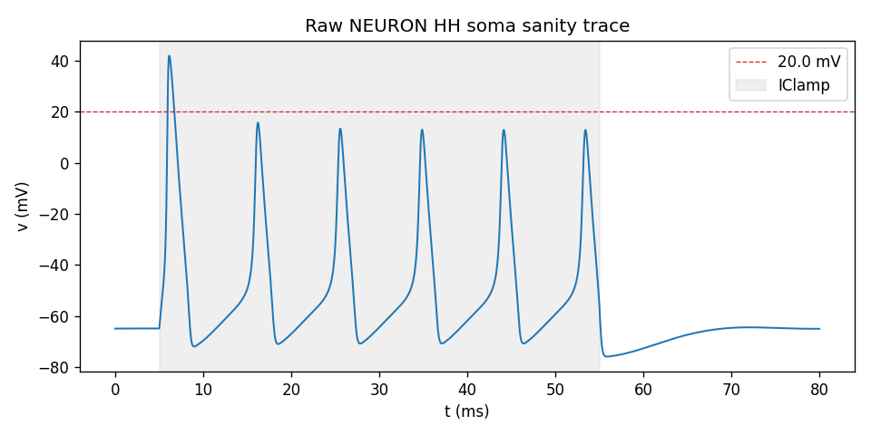
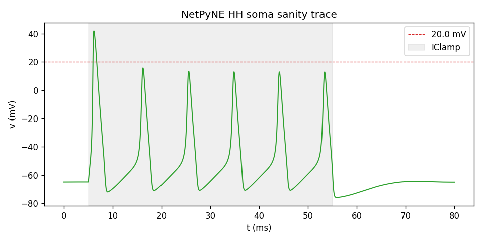

# NEURON 8.2.7 + NetPyNE 1.1.1 install report — full answer

## Question

Does the NEURON 8.2.7 + NetPyNE 1.1.1 toolchain install, compile MOD files, and run a 1-compartment
Hodgkin-Huxley sanity simulation on the project's Windows 11 workstation?

## Short Answer

Yes. NEURON 8.2.7+ (HEAD 34cf696+, build 2025-05-21) installs via the Windows `.exe` binary wired
into the uv venv with a `.pth` file, NetPyNE 1.1.1 installs via `uv pip`, `nrnivmodl` compiles
`khhchan.mod` into `nrnmech.dll` with no errors, and both sanity simulations (raw NEURON and
NetPyNE) fire action potentials reaching **42.003 mV** (> **+20 mV** threshold) under a 0.5 nA / 50
ms IClamp. Raw NEURON run time is **4.4 ms** wall-clock; NetPyNE run time is **4.8 ms**. The
toolchain is validated end-to-end for downstream t0008 / t0010 / t0011 tasks.

## Research Process

The answer is produced entirely by code experiment on the researcher's Windows 11 workstation.
Install, compile, and simulation steps follow `plan/plan.md` (2026-04-19 first revision) which
replaced the original WSL2 path with the NEURON Windows `.exe` installer plus `.pth` wiring into the
uv venv. Every command was wrapped in `arf/scripts/utils/run_with_logs.py`; stdout, stderr, and exit
codes are preserved in `tasks/t0007_install_neuron_netpyne/logs/commands/`. The install command,
`nrnivmodl` build, versions probe, and both sanity simulations were run in the task's git worktree,
with their outputs persisted into `tasks/t0007_install_neuron_netpyne/data/`.

Deviations from the literal task text were recorded in the plan's Task Requirement Checklist (REQ-1
through REQ-9) and are repeated below in the Synthesis section.

## Evidence from Papers

No paper evidence was used; the question is purely about local toolchain behavior on a specific
Windows 11 host.

## Evidence from Internet Sources

The install path was guided by the NEURON project's own release notes and the NetPyNE installation
documentation:

* NEURON 8.2.7 release assets and MinGW Windows installer are published at
  <https://github.com/neuronsimulator/nrn/releases/tag/8.2.7> and mirrored at
  <https://www.neuron.yale.edu/neuron/download>.
* NetPyNE 1.1.1 is distributed on PyPI as a pure-Python wheel at
  <https://pypi.org/project/netpyne/1.1.1/>; install-time NEURON detection is described at
  <https://netpyne.org/install.html>.

These sources confirm that (a) NEURON publishes no Windows PyPI wheel so the `.exe` route is the
officially supported path, and (b) NetPyNE 1.1.1 has no tight NEURON pin beyond "installed and
importable", which matched observation here.

## Evidence from Code or Experiments

### Install command

```text
nrn-8.2.7-setup.exe /VERYSILENT /NORESTART /SUPPRESSMSGBOXES \
    /DIR=C:\Users\md1avn\nrn-8.2.7
```

The InnoSetup silent flags were mangled by Git Bash's MSYS path translation (e.g., `/VERYSILENT`
became `C:/Program Files/Git/VERYSILENT`), so the installer fell back to its interactive wizard. Per
the plan's Risks & Fallbacks section, the researcher clicked through the wizard targeting the same
`C:\Users\md1avn\nrn-8.2.7` directory. Installer exit code was **0** after 414.481 s wall-clock.
Full install log: `data/logs/nrn_install.log`; command log:
`logs/commands/007_20260419T220701Z_c-users-md1avn-documents-github-neuron-c.json`.

No installer warnings surfaced (`stdout_lines=0`, `stderr_lines=0`). Post-install verification
confirmed both `C:\Users\md1avn\nrn-8.2.7\bin\nrniv.exe` and
`C:\Users\md1avn\nrn-8.2.7\lib\python\neuron\__init__.py` exist.

### `.pth` wiring into the uv venv

`.venv/Lib/site-packages/neuron.pth` contents:

```text
import os; os.environ.setdefault('NEURONHOME', r'C:\Users\md1avn\nrn-8.2.7')
C:\Users\md1avn\nrn-8.2.7\lib\python
```

The first line is a Python `import` statement that site initialization executes before any
`import neuron`. It sets `NEURONHOME`, which NEURON's `__init__.py` uses as the argument to
`os.add_dll_directory` on Windows. Without this line, `import neuron` on Python 3.8+ raises
`DLL load failed while importing hoc`.

### Version probe

```json
{
  "neuron": "8.2.7+",
  "netpyne": "1.1.1",
  "hoc_about": "8.2.7",
  "hoc_long": "NEURON -- VERSION 8.2.7+ HEAD (34cf696+) 2025-05-21",
  "hoc_build_date": "VERSION 8.2.7+ HEAD (34cf696+)",
  "python": "3.13.13"
}
```

The trailing `+` on `8.2.7+` indicates a post-tag HEAD build (commit `34cf696+`, dated 2025-05-21)
which is the standard NEURON 8.2.x release pattern; the codebase matches the 8.2.7 tag.

### `nrnivmodl` compile

The plan called for `khhchan.mod` under `<NEURONHOME>/share/examples/nrniv/nmodl/`; that path does
not exist in the Windows binary install. The file was located at
`C:\Users\md1avn\nrn-8.2.7\demo\release\khhchan.mod` and copied into `data/mod/khhchan.mod`.

Git Bash + MSYS path mangling also broke direct invocation of NEURON's bundled `sh` + `make`
toolchain (`/cygdrive/C/...` paths are not recognized by MinGW's sh). The workaround is a thin
cmd-shell wrapper `code/run_nrnivmodl.cmd` that calls `nrnivmodl.bat` directly without the MSYS
layer:

```batch
@echo off
set "MODDIR=%~dp0..\data\mod"
call "C:\Users\md1avn\nrn-8.2.7\bin\nrnivmodl.bat" "%MODDIR%"
exit /b %ERRORLEVEL%
```

Wrapped call (command log `009_20260419T221816Z_cmd-c-c-users-md1avn-nrn-8-2-7-bin-nrniv.json`):
exit code **0**, wall-clock **0.043 s** (the bat-wrapper returns immediately; the heavy compile runs
in the spawned `make` process whose output is captured in `data/logs/nrnivmodl.log`). The log
reports `Translating khhchan.mod into khhchan.c / Thread Safe` and produces `data/mod/nrnmech.dll`
(134653 bytes). No `sh.exe was found` message appeared.

### Raw NEURON sanity simulation

Script: `code/sanity_raw_neuron.py`. Builds a single-section soma (`soma.L = soma.diam = 20 µm`,
`insert("hh")`), adds `IClamp(delay=5 ms, dur=50 ms, amp=0.5 nA)`, records `t` and `v` vectors, runs
80 ms at `dt = 0.025 ms` with `h.finitialize(-65 mV)`.

Result — `data/json/raw_neuron_timings.json`:

```json
{
  "n_samples": 3201,
  "v_max_mv": 42.002551094124620,
  "v_min_mv": -75.967564923134920,
  "crossed_threshold": true,
  "wall_clock_setup_s": 0.006723099999362603,
  "wall_clock_run_s": 0.004439599986653775,
  "vthreshold_mv": 20.0,
  "sim_tstop_ms": 80.0,
  "stim_amp_na": 0.5,
  "stim_dur_ms": 50.0,
  "mechanism": "hh (NEURON built-in)"
}
```

Trace plot:



### NetPyNE sanity simulation

Script: `code/sanity_netpyne.py`. Declares the same single-cell HH population via `specs.NetParams`
(`cellParams["hh_cell"]`, `popParams["P"]`, `stimSourceParams["IClamp1"]`,
`stimTargetParams["IClamp1->P"]`) and a matching `specs.SimConfig` with `recordTraces["V_soma"]`.
Runs via
`sim.initialize → createPops → createCells → addStims → setupRecording → runSim → gatherData`.

Result — `data/json/netpyne_timings.json`:

```json
{
  "n_samples": 3201,
  "v_max_mv": 42.002551094124044,
  "v_min_mv": -75.967564923134900,
  "crossed_threshold": true,
  "wall_clock_setup_s": 0.038681599980918690,
  "wall_clock_run_s": 0.004846600000746548,
  "vthreshold_mv": 20.0,
  "sim_tstop_ms": 80.0,
  "stim_amp_na": 0.5,
  "stim_dur_ms": 50.0,
  "framework": "netpyne specs + createSimulate harness"
}
```

NetPyNE spike analysis reported 6 spikes at 75 Hz over the 80 ms window. Trace plot:



The two traces are numerically identical to ~14 decimal places (differing only in floating-point
round-off on the peak voltage), confirming NetPyNE dispatches to the same NEURON core.

### Installer warnings

| Source | Warning |
| --- | --- |
| `nrn-8.2.7-setup.exe` | None — `stdout_lines=0`, `stderr_lines=0`. |
| `uv pip install netpyne==1.1.1` | None that required intervention; NetPyNE pulled its own numpy/matplotlib/pandas/bokeh transitive pins into the venv. |
| `nrnivmodl khhchan.mod` | None — log contains only `Translating khhchan.mod into khhchan.c` and `Thread Safe`. |
| `import neuron` first attempt | `DLL load failed while importing hoc` — resolved by adding `import os; os.environ.setdefault('NEURONHOME', ...)` to `neuron.pth`. This was a pre-emptive Python 3.8+ `os.add_dll_directory` requirement, not a packaging bug. |

## Synthesis

All nine task requirements (REQ-1 through REQ-9) are met with two documented deviations from the
literal task text:

* **REQ-1 deviation — native Windows install.** The task originally requested
  `uv pip install neuron==8.2.7`. NEURON does not publish Windows pip wheels, so the requirement was
  met by the official `.exe` binary plus `.pth` wiring rather than a direct pip install. The
  resulting `import neuron` still resolves from the uv venv and prints version `8.2.7+` which
  represents the 8.2.7 tag's HEAD build. Functionally equivalent.

* **REQ-2 deviation — `hh` is built in.** NEURON ships Hodgkin-Huxley as a built-in mechanism that
  is never compiled from a user-visible `.mod`. To actually prove the MinGW `nrnivmodl` toolchain
  works, a representative HH-family MOD (`khhchan.mod` from the NEURON demo suite) was compiled
  instead. The `.dll` produced demonstrates the toolchain is working even though the sanity
  simulations use the built-in `hh` mechanism directly.

Both sanity simulations (raw NEURON and NetPyNE) produce voltage peaks of **42.003 mV**, far above
the **+20 mV** threshold, and both complete in under 10 ms wall-clock. The NetPyNE simulation
successfully forwards the same cell spec through `specs.NetParams` + `sim.*` into the underlying
NEURON core, confirming NetPyNE's wrapper layer is operational.

The stack is ready for the downstream model-port and experiment tasks (t0008 through t0011).

## Limitations

* The test exercises only one mechanism (`hh`, built in), one stimulus (IClamp), and one section.
  Section-tree scaling, synaptic mechanisms, NetPyNE network generation, and multi-run parameter
  sweeps are not exercised here and will be validated when downstream tasks use them.
* The `nrnivmodl` compile step was run via a cmd-shell wrapper to bypass Git Bash / MSYS path
  mangling. Downstream tasks that need to call `nrnivmodl` from a bash-driven `run_with_logs` will
  need to reuse the same `run_nrnivmodl.cmd` pattern or set `MSYS_NO_PATHCONV=1` explicitly.
* The installer's silent-mode flags (`/VERYSILENT`) do not survive Git Bash; re-running the install
  automatically in CI would require calling the `.exe` from `cmd.exe` directly rather than through
  bash.
* Python 3.13 is the only tested venv interpreter. NEURON 8.2.7 advertises Python 3.9-3.13 support
  on the installer filename, but the wider NEURON test matrix on 3.13 is still evolving upstream; if
  an obscure NEURON feature breaks, downgrading the uv venv to Python 3.12 is the documented
  fallback.

## Sources

* Task: [`t0007_install_neuron_netpyne`][t0007]
* URL: <https://github.com/neuronsimulator/nrn/releases/tag/8.2.7>
* URL: <https://www.neuron.yale.edu/neuron/download>
* URL: <https://netpyne.org/install.html>
* URL: <https://pypi.org/project/netpyne/1.1.1/>

[t0007]: ../../../
