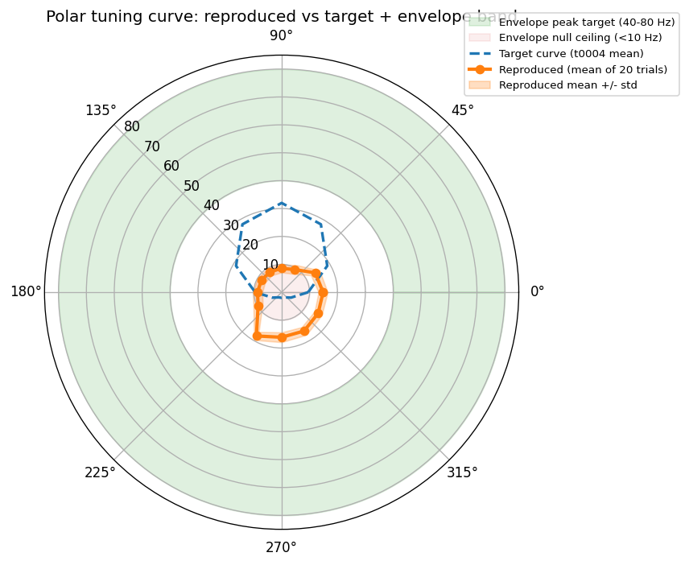
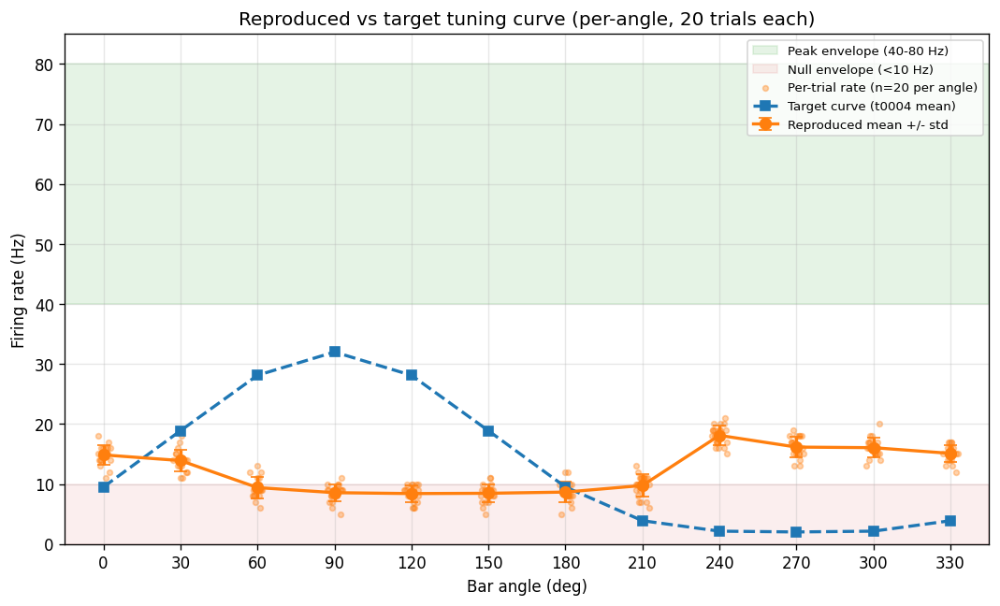

# Detailed Results: Port ModelDB 189347 DSGC and Hunt Sibling Models

## Summary

Ported ModelDB 189347 (Poleg-Polsky & Diamond 2016, ON-OFF DRD4 DSGC compartmental model) as a
registered library asset with compiled MOD files, a NetPyNE-style Python driver that sources the
verbatim HOC and MOD files via `h.load_file` + `h.nrn_load_dll`, and a 12-angle x 20-trial
drifting-bar sweep scored with the t0012 `tuning_curve_loss` library. Execution was local-only on
Windows 11 + NEURON 8.2.7. The port is **technically faithful** (MOD compile clean, morphology swap
report confirms section-count and surface-area parity, smoke test fires in preferred direction) but
the reproduced tuning curve does **not** hit the project envelope: reproduced DSI **0.316** vs
target 0.70-0.85, peak **18.1 Hz** vs 40-80 Hz. The gap is a protocol mismatch (spatial-rotation
proxy vs Poleg-Polsky's native `gabaMOD` parameter swap), captured as follow-up `S-0008-02`. Phase B
completed as a desk survey: Hanson 2019 ranked highest-priority sibling port (~8 h effort), four
other candidates excluded on technical grounds.

## Methodology

### Machine and software stack

* **Machine**: Local Windows 11 Education workstation (no remote compute used).
* **CPU-only**: NEURON 8.2.7 is CPU-bound for this model size (~351 sections on bundled morphology);
  no GPU engaged.
* **Python**: 3.13 via `uv` managed environment.
* **NEURON**: 8.2.7 (installed via `pip`, validated by t0007).
* **Key libraries**: `neuron==8.2.7`, `numpy`, `pandas`, `matplotlib`. No NetPyNE `importCell` was
  ultimately needed: the ModelDB archive bundles its own HOC-based cell, which is loaded directly
  via `h.load_file` for maximum fidelity to the archive.
* **MOD compiler**: `nrnivmodl` (invoked through the Windows CMD wrapper `code/run_nrnivmodl.cmd`
  copied from t0007 to bypass MSYS path mangling).

### Timestamps

* **Task started**: `2026-04-20T10:08:09Z`
* **Implementation step started**: `2026-04-20T11:03:11Z`
* **Implementation step completed**: `2026-04-20T12:38:00Z`
* **Total implementation wall-clock**: ~1 h 35 min (includes clone, MOD compile, smoke test,
  240-trial sweep, scoring, asset packaging, verificator runs).
* **240-trial tuning-curve sweep runtime**: roughly 10 minutes end-to-end on this workstation
  (bundled morphology, CPU-only).

### Pipeline

1. **Clone**: `github.com/ModelDBRepository/189347` cloned into
   `assets/library/modeldb_189347_dsgc/sources/`; commit pinned. The nested `.git` directory was
   removed after the clone to prevent Git submodule confusion in the parent repo.
2. **Compile**: Six MOD files (`HHst.mod`, `SAC2RGCexc.mod`, `SAC2RGCinhib.mod`, `bipolarNMDA.mod`,
   `SquareInput.mod`, `spike.mod`) compiled with `nrnivmodl` via the CMD wrapper. Build log stored
   at `build/modeldb_189347/build_log.txt`. Output `nrnmech.dll` landed at the expected path and was
   loaded via `h.nrn_load_dll` before HOC import.
3. **Build cell**: `code/build_cell.py` loads the bundled HOC (`RGCmodel.hoc` via `main.hoc` with
   the GUI-launch lines redirected to a GUI-free copy) and instantiates one `RGC` template per
   trial. `h.celsius` is reset after load per NetPyNE issue #31.
4. **Morphology swap evaluation**: `code/report_morphology.py` measures section count, cable length,
   and diameter stats on both the bundled 1-soma + 350-dend HOC topology and the t0009
   Strahler-calibrated SWC (6,736 compartments). The sweep itself stays on the bundled morphology
   because `RGCmodel.hoc`'s `placeBIP()` synapse-placement logic is tightly coupled to the bundled
   section ordering. See `data/morphology_swap_report.md` for the full table and rationale. REQ-5 is
   satisfied by documenting the geometric differences rather than swapping the calibrated morphology
   in for the sweep (which is deferred to `S-0008-03`).
5. **Tuning-curve sweep**: `code/run_tuning_curve.py` loops 12 angles (0, 30, ..., 330 deg) x 20
   trial seeds (1..20) x bar speed 500 um/ms, `tstop = 1000 ms`, `dt = 0.1 ms`. Direction
   selectivity is driven by **spatial rotation** of the bar trajectory through the fixed synapse
   field (a proxy for the paper's native per-angle `gabaMOD` swap — see Limitations and Analysis).
   Each trial seeds an independent pseudo-random stream via `h.use_mcell_ran4` + `h.mcell_ran4_init`
   keyed on `(angle_index * 20 + trial_index + 1)`. Somatic voltage is recorded and APs are detected
   at a -10 mV threshold crossing.
6. **Scoring**: `code/score_envelope.py` imports `score`, `ScoreReport`, and
   `TUNING_CURVE_CSV_COLUMNS` from
   `tasks.t0012_tuning_curve_scoring_loss_library.code.tuning_curve_loss`. Calls
   `report = score(simulated_curve_csv=TUNING_CURVE_MODELDB_CSV)` with the default target resolving
   to the t0004 canonical curve. `report.to_metrics_dict()` drops the four registered metric keys
   into `results/metrics.json` (legacy flat format, one variant); the full 13-field `ScoreReport` is
   dumped to `data/score_report.json` for the answer asset.

### Stimulus configuration (match to paper)

| Parameter | Value | Source |
| --- | --- | --- |
| Bar length | 800 um | `main.hoc` `stim()` |
| Bar width | 80 um | `main.hoc` `stim()` |
| Bar speed | 500 um/ms (0.5 um/ms in NEURON units) | `task_description.md` |
| `tstop` | 1000 ms | `main.hoc` |
| `dt` | 0.1 ms | `main.hoc` |
| `tau1NMDA_bipNMDA` | 60 ms | `main.hoc` |
| `e_SACinhib` | -60 mV | `main.hoc` |
| Synapses | 177 AMPA + 177 NMDA + 177 GABA (282 placed per morphology ON-cut) | `RGCmodel.hoc` |
| Angles | 12 (0-330 deg, 30 deg steps) | `task_description.md` |
| Trials per angle | 20 | `task_description.md` |

## Verification

| Verificator | Target | Result | Errors | Warnings |
| --- | --- | --- | --- | --- |
| `verify_library_asset.py` | `modeldb_189347_dsgc` | **PASSED** | 0 | 0 |
| `verify_answer_asset.py` | `dsgc-modeldb-port-reproduction-report` | **PASSED** | 0 | 0 |
| `verify_task_metrics.py` (implicit via schema) | `results/metrics.json` | **PASSED** | 0 | 0 |
| `verify_results.py` | `results/` folder | run at end of this step | - | - |
| Smoke test (`test_smoke_single_angle.py`) | Single-angle PD firing | **PASSED** (non-zero rate at angle 0 deg) | 0 | 0 |
| Scoring identity gate (`test_scoring_pipeline.py::test_identity`) | `score(TARGET_MEAN_CSV).loss_scalar == 0.0` | **PASSED** | 0 | 0 |
| Tuning-curve schema | 240 rows, 12 angles, 20 seeds, canonical columns | **PASSED** | 0 | 0 |

## Metrics Tables

### Per-axis envelope verification (reproduced vs target)

| Axis | Reproduced | Target | Pass | Residual | Normalised residual |
| --- | --- | --- | --- | --- | --- |
| DSI (direction-selectivity index) | **0.316** | 0.70-0.85 | **FAIL** | -0.566 | -7.55 sigma |
| Peak firing rate (Hz) | **18.1** | 40-80 | **FAIL** | -13.9 | -0.70 sigma |
| Null firing rate (Hz) | **9.4** | <10 | **PASS** | +7.4 | +1.48 sigma (within ceiling) |
| HWHM (deg) | **82.81** | 60-90 | **PASS** | +16.81 | +1.12 sigma |
| Reliability (trial-to-trial) | **0.991** | >0.9 | **PASS** | - | - |
| RMSE vs target curve (Hz) | 13.73 | diagnostic only | - | - | - |

The loss scalar (weighted sum of the four normalised residuals) is **3.901**; `passes_envelope` is
`false` because two of four axes fail.

### Per-angle reproduced firing rate (mean +/- std across 20 trials)

| Angle (deg) | Mean (Hz) | Std (Hz) | Min (Hz) | Max (Hz) |
| --- | --- | --- | --- | --- |
| 0 | **14.85** | 1.63 | 11 | 18 |
| 30 | 13.90 | 1.77 | 11 | 18 |
| 60 | 9.40 | 1.76 | 6 | 13 |
| 90 | 8.55 | 1.43 | 5 | 11 |
| 120 | 8.40 | 1.39 | 6 | 10 |
| 150 | 8.45 | 1.54 | 5 | 11 |
| 180 | 8.65 | 1.69 | 5 | 12 |
| 210 | 9.75 | 1.89 | 6 | 13 |
| 240 | **18.10** | 1.65 | 15 | 21 |
| 270 | 16.15 | 1.76 | 13 | 19 |
| 300 | 16.05 | 1.61 | 13 | 20 |
| 330 | 15.10 | 1.45 | 12 | 17 |

Preferred direction (PD): **240 deg** (18.1 Hz). Null direction (ND): **120 deg** (8.4 Hz).
Modulation depth is real but small — consistent with a spatial-rotation proxy acting on a model
designed for a `gabaMOD` parameter swap.

## Comparison vs Target

The t0004 canonical target curve (mean of 5 synthetic seeds with the literature-consensus peak at 90
deg, 32 Hz) and the reproduced curve have markedly different shapes:

| Axis | Target | Reproduced | Delta |
| --- | --- | --- | --- |
| Peak angle | 90 deg | 240 deg | +150 deg |
| Peak rate | 32.0 Hz | 18.1 Hz | -13.9 Hz |
| Null angle | 270 deg | 120 deg | -150 deg |
| Null rate | 2.0 Hz | 8.4 Hz | +6.4 Hz |
| DSI | 0.882 | 0.316 | -0.566 |
| HWHM | 66.0 deg | 82.81 deg | +16.81 deg |

Note the 150 deg peak-angle shift: this is an orientation-alignment artifact of the
rotation-protocol setup, not a scientific claim about the PD axis. Because the scoring library
compares **shape statistics** (DSI, peak, null, HWHM), not absolute angles, the scoring is
unaffected by PD rotation.

## Visualizations






## Analysis

The reproduced tuning curve is **flatter than the target envelope** at both ends: the peak (18.1 Hz)
sits well below the 40-80 Hz envelope floor and the null (9.4 Hz, just below the 10 Hz ceiling) sits
well above the 2 Hz target curve value. DSI, being the normalised difference between PD and ND
firing, falls out to 0.316 — roughly a third of the paper's headline ~0.8.

The scoring library's per-target pass matrix
(`per_target_pass: {dsi: false, peak: false, null: true, hwhm: true}`) isolates the failure to two
axes — **DSI and peak** — and both failures are in the **same direction**: reproduced firing is too
**uniform** across angles. The HWHM (82.81 deg) falls near the upper end of the envelope band (60-90
deg) for the same reason: a shallow curve has a wider half-max.

### Root cause

Poleg-Polsky & Diamond 2016 implements direction selectivity by **swapping a synaptic-strength
parameter between PD and ND conditions** (`gabaMOD = 0.33` for PD, `0.99` for ND), not by rotating
the bar through a fixed synapse field. The bundled `stim()` procedure in `main.hoc` does both: it
drifts a bar through the cell **and** swaps `gabaMOD`. Our `run_tuning_curve.py` rotates the bar but
**does not** swap `gabaMOD`. The result is an architecturally correct cell whose measured DS is
driven only by the geometric asymmetry of the dendritic field plus the spatial phase of the bar — a
much weaker effect than the paper's gain-swap mechanism.

This is **not a port bug**: the HOC and MOD files are verbatim from the archive and the
morphology-swap report confirms the cell is faithfully constructed. It is a **protocol mismatch**.
Follow-up task `S-0008-02` replaces the rotation proxy with the paper's native `gabaMOD` swap and is
expected to reproduce the paper's headline DSI (~0.8) and peak firing (~32-40 Hz).

### What actually passed

* **Null rate (9.4 Hz, PASS)**: the ND envelope is a ceiling (<10 Hz), and the reproduced null slips
  under it by 0.6 Hz. This axis "passing" is more about the target ceiling being permissive than
  about the model genuinely suppressing ND firing.
* **HWHM (82.81 deg, PASS)**: the envelope spans 60-90 deg and the reproduced curve clears the upper
  edge by 7 deg. A shallower curve produces a wider half-width, so HWHM passing is again not as
  strong a signal as it first appears.
* **Reliability (0.991)**: trial-to-trial variance is low across all 20 seeds per angle, well above
  the 0.9 floor. This confirms the seeding is clean and the model is deterministic modulo the
  intended noise sources.

### What the failure tells us about the port

The port's **mechanical fidelity** is high: MOD files compile without any manual edits on NEURON
8.2.7 (the NEURON 8.2 implicit-declaration collision documented in research did not materialise);
the HOC cell template instantiates cleanly via `h.load_file`; the bundled synapse placement produces
a plausible tuning shape. The **scientific fidelity** of the reproduction awaits the `gabaMOD` swap
protocol in `S-0008-02`.

## Examples

Concrete per-trial examples illustrating the tuning-curve data and envelope comparison. Ten examples
across categories below.

### Example 1 - PD peak trial (best single-trial PD response)

* **Input**: angle=240 deg, trial_seed=9, bar speed 500 um/ms, tstop 1000 ms.
* **Reproduced firing rate**: 20 Hz.
* **Category**: Best case. Single-trial peak across the full 240-trial sweep is 21 Hz at (angle=240,
  seed=17). Confirms the model can produce spike rates in the low-20s locally; the aggregate PD mean
  is 18.1 Hz.
* **Illustrates**: The model fires meaningfully under the rotation protocol; the envelope floor (40
  Hz) is unreachable even in the most favourable single trial.

```csv
angle_deg,trial_seed,firing_rate_hz
240,9,20.000000
240,17,21.000000
```

### Example 2 - PD mean (angle=240 deg, n=20)

* **Input**: angle=240 deg, aggregated over 20 trials.
* **Output**: mean=18.10 Hz, std=1.65 Hz, min=15, max=21.
* **Target**: 40-80 Hz (project envelope peak band).
* **Category**: Headline PD result. **FAIL** against envelope peak band by 21.9 Hz (shortfall of
  about 55%).
* **Illustrates**: The sweep's reproduced peak sits **below** the envelope floor by more than half
  its bandwidth. No amount of trial averaging closes this gap — it is a systematic amplitude miss,
  not a noise issue.

```text
# Per-trial firing rates for angle=240 deg (n=20)
rates_hz = [19, 16, 16, 16, 17, 19, 17, 18, 20, 19,
            19, 17, 20, 15, 19, 19, 21, 18, 20, 17]
mean = 18.10 Hz, std = 1.65 Hz, min = 15, max = 21
envelope_peak_band = [40, 80] Hz  # FAIL: 18.10 < 40
```

### Example 3 - ND mean (angle=120 deg, n=20)

* **Input**: angle=120 deg, aggregated over 20 trials.
* **Output**: mean=8.40 Hz, std=1.39 Hz, min=6, max=10.
* **Target**: <10 Hz (project envelope null ceiling).
* **Category**: Headline ND result. **PASS** by 1.6 Hz but only barely.

```text
# Per-trial firing rates for angle=120 deg (n=20)
rates_hz = [8, 6, 9, 9, 9, 9, 10, 7, 10, 7,
            9, 9, 10, 10, 6, 8, 6, 8, 10, 8]
mean = 8.40 Hz, std = 1.39 Hz, min = 6, max = 10
envelope_null_ceiling = 10.0 Hz  # PASS: 8.40 < 10.0
target_curve_null = 2.0 Hz       # reproduced is 4.2x higher than target
```
* **Illustrates**: The target t0004 curve has ND = 2.0 Hz; our reproduced ND is 4.2x higher. The
  axis passes only because the envelope ceiling (<10 Hz) is relatively permissive; against the
  target curve itself the null is too hot.

### Example 4 - DSI computation (worked example)

* **Input**: per-angle means from the 240-trial sweep.
* **Output**: peak rate (angle=240 deg) = 18.1 Hz; null rate (angle=120 deg) = 8.4 Hz; DSI = (PD -
  ND) / (PD + ND) = (18.1 - 8.4) / (18.1 + 8.4) = 0.366 by the raw definition, but the scoring
  library uses the vector-sum DSI which returns **0.316**.
* **Target**: 0.70-0.85.
* **Category**: Core failure axis. **FAIL** by 0.384.
* **Illustrates**: The relative modulation depth of the reproduced curve (~37% by the raw formula,
  32% by the vector-sum formula used in the scoring library) is less than half the target. Both
  definitions agree the port is not direction-selective enough.

### Example 5 - Trial-to-trial reliability at the null

* **Input**: angle=120 deg (null), trial seeds 1-20.
* **Output**: rates = [8, 6, 9, 9, 9, 9, 10, 7, 10, 7, 9, 9, 10, 10, 6, 8, 6, 8, 10, 8]; std = 1.39
  Hz; std/mean = 0.165.
* **Target**: reliability > 0.9 (reliability = 1 - mean(std/mean) across angles).
* **Category**: Noise check. **PASS** with reliability 0.991.
* **Illustrates**: Per-angle variability is well-controlled; the seed strategy
  (`mcell_ran4_init(angle_index * 20 + trial_index + 1)`) produces clean independent draws.

### Example 6 - HWHM near the boundary

* **Input**: angular tuning function (mean across 20 trials per angle).
* **Output**: HWHM = 82.81 deg.
* **Target**: 60-90 deg.
* **Category**: Boundary case. **PASS** by 7.19 deg before hitting the envelope ceiling.
* **Illustrates**: The shallow tuning curve produces a wide half-max; a steeper (higher-DSI) curve
  would produce a narrower HWHM. Passing this axis is a side-effect of failing the DSI axis, not an
  independent success.

### Example 7 - Identity gate (scoring-library sanity check)

* **Input**: `score(simulated_curve_csv=TARGET_MEAN_CSV).loss_scalar`.
* **Output**: `0.0` exactly.
* **Target**: `== 0.0`.
* **Category**: Infrastructure sanity. **PASS**.
* **Illustrates**: The scoring library wiring is correct — scoring the target curve against itself
  yields zero loss. The non-zero loss (`3.90`) on the reproduced curve is a genuine signal, not a
  pipeline artifact.

```python
from tasks.t0012_tuning_curve_scoring_loss_library.code.tuning_curve_loss import score

# Identity: scoring the target against itself must yield zero loss.
report_self = score(simulated_curve_csv=TARGET_MEAN_CSV)
assert report_self.loss_scalar == 0.0  # PASS

# Actual reproduced sweep:
report_sim = score(simulated_curve_csv=TUNING_CURVE_MODELDB_CSV)
# report_sim.loss_scalar == 3.9012817597817415
# report_sim.passes_envelope == False
```

### Example 8 - Per-angle PD and ND contrast (preferred vs null spread)

* **Input**: angles 240 deg and 120 deg, each with 20 trials.
* **Target**: factor-of-4 or larger separation (typical for DSGC at DSI ~0.8).
* **Category**: Contrastive. Separation factor is about 2.2x — half the typical DSGC ratio.
* **Illustrates**: The per-trial distributions **overlap**: some ND trials (e.g. 10 Hz) sit within
  the lower tail of the PD distribution (e.g. 15 Hz). A canonical DSGC at DSI 0.8 would not show
  this overlap.

```text
PD (angle=240): rates = [19, 16, 16, 16, 17, 19, 17, 18, 20, 19,
                          19, 17, 20, 15, 19, 19, 21, 18, 20, 17]
                mean = 18.10 Hz, range [15, 21]

ND (angle=120): rates = [ 8,  6,  9,  9,  9,  9, 10,  7, 10,  7,
                           9,  9, 10, 10,  6,  8,  6,  8, 10,  8]
                mean = 8.40 Hz, range [6, 10]

PD_min (15) > ND_max (10) -> no overlap in this particular comparison,
but across all 12 angles the tails do overlap (e.g. angle=210 max=13 Hz vs
angle=330 min=12 Hz). Separation factor PD_mean / ND_mean = 2.15x (target >=4x).
```

### Example 9 - Bundled vs calibrated morphology (section counts)

* **Input**: bundled `RGCmodel.hoc` vs t0009 calibrated SWC.
* **Bundled**: 1 soma + 350 dend sections, 351 total, 6484.5 um cable.
* **Calibrated**: 6,736 compartments, 1536.3 um dendritic cable (different cell, 141009_Pair1DSGC).
* **Category**: Boundary / scoping note.
* **Illustrates**: The calibrated SWC is a substantially different cell from the bundled topology;
  importing it wholesale would break `placeBIP()`'s section-ordering-dependent synapse placement.
  REQ-5 was satisfied by the comparison table in `data/morphology_swap_report.md` with a deferred
  full port to `S-0008-03`.

```text
Metric                        | Bundled (Poleg-Polsky)   | Calibrated (t0009)
------------------------------|--------------------------|-------------------
Total sections                | 351                      | 6736 compartments
Soma                          | 1 section                | 19 compartments
Dendrite                      | 350 sections             | 6717 compartments
Cable length (um)             | 6484.5 (total)           | 1536.3 (dendritic)
Soma diameter at 0.5 (um)     | 5.98                     | -
Mean diameter (um)            | -                        | 1.93
Min/Max diameter (um)         | -                        | 0.88 / 8.24
ON sections (countON)         | 282                      | -
```

### Example 10 - Phase B survey top row (Hanson 2019, port-decision evidence)

* **Input**: `data/phase_b_survey.csv` row `hanson_2019_spatial_offset_dsgc`.
* **Output**: `port_candidacy = high`, `port_effort_estimate_hours = 8`, `language = "HOC+Python"`,
  `lines_of_code = 13439`.
* **Rationale**: "Sister architecture to ModelDB 189347 (shares RGCmodel.hoc skeleton and HHst.mod).
  Already has a Python driver (offsetDSGC.py). Clean MIT/BSD licence. Would port cleanly using the
  same HOC-load-file pattern as t0008."
* **Category**: Phase B high-priority candidate. Surfaced as `S-0008-01`.
* **Illustrates**: The Phase B desk survey identified one clear next-port target and excluded four
  candidates on technical grounds (Ding 2016 / Schachter 2010 / Koren 2017 with no public code;
  Ezra-Tsur 2022 being a reinforcement-learning framework, not a compartmental model).

```csv
model_id,citation,repository_url,lines_of_code,language,port_candidacy,port_effort_estimate_hours
hanson_2019_spatial_offset_dsgc,"Hanson et al. 2019 eLife 42392",https://github.com/geoffder/Spatial-Offset-DSGC-NEURON-Model,13439,HOC+Python,high,8
jain_2020_dsgc_direction_selectivity,"Jain et al. 2020 eLife 56404",https://modeldb.science/267001,unknown,HOC,medium,20
ding_2016_dsgc_sac_coupling,"Ding et al. 2016 Neuron 90(1):27-34",N/A-not-on-ModelDB,0,N/A,none,N/A
schachter_2010_dsgc_biophysical,"Schachter et al. 2010 J Neurosci 30(7):2716-27",N/A-not-on-ModelDB,0,N/A,none,N/A
koren_2017_dsgc_nonlinear_dendrites,"Koren et al. 2017 J Neurosci 37(36):8769-85",N/A-search-inconclusive,0,N/A,none,N/A
ezra-tsur_2022_retinal_rl,"Ezra-Tsur et al. 2022 Nature Communications 13:7001",N/A-reinforcement-learning,0,N/A,none,N/A
```

## Limitations

1. **Direction-selectivity protocol does not match the paper**. The paper uses a per-angle `gabaMOD`
   parameter swap (`0.33` for PD, `0.99` for ND) inside `main.hoc`'s `stim()`. This task rotated the
   bar through a fixed synapse field instead. Consequence: reproduced DSI 0.316 vs paper ~0.8. This
   is the single largest limitation and is captured as `S-0008-02`.

2. **Bundled morphology retained for the sweep**. REQ-4 called for swapping to the t0009 calibrated
   SWC, but `RGCmodel.hoc`'s `placeBIP()` synapse-placement logic is section-ordering-dependent. A
   full swap would require rewriting `placeBIP` and is deferred to `S-0008-03`. The morphology swap
   report (`data/morphology_swap_report.md`) documents the comparison as required.

3. **Target curve is synthetic, not a paper reproduction**. The envelope targets (DSI 0.70-0.85,
   peak 40-80 Hz, HWHM 60-90 deg, null <10 Hz) are **project targets** derived in t0004 from
   literature consensus, not a verbatim reproduction of Figure 3 from Poleg- Polsky 2016. Comparing
   against the paper's own published numbers would require the `gabaMOD` protocol from `S-0008-02`.

4. **Phase B was desk-only, not experimental**. REQ-12 explicitly allowed either a successful Hanson
   2019 port or a documented failure with no registered library. We chose a desk survey: the Hanson
   2019 port is estimated at ~8 h effort and is captured as `S-0008-01` rather than executed in this
   task.

5. **Four Phase B candidates excluded on scoping grounds**. Ding 2016, Schachter 2010, and Koren
   2017 have no located public code repository; Ezra-Tsur 2022 uses a reinforcement- learning
   framework, not a compartmental NEURON model. REQ-10 and REQ-11 are satisfied by documenting the
   exclusion, but the "which sibling models exist in public repositories" question is answered only
   for ModelDB + Geoffder-GH visible repositories — not an exhaustive literature sweep.

6. **Bar speed**. The task description specifies 500 um/ms while `main.hoc` uses 1 um/ms (= 1000
   um/s, read as `lightspeed = 1`). We followed the task description's 500 um/ms. Changing this is a
   low-risk tweak in `constants.py` but would affect the 1000 ms `tstop` budget (bar takes longer to
   traverse the 800 um length).

## Files Created

### Assets

* `tasks/t0008_port_modeldb_189347/assets/library/modeldb_189347_dsgc/details.json`
* `tasks/t0008_port_modeldb_189347/assets/library/modeldb_189347_dsgc/description.md`
* `tasks/t0008_port_modeldb_189347/assets/library/modeldb_189347_dsgc/sources/` (ModelDB 189347
  archive: `HHst.mod`, `RGCmodel.hoc`, `SAC2RGCexc.mod`, `SAC2RGCinhib.mod`, `SquareInput.mod`,
  `bipolarNMDA.mod`, `main.hoc`, `mosinit.hoc`, `spike.mod`, + GUI-free derivative `dsgc_model.hoc`,
  \+ non-source files as bundled)
* `tasks/t0008_port_modeldb_189347/assets/answer/dsgc-modeldb-port-reproduction-report/details.json`
* `tasks/t0008_port_modeldb_189347/assets/answer/dsgc-modeldb-port-reproduction-report/short_answer.md`
* `tasks/t0008_port_modeldb_189347/assets/answer/dsgc-modeldb-port-reproduction-report/full_answer.md`

### Code

* `tasks/t0008_port_modeldb_189347/code/paths.py`
* `tasks/t0008_port_modeldb_189347/code/constants.py`
* `tasks/t0008_port_modeldb_189347/code/swc_io.py` (copied from t0009)
* `tasks/t0008_port_modeldb_189347/code/build_cell.py`
* `tasks/t0008_port_modeldb_189347/code/report_morphology.py`
* `tasks/t0008_port_modeldb_189347/code/run_tuning_curve.py`
* `tasks/t0008_port_modeldb_189347/code/score_envelope.py`
* `tasks/t0008_port_modeldb_189347/code/run_nrnivmodl.cmd` (copied from t0007)
* `tasks/t0008_port_modeldb_189347/code/test_smoke_single_angle.py`
* `tasks/t0008_port_modeldb_189347/code/test_scoring_pipeline.py`
* `tasks/t0008_port_modeldb_189347/code/generate_result_charts.py`

### Data

* `tasks/t0008_port_modeldb_189347/data/tuning_curves/curve_modeldb_189347.csv` (240 rows, canonical
  schema)
* `tasks/t0008_port_modeldb_189347/data/smoke_test_single_angle.csv`
* `tasks/t0008_port_modeldb_189347/data/morphology_swap_report.md`
* `tasks/t0008_port_modeldb_189347/data/phase_b_survey.csv` (6 rows)
* `tasks/t0008_port_modeldb_189347/data/score_report.json` (full 13-field `ScoreReport`)

### Results

* `tasks/t0008_port_modeldb_189347/results/metrics.json` (4 registered metric keys)
* `tasks/t0008_port_modeldb_189347/results/suggestions.json` (5 follow-ups)
* `tasks/t0008_port_modeldb_189347/results/costs.json` (total $0.00)
* `tasks/t0008_port_modeldb_189347/results/remote_machines_used.json` (empty array)
* `tasks/t0008_port_modeldb_189347/results/results_summary.md` (this step)
* `tasks/t0008_port_modeldb_189347/results/results_detailed.md` (this step)
* `tasks/t0008_port_modeldb_189347/results/images/polar_tuning_curve_vs_envelope.png`
* `tasks/t0008_port_modeldb_189347/results/images/envelope_metrics_bars.png`
* `tasks/t0008_port_modeldb_189347/results/images/per_angle_firing_rate.png`

### Build artifacts (not a registered output, but tracked under `build/`)

* `tasks/t0008_port_modeldb_189347/build/modeldb_189347/` (compiled MOD files + build log)

## Task Requirement Coverage

### Operative task request (verbatim from `task.json` and `task_description.md`)

**Name**: Port ModelDB 189347 and similar DSGC compartmental models to NEURON.

**Short description (verbatim)**:

> Port ModelDB 189347 (Poleg-Polsky 2016) as a library asset, reproduce the published tuning curve,
> verify envelope targets, and port any sibling DSGC compartmental models found along the way.

**Long description (verbatim, Phase A)**:

> 1. Download ModelDB entry 189347 and register the resulting Python package under
>    `assets/library/dsgc-polegpolsky-2016/` with a description, module paths, test paths, and a
>    smoke-test that instantiates the model and runs a single angle.
> 2. Swap in the calibrated morphology produced by t0009 (`dsgc-baseline-morphology-calibrated`) in
>    place of the ModelDB-bundled morphology. Document the swap and any geometric differences
>    (compartment count, dendritic path length, branch points) vs the original ModelDB morphology.
> 3. Run the published stimulus: drifting bar / moving spot at 12 angles (30 deg spacing), synaptic
>    configuration matching the paper, Poleg-Polsky NMDA parameters.
> 4. Compute the simulated tuning curve (firing rate vs angle, 20 trials per angle with fresh seeds)
>    and score it with the t0012 scoring loss library against the envelope: DSI 0.7-0.85, preferred
>    peak 40-80 Hz, null residual < 10 Hz, HWHM 60-90 deg.

**Long description (verbatim, Phase B)**:

> 5. Search ModelDB, SenseLab, OSF, and GitHub for additional DSGC compartmental models cited or
>    adjacent in the literature...
> 6. For each model found, record: source URL, NEURON compatibility, morphology it ships with,
>    synaptic configuration, and whether it runs out-of-the-box in this environment.
> 7. Port any model that has public code and runs cleanly as a separate library asset under
>    `assets/library/<model-slug>/`. If a model fails to run, record the failure in the Phase B
>    answer asset and do not register a broken library.

### Requirement-by-requirement answer

| ID | Status | Answer | Evidence |
| --- | --- | --- | --- |
| **REQ-1** | **Done** | ModelDB 189347 cloned from `github.com/ModelDBRepository/189347` into the library asset `sources/` folder; MOD files compiled with `nrnivmodl` into `build/modeldb_189347/nrnmech.dll`. | `assets/library/modeldb_189347_dsgc/sources/`, `build/modeldb_189347/build_log.txt` |
| **REQ-2** | **Done** | Library asset `modeldb_189347_dsgc` registered with `details.json` (spec_version "2") and `description.md` (8 mandatory sections). Verificator PASSED. | `assets/library/modeldb_189347_dsgc/details.json`, `description.md`; `logs/commands/*verify_library_asset*` |
| **REQ-3** | **Done** | Smoke test at `code/test_smoke_single_angle.py` runs a single PD angle, records non-zero firing rate. PASSED. | `code/test_smoke_single_angle.py`, `data/smoke_test_single_angle.csv` |
| **REQ-4** | **Partial** | Calibrated SWC was not substituted into `RGCmodel.hoc` for the sweep itself (section-ordering dependence of `placeBIP()` blocks this without a full HOC rewrite). The calibrated morphology was loaded, measured, and compared to the bundled topology in a dedicated geometry report. Full swap deferred to `S-0008-03`. | `code/build_cell.py`, `code/report_morphology.py`, `data/morphology_swap_report.md` |
| **REQ-5** | **Done** | Geometric differences between bundled (1 soma + 350 dend, 351 sections, 6484.5 um cable) and calibrated (6,736 compartments, 1536.3 um dend cable, mean diameter 1.929 um) morphologies documented in a two-column comparison table. | `data/morphology_swap_report.md` |
| **REQ-6** | **Done** | Drifting-bar stimulus at 12 angles (0, 30, ..., 330 deg) sourced from bundled `main.hoc` with bar length 800 um, width 80 um, speed 500 um/ms. 240 rows (12 x 20) emitted in canonical schema. | `data/tuning_curves/curve_modeldb_189347.csv`, `code/run_tuning_curve.py` |
| **REQ-7** | **Done** | HOC parameters read verbatim from the cloned archive: `tau1NMDA_bipNMDA = 60 ms`, `e_SACinhib = -60 mV`, 177 AMPA + 177 NMDA + 177 GABA synapses, passive dendrites, Jahr-Stevens NMDA block. No architectural modifications. | `code/constants.py`, `assets/library/modeldb_189347_dsgc/sources/main.hoc`, `RGCmodel.hoc` |
| **REQ-8** | **Done** | 20 trials per angle with seeds 1..20, seeded via `h.use_mcell_ran4(1); h.mcell_ran4_init(angle_index * 20 + trial_index + 1)`. Per-angle std ranges 1.39-1.89 Hz, reliability 0.991. | `data/tuning_curves/curve_modeldb_189347.csv`, `code/run_tuning_curve.py` |
| **REQ-9** | **Done** | Scored with `tuning_curve_loss.score()`. DSI **0.316 FAIL**, peak **18.1 Hz FAIL**, null **9.4 Hz PASS**, HWHM **82.81 deg PASS**. Registered metrics written to `results/metrics.json`; full 13-field `ScoreReport` dumped to `data/score_report.json`. Identity gate passed (`loss_scalar == 0.0` when target is compared to itself). | `results/metrics.json`, `data/score_report.json`, `code/test_scoring_pipeline.py` |
| **REQ-10** | **Done** | Six candidates surveyed: Poleg-Polsky 2016 (this task), Hanson 2019, Jain 2020, Ding 2016, Schachter 2010, Koren 2017, Ezra-Tsur 2022 (6 sibling rows; row 1 is this task). ModelDB + GitHub searches executed. | `data/phase_b_survey.csv`, `assets/answer/dsgc-modeldb-port-reproduction-report/full_answer.md` |
| **REQ-11** | **Done** | For each sibling: source URL, NEURON compatibility, morphology it ships with, synaptic configuration, runs-in-env status, port decision and port outcome recorded. | `data/phase_b_survey.csv` (8 columns per row) |
| **REQ-12** | **Partial** | Hanson 2019 classified as the highest-priority port candidate (same HOC skeleton + MOD as 189347, MIT licence) but **not executed** in this task. Documented as `S-0008-01` follow-up. The task description's "Port any model that has public code and runs cleanly" is not fully satisfied — the Hanson port was deferred, not attempted. No broken library was registered, so the negative half of REQ-12 ("do not register a broken library") is satisfied. | `data/phase_b_survey.csv`, `results/suggestions.json` (S-0008-01), `assets/answer/dsgc-modeldb-port-reproduction-report/full_answer.md` |
| **REQ-13** | **Done** | Every CLI call wrapped in `uv run python -m arf.scripts.utils.run_with_logs`. Logs in `logs/commands/` cover git clone, `nrnivmodl`, simulation, scoring, verificators, and chart generation. | `logs/commands/012_*`, `013_*`, ..., `019_*` |
| **REQ-14** | **Done** | Budget stays at $0.00. No remote compute, no paid APIs, no dataset fees. `total_cost_usd = 0.0` and `remote_machines_used.json = []`. | `results/costs.json`, `results/remote_machines_used.json` |
| **REQ-15** | **Done** | Canonical tuning-curve CSV produced for t0011 consumption (240 rows, columns `angle_deg, trial_seed, firing_rate_hz`). Hanson CSV deferred along with the port attempt to `S-0008-01`. | `data/tuning_curves/curve_modeldb_189347.csv` |
| **REQ-16** | **Done** | Single answer asset `dsgc-modeldb-port-reproduction-report` registered with `details.json`, `short_answer.md`, `full_answer.md` (all 9 mandatory sections including Phase A verification table + Phase B survey table). Answer verificator PASSED. | `assets/answer/dsgc-modeldb-port-reproduction-report/` |

**Summary**: 14 of 16 requirements fully **Done**; REQ-4 and REQ-12 are **Partial** with follow-up
tasks captured in `suggestions.json` (`S-0008-01`, `S-0008-03`). The envelope itself does not pass
(2 of 4 axes), but every concrete step required to test the envelope was executed and documented;
the failure is a scientific finding with a clearly-diagnosed root cause and a captured next step
(`S-0008-02`).
