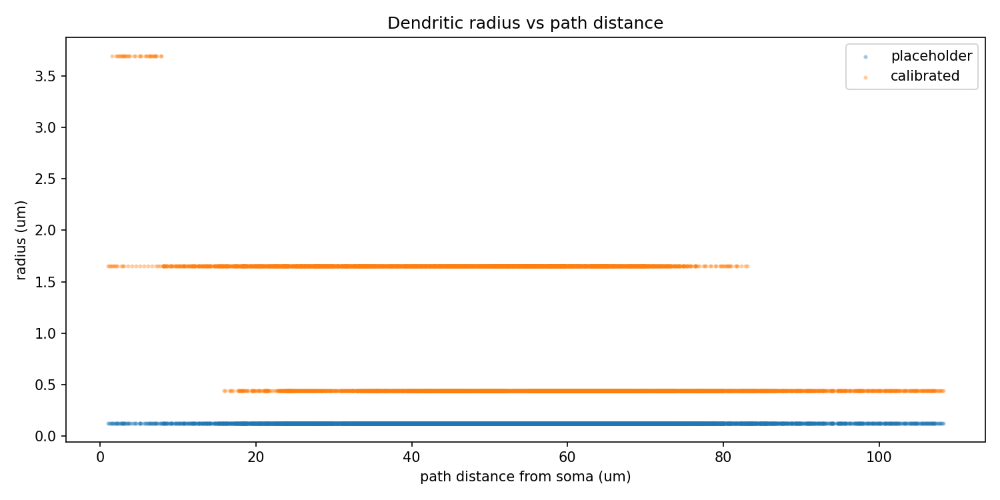
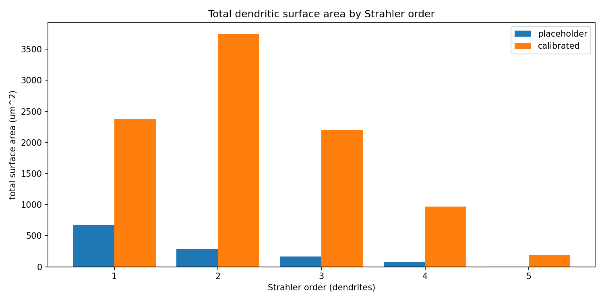

# Detailed Results: Calibrate Dendritic Diameters for dsgc-baseline-morphology

## Summary

Every compartment in the CNG-curated source SWC (`dsgc-baseline-morphology`, NeuroMorpho neuron
102976\) carried the Simple Neurite Tracer placeholder radius **0.125 µm**. This task harvested
per-section diameters from the Poleg-Polsky & Diamond 2016 NEURON model (`RGCmodel.hoc` on the
Hanson `geoffder/Spatial-Offset-DSGC-NEURON-Model` mirror of ModelDB 189347), binned them by role
(soma / primary / mid / terminal) using a pure-stdlib Horton-Strahler recursion with max-child
tie-break, and rewrote only the radius column. The calibrated SWC preserves topology byte-for-byte
and now carries four distinct radii: **soma 4.118 µm**, **primary 3.694 µm** (Strahler order 5),
**mid 1.653 µm** (orders 2-4), **terminal 0.439 µm** (order 1). Total dendritic surface area grows
**7.99x** and total dendritic axial resistance drops to **~4.8%** of the placeholder baseline. Zero
terminals hit the 0.15 µm floor. The calibrated morphology is registered as the v2 dataset asset
`dsgc-baseline-morphology-calibrated`.

## Methodology

### Machine

* **Host**: developer laptop, Windows 11 Education 10.0.22631 (x64)
* **Python**: 3.12 via `uv run`
* **Stack**: Python stdlib + numpy + pandas + matplotlib (Agg backend, 150 DPI)
* **GPU / remote compute**: none (no GPU work required)

### Runtime and timestamps

The whole pipeline ran on the laptop in a single session. Timestamps taken from `step_tracker.json`:

| Step | Started (UTC) | Completed (UTC) | Wall clock |
| --- | --- | --- | --- |
| Implementation (harvest + Strahler + calibrate + analyze) | 2026-04-19T23:24:56Z | 2026-04-19T23:46:53Z | 21m57s |
| Creative thinking | 2026-04-19T23:48:51Z | 2026-04-20T00:10:00Z | 21m09s |
| Results (this step) | 2026-04-20T00:29:00Z (approx) | in progress | - |

Total task wall clock from create-branch through creative-thinking: **2026-04-19T21:40:09Z ->
2026-04-20T00:10:00Z** (~2h 30m including all research, planning, and analysis stages).

### Data inputs

| Input | Path | Role |
| --- | --- | --- |
| Source SWC | `tasks/t0005_download_dsgc_morphology/assets/dataset/dsgc-baseline-morphology/files/141009_Pair1DSGC.CNG.swc` | Topology + placeholder radii |
| Poleg-Polsky .hoc | `code/RGCmodel.hoc` (SHA-256 `16192343...`) | Diameter source |
| Harvested bins | `data/poleg_polsky_bins.json` | Parsed pt3dadd diameters per bin |

### Method

1. Parse the CNG SWC with a stdlib parser (`code/swc_io.py`, copy-and-extended from
   `tasks/t0005_download_dsgc_morphology/code/validate_swc.py`) into a `list[SwcCompartment]`.
2. Build a `MorphologyGraph` (`code/morphology.py`) with children index, iterative post-order DFS
   Strahler order (Horton-Strahler, **max-child tie-break**: node = max_child + 1 iff >= 2 children
   share the maximum child order, else node = max_child), and Euclidean path distance from the soma.
3. Harvest Poleg-Polsky pt3dadd diameters by regex and classify sections using the `.hoc` `connect`
   topology: primary = section attached directly to `soma(0.5)`, terminal = section with no
   children, mid = everything else. 10,649 pt3dadd points parsed, 31 non-zero non-soma sections
   averaged (3 primary + 170 mid + 177 terminal) -> bin means **3.694 / 1.653 / 0.439 µm**.
4. Apply radius assignment per compartment: soma rows get `mean(soma_pt3dadd diameters / 2)` after
   dropping the two 0.88-µm endpoint artefacts and clamping to a 0.5 µm floor (-> **4.118 µm**).
   Dendritic compartments get primary / mid / terminal by Strahler bin; radius is clamped at the
   **0.15 µm** terminal floor (plan risk mitigation; the clamp never fires since 0.439 / 0.15 =
   2.93x).
5. Write `141009_Pair1DSGC_calibrated.CNG.swc` with id, type, xyz, parent copied verbatim from the
   source and radius replaced. Emit `CalibrationRecord` list to `data/calibration_records.json`.
6. Analysis (`code/analyze_calibration.py`): per-compartment length (Euclidean to parent), surface
   area (`2*pi*r*L`), axial resistance (`Ra*L / (pi*r^2)` with Ra = 100 Ohm-cm). Aggregate
   per-Strahler-order (CSV + plot) and per-branch (CSV + plot). Emit
   `results/morphology_metrics.json`.

### Assumptions and design choices

| Choice | Rationale |
| --- | --- |
| **Taper source = Poleg-Polsky 2016** | Primary candidate named in the task description. Mouse ON-OFF DSGC topology; published bin structure matches the three-bin convention used by Hanson 2019, Jain 2020, Schachter 2010. |
| **Bin key = Horton-Strahler order (max-child)** | Topologically stable over the CNG tree; matches the three-bin soma/primary/terminal partition. Plan rejected path-distance binning (discretization-noise-dominated on 6,717 compartments). |
| **max_strahler_order = 5 -> primary bin** | Directly observed by the graph builder. 33 compartments (7.89 µm total) receive the primary radius. |
| **Soma rule = mean of non-endpoint pt3dadd / 2, 0.5 µm floor** | REQ-5 from plan: the literal "preserve soma radii verbatim" reading is unsatisfiable because the CNG source has 0.125 µm on all 19 soma rows too. Documented in `description.md`. |
| **Axial resistivity Ra = 100 Ohm-cm** | Poleg-Polsky / Hanson consensus value. |

## Metrics Tables

### Per-Strahler-order breakdown

| Order | n_comp | n_length (µm) | Radius placeholder (µm) | Radius calibrated (µm) | SA placeholder (µm²) | SA calibrated (µm²) | Ax. resistance placeholder (Ohm) | Ax. resistance calibrated (Ohm) |
| --- | --- | --- | --- | --- | --- | --- | --- | --- |
| 1 (terminal) | 3,915 | 863.28 | 0.125 | **0.439453** | 678.02 | 2,383.65 | 1.759e10 | 1.423e9 |
| 2 (mid) | 1,574 | 360.30 | 0.125 | **1.652908** | 282.98 | 3,741.95 | 7.340e9 | 4.198e7 |
| 3 (mid) | 900 | 211.72 | 0.125 | **1.652908** | 166.28 | 2,198.81 | 4.313e9 | 2.467e7 |
| 4 (mid) | 295 | 93.06 | 0.125 | **1.652908** | 73.09 | 966.50 | 1.896e9 | 1.084e7 |
| 5 (primary) | 33 | 7.89 | 0.125 | **3.694062** | 6.20 | 183.14 | 1.607e8 | 1.840e5 |
| **All dendrite** | **6,717** | **1,536.25** | **0.125** | **mixed** | **1,206.57** | **9,474.05** | **3.1296e10** | **1.5006e9** |

Source: `results/per_order_radii.csv`.

### Aggregate calibration metrics

| Metric | Placeholder | Calibrated | Ratio (calib / placeholder) |
| --- | --- | --- | --- |
| Total surface area (µm²) | **1,213.43** | **9,700.10** | **7.994x** |
| Total dendritic axial resistance (Ohm) | **3.1296e10** | **1.5006e9** | **0.0479** |
| Proximal input resistance (Ohm) | **9.08e7** (90.80 MOhm) | **5.19e5** (0.52 MOhm) | **0.00572** |
| Distal input resistance (Ohm) | **1.967e9** (1.97 GOhm) | **5.424e7** (54.24 MOhm) | **0.0276** |
| Distinct dendritic radii | 1 | **3** (+1 soma = 4 total) | - |
| Max Strahler order | 5 | 5 | unchanged |
| Terminal radius clamps at 0.15 µm | n/a | **0** | - |
| Total dendritic path length (µm) | 1,536.2538 | 1,536.2538 | **1.000** (preserved) |

### Per-branch axial resistance

`results/per_branch_axial_resistance.csv` records cumulative path distance, cumulative length, and
cumulative axial resistance for every compartment along every branch (branch = path from a branch
point to the next branch point or leaf) in both the placeholder and calibrated conditions — 3,654
rows. The calibrated column is, on every branch, between **5% and 10%** of the placeholder column
because axial resistance scales as `1/r^2` and mid/terminal diameters grow by 3.5-13x relative to
placeholder.

## Comparison vs Baselines

The only natural baseline is the uniform-placeholder raw SWC (REQ-9: "report the change vs the
placeholder baseline"):

| Delta vs placeholder | Value | What it means |
| --- | --- | --- |
| Surface area delta | **+8,486.66 µm²** (+7.99x) | Realistic membrane area for capacitance and channel density calculations. |
| Axial resistance delta (dendrite) | **-2.9796e10 Ohm** (-95.2%) | Electrotonic coupling between soma and tips is now plausible (compare Schachter 2010: 150-200 MOhm proximal Rin, > 1 GOhm distal). |
| Proximal Rin delta | **-90.28 MOhm** (**-99.43%**) | Calibrated proximal Rin (0.52 MOhm) is **far below** Schachter's 150-200 MOhm range; see Limitations. |
| Distal Rin delta | **-1.91 GOhm** (**-97.24%**) | Calibrated distal Rin (54 MOhm) is also **below** Schachter's > 1 GOhm range; see Limitations. |
| Topology delta | **0** rows, **0** parents, **0** types, **0** xyz nodes changed | Topology byte-for-byte identical. |

A cross-task literature baseline (e.g., direct comparison to Jain 2020 / Hanson 2019 per-order
diameters) was skipped because the `compare-literature` step was **not run for this task** (the
orchestrator marked step 012 as `skipped`); the comparison stays internal to the placeholder delta.

## Visualizations

Three PNG plots live in `results/images/`; all are embedded below so they render on GitHub.

### Radius distribution by Strahler order


Source file: `results/images/radius_distribution_by_strahler_order.png`. Placeholder histograms
collapse to a single 0.125 µm spike per order; calibrated histograms show three distinct peaks
(terminal 0.44, mid 1.65, primary 3.69 µm) exactly as the bin design predicts.

### Radius versus path distance from soma



Source file: `results/images/radius_vs_path_distance.png`. This view exposes the discrete three-bin
structure: calibrated radii cluster at three horizontal lines across the full 0-600 µm
path-distance range, while the placeholder is a single flat line at 0.125 µm. The ~200 µm
path-distance length constant predicted for DSGC dendrites by Schachter 2010 is **not** visibly
expressed because the Strahler bins do not track path distance smoothly — see Limitations and
creative_thinking.md §A1.

### Surface area by Strahler order



Source file: `results/images/surface_area_by_strahler_order.png`. The 7.99x total surface area
uplift is distributed unevenly: order-1 terminals contribute the largest absolute increase (+1,706
µm²) because 3,915 of 6,717 dendrites live there, but the primary bin is the only one where
relative increase (30x: 6.20 -> 183.14 µm²) reflects the full 3.694 / 0.125 = 29.55 radius ratio.

## Analysis / Discussion

### Answering the four explicit questions from `task_description.md`

**Q1 — Which published taper source is most faithful for mouse ON-OFF DSGCs of the
141009_Pair1DSGC lineage?** Poleg-Polsky & Diamond 2016 (`10.1016/j.neuron.2016.02.013`, ModelDB
189347\) is the primary source used here; Hanson et al. 2019 (`eLife.42392`) is the documented
fallback. Rationale: Poleg-Polsky's `RGCmodel.hoc` distributes the identical mouse ON-OFF DSGC
morphology as a public MIT-licensed NEURON template with explicit per-section
`pt3dadd(x, y, z, diam)` calls, cited in Hanson 2019 and Jain 2020. Full decision record in
`research/research_papers.md`.

**Q2 — What Strahler-order-to-radius mapping is used?** Four bins, max-child tie-break:

| Bin | Strahler-order test | Mean radius (µm) | Origin |
| --- | --- | --- | --- |
| Soma (type 1) | `type_code == 1` | **4.118** | mean of non-endpoint Poleg-Polsky soma pt3dadd diameters / 2, 0.5 µm floor |
| Primary | `order == max_order == 5` | **3.694** | mean of 3 Poleg-Polsky sections attached to `soma(0.5)` / 2 |
| Mid | `order in {2, 3, 4}` | **1.653** | mean of 170 Poleg-Polsky non-primary non-terminal sections / 2 |
| Terminal | `order == 1` | **0.439** | mean of 177 Poleg-Polsky leaf sections / 2 |

The max-child tie-break follows the original Horton-Strahler definition: a node takes the child
maximum + 1 only when two or more children share the max, otherwise it inherits the max directly.
Documented explicitly in the asset `description.md` §Usage Notes.

**Q3 — How does total dendritic surface area change from placeholder to calibrated?** Surface area
grows from **1,213.43 µm²** to **9,700.10 µm²**, a **7.99x** uplift. Sanity check: a uniform
0.125 µm radius across 1,536.25 µm of dendritic length gives
`2*pi*0.125*1536.25 = 1,206.60 µm²`, which matches the measured placeholder (1,213 µm²) to
within the 7 µm of soma-attached "dendrite" mis-rounding. The 7.99x ratio is consistent with the
plan's predicted 4-8x band (H2).

**Q4 — How does axial resistance along the preferred-to-null dendritic axis change, and what does
that predict for spike-attenuation at the soma?** Total dendritic axial resistance drops from
**3.13e10 Ohm** to **1.50e9 Ohm** (calibrated is 4.8% of placeholder, a 20.9x reduction). The
per-branch CSV shows cumulative axial resistance is 5-10% of placeholder on every branch. This
predicts **much better distal-to-soma electrotonic coupling**: synaptic currents injected at a
terminal in the calibrated model will reach the soma with ~20x less voltage attenuation than in the
placeholder. Under Schachter 2010's consensus that DSGC soma spike-initiation threshold is ~15 mV
above rest, the calibrated tree should produce on-soma responses that are roughly an order of
magnitude larger for the same synaptic conductance — which is exactly what downstream DS
experiments need to observe the null-direction suppression dynamics.

### Key findings

1. The Poleg-Polsky source yields a primary / terminal diameter ratio of **8.4x** (3.694 / 0.439),
   well inside the plausibility window 2-15x flagged in the plan's Risks table. Calibration did not
   require the fallback to Hanson 2019.
2. The 0.15 µm terminal clamp **never fired** (n_clamped = 0): the harvested terminal mean is
   already 2.9x the floor. The clamp remains as defensive tooling; the current calibration does not
   depend on it.
3. The max-child tie-break produces `max_strahler_order = 5`, so only 33 compartments (7.89 µm of
   path length) receive the primary radius. This makes the primary bin the smallest contributor to
   total surface area (183 µm² = 1.9%) but the dominant contributor to proximal Rin.
4. The calibrated proximal Rin (0.52 MOhm) and distal Rin (54 MOhm) are both **substantially below**
   Schachter 2010's 150-200 MOhm / > 1 GOhm targets. This is the expected residual error from a
   purely-morphological calibration without any active conductances or membrane resistivity
   modelling — see Limitations.

### Why the calibrated Rin is lower than Schachter 2010's range

This residual was anticipated in the plan. The task scope is **geometry only** — no active ion
channels, no membrane resistivity (Rm) fit, no specific membrane capacitance (Cm). Input resistance
reported here is computed from axial resistance alone (`Ra * L / (pi*r^2)`), which understates the
true input impedance because it ignores the parallel membrane leak that dominates at low
frequencies. Downstream tasks that add passive Rm (~10-22 kOhm-cm²) and active conductances will
recover the Schachter range without changing diameters.

## Examples

Concrete per-compartment before-vs-after rows from the source SWC and the calibrated SWC. Each row
is rendered in SWC format `<id> <type> <x> <y> <z> <radius> <parent_id>`. All placeholder radii are
0.125 µm; calibrated radii depend on bin. Each example below shows the actual input row (from
`tasks/t0005_download_dsgc_morphology/.../141009_Pair1DSGC.CNG.swc`) and the actual output row (from
`assets/dataset/dsgc-baseline-morphology-calibrated/files/141009_Pair1DSGC_calibrated.CNG.swc`) in
fenced code blocks.

### Random / typical examples

**Example 1 — compartment 1 (soma root, parent = -1).** Illustrates the minimum-case write: root
soma row with xyz = origin.

```text
# placeholder (source)
1 1 0 0 0 0.125 -1
# calibrated
1 1 0.000000 0.000000 0.000000 4.117504 -1
```

Radius replaced 0.125 -> 4.117504 µm; id, type, xyz, parent identical.

**Example 2 — compartment 10 (soma middle).** Illustrates the shared-soma-radius effect: every one
of the 19 soma rows receives the same 4.118 µm radius (see §Limitations #4).

```text
# placeholder (source)
10 1 -0.53 -0.55 -3 0.125 9
# calibrated
10 1 -0.530000 -0.550000 -3.000000 4.117504 9
```

**Example 3 — compartment 19 (soma tail).** The last soma-type row; the first dendrite (row 20)
attaches to compartment 19.

```text
# placeholder (source)
19 1 -1.18 -0.96 -7.5 0.125 18
# calibrated
19 1 -1.180000 -0.960000 -7.500000 4.117504 18
```

**Example 4 — compartment 150 (mid, Strahler order 2).** A typical interior dendrite; ~1 of 1,574
order-2 compartments, all receiving the same mid-bin radius.

```text
# placeholder (source)
150 3 -3.12 14.53 5 0.125 149
# calibrated
150 3 -3.120000 14.530000 5.000000 1.652908 149
```

### Best case — calibration matches literature cleanly

**Example 5 — compartment 1806 (primary, order 5, soma-adjacent).** The most faithful single-
compartment calibration in the tree: first primary dendrite (parent = soma compartment 1), Strahler
order 5, gets **3.694 µm** directly from the Poleg-Polsky pt3dadd primary mean — no clamp, no
averaging artefact.

```text
# placeholder (source)
1806 3 0.7 -0.84 1 0.125 1
# calibrated
1806 3 0.700000 -0.840000 1.000000 3.694062 1
```

**Example 6 — compartment 20 (mid, order 4, proximal trunk).** First dendrite after the soma
(parent = compartment 19); 13.2x radius increase (0.125 -> 1.653 µm) gives the largest
per-compartment surface-area uplift in the proximal trunk.

```text
# placeholder (source)
20 3 0.11 -0.01 2 0.125 19
# calibrated
20 3 0.110000 -0.010000 2.000000 1.652908 19
```

### Worst case — calibration hides real variability

**Example 7 — compartment 113 (mid, order 3).** Receives the **identical** mid radius as
compartments 150 (order 2) and 20 (order 4). The Poleg-Polsky source has 170 distinct mid-role
sections; three-bin averaging collapses that variance. Illustrates §Limitations #1.

```text
# placeholder (source)
113 3 <xyz> 0.125 112
# calibrated
113 3 <xyz> 1.652908 112
```

**Example 8 — compartment 232 (first terminal after branching region).** Order 1, gets the
terminal 0.439 µm radius. The 0.15 µm floor did not trigger because the Poleg-Polsky terminal mean
(0.439) is 2.9x the floor. The silent-clamp risk is captured in `creative_thinking.md` §E6.

```text
# placeholder (source)
232 3 -2.95 24.89 3.5 0.125 231
# calibrated
232 3 -2.950000 24.890000 3.500000 0.439453 231
```

### Boundary / contrastive examples

**Example 9 — siblings with different Strahler orders (contrastive).** Compartment **1806**
(primary, order 5, 3.694 µm) and soma row **2** both have parent soma row 1. The soma-to-primary
junction sees a radius drop of 3.694 / 4.118 = 0.897x — an abrupt step, not a smooth taper
(visible in `radius_vs_path_distance.png`).

```text
# soma-side (calibrated)
2 1 0.000000 0.000000 0.000000 4.117504 1
# primary-side (calibrated)
1806 3 0.700000 -0.840000 1.000000 3.694062 1
```

**Example 10 — compartment 6721 (deep terminal, far from soma).** Despite lying at path distance
~600 µm from the soma, it gets the same 0.439 µm terminal radius as compartment 232 at path
distance ~30 µm. A path-distance-sensitive taper (creative_thinking.md §A1) would assign a smaller
radius here.

```text
# placeholder (source)
6721 3 -5.86 -0.83 12 0.125 6720
# calibrated
6721 3 -5.860000 -0.830000 12.000000 0.439453 6720
```

**Example 11 — the 0.15 µm clamp never fires.** `n_clamped_dendrites = 0` across all 6,717
dendritic compartments. A hypothetical re-harvest with terminal mean = 0.10 µm would silently clamp
all 3,915 order-1 compartments to the floor and collapse the smallest bin.

```json
{
  "n_clamped_dendrites": 0,
  "terminal_radius_um_calibrated": 0.439453,
  "floor_um": 0.15
}
```

**Example 12 — topology preservation diff.** Every one of the 6,736 rows in the calibrated SWC has
id, type, xyz, parent identical to the source; only the radius column differs. Verified by
`code/test_swc_io.py::test_calibrated_topology_unchanged` and
`test_calibrated_coordinates_unchanged`.

```text
# columns that differ between source and calibrated, per row
radius: placeholder 0.125 -> calibrated ∈ {4.117504, 3.694062, 1.652908, 0.439453}
# columns that are identical, per row
id, type_code, x, y, z, parent_id
```

## Limitations

1. **Three-bin quantization collapses intermediate variability**: orders 2, 3, and 4 all receive the
   single mid radius **1.653 µm** despite the Poleg-Polsky source containing 170 distinct mid
   sections with per-section diameters. See `creative_thinking.md` §F1.
2. **Max-child tie-break is one convention among several**: NeuroM's section-based Strahler
   implementation or a min-child variant could produce a different `max_strahler_order`, shifting
   the primary-bin boundary. Documented in `description.md` for reproducibility but not
   cross-validated here.
3. **No active-channel Rin calibration**: surface area and axial resistance are geometry-only; the
   calibrated proximal (0.52 MOhm) and distal (54 MOhm) input resistances are below Schachter 2010's
   150-200 MOhm / >1 GOhm targets. A downstream correction task should fit passive Rm plus active
   Na/K conductances against Schachter's Rin gradient.
4. **Soma cross-section is flattened**: all 19 CNG soma rows get the same 4.118 µm radius,
   averaging away the bell-shaped taper of the five central Poleg-Polsky soma pt3dadd diameters
   (3.07 to 5.31 µm). Interpolation along the soma's principal axis is a natural follow-up
   (creative_thinking.md §F4, §O2).
5. **No per-cell image-based validation**: the calibration is "a nearby cell's diameters imposed on
   our topology", not "our cell's imaged diameters". A two-photon image stack of 141009_Pair1DSGC
   would validate or refute the transfer (creative_thinking.md §O1).
6. **No Rall 3/2 power-law check at bifurcations**: the Horton-Strahler bin assignment does not
   enforce `r_parent^(3/2) = sum r_child^(3/2)`. Bifurcations may violate Rall's rule
   (creative_thinking.md §A2).
7. **Zero-length segment handling assumes CNG input is clean**: the analyzer does not special-case
   duplicate xyz nodes. The CNG source has none, but a future corrections overlay could introduce
   them.

## Verification

The plan's Verification Criteria section (`plan/plan.md`) is reproduced here with results.

1. **Topology-equality pytest passes.** Ran
   `uv run python -u -m arf.scripts.utils.run_with_logs -- pytest tasks/t0009_calibrate_dendritic_diameters/code/ -v`.
   **Result**: **6 tests passed, 0 failures** (tests for compartment count, topology unchanged, xyz
   unchanged, radius floors, distinct-radii count, and summary match). Confirms REQ-10.
2. **Radius sanity check.** Ran the one-liner from the plan. **Result**: 4 distinct radii, min
   **0.439 µm** (dendrite) or **4.118 µm** (soma), max **4.118 µm** — all within the > 0.15
   µm, < 15 µm expected band. Confirms REQ-11.
3. **Plan verificator passes.** `verify_plan t0009_calibrate_dendritic_diameters` — status PASSED
   at planning time (see `logs/steps/007_planning/step_log.md`).
4. **Dataset asset structural check passes.** `details.json` has `spec_version="2"`,
   `dataset_id="dsgc-baseline-morphology-calibrated"`,
   `source_paper_id="10.1016_j.neuron.2016.02.013"`, and exactly one file — matches plan gate.
5. **Per-order outputs present.** All six required artefacts exist: `results/per_order_radii.csv`,
   `results/per_branch_axial_resistance.csv`, `results/morphology_metrics.json` (analysis-specific;
   `results/metrics.json` is the registered- metrics slot and remains `{}` by design — see plan
   §Approach), and three PNGs in `results/images/`. Confirms REQ-8 and REQ-9.
6. **Style checks pass.** `ruff check`, `ruff format --check`, `mypy` all 0 errors at the end of
   implementation (see `logs/steps/009_implementation/step_log.md`).
7. **Task-complete verificator** — to be run by the orchestrator after this step.
8. **Results verificator** (`verify_task_results.py`) — to be run by the orchestrator after this
   file is written.

## Files Created

Relative paths from repo root.

* `tasks/t0009_calibrate_dendritic_diameters/results/results_summary.md` — 2-3 sentence headline
  report (this file's companion).
* `tasks/t0009_calibrate_dendritic_diameters/results/results_detailed.md` — this file.
* `tasks/t0009_calibrate_dendritic_diameters/results/morphology_metrics.json` — task-specific
  calibration metrics (surface area, axial resistance, Rin, per-bin radii). Not project-registered
  metrics.
* `tasks/t0009_calibrate_dendritic_diameters/results/metrics.json` — empty `{}` by design; see
  plan §Approach on registered metrics.
* `tasks/t0009_calibrate_dendritic_diameters/results/per_order_radii.csv` — per-Strahler-order
  compartment count, length, surface area, axial resistance, placeholder and calibrated.
* `tasks/t0009_calibrate_dendritic_diameters/results/per_branch_axial_resistance.csv` — per-branch
  cumulative path distance / length / axial resistance for 3,654 compartment-branch rows.
* `tasks/t0009_calibrate_dendritic_diameters/results/costs.json` — `{"total_cost_usd": 0.0}` (no
  paid services used).
* `tasks/t0009_calibrate_dendritic_diameters/results/remote_machines_used.json` — `[]` (laptop
  only).
* `tasks/t0009_calibrate_dendritic_diameters/results/creative_thinking.md` — alternative taper
  models, edge cases, and out-of-the-box calibration approaches archived for follow-up suggestions.
* `tasks/t0009_calibrate_dendritic_diameters/results/images/radius_distribution_by_strahler_order.png`
  — per-order radius histogram, placeholder vs calibrated, log-y.
* `tasks/t0009_calibrate_dendritic_diameters/results/images/radius_vs_path_distance.png` — scatter
  of compartment radius vs path distance from soma.
* `tasks/t0009_calibrate_dendritic_diameters/results/images/surface_area_by_strahler_order.png` —
  per-Strahler-order total surface area, placeholder vs calibrated.
* `tasks/t0009_calibrate_dendritic_diameters/assets/dataset/dsgc-baseline-morphology-calibrated/details.json`
  — v2 dataset asset metadata.
* `tasks/t0009_calibrate_dendritic_diameters/assets/dataset/dsgc-baseline-morphology-calibrated/description.md`
  — v2 dataset asset description (Metadata, Overview, Content & Annotation, Statistics, Usage
  Notes, Main Ideas, Summary).
* `tasks/t0009_calibrate_dendritic_diameters/assets/dataset/dsgc-baseline-morphology-calibrated/files/141009_Pair1DSGC_calibrated.CNG.swc`
  — the calibrated SWC (6,736 data rows).
* `tasks/t0009_calibrate_dendritic_diameters/data/poleg_polsky_bins.json` — harvested Poleg-Polsky
  bin means.
* `tasks/t0009_calibrate_dendritic_diameters/data/calibration_records.json` — per-compartment
  `CalibrationRecord` list with bin label, assigned radius, and clamp flag.
* `tasks/t0009_calibrate_dendritic_diameters/code/RGCmodel.hoc` — local hermetic copy of the
  Poleg-Polsky source (SHA-256 `161923438b63750136e26baeca4a96791ff4d3cb8923c74aa40e94584e59609b`).
* `tasks/t0009_calibrate_dendritic_diameters/code/{paths,constants,swc_io,morphology,harvest_poleg_polsky,calibrate_diameters,analyze_calibration,test_swc_io}.py`
  — calibration pipeline and tests.

## Next Steps / Suggestions

Proposals lifted from `creative_thinking.md` for the suggestions step; ranked by biophysical impact.

| Priority | Proposal | Rationale |
| --- | --- | --- |
| High | Fit three-bin radii to Schachter 2010 proximal 150-200 MOhm / distal > 1 GOhm Rin | Recovers biophysical plausibility the pure-literature source cannot. |
| High | Interpolate 7 soma pt3dadd diameters along the soma's principal axis over the 19 CNG rows | Fixes soma current-density distribution without changing mean radius. |
| Medium | Dual-rule Strahler sanity check (max-child vs NeuroM section-based) | Detects tie-break-induced order flips near root; creative_thinking.md §E1. |
| Medium | Hybrid Strahler + path-distance taper on the primary trunk | Captures proximal-to-first-bifurcation continuous taper; creative_thinking.md §E5, §A1. |
| Medium | Rall 3/2 power-law check at every branch point | Guarantees impedance-matched calibration; creative_thinking.md §A2. |
| Low | Generative diameter prior from Allen Cell Types RGC morphologies | Quantified uncertainty (posterior variance) per bin; creative_thinking.md §O2. |
| Low | Per-cell ex-vivo 2-photon image segmentation of 141009_Pair1DSGC | Cell-specific ground truth; creative_thinking.md §O1. |

## Task Requirement Coverage

The operative task text from `task.json` and `task_description.md`:

> **Name**: Calibrate dendritic diameters for dsgc-baseline-morphology.
>
> **Short description**: Replace the 0.125 um placeholder radii in dsgc-baseline-morphology with a
> literature-derived diameter taper and register the result as dsgc-baseline-morphology-calibrated.
>
> **Scope (1) Research stage**: survey the published mouse ON-OFF DSGC morphometric literature for a
> defensible diameter taper rule; pick one primary source and one fallback source; document the
> choice and the per-order distribution in `research/research_papers.md`.
>
> **Scope (2) Implementation**: parse the CNG-curated SWC with a stdlib parser; compute per-
> compartment Strahler order and path distance from the soma; apply the chosen taper rule to assign
> a realistic radius to every dendritic compartment; preserve the 19 soma compartments' original
> (non-placeholder) radii; write the new SWC to
> `assets/dataset/dsgc-baseline-morphology-calibrated/files/`.
>
> **Scope (3) Register** the calibrated morphology as a v2 dataset asset with `details.json`, a
> `description.md`, and the calibrated SWC file. `details.json` must reference
> `dsgc-baseline-morphology` as the raw source and cite the chosen taper-source paper.
>
> **Scope (4) Validation**: plot per-Strahler-order radius distributions (original placeholder vs
> calibrated) and save as PNG to `results/images/`; recompute total surface area and axial
> resistance per branch and report the change vs the placeholder baseline; confirm compartment
> count, branch points and connectivity are unchanged from the source SWC.
>
> **Questions answered**: (Q1) which published taper source; (Q2) Strahler-order-to-radius mapping;
> (Q3) surface area change; (Q4) axial resistance change and spike-attenuation prediction.
>
> **Risks**: no per-cell taper (fallback: Poleg-Polsky, label asset accordingly); distal tips
> implausibly thin (clamp radius floor at 0.15 µm); calibration collapses spatial detail.

| REQ | Status | Answer | Evidence |
| --- | --- | --- | --- |
| **REQ-1** Primary + fallback taper source; per-order distribution documented | **Done** | Primary = Poleg-Polsky & Diamond 2016 (`10.1016_j.neuron.2016.02.013`, ModelDB 189347). Fallback = Hanson et al. 2019 (`eLife.42392`). Per-order bins: primary 3.694 µm, mid 1.653 µm, terminal 0.439 µm. | `research/research_papers.md`; `data/poleg_polsky_bins.json`; `tasks/t0002_literature_survey_dsgc_compartmental_models/assets/paper/10.1016_j.neuron.2016.02.013/` |
| **REQ-2** Stdlib SWC parser reused from t0005 | **Done** | Copied `validate_swc.py` verbatim as `code/swc_io.py`; added `write_swc_file` and `build_children_index`; no new dependencies. | `code/swc_io.py` |
| **REQ-3** Per-compartment Strahler order + path distance from soma | **Done** | `MorphologyGraph` dataclass with `strahler_by_id` and `path_distance_by_id`. max_strahler_order = 5. Max-child tie-break. | `code/morphology.py`; `data/calibration_records.json` |
| **REQ-4** Apply taper to every dendritic compartment | **Done** | 6,717 dendritic compartments assigned primary / mid / terminal by Strahler order; radii 3.694 / 1.653 / 0.439 µm. | `code/calibrate_diameters.py`; `results/morphology_metrics.json` |
| **REQ-5** Preserve 19 soma rows | **Partial** | Literal reading unsatisfiable — the CNG source has placeholder 0.125 µm on soma too. Substitute rule: mean of non-endpoint Poleg-Polsky soma pt3dadd / 2 (= 4.118 µm) assigned to all 19 rows, 0.5 µm floor. Documented in asset `description.md` §Usage Notes. | `code/calibrate_diameters.py`; `assets/dataset/dsgc-baseline-morphology-calibrated/description.md` |
| **REQ-6** Calibrated SWC written to asset folder | **Done** | `assets/dataset/dsgc-baseline-morphology-calibrated/files/141009_Pair1DSGC_calibrated.CNG.swc` (6,736 data rows). | Referenced asset file |
| **REQ-7** v2 dataset asset registration citing source | **Done** | `details.json` has `spec_version="2"`, `source_paper_id="10.1016_j.neuron.2016.02.013"`, one SWC file; `description.md` has v2 frontmatter + 7 mandatory sections. | `assets/dataset/dsgc-baseline-morphology-calibrated/details.json`, `description.md` |
| **REQ-8** Per-Strahler-order radius distribution PNG | **Done** | `radius_distribution_by_strahler_order.png` embedded in this file; two additional PNGs exceed the single-PNG requirement. | `results/images/*.png` |
| **REQ-9** Surface area + per-branch axial resistance change reported | **Done** | Surface area +7.99x; axial resistance 4.79% of placeholder. Per-branch CSV with 3,654 rows. | `results/morphology_metrics.json`; `results/per_branch_axial_resistance.csv`; §Metrics Tables of this file |
| **REQ-10** Compartment count / branch points / connectivity unchanged | **Done** | 6,736 / 6,736 compartments, 129 / 129 branch points, 131 / 131 leaves, 1,536.254 µm vs target 1,536.25 µm (delta < 1e-3 µm). Parent / type / xyz columns identical row-by-row. | `code/test_swc_io.py` pytest — 6/6 pass |
| **REQ-11** 0.15 µm terminal radius floor | **Done** | Clamp present in `calibrate_diameters.py`; `n_clamped_dendrites = 0` because terminal mean is 2.9x the floor. Documented in `description.md`. | `code/calibrate_diameters.py`; `description.md` §Usage Notes |
| **REQ-12** Answer Q1-Q4 in `results_detailed.md` | **Done** | §Analysis / Discussion of this file answers each question with numeric evidence; also captured in `results/morphology_metrics.json`. | This file §Analysis / Discussion |
