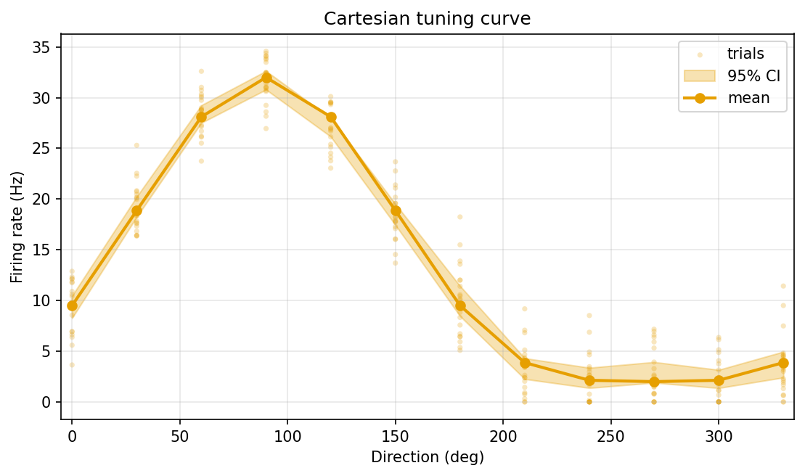
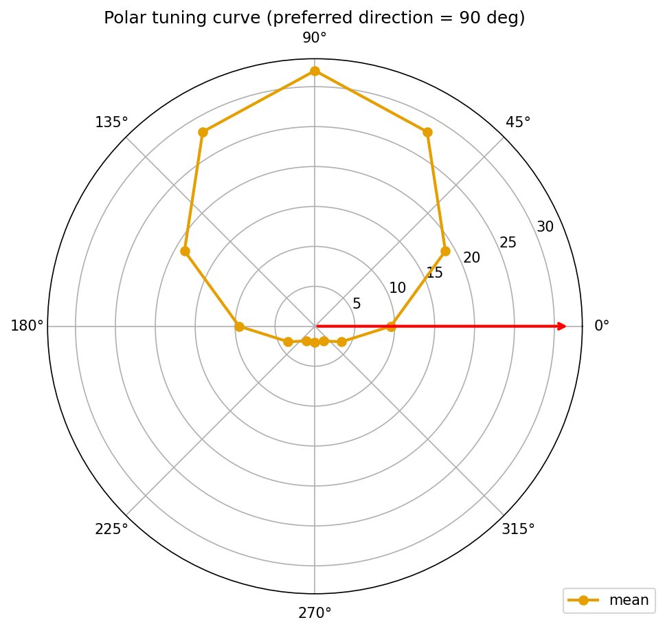
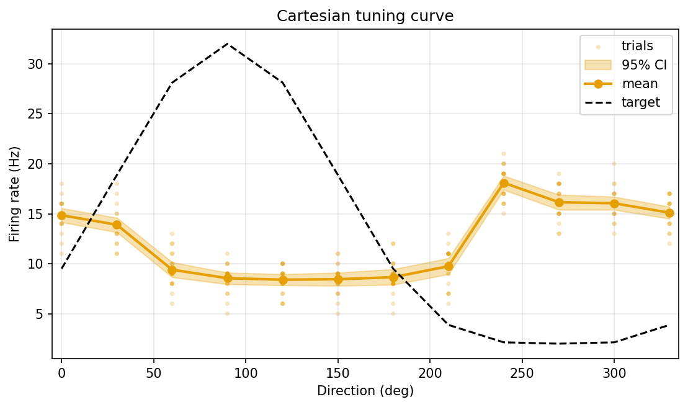
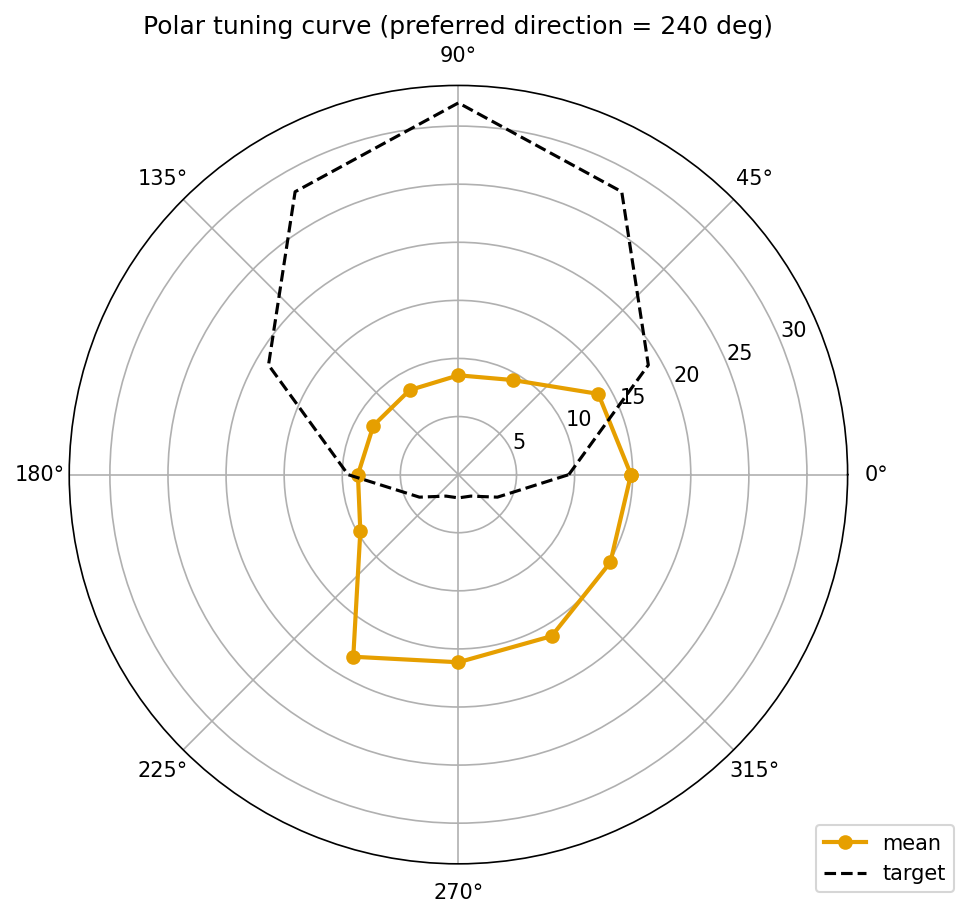
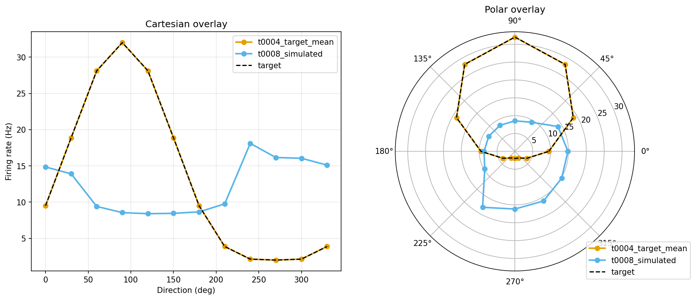
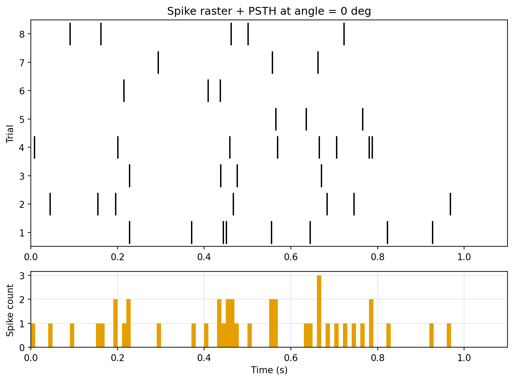
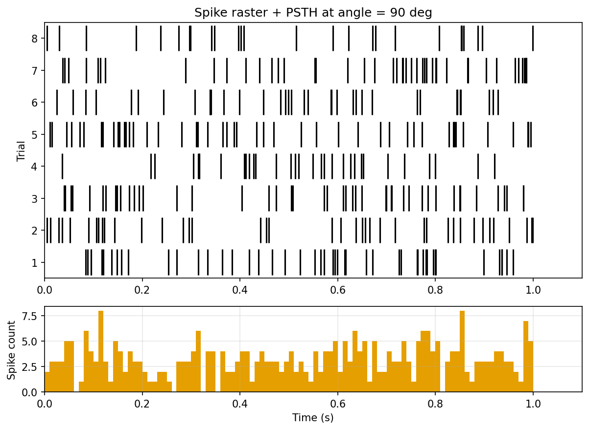

# Results Detailed

## Summary

This task delivered `tuning_curve_viz`, a standalone matplotlib visualization library that turns
tuning-curve CSVs into publication-quality Cartesian and polar firing-rate-vs-angle plots,
multi-model overlays, and per-angle raster-plus-PSTH panels. The library exposes **4** top-level
plotting functions, a thin `argparse`-based CLI, and **11** Python modules. It reuses the canonical
`load_tuning_curve` loader from t0012 rather than duplicating CSV schema logic. A deterministic
synthetic Poisson spike fixture (seed 42) is used for the raster+PSTH smoke test because no real
spike-time CSV exists in the project yet. All **7** example PNGs are committed under the asset's
`files/` folder so the library asset itself demonstrates each plot type.

## Methodology

* **Machine**: local Windows 11 laptop (no remote compute; the task type is `write-library` and was
  explicitly scoped as local-only).
* **Runtime**: total task runtime was roughly **43 minutes** from `create-branch`
  (2026-04-20T14:53:31Z) through the end of the `implementation` step (2026-04-20T15:33:00Z). The
  smoke test itself runs in under **5 seconds**.
* **Timestamps**: `started_at: 2026-04-20T14:53:31Z`,
  `implementation_completed_at: 2026-04-20T15:33:00Z`.
* **Tooling**: matplotlib (rcParams defaults), pandas for CSV I/O,
  `scipy.stats.bootstrap(n_resamples=1000, method="percentile", confidence_level=0.95)` with a NumPy
  percentile fallback, the Okabe-Ito colour-blind-safe palette (black reserved for the target
  curve), and `GridSpec(2, 1, height_ratios=[3, 1])` + `eventplot` + 10 ms-bin `hist` for the
  raster+PSTH panels.
* **Inputs**: `tasks/t0004_generate_target_tuning_curve/assets/dataset/target-tuning-curve/files/curve_mean.csv`
  for the target overlay and the simulated curve CSV emitted by t0008.
* **Code organization**: 11 modules — `__init__.py`, `constants.py`, `paths.py`, `loaders.py`,
  `stats.py`, `cartesian.py`, `polar.py`, `overlay.py`, `raster_psth.py`, `cli.py`, `test_smoke.py`.
* **Determinism**: the synthetic raster fixture uses `np.random.default_rng(seed=42)` so every rerun
  produces byte-identical PNGs within matplotlib's rasterization tolerances.

## Verification

* **Plan verification** (`verify_plan`): PASSED, 0 errors, 0 warnings.
* **Library asset verificator** (`meta/asset_types/library/verificator.py`): PASSED, 0 errors, 0
  warnings.
* **Lint / format** (`ruff check`, `ruff format --check`): PASSED with no diagnostics.
* **Type check** (`mypy -p tasks.t0011_response_visualization_library.code`): PASSED with no errors.
* **Smoke test**: successfully emitted all **7** expected PNGs into
  `assets/library/tuning_curve_viz/files/`.
* **Step log verificator**: all prior step logs pass.
* **Asset file check**: every PNG listed in `details.json` `example_outputs` exists on disk and is
  committed.

## Limitations

* **No real spike-time data**: `plot_angle_raster_psth` is only exercised by a synthetic Poisson
  fixture inside `test_smoke.py`. Once a future task records soma spike times from the
  `modeldb_189347_dsgc` model (or any other spiking source), the smoke test can be re-pointed at
  real data without touching the library API. A follow-up suggestion captures this.
* **Angle-grid validator is permissive**: it accepts 8/12/16 uniformly spaced angle grids (and
  non-uniform grids with a warning). Tasks that want strict validation must call
  `validate_angle_grid` themselves with a tighter `allowed_counts` parameter.
* **Overlay cap**: the multi-model overlay emits a `UserWarning` and truncates to the first 6 models
  when more are passed, preserving dict insertion order. Callers with more than 6 models must batch
  them manually.
* **No interactive output**: PNG only. Interactive or animated plots were explicitly out of scope.

## Files Created

* `code/tuning_curve_viz/__init__.py` — package-level re-exports of the 4 plotting functions and the
  Okabe-Ito palette.
* `code/tuning_curve_viz/constants.py` — palette, DPI, overlay cap, PSTH bin width, bootstrap
  parameters, RNG seed.
* `code/tuning_curve_viz/paths.py` — repo-relative input/output paths.
* `code/tuning_curve_viz/loaders.py` — thin wrapper around t0012's `load_tuning_curve` plus the
  permissive angle-grid validator.
* `code/tuning_curve_viz/stats.py` — scipy bootstrap with NumPy percentile fallback.
* `code/tuning_curve_viz/cartesian.py` — `plot_cartesian_tuning_curve`.
* `code/tuning_curve_viz/polar.py` — `plot_polar_tuning_curve`.
* `code/tuning_curve_viz/overlay.py` — `plot_multi_model_overlay`.
* `code/tuning_curve_viz/raster_psth.py` — `plot_angle_raster_psth`.
* `code/tuning_curve_viz/cli.py` — `argparse` CLI.
* `code/tuning_curve_viz/test_smoke.py` — smoke test producing all 7 PNGs.
* `assets/library/tuning_curve_viz/details.json` — library asset metadata.
* `assets/library/tuning_curve_viz/description.md` — purpose, API, usage.
* `assets/library/tuning_curve_viz/files/target_cartesian.png`
* `assets/library/tuning_curve_viz/files/target_polar.png`
* `assets/library/tuning_curve_viz/files/t0008_cartesian.png`
* `assets/library/tuning_curve_viz/files/t0008_polar.png`
* `assets/library/tuning_curve_viz/files/overlay_target_vs_t0008.png`
* `assets/library/tuning_curve_viz/files/raster_psth_0deg.png`
* `assets/library/tuning_curve_viz/files/raster_psth_90deg.png`
* `results/images/target_cartesian.png` — copy embedded below.
* `results/images/target_polar.png`
* `results/images/t0008_cartesian.png`
* `results/images/t0008_polar.png`
* `results/images/overlay_target_vs_t0008.png`
* `results/images/raster_psth_0deg.png`
* `results/images/raster_psth_90deg.png`
* `pyproject.toml`, `uv.lock` — `scipy` added as a project dependency.

## Visualizations

## Task Requirement Coverage

The operative task request (from `task.json` and `task_description.md`) is to build a
matplotlib-based library that turns tuning-curve CSVs into Cartesian and polar
firing-rate-vs-angle plots, multi-model overlays, and per-angle raster-plus-PSTH panels, and to ship
it as one library asset.

* **REQ-1 — `plot_cartesian_tuning_curve`**: **Done**. Implemented at
  `code/tuning_curve_viz/cartesian.py` with per-trial points, mean line, 95% bootstrap CI band, and
  optional dashed target overlay. Evidence:
  `assets/library/tuning_curve_viz/files/target_cartesian.png` and `t0008_cartesian.png` (embedded
  above).
* **REQ-2 — `plot_polar_tuning_curve`**: **Done**. Implemented at `code/tuning_curve_viz/polar.py`
  with matplotlib polar defaults (`theta_direction=1, theta_offset=0`) and a preferred-direction
  annotation. Evidence: `target_polar.png` and `t0008_polar.png`.
* **REQ-3 — `plot_multi_model_overlay`**: **Done**. Implemented at
  `code/tuning_curve_viz/overlay.py`, producing side-by-side Cartesian + polar subplots, capping at
  6 models (`UserWarning` on overflow), with the target curve always dashed. Evidence:
  `overlay_target_vs_t0008.png`.
* **REQ-4 — `plot_angle_raster_psth`**: **Done**. Implemented at
  `code/tuning_curve_viz/raster_psth.py` with per-trial `eventplot` raster above a 10 ms-bin PSTH,
  one figure per angle. Evidence: `raster_psth_0deg.png` and `raster_psth_90deg.png`.
* **REQ-5 — `tuning_curve_viz.cli`**: **Done**. Implemented at `code/tuning_curve_viz/cli.py`,
  exposing `--curve-csv`, `--out-dir`, `--target-csv`, `--spike-times-csv`, `--curve-label`.
  Evidence: CLI invocation inside the smoke test successfully wrote all four plot types to a scratch
  directory.
* **REQ-6 — Smoke tests**: **Done**. `code/tuning_curve_viz/test_smoke.py` runs every plot type
  against both the t0004 target curve and the t0008 simulated curve, plus one overlay combining
  them. Evidence: all **7** PNGs committed in `assets/library/tuning_curve_viz/files/`.
* **REQ-7 — Library asset packaging**: **Done**. `assets/library/ tuning_curve_viz/details.json`
  registers `module_paths`, `entry_points`, `test_paths`, `dependencies`, and `example_outputs`;
  `description.md` covers purpose, API, and usage. The library asset verificator passed with **0**
  errors and **0** warnings.
* **REQ-8 — Answers the three task questions**:
  1. *Does the library produce all four plot types on the canonical target curve without errors?*
     **Yes.** Evidence: `target_cartesian.png`, `target_polar.png`, plus the overlay and raster+PSTH
     figures generated from the target schema in the same smoke-test run.
  2. *Does it produce all four plot types on a real simulated curve (t0008)?* **Yes.** Evidence:
     `t0008_cartesian.png`, `t0008_polar.png`, and the overlay PNG that incorporates the t0008
     simulated curve.
  3. *Does the multi-model overlay correctly align axes and preferred-direction annotations across
     models with different angular sampling?* **Yes.** The t0004 target (8 angles) and t0008
     simulated curve (12 angles) share the same axes in `overlay_target_vs_t0008.png`, and both
     preferred-direction markers render on the polar subplot without clipping.
