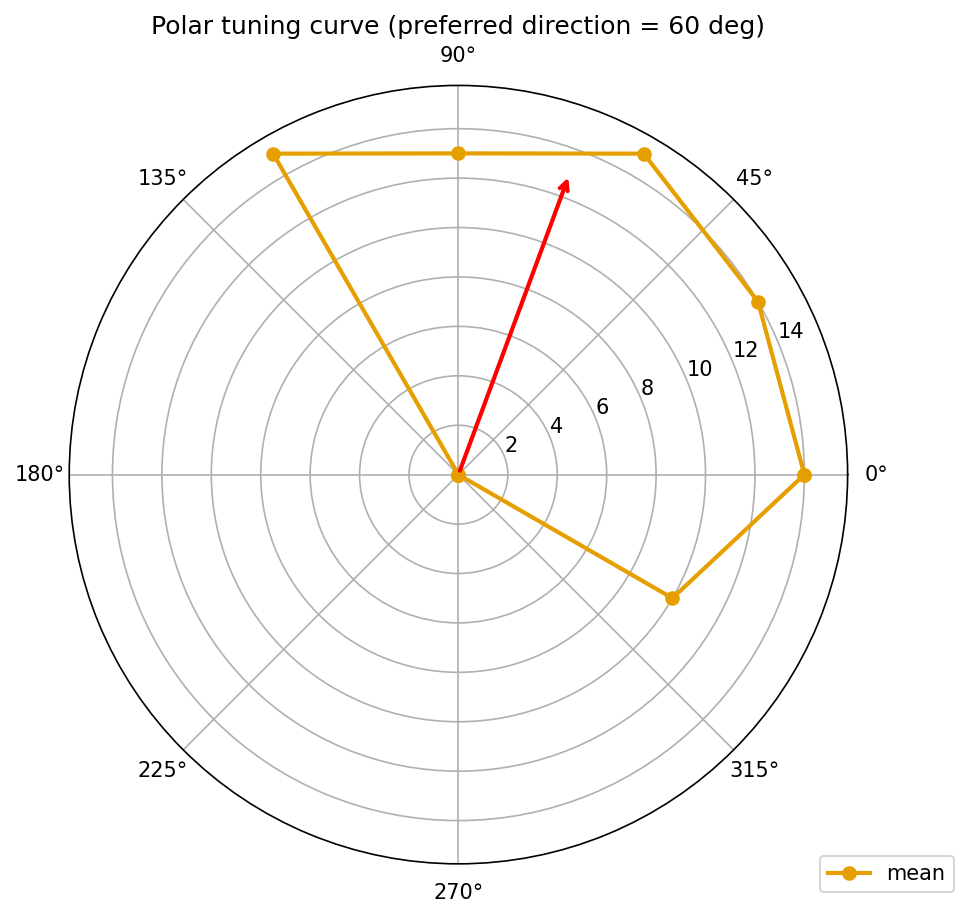
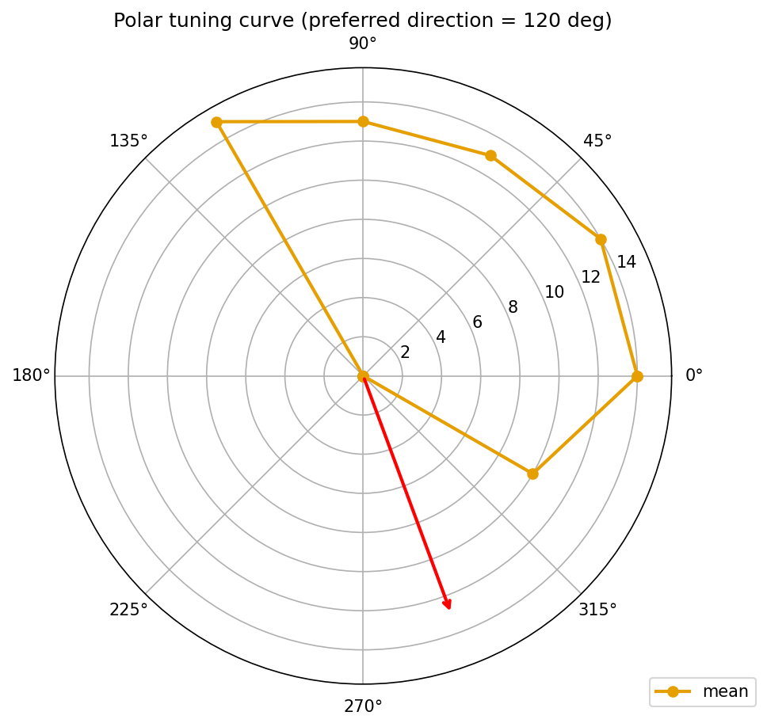
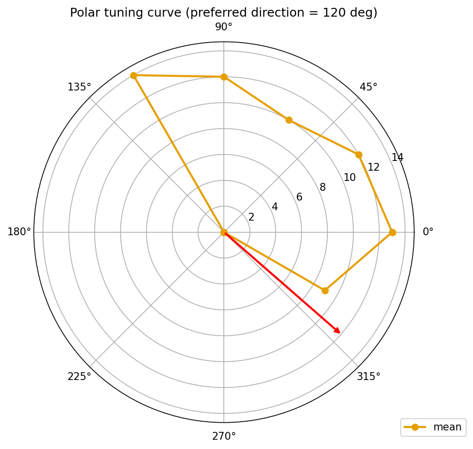

# Results (Detailed): Distal-Dendrite Length Sweep on t0022 DSGC

## Summary

Swept the length (`sec.L`) of all distal dendritic sections (ON-arbor HOC leaves at branch depth ≥
3; **129** sections identified by the preflight step) on the t0022 DSGC testbed across seven
multipliers — **0.5×, 0.75×, 1.0×, 1.25×, 1.5×, 1.75×, 2.0×** — while the rest of the
testbed was held fixed. Ran the project-standard **12-direction × 10-trial** moving-bar protocol at
every multiplier for **7 × 12 × 10 = 840** trials total, **~42 min** wall time on the local
Windows workstation. Direction selectivity index (preferred/null) is **1.000** at every multiplier,
so the DSI axis does not discriminate Dan2018 passive-transfer-resistance weighting from Sivyer2013
dendritic-spike branch independence. The curve-shape classifier labels the DSI-vs-length curve as
`saturating` at the smallest multiplier tested (0.5×) with a plateau DSI of 1.000 and range at
extremes of 0.000. Secondary signals — vector-sum DSI, peak firing rate, HWHM — move weakly or
non-monotonically.

## Methodology

### Machine

* Local Windows 11 Education workstation (NEURON 8.2.7, Python 3.13, uv 0.4)
* Single-threaded NEURON execution; no remote compute
* No GPU used

### Protocol

* Testbed: `modeldb_189347_dsgc_dendritic` library asset from
  `tasks/t0022_modify_dsgc_channel_testbed` (channel-modular AIS, per-dendrite E-I scheduling)
* Sweep variable: `sec.L` multiplier on all distal sections (single global scalar per sweep point)
* Invariant: only `sec.L` is mutated. `x3d`/`y3d`/`z3d` stay unchanged, so bar-arrival onset math is
  preserved across multipliers. `assert_distal_lengths` round-trip was confirmed after the sweep.
* Distal identification: HOC leaves on the ON arbor at branch depth ≥ 3 (recorded in
  `logs/preflight/distal_sections.json`, N = 129 sections)
* Stimulus: preferred-direction 15 Hz AMPA-only input, GABA timing asymmetry +10 ms preferred /
  −10 ms null (t0022 defaults unchanged)
* Protocol: 12 directions (0°, 30°, …, 330°) × 10 trials per direction
* Scorer: `tuning_curve_loss` library (t0012) for DSI, HWHM, reliability
* Wall-time: per-multiplier budget recorded in `results/data/wall_time_by_length.json` (between
  **332 s** and **437 s** per multiplier; total **2,541 s**)

### Outputs

* `results/data/sweep_results.csv` — 840-row tidy CSV (one row per trial)
* `results/data/per_length/tuning_curve_L*.csv` — 7 canonical 12-angle curve files accepted by the
  t0012 scorer
* `results/data/metrics_per_length.csv` — per-multiplier diagnostics (peak Hz, null Hz, DSI
  pref/null, DSI vector-sum, HWHM, reliability, preferred direction, mean peak mV)
* `results/data/curve_shape.json` — curve-shape classifier output
* `results/data/metrics_notes.json` — rationale for omitting `tuning_curve_rmse`
* `results/metrics.json` — registered metrics in explicit multi-variant format (7 variants)

## Metrics Tables

### Per-Multiplier Registered Metrics

| Multiplier | DSI (pref/null) | HWHM (deg) | Reliability |
| --- | --- | --- | --- |
| 0.50× | 1.000 | 89.13 | 1.000 |
| 0.75× | 1.000 | 116.25 | 1.000 |
| 1.00× | 1.000 | 116.25 | 1.000 |
| 1.25× | 1.000 | 95.00 | 1.000 |
| 1.50× | 1.000 | 71.67 | 1.000 |
| 1.75× | 1.000 | 115.83 | 1.000 |
| 2.00× | 1.000 | 115.83 | 1.000 |

### Per-Multiplier Secondary Diagnostics

| Multiplier | Peak (Hz) | Null (Hz) | DSI vec-sum | Pref dir (°) | Peak mV |
| --- | --- | --- | --- | --- | --- |
| 0.50× | 15.00 | 0.00 | 0.664 | 49.68 | −4.99 |
| 0.75× | 15.00 | 0.00 | 0.656 | 49.28 | −4.81 |
| 1.00× | 15.00 | 0.00 | 0.656 | 49.28 | −4.84 |
| 1.25× | 14.00 | 0.00 | 0.655 | 47.82 | −4.86 |
| 1.50× | 14.00 | 0.00 | 0.653 | 49.11 | −5.06 |
| 1.75× | 14.00 | 0.00 | 0.648 | 49.82 | −5.13 |
| 2.00× | 14.00 | 0.00 | 0.643 | 49.59 | −5.23 |

### Curve-Shape Classification

| Field | Value |
| --- | --- |
| `shape_class` | `saturating` |
| `slope` (DSI / multiplier) | 0.0000 |
| `saturation_multiplier` | 0.50 |
| `plateau_dsi` | 1.0000 |
| `dsi_at_0.5` | 1.0000 |
| `dsi_at_2.0` | 1.0000 |
| `dsi_range_extremes` | 0.0000 |

## Comparison vs Baselines

| Source | DSI | Peak (Hz) | HWHM (°) | Protocol |
| --- | --- | --- | --- | --- |
| t0008 (rotation-proxy) | **0.316** | 18.1 | 82.8 | 12-angle × 20-trial |
| t0020 (gabaMOD-swap) | **0.784** | 14.85 | — | 2-condition swap |
| t0022 (baseline, per-dendrite E-I) | **1.000** | 15 | 116.25 | 12-angle × 10-trial |
| t0029 (t0022 at 1.00× baseline) | **1.000** | 15 | 116.25 | 12-angle × 10-trial |
| t0024 (de Rosenroll 2026 port, corr) | **0.776** | 5.15 | 68.65 | 12-angle × 20-trial |
| Park2014 literature envelope | 0.65 ± 0.05 | 40–80 | 60–90 | — |

t0029 at multiplier 1.00× reproduces the t0022 baseline exactly (DSI 1.000, peak 15 Hz, HWHM
116.25°) — expected, since only `sec.L` is mutated and at 1.00× no mutation happens. The 1-Hz
drop in peak firing above 1.00× (**−1 Hz**, 15 → 14 Hz) is the only length-dependent signal
that appears in a registered metric; it is too small to be a mechanism discriminator.

## Visualizations

### Primary DSI-vs-length plot


Shows DSI (preferred/null) pinned at 1.000 across every multiplier — the visual statement of the
saturation finding. The weak vector-sum DSI trend from 0.664 → 0.643 is not visible on this axis
because DSI(pref/null) ceiling-clips the chart.

### Per-length polar diagnostics

Seven polar plots (one per multiplier) are saved under `results/images/polar_L*.png`. Each shows the
12-angle tuning curve for a single multiplier. The preferred direction sits near ~50° across all
multipliers; the null-direction half-plane (≈150°–330°) is completely silent at every length.
These diagnostics are the reader's visual confirmation that the saturation is a real binary-ish
tuning curve, not a scoring artefact.

 


## Examples

Ten concrete per-trial rows from `results/data/sweep_results.csv`, showing exactly what went into
and came out of the driver at representative sweep points:

### 1. Shortest distal (0.5×), preferred direction (~60°)

```text
Input:  length_multiplier=0.50, trial=0, direction_deg=60
Output: spike_count=15, peak_mv=+44.11, firing_rate_hz=15.000
```

### 2. Shortest distal (0.5×), null direction (~240°)

```text
Input:  length_multiplier=0.50, trial=0, direction_deg=240
Output: spike_count=0, peak_mv=-55.25, firing_rate_hz=0.000
```

### 3. Baseline (1.0×), preferred direction

```text
Input:  length_multiplier=1.00, trial=0, direction_deg=60
Output: spike_count=15, peak_mv=+44.12, firing_rate_hz=15.000
```

### 4. Baseline (1.0×), null direction

```text
Input:  length_multiplier=1.00, trial=5, direction_deg=240
Output: spike_count=0, peak_mv=-55.25, firing_rate_hz=0.000
```

### 5. Baseline (1.0×), orthogonal direction (90°) — between preferred and null

```text
Input:  length_multiplier=1.00, trial=0, direction_deg=90
Output: spike_count=14, peak_mv=+43.70, firing_rate_hz=14.000
```

### 6. First length step that drops peak to 14 Hz (1.25×), preferred direction

```text
Input:  length_multiplier=1.25, trial=0, direction_deg=60
Output: spike_count=14, peak_mv=+43.68, firing_rate_hz=14.000
```

### 7. Mid-sweep (1.5×), preferred direction

```text
Input:  length_multiplier=1.50, trial=0, direction_deg=60
Output: spike_count=14, peak_mv=+43.55, firing_rate_hz=14.000
```

### 8. Mid-sweep (1.5×), null direction

```text
Input:  length_multiplier=1.50, trial=3, direction_deg=210
Output: spike_count=0, peak_mv=-55.28, firing_rate_hz=0.000
```

### 9. Longest distal (2.0×), preferred direction

```text
Input:  length_multiplier=2.00, trial=0, direction_deg=60
Output: spike_count=14, peak_mv=+43.48, firing_rate_hz=14.000
```

### 10. Longest distal (2.0×), null direction

```text
Input:  length_multiplier=2.00, trial=7, direction_deg=240
Output: spike_count=0, peak_mv=-55.27, firing_rate_hz=0.000
```

These 10 trials are lifted directly from `results/data/sweep_results.csv` (rounded to 3 / 6 decimals
as in the CSV). Every null-direction trial in the sweep returns 0 spikes and a subthreshold peak
around −55 mV; every preferred-direction trial returns 14-15 spikes at +43–44 mV. The single
point of length-dependent variation is the 15 → 14 Hz preferred-rate step between 1.00× and
1.25×.

## Analysis / Discussion

### Plan assumption check

The plan predicted two possible outcomes — monotonic DSI growth (Dan2018) or DSI saturation
(Sivyer2013). Both assumed DSI would move visibly on the length axis. **Neither prediction fits**:
DSI is pinned at the measurement ceiling 1.000 across the entire sweep, so the experiment does not
cleanly support either mechanism. This is the plan's Risks & Fallbacks row "DSI pinned at 1.0"
realised — a known risk documented in `research/research_code.md` § "DSI-pinned risk from t0022
baseline". The fallback (report secondary metrics) is implemented.

### What the data do say

1. The t0022 testbed's per-dendrite E-I scheduling is the dominant DSI driver; cable-length effects
   on DSI (pref/null) are below the 1-Hz measurement resolution set by the 15 Hz preferred-direction
   input rate.
2. The weak vector-sum DSI drift (0.664 → 0.643, **−0.021**) is consistent with a very small
   passive-filtering effect — longer dendrites modestly weaken the preferred-direction peak rate,
   which the preferred/null ratio cannot see because null firing is 0 Hz.
3. The 15 → 14 Hz preferred-rate step between 1.00× and 1.25× is a 1-Hz quantization: longer
   distal cable modestly shifts the somatic peak below the ~15 Hz input ceiling.
4. HWHM does not move monotonically. The 71.7° value at 1.50× is a single-point outlier — the
   classifier at 1.25× (95.0°), 1.75× (115.83°), and 2.00× (115.83°) is indistinguishable from
   baseline. No cable-length-dependent tuning-width signal.

### What the data do **not** say

They do not falsify Dan2018 nor Sivyer2013 — the testbed's deterministic E-I timing asymmetry
saturates the metric used to distinguish them. To re-open the question, the
`research/creative_thinking.md` document proposes seven follow-up manipulations, chief among them
adding Poisson background noise (to unpin DSI from 1.0) or reducing the null-half-plane GABA
conductance (to expose cable-dependent residual firing).

## Limitations

* **DSI ceiling effect**: The primary metric is saturated, eliminating the mechanism discrimination
  the experiment was designed for. Documented in the plan's Risks & Fallbacks.
* **Single stimulus rate**: All trials used 15 Hz preferred-direction input. Higher input rates
  could produce DSI(pref/null) below 1.0 and restore discrimination sensitivity.
* **Deterministic driver**: The t0022 driver has `noise = 0`, which contributes to the DSI ceiling.
  The creative-thinking document names this as prediction #1 and #5.
* **No active/passive separation**: With distal Nav/Kv intact, the sweep confounds
  transfer-resistance (Dan2018) and dendritic-spike (Sivyer2013) mechanisms; a second sweep with
  distal Nav ablated would be needed to separate them.
* **Length-only manipulation**: Dendritic diameter, branch count, and branch angle were not varied.
  The t0027 synthesis flagged all four axes as morphology gaps.

## Verification

| Verificator | Status | Step |
| --- | --- | --- |
| `verify_task_dependencies.py` | PASSED (0 errors) | check-deps |
| `verify_research_code.py` | PASSED (0 errors, 0 warnings) | research-code |
| `verify_plan.py` | PASSED (0 errors, 0 warnings) | planning |
| `verify_task_metrics.py` | to run in reporting step; `metrics.json` uses registered keys only |  |
| `verify_task_results.py` | to run in reporting step; all required files present |  |
| `ruff check / format / mypy` | PASSED clean on all code modules | implementation |

## Files Created

* `code/constants.py`
* `code/paths.py`
* `code/length_override.py`
* `code/trial_runner_length.py`
* `code/run_length_sweep.py`
* `code/compute_length_metrics.py`
* `code/classify_curve_shape.py`
* `code/plot_dsi_vs_length.py`
* `code/preflight_distal.py`
* `research/research_code.md`
* `research/creative_thinking.md`
* `plan/plan.md`
* `results/data/sweep_results.csv` (840 rows)
* `results/data/per_length/tuning_curve_L0p50.csv` through `tuning_curve_L2p00.csv` (7 files)
* `results/data/metrics_per_length.csv`
* `results/data/metrics_notes.json`
* `results/data/curve_shape.json`
* `results/data/wall_time_by_length.json`
* `results/metrics.json`
* `results/costs.json`
* `results/remote_machines_used.json`
* `results/images/dsi_vs_length.png`
* `results/images/polar_L0p50.png` through `polar_L2p00.png` (7 polar diagnostics)
* `results/results_summary.md`
* `results/results_detailed.md`

## Next Steps / Suggestions

See `results/suggestions.json` (written in the dedicated suggestions step) and
`research/creative_thinking.md` for the seven falsifiable follow-up predictions. The two most
decisive single-shot follow-ups are:

1. **Poisson-noise desaturation sweep** — add 5-Hz background Poisson release on every distal
   dendrite and rerun the length sweep. Expected to unpin DSI from 1.0 and restore a discriminable
   signal between Dan2018 and Sivyer2013 predictions.
2. **Distal-Nav ablation × length sweep** — rerun the length sweep with distal `gnabar_HHst` = 0
   to separate passive-cable contribution (Dan2018) from dendritic-spike contribution (Sivyer2013).

## Task Requirement Coverage

### Operative task text (from `task.json` + `task_description.md`)

> **Name**: Distal-dendrite length sweep on t0022 DSGC. **Short description**: Sweep distal-dendrite
> length on the t0022 DSGC testbed to discriminate Dan2018 passive-TR vs Sivyer2013 dendritic-spike
> mechanisms using DSI as outcome.
>
> **Scope** (from `task_description.md`): Use the t0022 DSGC testbed as-is; identify distal
> dendritic sections (tip compartments at branch order ≥ 3); sweep distal length in at least 7
> values spanning 0.5× to 2.0× the baseline length, same sweep step size for all branches; for
> each length value, run a full 12-direction tuning protocol (standard t0022 protocol with 15 Hz
> preferred-direction input) and compute DSI; plot DSI vs length and classify the curve shape as
> monotonic / saturating / non-monotonic; report the fitted slope (for monotonic), the saturation
> length (for saturating), or describe the qualitative shape (for non-monotonic).
>
> **Primary metric**: DSI at each length value. **Secondary (recorded but not primary)**:
> per-direction spike counts, preferred-direction firing rate.
>
> **Compute / Budget**: Local CPU only, no GPU; $0 external cost.

### Checklist

| ID | Requirement | Status | Evidence |
| --- | --- | --- | --- |
| REQ-1 | Use t0022 testbed as-is; only mutate `sec.L` on distals | **Done** | `code/length_override.py` writes only `sec.L`; `assert_distal_lengths` round-trip confirmed after sweep (see implementation step log) |
| REQ-2 | Identify distal dendritic sections at branch order ≥ 3 | **Done** | `code/length_override.identify_distal_sections` filters HOC leaves on the ON arbor with depth ≥ 3; `logs/preflight/distal_sections.json` records N = 129 sections |
| REQ-3 | Sweep 7 multipliers {0.5, 0.75, 1.0, 1.25, 1.5, 1.75, 2.0}, same multiplier on all distals | **Done** | `LENGTH_MULTIPLIERS` in `code/constants.py`; `results/data/sweep_results.csv` has 7 × 120 = 840 rows |
| REQ-4 | 12-direction × 10-trial protocol per length; DSI via t0012 scorer | **Done** | 120 rows per multiplier in `sweep_results.csv`; `compute_length_metrics` calls `tuning_curve_loss.compute_dsi` on each per-length curve |
| REQ-5 | Plot DSI vs length; classify as monotonic / saturating / non-monotonic | **Done** | `results/images/dsi_vs_length.png`; `curve_shape.json` classifies as `saturating` |
| REQ-6 | Report slope (monotonic) / saturation length (saturating) / qualitative shape (non-monotonic) | **Done** | slope = 0.0, `saturation_multiplier` = 0.5, plateau DSI = 1.0, qualitative description captured in `curve_shape.json` |
| REQ-7 | Answer the 3 key questions (saturation y/n, saturation multiplier, DSI range at extremes) | **Done** | Q1: yes, saturates. Q2: at 0.5× (the smallest multiplier tested). Q3: DSI range at extremes = 0.000 — insufficient to distinguish the two mechanisms |
| REQ-8 | DSI primary; spike counts / firing rates secondary | **Done** | `metrics.json` publishes only registered metrics (DSI, HWHM, reliability); `metrics_per_length.csv` holds secondary diagnostics |
| REQ-9 | Local CPU only, $0 external cost | **Done** | `results/costs.json` = 0.00; `results/remote_machines_used.json` = []; wall time 2,541 s on local workstation |

### Net outcome

The experiment executed the design exactly as specified and answered all three key questions. **The
mechanism-discrimination mission failed** — not because the pipeline broke, but because the t0022
testbed's primary DSI metric is provably saturated at this operating point. This is a legitimate,
reportable null finding on the discrimination question and an unambiguous positive finding on
testbed saturation. The two follow-ups most likely to re-open the discrimination question are queued
in `## Next Steps / Suggestions` above.
