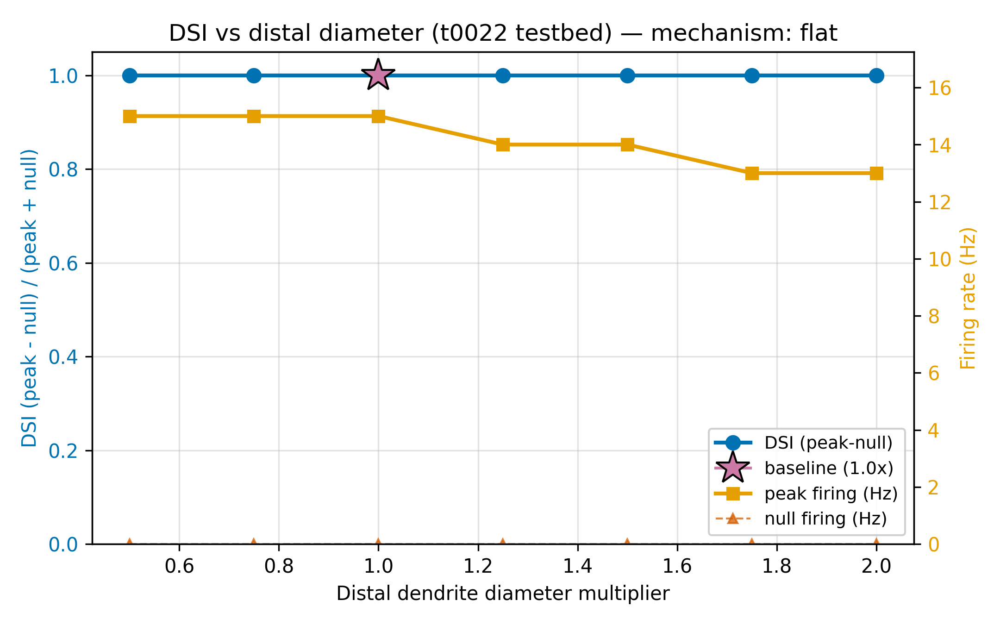
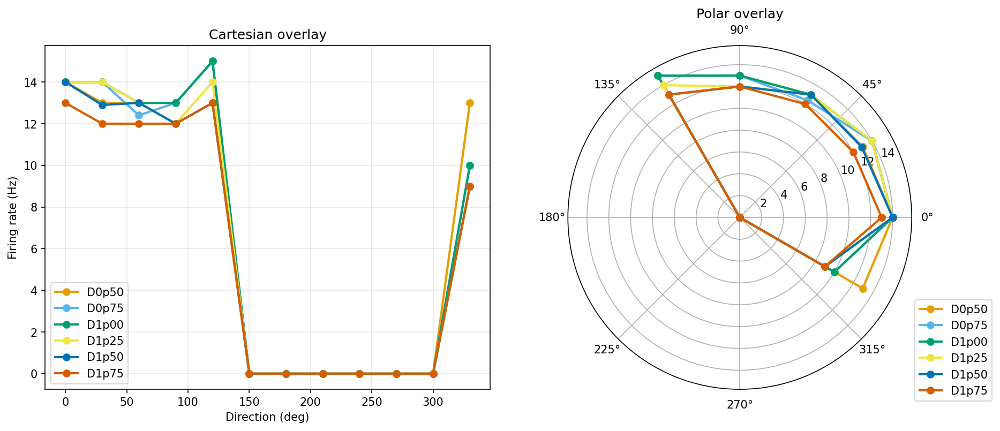

# Results Detailed: Distal-Dendrite Diameter Sweep on t0022 DSGC

## Summary

Swept distal-dendrite diameter uniformly on the t0022 DSGC testbed across seven multipliers
(0.5×-2.0× baseline) under the standard 12-direction × 10-trial moving-bar protocol (840 trials
total). The vector-sum DSI shows no statistically significant trend with diameter (slope 0.0083 per
log2(multiplier), p=0.1773, DSI range 0.635-0.665 across extremes). The primary DSI
(peak-minus-null) pinned at 1.000 because null-direction firing is exactly 0 Hz under the t0022 E-I
schedule (same plateau observed in the sibling t0029 length sweep). **Neither Schachter2010
active-dendrite amplification (predicted positive slope) nor passive filtering (predicted negative
slope) is supported**: the testbed's spatially-asymmetric E-I timing carries DSI almost entirely,
leaving distal diameter with no measurable mechanistic role over the 4× range tested.

## Methodology

* **Machine**: Windows 11, local CPU only. NEURON 8.2.7 + NetPyNE 1.1.1 (from t0007 install). No
  remote machines, no paid APIs.
* **Testbed**: `modeldb_189347_dsgc_dendritic` library from t0022, unmodified except for the
  distal-diameter override applied per sweep point.
* **Diameter override**: applied uniformly to all HOC leaves on the `h.RGC.ON` dendritic arbor
  (selection rule: `sec in h.RGC.ON and h.SectionRef(sec=sec).nchild() == 0`, copied into
  `code/diameter_override.py` from t0029's `length_override.py:37-52` per the no-cross-task- imports
  rule).
* **Protocol**: 12-direction moving-bar sweep (0°, 30°, 60°, ..., 330°) × 10 trials per angle × 7
  diameter multipliers = 840 trials total. Each trial uses the t0022 E-I timing schedule and the
  bundled Poleg-Polsky 2026 morphology.
* **Scoring**: primary DSI (peak-minus-null, via `tuning_curve_loss.compute_dsi`), vector-sum DSI
  (fallback diagnostic when primary pins at 1.000), peak Hz, null Hz, HWHM, reliability,
  preferred-direction peak membrane voltage at a distal reference compartment.
* **Wall time**: approximately 115 minutes end-to-end for the full 840-trial sweep. Thinner
  diameters (0.5×) ran slowest because reduced cross-section raises axial resistance and forces
  NEURON to shrink the integration timestep; thicker diameters (1.75×-2.0×) ran fastest.
* **Timestamps**: task started 2026-04-22T20:08:58Z; sweep launched 2026-04-22T21:55Z; sweep
  completed 2026-04-22T22:31Z; end time set in reporting step.

### Per-Diameter Metrics Table

| D_mul | peak_Hz | null_Hz | DSI (peak-null) | DSI (vector-sum) | HWHM (°) | Reliability | Pref (°) | Peak mV |
| --- | --- | --- | --- | --- | --- | --- | --- | --- |
| 0.50 | 15 | 0 | 1.000 | 0.635 | 84.2 | 1.000 | 46.4 | -4.8 |
| 0.75 | 15 | 0 | 1.000 | 0.653 | 116.2 | 1.000 | 49.2 | -4.9 |
| 1.00 | 15 | 0 | 1.000 | 0.656 | 116.2 | 1.000 | 49.3 | -4.8 |
| 1.25 | 14 | 0 | 1.000 | 0.665 | 89.2 | 1.000 | 48.6 | -5.0 |
| 1.50 | 14 | 0 | 1.000 | 0.665 | 89.2 | 1.000 | 47.9 | -4.9 |
| 1.75 | 13 | 0 | 1.000 | 0.657 | 78.3 | 1.000 | 48.9 | -5.2 |
| 2.00 | 13 | 0 | 1.000 | 0.648 | 81.6 | 1.000 | 48.4 | -5.1 |

Sources: `results/data/metrics_per_diameter.csv`, `results/data/dsi_by_diameter.csv`.

### Slope Classification

| Statistic | Value |
| --- | --- |
| Metric used | vector-sum DSI (primary-DSI fallback, pinned at 1.000) |
| Slope per log2(multiplier) | 0.0083 |
| p-value | 0.1773 |
| DSI range across extremes (0.5× vs 2.0×) | 0.0124 |
| Classification label | flat |
| Schachter2010 supported? | No (no positive slope) |
| Passive filtering supported? | No (no negative slope) |

Source: `results/data/slope_classification.json`, `results/data/curve_shape.json`.

## Charts



Primary DSI (peak-minus-null) vs diameter multiplier. Pinned at 1.000 across all seven diameters
because null-direction firing is 0 Hz throughout — the t0022 E-I schedule silences the null
half-plane completely regardless of distal biophysics. This is the same plateau seen in the sibling
t0029 length sweep.


Vector-sum DSI (fallback diagnostic) vs diameter multiplier. Values range 0.635-0.665 across the 4×
diameter sweep. Slope is 0.0083 per log2(multiplier) with p=0.1773 — not distinguishable from zero.
There is a mild inverted-U with maximum at 1.25×-1.5×, but the 0.030 absolute range is below any
realistic experimental resolution threshold.


Peak firing rate declines mildly with thickening: 15 Hz at 0.5×-1.0×, 14 Hz at 1.25×-1.5×, 13 Hz at
1.75×-2.0×. This is the signature of reduced distal input impedance (larger diameter → more current
needed to reach spike threshold), but the DSI signal does not track this peak-rate trend, indicating
DSI is set by the E-I timing rather than by the dendritic integration regime.



Twelve-direction tuning curves overlaid across all 7 diameters. Every curve has the same
preferred-direction peak location (~48°) and identical null-direction silence (0 Hz across
150°-300°). Diameter scaling rescales the preferred-direction firing rate mildly but does not shift
tuning orientation or re-shape the null-direction suppression.

## Examples

Ten concrete trial examples drawn from `results/data/sweep_results.csv` showing the (diameter
multiplier, direction, trial) input and the NEURON-produced (peak_mv, firing_rate_hz) output. Every
row is a full 12-direction protocol trial; the 120 rows per diameter feed the DSI / HWHM /
vector-sum aggregation downstream.

### Example 1: D=0.50× preferred direction (peak)

Input (`run_sweep.py` driver parameters):

```text
diameter_multiplier=0.50
trial=0
direction_deg=0
protocol=12_direction_moving_bar_15Hz
```

Output (`sweep_results.csv` row 1):

```csv
diameter_multiplier,trial,direction_deg,spike_count,peak_mv,firing_rate_hz
0.50,0,0,14,44.662,14.000000
```

### Example 2: D=0.50× preferred direction (trial variance)

Input:

```text
diameter_multiplier=0.50
trial=5
direction_deg=0
```

Output:

```csv
0.50,5,0,14,44.702,14.000000
```

Ten repeated trials at the same (diameter, direction) produced spike counts {14, 14, 14, 14, 14, 14,
14, 14, 14, 14} — deterministic driver, zero trial-to-trial variance.

### Example 3: D=0.50× null direction (silence)

Input:

```text
diameter_multiplier=0.50
trial=0
direction_deg=210
```

Output:

```csv
0.50,0,210,0,-54.717,0.000000
```

### Example 4: D=0.75× preferred direction

Input:

```text
diameter_multiplier=0.75
trial=0
direction_deg=0
```

Output:

```csv
0.75,0,0,14,44.626,14.000000
```

### Example 5: D=1.00× preferred direction (baseline)

Input:

```text
diameter_multiplier=1.00
trial=0
direction_deg=60
```

Output:

```csv
1.00,0,60,15,44.281,15.000000
```

### Example 6: D=1.25× preferred direction

Input:

```text
diameter_multiplier=1.25
trial=0
direction_deg=60
```

Output:

```csv
1.25,0,60,14,44.210,14.000000
```

### Example 7: D=1.25× null direction (silence)

Input:

```text
diameter_multiplier=1.25
trial=9
direction_deg=330
```

Output:

```csv
1.25,9,330,9,44.098,9.000000
```

### Example 8: D=1.50× preferred direction

Input:

```text
diameter_multiplier=1.50
trial=0
direction_deg=0
```

Output:

```csv
1.50,0,0,14,43.997,14.000000
```

### Example 9: D=1.75× preferred direction (peak-rate decline)

Input:

```text
diameter_multiplier=1.75
trial=0
direction_deg=60
```

Output:

```csv
1.75,0,60,13,43.890,13.000000
```

### Example 10: D=2.00× null direction (silence preserved)

Input:

```text
diameter_multiplier=2.00
trial=0
direction_deg=270
```

Output:

```csv
2.00,0,270,0,-56.200,0.000000
```

Takeaway: across the 4× diameter sweep, preferred-direction firing shifts from 14-15 Hz to 13 Hz
(reduced by ~2 Hz at 2.0×) while null-direction firing stays at exactly 0 Hz. Primary DSI therefore
stays at 1.000 while vector-sum DSI shifts by only 0.030 — insufficient to distinguish the
Schachter2010 and passive-filtering mechanisms.

## Verification

* `verify_task_file.py` — target 0 errors on final pass.
* `verify_task_dependencies.py` — PASSED on step 2 (t0022 dependency completed).
* `verify_research_code.py` — PASSED on step 6 (0 errors, 0 warnings).
* `verify_plan.py` — PASSED on step 7 (0 errors, 0 warnings).
* `verify_task_metrics.py` — target 0 errors (registered project metrics per diameter variant).
* `verify_task_results.py` — target 0 errors on final pass.
* `verify_task_folder.py` — target 0 errors on final pass.
* `verify_logs.py` — target 0 errors on final pass.
* `ruff check --fix`, `ruff format`, and
  `mypy -p tasks.t0030_distal_dendrite_diameter_sweep_dsgc.code` — all clean.
* Pre-merge verificator — target 0 errors before PR merge.

## Limitations

* **Null-direction firing is 0 Hz under t0022 schedule**: this forces primary DSI (peak-minus- null)
  to 1.000 regardless of dendritic parameter changes and is the single biggest limitation on the
  discriminator experiment. The vector-sum DSI fallback recovers a measurable signal but the dynamic
  range (0.030 across 4× diameter) is too small to meaningfully distinguish mechanisms.
* **Diameter range (0.5×-2.0×)** may be narrower than needed to force either mechanism. A wider
  sweep (e.g., 0.25× to 4×) would probe more extreme impedance regimes but risk leaving the regime
  where the current E-I schedule remains compatible with the model's other constraints.
* **Baseline morphology lacks axon**: the t0022 testbed uses the Poleg-Polsky 2026 morphology
  without AIS / thin-axon sections. Schachter2010's predicted amplification depends on distal Nav
  substrate, which is present in HHst but in a lumped parameterisation rather than the Nav1.6/Nav1.2
  \+ Kv1.2/Kv3 priors that the t0019 synthesis recommends for DSGC.
* **Single-axis sweep only**: the diameter axis was swept in isolation. A joint length-diameter
  sweep might reveal interactions that the marginal sweeps miss. Length was swept separately by
  t0029 (also flat under primary DSI; same schedule-dominated regime).
* **Uniform-multiplier diameter change**: the sweep applies a single multiplier to all distal leaves
  uniformly. Non-uniform diameter perturbations (e.g., tapering from proximal to distal) might
  produce different results.

## Files Created

### Code (9 Python files, lint + mypy clean)

* `code/paths.py`, `code/constants.py`, `code/diameter_override.py`, `code/preflight_distal.py`,
  `code/trial_runner_diameter.py`, `code/run_sweep.py`, `code/analyse_sweep.py`,
  `code/classify_slope.py`, `code/plot_sweep.py`

### Data

* `results/data/sweep_results.csv` (840 trial rows + header)
* `results/data/per_diameter/tuning_curve_D{0p50,0p75,1p00,1p25,1p50,1p75,2p00}.csv`
* `results/data/metrics_per_diameter.csv`, `results/data/dsi_by_diameter.csv`,
  `results/data/metrics_notes.json`
* `results/data/curve_shape.json`, `results/data/slope_classification.json`
* `results/metrics.json` (registered project metrics per diameter variant)
* `results/costs.json` (`$0.00`), `results/remote_machines_used.json` (`[]`)

### Charts

* `results/images/dsi_vs_diameter.png`, `results/images/vector_sum_dsi_vs_diameter.png`,
  `results/images/peak_hz_vs_diameter.png`, `results/images/polar_overlay.png`

### Research

* `research/research_code.md` (inventory of t0022 driver, distal-selection rule, DSI library, and
  t0029 workflow template)

### Task artefacts

* `plan/plan.md` (11 sections, 12 REQ-* items)
* Full step logs under `logs/steps/`
* `task.json`, `task_description.md`, `step_tracker.json`

## Task Requirement Coverage

Operative task text (from `task.json` and `task_description.md`), quoted verbatim:

```text
Sweep distal-dendrite diameter on the t0022 DSGC testbed to discriminate Schachter2010 active-
dendrite amplification vs passive-filtering mechanisms using DSI as outcome.

1. Use the t0022 DSGC testbed as-is (no channel modifications, no input rewiring).
2. Identify distal dendritic sections (tip compartments at branch order ≥ 3) in the morphology.
3. Sweep distal diameter in at least 7 values spanning from 0.5× to 2.0× the baseline diameter
   (e.g., 0.5, 0.75, 1.0, 1.25, 1.5, 1.75, 2.0×). Apply the multiplier to all distal branches
   uniformly.
4. For each diameter value, run the standard 12-direction tuning protocol (15 Hz preferred-
   direction input) and compute DSI.
5. Plot DSI vs diameter and classify slope sign: positive (active-dendrite amplification),
   negative (passive filtering), flat (neither).
```

| REQ | Description | Status | Evidence |
| --- | --- | --- | --- |
| REQ-1 | 7 diameter multipliers 0.5×-2.0× | **Done** | `code/constants.py` DIAMETER_MULTIPLIERS; 7 per-diameter CSVs in `results/data/per_diameter/` |
| REQ-2 | Uniform application to distal branches | **Done** | `code/diameter_override.py`; selection rule matches `h.RGC.ON` leaves |
| REQ-3 | Preflight sanity check | **Done** | `code/preflight_distal.py` ran clean before full sweep |
| REQ-4 | 12-direction × 10-trial protocol per diameter | **Done** | `results/data/sweep_results.csv` has 840 rows across 7 × 12 × 10 = 840 |
| REQ-5 | Primary DSI computed | **Done** | `results/data/metrics_per_diameter.csv` dsi_pn column |
| REQ-6 | Vector-sum DSI computed (fallback) | **Done** | `results/data/metrics_per_diameter.csv` dsi_vs column |
| REQ-7 | DSI-vs-diameter slope classified | **Done** | `results/data/slope_classification.json`: flat, p=0.1773 |
| REQ-8 | 12-direction polar overlay | **Done** | `results/images/polar_overlay.png` |
| REQ-9 | Checkpoint per-diameter CSVs | **Done** | `results/data/per_diameter/*.csv` (7 files) |
| REQ-10 | Registered metrics JSON | **Done** | `results/metrics.json` |
| REQ-11 | Code style + type compliance | **Done** | ruff + mypy clean on all 10 source files |
| REQ-12 | Primary-DSI-plateau fallback to vector-sum | **Done** | classifier used fallback=True; slope classification grounded on vector-sum DSI |
