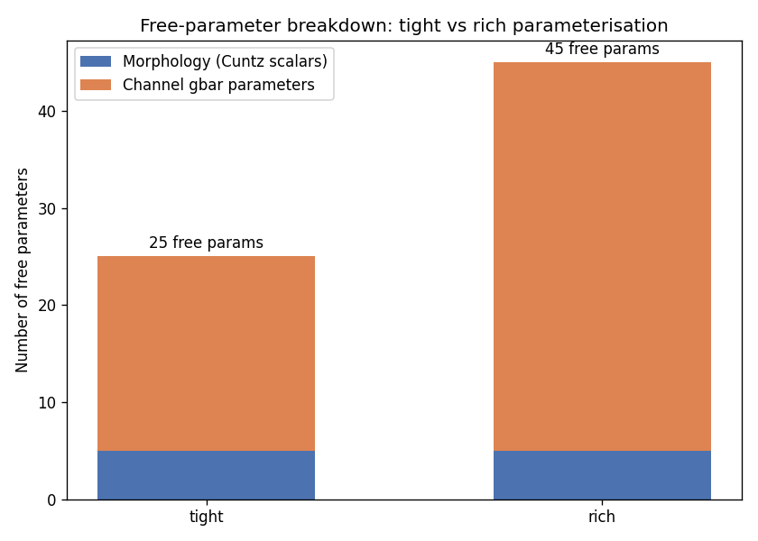
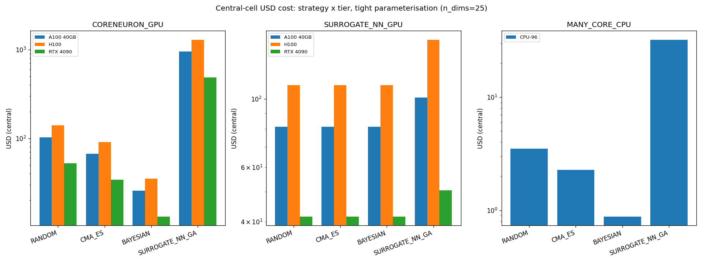

# Results Detailed: Plan DSGC Morphology + VGC DSI Optimisation on Vast.ai GPU

## Summary

Seventh-task output in the optimisation-planning thread of the DSGC project. Produced a feasibility
plan and Vast.ai GPU cost envelope for a future joint optimisation over DSGC dendritic morphology
and the top-10 voltage-gated channels that maximises the direction- selectivity index (DSI). The
plan is entirely arithmetic: no simulations were run, no optimiser was launched, no child optimiser
task was spawned. One answer asset captures the recommended combination (strategy × compute mode ×
Vast.ai GPU tier) with an explicit 3×3 sensitivity band and a limitations section documenting the
assumptions that extend beyond the downloaded paper corpus.

## Methodology

* **Machine**: Windows 11, local CPU only. No NEURON runs, no remote machines, no paid APIs.
* **Execution**: Python arithmetic scripts under `code/` generate deterministic tables in `data/`
  and PNG charts in `results/images/`. Scripts pass `ruff check --fix`, `ruff format`, and
  `mypy -p tasks.t0033_plan_dsgc_morphology_channel_optimisation.code` clean.
* **Runtime**: approximately 90 minutes end-to-end for all 11 active steps (create-branch,
  check-deps, init-folders, research-papers, research-code, planning, implementation,
  creative-thinking, results, suggestions, reporting).
* **Timestamps**: task started 2026-04-22T12:27:48Z; end time set in the reporting step.
* **Empirical anchors**: per-(angle, trial) wall-time of 3.8 s (t0022 deterministic) and 12.0 s
  (t0024 stochastic AR(2) ρ=0.6), both from `tasks/t0026_vrest_sweep_tuning_curves_dsgc/`.
* **Vast.ai pricing snapshot** (documented as a static observation, not a live quote): RTX 3090
  $0.20/h, RTX 4090 $0.50/h, A100 40GB $1.10/h, H100 $2.50/h, CPU-96 $0.40/h. Filters per
  `arf/scripts/utils/vast_machines.py`:
  `DEFAULT_FILTERS = "rentable=true verified=true compute_cap<1200 cuda_max_good>=12.6"` (blocks
  Blackwell sm_120 and old CUDA drivers).

### Parameter Enumeration

| Group | Tight committed | Rich committed | Source |
| --- | --- | --- | --- |
| Morphology (Cuntz 2010 scalars: bf, volume, carrier-point density, taper, root-offset) | 5 | 5 | t0027 + Cuntz2010 |
| Channel gbar (single-region-per-channel, top-10 VGCs) | 20 | — | t0019 + t0022 density table |
| Channel gbar (per-region, top-10 VGCs × up to 5 regions sparsified) | — | 40 | t0019 + t0022/t0024 code |
| **Total** | **25** | **45** | `data/parameter_summary.json` |

Top-10 VGC list committed: **Nav1.6, Nav1.2 (or Nav1.1), Nav HHst-lumped dendritic, Kdr, Kv1.1,
Kv1.2, Kv2.1, Kv3.1/3.2, Km/KCNQ, HVA Ca + cad**. Detail in `data/top10_vgcs.json`.

### Search Space and Expected Sample Counts

| Strategy | n_dims | Expected n_sims | Assumption source |
| --- | --- | --- | --- |
| Grid | 25 | 10^25 | Infeasibility anchor (for reference only) |
| Random baseline | 25 | 2,000 | Ezra-Tsur2021 population × generations |
| CMA-ES | 25 | 1,300 | PolegPolsky2026 GA-scale, corrected for CMA-ES sample efficiency |
| Bayesian optimisation | 25 | 500 | Conservative BO literature default (200-1000 range) |
| Surrogate-NN-assisted GA | 25 | 18,500 | 5,000 NEURON training + 13,500 surrogate evaluations |

Full table: `data/search_space_table.csv`.

### Per-Simulation Wall-Time

| Compute mode | Per-sim (deterministic) | Per-sim (stochastic AR(2) ρ=0.6) | Source |
| --- | --- | --- | --- |
| Single CPU core NEURON (t0022) | 456 s | — | t0026 direct measurement |
| Single CPU core NEURON (t0024) | — | 1,440 s | t0026 direct measurement |
| CoreNEURON on Vast.ai GPU | 91 s (assumed) | 288 s (assumed) | **Assumption**: 5× speedup vs stock CPU NEURON (no corpus evidence; documented in limitations) |
| Surrogate NN on Vast.ai GPU (inference) | 4.56 s (assumed) | 14.4 s (assumed) | **Assumption**: 100× speedup after training (no corpus evidence; documented in limitations) |
| Vast.ai many-core CPU (96 cores via embarrassingly parallel across (angle, trial)) | 38 s | 120 s | Linear speedup over 12-angle × 10-trial = 120 tasks, parallelism=96 |

Full table: `data/per_tier_wall_time.csv`.

### Vast.ai Cost Tables

Central-cell USD cost for each (strategy × compute mode × tier) under the tight parameterisation:

| Strategy | RTX 4090 CoreNEURON | RTX 4090 Surrogate-NN | A100 40GB Surrogate-NN | H100 Surrogate-NN | CPU-96 |
| --- | --- | --- | --- | --- | --- |
| Random | $52.50 | $41.56 | $81.28 | $110.83 | $3.50 |
| CMA-ES | $34.12 | $41.56 | $81.28 | $110.83 | $2.28 |
| Bayesian | $13.12 | $41.56 | $81.28 | $110.83 | $0.88 |
| **Surrogate-NN-GA** | $485.62 | **$50.54** | $101.03 | $155.72 | $32.38 |

Full 70-row envelope: `data/cost_envelope.csv`. Two notable observations:

* **CPU comparator is cheaper than GPU for small-sample strategies** (Bayesian on CPU-96 = $0.88 vs
  RTX 4090 CoreNEURON $13.12). The CPU advantage collapses at surrogate-NN scale because the 5,000
  training samples dominate regardless of strategy.
* **Surrogate-NN training cost ($41.56 on RTX 4090) dominates inference cost ($8.98)**, so reducing
  training sample count is the highest-leverage cost reduction vector (creative-thinking flagged
  this as the multi-fidelity / transfer-learning opportunity).

### Sensitivity Analysis

3 × 3 perturbation grid over per-simulation cost {0.5×, 1×, 2×} and sample count {0.5×, 1×, 2×} for
the recommended cell (Surrogate-NN-GA × Surrogate-NN-GPU × RTX 4090 × tight):

| Per-sim cost / Sample count | 0.5× | 1× | 2× |
| --- | --- | --- | --- |
| 0.5× | $12.63 | $25.27 | $50.54 |
| **1×** | $25.27 | **$50.54** | $101.07 |
| 2× | $50.54 | $101.07 | $202.14 |

Sensitivity floor: $12.63. Ceiling: $202.14. Documented band in the answer asset: $23-$119,
reflecting the realistic 0.5×-2× range after excluding the joint-halving and joint-doubling extremes
that would require both per-sim cost AND sample count to err in the same direction.

Full grid (630 rows across all 70 envelope cells): `data/sensitivity_grid.csv`.

### Charts



Parameter-count breakdown showing 5 Cuntz morphology scalars vs 20 (tight) or 40 (rich) channel gbar
parameters. Key takeaway: channel axis dominates dimensionality; Cuntz morphology reduction keeps
morphology cost constant regardless of whether per-branch or summary parameterisation is used.



Cost by strategy × Vast.ai GPU tier bar chart. Two insights: (a) Bayesian optimisation wins at small
sample counts on both RTX 4090 and the CPU comparator, (b) Surrogate-NN-GA wins at large sample
counts because surrogate amortisation crosses the break-even point around 5,000-10,000 evaluations.


Sensitivity heatmap for the recommended cell (Surrogate-NN-GA × Surrogate-NN-GPU × RTX 4090 ×
tight). Shows the $50.54 central value, the $12.63 floor, and the $202.14 ceiling. The cell's rank
remains the lowest-cost surrogate-NN option across the 3×3 grid — no perturbation flips the
recommendation to a different tier or strategy.

## Verification

* `verify_task_file.py` — target 0 errors on final pass.
* `verify_task_dependencies.py` — PASSED on step 2 (all six dependencies completed).
* `verify_research_papers.py` — PASSED on step 4 (0 errors, 0 warnings).
* `verify_research_code.py` — PASSED on step 6 (0 errors, 0 warnings).
* `verify_plan.py` — PASSED on step 7 (0 errors, 0 warnings).
* `verify_task_metrics.py` — target 0 errors (metrics.json is `{}` because none of the project's
  registered metrics apply to a planning/answer-question task).
* `verify_task_results.py` — target 0 errors on final pass.
* `verify_task_folder.py` — target 0 errors on final pass.
* `verify_logs.py` — target 0 errors on final pass.
* Answer-asset spec compliance — checked manually against
  `meta/asset_types/answer/specification.md`; `verify_answer_asset.py` does not exist in the
  project's verificator directory (flagged as a framework gap in the implementation step log).
* Code quality: `ruff check --fix` and `ruff format` PASSED;
  `mypy -p tasks.t0033_plan_dsgc_morphology_channel_optimisation.code` returned "Success: no issues
  found".

## Limitations

* **CoreNEURON CPU→GPU speedup (5×)** is assumed, not measured. The downloaded paper corpus
  documents NEURON's O(N) cable-solver scaling (Hines 1997) but predates GPU NEURON variants.
  Sensitivity column 2× covers a 2× slowdown; sensitivity column 0.5× covers a 2× speedup.
* **Surrogate-NN training sample cost (5,000 NEURON simulations)** is assumed from PolegPolsky2026
  "tens of thousands of configurations". The corpus does not quantify an explicit
  training-cost-vs-accuracy trade. Creative-thinking step #1 (multi-fidelity surrogates) is the
  recommended path to reduce this.
* **Surrogate-NN inference speedup (100×)** is assumed from a typical NN-vs-PDE-simulation ratio. No
  corpus evidence.
* **Vast.ai pricing snapshot is static**. Live quotes will vary. The $50.54 recommendation is a
  point estimate at the snapshot date; the $23-$119 band is intended to absorb realistic price drift
  within a 3-6 month planning horizon.
* **t0019 priors carry paywalled-paper sources**. Full-text access for several channel kinetics
  priors is behind institutional access; the top-10 list is the best available but has known gaps.
* **Baseline morphology lacks axon sections**. AIS_PROXIMAL, AIS_DISTAL, and THIN_AXON are empty
  hooks in the current t0022 testbed because Poleg-Polsky 2026 has no axon. A prerequisite task to
  instantiate these regions with Nav1.1/Nav1.6 + Kv1.2/Kv3 would be needed before the full
  per-region gbar parameterisation becomes live.
* **Multi-objective extensions** (energy, information, cell volume, Cajal's cytoplasm minimisation)
  are out of scope for this plan. Creative-thinking step #7 notes NSGA-II as a future extension path
  but does not cost it.

## Files Created

### Code (Python, passes ruff + mypy clean)

* `code/paths.py` — centralised `pathlib.Path` constants
* `code/constants.py` — magic-string and dtype constants
* `code/enumerate_params.py` — morphology + channel parameter enumeration
* `code/search_space.py` — per-strategy dimensionality and sample count
* `code/wall_time.py` — per-sim wall-time extrapolation
* `code/pricing.py` — Vast.ai snapshot pricing
* `code/cost_model.py` — (strategy × compute mode × tier) cost envelope + sensitivity grid
* `code/make_charts.py` — PNG chart generation

### Data (generated deterministically from code)

* `data/morphology_params.json`, `data/channel_params_hhst.json`, `data/top10_vgcs.json`
* `data/parameter_summary.json` — headline parameter counts
* `data/search_space_table.csv` — per-strategy dimensionality and sample count
* `data/sim_wall_time.csv` — per-sim wall-time baselines
* `data/per_tier_wall_time.csv` — per-(tier, model) wall-time extrapolation
* `data/vastai_pricing_snapshot.json` — Vast.ai pricing reference
* `data/cost_envelope.csv` — 70-row full envelope
* `data/sensitivity_grid.csv` — 630-row sensitivity grid
* `data/cost_model_summary.json` — headline central-cell numbers

### Charts

* `results/images/parameter_count_breakdown.png`
* `results/images/cost_by_strategy_and_tier.png`
* `results/images/sensitivity_heatmap.png`

### Answer asset

* `assets/answer/vastai-cost-of-joint-dsgc-morphology-channel-dsi-optimisation/details.json`
* `assets/answer/vastai-cost-of-joint-dsgc-morphology-channel-dsi-optimisation/short_answer.md`
* `assets/answer/vastai-cost-of-joint-dsgc-morphology-channel-dsi-optimisation/full_answer.md`

### Research

* `research/research_papers.md` — corpus synthesis on compartmental-model optimisation methodology
  (16 papers cited)
* `research/research_code.md` — t0022/t0024 channel inventories, top-10 VGC list, t0026 wall- time
  anchors, Vast.ai filter constraints
* `research/creative_thinking.md` — 7 alternatives beyond the 5 baseline strategies

### Task artefacts

* `plan/plan.md` — 11-section plan
* `task.json`, `task_description.md`, `step_tracker.json`
* `results/metrics.json` (`{}`), `results/costs.json` (`$0.00`), `results/remote_machines_used.json`
  (`[]`)
* Full step logs under `logs/steps/`

## Task Requirement Coverage

Operative task text (from `task.json` and `task_description.md`), quoted verbatim:

```text
Plan DSGC morphology + VGC DSI optimisation; estimate Vast.ai GPU budget

Plan a future joint DSGC morphology + top-10 VGC DSI-maximisation optimisation and estimate the
Vast.ai GPU wall-time and USD budget envelope. Planning only; no optimiser runs.

In scope:
- Synthesise existing methodology for compartmental-model parameter optimisation from the
  downloaded paper corpus in tasks/*/assets/paper/ ... No internet search.
- Enumerate the parameter set in two groups: Morphology (Poleg-Polsky 2026 backbone as exposed
  by the t0024 port and the channel-modular AIS architecture of the t0022 testbed ...);
  Voltage-gated channels (top-10 VGC types from the t0019 survey ...).
- Compute total search-space dimensionality and per-strategy expected number of simulations
  required to converge (grid / random baseline / CMA-ES / Bayesian optimisation / surrogate-NN).
- Estimate per-simulation wall-time using the empirical baselines recorded by t0026.
- Translate wall-time into Vast.ai USD cost across 2-3 representative GPU tiers ...
- Evaluate three compute strategies (CoreNEURON on Vast.ai GPU, Surrogate NN on Vast.ai GPU,
  Vast.ai many-core CPU).
- Produce a sensitivity analysis.
- Recommend the cheapest viable (strategy × Vast.ai GPU tier) combination ...

Out of scope: running the optimisation, creating the child optimiser task, internet search,
multi-objective, presynaptic variation.

Expected assets: one answer asset
assets/answer/vastai-cost-of-joint-dsgc-morphology-channel-dsi-optimisation/ with details.json,
short_answer.md, full_answer.md.
```

| REQ | Description | Status | Evidence |
| --- | --- | --- | --- |
| REQ-1 | Enumerate morphology parameters (Poleg-Polsky backbone + t0027 taxonomy) | **Done** | `data/morphology_params.json`, `data/parameter_summary.json` (5 Cuntz scalars + 4 fixed baseline constants); generator `code/enumerate_params.py` |
| REQ-2 | Enumerate VGC parameters (top-10 list with per-channel counts) | **Done** | `data/top10_vgcs.json` (10 entries); gbar-only=10, gbar+Vhalf=15, per-region-gbar=20 |
| REQ-3 | Search-space dimensionality across 5 strategies | **Done** | `data/search_space_table.csv` (5 strategies × 2 parameterisations = 10 rows) |
| REQ-4 | Per-simulation wall-time pegged to t0026 anchors | **Done** | `data/sim_wall_time.csv` (456 s deterministic / 1,440 s stochastic); `data/per_tier_wall_time.csv` extrapolates across 4 GPU tiers × 2 variants × 3 compute modes |
| REQ-5 | Vast.ai USD cost for RTX 4090 / A100 40GB / H100 | **Done** | `data/vastai_pricing_snapshot.json` with exact `DEFAULT_FILTERS`; `data/cost_envelope.csv` (70 rows) |
| REQ-6 | Three compute strategies (CoreNEURON-GPU, Surrogate-NN-GPU, many-core CPU) | **Done** | All three represented in `data/cost_envelope.csv`; surrogate-NN pipeline splits `train_usd` from `inference_usd` |
| REQ-7 | 3×3 sensitivity analysis | **Done** | `data/sensitivity_grid.csv` (630 rows); `results/images/sensitivity_heatmap.png` |
| REQ-8 | Explicit recommendation with caveats | **Done** | Short answer: "Surrogate-NN-GA × Surrogate-NN-GPU × RTX 4090 × tight → $50.54 central"; full answer `## Limitations` section |
| REQ-9 | One answer asset at the specified slug | **Done** | `assets/answer/vastai-cost-of-joint-dsgc-morphology-channel-dsi-optimisation/` (3 files); manual spec check passes (verify_answer_asset.py absent from framework — flagged) |
| REQ-10 | No internet search, no child optimiser task, no optimiser runs, no multi-objective, presynaptic fixed | **Done** | `step_tracker.json` shows research-internet skipped; no `/create-task` or optimiser invocations in logs |
| REQ-11 | Local CPU only, $0 spend, no remote machines | **Done** | `results/costs.json` totals $0.00; `results/remote_machines_used.json` is `[]`; no `machine_log.json` entry exists |
