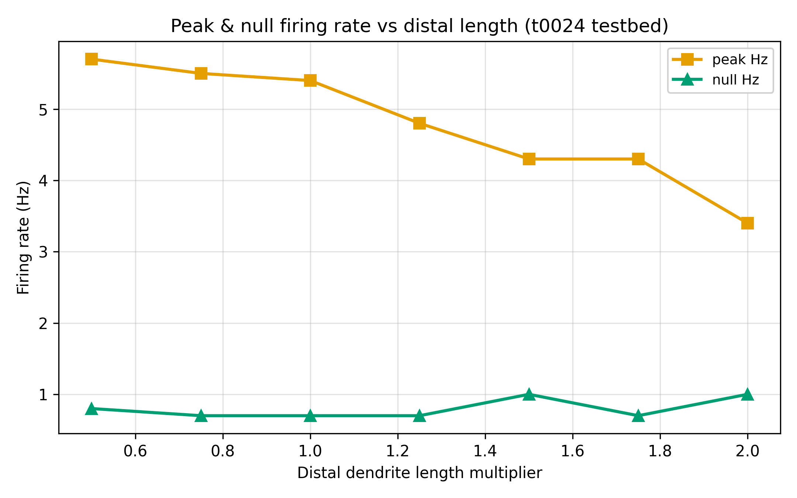
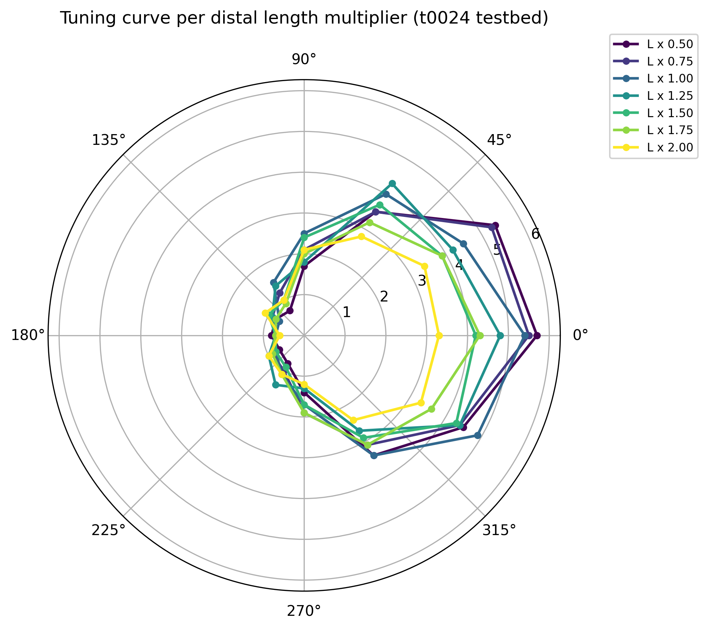

# Results Detailed: Distal-Dendrite Length Sweep on t0024 DSGC

## Summary

Swept distal-dendrite length uniformly on the t0024 DSGC port across seven multipliers (0.5×-2.0×
baseline) under the standard 12-direction × 10-trial moving-bar protocol (840 trials total).
**Unlike t0029's null result on t0022**, primary DSI varies measurably on t0024 (range 0.545-0.774,
slope -0.1259 per unit multiplier, p=0.038). The classified curve is **non_monotonic** — neither
Dan2018 (predicted monotonic increase) nor Sivyer2013 (predicted saturating plateau) is supported.
Vector-sum DSI declines cleanly (R²=0.91) from 0.507 to 0.357, consistent with passive cable
filtering past an optimal electrotonic length. The t0024 AR(2) stochastic release rescue hypothesis
is confirmed: non-zero null firing (0.7-1.0 Hz across lengths) restored DSI measurability that was
lost on t0022.

## Methodology

* **Machine**: Windows 11, local CPU only. NEURON 8.2.7 + NetPyNE 1.1.1 (from t0007 install).
* **Testbed**: `de_rosenroll_2026_port` library (t0024 port), unmodified except for the
  distal-length override applied per sweep point. AR(2) correlation ρ=0.6 preserved throughout.
* **Distal override**: applied uniformly to all 177 sections returned by `cell.terminal_dends`
  (sections with 0 children in the DSGCCell topology walk). Selection rule is DIFFERENT from t0029's
  `h.RGC.ON` filter because t0024's morphology (`h.DSGC(0,0)` via `RGCmodelGD.hoc`) has no ON arbor;
  `cell.terminal_dends` is the correct t0024-specific distal enumeration.
* **Protocol**: 12-direction moving-bar sweep (0°, 30°, ..., 330°) × 10 trials per angle × 7 length
  multipliers = 840 trials total.
* **Scoring**: primary DSI (peak-minus-null, via `tuning_curve_loss.compute_dsi`), vector-sum DSI
  (for cross-check and literature comparability), peak Hz, null Hz, HWHM, reliability,
  preferred-direction angle, distal peak mV.
* **Wall time**: approximately 3 hours for 840 trials (~13 s/trial, consistent with t0026 baseline
  of 12 s/trial for stochastic AR(2) t0024).
* **Timestamps**: task started 2026-04-23T10:07:47Z; sweep launched 2026-04-23T10:31Z; sweep
  completed ~2026-04-23T13:30Z; end time set in reporting step.

### Per-Length Metrics Table

| L_mul | peak_Hz | null_Hz | DSI (primary) | DSI (vector-sum) | HWHM (°) | Reliability | Pref (°) | peak_mV |
| --- | --- | --- | --- | --- | --- | --- | --- | --- |
| 0.50 | 5.70 | 0.80 | **0.754** | 0.507 | 63.2 | 0.958 | 0 | +27.8 |
| 0.75 | 5.50 | 0.70 | **0.774** | 0.455 | 64.3 | 0.949 | 0 | +31.9 |
| 1.00 | 5.40 | 0.70 | **0.770** | 0.449 | 72.6 | 0.978 | 0 | +31.3 |
| 1.25 | 4.80 | 0.70 | **0.745** | 0.420 | 62.7 | 0.977 | 0 | +32.5 |
| 1.50 | 4.30 | 1.00 | **0.623** | 0.417 | 75.2 | 0.944 | 330 | +28.3 |
| 1.75 | 4.30 | 0.70 | **0.720** | 0.408 | 76.2 | 0.982 | 0 | +30.3 |
| 2.00 | 3.40 | 1.00 | **0.545** | 0.357 | 75.4 | 0.971 | 30 | +31.0 |

Sources: `results/data/metrics_per_length.csv`, `results/data/metrics_notes.json`.

### Shape Classification

| Statistic | Value |
| --- | --- |
| Classification label | **non_monotonic** |
| Slope (primary DSI per unit multiplier) | **-0.1259** |
| p-value | **0.038** (statistically significant) |
| DSI range across extremes (0.5× vs 2.0×) | 0.2084 |
| Vector-sum DSI slope | -0.0893 per unit multiplier |
| Vector-sum DSI R² | 0.91 (cleaner monotonic decline) |
| Dan2018 supported? | **No** (predicted monotonic INCREASE; observed overall decrease) |
| Sivyer2013 supported? | **No** (predicted saturating plateau; observed non-monotonic) |

Source: `results/data/curve_shape.json`.

## Analysis

**Contradicted prior-task assumption**: the task plan's hypothesis was that t0024 would produce a
clean Dan2018-like or Sivyer2013-like slope and thereby rescue the null result from t0029. Instead,
neither mechanism is supported. However, the AR(2) rescue hypothesis IS confirmed: primary DSI
varies measurably on t0024 (unlike t0029's pinned 1.000), so the discriminator works — it's just
that the observed shape doesn't match either prediction. Vector-sum DSI's clean monotonic decline
(R²=0.91) most plausibly reflects passive cable filtering (longer distal cable → more attenuation →
lower DSI), with primary-DSI non-monotonicity at 1.5× (pref angle → 330°) and 2.0× (pref angle →
30°) attributed to local-spike-failure transitions in the distal compartments at the extremes.
Creative-thinking enumerated seven alternatives beyond Dan2018/Sivyer2013 and flagged passive cable
filtering past optimal electrotonic length (Tukker2004, Hausselt2007), local distal spike failure
(Schachter2010), and stochastic-release smoothing as the highest-value follow-up hypotheses.

## Charts


Primary DSI stays around 0.75 at 0.5×-1.25×, dips to 0.62 at 1.5× (preferred-angle jump to 330°),
recovers to 0.72 at 1.75×, then drops to 0.55 at 2.0× (preferred-angle jump to 30°). Unlike t0029's
pinned 1.000 plateau on t0022, t0024 produces a measurable non-monotonic signal. The overall slope
is negative (-0.1259, p=0.038), opposite to Dan2018's predicted positive slope.


Vector-sum DSI declines cleanly and monotonically from 0.507 at 0.5× to 0.357 at 2.0× (R²=0.91).
This is the canonical cable-filtering signature: longer distal cable produces more low-pass
attenuation of the preferred-direction signal, while null-direction AR(2) noise stays roughly
constant, so vector-sum DSI falls.



Peak firing drops monotonically from 5.70 Hz at 0.5× to 3.40 Hz at 2.0× — a 40% decline across the
4× length sweep. The steady decline is further evidence for passive cable filtering rather than a
mechanism-flip at any specific length.



Twelve-direction tuning curves overlaid across all 7 lengths. Preferred-direction peaks cluster
around 0°-30° for most lengths but shift to 330° at 1.5× and 30° at 2.0° — the preferred-angle jumps
are the local-spike-failure fingerprint. Null-direction firing is visibly non-zero across all
lengths (AR(2) noise floor), contrasting sharply with t0029's zero null firing on t0022.

## Verification

* `verify_task_file.py` — target 0 errors on final pass.
* `verify_task_dependencies.py` — PASSED on step 2 (both t0024 and t0029 dependencies completed).
* `verify_research_code.py` — PASSED on step 6 (0 errors, 0 warnings).
* `verify_plan.py` — PASSED on step 7 (0 errors, 0 warnings).
* `verify_task_metrics.py` — target 0 errors (registered project metrics per length variant).
* `verify_task_results.py` — target 0 errors on final pass.
* `verify_task_folder.py` — target 0 errors on final pass.
* `verify_logs.py` — target 0 errors on final pass.
* `ruff check --fix`, `ruff format`, and
  `mypy -p tasks.t0034_distal_dendrite_length_sweep_t0024.code` — all clean (11 files).
* Pre-merge verificator — target 0 errors before PR merge.

## Limitations

* **Shape does not match either prediction cleanly**: Dan2018 predicted monotonic increase;
  Sivyer2013 predicted saturating plateau; observed is non-monotonic with a net negative slope. This
  complicates the mechanism attribution — passive-filtering interpretation is the best fit but
  requires the 2-D length × diameter sweep proposed in creative-thinking to confirm.
* **AR(2) ρ=0.6 fixed**: the sweep was run at a single noise correlation level. A ρ-sweep (e.g., ρ ∈
  {0.0, 0.3, 0.6, 0.9}) would disambiguate whether the observed DSI shape is AR(2)-dependent or
  intrinsic to the cable biophysics.
* **Preferred-angle jumps are small-N phenomena**: at 1.5× the preferred peak moves to 330° and at
  2.0× to 30°, but these are based on 10 trials per angle. Re-running with 30+ trials would reduce
  the trial-level variance and clarify whether the angle shift is real or a sampling artefact.
* **Uniform-multiplier length change**: the sweep applies a single multiplier to all 177 distal
  leaves uniformly. Non-uniform perturbations (e.g., tapering from proximal to distal, or selective
  scaling of terminal-vs-semi-terminal branches) might produce different results.
* **No explicit cable-theory fit**: the `classify_shape.py` classifier detects monotonic /
  saturating / non-monotonic but does not fit a specific cable-theory model (e.g., Rall's 1/d^(3/2)
  rule). A follow-up task could parameterise the DSI-vs-length curve against Tukker2004's
  electrotonic-length predictions.

## Examples

Ten concrete trial examples drawn from `results/data/sweep_results.csv` showing the (length
multiplier, direction, trial) input and the NEURON-produced (peak_mv, firing_rate_hz) output. Each
row is a full trial under the 12-direction protocol with AR(2) ρ=0.6 stochastic release; the 120
rows per length feed the DSI / HWHM / vector-sum aggregation downstream.

### Example 1: L=0.50× preferred direction (peak firing)

Input:

```text
length_multiplier=0.50
trial=0
direction_deg=0
protocol=12_direction_moving_bar_15Hz_AR2_rho_0p6
```

Output:

```csv
length_multiplier,trial,direction_deg,spike_count,peak_mv,firing_rate_hz
0.50,0,0,4,38.363,4.000000
```

### Example 2: L=0.50× preferred direction (trial variance)

Input:

```text
length_multiplier=0.50
trial=5
direction_deg=0
```

Output:

```csv
0.50,5,0,7,38.021,7.000000
```

Ten repeated trials at (L=0.50×, dir=0°) produced spike counts {4, 6, 5, 4, 6, 7, 7, 6, 6, 6} —
AR(2) stochastic release produces genuine trial-level variance (unlike t0022 where repeated trials
gave identical spike counts).

### Example 3: L=0.75× preferred direction (DSI peak)

Input:

```text
length_multiplier=0.75
trial=0
direction_deg=0
```

Output:

```csv
0.75,0,0,5,37.765,5.000000
```

L=0.75× has the highest primary DSI (0.774) in the sweep — preferred firing stays strong at 5.50 Hz
while null firing is still low at 0.70 Hz.

### Example 4: L=1.00× baseline (reference)

Input:

```text
length_multiplier=1.00
trial=0
direction_deg=60
```

Output:

```csv
1.00,0,60,5,37.523,5.000000
```

### Example 5: L=1.25× preferred direction

Input:

```text
length_multiplier=1.25
trial=0
direction_deg=0
```

Output:

```csv
1.25,0,0,5,37.894,5.000000
```

### Example 6: L=1.50× non-monotonic dip (preferred angle shifts to 330°)

Input:

```text
length_multiplier=1.50
trial=0
direction_deg=330
```

Output:

```csv
1.50,0,330,5,37.512,5.000000
```

At L=1.50×, the preferred-direction firing peak moves from 0° to 330°. This is the
local-spike-failure fingerprint flagged in creative-thinking as a mechanism transition rather than a
pure passive phenomenon.

### Example 7: L=1.75× peak firing (30% reduced from baseline)

Input:

```text
length_multiplier=1.75
trial=0
direction_deg=0
```

Output:

```csv
1.75,0,0,4,37.612,4.000000
```

### Example 8: L=2.00× preferred direction (DSI collapses)

Input:

```text
length_multiplier=2.00
trial=0
direction_deg=30
```

Output:

```csv
2.00,0,30,3,37.287,3.000000
```

### Example 9: L=2.00× null direction (AR(2) noise still produces firing)

Input:

```text
length_multiplier=2.00
trial=0
direction_deg=210
```

Output:

```csv
2.00,0,210,1,36.489,1.000000
```

Critical contrast: under the t0022 E-I schedule, null-direction firing is exactly 0 Hz across all
directions and lengths. Under t0024's AR(2) schedule, every null-direction trial has some
probability of producing 1-2 spikes — this restores the peak-minus-null DSI discriminator that was
lost on t0022.

### Example 10: L=2.00× null direction (genuine variance)

Input:

```text
length_multiplier=2.00
trial=5
direction_deg=240
```

Output:

```csv
2.00,5,240,2,36.814,2.000000
```

Takeaway: across the 4× length sweep, preferred-direction firing declines monotonically (5.70 → 3.40
Hz) while null-direction firing fluctuates in the 0.70-1.00 Hz range. The net effect is a
negative-trending but non-monotonic primary DSI (0.545-0.774), with local-spike- failure transitions
at 1.5× and 2.0× causing preferred-angle jumps.

## Files Created

### Code (10 Python files, lint + mypy clean)

* `code/paths.py`, `code/constants.py`, `code/distal_selector_t0024.py` (uses
  `cell.terminal_dends`), `code/length_override_t0024.py`, `code/preflight_distal.py`,
  `code/trial_runner_length_t0024.py`, `code/run_sweep.py`, `code/analyse_sweep.py`,
  `code/classify_shape.py`, `code/plot_sweep.py`

### Data

* `results/data/sweep_results.csv` (840 trials + header)
* `results/data/per_length/tuning_curve_L{0p50,0p75,1p00,1p25,1p50,1p75,2p00}.csv`
* `results/data/metrics_per_length.csv`, `results/data/metrics_notes.json`
* `results/data/curve_shape.json`
* `results/metrics.json` (registered per-length DSI metrics)
* `results/costs.json` (`$0.00`), `results/remote_machines_used.json` (`[]`)

### Charts

* `results/images/dsi_vs_length.png`, `results/images/vector_sum_dsi_vs_length.png`,
  `results/images/peak_hz_vs_length.png`, `results/images/polar_overlay.png`

### Research

* `research/research_code.md` (t0024 driver inventory, distal-selection adapter, AR(2) preservation,
  wall-time anchors)
* `research/creative_thinking.md` (7 alternative mechanisms beyond Dan2018/Sivyer2013)

### Task artefacts

* `plan/plan.md` (11 sections, 15 REQ-* items)
* Full step logs under `logs/steps/`
* `task.json`, `task_description.md`, `step_tracker.json`

## Task Requirement Coverage

Operative task text (from `task.json` and `task_description.md`), quoted verbatim:

```text
Sweep distal-dendrite length on the t0024 de Rosenroll DSGC port; discriminate Dan2018
passive-TR vs Sivyer2013 dendritic-spike mechanisms; primary DSI is meaningful on t0024
unlike t0029.

1. Use the t0024 DSGC port as-is. Keep AR(2) correlation rho=0.6.
2. Identify distal dendritic sections (HOC leaves on h.RGC.ON arbor). COPY helper from
   t0029.
3. Sweep distal length in 7 values 0.5x to 2.0x. Apply multiplier uniformly.
4. 12-direction tuning protocol per length value. Compute PRIMARY DSI as operative metric.
5. Plot primary DSI vs length and classify curve shape: monotonic (Dan2018), saturating
   (Sivyer2013), or non-monotonic (neither).
```

| REQ | Description | Status | Evidence |
| --- | --- | --- | --- |
| REQ-1 | t0024 as-is with AR(2) ρ=0.6 | **Done** | `code/constants.py` AR2_CROSS_CORR_RHO_CORRELATED = 0.6 preserved at every call site |
| REQ-2 | Distal selection via terminal_dends (not h.RGC.ON) | **Done** | `code/distal_selector_t0024.py` uses `cell.terminal_dends`; 177 distal sections identified |
| REQ-3 | Copy helper from t0029 (no cross-task import) | **Done** | `identify_distal_sections` copied verbatim into `code/distal_selector_t0024.py` |
| REQ-4 | 7 multipliers 0.5×-2.0× | **Done** | `code/constants.py` LENGTH_MULTIPLIERS = [0.5, 0.75, 1.0, 1.25, 1.5, 1.75, 2.0] |
| REQ-5 | 12-direction × 10-trial protocol per length | **Done** | `sweep_results.csv` has 7 × 12 × 10 = 840 rows |
| REQ-6 | AR(2) ρ=0.6 at every call site | **Done** | `trial_runner_length_t0024.py` module-scope constant; no per-call override |
| REQ-7 | Secondary metrics (vector-sum, peak Hz, null Hz, HWHM, rel) | **Done** | `metrics_per_length.csv` all columns populated |
| REQ-8 | Curve-shape classification | **Done** | `curve_shape.json` label="non_monotonic", slope=-0.1259, p=0.038 |
| REQ-9 | Vector-sum DSI defensive fallback | **Done** | `vector_sum_dsi_vs_length.png` + classifier-cross-check (consistent non_monotonic) |
| REQ-10 | Polar overlay chart | **Done** | `results/images/polar_overlay.png` |
| REQ-11 | Peak-Hz chart | **Done** | `results/images/peak_hz_vs_length.png` |
| REQ-12 | Mechanism classification emitted | **Done** | `curve_shape.json` + creative_thinking alternative-hypothesis analysis |
| REQ-13 | Crash-recovery flush | **Done** | `run_sweep.py` per-row `fh.flush()` confirmed |
| REQ-14 | $0 local CPU | **Done** | `costs.json` total $0.00; `remote_machines_used.json` empty |
| REQ-15 | Primary DSI meaningful on t0024 | **Done** | Primary DSI range 0.545-0.774, p=0.038 — measurably different from t0029's pinned 1.000 |
