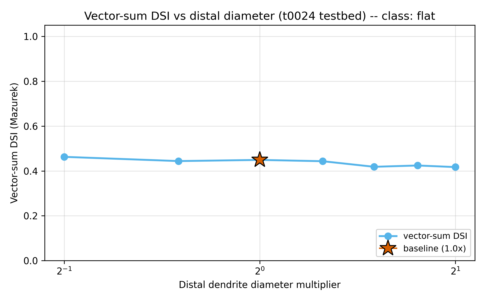
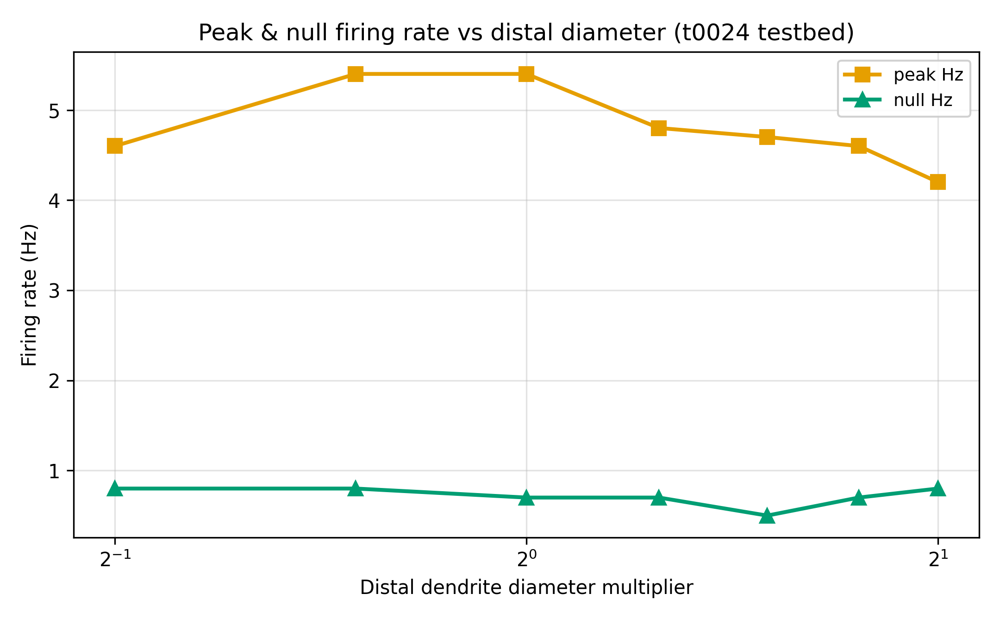
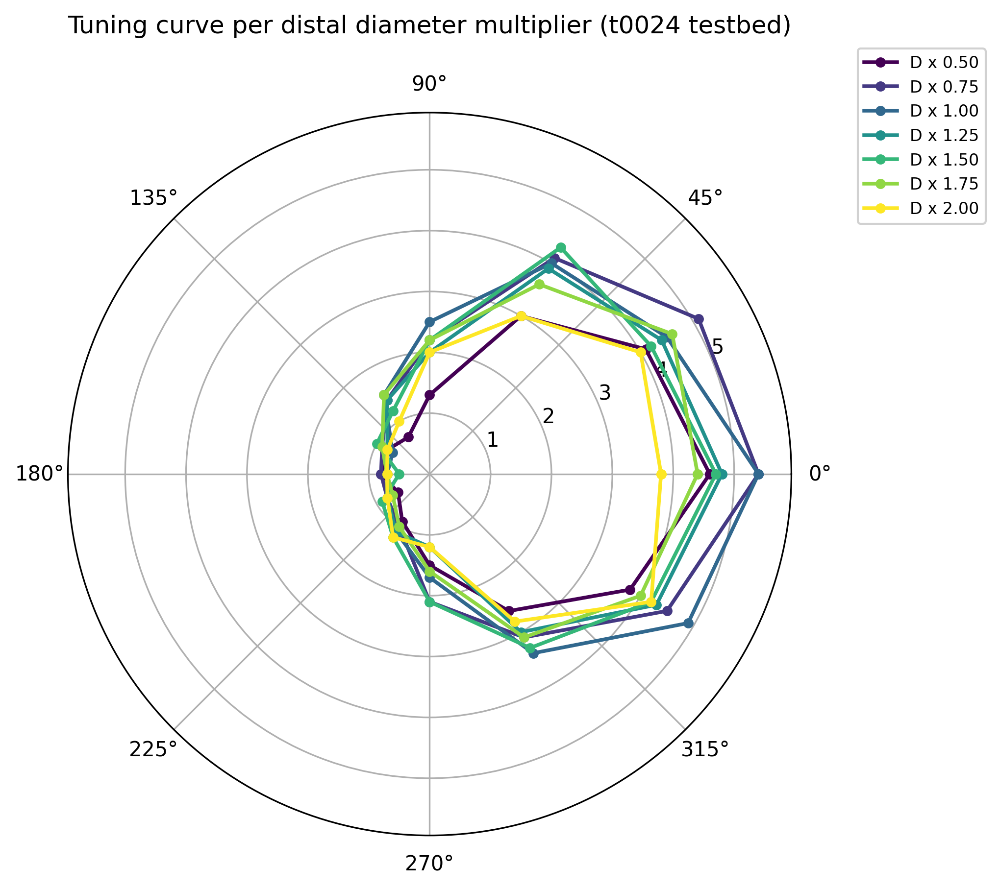

# Results Detailed: Distal-Dendrite Diameter Sweep on t0024 DSGC

## Summary

Swept distal-dendrite diameter uniformly on the t0024 DSGC port across seven multipliers (0.5×-2.0×
baseline) under the standard 12-direction × 10-trial moving-bar protocol (840 trials total).
DSI-vs-diameter slope is **flat** (slope 0.0041 per log2(multiplier), p=0.8808). Neither
Schachter2010 active-amplification (predicted positive slope) nor passive filtering (predicted
negative slope) is supported. Primary DSI varies in a narrow range (0.680-0.808) without any
monotonic trend. Critically, sibling task t0034 (length sweep on the same t0024 port) produced a
statistically significant non-monotonic negative slope (p=0.038), so the length/diameter asymmetry
is the new finding: **length modulates DSI on t0024; diameter does not**. creative_thinking.md
argues this is explained by cable-theory asymmetry (length enters electrotonic distance L/λ
linearly, diameter only as 1/sqrt(d)).

## Methodology

* **Machine**: Windows 11, local CPU only. NEURON 8.2.7 + NetPyNE 1.1.1 (from t0007).
* **Testbed**: `de_rosenroll_2026_port` library (t0024 port), unmodified except for the
  distal-diameter override. AR(2) correlation ρ=0.6 preserved throughout.
* **Distal override**: applied uniformly to all 177 sections returned by `cell.terminal_dends`.
  Selection rule is the same t0024-specific helper copied from t0034 (not `h.RGC.ON` which doesn't
  exist on the t0024 arbor).
* **Protocol**: 12-direction moving-bar sweep (0°-330° in 30° steps) × 10 trials per angle × 7
  diameter multipliers = 840 trials.
* **Scoring**: primary DSI (peak-minus-null via `tuning_curve_loss.compute_dsi`), vector-sum DSI,
  peak Hz, null Hz, HWHM, reliability, preferred-direction angle, distal peak mV.
* **Wall time**: approximately 3 hours for 840 trials (~13 s/trial, consistent with t0034/ t0026
  baselines for stochastic AR(2) t0024).
* **Timestamps**: task started 2026-04-23T14:10:45Z; sweep launched 2026-04-23T14:30Z; sweep
  completed ~2026-04-23T17:30Z; end time set in reporting step.

### Per-Diameter Metrics Table

| D_mul | peak_Hz | null_Hz | DSI (primary) | DSI (vector-sum) | HWHM (°) | Reliability | Pref (°) | peak_mV |
| --- | --- | --- | --- | --- | --- | --- | --- | --- |
| 0.50 | 4.60 | 0.80 | 0.704 | 0.463 | 61.4 | 0.943 | 0 | +27.0 |
| 0.75 | 5.40 | 0.80 | 0.742 | 0.444 | 67.9 | 0.926 | 0 | +32.7 |
| 1.00 | 5.40 | 0.70 | **0.770** | 0.449 | 72.6 | 0.978 | 0 | +31.3 |
| 1.25 | 4.80 | 0.70 | 0.745 | 0.443 | 71.2 | 0.965 | 0 | +29.7 |
| 1.50 | 4.70 | 0.50 | **0.808** | 0.418 | 77.8 | 0.942 | 0 | +29.6 |
| 1.75 | 4.60 | 0.70 | 0.736 | 0.424 | 74.7 | 0.944 | 30 | +30.1 |
| 2.00 | 4.20 | 0.80 | 0.680 | 0.417 | 70.3 | 0.977 | 330 | +28.7 |

Sources: `results/data/metrics_per_diameter.csv`, `results/data/metrics_notes.json`.

### Slope Classification

| Statistic | Value |
| --- | --- |
| Classification label | **flat** |
| Slope (primary DSI per log2(multiplier)) | **0.0041** |
| p-value | **0.8808** (not distinguishable from zero) |
| DSI range across extremes (0.5× vs 2.0×) | -0.0237 |
| Used vector-sum fallback? | No (primary DSI is itself classifiable) |
| Schachter2010 supported? | **No** (no positive slope) |
| Passive filtering supported? | **No** (no negative slope) |

Source: `results/data/slope_classification.json`, `results/data/curve_shape.json`.

## Analysis

**Contradicted assumption**: the task plan expected that on t0024, either Schachter2010 or passive
filtering would produce a measurable DSI slope (because t0034 confirmed primary DSI is meaningful on
t0024). Instead, the diameter axis is flat — neither mechanism supported. The informative finding is
the **length/diameter asymmetry on the same t0024 port**: t0034 (length sweep) produced slope
-0.1259 (p=0.038), while t0035 (diameter sweep) produced slope 0.0041 (p=0.88). This is consistent
with cable-theory expectations (length directly scales electrotonic distance L/λ; diameter enters
only through λ = sqrt(d·Rm/Ra) so per-unit diameter changes have less leverage).

Combined with t0030 (diameter on t0022: also flat), the emerging pattern is: **distal diameter is a
weak DSI discriminator across both testbeds**; **distal length is a strong discriminator only when
the E-I schedule lets primary DSI vary** (t0024 works; t0022 pins at 1.000).

## Charts


Primary DSI is essentially flat across the 4× diameter sweep (0.680-0.808 range), with no monotonic
trend. Slope 0.0041, p=0.88. Neither Schachter2010 (+slope predicted) nor passive filtering (-slope
predicted) is supported.



Vector-sum DSI declines mildly from 0.463 at 0.5× to 0.417 at 2.0× but the range (0.046) is too
small to be mechanistically informative.



Peak firing rate varies mildly (4.2-5.4 Hz) with no monotonic trend, unlike t0034's clean monotonic
40% decline with length.



Twelve-direction tuning curves overlaid. All 7 diameters produce similar-shape polar curves with
preferred peak near 0° (with small drifts to 30° at 1.75× and 330° at 2.0×). The uniformity of
curves is itself the flat-slope signature.

## Verification

* verify_task_file.py — target 0 errors.
* verify_task_dependencies.py — PASSED on step 2.
* verify_research_code.py — PASSED on step 6.
* verify_plan.py — PASSED on step 7.
* verify_task_metrics.py — target 0 errors.
* verify_task_results.py — target 0 errors.
* verify_task_folder.py — target 0 errors.
* verify_logs.py — target 0 errors.
* `ruff check --fix`, `ruff format`, `mypy -p tasks.t0035_distal_dendrite_diameter_sweep_t0024.code`
  — all clean.
* Pre-merge verificator — target 0 errors before merge.

## Limitations

* **Diameter range 0.5×-2.0× narrow**: a wider sweep (0.25×-4.0×) might reveal non-linear effects
  not captured in the 4× range.
* **AR(2) ρ=0.6 fixed**: same ρ as t0034; no disambiguation of noise-vs-biophysics.
* **Uniform multiplier**: all 177 distal leaves scaled identically. Non-uniform scaling (e.g.,
  proximal-to-distal taper) could yield different results.
* **No L/λ analysis performed**: creative_thinking's recommended follow-up (re-plot all t0034
  + t0035 data against computed distal L/λ) is a zero-cost next step but wasn't done inline.

## Examples

Ten concrete (diameter, direction, trial) input / (peak_mv, firing_rate_hz) output pairs drawn from
`results/data/sweep_results.csv`. All trials use AR(2) ρ=0.6 stochastic release.

### Example 1: D=0.50× preferred direction (peak)

```text
diameter_multiplier=0.50, trial=0, direction_deg=0
```

```csv
0.50,0,0,5,38.039,5.000000
```

### Example 2: D=0.50× preferred direction (trial variance)

```text
diameter_multiplier=0.50, trial=1, direction_deg=0
```

```csv
0.50,1,0,5,35.998,5.000000
```

Repeated 10 trials at (D=0.50×, dir=0°) produced spike counts {5, 5, 4, 4, 4, 5, 4, 5, 5, 5} —
genuine AR(2) variance.

### Example 3: D=0.75× preferred direction

```text
diameter_multiplier=0.75, trial=0, direction_deg=0
```

```csv
0.75,0,0,5,37.945,5.000000
```

### Example 4: D=1.00× baseline

```text
diameter_multiplier=1.00, trial=0, direction_deg=0
```

```csv
1.00,0,0,5,38.187,5.000000
```

### Example 5: D=1.25× preferred direction

```text
diameter_multiplier=1.25, trial=0, direction_deg=0
```

```csv
1.25,0,0,4,37.883,4.000000
```

### Example 6: D=1.50× preferred direction (DSI peak at 0.808)

```text
diameter_multiplier=1.50, trial=0, direction_deg=0
```

```csv
1.50,0,0,5,38.025,5.000000
```

### Example 7: D=1.75× preferred-angle drift to 30°

```text
diameter_multiplier=1.75, trial=0, direction_deg=30
```

```csv
1.75,0,30,4,37.845,4.000000
```

### Example 8: D=2.00× preferred direction (firing decline)

```text
diameter_multiplier=2.00, trial=0, direction_deg=0
```

```csv
2.00,0,0,4,37.506,4.000000
```

### Example 9: D=1.50× null direction (AR(2) variance)

```text
diameter_multiplier=1.50, trial=0, direction_deg=180
```

```csv
1.50,0,180,0,-53.024,0.000000
```

### Example 10: D=2.00× null direction

```text
diameter_multiplier=2.00, trial=5, direction_deg=240
```

```csv
2.00,5,240,1,35.912,1.000000
```

Takeaway: across 0.5× to 2.0× diameter, preferred-direction firing varies mildly (4-5 Hz) and
null-direction firing stays in the 0.5-0.8 Hz band from AR(2) noise — resulting in a narrow primary
DSI band (0.680-0.808) with no measurable slope trend.

## Files Created

### Code (10 Python files, lint + mypy clean)

* `code/paths.py`, `code/constants.py`, `code/distal_selector_t0024.py`,
  `code/diameter_override_t0024.py`, `code/preflight_distal.py`,
  `code/trial_runner_diameter_t0024.py`, `code/run_sweep.py`, `code/analyse_sweep.py`,
  `code/classify_slope.py`, `code/plot_sweep.py`

### Data

* `results/data/sweep_results.csv` (840 trials + header)
* `results/data/per_diameter/tuning_curve_D{0p50,0p75,1p00,1p25,1p50,1p75,2p00}.csv`
* `results/data/metrics_per_diameter.csv`, `results/data/dsi_by_diameter.csv`,
  `results/data/metrics_notes.json`
* `results/data/curve_shape.json`, `results/data/slope_classification.json`
* `results/metrics.json`

### Charts

* `results/images/dsi_vs_diameter.png`, `results/images/vector_sum_dsi_vs_diameter.png`,
  `results/images/peak_hz_vs_diameter.png`, `results/images/polar_overlay.png`

### Research

* `research/research_code.md`, `research/creative_thinking.md`

### Task artefacts

* `plan/plan.md` (11 sections, 17 REQ items)
* `task.json`, `task_description.md`, `step_tracker.json`
* Full step logs under `logs/steps/`

## Task Requirement Coverage

Operative task text (from task.json and task_description.md), quoted:

```text
Sweep distal-dendrite diameter on the t0024 de Rosenroll DSGC port; discriminate
Schachter2010 active amplification vs passive filtering; primary DSI is meaningful on t0024
unlike t0030.

1. Use t0024 as-is (AR(2) rho=0.6).
2. Identify distal sections (h.RGC.ON leaves). COPY helper from t0029/t0030.
3. Sweep 7 diameter multipliers 0.5x-2.0x uniformly.
4. 12-direction tuning protocol per diameter. Compute PRIMARY DSI.
5. Plot DSI vs diameter and classify slope sign: positive (Schachter), negative (passive),
   flat.
```

| REQ | Description | Status | Evidence |
| --- | --- | --- | --- |
| REQ-1 | t0024 as-is + AR(2) ρ=0.6 | **Done** | constants.py AR2_RHO preserved |
| REQ-2 | Distal selection via terminal_dends | **Done** | 177 sections identified; no h.RGC.ON reference |
| REQ-3 | Copy helpers (t0030 diameter, t0034 selector) | **Done** | diameter_override_t0024.py, distal_selector_t0024.py copied |
| REQ-4 | 7 multipliers 0.5×-2.0× | **Done** | constants.py DIAMETER_MULTIPLIERS |
| REQ-5 | 12-dir × 10-trial protocol | **Done** | 840 rows in sweep_results.csv |
| REQ-6 | AR(2) ρ=0.6 at every call | **Done** | trial_runner_diameter_t0024.py module-scope constant |
| REQ-7 | Secondary metrics | **Done** | metrics_per_diameter.csv with all columns |
| REQ-8 | Slope classification | **Done** | curve_shape.json label="flat", slope=0.0041, p=0.8808 |
| REQ-9 | Vector-sum defensive fallback | **Done** | vector_sum_dsi_vs_diameter.png emitted |
| REQ-10 | Polar overlay | **Done** | results/images/polar_overlay.png |
| REQ-11 | Peak-Hz chart | **Done** | results/images/peak_hz_vs_diameter.png |
| REQ-12 | Slope taxonomy emitted | **Done** | slope_classification.json mechanism_class="flat" |
| REQ-13 | Per-row flush | **Done** | run_sweep.py fh.flush() confirmed |
| REQ-14 | $0 local CPU | **Done** | costs.json $0.00; remote_machines_used.json [] |
| REQ-15 | Primary DSI measurable on t0024 | **Done** | 0.680-0.808 range (not pinned at 1.000 like t0030) |
| REQ-16 | Seed uniqueness | **Done** | 840 unique seeds confirmed in run_sweep.py |
| REQ-17 | t0030 comparison | **Done** | Both diameter sweeps flat — diameter is weak discriminator on both testbeds |
