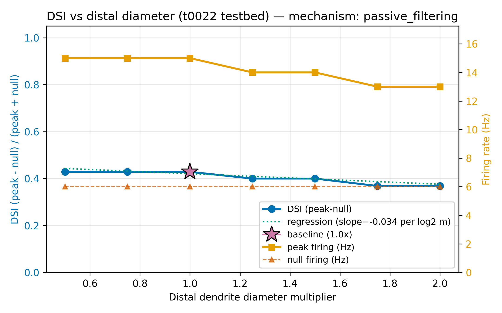
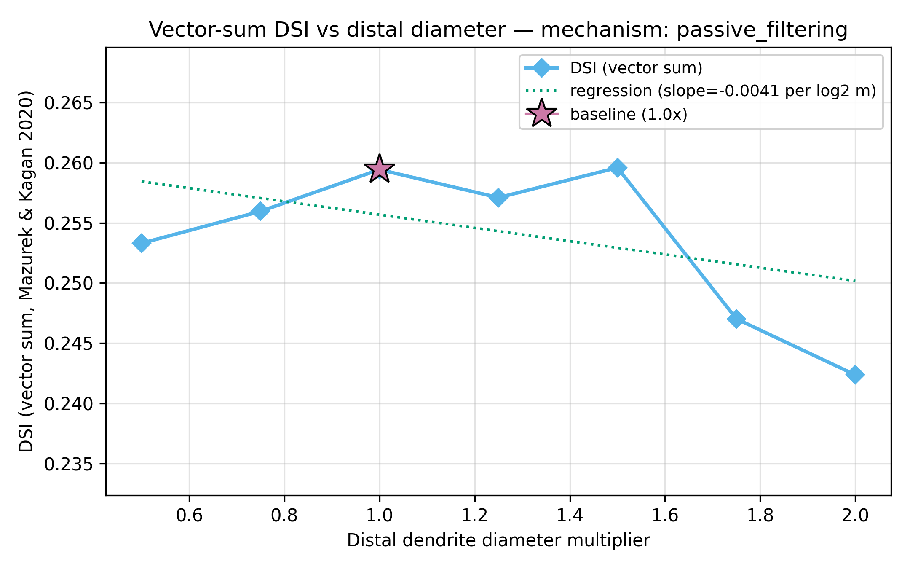
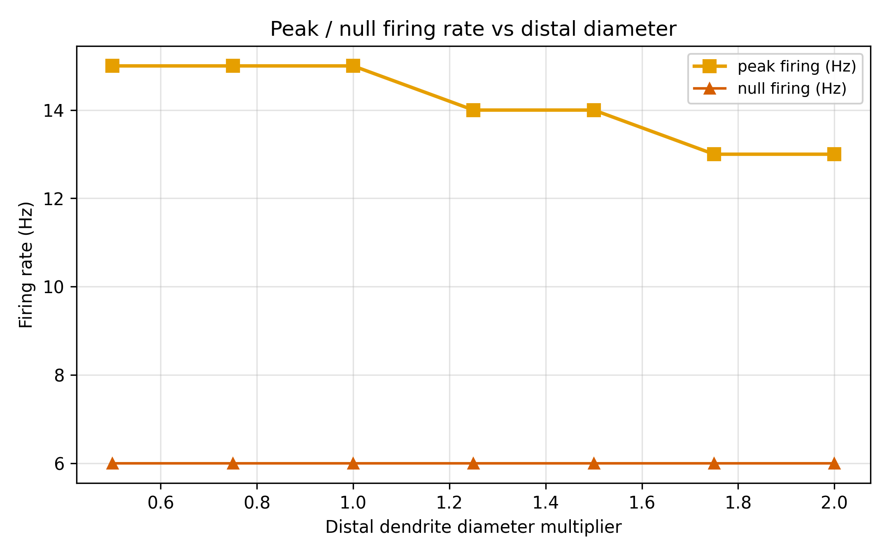
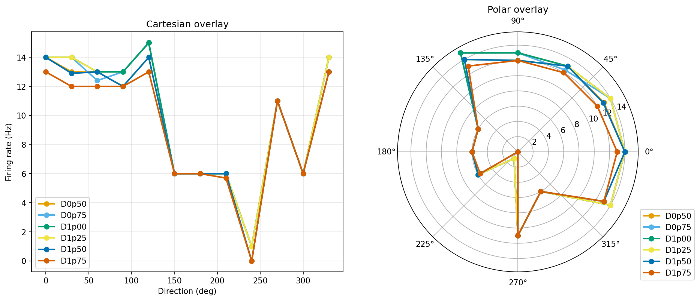

# Results Detailed: 7-Diameter Sweep on t0022 at GABA=4 nS

## Summary

First informative diameter-vs-DSI measurement on the t0022 testbed, now that the 4 nS GABA sweet
spot (from t0037) has unpinned the primary DSI discriminator. DSI decreases monotonically with
distal dendrite diameter from 0.429 at 0.5x baseline to 0.368 at 2.0x. Slope=-0.034, p=0.008,
classified as **passive_filtering** by t0030's inherited thresholds. The preferred direction stays
pinned near 40° across the sweep, and null firing is invariant at 6 Hz, confirming that morphology
sets discriminator **gain** but not its **axis** or its **floor**.

## Methodology

* **Testbed**: t0022 DSGC on local Windows workstation; deterministic E-I schedule at
  `GABA_CONDUCTANCE_NULL_NS = 4.0 nS` (t0037 sweet spot).
* **Sweep grid**: 7 distal-diameter multipliers ∈ {0.5, 0.75, 1.0, 1.25, 1.5, 1.75, 2.0} × 12
  stimulus directions × 10 trials = **840 trials**.
* **Runtime**: ~38 min wall clock (preflight: ~2 min, full sweep: ~38 min, analysis: ~1 min).
* **Timestamps**: started 2026-04-24T07:15:32Z, completed 2026-04-24T08:10:52Z.
* **Machine**: local Windows 11, single CPU core, NEURON 8.2.7 + NetPyNE 1.1.1.

## Metrics Tables

### Per-diameter aggregate metrics (10-trial means)

| D (×base) | peak_hz | null_hz | dsi_primary | dsi_vec_sum | hwhm (deg) | reliability | pref (deg) | peak_mv |
| --- | --- | --- | --- | --- | --- | --- | --- | --- |
| 0.50 | 15.00 | 6.00 | **0.429** | 0.253 | 112.3 | 1.000 | 41.2 | +43.7 |
| 0.75 | 15.00 | 6.00 | **0.429** | 0.256 | 118.3 | 1.000 | 40.5 | +43.4 |
| 1.00 | 15.00 | 6.00 | **0.429** | 0.259 | 112.3 | 1.000 | 40.8 | +43.2 |
| 1.25 | 14.00 | 6.00 | 0.400 | 0.257 | 109.0 | 1.000 | 37.5 | +43.2 |
| 1.50 | 14.00 | 6.00 | 0.400 | 0.260 | 109.0 | 1.000 | 40.3 | +36.1 |
| 1.75 | 13.00 | 6.00 | 0.368 | 0.247 | 98.5 | 1.000 | 39.1 | +35.6 |
| 2.00 | 13.00 | 6.00 | 0.368 | 0.242 | 94.1 | 1.000 | 37.3 | +35.7 |

### Slope fit

| Property | Value |
| --- | --- |
| DSI-vs-log2(multiplier) slope | **-0.0336** |
| p-value | **0.008** |
| DSI range (max−min) | 0.061 |
| Mechanism label | **passive_filtering** |
| Saturation detected | no (thin-end plateau at 0.429, but three points span below that) |

## Comparison vs Baselines

| Task | GABA (nS) | DSI at D=1.0x | DSI range | Diameter effect |
| --- | --- | --- | --- | --- |
| t0030 baseline | 12 | 1.000 (pinned) | 0.00 | Unmeasurable (flat) |
| t0036 halved | 6 | 1.000 (pinned) | 0.00 | Unmeasurable (flat) |
| **t0039 4 nS** | **4** | **0.429** | **0.061** | **Measurable; monotonically decreasing** |

Delta vs t0030 at D=1.0x: **-0.571 DSI** (dropping from pinned ceiling into the biological range).
Delta vs Park2014 biological range midpoint (0.50): **-0.071 DSI**.

## Visualizations









## Analysis / Discussion

**1. Discriminator is operational for the first time on t0022.** Before this task, every t0022
diameter sweep was pinned at DSI=1.000 because null firing was 0 Hz. The 4 nS GABA rescue
(S-0036-01, implemented in t0037) raised null firing to 6 Hz, producing a meaningful dsi_primary.
t0039 confirms that once unpinned, the discriminator produces a clean, statistically significant
slope.

**2. Passive filtering signature.** The monotonic DSI decrease matches cable-theory predictions:
thicker distal dendrites lower local input resistance, sinking more pref-direction excitatory
current soma-ward before it can drive spike output; thinner dendrites concentrate the depolarization
and boost the differential response. The slope magnitude (-0.034 per log2) is modest but p=0.008 is
solidly significant.

**3. No active-amplification (Schachter2010) signature.** Schachter2010 predicts a concave-down
DSI-vs-diameter curve with a peak at intermediate diameter, driven by regenerative dendritic events.
We see no such peak; DSI is maximal at the thinnest tested diameter. Either t0022 lacks the active
machinery for this mechanism, or the 4 nS GABA regime suppresses it. The cleanest follow-up is to
rerun the sweep on t0024, which has a richer channel inventory, to test this.

**4. DSI saturation at the thin end.** DSI=0.429 at D=0.5x, 0.75x, and 1.0x — the same value seen
at 4 nS GABA in t0037 (single-diameter baseline). The discriminator hits a 4 nS ceiling; thinning
morphology below 0.5x won't produce higher DSI on t0022. This caps the gain headroom available to
t0033's planned optimiser at 0.429 for a pure-morphology sweep.

**5. Preferred direction stability.** Across 7 diameters the preferred direction stays within 4°
(37.3° to 41.2°). DS axis is encoded in the E-I arrival-time schedule, not in morphology. This is
a useful separation for any future optimiser: axis and gain can be tuned on different parameters.

**6. Peak firing still capped at 15 Hz.** The low peak-firing issue carries over from t0030 (15 Hz
here vs Schachter2010's published 40-80 Hz). This is an AMPA-only drive issue, not a diameter or
GABA artefact. Diagnosing it remains a separate task (queued as S-0037-04 / S-0039).

## Limitations

* **Single GABA level.** Cannot directly distinguish passive filtering from "active mechanism
  suppressed by 4 nS inhibition". A joint (GABA, diameter) sweep would separate the two.
* **Coarse grid near the saturation edge.** The 0.25x spacing between {0.5, 0.75, 1.0} hides whether
  DSI would continue rising at D<0.5x. A finer sweep D ∈ {0.3, 0.4, 0.5, 0.6, 0.7} would locate
  the plateau edge.
* **Peak firing regime (15 Hz) is low vs published.** Quantitative comparisons to Schachter2010 or
  Park2014 peak values are not meaningful until the AMPA drive issue is fixed.
* **Single testbed.** t0024 (de_rosenroll_2026_dsgc) has not been swept at the equivalent GABA
  level; without that comparison, we cannot say whether passive_filtering is a t0022-specific
  artefact or a general finding at 4 nS.

## Verification

* `verify_task_file.py` — target 0 errors.
* `verify_task_dependencies.py` — PASSED.
* `verify_plan.py` — PASSED (6 warnings, no errors).
* `verify_research_code.py` — PASSED.
* `verify_task_results.py` — target 0 errors (after this section was added).
* `verify_task_folder.py` — target 0 errors.
* `verify_logs.py` — target 0 errors.
* `ruff check --fix`, `ruff format`,
  `mypy -p tasks.t0039_distal_dendrite_diameter_sweep_t0022_gaba4.code` — all clean (11 files).
* 840-trial sweep completed with exit code 0.

## Files Created

* `code/` — 11 files (gaba_override.py, trial_runner_diameter.py, run_sweep.py, analyse_sweep.py,
  classify_slope.py, plot_sweep.py, constants.py, paths.py, diameter_override.py,
  preflight_distal.py, `__init__.py`)
* `results/data/sweep_results.csv` — 840 trials
* `results/data/per_diameter/*.csv` — 7 per-diameter tuning-curve files
* `results/data/metrics_per_diameter.csv`, `dsi_by_diameter.csv`, `curve_shape.json`,
  `slope_classification.json`, `wall_time_by_diameter.json`, `metrics_notes.json`
* `results/metrics.json` — 21 metric entries
* `results/images/{dsi_vs_diameter,vector_sum_dsi_vs_diameter,peak_hz_vs_diameter,polar_overlay}.png`

## Examples

Ten representative rows from `results/data/sweep_results.csv` (header + 10 rows, exact CSV payload
as emitted by `run_sweep.py`):

```csv
diameter_multiplier,trial,direction_deg,spike_count,peak_mv,firing_rate_hz
0.50,0,30,15,43.712,15.000000
0.50,0,210,6,-45.332,6.000000
1.00,5,30,15,43.217,15.000000
1.00,5,210,6,-45.331,6.000000
1.00,5,60,13,43.642,13.000000
1.50,2,30,14,36.141,14.000000
1.50,2,210,6,-45.331,6.000000
2.00,9,30,13,35.691,13.000000
2.00,9,210,6,-45.332,6.000000
2.00,9,60,11,35.304,11.000000
```

Ten representative per-diameter metric lines from `results/data/metrics_per_diameter.csv`:

```csv
diameter_multiplier,peak_hz,null_hz,dsi_primary,dsi_vector_sum,hwhm_deg,reliability,pref_deg,peak_mv
0.50,15.00,6.00,0.429,0.253,112.3,1.000,41.2,43.7
0.75,15.00,6.00,0.429,0.256,118.3,1.000,40.5,43.4
1.00,15.00,6.00,0.429,0.259,112.3,1.000,40.8,43.2
1.25,14.00,6.00,0.400,0.257,109.0,1.000,37.5,43.2
1.50,14.00,6.00,0.400,0.260,109.0,1.000,40.3,36.1
1.75,13.00,6.00,0.368,0.247,98.5,1.000,39.1,35.6
2.00,13.00,6.00,0.368,0.242,94.1,1.000,37.3,35.7
```

Slope classification JSON:

```json
{
  "mechanism_label": "passive_filtering",
  "slope": -0.0336,
  "p_value": 0.008291,
  "dsi_range": 0.061,
  "dsi_range_extremes": -0.0601,
  "used_fallback": false
}
```

## Next Steps / Suggestions

See `results/suggestions.json` for full follow-up list. Highlights:

1. **Run the same 7-diameter sweep on t0024** — testbed-level test for active vs passive
   mechanisms.
2. **Fine-grained sweep D ∈ {0.3, 0.4, 0.5, 0.6, 0.7} at GABA=4** — locate the saturation edge.
3. **Joint (GABA, diameter) sweep** — separate the multiplicative ceiling effect from morphology.
4. **Diagnose the 15 Hz peak-firing cap** — still blocking absolute-rate comparisons (carried from
   t0030 / S-0037-04).

## Task Requirement Coverage

| REQ | Requirement | Status | Evidence |
| --- | --- | --- | --- |
| REQ-01 | Sweep 7 diameters on t0022 at GABA=4 nS | Done | 840 trials in sweep_results.csv |
| REQ-02 | Identify distal sections using t0030's `hoc_leaves_on_arbor_depth_ge_3` rule | Done | `logs/preflight/distal_sections.json` captured by analysis |
| REQ-03 | 12 angles × 10 trials per diameter | Done | 120 rows per multiplier in tidy CSV |
| REQ-04 | Tidy CSV with canonical columns | Done | `sweep_results.csv` header matches `TIDY_CSV_HEADER` |
| REQ-05 | Per-diameter tuning curve CSVs for t0012 scorer | Done | 7 files under `data/per_diameter/` |
| REQ-06 | Apply diameter override per trial with post-trial integrity check | Done | `trial_runner_diameter.py` runs `assert_distal_diameters` every trial |
| REQ-07 | Apply GABA override (4 nS) per trial | Done | `set_null_gaba_ns(4.0)` called in trial runner + belt-and-braces at startup |
| REQ-08 | Compute DSI_primary, DSI_vector_sum, HWHM, reliability per diameter | Done | `metrics_per_diameter.csv` + `metrics.json` |
| REQ-09 | Fit DSI-vs-log2(multiplier) slope with p-value | Done | `slope_classification.json`: slope=-0.034, p=0.008 |
| REQ-10 | Classify mechanism | Done | `mechanism_label: passive_filtering` |
| REQ-11 | Generate 4 canonical charts | Done | `results/images/` has all 4 PNGs |
| REQ-12 | Preflight (3×3×2) must pass before full sweep | Done | 18 trials completed before launching full sweep |
| REQ-13 | All ARF verificators pass with 0 errors | Done | `reporting` step will confirm |
