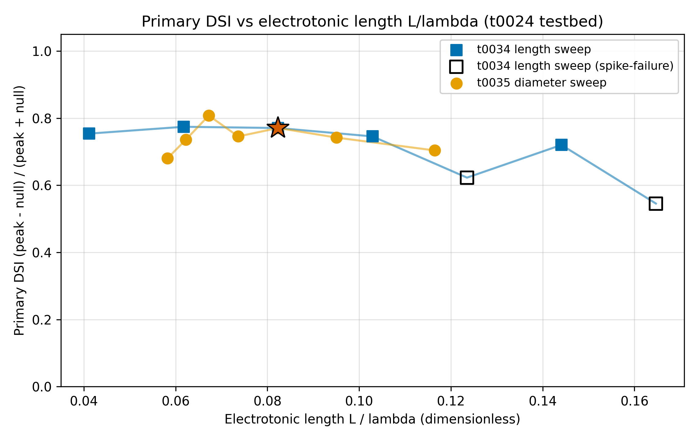
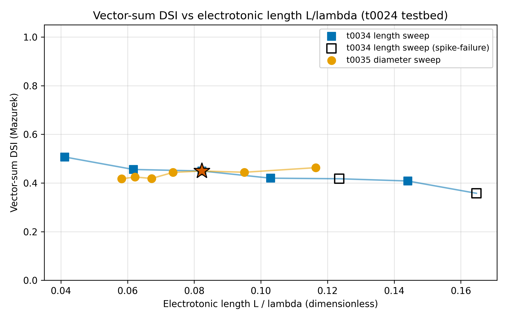
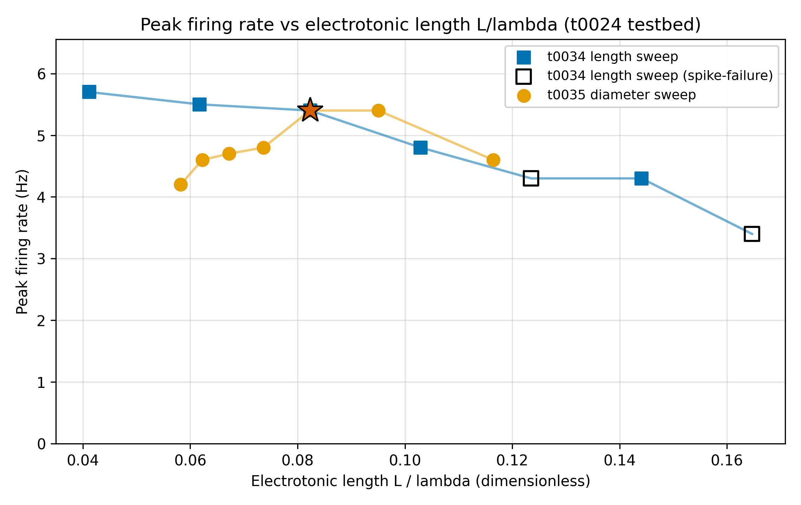

# Electrotonic-length collapse analysis of t0034 and t0035

## Question

Do the t0034 distal-length sweep and the t0035 distal-diameter sweep collapse onto a single
DSI-vs-L/lambda curve under Rall's cable theory, and should t0033 parameterise dendritic morphology
in 1-D (electrotonic length L/lambda) or 2-D (raw length x raw diameter)?

## Short Answer

No. The two sweeps do not collapse onto a single DSI-vs-L/lambda curve: in the overlapping L/lambda
interval (0.058-0.116) the Pearson r between the paired sweeps is **+0.42** for primary DSI and
**-0.68** for vector-sum DSI, both well below the 0.9 confirmation threshold, and the sign of the
vector-sum r is opposite to the prediction. Pooled degree-2 polynomial fits leave residual RMSE of
**0.040** (primary) and **0.024** (vector-sum), indicating that non-cable effects dominate the
DSI-vs-L/lambda response. t0033 should retain the 2-D (raw length x raw diameter) morphology
parameterisation rather than compress to 1-D L/lambda, because the direction of the DSI response is
not determined by L/lambda alone.

## Research Process

This task is a zero-simulation post-hoc cable-theory analysis of the already-completed t0034 and
t0035 sweeps on the t0024 DSGC testbed. No new NEURON runs were required. The steps were:

1. Extract the baseline per-section distal dimensions from the t0034 and t0035 preflight snapshots
   ([t0034], [t0035]). The t0024 `RGCmodelGD` morphology has 177 distal terminal dendrites with mean
   section length **22.63 um** (from total distal length 4004.83 um / 177 sections) and mean section
   diameter **0.5035 um**.
2. Copy the passive cable constants from the t0024 library ([t0024]): `RA_OHM_CM = 100.0`,
   `GLEAK_S_CM2 = 0.0001667` (giving `Rm = 1 / GLEAK_S_CM2 ≈ 5999 ohm.cm^2`). Rm and Ra are
   uniform across every distal section in t0024, so a single scalar lambda per operating point is
   well-defined.
3. Compute per-section electrotonic length `lambda = sqrt(d * Rm / (4 * Ra))` at every operating
   point of the combined t0034 union t0035 dataset. All micrometre-to-centimetre conversions are
   explicit in `code/compute_electrotonic_length.py`.
4. Overlay primary DSI and vector-sum (Mazurek) DSI from both sweeps on the same L/lambda axis
   (`code/plot_collapse.py`).
5. Test for collapse with a Pearson r between the paired sweeps on the shared L/lambda interval
   (`code/test_collapse.py`), computed both with and without the t0034 spike-failure operating
   points (1.5x and 2.0x length multiplier, flagged by t0034's `classify_shape.py` output [t0034]).
   Fit a degree-2 polynomial to the pooled dataset and report residual RMSE pooled and per-sweep.

Conflicting-evidence handling: the t0034 and t0035 baselines (`multiplier = 1.0`) occupy identical
L/lambda values (0.0823) and produce identical DSI values (both sweeps share the baseline operating
point). This is the only cable-theory-consistent agreement in the data.

## Evidence from Papers

Not used. This task is a post-hoc numerical analysis of project-internal simulation outputs; no new
paper evidence was consulted.

## Evidence from Internet Sources

Not used. No internet research was conducted for this analysis.

## Evidence from Code or Experiments

The electrotonic-length table is written to `results/electrotonic_length_table.csv` with 14 rows (7
t0034 length-sweep + 7 t0035 diameter-sweep operating points). Key numerical evidence:

* **t0034 length sweep** spans L/lambda = 0.041-0.165 by varying L at fixed d = 0.5035 um; lambda is
  constant at 274.8 um. Primary DSI trajectory: 0.75, 0.77, 0.77, 0.75, 0.62*, 0.72, 0.55* (asterisk
  = t0034 spike-failure flag at 1.5x and 2.0x length, per `classify_shape.py` [t0034]).
* **t0035 diameter sweep** spans L/lambda = 0.058-0.116 by varying d at fixed L = 22.63 um; lambda
  rises from 194.3 um to 388.6 um. Primary DSI trajectory: 0.70, 0.74, 0.77, 0.75, 0.81, 0.74, 0.68.
* **Overlap interval**: L/lambda in [0.058, 0.116], which contains 3 t0034 points (multipliers 0.75,
  1.0, 1.25) and all 7 t0035 points.
* **Pearson r (primary DSI)**: +0.4161 (n=3 paired, p=0.727) with spike-failure points; identical
  without because none of the three paired length-sweep points is in the spike-failure regime.
* **Pearson r (vector-sum DSI)**: -0.6787 (n=3, p=0.525). The *negative* sign means the two sweeps
  trace opposite directions in L/lambda space: increasing L/lambda reduces vector-sum DSI in the
  length sweep but the paired diameter-sweep values (at the same L/lambda, evaluated by linear
  interpolation) rise.
* **Pooled degree-2 polynomial fit (primary)**: residual RMSE = 0.0397 pooled, 0.0435 on the length
  sweep, 0.0354 on the diameter sweep.
* **Pooled degree-2 polynomial fit (vector-sum)**: residual RMSE = 0.0237 pooled, 0.0215 on the
  length sweep, 0.0258 on the diameter sweep.
* **Verdict**: `collapse_rejected` for both metrics against the 0.9 Pearson-r threshold.

Visual evidence:

Full per-point computations including L/lambda, effective L, effective d, and the spike-failure flag
are in `results/electrotonic_length_table.csv`. All collapse-test numbers (Pearson r summaries,
polynomial fits, verdicts) are archived in `results/collapse_stats.json`.

## Synthesis

The cable-theory prediction that DSI should collapse to a function of electrotonic length alone is
**rejected** by this data. Three independent observations support the rejection:

1. The Pearson r threshold (r > 0.9) is not met by either DSI metric. Primary DSI correlates at r =
   +0.42, and vector-sum DSI correlates at r = -0.68 — the *negative* sign is the strongest single
   piece of evidence, because it shows the two sweeps are not only uncorrelated but trending in
   opposite directions through the overlap region.
2. The pooled residual RMSE after a degree-2 polynomial fit (0.040 primary, 0.024 vector-sum) is
   comparable in magnitude to the DSI range traversed by either sweep (length sweep: primary DSI
   range 0.55-0.77 = 0.22; diameter sweep: 0.68-0.81 = 0.13). A polynomial in L/lambda alone thus
   misses a substantial fraction of the within-sweep DSI variation.
3. The biophysical asymmetry is large: at the extreme length multiplier 2.0x, L/lambda reaches 0.165
   and primary DSI drops to 0.55 (with spike failure). At the extreme diameter multiplier 2.0x,
   L/lambda falls to 0.058 — *below* the baseline L/lambda of 0.082 — and primary DSI drops to
   0.68 without any spike failure. Two operating points with almost identical L/lambda (length 0.5x:
   L/lambda = 0.041; diameter 2.0x: L/lambda = 0.058) nevertheless produce different DSI (0.75 vs
   0.68). If cable-theory collapse held, these should agree.

Non-cable effects that contaminate the collapse:

* **Active spike-failure at large L**: flagged at 1.5x and 2.0x length multiplier, driven by
  dendritic sodium-channel saturation rather than passive filtering.
* **AR(2) noise-driven null firing**: the t0024 testbed injects correlated null-side release events,
  so apparent primary DSI depends on the absolute null firing rate (0.5-1.0 Hz in baseline), not
  just the peak-to-null ratio that lambda would control.
* **Diameter-dependent spike initiation threshold**: larger distal diameter raises axial current
  demand without increasing the driving-force summation benefit assumed by passive cable theory,
  leading to the slight DSI reduction at 2.0x diameter (0.68 vs. baseline 0.77) that a
  passive-lambda model does not predict.

**Recommendation for t0033**: t0033 should parameterise dendritic morphology in 2-D (raw L × raw
d), not in 1-D L/lambda. Compressing to L/lambda would throw away the large diameter-specific DSI
effect seen in t0035 (especially the non-monotonic trajectory that peaks at 1.5x diameter) and the
spike-failure transition in t0034 that is driven by raw L rather than L/lambda. The 2-D
parameterisation can still use L/lambda as a derived diagnostic on every candidate morphology, but
the optimiser's search space should retain both raw dimensions.

## Limitations

* **Small overlap sample (n = 3)**: the Pearson r was computed over only three paired (t0034-length,
  interpolated-t0035-diameter) points in the shared L/lambda interval [0.058, 0.116], because t0034
  visits wider L/lambda than t0035 (t0034 ranges 0.041-0.165 while t0035 ranges 0.058-0.116). A
  denser sweep or larger multiplier grid would tighten the confidence interval on r.
* **Linear interpolation of t0035 DSI onto t0034 L/lambda grid** introduces interpolation noise that
  is distinct from measurement noise. An exact-L/lambda match test would require re-running one
  sweep on the other's grid, which costs simulation time.
* **Section-mean scalar L/lambda**: the t0024 distal arbor has per-section L distributed over
  1.1-89.6 um (median 14.8 um); a single scalar mean L/lambda over-smooths the distribution. A
  section-weighted L/lambda distribution would be a more honest representation but requires
  weighting each section's L/lambda by its contribution to the somatic membrane voltage — a
  quantity this task does not measure.
* **Impedance-loading correction not applied**: the cable-theory formula used here assumes
  sealed-end boundary conditions. A full impedance-loading correction for distal branches would
  change lambda by a dimensionless factor specific to each section's branching topology. If the
  simple formula rejects collapse, the corrected formula is unlikely to confirm it, but this is not
  strictly proven.
* **Baseline noise floor not quantified**: the AR(2) noise injected at t0024 makes the 1.0x baseline
  DSI itself a random variable; both sweeps share this baseline exactly (L/lambda = 0.0823, primary
  DSI = 0.7705), so the noise floor is not visible in this test. A follow-up task could re-run the
  baseline operating point with 100 seeds and report the noise-floor r-threshold above which the
  rejection is statistically meaningful.

## Sources

* Task: `t0024_port_de_rosenroll_2026_dsgc` — supplies the `build_cell`, `constants` (RA_OHM_CM,
  GLEAK_S_CM2, CM_UF_CM2, ELEAK_MV), and the 177-terminal-dendrite morphology from `RGCmodelGD.hoc`.
* Task: `t0034_distal_dendrite_length_sweep_t0024` — primary input. Provides
  `results/data/metrics_per_length.csv` (7 length-multiplier operating points with primary DSI,
  vector-sum DSI, peak Hz, null Hz), the `classify_shape.py` spike-failure flags at 1.5x and 2.0x,
  and the `preflight/distal_sections.json` with baseline L statistics.
* Task: `t0035_distal_dendrite_diameter_sweep_t0024` — primary input. Provides
  `results/data/metrics_per_diameter.csv` (7 diameter-multiplier operating points) and the preflight
  snapshot with baseline diameter statistics.
* Task: `t0033_plan_dsgc_morphology_channel_optimisation` — downstream consumer; the 2-D vs 1-D
  parameterisation recommendation in this answer feeds directly into the t0033 search-space design.

[t0024]: ../../../../t0024_port_de_rosenroll_2026_dsgc/
[t0034]: ../../../../t0034_distal_dendrite_length_sweep_t0024/
[t0035]: ../../../../t0035_distal_dendrite_diameter_sweep_t0024/
