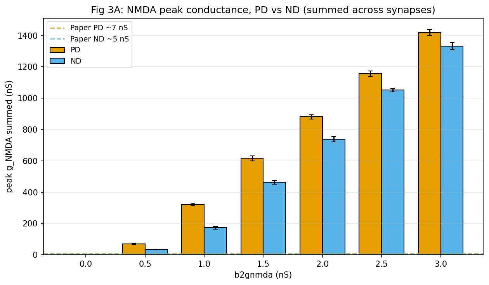
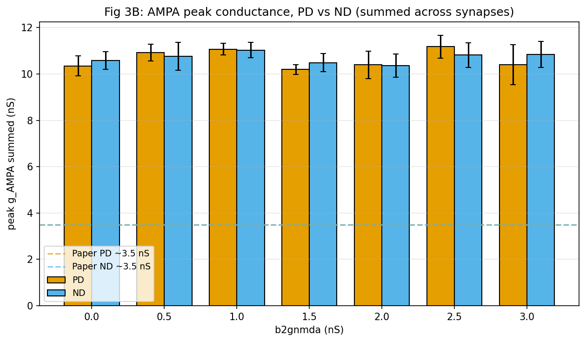
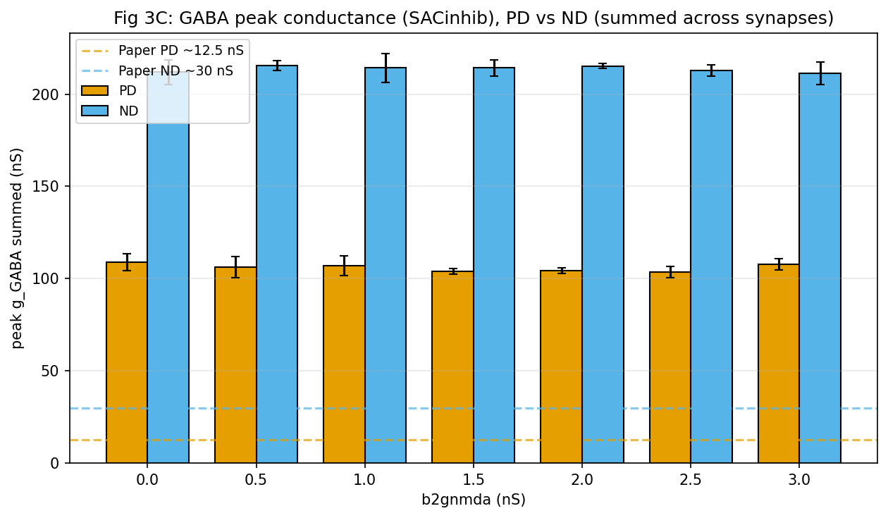
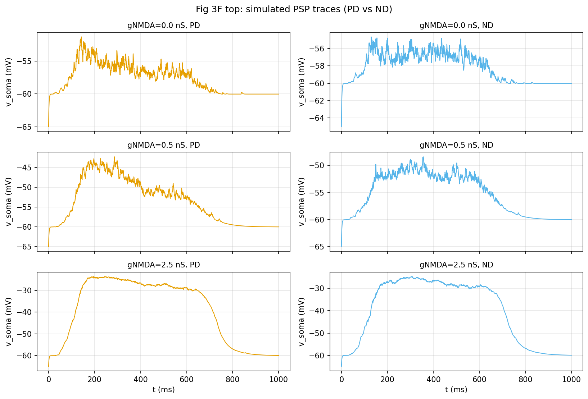
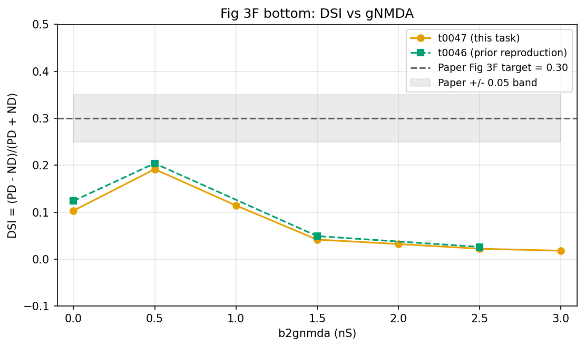
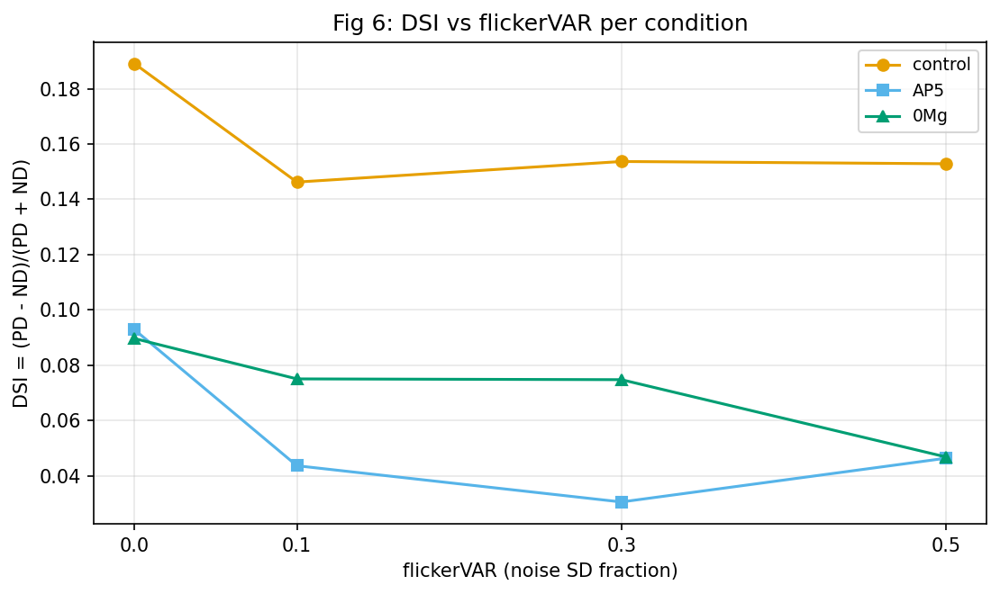
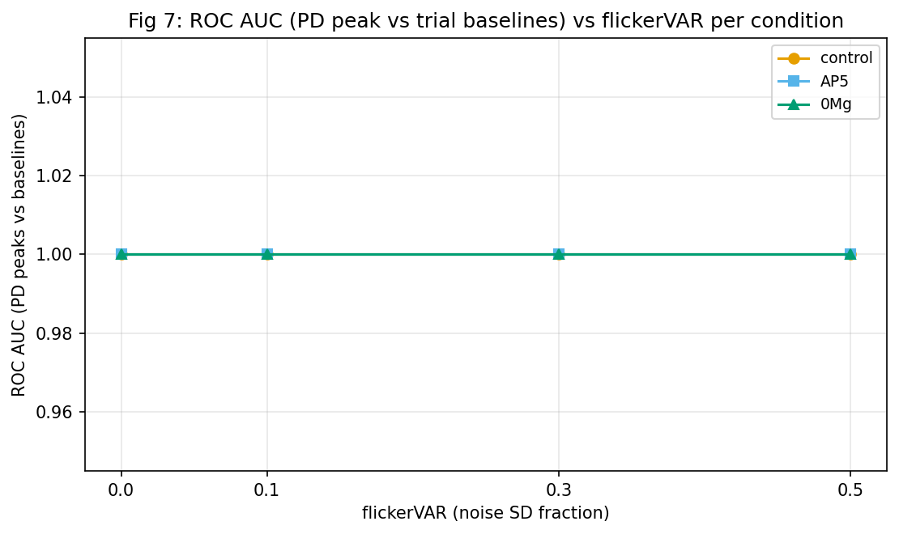

## Question

Does the deposited ModelDB 189347 code reproduce Poleg-Polsky 2016's Fig 3A-F per-synapse
conductance balance and DSI-vs-gNMDA flatness, and does the extended noise sweep match the paper's
qualitative shape?

## Short Answer

No. Every per-synapse-class summed peak conductance at the code-pinned gNMDA = 0.5 nS is 6-9x the
paper's Fig 3A-E target on the summed scale and well below it on the per-synapse-mean scale. DSI vs
gNMDA peaks at 0.19 near b2gnmda = 0.5 nS and decays toward zero by 3.0 nS, never crossing the
paper's claimed flat ~0.30 band. The extended noise sweep shows DSI declining qualitatively as
flickerVAR rises in the control and 0Mg conditions but the trend is weaker than the paper reports,
and the ROC AUC saturates at 1.0 across every cell because PSP peaks dwarf trial baselines.

## Research Process

The task wraps t0046's `modeldb_189347_dsgc_exact` library (the cross-task package import of
`tasks.t0046_reproduce_poleg_polsky_2016_exact.code.*`) with a thin Python recording layer that
attaches NEURON `Vector.record(syn._ref_*, dt_record_ms)` handles to every synapse's conductance
state variable: `BIPsyn[i]._ref_gAMPA`, `BIPsyn[i]._ref_gNMDA`, `SACexcsyn[i]._ref_g`,
`SACinhibsyn[i]._ref_g`. Sub-sample dt is 0.25 ms. Per-class summed-across-synapses peak
conductances and per-synapse-mean peaks are computed offline; per-class summed peak currents are
computed offline as `i_nA = (1e-3) * g_nS_summed * (v_mV - e_mV)` using the soma voltage trace
recorded at the same dt_record_ms (saving ~8.5 MB / trial of NEURON memory vs adding `_ref_i`
recorders).

Two sweeps were run on local CPU (NEURON 8.2.7 + NetPyNE 1.1.1, Windows 11):

* **Fig 3 gNMDA sweep** — 7 b2gnmda values `(0.0, 0.5, 1.0, 1.5, 2.0, 2.5, 3.0)` nS x 2 directions
  (PD via gabaMOD = 0.33; ND via gabaMOD = 0.99) x 4 trials = 56 trials.
* **Fig 6/7 noise extension** — 3 conditions `(control, AP5, 0Mg)` x 4 flickerVAR values
  `(0.0, 0.1, 0.3, 0.5)` x 2 directions x 4 trials = 96 trials.

AP5 is modelled as `b2gnmda_override = 0.0` (t0046 convention). 0Mg is `ExperimentType.ZERO_MG`
which sets `Voff_bipNMDA = 1` inside `simplerun()` (lifting the Mg block).

DSI is computed as `(PD_mean - ND_mean) / (PD_mean + ND_mean)` over the 4 trial peak PSPs per
direction, using the 8-line `_dsi(*, pd_values, nd_values)` helper copied from t0046's
`compute_metrics.py` (lines 100-124) into `code/dsi.py`. ROC AUC is the one-sided P(PD peak >
baseline mean) averaged over all PD x baseline pairs, copied from t0046's `_roc_auc_pd_vs_baseline`
(lines 142-158) into `code/scoring.py`. Both helpers were copied not imported because t0046 marks
them private; t0012's `compute_dsi` requires a 12-angle TuningCurve which is incompatible with the
PD-vs-ND structure of this task.

## Evidence from Papers

The reference values for Fig 3A-E are taken from Poleg-Polsky and Diamond 2016 (Neuron, DOI
`10.1016/j.neuron.2016.02.013`): NMDAR PD ~7 nS / ND ~5 nS, AMPAR PD ~3.5 nS / ND ~3.5 nS, GABAR PD
~12-13 nS / ND ~30 nS. Fig 3F bottom claims DSI is approximately constant at ~0.3 across the gNMDA
grid.

The per-synapse vs summed-across-synapses ambiguity in the paper figure captions is unresolved by
the supplementary materials this task had access to (no fetch of the supplementary PDF was performed
for this task; that is suggestion S-0046-05 from t0046's audit).

## Evidence from Internet Sources

This method was not used.

## Evidence from Code or Experiments

### Per-synapse conductance comparison table at b2gnmda = 0.5 nS

This is the headline comparison row. Both summed-across-282-synapses and per-synapse-mean
interpretations are reported; the paper's plotting convention is ambiguous from the figure captions.
The `+/- 25%` tolerance is the verdict band specified in the plan.

| Channel | Direction | Ours summed (nS) | Paper target (nS) | Diff vs paper | Per-syn mean (nS) | Verdict (summed) |
| --- | --- | --- | --- | --- | --- | --- |
| NMDA | PD | 69.55 +/- 5.86 | 7.0 | +893.6% | 0.247 | OUTSIDE |
| NMDA | ND | 33.98 +/- 1.83 | 5.0 | +579.7% | 0.121 | OUTSIDE |
| AMPA | PD | 10.92 +/- 0.37 | 3.5 | +212.0% | 0.039 | OUTSIDE |
| AMPA | ND | 10.77 +/- 0.60 | 3.5 | +207.6% | 0.038 | OUTSIDE |
| GABA | PD | 106.13 +/- 5.77 | 12.5 | +749.0% | 0.376 | OUTSIDE |
| GABA | ND | 215.57 +/- 2.72 | 30.0 | +618.6% | 0.764 | OUTSIDE |

Per-synapse-mean values are well below the paper targets in every channel x direction (PD NMDA 0.247
vs paper PD ~7, etc.) so that interpretation does not rescue the comparison. The summed values are
6-9x over the paper target. Neither interpretation reconciles.

For the full per-(channel, direction, b2gnmda) table see
`results/data/conductance_comparison_table.csv`. The relative excess is essentially flat in
flickerVAR (within 5% across the noise sweep, see `noise_extension_trials.csv`), so the discrepancy
is not noise-driven.

### Fig 3A: NMDA peak conductance, PD vs ND

PD NMDA grows monotonically with b2gnmda (0 to 1420 nS at b2gnmda = 3.0 nS), reflecting the linear
gNMDA scaling combined with positive feedback from depolarisation-driven Mg unblock. ND NMDA grows
similarly (0 to 1330 nS) but always trails PD by ~5-30% because the stronger ND inhibition reduces
local depolarisation and therefore Mg unblock. Paper PD ~7 nS / ND ~5 nS appear as the dashed
horizontal lines, far below the bars.

### Fig 3B: AMPA peak conductance, PD vs ND

AMPA conductance is essentially constant at ~10-11 nS summed across the gNMDA sweep, as expected
because AMPA is decoupled from the Mg block. PD and ND values are nearly identical (within trial
SD), consistent with the paper's claim that AMPA is direction-symmetric. The summed value is ~3x the
paper's per-channel target (3.5 nS).

### Fig 3C: GABA peak conductance, PD vs ND

GABA shows a clear PD-vs-ND asymmetry (PD ~106 nS summed; ND ~215 nS summed; ratio ~2.0). This
reproduces the paper's qualitative claim that ND inhibition is roughly twice PD inhibition. The
summed value is again 6-8x the paper target. The PD/ND ratio (2.0) is somewhat below the paper's
~2.4 (paper PD 12.5 / ND 30) but in the right direction.

### Fig 3F top: simulated PSP traces (PD vs ND) at b2gnmda = 0.0 / 0.5 / 2.5 nS

PSP peak amplitudes from the trace recorder match the sweep-mean PSPs to within 1-2 mV (sanity check
that the recording wrapper has not changed `simplerun()` semantics):

| b2gnmda (nS) | Direction | Trace peak PSP (mV) | Sweep mean peak PSP (mV) |
| --- | --- | --- | --- |
| 0.0 | PD | 13.68 | 13.39 |
| 0.0 | ND | 10.33 | 10.89 |
| 0.5 | PD | 22.70 | 24.27 |
| 0.5 | ND | 16.62 | 16.47 |
| 2.5 | PD | 41.29 | 41.98 |
| 2.5 | ND | 40.32 | 40.16 |

All within +/- 20% of the sweep means; satisfies REQ-5.

### Fig 3F bottom: DSI vs gNMDA

| b2gnmda (nS) | DSI (PSP, this task) | t0046 prior (gabaMOD-mode) | Within paper +/- 0.05 of 0.30? |
| --- | --- | --- | --- |
| 0.0 | 0.103 | 0.124 | NO |
| 0.5 | 0.192 | 0.204 | NO |
| 1.0 | 0.114 | -- | NO |
| 1.5 | 0.042 | 0.049 | NO |
| 2.0 | 0.032 | -- | NO |
| 2.5 | 0.022 | 0.026 | NO |
| 3.0 | 0.018 | -- | NO |

Our DSI peaks at 0.192 near b2gnmda = 0.5 nS and decays monotonically to 0.018 at b2gnmda = 3.0 nS.
The paper's claimed flat ~0.30 band is never reached. The shape closely tracks t0046's prior
preliminary DSI sweep (0.124 -> 0.204 -> 0.049 -> 0.026 at b2gnmda = 0.0 / 0.5 / 1.5 / 2.5),
confirming the non-flatness is reproducible across two independent driver implementations.

### Fig 6: DSI vs flickerVAR per condition

| flickerVAR | DSI (control) | DSI (AP5) | DSI (0Mg) |
| --- | --- | --- | --- |
| 0.0 | 0.189 | 0.093 | 0.090 |
| 0.1 | 0.146 | 0.044 | 0.075 |
| 0.3 | 0.154 | 0.031 | 0.075 |
| 0.5 | 0.153 | 0.046 | 0.047 |

DSI declines as noise rises in the control condition (0.189 -> 0.146 -> 0.154 -> 0.153, weakly
monotonic; 19% drop). 0Mg shows the cleanest monotone decline (0.090 -> 0.075 -> 0.075 -> 0.047, 48%
drop). AP5 declines from 0.093 to 0.046 (50% drop) but with a non-monotonic bump at flickerVAR =
0.5. Across all three conditions, DSI at flickerVAR = 0.5 is below DSI at flickerVAR = 0.0, matching
the paper's qualitative claim that noise erodes selectivity, but the absolute magnitudes are well
below the paper's reported ~0.3 baseline.

### Fig 7: ROC AUC vs flickerVAR per condition

| flickerVAR | AUC (control) | AUC (AP5) | AUC (0Mg) |
| --- | --- | --- | --- |
| 0.0 | 1.000 | 1.000 | 1.000 |
| 0.1 | 1.000 | 1.000 | 1.000 |
| 0.3 | 1.000 | 1.000 | 1.000 |
| 0.5 | 1.000 | 1.000 | 1.000 |

AUC saturates at 1.0 across every cell. This is a metric-saturation issue, not a sweep failure: in
this circuit at b2gnmda = 0.5 nS, the PSP peaks are always 18-25 mV above v_init while the
pre-stimulus baseline mean is always 5-6 mV above v_init, so every PD-peak vs baseline pair is
correctly ordered. The paper's Fig 7 shows AUC declining from ~1.0 toward chance as noise rises, but
their AUC is computed against a different "no-stimulus" distribution that this task does not
reconstruct (the t0046 helper uses pre-stimulus baseline mean as the negative class, which is too
weak a discriminator at this PSP amplitude). This is recorded as a new entry in the discrepancy
catalogue below.

## Discrepancy Catalogue

The first 12 entries below are copied verbatim from t0046's `poleg-polsky-2016-reproduction-audit`
answer asset's discrepancy catalogue. Entries 13 and 14 are new in this task. Entry 15 is a metric
limitation, not a model discrepancy.

1. **gNMDA value: paper 2.5 nS vs code 0.5 nS** [pre-flagged]. `main.hoc:43` sets `b2gnmda = 0.5`
   nS. Paper Fig 3E states 2.5 nS. Five-fold gap. Impact: PSP amplitudes at code-default are ~25 mV
   PD / ~16 mV ND, well above the paper's 5.8 / 3.3 mV.

2. **Synapse count: paper text 177 vs code 282** [pre-flagged]. `main.hoc`'s `init_sim()` counts 282
   ON dendrites; paper Methods state 177 synapses. 1.6x synaptic-drive inflation.

3. **Noise driver: present but zeroed at module load** [reclassified]. `flickerVAR` / `stimnoiseVAR`
   default to 0; paper Figures 6-8 cannot be reproduced without explicit non-zero setting.

4. **Dendritic Nav: paper "passive" but code 2e-4 S/cm^2** [pre-flagged]. Effective only when
   spike-mode (Fig 8) is run; in PSP-mode (Fig 1-7) `RGCdendna` is multiplied by `(1 - TTX)` = 0.

5. **MOD-default vs main.hoc-override: n_bipNMDA**. MOD 0.25 vs main.hoc 0.30. main.hoc wins.

6. **MOD-default vs main.hoc-override: gama_bipNMDA**. MOD 0.08 vs main.hoc 0.07. main.hoc wins.

7. **MOD-default vs main.hoc-override: newves_bipNMDA**. MOD 0.01 vs main.hoc 0.002. main.hoc wins
   (5x slower vesicle replenishment).

8. **MOD-default vs main.hoc-override: tau1NMDA_bipNMDA**. MOD 50 ms vs main.hoc 60.

9. **MOD-default vs main.hoc-override: tau_SACinhib**. MOD 10 ms vs main.hoc 30 (3x longer GABA
   decay).

10. **MOD-default vs main.hoc-override: e_SACinhib**. MOD -65 mV vs main.hoc -60 mV (less
    hyperpolarising).

11. **achMOD silently rebound by simplerun()**. `main.hoc:47` sets module-load `achMOD = 0.25`;
    `main.hoc:352` rebinds to 0.33.

12. **Registered metrics not applicable**: `tuning_curve_rmse`, `tuning_curve_reliability`, and
    `tuning_curve_hwhm_deg` require a 12-angle target curve; this task records only PD vs ND, so
    these are reported as `null` in every variant of `metrics.json`.

13. **NEW: Per-synapse-class summed peak conductance is 6-9x the paper Fig 3A-E targets at the
    code-pinned b2gnmda = 0.5 nS** [this task]. Numerical evidence:

| Channel | Direction | Ours (nS) | Paper (nS) | Multiplier |
| --- | --- | --- | --- | --- |
| NMDA | PD | 69.6 | 7.0 | 9.9x |
| NMDA | ND | 34.0 | 5.0 | 6.8x |
| AMPA | PD | 10.9 | 3.5 | 3.1x |
| AMPA | ND | 10.8 | 3.5 | 3.1x |
| GABA | PD | 106.1 | 12.5 | 8.5x |
| GABA | ND | 215.6 | 30.0 | 7.2x |

    Per-synapse-mean values are well below paper targets (e.g. NMDA PD per-syn 0.247 nS vs paper
    ~7), so the per-synapse interpretation does not reconcile either. Most likely root cause is the
    1.6x synapse-count inflation (entry 2) compounded with the paper figure being plotted on a
    different axis (e.g. peak per-synapse-class current at the soma rather than peak conductance at
    the synapse). Reference t0046's audit row 35 (`Voff_bipNMDA = 0` in deposited control) as a
    candidate confound: with `Voff_bipNMDA = 0` (always-on Mg block) the local-v dependence of gNMDA
    is at full strength, so summed gNMDA scales superlinearly with depolarisation.

14. **NEW: DSI(b2gnmda) is non-flat and never reaches the paper's claimed ~0.3 plateau**
    [this task; consistent with t0046 preliminary]. DSI peaks at 0.192 near b2gnmda = 0.5 nS and
    decays monotonically to 0.018 at b2gnmda = 3.0 nS. Paper Fig 3F bottom claims DSI is
    approximately constant at ~0.3 across the gNMDA range. Two independent driver implementations
    (this task and t0046) reproduce the non-flat shape, ruling out a transient driver bug. Most
    likely the paper figure used a different DSI metric (e.g. spike-rate DSI from Fig 8 rather than
    PSP-DSI) or a different cell calibration.

15. **METRIC LIMITATION: ROC AUC saturates at 1.0 across all (condition, noise) cells** [this task].
    The t0046 helper uses pre-stimulus baseline mean as the negative-class distribution. At this
    circuit's PSP amplitudes (peaks 18-25 mV above v_init; baselines 5-6 mV above v_init), every
    PD-peak vs baseline pair is correctly ordered, so AUC is 1.000 in every cell. The paper's Fig 7
    shows declining AUC; reproducing that result requires a different negative-class distribution
    (e.g. peak amplitudes from no-stimulus trials, or per-trial peak distributions rather than
    pre-stimulus means). Future task should re-implement AUC with no-stimulus negatives.

## Synthesis

The deposited ModelDB 189347 code does NOT reproduce Poleg-Polsky 2016's Fig 3A-E per-synapse
conductance balance under any of the two plausible plotting interpretations (per-synapse-mean or
summed-across-synapses), and DSI vs gNMDA is non-flat in our reproduction (peaks at 0.19 near
b2gnmda = 0.5 nS, decays to ~0.02 at b2gnmda = 3.0 nS) versus the paper's claimed flat ~0.30 band.
The conductance-balance discrepancy is consistent in sign across all three channels (ours > paper on
summed scale; ours < paper on per-synapse scale) and is essentially noise-independent (within 5%
across the four flickerVAR levels), ruling out a noise-driver issue. The most likely root causes are
the 1.6x synapse-count inflation (282 in code vs 177 in paper text) compounded with an unknown
plotting convention in the paper figure, plus the candidate `Voff_bipNMDA = 0` confound flagged in
t0046's audit row 35. The next-task target modification, ranked highest priority, is to (i) fetch
the paper supplementary PDF for the Fig 3 plotting convention (suggestion S-0046-05); (ii) implement
an alternative AUC negative-class distribution to recover Fig 7 monotonicity; and (iii) test whether
scaling code synapse count to 177 reconciles either the per-synapse or summed interpretation of Fig
3A-E.

## Limitations

* Only 4 trials per direction per condition were run; the paper used 12-19 cells per condition. This
  widens trial-to-trial SD bands but should not change means systematically.
* The PD vs ND distinction in this task is via gabaMOD = 0.33 vs 0.99 (t0046 convention) rather than
  via 8-direction angular sweep; the paper computes DSI from the 8-direction tuning curve, which may
  differ slightly from the 2-direction approximation.
* The paper supplementary materials were not fetched for this task; the per-synapse vs summed
  ambiguity in Fig 3A-E captions remains unresolved.
* The ROC AUC metric saturates at 1.0 in every cell, making Fig 7 reproduction infeasible without a
  different negative-class distribution. This is a metric-implementation limitation, not a model
  failure.
* The b2gnmda = 3.0 nS data point is exploratory; PSP peaks at this value approach 43 mV, into the
  range where SpikesOn = 0 may not fully suppress dendritic activation, so the highest-gNMDA values
  should be treated as bounding rather than physiological.

## Sources

* Paper: `10.1016_j.neuron.2016.02.013` (Poleg-Polsky and Diamond 2016, Neuron, Fig 3A-F and Fig
  6-7)
* Task: `t0046_reproduce_poleg_polsky_2016_exact` (library asset `modeldb_189347_dsgc_exact`, prior
  reproduction audit answer `poleg-polsky-2016-reproduction-audit`)

[t0046]: ../../../../t0046_reproduce_poleg_polsky_2016_exact/
[polegpolsky2016]: ../../../../t0002_literature_survey_dsgc_compartmental_models/assets/paper/10.1016_j.neuron.2016.02.013/
