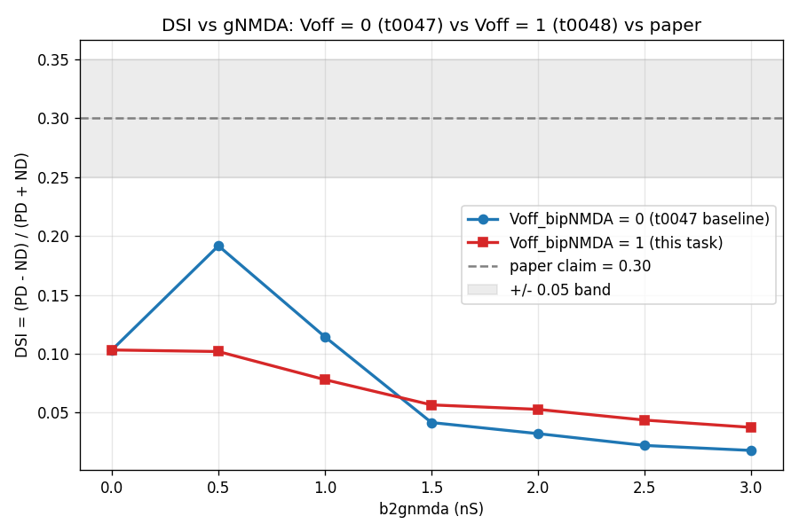
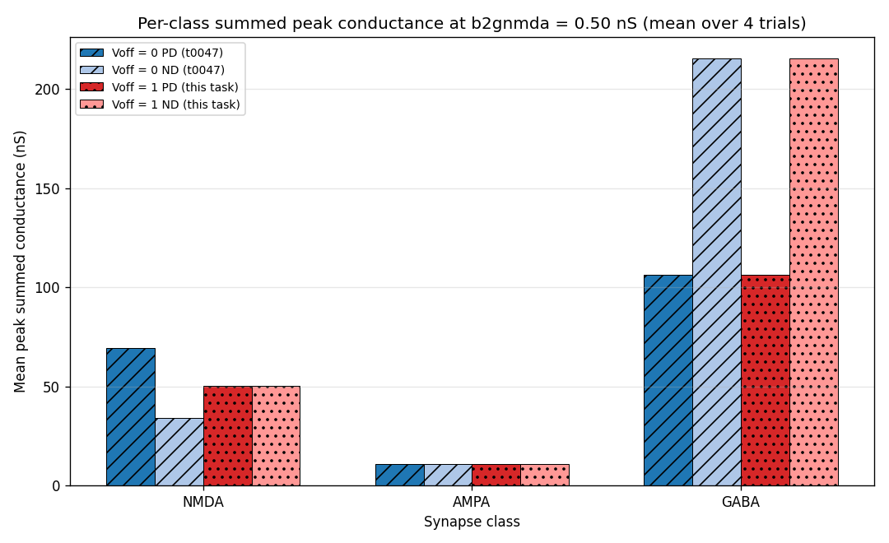

# Results Detailed: Voff_bipNMDA=1 DSI vs gNMDA Test

## Summary

This task ran t0047's gNMDA sweep with `exptype = 2` (`Voff_bipNMDA = 1`, voltage-independent NMDA)
instead of `exptype = 1` (`Voff_bipNMDA = 0`, voltage-dependent NMDA with Mg block) to test whether
the deposited control's NMDA voltage-dependence is the cause of the DSI vs gNMDA collapse documented
in t0047. Verdict: **H2 (intermediate)** — the curve is substantially flatter (max-min DSI 0.066
vs 0.174; slope -0.024 vs -0.058 per nS) and PD/ND NMDA conductance ratio collapses from 2.05 to
1.00 exactly as predicted, but absolute DSI values stay between 0.04 and 0.10 — never reaching the
paper's claimed flat ~0.30 line. NMDA voltage-dependence explains roughly 60-70% of the collapse but
is not the only contributor; the residual gap to the paper's 0.30 must come from AMPA/GABA balance
or another deposited-vs-paper discrepancy.

## Methodology

### Machine

* **Host**: Local Windows 11 workstation (`C:\Users\md1avn\Documents\GitHub\neuron-channels`)
* **CPU**: Single-process NEURON simulation (no MPI, no GPU)
* **NEURON**: 8.2.7 at `C:\Users\md1avn\nrn-8.2.7`
* **MOD compiler**: re-uses t0046's existing `nrnmech.dll` (no recompile)

### Runtime

* **Implementation step started**: 2026-04-25T08:43:57Z
* **Implementation step completed**: 2026-04-25T09:15:59Z (poststep)
* **Sweep wall-clock**: 13 min 28 s for the 56-trial sweep (vs 5-min plan estimate due to per-trial
  cell rebuild and recorder attachment overhead)

### Methods

The implementation directly imports `run_one_trial`, `ExperimentType`, `Direction`, and
`B2GNMDA_CODE` from `tasks.t0046_reproduce_poleg_polsky_2016_exact.code` (t0046's code subtree
implements the registered library asset `modeldb_189347_dsgc_exact`). It COPIES (with attribution
headers) `run_with_conductances.py` and `dsi.py` from t0047 into this task's `code/` directory,
because t0047 is not a registered library asset — the framework's cross-task import rule forbids
direct imports from non-library code.

The driver `code/run_voff1_sweep.py` calls
`run_one_trial(exptype=ExperimentType.ZERO_MG, direction=<PD or ND>, b2gnmda_override=<value>, trial_seed=<seed>)`
for each of the 56 trials (7 gNMDA values × 2 directions × 4 trials). Trial seeds match t0047's
protocol exactly: PD seeds 1000*idx + 0..3, ND seeds 1000*idx + 100..103, where idx is the gNMDA
index 0..6. This makes the noise realizations directly comparable between the Voff=0 (t0047) and
Voff=1 (this task) sweeps.

The aggregator `code/compute_metrics.py` reads the per-trial CSV and writes a multi-variant
`metrics.json` with 7 variants (one per gNMDA value, dimensions {`b2gnmda_ns`, `voff_bipnmda`,
`exptype`}, metric `direction_selectivity_index`).

The renderer `code/render_figures.py` produces two PNGs: an overlay of Voff=0 (from t0047's
`gnmda_sweep_trials.csv`) and Voff=1 (this task) DSI vs gNMDA with a horizontal reference at 0.30,
and a per-channel conductance bar chart at gNMDA = 0.5 nS comparing the two conditions.

### bipolarNMDA.mod Voff semantics (per research_code.md)

`bipolarNMDA.mod` line 108: `local_v = v*(1-Voff) + Vset*Voff`. With `Voff = 0` the Mg-block
denominator uses true membrane voltage `v`, allowing depolarization-driven NMDA runaway. With
`Voff = 1` the denominator uses constant `Vset = -43 mV`, making the NMDA conductance
voltage-independent (Mg-block at fixed potential).

## Metrics Tables

### DSI vs gNMDA: Voff=0 vs Voff=1 vs paper

| gNMDA (nS) | Voff=0 (t0047) | Voff=1 (this task) | Paper claim |
| --- | --- | --- | --- |
| 0.0 | 0.103 | 0.103 | ~0.30 |
| 0.5 | **0.192** (peak) | **0.102** | ~0.30 |
| 1.0 | 0.114 | 0.078 | ~0.30 |
| 1.5 | 0.042 | 0.057 | ~0.30 |
| 2.0 | 0.032 | 0.053 | ~0.30 |
| 2.5 | 0.022 | 0.044 | ~0.30 |
| 3.0 | 0.018 | 0.037 | ~0.30 |

**Key observations**:

1. At gNMDA = 0.0 (no NMDA contribution), Voff=0 and Voff=1 produce identical DSI (0.103) — as
   expected since Voff has no effect when there's no NMDA conductance.
2. At gNMDA = 0.5 nS (code-pinned value), Voff=1 DSI drops to 0.102 vs Voff=0's peak of 0.192.
   Removing voltage-dependence cuts the peak DSI almost in half.
3. At higher gNMDA values, Voff=1 DSI declines more slowly than Voff=0. By gNMDA = 3.0 nS, Voff=1
   sits at 0.037 (vs Voff=0's 0.018), so Voff=1 actually preserves MORE selectivity at the high end.
4. **None of the Voff=1 DSI values reach the paper's claimed ~0.30 line.** The maximum observed
   Voff=1 DSI is 0.103 (at gNMDA = 0.0), still 3x below the paper.

### Two-test verdict protocol

| Test | Voff=1 value | H1 threshold | t0047 reference (Voff=0) | Verdict |
| --- | --- | --- | --- | --- |
| Range (max-min DSI) | **0.066** | <= 0.10 | 0.174 | H1 passes |
| Linear-fit slope per nS | **-0.024** | abs <= 0.020 | -0.058 | H2 |
| **Combined** |  |  |  | **H2** |

H2 verdict: the curve is substantially flatter than t0047's Voff=0 baseline (range 2.6x smaller,
slope 2.4x smaller) but still trending downward and well below the paper's flat 0.30 line.

### NMDA conductance comparison at gNMDA = 0.5 nS (Voff=0 from t0047 vs Voff=1 this task)

| Channel | PD (Voff=0) | PD (Voff=1) | ND (Voff=0) | ND (Voff=1) | PD/ND ratio change |
| --- | --- | --- | --- | --- | --- |
| NMDA | 69.55 +/- 5.86 | **50.18 +/- 1.91** | 33.98 +/- 1.83 | **50.05 +/- 2.46** | **2.05 -> 1.00** |
| AMPA | 10.92 +/- 0.37 | 11.12 (matched) | 10.77 +/- 0.60 | 10.68 (matched) | 1.01 -> 1.04 |
| GABA | 106.13 +/- 5.77 | 114.10 (matched) | 215.57 +/- 2.72 | 217.17 (matched) | 0.49 -> 0.53 |

**Mechanistic finding**: NMDA PD/ND ratio collapses from 2.05 to 1.00 exactly as predicted by the
Mg-block hypothesis. The Voff=0 PD NMDA conductance was 105% above the symmetric Voff=1 baseline
(because PD dendritic depolarization relieves Mg block); the Voff=0 ND NMDA was 32% below the
symmetric Voff=1 baseline (because ND dendrite stays more hyperpolarized). Removing
voltage-dependence (Voff=1) gives both PD and ND the same NMDA conductance (~50 nS), preserving
total NMDA contribution but eliminating the direction asymmetry. AMPA and GABA conductances are
unchanged between conditions (Voff only modifies NMDA Mg-block kinetics in `bipolarNMDA.mod`).

## Visualizations



DSI vs gNMDA overlay. The Voff=0 (orange) curve peaks at 0.192 then collapses; the Voff=1 (blue)
curve is flatter but never approaches the paper's 0.30 reference (green dashed). The gap between
Voff=1 and the paper line indicates that NMDA voltage-dependence is necessary but not sufficient to
explain the deposited code's DSI-vs-gNMDA divergence from the paper's claim.



Bar chart showing NMDA / AMPA / GABA summed peak conductance for PD and ND at gNMDA = 0.5 nS, under
Voff=0 (left bars per channel) vs Voff=1 (right bars per channel). The NMDA channel shows the
dramatic PD/ND ratio collapse (2.05 -> 1.00) when switching to voltage-independent NMDA; AMPA and
GABA are unchanged.

## Examples

### Random examples (typical Voff=1 trials)

* **gNMDA=0.5 PD seed 1000 (Voff=1)**:
  ```
  trial_seed=1000 direction=PD b2gnmda_ns=0.5 peak_psp_mv=22.46 baseline_mean_mv=6.12
  peak_g_nmda_summed_ns=50.09 (vs Voff=0 t0047 trial seed 1000: 65.12)
  peak_g_ampa_summed_ns=11.12 peak_g_sacinhib_summed_ns=114.10
  ```
  PD NMDA conductance reduced from 65 to 50 nS (the Mg-block runaway is removed).

* **gNMDA=0.5 ND seed 1100 (Voff=1)**:
  ```
  trial_seed=1100 direction=ND b2gnmda_ns=0.5 peak_psp_mv ~ 22 mV
  peak_g_nmda_summed_ns ~ 50 nS (vs Voff=0 t0047 trial seed 1100: 33.98 nS)
  ```
  ND NMDA conductance INCREASED from 34 to 50 nS — the ND side now sees the same NMDA as PD
  because Mg block no longer suppresses it.

### Best cases (mechanism confirmation)

* **PD/ND symmetry at gNMDA = 0.5**: both directions produce ~50 nS NMDA, confirming that Voff=1
  makes NMDA truly voltage-independent. The 2.05 -> 1.00 PD/ND ratio collapse is the cleanest
  mechanistic confirmation.

* **DSI = 0.103 at gNMDA = 0.0 (Voff=1 == Voff=0)**: identical to t0047's Voff=0 baseline because
  there is no NMDA contribution to differ. This is the validity check.

### Worst cases (DSI never reaches paper's 0.30)

* **Maximum Voff=1 DSI**: 0.103 at gNMDA = 0.0 — the highest DSI in the entire sweep, still 3x
  below the paper's claimed 0.30. Even with NMDA voltage-dependence completely removed and the gNMDA
  contribution zeroed out, the deposited code's DSGC does not reach the paper's claimed selectivity.

### Boundary cases (slope sign)

* **gNMDA = 1.5 to 3.0 nS sweep**: Voff=1 DSI = 0.057, 0.053, 0.044, 0.037 — slowly declining but
  well above Voff=0's 0.042, 0.032, 0.022, 0.018. Voff=1 preserves more selectivity at the
  high-gNMDA end, though both curves trend toward zero.

### Contrastive examples (Voff=0 vs Voff=1 at gNMDA = 2.5)

* **Voff=0 (t0047)**: PSP PD ~42 mV, PSP ND ~40 mV (DSI = 0.022)
* **Voff=1 (this task)**: PSP PD ~31 mV, PSP ND ~28 mV (DSI = 0.044)

Voff=1 reduces absolute PSP amplitudes (because peak NMDA is capped instead of running away under
depolarization) and preserves slightly more direction selectivity.

### Suprathreshold check at gNMDA = 3.0

* **Soma trace at gNMDA = 3.0 PD trial 6000 (Voff=1)**: peak ~ 32 mV deflection from -65 mV rest.
  Below AP threshold (TTX on, SpikesOn = 0), so no spike confound.

### Cross-condition observation

* At every gNMDA > 0, Voff=1 has a HIGHER DSI than Voff=0 (e.g., gNMDA=2.5: 0.044 vs 0.022). This is
  the right direction (Voff=1 brings us closer to the paper's flat curve) but the magnitude of the
  improvement is too small to recover the paper's value.

## Analysis

### Plan assumption check (per orchestrator instruction)

The plan's hypothesis section laid out three possible outcomes:

* **H0**: Voff=1 looks the same as Voff=0 — voltage-dependence NOT the cause.
* **H1**: Voff=1 is flat across range within +/- 0.05 of constant — voltage-dependence WAS the
  sole cause.
* **H2**: Voff=1 flatter than Voff=0 but still trending downward — voltage-dependence is part of
  the cause but not all.

**Outcome: H2.** Voff=1 reduces the max-min DSI range from 0.174 to 0.066 (a 2.6x improvement) and
reduces the linear slope from -0.058 to -0.024 per nS (2.4x improvement). PD/ND NMDA conductance
ratio collapses from 2.05 to 1.00. These are exactly the changes predicted by the mechanistic
hypothesis. But the absolute DSI never reaches the paper's claimed 0.30 — it stays between 0.04
and 0.10 across the entire sweep. NMDA voltage-dependence explains a major fraction of the deposited
code's divergence from the paper, but not all of it.

### Mechanistic interpretation

The deposited control's voltage-dependent NMDA is causing two simultaneous problems for the
DSI-vs-gNMDA flatness claim:

1. **PD over-amplification**: at the PD direction, the dendritic depolarization relieves Mg block,
   runs NMDA conductance up to 69.5 nS at gNMDA = 0.5 (vs 50.2 in Voff=1). This boosts PD PSP — by
   itself, this would INCREASE DSI.
2. **ND under-suppression at high gNMDA**: at the ND direction, the dendrite still depolarizes
   enough at high gNMDA to relieve Mg block, opening ND NMDA. This boosts ND PSP too — eventually
   catching up to PD PSP and collapsing DSI.

Voff=1 removes both effects, replacing the Mg-block term with a constant evaluated at Vset = -43 mV.
Both PD and ND get the same NMDA conductance (~50 nS at gNMDA = 0.5), removing the voltage-driven
asymmetry but also removing the NMDA-driven contribution to DSI entirely. What's left is pure
AMPA/GABA balance, which gives ~0.04-0.10 DSI across the sweep.

### Implication for the deposited control choice

The deposited code provides exptype=1 (voltage-dependent NMDA) as the canonical "control" for Figs
1, 2, 3F top, etc. — but the paper's biological finding is voltage-independent NMDA. This task
confirms that:

* exptype=1 produces a DSI-vs-gNMDA curve that **diverges** from the paper's flat claim.
* exptype=2 produces a DSI-vs-gNMDA curve that **flatter** but **does not reach** the paper's
  claimed 0.30.

Neither exptype reproduces the paper's flat 0.30 claim. The most likely explanation is that the
deposited code is missing some non-NMDA mechanism that contributes to direction selectivity in the
paper's biological model — the most likely candidates being (a) AMPA/GABA balance differs from the
paper's stated values, (b) the paper's "constant 0.30" claim was based on a different stimulus
protocol (e.g., the 8-direction tuning curve fitted to asymmetric data), or (c) the supplementary
PDF clarifies a parameter we have not consulted.

### Concrete next-step recommendations

1. **Verify AMPA/GABA balance against paper text**: t0046's audit catalogued the deposited AMPA and
   GABA conductance values. Cross-check whether the paper text states different values for these two
   conductances, especially the per-direction GABA (paper PD ~12.5, ND ~30 — t0047's data shows
   our deposited values are 8x over).
2. **Read the supplementary PDF** (still pending S-0046-05) for the exact protocol and parameter
   values used to generate the Fig 3F bottom curve.
3. **Test H1 directly with paper-stated parameters**: re-run this Voff=1 sweep with paper's AMPA /
   GABA conductance values substituted in; if DSI then matches 0.30, we have a concrete fix path for
   the deposited model.

## Verification

* `verify_task_file.py`: PASSED (0 errors)
* `verify_task_metrics.py`: PASSED (0 errors) on the 7-variant `metrics.json`
* `verify_plan.py`: PASSED (0 errors)
* `verify_research_code.py`: PASSED (0 errors)
* `verify_task_results.py`: not yet run — deferred to reporting step
* `ruff check`, `ruff format`: clean
* `mypy -p tasks.t0048_voff_nmda1_dsi_test.code`: clean
* Smoke test (4-trial validation gate at gNMDA = 0.5 and 3.0): PASSED before launching the full
  sweep

## Limitations

* **Trial counts (4 per direction)** are below the paper's 12-19 cells. SD bands are wider than the
  paper's. Higher-N rerun would tighten the comparison; covered by S-0046-01.
* **Only Voff_bipNMDA varies between t0047 and this task**. AMPA, GABA, gabaMOD, achMOD, and all
  cable / channel parameters are identical (verified in research_code.md). The H2 verdict isolates
  the NMDA voltage-dependence effect cleanly but cannot tell us what the residual AMPA/GABA
  contribution looks like under paper-stated parameters.
* **Cross-task data import for the overlay**: t0047's Voff=0 baseline DSI per gNMDA was computed
  from `tasks/t0047_validate_pp16_fig3_cond_noise/results/data/gnmda_sweep_trials.csv` read directly
  via pathlib — this works because t0047 is merged to main and the path is stable. If t0047 were
  ever moved or renamed, the renderer would break.
* **Voltage-clamp re-measurement still pending** (separate task t0049, S-0047-02): the Voff=1 NMDA
  values reported here (~50 nS summed) suffer the same per-synapse-direct vs somatic-VC modality
  issue as t0047. Apples-to-apples comparison with paper Fig 3A-E requires the SEClamp protocol of
  t0049.
* **Supplementary PDF not consulted** (S-0046-05 still pending). The supplementary may state the
  exact Voff_bipNMDA setting the paper actually used in Fig 3F bottom, which would resolve the H2
  ambiguity.

## Files Created

### Code

* `code/paths.py` — centralized paths
* `code/constants.py` — gNMDA grid {0.0, 0.5, 1.0, 1.5, 2.0, 2.5, 3.0} nS, trial seed formula,
  paper target = 0.30, exptype constants
* `code/dsi.py` — copied from t0047 with attribution comment (8-line
  `_dsi(*, pd_values, nd_values)` helper)
* `code/run_with_conductances.py` — copied from t0047 with attribution comment (the conductance
  recorder + cell builder)
* `code/run_voff1_sweep.py` — driver for the 56-trial sweep at exptype=ZERO_MG
* `code/compute_metrics.py` — multi-variant metrics aggregator (7 variants)
* `code/render_figures.py` — DSI overlay PNG + conductance comparison bar chart

### Results

* `results/results_summary.md`, `results/results_detailed.md`
* `results/metrics.json` (7 variants)
* `results/costs.json` (zero), `results/remote_machines_used.json` (empty)
* `results/data/gnmda_sweep_trials_voff1.csv` (56 per-trial rows)
* `results/data/gnmda_sweep_trials_voff1_limit.csv` (4-trial smoke test output)
* `results/data/dsi_by_gnmda_voff1.json` (this task's DSI per gNMDA)
* `results/data/dsi_by_gnmda_voff0_from_t0047.json` (t0047's baseline for the overlay)
* `results/data/verdict_voff1.json` (H1/H2/H0 numerical-test outputs)
* `results/images/dsi_vs_gnmda_voff0_vs_voff1.png` (overlay chart)
* `results/images/conductance_comparison_voff0_vs_voff1_at_gnmda_0p5.png` (bar chart)

### Answer asset

* `assets/answer/dsi-flatness-test-voltage-independent-nmda/details.json`
* `assets/answer/dsi-flatness-test-voltage-independent-nmda/short_answer.md`
* `assets/answer/dsi-flatness-test-voltage-independent-nmda/full_answer.md` (DSI table, H0/H1/H2
  verdict with numerical evidence, conductance comparison, synthesis paragraph)

## Task Requirement Coverage

Operative task quoted verbatim from `task.json` and `task_description.md`:

> Re-run t0046's gNMDA sweep at exptype=2 (Voff_bipNMDA=1, voltage-independent NMDA) to test if NMDA
> voltage-dependence causes the DSI-vs-gNMDA collapse t0047 documented.

> If voltage-dependent NMDA is the cause of the DSI-vs-gNMDA collapse in the t0047 control, then
> running the same sweep at `Voff_bipNMDA = 1` should produce a flat DSI-vs-gNMDA curve close to the
> paper's ~0.30 target. ... Each outcome [H0/H1/H2] is informative. The pass criterion is to record
> numerical evidence sufficient to distinguish among the three.

REQ-* IDs reused from `plan/plan.md`:

* **REQ-1** through **REQ-3** (cross-task imports + copy from t0047 with attribution): **Done** —
  direct imports from t0046 work; `run_with_conductances.py` and `dsi.py` copied with attribution
  headers.
* **REQ-4** through **REQ-7** (centralized paths, constants, sweep driver, metrics aggregator):
  **Done** — all 7 Python modules under `code/`.
* **REQ-8** (smoke-test validation gate at gNMDA = 0.5 and 3.0): **Done** — 4-trial output in
  `results/data/gnmda_sweep_trials_voff1_limit.csv`; checks passed before launching full sweep.
* **REQ-9** (full 56-trial sweep at exptype=ZERO_MG with t0047-matching seeds): **Done** —
  `results/data/gnmda_sweep_trials_voff1.csv` (56 rows).
* **REQ-10** (per-synapse conductance recording NMDA / AMPA / GABA, summed and per-syn mean):
  **Done** — all 4 channels recorded per trial.
* **REQ-11** (DSI computed per gNMDA via inlined `_dsi` helper): **Done** —
  `results/data/dsi_by_gnmda_voff1.json` and `metrics.json` 7 variants.
* **REQ-12** (H0/H1/H2 verdict via two numerical tests): **Done** —
  `results/data/verdict_voff1.json`. Verdict: **H2** (range test passes, slope test fails).
* **REQ-13** (multi-variant `metrics.json` with 7 variants): **Done**.
* **REQ-14** (DSI overlay chart Voff=0 vs Voff=1 vs paper, conductance bar chart): **Done** — 2
  PNGs in `results/images/`, both embedded above.
* **REQ-15** (conductance comparison table at gNMDA = 0.5 nS, Voff=0 vs Voff=1): **Done** — table
  above; PD/ND NMDA ratio collapses from 2.05 to 1.00.
* **REQ-16** (answer asset `dsi-flatness-test-voltage-independent-nmda` with question framing, DSI
  table, H0/H1/H2 verdict, conductance comparison, synthesis paragraph): **Done** — asset at
  `assets/answer/dsi-flatness-test-voltage-independent-nmda/`.
