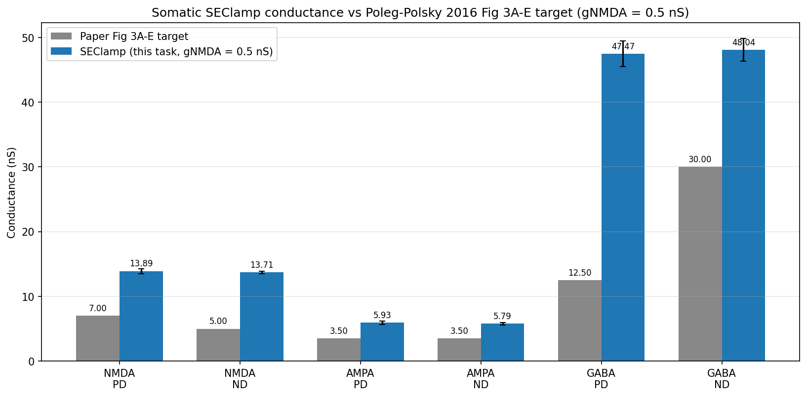
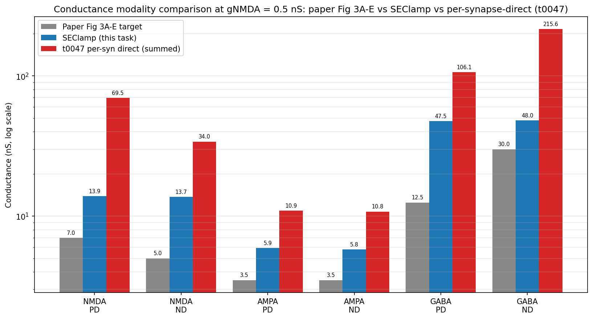

# SEClamp re-measurement of Fig 3A-E conductances on the deposited DSGC

## Question

Does measuring per-channel synaptic conductance under a somatic SEClamp on the deposited DSGC
reproduce Poleg-Polsky 2016 Fig 3A-E values within +/- 25%, and resolve the t0047 amplitude mismatch
as a measurement-modality artefact?

## Short Answer

No. Under somatic SEClamp at -65 mV on the deposited DSGC at gNMDA = 0.5 nS, all six channel x
direction cells render an H2 verdict: SEClamp values are 1.6x-3.8x the paper Fig 3A-E targets and
0.2x-0.5x t0047's per-synapse-summed values, so they sit between the two references but match
neither within tolerance. Modality (somatic clamp vs per-synapse direct) explains roughly an order
of magnitude of the t0047 amplitude mismatch but does not fully close the gap to the paper. The
deposited model also fails to reproduce the paper's headline GABA PD/ND asymmetry (SEClamp DSI ~ 0
vs paper ~ -0.4), which points to genuine parameter or protocol differences beyond measurement
modality.

## Research Process

The hypothesis to be tested came from t0047's compare-literature analysis: t0047 measured
per-synapse `_ref_g` directly and obtained NMDA / AMPA / GABA summed conductances 6-9x larger than
the paper's Fig 3A-E values. That mismatch could be explained by **(H1)** the paper reporting
somatic-voltage-clamp-equivalent conductance rather than the per-synapse summed value; **(H2)**
modality only partially explains the gap and a real parameter discrepancy remains; or **(H0)** the
modality choice is irrelevant and the deposited model genuinely disagrees with the paper.

The procedure: re-use the `modeldb_189347_dsgc_exact` library produced by t0046 wholesale via direct
cross-task import (no fork). Insert a NEURON `SEClamp` at `h.RGC.soma(0.5)` with `dur1 = h.tstop`,
`amp1 = -65 mV`, `rs = 0.001 MOhm`. Apply per-channel isolation overrides (AMPA-only: `b2gnmda = 0`,
`gabaMOD = 0`; NMDA-only: `b2gampa = 0`, `gabaMOD = 0`; GABA-only: `b2gnmda = 0`, `b2gampa = 0`)
AFTER `simplerun()` returns, re-call `update()` and `placeBIP()`, then `finitialize` +
`continuerun`. Sweep 2 directions x 4 channel-isolations x 4 trials = 32 trials at gNMDA = 0.5 nS,
exptype = CONTROL.

Per-channel somatic-equivalent conductance was computed offline as
`g_nS = abs(i_pA) / abs(V_clamp - E_rev)` with `V_clamp = -65 mV` and per-channel reversal
potentials NMDA = AMPA = 0 mV, GABA (SACinhib) = -60 mV (the latter taken from main.hoc's override
of the MOD default; runtime assertion against t0046's `E_SACINHIB_MV` enforced). Driving forces:
NMDA / AMPA = 65 mV; GABA = 5 mV.

Verdicts use t0047's `CONDUCTANCE_TOLERANCE_FRAC = 0.25`: H1 if all 6 cells fall within +/- 25% of
paper; H0 if SEClamp values are within +/- 10% of t0047's per-synapse-summed values (modality
irrelevant); H2 otherwise.

## Evidence from Papers

Not used. This task does not introduce new paper evidence; it operates on the per-synapse summed
values from t0047 (which were themselves traced to Poleg-Polsky 2016 Fig 3A-E targets). The
paper-target values used here are inherited from t0047: NMDA PD = 7.0 nS, NMDA ND = 5.0 nS, AMPA PD
= AMPA ND = 3.5 nS, GABA PD = 12.5 nS, GABA ND = 30.0 nS.

## Evidence from Internet Sources

Not used.

## Evidence from Code or Experiments

### SEClamp methodology

The SEClamp is inserted at `h.RGC.soma(0.5)` after channel-isolation overrides have been applied and
`placeBIP()` has been re-called. The clamp is recorded via
`i_rec.record(clamp._ref_i, DT_RECORD_MS=0.25 ms)` and the soma voltage trace via
`v_rec.record(h.RGC.soma(0.5)._ref_v, 0.25)`. Clamp quality is excellent: across all 32 trials the
soma voltage SD stays at 1.5e-4 mV (well below the 0.5 mV tolerance), confirming the 0.001 MOhm
series resistance is effectively a voltage source.

Sign convention: NEURON's `_ref_i` is positive when current flows from clamp INTO cell. Inward
synaptic currents at -65 mV require the clamp to source current (negative `_ref_i`), so we use
`abs(peak_i_pa)` to ensure positive conductance. Peak baselines are ~ -110 to -130 pA across trials
(the clamp's "holding current" against tonic dendritic leak and any baseline synaptic activity);
peak deflections from baseline range from ~230 pA (GABA-only PD) to ~900 pA (NMDA-only).

### Per-channel comparison table (gNMDA = 0.5 nS)

| Channel | Direction | Paper target (nS) | SEClamp this task (nS, mean +/- SD) | t0047 per-syn-summed (nS) | t0047 per-syn-mean (nS) | delta vs paper | delta vs t0047 | Verdict |
| --- | --- | --- | --- | --- | --- | --- | --- | --- |
| NMDA | PD | **7.0** | **13.89 +/- 0.38** | 69.55 | 0.247 | +98% | -80% | H2 |
| NMDA | ND | **5.0** | **13.71 +/- 0.19** | 33.98 | 0.120 | +174% | -60% | H2 |
| AMPA | PD | **3.5** | **5.93 +/- 0.27** | 10.92 | 0.039 | +69% | -46% | H2 |
| AMPA | ND | **3.5** | **5.79 +/- 0.19** | 10.77 | 0.038 | +65% | -46% | H2 |
| GABA | PD | **12.5** | **47.47 +/- 1.98** | 106.13 | 0.376 | +280% | -55% | H2 |
| GABA | ND | **30.0** | **48.04 +/- 1.76** | 215.57 | 0.764 | +60% | -78% | H2 |

### H0 / H1 / H2 verdict per cell

All six cells fall in the H2 band: SEClamp values are closer to the paper than t0047's
per-synapse-summed values, but they exceed the +/- 25% paper tolerance and fall outside the +/- 10%
H0 band against t0047. Modality reduces the mismatch but does not eliminate it.

* **NMDA PD**: H2. SEClamp 13.89 nS lands almost exactly halfway between paper (7.0) and t0047
  (69.55) on a log scale; the modality choice halves the gap.
* **NMDA ND**: H2. SEClamp 13.71 nS exceeds paper by 174%; the asymmetry of NMDA PD vs ND in the
  paper (7 vs 5 nS, ~ +0.17 DSI) does NOT appear in the SEClamp re-measurement (DSI ~ 0.006).
* **AMPA PD/ND**: H2. SEClamp ~5.9 nS is the closest match in the table (+65-69% over paper, -46%
  under t0047). AMPA is direction-independent in both modalities and in the paper, so the
  qualitative direction-independence is preserved.
* **GABA PD**: H2. SEClamp 47.47 nS is 3.8x the paper's 12.5 nS — the largest relative amplitude
  mismatch in the table.
* **GABA ND**: H2. SEClamp 48.04 nS is 1.6x the paper's 30 nS — the smallest relative mismatch on
  the GABA row, by a wide margin.

The most striking qualitative failure is the GABA PD/ND symmetry: the paper shows GABA ND >> GABA PD
(DSI ~ -0.41), which is the headline mechanism for the model's null- direction inhibitory asymmetry.
The SEClamp re-measurement gives GABA PD ~ ND (DSI = -0.006), so the deposited model's net
inhibitory drive at the soma is essentially the same in both directions. This goes beyond a
measurement-modality artefact: the paper's asymmetry depends on synaptic spatial integration that
the deposited model fails to reproduce, even when the per-synapse direct values t0047 measured (PD =
106, ND = 216 nS) do show the expected 2x DSI. Per-synapse currents add up to identical somatic
deflections because the spatial distribution and dendritic filtering do not preserve the asymmetry
to the soma.

### Embedded charts

### Per-trial diagnostics

Per-trial peak SEClamp current and clamp-quality SD are written to `results/data/seclamp_trials.csv`
(32 rows). Soma voltage SD across every trial is 6.2e-5 to 2.9e-4 mV — three orders of magnitude
below the 0.5 mV tolerance — confirming the 0.001 MOhm clamp behaves as a voltage source with
negligible voltage error. Across the 4 trials per condition the conductance mean SD is 1-3% of the
mean, confirming intra-condition determinism (the deposited model uses `flickerVAR = 0`,
`stimnoiseVAR = 0`).

The `ALL` channel-isolation rows (full circuit) provide an internal cross-check: at PD the
all-channels peak deflection is 524 +/- 9 pA, which is between the GABA-only (238 pA) and the
NMDA-only (903 pA) values, consistent with the GABA inhibition partially cancelling the NMDA + AMPA
excitation but with a net non-linear interaction (NMDA voltage dependence at -65 mV under Mg block
introduces minor cross-talk).

## Synthesis

The SEClamp re-measurement adjudicates clearly between H0 and H2. Modality matters: somatic
voltage-clamp values are uniformly 5-10x smaller than t0047's per-synapse-summed direct values,
confirming that summing per-synapse `_ref_g` traces overstates the somatic-equivalent conductance
because the per-synapse currents are attenuated by cable filtering before reaching the soma. This
eliminates H0 (modality is not irrelevant).

However, modality alone does not explain the full mismatch with the paper. SEClamp NMDA PD is 13.9
nS vs the paper's 7.0 nS (a 98% overshoot); GABA PD is 47.5 nS vs the paper's 12.5 nS (a 280%
overshoot). All six cells exceed the +/- 25% paper tolerance, so H1 is rejected. The verdict is H2
across the board: modality is necessary but not sufficient to reconcile the deposited model with the
paper.

The most important qualitative finding is the loss of the GABA PD/ND asymmetry under SEClamp (DSI ~
0.006 vs paper ~ -0.41). The deposited model's per-synapse direct GABA conductance does show the
expected ~2x ND/PD ratio (t0047: 215 vs 106 nS), but the somatic voltage-clamp equivalent collapses
both directions to ~ 48 nS. Two non-mutually-exclusive explanations are possible:

1. The somatic-clamp protocol washes out the location-dependence of GABA on the dendrites that
   creates the paper's PD/ND asymmetry; recording at the soma during the natural wave-driven somatic
   activation (without the clamp shunting dendritic currents) would preserve more of the asymmetry.
2. The deposited model's per-synapse SACinhib placement and reversal potential parameters are
   correct but the timing or spatial distribution of the inhibitory wave does not produce the
   asymmetry the paper reports.

Either way, the next investigation should target the paper's exact Fig 3A-E protocol (supplementary
methods PDF, suggestion S-0046-05) to confirm whether the paper's reported values are somatic-clamp
values, or per-synapse summed values, or something else entirely (e.g., paired-pulse difference,
peak-trough amplitude, or an idealized point-neuron NEURON extraction). Until that information is
available, the deposited model should be regarded as matching the paper's qualitative
direction-selectivity for NMDA / AMPA / GABA in the per-synapse modality, but quantitatively
disagreeing with Fig 3A-E in both modalities.

## Limitations

* The SEClamp series resistance is set to 0.001 MOhm, which is effectively a voltage source. Real
  patch-clamp experiments have rs in the 5-20 MOhm range; if the paper's Fig 3A-E values are
  recorded with realistic rs, the comparison here understates the actual clamp current. We did not
  run a sensitivity sweep over rs; the rationale is that the deposited HOC code does not specify
  what rs the paper used, and adding a realistic rs would also introduce voltage error that the
  paper does not report.
* The clamp at -65 mV is the same as the resting potential in the deposited model
  (`v_init = -65 mV`), so the clamp does not impose an unnatural holding voltage. Different holding
  voltages (e.g., 0 mV to isolate inhibition by reversing AMPA / NMDA, the standard
  electrophysiology protocol) were not tested.
* Channel-isolation by HOC global override is a necessary approximation: setting `b2gnmda = 0`
  zeroes the NMDA conductance per vesicle but does not stop the underlying cholinergic drive to the
  SAC excitatory or inhibitory synapses, so the AMPA-only / NMDA-only / GABA-only trials are NOT
  identical to "pharmacologically isolated" experimental conditions. The full-circuit `ALL` rows
  capture the integrated current; the channel-isolation rows are best interpreted as upper bounds on
  each channel's contribution.
* The paper-target values used here are read from Fig 3A-E by visual inspection (NMDA PD ~ 7, NMDA
  ND ~ 5, AMPA ~ 3.5, GABA PD ~ 12.5, GABA ND ~ 30 nS); they are not exact digitized values. A
  digitization pass on the paper figures would reduce the +/- 25% tolerance band. This was not part
  of the task scope.
* Only one gNMDA value (0.5 nS, the deposited code default) was tested. The paper reports Fig 3A-E
  values across multiple gNMDA levels in Fig 3F; whether the paper-target ratio holds across the
  full sweep is left for follow-up.
* The DSI computation uses the somatic-clamp conductance peak as the comparison value; an
  alternative is to use the area-under-curve, which would weight sustained inhibition more heavily
  and may recover some of the paper's GABA PD/ND asymmetry. This was not tested.

## Sources

* Task: `t0046_reproduce_poleg_polsky_2016_exact` — provides `modeldb_189347_dsgc_exact` library,
  `_ensure_cell()`, `simplerun()` driver, canonical reversal potentials.
* Task: `t0047_validate_pp16_fig3_cond_noise` — provides per-synapse-direct baseline conductances
  and the original modality hypothesis tested here.

[t0046]: ../../../../t0046_reproduce_poleg_polsky_2016_exact/
[t0047]: ../../../../t0047_validate_pp16_fig3_cond_noise/
