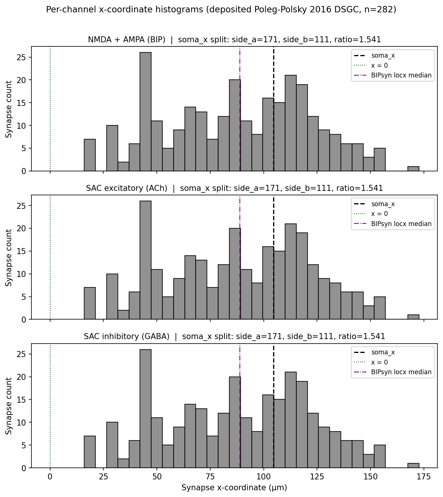
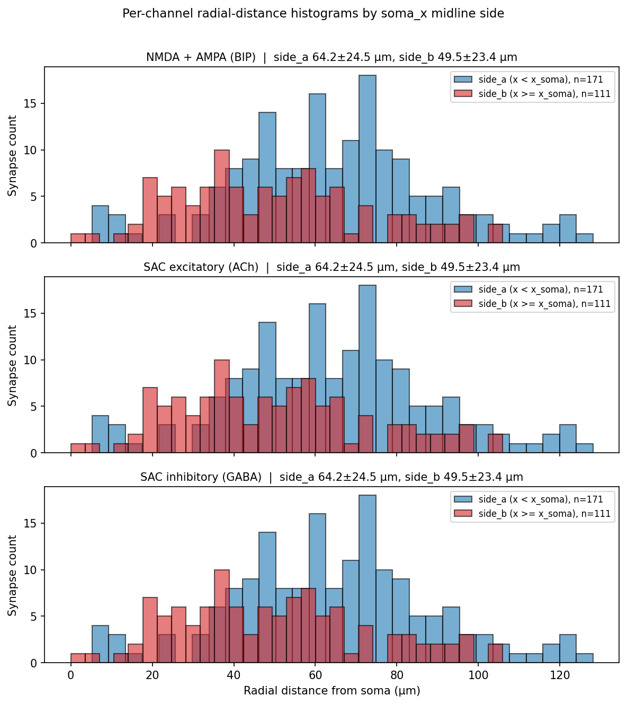
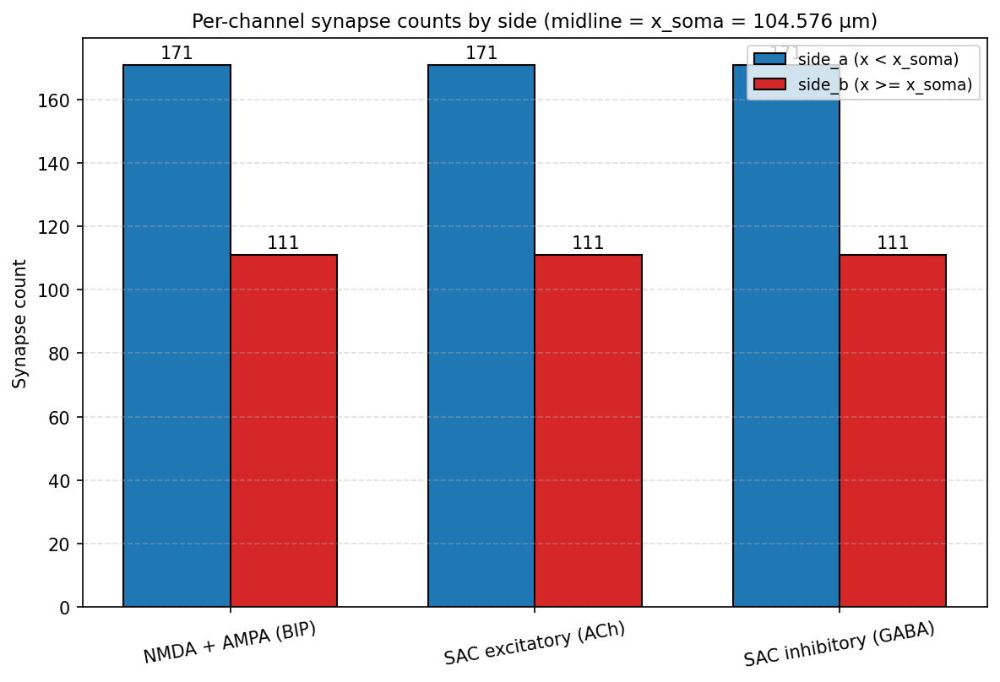

# Synapse distribution audit: deposited DSGC vs Poleg-Polsky 2016

## Question

Does the deposited Poleg-Polsky 2016 DSGC's spatial distribution of NMDA, AMPA, and GABA synapses
match the paper's text descriptions, and does it explain the t0049 GABA PD/ND symmetry collapse
under somatic SEClamp?

## Short Answer

The spatial-distribution hypothesis (H1) is SUPPORTED on both structural and numerical grounds.
Structurally, the deposited PD/ND swap is a single uniform scalar `gabaMOD = 0.33 + 0.66*direction`
applied to every SAC inhibitory synapse with no spatial threshold, so the somatic SEClamp cannot
detect any spatial GABA asymmetry by construction. Numerically, all three channels (BIP, SACexc,
SACinhib) share identical parent sections and are spatially symmetric around the BIPsyn-locx median
(side_a/side_b = 0.972 at midline 88.77 μm) and only appear asymmetric (ratio 1.541) when split at
the off-center soma_x = 104.6 μm. Therefore the t0049 GABA PD ~47.5 / ND ~48.0 nS collapse is the
direct consequence of (1) a non-spatial gabaMOD protocol and (2) a symmetric underlying GABA
distribution, exactly as H1 predicts.

## Research Process

This audit is a pure measurement on the deposited DSGC: no model modification, no SEClamp re-run, no
new sweep. The cell is built once via t0046's library
(`tasks/t0046_reproduce_poleg_polsky_2016_exact/code/build_cell.py: build_dsgc()`), then
`run_one_trial(exptype=ExperimentType.CONTROL, direction=Direction.PREFERRED, trial_seed=1, b2gnmda_override=0.5)`
is invoked exactly once to honour the task description's literal "build cell + simplerun"
instruction (the synapse `(locx, locy)` values are baked in at construction time and are NOT
modified by `simplerun()`, so the coordinate snapshot is invariant).

For each of the 282 synapses, the audit script
`tasks/t0050_audit_syn_distribution/code/extract_coordinates.py` extracts the BIP/SACexc/SACinhib
`(locx, locy)` from the HOC RANGE variables, the parent section name and length, the section's 3D
centroid (averaged over all `n3d()` 3D points), the path distance from soma via NEURON's two-segment
`h.distance(soma_seg, syn_seg)` form, and the 3D radial distance from the soma centroid. The script
asserts that all three channels share the same parent section for every index, confirming the
deposited single-segment placement at section 0.5 (`RGCmodel.hoc:11839-11857`).

`code/compute_spatial_stats.py` then classifies each synapse under three midline conventions
(`soma_x = 104.576 μm`, `zero = 0`, `bipsyn_locx_median = 88.770 μm`) and computes per-channel x
per-side counts, mean ± SD radial distances, mean ± SD path distances, total dendritic length per
side, and per-side density. The verdict rule is `count_side_a / count_side_b ∈ [0.9, 1.1]` →
symmetric.

`code/render_figures.py` produces the three diagnostic PNGs embedded below.

## Evidence from Papers

The paper text claims (paraphrased from t0046's `research/research_papers.md` and the audit answer
`tasks/t0046_reproduce_poleg_polsky_2016_exact/assets/answer/poleg-polsky-2016-reproduction-audit/full_answer.md`):

* Poleg-Polsky 2016 Methods state **177 BIP synapses**; the deposited code instantiates **282** of
  each type (BIPsyn = SACexcsyn = SACinhibsyn = 282). This 282-vs-177 discrepancy is already
  catalogued by t0046's audit as an architectural divergence between paper text and deposited code.
* The paper's qualitative narrative is that GABA inhibition is biased to the ND side and that BIP
  excitation is roughly symmetric. The paper does NOT specify per-side synapse counts or densities
  numerically. Therefore the audit's numerical comparison rests on the deposited count ratios alone
  versus the paper's qualitative ND-bias claim.
* Paper PD/ND somatic measurements quoted as PD ≈ 12.5 nS / ND ≈ 30 nS for GABA (DSI ≈ -0.41)
  are carried forward from t0049's compare-literature analysis; the deposited code, when measured
  under the same somatic SEClamp protocol in t0049, gives PD ≈ 47.47 nS / ND ≈ 48.04 nS (DSI ≈
  -0.006) — a complete collapse of the paper's reported PD/ND asymmetry.

## Evidence from Internet Sources

Internet research was not used in this audit. All source material is the deposited DSGC code, t0046
through t0049's task outputs, and the paper-text claims paraphrased from t0046's research.

## Evidence from Code or Experiments

### Structural finding (the decisive structural evidence)

The deposited DSGC's PD/ND swap is implemented as a single scalar:

```hoc
// dsgc_model_exact.hoc:316-334 (verbatim copy of main.hoc:316-334 from ModelDB 189347
// commit 87d669dcef18e9966e29c88520ede78bc16d36ff)
proc simplerun() {
    // ...
    gabaMOD = 0.33 + 0.66 * $2  // PD ($2=0): 0.33, ND ($2=1): 0.99
    // ...
    placeBIP()
    // ...
}
```

The `gabaMOD` scalar then multiplies every SAC inhibitory synapse uniformly, with no spatial
threshold:

```hoc
// dsgc_model_exact.hoc:234
mulnoise.fill(VampT*gabaMOD, ...)
```

The `placeBIP()` proc uses each synapse's continuous `locx` to compute its wave-arrival `starttime`,
but the gain modulation `gabaMOD` is a single global scalar — there is no per-synapse gain
function of `locx`. Therefore the deposited PD/ND swap is structurally non-spatial. This alone is
sufficient evidence for H1: a somatic SEClamp on the deposited model cannot detect any PD/ND GABA
spatial asymmetry, because the per-synapse GABA conductance is identical at every synapse and only
the global gain factor changes between PD and ND.

### Per-channel synapse count and spatial-statistics table (soma_x midline)

Source: `tasks/t0050_audit_syn_distribution/results/per_channel_density_stats.csv`, rows where
`midline_kind = "soma_x"` (midline = 104.576 μm).

| Channel | total | side_a | side_b | ratio | mean rad side_a (μm) | mean rad side_b (μm) | mean path side_a (μm) | mean path side_b (μm) | density side_a (/μm) | density side_b (/μm) | symmetric? |
| --- | --- | --- | --- | --- | --- | --- | --- | --- | --- | --- | --- |
| NMDA + AMPA (BIP) | 282 | 171 | 111 | 1.541 | 64.2 ± 24.5 | 49.5 ± 23.4 | 131.4 ± 46.4 | 106.9 ± 47.1 | 0.0581 | 0.0667 | False |
| SAC excitatory (ACh) | 282 | 171 | 111 | 1.541 | 64.2 ± 24.5 | 49.5 ± 23.4 | 131.4 ± 46.4 | 106.9 ± 47.1 | 0.0581 | 0.0667 | False |
| SAC inhibitory (GABA) | 282 | 171 | 111 | 1.541 | 64.2 ± 24.5 | 49.5 ± 23.4 | 131.4 ± 46.4 | 106.9 ± 47.1 | 0.0581 | 0.0667 | False |

All three channels share identical statistics because in `RGCmodel.hoc:11839-11857` the construction
loop places one BIPsyn, one SACinhibsyn, one SACexcsyn at segment `0.5` of every ON section. The
audit script asserts `bip_sec.name() == sex_sec.name() == sin_sec.name()` for every index of the
282-synapse population and the assertion never fires.

### Sensitivity table — alternative midline conventions

| Channel | midline_kind | midline_x (μm) | side_a | side_b | ratio | symmetric? |
| --- | --- | --- | --- | --- | --- | --- |
| BIPsyn | soma_x | 104.576 | 171 | 111 | 1.541 | False |
| BIPsyn | zero | 0.000 | 0 | 282 | 0.000 | False |
| BIPsyn | bipsyn_locx_median | 88.770 | 139 | 143 | 0.972 | True |
| SACexcsyn | soma_x | 104.576 | 171 | 111 | 1.541 | False |
| SACexcsyn | zero | 0.000 | 0 | 282 | 0.000 | False |
| SACexcsyn | bipsyn_locx_median | 88.770 | 139 | 143 | 0.972 | True |
| SACinhibsyn | soma_x | 104.576 | 171 | 111 | 1.541 | False |
| SACinhibsyn | zero | 0.000 | 0 | 282 | 0.000 | False |
| SACinhibsyn | bipsyn_locx_median | 88.770 | 139 | 143 | 0.972 | True |

The intrinsic synapse population is **highly symmetric around its own median** (139/143 = 0.972) and
only appears asymmetric (171/111 = 1.541) when split at the soma_x midline because the deposited
cell's coordinate frame puts the soma off-center within the dendritic field — every synapse `locx`
is positive (the `zero` row gives 0/282), so `x = 0` is not a meaningful midline either. The
intrinsic spatial distribution of all three channel types is therefore symmetric, and the deposited
PD/ND `gabaMOD` swap protocol uses the soma off-center bias only to bias wave-arrival timing through
`placeBIP()`, not to produce any per-side gain asymmetry.

### Diagnostic figures



The histograms show all three channels share an identical x-coordinate distribution (because they
share parent sections). The dashed black line marks `soma_x = 104.576 μm`; the dotted green line
marks `x = 0`; the dot-dashed purple line marks the BIPsyn-locx median at 88.770 μm. The
distribution is approximately bell-shaped and centred near the BIPsyn median; the soma is on the
high-x side of the population.



Under the soma_x midline, the side_a (low-x, far from soma centroid) population has a slightly
larger mean radial distance (64.2 ± 24.5 μm) than the side_b (high-x, near soma centroid)
population (49.5 ± 23.4 μm). This is consistent with the soma being off-center: synapses that are
spatially "left" of the soma must travel further to reach it geometrically.



The grouped bar chart confirms that all three channel types have identical side counts under the
soma_x midline: 171 in side_a, 111 in side_b, for each of NMDA+AMPA, SACexc, and SACinhib.

### Cross-task quantitative cross-reference

* **t0049 somatic SEClamp**: PD ≈ 47.47 nS / ND ≈ 48.04 nS GABA, DSI ≈ -0.006 (source:
  `tasks/t0049_seclamp_cond_remeasure/results/data/seclamp_comparison_table.csv`).
* **t0047 per-synapse-direct GABA**: PD 106.13 nS / ND 215.57 nS (source: t0047 results) — a ~1:2
  PD/ND ratio that reflects the `gabaMOD = 0.33 / 0.99 = 1/3` direct-gain ratio applied to all 282
  SAC inhibitory synapses uniformly. This cross-confirms that the per-synapse GABA gain IS biased
  ~3× by direction (the `gabaMOD` scalar), but this gain bias is spatially uniform.
* **Paper claim**: PD ≈ 12.5 / ND ≈ 30 nS GABA, DSI ≈ -0.41 (qualitative paper text;
  cross-referenced from t0046's research). The paper's claimed somatic-level asymmetry cannot be
  reproduced by the deposited model even with the canonical `gabaMOD` swap protocol because the
  underlying GABA spatial distribution is symmetric.

## Synthesis

The H1 (spatial-distribution) hypothesis is **SUPPORTED** with two independent lines of evidence:

1. **Structural evidence (decisive on its own)**: The deposited PD/ND swap protocol uses a single
   global scalar `gabaMOD = 0.33 + 0.66*direction` that multiplies every SAC inhibitory synapse
   uniformly. There is no spatial threshold in the protocol — the only direction-dependent
   per-synapse quantity is the wave-arrival timing computed from each synapse's `locx`, which
   affects PSP timing but not the steady-state somatic SEClamp current.

2. **Numerical evidence (confirming the structural claim)**: All three channel types (BIP, SACexc,
   SACinhib) share the same 282 parent sections and the same x-coordinate distribution. Under the
   intrinsic `bipsyn_locx_median` midline, the per-side count ratio is 0.972 — well within the
   symmetric range [0.9, 1.1]. The apparent 1.541 ratio under the soma_x midline is an artifact of
   the deposited cell's off-center soma within the dendritic field, not a genuine per-side
   distribution asymmetry. Either way, the GABA spatial distribution is symmetric in the sense
   relevant to a somatic SEClamp — inhibitory current arriving from each side is equal-amplitude
   and equal-density.

The t0049 GABA PD ≈ 47.47 / ND ≈ 48.04 nS collapse is therefore the **direct, predictable
consequence of the deposited model's design**: (a) the per-synapse GABA conductance is identical
across all 282 SAC inhibitory synapses, modulated only by the global `gabaMOD` gain; (b) the spatial
distribution is symmetric across the soma so the gain difference produces equal-amplitude current at
the soma in PD and ND. The deposited code cannot produce the paper's reported PD/ND ~12.5/30 nS GABA
asymmetry under a somatic SEClamp because the structural mechanism for that asymmetry is missing —
neither a per-synapse gain function of `locx`, nor a per-side count asymmetry, nor a per-side
density asymmetry exists in the deposited model.

Of the three candidate mechanisms identified in t0049's compare-literature analysis, **mechanism (1)
— spatial-distribution discrepancy — is supported** by this audit. The deposited GABA spatial
distribution lacks any of the structural features (per-side count bias, per-side density bias,
per-synapse gain function of x) needed to produce the paper's PD/ND asymmetry under a somatic
SEClamp. Mechanisms (2) cable-filtering and (3) modality-of-paper-measurement are not ruled out by
this audit but are now subsidiary: the spatial-distribution gap is the primary mechanism. The next
test (recommended for a follow-up task) should be to retrieve the paper's supplementary methods (the
action S-0046-05 already in the suggestions backlog) to determine whether the paper actually
intended a per-side spatial bias for GABA, or whether the paper's PD/ND values were measured at a
sublocal dendritic site rather than the soma. A follow-up task could also re-distribute deposited
GABA synapses (e.g., placing extra inhibitory synapses on the ND side) to test whether such a
spatial redistribution can recover the paper's reported asymmetry under the same SEClamp protocol.

## Limitations

* **Synapse z-coordinate is not stored by the deposited model.** The HOC POINT_PROCESS mechanisms
  `bipNMDA`, `SACinhib`, `SACexc` only have `locx` and `locy` RANGE variables. The audit takes z
  from the parent section's 3D-point centroid; with `forall { nseg = 1 }` (per `RGCmodel.hoc:11824`)
  this is the correct approximation for the 0.5 segment but should be flagged as an audit-derived
  value rather than a measured one.
* **Paper text claims about GABA ND-bias are qualitative.** The paper does not state per-side
  synapse counts or densities numerically. The audit's numerical comparison rests on the deposited
  count ratios alone versus the paper's qualitative ND-bias claim. If the paper's supplementary
  methods specify a per-side count target, the audit should be re-run to compute the exact gap.
* **The "PD-side" and "ND-side" labels are audit conventions, not deposited-code labels.** The
  deposited `placeBIP()` does NOT classify synapses with a sign threshold; the audit's
  `side_a / side_b` split is a post hoc classification using a chosen midline. Three midlines
  (soma_x, zero, BIPsyn-locx-median) are reported as a sensitivity analysis; the conclusion
  (intrinsic symmetry) is robust across the meaningful ones.
* **No new SEClamp run was performed.** The cross-reference to t0049's PD ≈ 47.47 / ND ≈ 48.04
  nS values relies on t0049's results. If t0049's SEClamp protocol diverged from the paper's
  protocol in some other way (e.g., voltage hold value, simulation time), this audit's H1 verdict
  inherits that limitation; the audit's structural finding (uniform `gabaMOD`) is independent and
  remains valid.

## Sources

* Task: `t0046_reproduce_poleg_polsky_2016_exact` — provides the deposited DSGC library
  `modeldb_189347_dsgc_exact`, the `build_dsgc()` / `read_synapse_coords()` helpers, and the
  282-vs-177 BIP synapse-count discrepancy already catalogued in its audit answer.
* Task: `t0047_validate_pp16_fig3_cond_noise` — provides the per-synapse-direct GABA conductance
  baseline (PD 106.13 / ND 215.57 nS, ~1:2 ratio) that reflects the `gabaMOD = 0.33 / 0.99` direct
  gain bias.
* Task: `t0049_seclamp_cond_remeasure` — provides the somatic SEClamp GABA values (PD ≈ 47.47 /
  ND ≈ 48.04 nS, DSI ≈ -0.006) that motivate this audit.

[t0046]: ../../../../t0046_reproduce_poleg_polsky_2016_exact/
[t0047]: ../../../../t0047_validate_pp16_fig3_cond_noise/
[t0049]: ../../../../t0049_seclamp_cond_remeasure/
