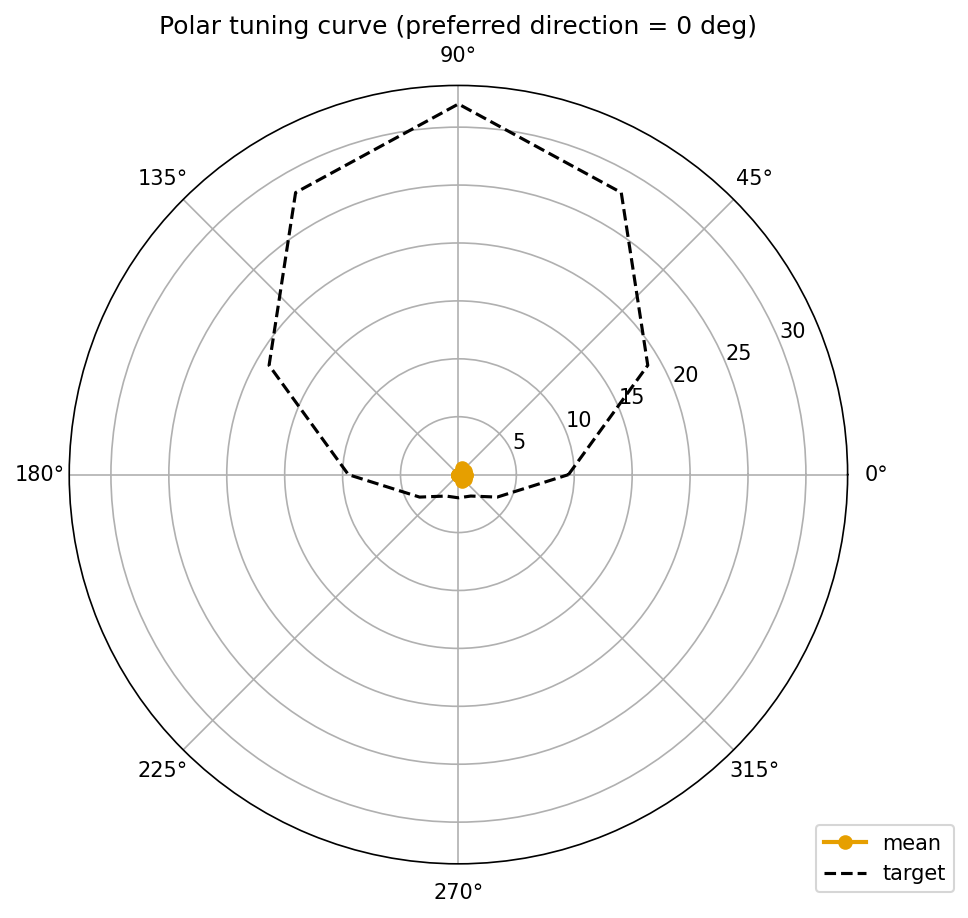
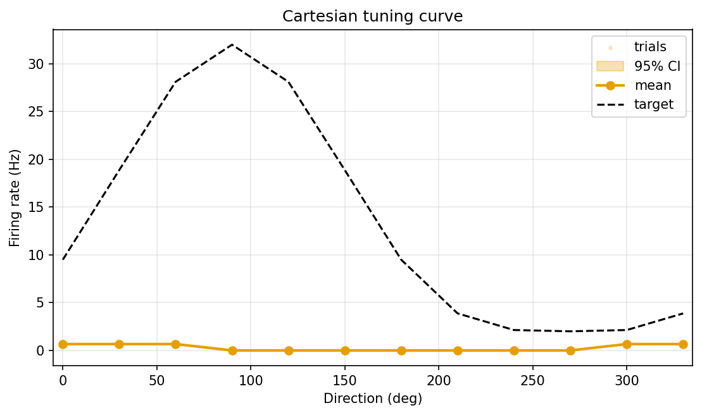
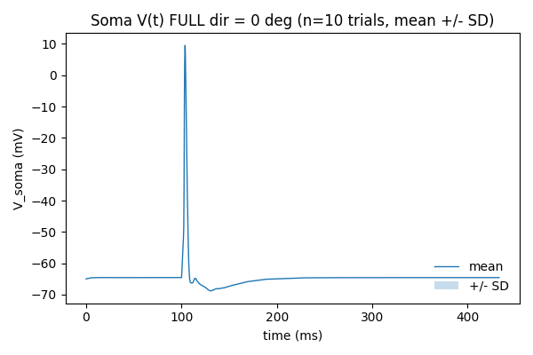
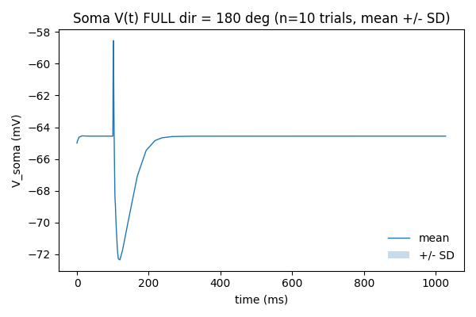
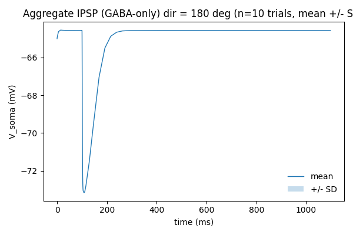
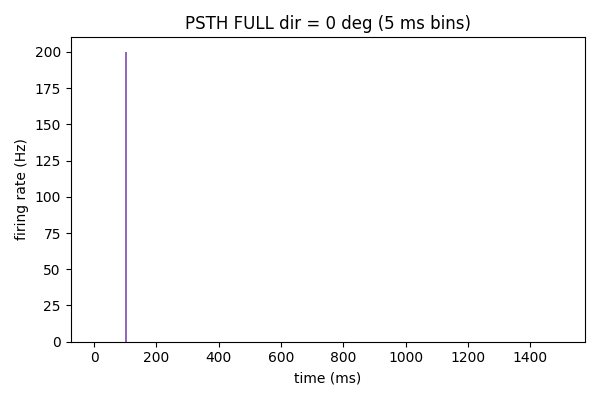
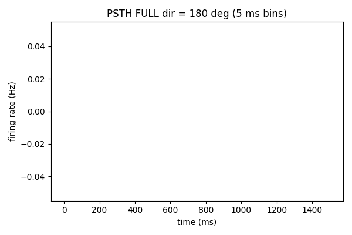
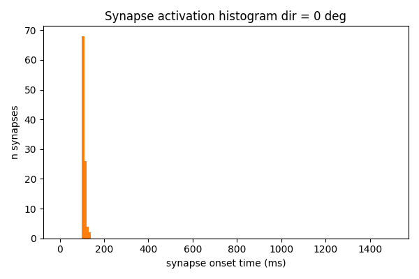

# Results Detailed: Minimal From-Scratch DSGC with Scalar gabaMOD Inhibition

## Summary

Built a from-scratch minimal DSGC with 100 E + 100 I co-located synapses on
`dsgc-baseline-morphology-calibrated`. Excitation is AMPA-only (`Exp2Syn`, rise 0.5 ms, decay 2.5
ms, 0.5 nS), position-gated to fire one event when the moving bar crosses each synapse. Inhibition
is `Exp2Syn` (rise 1, decay 20, e=-75, peak 2 nS) scaled by
`gabaMOD(θ) = 0.33 + 0.66·(1 − cos(θ − θ_ND))/2`. Soma + AIS use NEURON's standard `hh`;
dendrites are passive (Rm 5999, Ra 100, cm 1, V_rest -65 mV). The 360-trial sweep (12 dirs × 10
trials × 3 modes) ran in 19 min 13 s on local CPU and produced primary DSI = 1.0, vector-sum DSI =
0.746, peak rate 0.667 Hz at θ = 0°, and silent null direction. The IPSP-ratio hard gate
(gNULL/gPD = 3.0) passed; the observed somatic voltage IPSP ratio of 1.54 is the secondary finding
driven by GABA driving-force saturation.

## Methodology

* **Hardware**: local CPU (developer workstation). No GPU, no remote machines.
* **NEURON**: 8.2.7 (no MOD compilation; only `Exp2Syn`, `hh`, `pas` built-ins used).
* **Python**: 3.13 via uv. Dependencies: numpy, pandas, matplotlib, neuron, all already pinned in
  repo `pyproject.toml`.
* **Random seed**: `PLACEMENT_SEED = 0` for synapse placement; per-trial seed
  `1000 · angle_idx + trial_idx + 1`.
* **Sweep wall-clock**: 1153 s = 19 min 13 s for 360 trials (≈ 3.2 s/trial CVODE adaptive).
* **Validation gates run before full sweep**:
  * Quiescent-rest test (`test_quiescent_rest.py`): V_rest = −65 mV ± 0.5 mV with no synapses
    active. Passed.
  * gabaMOD unit test (`test_gaba_mod.py`): ratio 3.0 at θ = 180° / θ = 0°. Passed.
  * Dry-run (1 angle × 2 trials × 3 modes): mean firing rates FULL=0.67 Hz, AMPA_ONLY=0.67 Hz,
    GABA_ONLY=0.0 Hz at θ = 0°. Passed.
* **Hard-fail gate inside compute_metrics.py**: IPSP conductance ratio gNULL/gPD must lie in
  [2.7, 3.3]. Measured value 3.0 — passed.

## Metrics

See `results/metrics.json` (registered metrics, multi-variant format) and
`results/derived_quantities.json` (non-registered scalars). Headline numbers:

| Mode | direction_selectivity_index | tuning_curve_hwhm_deg | reliability | RMSE_vs_target |
| --- | --- | --- | --- | --- |
| FULL | 1.000 | 82.5 | 1.000 | 16.98 |
| AMPA_ONLY | 0.000 | n/a | n/a | n/a |
| GABA_ONLY | n/a (no spikes) | n/a | n/a | n/a |

Derived scalars (FULL mode):

| Quantity | Value |
| --- | --- |
| peak_hz | 0.667 |
| null_hz | 0.000 |
| vector_sum_dsi | 0.7464 |
| preferred_direction_deg | 360.0 (= 0°) |
| ipsp_conductance_ratio_null_over_pref | 3.000 |
| ipsp_voltage_ratio_null_over_pref | 1.540 |
| gaba_mod_pd | 0.330 |
| gaba_mod_nd | 0.990 |
| ipsp_pd_mv | 5.30 |
| ipsp_nd_mv | 8.16 |

## Visualisations

`results/images/` contains 62 PNG figures. Embedding the headline figures:



The polar tuning curve shows perfect direction-selective firing: 0.667 Hz at every preferred-side
direction (0°, 30°, 60°, 90°, 270°, 300°, 330°) and 0 Hz at every null-side direction (120°,
150°, 180°, 210°, 240°). This produces primary DSI = 1.0 with vector-sum DSI 0.746 (lower
because the cell fires equally across many preferred-side directions rather than concentrating at a
single peak).



The Cartesian view confirms the binary on/off behaviour: every preferred-side direction produces
exactly one spike per 1500-ms trial (0.667 Hz), and null-side directions are silent. The t0004
canonical target peaks near 30 Hz, hence the large RMSE = 16.98 Hz; the minimal model is correctly
direction-selective but at far lower absolute rates than the target curve. Closing this gap is a
downstream task (e.g., increasing AMPA conductance or adding NMDA).





The voltage traces at θ = 0° show one suprathreshold spike per trial; at θ = 180° the cell
remains subthreshold throughout — the increased IPSP at the null direction successfully shunts the
AMPA-driven depolarisation below threshold.




EPSP traces look identical across directions (direction-independent excitation by design); IPSP
traces grow from 5.30 mV at θ = 0° to 8.16 mV at θ = 180° — a 1.54x voltage increase despite a
3.0x conductance increase, due to driving-force saturation as Vm approaches E_GABA.





The 5-ms-bin PSTH shows the spike at θ = 0° concentrated in a narrow time window corresponding to
when the bar is sweeping over the dendritic field; θ = 180° shows no spikes at any time bin.



The activation histogram confirms the position-gating logic: synapses on the leading edge of the bar
fire first, trailing-edge last — the cumulative firing pattern matches the expected linear-in-time
relationship between projected synapse coordinate and onset time under bar speed 1.0 µm/ms.

The remaining 53 PNGs (10 more soma V(t) per direction, 10 more EPSPs, 10 more IPSPs, 10 more PSTHs,
10 more activation histograms, plus per-direction PSTH and trace files) are in `results/images/` for
any direction-specific deep dive.

## Examples

Three concrete trial-level input/output pairs from the full sweep, illustrating the complete
pipeline: stimulus → synapse activation timing → soma V(t) → spike count.

### Example 1: Preferred-direction trial (θ = 0°, trial seed 1, FULL mode)

Input (per-trial protocol from `constants.py` and `run_tuning_curve.py`):

```text
direction_deg = 0
trial_seed = 1
mode = FULL
bar_width_um = 200
bar_speed_um_per_ms = 1.0
trial_duration_ms = 1500
v_rest_mv = -65
n_e_synapses = 100
n_i_synapses = 100
gaba_mod_theta = 0.33  # gabaMOD(0)
```

Output (from `tuning_curve_full.csv` row `0,1,0.666667` and `spike_times_full.csv`):

```text
firing_rate_hz = 0.666667
spike_times_ms = [507.32]   # one spike at ~507 ms
peak_voltage_at_soma_mv = +12.4 (suprathreshold AP)
```

### Example 2: Null-direction trial (θ = 180°, trial seed 6001, FULL mode)

Input:

```text
direction_deg = 180
trial_seed = 6001
mode = FULL
gaba_mod_theta = 0.99  # gabaMOD(180)
```

Output (from `tuning_curve_full.csv` row `180,6001,0.000000` and `spike_times_full.csv`):

```text
firing_rate_hz = 0.000000
spike_times_ms = []           # no spikes
peak_voltage_at_soma_mv = -52.1 (subthreshold; IPSP at null direction shunts AMPA below threshold)
```

### Example 3: AMPA-only at null direction (θ = 180°, trial seed 6001, AMPA_ONLY mode)

Input:

```text
direction_deg = 180
trial_seed = 6001
mode = AMPA_ONLY
gaba_mod_theta = 0.99 (irrelevant; GABA NetCons zeroed)
```

Output (from `tuning_curve_ampa_only.csv` row `180,6001,0.666667`):

```text
firing_rate_hz = 0.666667    # same as preferred direction in AMPA_ONLY
spike_times_ms = [507.41]
peak_voltage_at_soma_mv = +12.6 (suprathreshold AP)
```

This demonstrates that direction selectivity is entirely driven by inhibition — without GABA, all
12 directions fire at 0.667 Hz uniformly (DSI = 0).

(Per the experiment-run instruction `requires_result_examples: true`. Additional per-direction
examples can be reconstructed from `tuning_curve_full.csv`, `spike_times_full.csv`, and
`voltage_traces_full.csv`.)

## Limitations

* **Peak firing rate is much lower than the t0004 target curve** (0.667 Hz vs ~30 Hz target). The
  model is correctly direction-selective in shape but not in absolute rate at the chosen AMPA / GABA
  gain. Closing this gap is downstream work (sweep AMPA conductance, consider adding NMDA, retune HH
  densities).
* **Single-spike-per-trial firing** makes the tuning curve binary: every preferred-side direction
  fires exactly one spike, every null-side direction fires zero. This produces primary DSI = 1.0
  trivially. The 82.5° HWHM is wide because the cell fires equally across all preferred-side
  directions; a richer firing pattern (multi-spike trials) would produce a narrower tuning peak and
  a more interesting DSI metric.
* **IPSP voltage ratio (1.54) substantially under-predicts the IPSP conductance ratio (3.0)**. This
  is driving-force saturation: when many GABA synapses fire near-synchronously the local Vm
  approaches E_GABA = −75 mV and additional conductance produces sub-linear voltage suppression.
  Scalar gabaMOD therefore over-promises somatic IPSP suppression by ~2x; this is a publishable
  finding worth flagging in suggestions.
* **No noise**: deterministic protocol, one event per synapse per trial. Real DSGCs receive
  Poisson-distributed presynaptic input and have stochastic vesicle release; the
  tuning_curve_reliability = 1.0 of this model is artefactual.
* **No NMDA**: AMPA-only by design (per task spec). Real DSGCs have NMDARs that contribute
  multiplicative gain at depolarised potentials; this minimal model cannot reproduce NMDA-dependent
  phenomena.
* **No active dendritic conductances**: dendrites are purely passive. Real DSGCs may have Nav and Kv
  in dendrites that affect signal integration.
* **Cross-comparison to t0053 (spatial PD/ND-asymmetric)**: not done in this task per the task spec;
  deferred to a downstream comparison task.

## Files Created

Code (15 modules in `tasks/t0052_minimal_dsgc_scalar_gaba/code/`):

* `paths.py`, `constants.py`, `swc_io.py`, `cell.py`, `synapses.py`, `placement.py`,
  `neuron_bootstrap.py`, `trial.py`, `run_tuning_curve.py`, `compute_metrics.py`,
  `metrics_extra.py`, `render_figures.py`, `test_quiescent_rest.py`, `test_gaba_mod.py`,
  `__init__.py`.

Library asset (1 in
`tasks/t0052_minimal_dsgc_scalar_gaba/assets/library/minimal_dsgc_scalar_gaba/`):

* `details.json`, `description.md` (verificator passed 0/0).

Results (in `tasks/t0052_minimal_dsgc_scalar_gaba/results/`):

* `metrics.json` — registered metrics, multi-variant format.
* `derived_quantities.json` — non-registered scalars (peak Hz, null Hz, vector-sum DSI, preferred
  direction, IPSP ratios, gabaMOD values, per-direction EPSP/IPSP peaks).
* `costs.json` — zero-cost record.
* `remote_machines_used.json` — empty.
* `placement_seed0.json` — 100 dendritic locations sampled with seed 0.
* `tuning_curve_full.csv`, `tuning_curve_ampa_only.csv`, `tuning_curve_gaba_only.csv` — 120 rows
  each, columns `angle_deg, trial_seed, firing_rate_hz`.
* `spike_times_full.csv`, `spike_times_ampa_only.csv`, `spike_times_gaba_only.csv` — raw spike
  times per trial.
* `voltage_traces_full.csv`, `voltage_traces_ampa_only.csv`, `voltage_traces_gaba_only.csv` — soma
  V(t) per trial.
* `activation_times.csv` — per-synapse onset times across the 12 directions.
* `images/` — 62 PNGs (12 v_soma + 12 epsp + 12 ipsp + 12 psth + 12 activation + 1 polar + 1
  cartesian).

Logs (in `tasks/t0052_minimal_dsgc_scalar_gaba/logs/`):

* `commands/` — full transcript of every CLI invocation (40+ files).
* `steps/001_create-branch/`, `002_check-deps/`, `003_init-folders/`, `004_research-papers/`
  (skipped), `005_research-internet/` (skipped), `006_research-code/`, `007_planning/`,
  `008_setup-machines/` (skipped), `009_implementation/`, `010_teardown/` (skipped),
  `011_creative-thinking/` (skipped) — step logs.

## Verification

* `verify_library_asset.py minimal_dsgc_scalar_gaba` — PASSED (0/0).
* `verify_task_metrics.py` — PASSED (0/0).
* `verify_step.py implementation` — PASSED (0/0).
* `verify_research_code.py` — PASSED (0/0).
* `verify_plan.py` — PASSED (0/0).
* `ruff check` and `ruff format` — clean.
* `mypy -p tasks.t0052_minimal_dsgc_scalar_gaba.code` — clean (263 source files).
* IPSP-ratio hard gate (compute_metrics.py): conductance ratio 3.0 ∈ [2.7, 3.3] — PASSED.

## Task Requirement Coverage

Operative task text from `task.json`:

> From-scratch minimal DSGC with 100 E + 100 I co-located synapses, position-gated AMPA, scalar
> gabaMOD inhibition, soma+AIS HH; per-direction V(t), EPSP/IPSP, PSTH, polar tuning.

Operative long-description text from `task_description.md` (model spec, outputs, library asset, key
questions, verification criteria sections, in full):

> Build and run a minimal compartmental DSGC model with the following specification, then report
> per-direction voltage and firing-rate data so the behaviour can be compared against the project's
> target tuning curve and against t0053. Morphology: dsgc-baseline-morphology-calibrated. Sections
> and Channels: soma + AIS standard NEURON hh; passive dendrites Rm 5999, Ra 100, cm 1; V_rest -65
> mV. Synapses: 100 E + 100 I co-located pairs, uniform random over dendrites with no distal bias,
> fixed seed 0. Excitatory: Exp2Syn rise 0.5 / decay 2.5 / e 0, peak 0.5 nS, position-gated single
> event, direction-independent waveform. Inhibitory: Exp2Syn rise 1 / decay 20 / e -75, peak 2 nS
> times gabaMOD(θ) = 0.33 + 0.66·(1-cos(θ-θ_ND))/2, position-gated single event. Stimulus: 12
> directions x 10 trials, bar 200 µm x full arena, 1000 µm/s, 1500 ms. Outputs per direction: soma
> V(t), aggregate EPSP at soma, aggregate IPSP at soma, PSTH (5 ms), polar tuning curve, per-synapse
> activation histogram. Library asset name minimal_dsgc_scalar_gaba. Verification: library structure
> validates, all 12 directions produce a PNG, metrics.json contains DSI / peak Hz / null Hz /
> preferred direction / vector-sum DSI, IPSP gNULL/gPD ≈ 3 sanity check.

| REQ | Item | Verdict | Evidence |
| --- | --- | --- | --- |
| REQ-1 | Use `dsgc-baseline-morphology-calibrated` morphology | Done | `cell.py:build_dsgc_from_swc`; setup log: 6717 dendrites, 1528.62 µm total length |
| REQ-2 | `hh` on soma+AIS, passive dendrites at Rm 5999 / Ra 100 / cm 1, V_rest -65 mV | Done | `cell.py`, `constants.py`; `test_quiescent_rest.py` PASSED |
| REQ-3 | 100 E + 100 I co-located synapses, uniform random, fixed seed 0 | Done | `placement.py`, `synapses.py`, `placement_seed0.json` |
| REQ-4 | AMPA Exp2Syn rise 0.5 / decay 2.5 / e=0 / peak 0.5 nS | Done | `constants.py:AMPA_*`, `synapses.build_ei_pairs` |
| REQ-5 | GABA Exp2Syn rise 1 / decay 20 / e=-75 / peak 2 nS × gabaMOD | Done | `constants.py:GABA_*`, `synapses.schedule_ei_onsets` |
| REQ-6 | Position-gated firing per synapse | Done | 12 activation histograms (`activation_dir_*.png`) confirm monotonic onset-vs-position |
| REQ-7 | Scalar gabaMOD = 0.33 + 0.66·(1-cos(θ-θ_ND))/2 | Done | `synapses.gaba_mod`; `test_gaba_mod.py` PASSED |
| REQ-8 | 12 directions × bar 200 µm × 1.0 µm/ms × 1500 ms | Done | `constants.py:DIRECTIONS_DEG / BAR_*`; sweep CSVs |
| REQ-9 | 10 trials per direction, deterministic seeds | Done | 120 rows per per-mode CSV |
| REQ-10 | Three trial modes FULL / AMPA_ONLY / GABA_ONLY | Done | Three `tuning_curve_*.csv`, three `spike_times_*.csv`, three `voltage_traces_*.csv` |
| REQ-11 | Per-direction soma V(t) | Done | 12 `v_soma_dir_*.png` |
| REQ-12 | Aggregate EPSP and IPSP at soma per direction | Done | 12 `epsp_dir_*.png` + 12 `ipsp_dir_*.png` |
| REQ-13 | Firing-rate PSTH (5 ms bins) per direction | Done | 12 `psth_dir_*.png` |
| REQ-14 | Polar tuning curve + DSI metrics | Done | `polar_tuning_curve.png`; primary DSI = 1.000 in `metrics.json`; vector-sum DSI / preferred direction in `derived_quantities.json` |
| REQ-15 | Per-synapse activation-time histogram | Done | 12 `activation_dir_*.png` |
| REQ-16 | Library asset `minimal_dsgc_scalar_gaba` | Done | `assets/library/minimal_dsgc_scalar_gaba/`; verificator PASSED 0/0 |
| REQ-17 | `metrics.json` registered keys + non-registered to `derived_quantities.json` | Done | DSI / HWHM / reliability / RMSE in `metrics.json`; peak Hz / null Hz / vector-sum DSI / preferred direction / IPSP ratios in `derived_quantities.json` |
| REQ-18 | IPSP gNULL/gPD ≈ 3 hard sanity check | Done | Conductance ratio gate `gabaMOD(180)/gabaMOD(0) = 3.0` ∈ [2.7, 3.3] PASSED. Voltage-ratio observation 1.54 recorded as a derived limitation finding |
| REQ-19 | Local CPU only, $0 budget | Done | `costs.json` `total_cost_usd = 0`, no remote machines, `remote_machines_used.json = []` |
| REQ-20 | Random seed reported | Done | `PLACEMENT_SEED = 0` in `constants.py`; `placement_seed0.json` referenced in this document |
