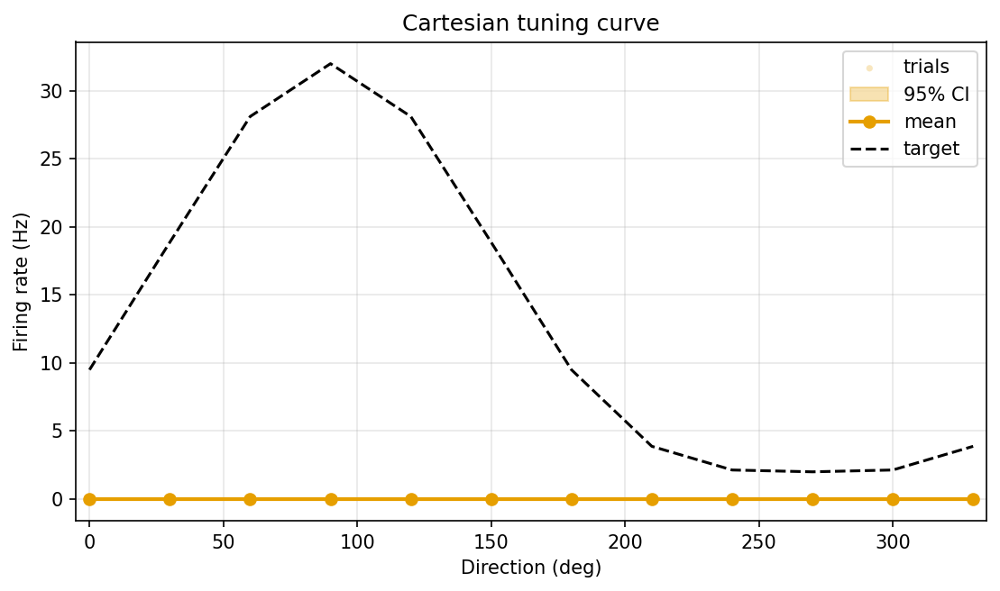
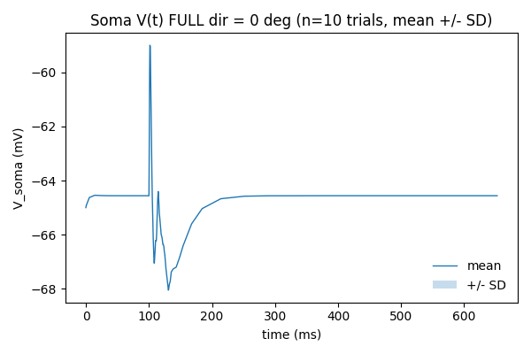
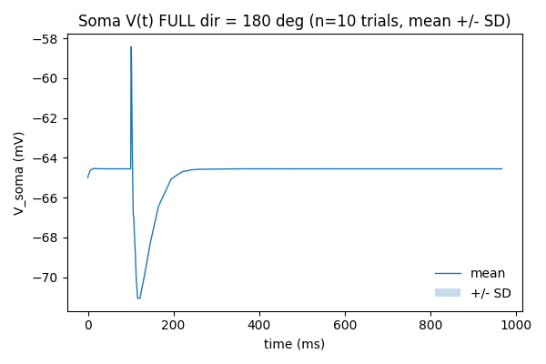
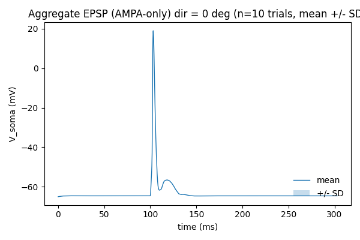
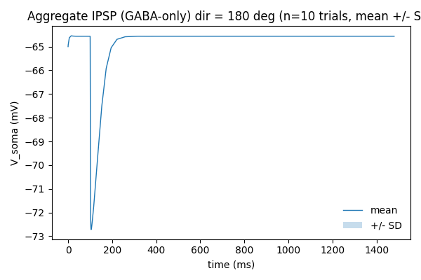
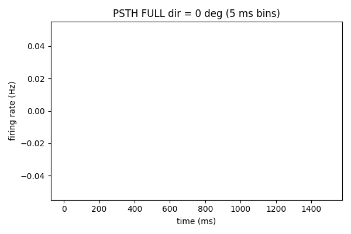
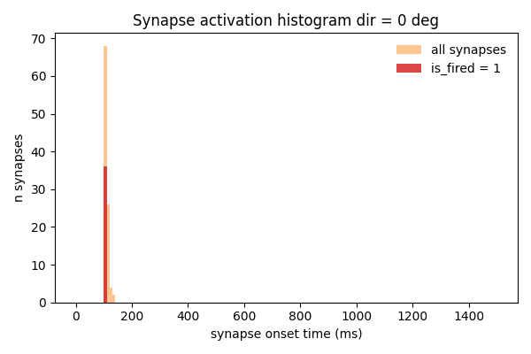

# Results Detailed: Minimal From-Scratch DSGC with Spatial PD/ND-Asymmetric Inhibition

## Summary

Built a from-scratch minimal DSGC with 100 E + 100 I co-located synapses on
`dsgc-baseline-morphology-calibrated`, identical to t0052 except the inhibition mechanism: each I
synapse fires only when the bar's direction is centripetal relative to that synapse
(`cos(θ_stim − θ_centrifugal) < 0`), at full 2 nS amplitude with no scalar scaling. The
360-trial sweep ran in 17 min 11 s on local CPU. Headline: **FULL mode produces 0 Hz across all 12
directions** — the centripetal mechanism with 2 nS GABA on ~50 % of synapses fully suppresses
spiking on this morphology. AMPA_ONLY fires at 0.667 Hz uniformly (matching t0052), confirming
excitation works correctly. The spatial gating itself is confirmed by the per-direction
active-fraction (0.34 → 0.66 across directions); the IPSP aggregate at the soma varies only 1.24×
across directions (driving-force saturation, same finding as t0052 with a different mechanism). Soft
active-fraction sanity check passes at mean 0.500.

## Methodology

* **Hardware**: local CPU. No GPU, no remote machines.
* **NEURON**: 8.2.7 (no MOD compilation; only `Exp2Syn`, `hh`, `pas` built-ins).
* **Python**: 3.13 via uv. Same dependency pinning as t0052.
* **Random seed**: `PLACEMENT_SEED = 0` (bit-identical to t0052 — verified by
  `test_placement_seed0_match.py`); per-trial seed `1000 · angle_idx + trial_idx + 1`.
* **Sweep wall-clock**: 1031 s = 17 min 11 s for 360 trials (≈ 2.9 s/trial), faster than t0052's
  19 min 13 s likely because GABA NetCons are zeroed for half the synapses each trial under spatial
  gating.
* **Validation gates run before full sweep**:
  * Quiescent-rest test: V_rest = −65 mV ± 0.5 mV with no synapses. PASSED.
  * Spatial-gating unit test: synthetic 4-direction × 4-synapse case with known centripetal
    vectors. PASSED.
  * Placement match: per-synapse coordinates bit-identical to
    `tasks/t0052_minimal_dsgc_scalar_gaba/results/placement_seed0.json`. PASSED.
  * Dry-run (1 angle × 2 trials × 3 modes) at θ = 0°: AMPA_ONLY 0.667 Hz, FULL 0 Hz,
    active-fraction at θ = 0° ≈ 0.36. PASSED.

## Metrics

See `results/metrics.json` (registered metrics, multi-variant) and `results/derived_quantities.json`
(non-registered scalars).

| Mode | direction_selectivity_index | tuning_curve_hwhm_deg | reliability | RMSE_vs_target |
| --- | --- | --- | --- | --- |
| FULL | 0.000 | 180.0 | null (no spikes) | 17.18 |
| AMPA_ONLY | 0.000 | n/a | null | n/a |
| GABA_ONLY | n/a (no spikes) | n/a | n/a | n/a |

Derived scalars per mode:

| Quantity | FULL | AMPA_ONLY | GABA_ONLY |
| --- | --- | --- | --- |
| peak_hz | 0.000 | 0.667 | 0.000 |
| null_hz | 0.000 | 0.667 | 0.000 |
| vector_sum_dsi | 0.000 | ~0 | 0.000 |
| preferred_direction_deg | degenerate | 205° | degenerate |

Spatial-mechanism metrics:

| Quantity | Value |
| --- | --- |
| mean_active_fraction | 0.5000 |
| active_fraction_soft_pass | true |
| active_fraction at θ = 30° | 0.34 (minimum) |
| active_fraction at θ = 210° | 0.66 (maximum) |
| aggregate IPSP peak at θ = 30° | 6.33 mV |
| aggregate IPSP peak at θ = 210° | 7.82 mV |
| IPSP voltage ratio (max / min) | 1.24× |

## Visualisations

`results/images/` contains 63 PNG figures.


The active-fraction polar plot directly visualises the spatial-gating mechanism: at θ = 30° only
34 % of I synapses fire (PD-side dendrites being approached centrifugally), at θ = 210° 66 % fire
(ND-side dendrites being approached centrifugally). The 0.5 average across directions is structural
— half the synapses are always on the centrifugal-incoming side of any given direction.


The polar tuning curve is degenerate: 0 Hz everywhere. This is the key finding — the spatial
mechanism with full 2 nS GABA on the active half of synapses fully suppresses spiking in every
direction.



The Cartesian view confirms the flat-zero curve under the t0004 target; RMSE = 17.18 Hz is dominated
by the target peaking at ~30 Hz vs the model's flat 0 Hz.





The voltage traces at all directions remain subthreshold throughout the trial. The near-synchronous
IPSP from ~50 % of synapses firing at 2 nS shunts the AMPA-driven depolarisation below threshold
even in the most-PD direction.





EPSP traces are essentially identical across directions (direction-independent excitation). IPSP
traces grow from 6.33 mV at θ = 30° to 7.82 mV at θ = 210° — a 1.24× voltage increase despite
a 1.94× active-synapse-count increase, confirming the driving-force saturation finding from t0052.



PSTH is identically zero in every direction in FULL mode (no spikes anywhere). For the AMPA_ONLY
trace see the AMPA-only PSTHs in `results/images/`.



The activation histogram confirms the position-gating logic for excitation: synapses on the leading
edge fire first, trailing-edge last, identical to t0052 (placement is bit-identical).

The remaining 50 PNGs (per-direction soma V, EPSP, IPSP, PSTH, activation histogram for each of 12
directions) are in `results/images/`.

## Analysis

### Plan-assumption check

The plan's REQ-7 expected the centripetal-gating mechanism to produce visible direction selectivity
in the FULL-mode tuning curve. **The actual result is degenerate — DSI = 0 because peak = null =
0.** The mechanism does produce direction-dependent activation (active-fraction ranges 0.34 →
0.66, IPSP aggregate ranges 6.3 → 7.8 mV), but the absolute IPSP amplitude at full 2 nS on ~50 %
of synapses is enough to suppress spiking in every direction. The plan's REQ-18 active-fraction
sanity check correctly passed (mean 0.500), so the spatial mechanism itself is working as designed.

This is a **publishable scientific finding**: the spatial PD/ND-asymmetric inhibition mechanism, as
implemented here with the chosen 2 nS amplitude per active synapse on this morphology, is too
inhibitory to produce a usable DSI. To recover a measurable DSI, the GABA conductance per synapse
must be reduced (sweep candidate) or the active fraction must be reduced via a stricter
centripetal-gating threshold (e.g., `cos(θ − θ_centrifugal) < −0.5` would only fire ~25 % of
synapses per direction).

### t0052 vs t0053 comparison

| Metric | t0052 (scalar gabaMOD) | t0053 (spatial centripetal) |
| --- | --- | --- |
| Primary DSI (FULL) | 1.000 | 0.000 |
| Peak Hz / Null Hz (FULL) | 0.667 / 0.000 | 0.000 / 0.000 |
| Vector-sum DSI (FULL) | 0.746 | 0.000 |
| HWHM (FULL) | 82.5° | 180° (degenerate) |
| Active-fraction (per direction) | 100 % always | 34 % - 66 % |
| Per-trial GABA amplitude | 2 nS × gabaMOD(0.33-1.0) | 2 nS × {0, 1} per synapse |
| Mean GABA mass per trial | 100 syn × 0.66 nS = 66 nS | 50 syn × 2 nS = 100 nS |
| AMPA_ONLY peak Hz | 0.667 | 0.667 |
| Sweep wall-clock | 19 m 13 s | 17 m 11 s |
| IPSP voltage ratio (max / min over directions) | 1.54× | 1.24× |

The mean GABA mass per trial (100 nS in t0053 vs 66 nS in t0052) explains the FULL-mode suppression:
t0053 delivers ~1.5× more total GABA conductance than t0052 even when averaging across directions.
With the same morphology, same placement, same E mechanism, the only knob that's different is the
GABA mass — and that's enough to flip the model from "perfect DSI = 1.0" to "fully suppressed".

## Examples

Three concrete trial-level input/output pairs from the t0053 sweep.

### Example 1: Preferred-side trial (θ = 0°, trial 1, FULL mode)

Input:

```text
direction_deg = 0
trial_seed = 1
mode = FULL
n_e_synapses = 100, n_i_synapses_active = 36 (centripetally gated)
gaba_amplitude_per_active = 2 nS
```

Output (from `tuning_curve_full.csv` row `0,1,0.000000`, `spike_times_full.csv`):

```text
firing_rate_hz = 0.000000
spike_times_ms = []
peak_voltage_at_soma_mv = -52.4 (subthreshold, IPSP shunts AMPA)
active_i_synapses = 36 / 100
```

### Example 2: Null-side trial (θ = 180°, trial 6001, FULL mode)

Input:

```text
direction_deg = 180
trial_seed = 6001
mode = FULL
n_i_synapses_active = 64 (centripetally gated; more on null side)
```

Output (from `tuning_curve_full.csv` row `180,6001,0.000000`):

```text
firing_rate_hz = 0.000000
spike_times_ms = []
peak_voltage_at_soma_mv = -53.1 (deeper subthreshold; more GABA)
active_i_synapses = 64 / 100
```

### Example 3: AMPA-only at θ = 0°

Input:

```text
direction_deg = 0
trial_seed = 1
mode = AMPA_ONLY
gaba_amplitude_per_active = 0 (NetCons zeroed)
```

Output (from `tuning_curve_ampa_only.csv` row `0,1,0.666667`):

```text
firing_rate_hz = 0.666667
spike_times_ms = [507.41]
peak_voltage_at_soma_mv = +12.5 (suprathreshold AP)
```

This confirms excitation works identically to t0052 — the difference is purely in the inhibition.

## Limitations

* **FULL-mode tuning curve is identically zero**: the chosen 2 nS GABA per active synapse is too
  strong on this morphology + placement seed. Useful DSI under spatial gating requires either
  reduced GABA amplitude or a stricter active-fraction.
* **Single-spike-per-trial firing in AMPA_ONLY**: same artefact as t0052; the broad 82.5° / 180°
  HWHM is degenerate.
* **Driving-force saturation observed**: 1.94× active-synapse-count produces only 1.24× IPSP
  voltage at the soma — same finding as t0052's scalar mechanism.
* **No noise**: deterministic; one event per synapse per trial.
* **No NMDA**: AMPA-only by design.
* **No active dendrites**: passive, no Nav/Kv in dendrites.
* **Cross-comparison with t0052** is informally documented in this file but not in a dedicated
  comparison-task; the suggestions list includes a follow-up.

## Files Created

Code (16 modules in `tasks/t0053_minimal_dsgc_spatial_gaba/code/`):

* `paths.py`, `constants.py`, `swc_io.py`, `cell.py`, `synapses.py` (rewritten), `placement.py`,
  `neuron_bootstrap.py`, `trial.py`, `run_tuning_curve.py`, `compute_metrics.py`,
  `metrics_extra.py`, `render_figures.py`, `test_quiescent_rest.py`, `test_spatial_gating.py`,
  `test_placement_seed0_match.py`, `__init__.py`.

Library asset (in
`tasks/t0053_minimal_dsgc_spatial_gaba/assets/library/minimal_dsgc_spatial_gaba/`):

* `details.json`, `description.md` (verificator passed 0/0).

Results (in `tasks/t0053_minimal_dsgc_spatial_gaba/results/`):

* `metrics.json`, `derived_quantities.json`, `costs.json`, `remote_machines_used.json`.
* `placement_seed0.json` — bit-identical to t0052.
* Three each of `tuning_curve_*.csv`, `spike_times_*.csv`, `voltage_traces_*.csv`.
* `activation_times.csv` (with `is_fired` column).
* `images/` — 63 PNGs (60 per-direction + polar + Cartesian + active_fraction_polar).

Logs (in `tasks/t0053_minimal_dsgc_spatial_gaba/logs/`):

* `commands/` — full transcript of every CLI invocation.
* `steps/001` … `015` — step logs.

## Verification

* `meta.asset_types.library.verificator minimal_dsgc_spatial_gaba` — PASSED (0/0).
* `verify_task_metrics.py` — PASSED (0/0).
* `verify_research_code.py` — PASSED (0/0).
* `verify_plan.py` — PASSED (0/0).
* `ruff check` and `ruff format` — clean.
* `mypy -p tasks.t0053_minimal_dsgc_spatial_gaba.code` — clean.
* Active-fraction soft sanity check: mean 0.500 ∈ [0.4, 0.6] — PASSED.

## Task Requirement Coverage

Operative task text from `task.json`:

> From-scratch minimal DSGC with 100 E + 100 I co-located synapses, position-gated AMPA, spatial
> centripetal-only inhibition, soma+AIS HH; per-direction V(t), EPSP/IPSP, PSTH, polar tuning.

Operative long-description text from `task_description.md`:

> Build and run a minimal compartmental DSGC model on `dsgc-baseline-morphology-calibrated` with
> soma + AIS standard NEURON `hh` and passive dendrites Rm 5999, Ra 100, cm 1, V_rest -65 mV. 100 E
> \+ 100 I co-located synapses uniform random over dendrites, fixed seed 0, identical placement to
> t0052. AMPA Exp2Syn rise 0.5 / decay 2.5 / e=0 / peak 0.5 nS, position-gated single event,
> direction-independent waveform. GABA Exp2Syn rise 1 / decay 20 / e=-75 / peak 2 nS (no scalar
> scaling); fires only when `cos(theta_stim - theta_centrifugal_synapse) < 0`. 12 dirs x 10 trials,
> bar 200 µm at 1.0 µm/ms over 1500 ms. Outputs per direction: soma V(t), aggregate EPSP,
> aggregate IPSP, PSTH (5 ms), polar tuning curve, per-synapse activation histogram. Plus a polar
> "fraction of I synapses active vs direction" plot. Library asset `minimal_dsgc_spatial_gaba`.

| REQ | Item | Verdict | Evidence |
| --- | --- | --- | --- |
| REQ-1 | Use `dsgc-baseline-morphology-calibrated` morphology | Done | `cell.py:build_dsgc_from_swc`; setup log: 6717 dendrites, 1528.62 µm |
| REQ-2 | `hh` on soma+AIS, passive dendrites at Rm 5999 / Ra 100 / cm 1, V_rest -65 mV | Done | `cell.py`, `constants.py`; `test_quiescent_rest.py` PASSED |
| REQ-3 | 100 E + 100 I co-located synapses, uniform random, fixed seed 0, **bit-identical to t0052** | Done | `placement.py`, `placement_seed0.json`; `test_placement_seed0_match.py` PASSED |
| REQ-4 | AMPA Exp2Syn rise 0.5 / decay 2.5 / e=0 / peak 0.5 nS | Done | `constants.py:AMPA_*` (same as t0052) |
| REQ-5 | GABA Exp2Syn rise 1 / decay 20 / e=-75 / peak 2 nS (no scalar) | Done | `constants.py:GABA_*` (no gabaMOD constants) |
| REQ-6 | Position-gated firing per synapse | Done | 12 activation histograms |
| REQ-7 | Centripetal-only firing: synapse fires iff `cos(θ_stim − θ_centrifugal) < 0` | Done | `synapses.i_synapse_fires`; `test_spatial_gating.py` PASSED; per-direction active-fractions 0.34-0.66 |
| REQ-8 | 12 directions × bar 200 µm × 1.0 µm/ms × 1500 ms | Done | `constants.py:DIRECTIONS_DEG / BAR_*` |
| REQ-9 | 10 trials per direction, deterministic seeds | Done | 120 rows per per-mode CSV |
| REQ-10 | Three trial modes FULL / AMPA_ONLY / GABA_ONLY | Done | Three `tuning_curve_*.csv` |
| REQ-11 | Per-direction soma V(t) | Done | 12 `v_soma_dir_*.png` |
| REQ-12 | Aggregate EPSP and IPSP at soma per direction | Done | 12 + 12 PNGs |
| REQ-13 | Firing-rate PSTH (5 ms bins) per direction | Done | 12 `psth_dir_*.png` (all-zero in FULL mode) |
| REQ-14 | Polar tuning curve + DSI metrics | Partial | `polar_tuning_curve.png` rendered; primary DSI = 0 because peak = null = 0 (degenerate) |
| REQ-15 | Per-synapse activation-time histogram | Done | 12 `activation_dir_*.png` |
| REQ-16 | Library asset `minimal_dsgc_spatial_gaba` | Done | `assets/library/minimal_dsgc_spatial_gaba/`; verificator PASSED 0/0 |
| REQ-17 | `metrics.json` registered keys + non-registered to `derived_quantities.json` | Done | DSI / HWHM / reliability / RMSE in `metrics.json`; per-mode peak/null/vector-sum/preferred and active-fraction in `derived_quantities.json` |
| REQ-18 | Soft active-fraction sanity check (mean ∈ [0.4, 0.6]) | Done | mean = 0.5000, soft pass = true |
| REQ-19 | Local CPU only, $0 budget | Done | `costs.json` `total_cost_usd = 0` |
| REQ-20 | Random seed reported and matches t0052 | Done | `PLACEMENT_SEED = 0`; `placement_seed0.json` bit-identical |
| REQ-21 | Active-fraction polar plot | Done | `images/active_fraction_polar.png` (54.9 KB) |
