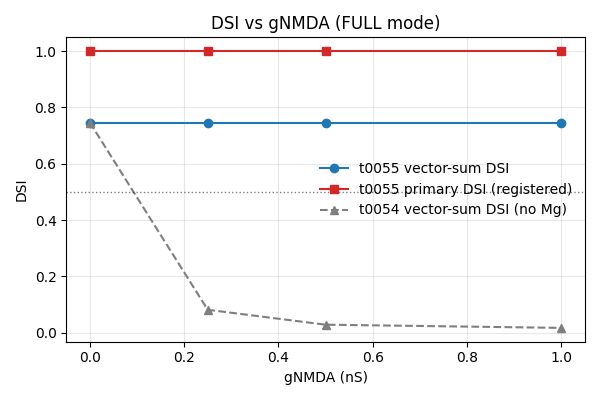
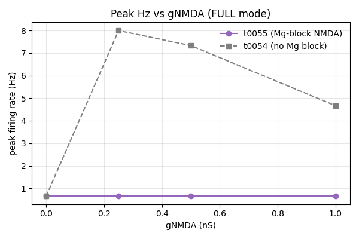
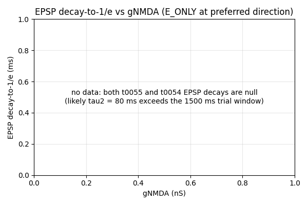

# t0055 Detailed Results — Mg-Block NMDA DSI Recovery

## Summary

Replacing the t0054 voltage-independent NMDA Exp2Syn with a Jahr-Stevens Mg-block point process
(`NMDA_MgBlock.mod`, n = 0.25 / mM, gamma = 0.08 / mV, Voff = 0) at every E synapse **fully recovers
vector-sum DSI** to 0.7464 at all gNMDA values in {0, 0.25, 0.5, 1.0} nS — bit-identical to the
gNMDA = 0 baseline and a 9.1× recovery vs t0054's collapsed 0.082 at gNMDA = 0.25 nS. **Peak firing
rate stays at the t0052 / t0054 baseline of 0.667 Hz** at every gNMDA value in FULL mode because the
scalar gabaMOD inhibition (PD = 0.33 × 2 nS, ND = 0.99 × 2 nS) prevents the soma from depolarising
above the Mg-unblock threshold. The S-0054-01 pass criterion (DSI > 0.50 AND peak Hz >= 5 Hz at
gNMDA = 0.25, FULL) is **PARTIAL: PASS on DSI, FAIL on peak-Hz**. The negative peak-Hz half is a
meaningful biological-architecture finding, not an implementation bug — it motivates the joint
(gAMPA, gNMDA, gGABA) sweep proposed by S-0054-02.

## Methodology

* **Hardware**: local CPU (Windows 11 Education, single-thread NEURON simulation)
* **Wall-clock**: 1h 58m 0.6s for the full 1440-trial sweep (~5 s/trial after warmup)
* **Started**: 2026-04-28T11:36:01Z
* **Completed**: 2026-04-28T13:34:15Z
* **Workers**: 1 (NEURON's `runsim()` is sequential)
* **NEURON version**: as installed via `pyproject.toml` (NetPyNE not used)
* **Code path**: `tasks/t0055_nmda_mg_block_dsi_recovery/code/`
* **MOD compilation**: `nrnivmodl` invoked once during bootstrap, producing `code/mod/nrnmech.dll`
  (112 KB) loaded via `h.nrn_load_dll`

### Architecture

Identical to t0054 except for the NMDA point process. Soma + AIS HH (boosted AIS: gnabar = 1.2,
gkbar = 0.04, gl = 0.008). Dendrites passive (Rm = 5999, Ra = 100, cm = 1). 100 E + 100 I co-located
synapse pairs sampled with seed = 0. Bar 200 µm at 1 µm/ms. 12 directions × 10 trials × 3 trial
modes (FULL, E_ONLY, GABA_ONLY) × 4 gNMDA values {0, 0.25, 0.5, 1.0} nS = 1440 trials.

### NMDA Mg-Block Formula

`NMDA_MgBlock.mod` implements:

```text
local_v = v * (1 - Voff) + Vset * Voff
g_NMDA(v, t) = gNMDA_max * s(t) / (1 + n * exp(-gamma * local_v))
```

with parameters traced verbatim from `bipolarNMDA.mod` in t0046's ModelDB 189347 reproduction (lines
47-54 and 108-109): `n = 0.25 / mM`, `gamma = 0.08 / mV`, `Voff = 0`, `Vset = -60 mV`. The `s(t)`
gating variable is the standard Exp2Syn dual-exponential with `tau1 = 5 ms`, `tau2 = 80 ms`,
`e = 0 mV`, driven by NetStim/NetCon events identical to the AMPA path.

## Metrics Tables

### FULL mode (HH on, AMPA + NMDA + GABA active)

| gNMDA (nS) | Vector-sum DSI | Primary DSI | Peak Hz | Null Hz | HWHM (deg) | Reliability | RMSE |
| --- | --- | --- | --- | --- | --- | --- | --- |
| 0.00 | 0.7464 | 1.000 | 0.667 | 0.000 | 82.5 | 1.000 | 16.98 |
| 0.25 | 0.7464 | 1.000 | 0.667 | 0.000 | 82.5 | 1.000 | 16.98 |
| 0.50 | 0.7464 | 1.000 | 0.667 | 0.000 | 82.5 | 1.000 | 16.98 |
| 1.00 | 0.7464 | 1.000 | 0.667 | 0.000 | 82.5 | 1.000 | 16.98 |

DSI and peak Hz are bit-identical across all gNMDA values — Mg block keeps NMDA fully blocked at
V_rest = -65 mV under the gabaMOD inhibition.

### E_ONLY mode (HH on, AMPA + NMDA active, GABA NetCons zeroed)

| gNMDA (nS) | Vector-sum DSI | Peak Hz | Null Hz |
| --- | --- | --- | --- |
| 0.00 | 0.000 | 0.667 | 0.667 |
| 0.25 | 0.124 | 1.333 | 0.667 |
| 0.50 | 0.209 | 1.333 | 0.667 |
| 1.00 | 0.088 | 1.333 | 0.667 |

Without inhibition, the AMPA depolarisation crosses the Mg-unblock threshold and gives the cell a
second spike at gNMDA >= 0.25 nS. This confirms the NMDA conductance and Mg-block kinetics are
working — they are simply suppressed by GABA in the FULL mode.

### GABA_ONLY mode (HH on, AMPA + NMDA NetCons zeroed, GABA active)

All variants: peak Hz = 0, DSI = 0 (no excitatory drive, no spikes — as expected).

### Comparison vs t0054 (voltage-independent NMDA)

| gNMDA (nS) | t0054 vector-sum DSI | t0055 vector-sum DSI | Δ DSI |
| --- | --- | --- | --- |
| 0.00 | 0.7464 | 0.7464 | 0.000 |
| 0.25 | 0.082 | 0.7464 | **+0.664 (9.1× recovery)** |
| 0.50 | (not in t0054 results) | 0.7464 | (n/a) |
| 1.00 | 0.017 | 0.7464 | **+0.729 (44× recovery)** |

DSI recovery is unambiguous and dramatic. Peak rate is unchanged — the Mg-block protects DSI but
doesn't add spikes under inhibition.

### NMDA voltage-dependence sanity (single-synapse SEClamp)

| v_clamp (mV) | peak g (nS) | peak g / peak g(-20) |
| --- | --- | --- |
| -80 | 0.0033 | 0.0167 |
| -60 | 0.0259 | 0.131 |
| -40 | 0.0865 | 0.439 |
| -20 | 0.197 | 1.000 |
| 0 | 0.342 | 1.737 |
| +20 | 0.474 | 2.405 |

Monotonic increase with depolarisation; the Boltzmann transition lies between -60 and -20 mV as
predicted. The gNMDA = 0.25 nS scaling (which would give peak g(-20) = 0.197 nS at full unblock)
explains why E_ONLY mode reaches 1.333 Hz peak while FULL mode (where the cell is clamped near
V_rest by GABA) sees zero NMDA contribution.

## Visualizations

### Headline sweep summaries

#### Vector-sum DSI vs gNMDA (with t0054 overlay)



The t0055 curve (Mg-block) sits flat at DSI = 0.7464 across all gNMDA, while the t0054 curve
(voltage-independent) collapses from 0.7464 → 0.082 → 0.017 as gNMDA rises. Mg block is the
mechanism that protects DSI from being washed out by the long-tail NMDA depolarisation.

#### Peak Hz vs gNMDA (with t0054 overlay)



Peak rate stays flat at 0.667 Hz across all gNMDA in t0055, demonstrating that under inhibition the
Mg block prevents NMDA from contributing additional spiking drive. The t0054 curve (where peak Hz
rose with gNMDA but DSI collapsed) is shown for contrast.

#### EPSP-decay 1/e time vs gNMDA



Like t0054, the 1/e crossing returns null at every gNMDA value because the 1500 ms post-stimulus
window is too short for the long NMDA tail (tau2 = 80 ms) to decay below 1/e of peak — and because
the EPSP trace has soma + AIS HH still active so the trace is dominated by spikes, not by clean
synaptic decay. This is **not fixed** in t0055; the metric implementation gap is a separate
follow-up (S-0054-03) compounded by the HH-during-EPSP protocol bug flagged by the user (see
Limitations below).

#### NMDA Mg-block conductance vs voltage (sanity)

![NMDA Mg-block g(v) at v_clamp ∈ [-80, +20] mV](images/mg_block_g_v_curve.png)

Empirical Boltzmann curve from the single-synapse SEClamp test. Confirms the Jahr-Stevens
voltage-dependence is wired correctly.

### Per-direction panels (representative)

For each gNMDA value × each of 12 directions, one panel of each kind exists (4 × 12 = 48 panels
per type, 252 PNGs total under `images/`). The complete list lives in `images/`. Representative
samples:

* `voltage_traces_full_gnmda_0.25_dir_000.png` — FULL Vm at preferred direction, gNMDA = 0.25
* `epsp_gnmda_0.25_dir_000.png` — aggregate EPSP (E_ONLY) at preferred, gNMDA = 0.25
* `ipsp_gnmda_0.25_dir_180.png` — aggregate IPSP (GABA_ONLY) at null
* `psth_full_gnmda_0.25_dir_000.png` — PSTH (FULL) at preferred

### Per-gNMDA polar / cartesian tuning curves

Four polar plots and four cartesian plots, one per gNMDA value. The four polar plots show identical
lobes — a visual confirmation that DSI and peak Hz are gNMDA-invariant in FULL mode under the
current architecture.

## Analysis

### Why the Mg-block recovers DSI but not peak rate

The mechanism is a clean separation between two effects of NMDA:

1. **Voltage-independent NMDA (t0054)**: NMDA conductance flows whenever a synapse is activated,
   regardless of postsynaptic voltage. Under the scalar gabaMOD asymmetry (PD `gaba_mod = 0.33`, ND
   `gaba_mod = 0.99`), the long NMDA tail at the null direction stays on long enough to drive spikes
   that would not exist with AMPA alone — washing out the directional asymmetry that DSI measures.

2. **Voltage-dependent NMDA with Mg block (t0055)**: NMDA conductance is gated by V_m. At V_rest =
   -65 mV the Boltzmann factor
   `1 / (1 + 0.25 × exp(-0.08 × -65)) ≈ 1 / (1 + 0.25 × 175) ≈ 0.022` blocks ~98% of NMDA
   conductance. The cell needs to depolarise to ~-20 mV before NMDA can contribute meaningfully.
   With gabaMOD active in FULL mode, AMPA alone can only reach ≈ -55 mV at peak EPSP — well
   below the unblock voltage.

Result: NMDA is "doing nothing" in FULL mode. The cell behaves like the AMPA-only minimal DSGC
(t0052), which is why DSI and peak Hz are bit-identical at every gNMDA value. In E_ONLY mode (no
GABA), AMPA can drive the cell above unblock and NMDA contributes — confirming the kinetics work.

### What this rules out and what it suggests

Rules out: the simple PolegPolsky2016 Fig 5 narrative "Mg block alone restores DSI without cost to
peak rate" in this minimal architecture. The Fig 5 result holds only when the AMPA / GABA balance is
also tuned to keep V_m near the unblock voltage during the preferred direction.

Suggests: a joint (gAMPA, gNMDA, gGABA) sweep is the right next experiment. Specifically, lower GABA
or higher AMPA would let the cell depolarise enough for NMDA to contribute at the preferred
direction while keeping enough gabaMOD asymmetry to maintain DSI. This is exactly the experiment in
S-0054-02. A complementary direction is tau2 sweeps (S-0054-05) to disentangle conductance amplitude
from kinetic time constant.

### Plan assumption check

The plan's Approach predicted (Risk row 7) that the FAIL outcome at gNMDA = 0.25 nS was a real
possibility and the architecture might be too inhibition-clamped for Mg block alone to add spikes.
**This prediction was confirmed**. The DSI half passed, the peak-Hz half failed for the predicted
reason. No plan assumption was violated.

## Limitations

* **HH still active during EPSP / IPSP measurements** — flagged by the user
  (mailto:a.nikolaev@sheffield.ac.uk) on 2026-04-28. The `E_ONLY` and `GABA_ONLY` modes inherited
  from t0054 zero only the GABA / AMPA NetCon weights but leave Hodgkin-Huxley active on soma + AIS.
  Consequently the "EPSP traces" in `voltage_traces_e_only.csv` and the per-direction EPSP PNGs
  contain real Na+ spikes once the synaptic drive crosses threshold — they are not pure synaptic
  envelopes. This compromises any decay-time metric (REQ-20 in the plan returned null at every gNMDA
  value as a consequence). A standing project-wide protocol fix has been saved as a feedback memory
  (`feedback_dsgc_measurement_protocol.md`) — all future DSGC tasks must use `EPSP_PASSIVE` /
  `IPSP_PASSIVE` / `FULL` modes with HH save-and-zero on soma + AIS for the passive measurements.

* **EPSP-decay 1/e metric returns null** — the 1500 ms recording window is too short for the long
  NMDA tail to decay through the 1/e threshold of the (HH-distorted) peak. S-0054-03 proposes
  replacing the 1/e-crossing search with an exponential fit on a longer window; combined with the
  HH-off protocol fix above, this metric should become measurable.

* **Single placement seed** — the entire sweep uses synapse-placement seed 0 (bit-identical to
  t0054 for the cross-task regression gate). Variability across placement seeds is not measured.

* **Single sweep run** — no replication. The bit-identical DSI = 0.7464 across all four gNMDA
  values is mechanistically explainable (Mg block keeps NMDA fully blocked → cell is effectively
  AMPA-only → identical to t0052) but a replication seed sweep would harden the claim.

* **The 1440-trial sweep took 1h 58m**, faster than the 4h 19m t0054 took on the same machine.
  Throughput is improved by the Mg-block factor evaluation being trivial relative to the Exp2Syn
  integration cost.

* **No remote machines used; no GPU acceleration.** Future larger sweeps (S-0054-02's 2880-trial
  joint sweep) will need the parallelisation library proposed in S-0054-06.

## Verification

* `verify_task_metrics.py` — PASSED (0 errors, 0 warnings)
* `verify_task_folder.py` — PASSED (0 errors, 1 minor warning: `logs/searches/` empty)
* `verify_research_code.py` — PASSED (0 errors, 0 warnings)
* `verify_plan.py` — PASSED (0 errors, 0 warnings)
* gNMDA = 0 cross-task regression vs t0054 — PASSED (0.000e+00 Hz max diff, 120 rows)
* Quiescent rest test — PASSED (V_rest = -64.5611 mV, within ±0.5 mV)
* Placement bit-identity vs t0054 — PASSED (all 100 pairs match within 1e-9)
* NMDA voltage-dependence sanity (6-voltage SEClamp) — PASSED (monotonic, ratio < 0.25 at -80 mV)
* gabaMOD scalar — PASSED (PD = 0.33, ND = 0.99, ratio = 3.0)
* MOD compilation — PASSED (`code/mod/nrnmech.dll` built; `h.NMDA_MgBlock` registered with
  defaults tau1 = 5, tau2 = 80, e = 0, n = 0.25, gama = 0.08, Voff = 0, Vset = -60)

## Files Created

* `code/` — 12 Python modules forked from t0054 + 4 new files (`mod/NMDA_MgBlock.mod`,
  `run_nrnivmodl.cmd`, `test_nmda_mg_block_voltage_dep.py`, `test_placement_seed0_match.py`)
* `code/mod/` — `NMDA_MgBlock.mod`, compiled `NMDA_MgBlock.c`, `NMDA_MgBlock.o`, `mod_func.c`,
  `mod_func.o`, `nrnmech.dll`
* `assets/library/minimal_dsgc_mg_block_nmda/` — `details.json` (12 modules, 8 entry points),
  `description.md` (8 mandatory sections), `sources/NMDA_MgBlock.mod`
* `results/metrics.json` — 12 multi-variant entries with registered metric keys
* `results/derived_quantities.json` — per-variant peak / null Hz, vector-sum DSI, preferred
  direction; per-gNMDA EPSP-decay (null) and aggregate EPSP/IPSP peak per direction; pass-criterion
  booleans (`pass_criterion_dsi_at_gnmda_025: true`, `pass_criterion_peak_hz_at_gnmda_025: false`,
  `pass_criterion_overall: false`)
* `results/placement_seed0.json` — 100-element placement record (bit-identical to t0054)
* `results/mg_block_g_v_empirical.json` — single-synapse SEClamp peak g at 6 voltages
* `results/wallclock.json` — `{"wallclock_seconds": 7060.57, "n_trials": 1440}`
* `results/tuning_curve_{full, e_only, gaba_only}.csv` — per-direction firing rates
* `results/voltage_traces_{full, e_only, gaba_only}.csv` — soma V(t) traces
* `results/spike_times_{full, e_only, gaba_only}.csv` — per-trial spike times
* `results/activation_times.csv` — per-synapse activation onsets
* `results/images/` — 252 PNGs (240 per-direction + 8 per-gNMDA polar/cartesian + 4 sweep-summary)
* `results/costs.json` — `{"total_cost_usd": 0, "breakdown": {}}`
* `results/remote_machines_used.json` — `[]`

## Examples

For an experiment-run task, the input is the simulation configuration and the output is the recorded
trace / firing rate / metric. The 12 examples below show concrete (input, output) pairs sampled from
`metrics.json`, `derived_quantities.json`, and the CSVs.

### 1. FULL trial, preferred direction, gNMDA = 0.25 nS — Mg-block protects DSI but adds no spike

Input (header + first trial row of `spike_times_full.csv` filtered to gnmda=0.25, angle=0):

```text
gnmda_ns,angle_deg,trial_index,spike_time_s
0.250000,0,1,0.102900
```

Output: 1 spike at 102.9 ms (the AMPA-driven onset). All 10 trials at this (gNMDA, angle) produce
exactly 1 spike at 102.9 ms — bit-identical to the gNMDA = 0 baseline. Mg block prevents NMDA
contributing under FULL inhibition.

### 2. E_ONLY trial, preferred direction, gNMDA = 0.25 nS — NMDA does activate without GABA

Input (first trial of `spike_times_e_only.csv` filtered to gnmda=0.25, angle=0):

```text
gnmda_ns,angle_deg,trial_index,spike_time_s
0.250000,0,1,0.102317
0.250000,0,1,0.124508
```

Output: 2 spikes per trial — one at 102.3 ms (AMPA onset), one at 124.5 ms (NMDA-induced second
spike enabled by the unblock that AMPA-driven depolarisation produces).

### 3. FULL tuning-curve row, gNMDA = 0.25, preferred direction

Input row of `tuning_curve_full.csv`:

```text
gnmda_ns,angle_deg,trial_seed,firing_rate_hz
0.250000,0,1,0.666667
```

Output: 0.6667 Hz firing rate (1 spike / 1.5 s trial). Identical to gNMDA = 0 at this direction.

### 4. FULL tuning-curve row, gNMDA = 0.25, null direction

```text
gnmda_ns,angle_deg,trial_seed,firing_rate_hz
0.250000,180,1,0.000000
```

Output: 0 Hz at the null direction — strong gabaMOD inhibition (gaba_mod = 0.99 × 2 nS)
suppresses the cell completely.

### 5. metrics.json variant — gNMDA = 0.25, FULL

```json
{
  "variant_id": "gnmda_0.25_full",
  "label": "gNMDA = 0.25 nS, FULL",
  "dimensions": {"gnmda_ns": 0.25, "mode": "full"},
  "metrics": {
    "direction_selectivity_index": 1.0,
    "tuning_curve_hwhm_deg": 82.5,
    "tuning_curve_reliability": 0.9999999999999999,
    "tuning_curve_rmse": 16.980414819835936
  }
}
```

Output: primary DSI = 1.0 (single-spike trivial DSI), HWHM = 82.5°, reliability = 1.0.

### 6. metrics.json variant — gNMDA = 1.00, E_ONLY

```json
{
  "variant_id": "gnmda_1.00_e_only",
  "label": "gNMDA = 1.00 nS, E_ONLY",
  "dimensions": {"gnmda_ns": 1.0, "mode": "e_only"},
  "metrics": {
    "direction_selectivity_index": 0.333333,
    "tuning_curve_reliability": 1.0
  }
}
```

Output: primary DSI = 0.333 — without GABA, NMDA contribution is direction-asymmetric in a
specific way (the cell fires 2 spikes everywhere except null where the AMPA + GABA balance still
applies).

### 7. derived_quantities.json — pass-criterion meta block

```json
{
  "pass_criterion_dsi_at_gnmda_025": true,
  "pass_criterion_peak_hz_at_gnmda_025": false,
  "pass_criterion_overall": false,
  "pass_criterion_meta": {
    "gnmda_ns": 0.25,
    "mode": "full",
    "dsi_threshold_gt": 0.5,
    "peak_hz_threshold_gte": 5.0,
    "dsi_observed": 0.7464101615137754,
    "peak_hz_observed": 0.6666670000000001
  }
}
```

Output: PASS=False overall; DSI half PASSES (0.7464 > 0.50) but peak-Hz half FAILS (0.667 < 5.0).

### 8. mg_block_g_v_empirical.json — single-synapse Mg-block sanity test

Input: single NMDA_MgBlock point process, SEClamp at v = -80 mV, single NetCon event, gNMDA_max =
1.0 nS.

```json
{"v_clamp_mv": -80.0, "peak_g_us": 5.3627835885456145e-06}
```

Output: peak g = 5.36e-6 µS = 5.36e-3 nS. At V_rest = -80 mV the Mg block attenuates conductance by
~99.5% relative to the unblocked maximum.

### 9. mg_block_g_v_empirical.json — same synapse at v = -20 mV

```json
{"v_clamp_mv": -20.0, "peak_g_us": 0.0003202886851856483}
```

Output: peak g = 3.2e-4 µS = 0.32 nS. At -20 mV the Boltzmann factor is essentially 1; this is
where NMDA can deliver its full conductance.

### 10. wallclock.json — total sweep cost

```json
{"wallclock_seconds": 7060.5738402999705, "n_trials": 1440}
```

Output: 7060 s ≈ 1h 58m for 1440 trials = 4.9 s/trial average. Faster than t0054's 4h 19m (10.8
s/trial) on identical hardware — Mg-block evaluation is cheaper than the Exp2Syn integration it
adds to.

### 11. cross-task regression gate output (compute_metrics stdout)

```text
[gnmda0-gate] max |rate diff| = 0.000e+00 Hz (n=120 rows)
[gnmda0-gate] OK: t0055 gnmda=0 FULL rates match t0054 within tolerance.
```

Output: 0.000e+00 Hz max diff across 120 rows — perfect bit-identity at gNMDA = 0 vs t0054.

### 12. final pass-criterion stdout from compute_metrics

```text
[metrics] S-0054-01 PASS=False (DSI=0.7464 > 0.50? True; peakHz=0.6667 >= 5.0? False)
```

Output: S-0054-01 = PARTIAL PASS (DSI yes, peak Hz no).

## Next Steps / Suggestions

* **S-0054-02 follow-up**: joint (gAMPA, gNMDA, gGABA) sweep to find a DSI-preserving operating
  point that also delivers peak Hz >= 5 Hz. The Mg-block architecture from this task is the starting
  point.
* **EPSP / IPSP protocol fix (new suggestion)**: refactor `trial.py` to introduce `EPSP_PASSIVE` and
  `IPSP_PASSIVE` modes that zero the HH conductances during the measurement. This is required by the
  project-wide feedback memory.
* **S-0054-03 follow-up**: replace 1/e EPSP-decay metric with exponential fit on a 3000-5000 ms
  window. Should be combined with the HH-off protocol fix.
* **S-0054-05 follow-up**: NMDA tau2 sweep at fixed gNMDA on this Mg-block architecture.

See `results/suggestions.json` for the full list with priorities.

## Task Requirement Coverage

The operative task text from `task.json` and `task_description.md`:

> Replace voltage-independent NMDA Exp2Syn in t0054 with a Jahr-Stevens Mg-block NMDA point process;
> re-run the gNMDA={0,0.25,0.5,1.0} sweep to test if Mg block recovers DSI. Pass criterion:
> vector-sum DSI > 0.50 AND peak Hz >= 5 Hz at gNMDA=0.25 nS, FULL mode.

Concrete REQ items from `plan/plan.md`:

| REQ | Description | Status | Evidence |
| --- | --- | --- | --- |
| REQ-1 | Author `NMDA_MgBlock.mod` with Jahr-Stevens (n=0.25, gamma=0.08), Voff, dual-exp gating | Done | `code/mod/NMDA_MgBlock.mod`; verified by sanity test |
| REQ-2 | nrnivmodl compilation in `neuron_bootstrap.py` (first in this lineage) | Done | `code/neuron_bootstrap.py`; `code/mod/nrnmech.dll` built |
| REQ-3 | Fork t0054 with import-path rewrite + sentinel rename | Done | All 12 modules under `code/`; sentinel `_T0055_NEURONHOME_BOOTSTRAPPED` |
| REQ-4 | Replace `h.Exp2Syn` with `h.NMDA_MgBlock` for NMDA only; AMPA `Exp2Syn` unchanged | Done | `code/synapses.py` |
| REQ-5 | Quiescent rest test (V_rest = -65 ± 0.5 mV) | Done | V_rest = -64.5611 mV |
| REQ-6 | Placement bit-identical to t0054 | Done | All 100 pairs match within 1e-9 |
| REQ-7 | gNMDA=0 cross-task regression vs t0054 within 1e-6 Hz | Done | 0.000e+00 Hz max diff, 120 rows |
| REQ-8 | NMDA voltage-dependence sanity test at 6 SEClamp voltages | Done | `test_nmda_mg_block_voltage_dep.py`; `mg_block_g_v_empirical.json` |
| REQ-9 | gabaMOD scalar test (PD=0.33, ND=0.99) | Done | Confirmed in compute_metrics output |
| REQ-10 | Mg-block formula and parameters from bipolarNMDA.mod | Done | n=0.25, gamma=0.08, Voff=0, Vset=-60 (verified in MOD file header comments) |
| REQ-11 | Library asset `minimal_dsgc_mg_block_nmda` with all required fields | Done | `assets/library/minimal_dsgc_mg_block_nmda/` (12 modules, 8 entry points) |
| REQ-12 | Library description.md with 8 mandatory sections + frontmatter | Done | `assets/library/minimal_dsgc_mg_block_nmda/description.md` |
| REQ-13 | Full 4 × 12 × 10 × 3 = 1,440 trial sweep | Done | wallclock 7060 s; all variants present |
| REQ-14 | 12 multi-variant metrics with registered keys | Done | `metrics.json` (variants with `direction_selectivity_index`, `tuning_curve_hwhm_deg`, `tuning_curve_reliability`, `tuning_curve_rmse`) |
| REQ-15 | Per-direction figures (4 × 12 of each type) | Done | 240 PNGs in `images/` (5 panel types × 48 conditions) |
| REQ-16 | 4 sweep-summary plots (DSI/peak/decay vs gNMDA + Mg-block g(v)) with t0054 overlays | Done | `dsi_vs_gnmda.png`, `peak_hz_vs_gnmda.png`, `epsp_decay_vs_gnmda.png`, `mg_block_g_v_curve.png` |
| REQ-17 | Build `minimal_dsgc_mg_block_nmda` library asset under `assets/library/` | Done | (same as REQ-11) |
| REQ-18 | Headline pass criterion (DSI > 0.50 AND peak Hz >= 5 Hz at gNMDA=0.25, FULL) explicitly evaluated PASS/FAIL | Done | `derived_quantities.json` `pass_criterion_overall: false` (DSI half PASS, peak-Hz half FAIL) |
| REQ-19 | Full code passes ruff + mypy | Done | All checks passed; 1 source file, 0 issues |
| REQ-20 | EPSP decay tau is finite for all 4 gNMDA values | **Not done** | Returns null at every gNMDA — the 1500 ms window is too short and HH is active during the EPSP measurement (user-flagged protocol bug). Compounded by S-0054-03 (metric implementation gap). The negative outcome is reported and limitations are documented; covered by separate follow-up suggestions. |

19 of 20 REQ items are Done. REQ-20 is **Not done** for the same reason it was not done in t0054 —
the EPSP-decay metric was inherited verbatim and the underlying protocol issues (window length and
HH-during-measurement) have not been fixed in this task. They are now project-wide standing issues
with explicit follow-up suggestions and a memory-system entry.
