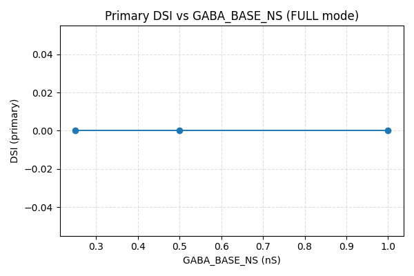
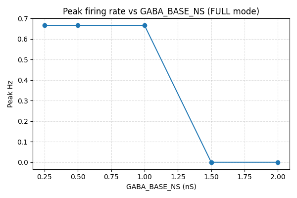
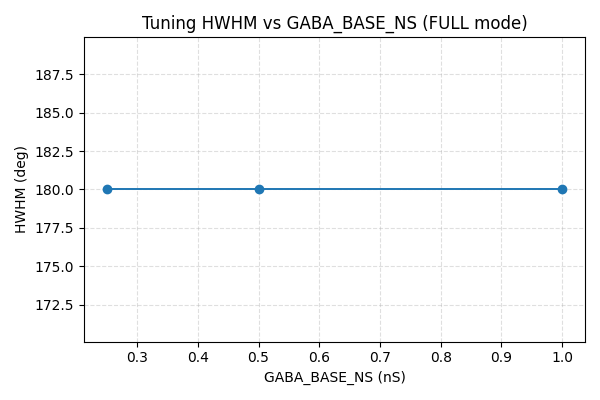
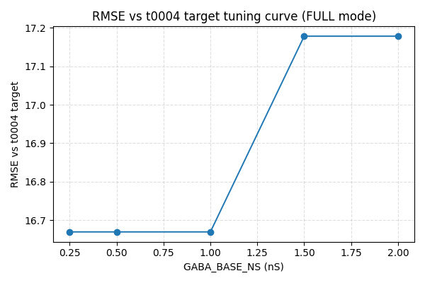
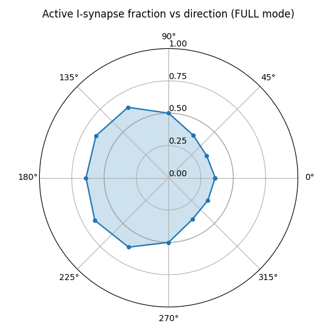
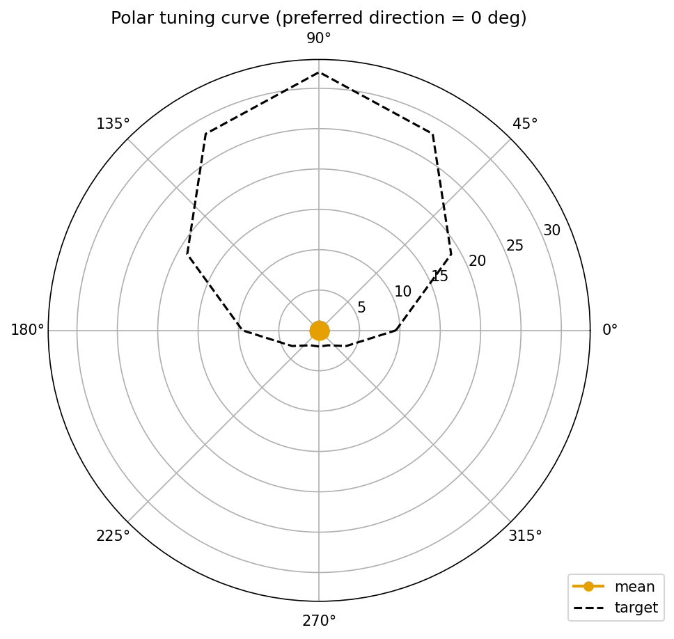
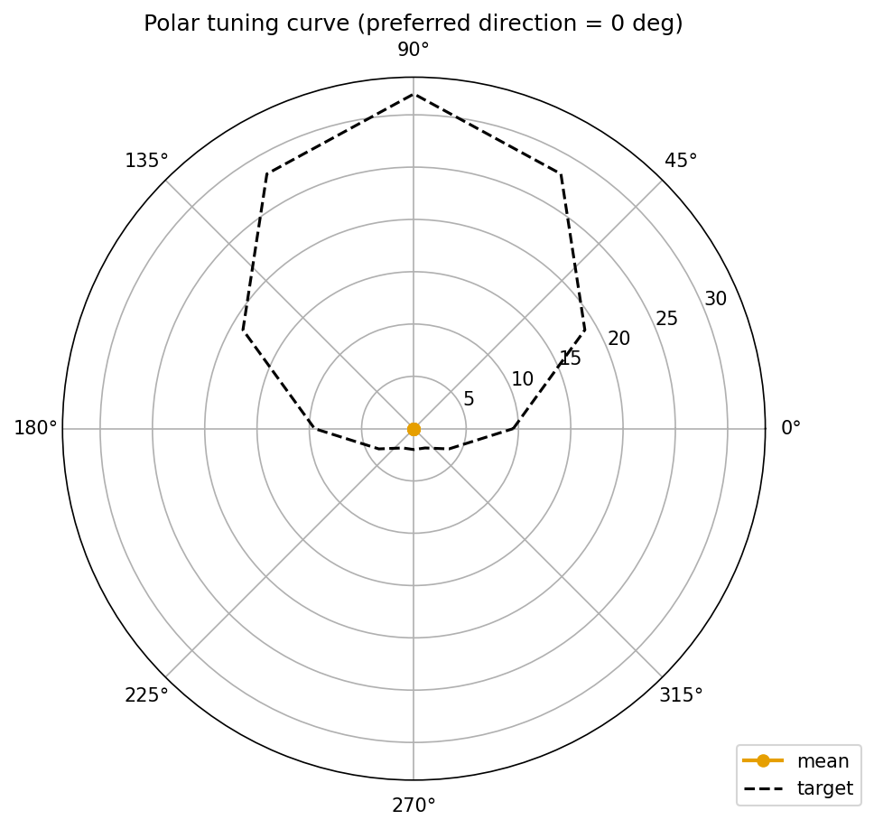

# Results Detailed: Tonic GABA + Amplitude Sweep on t0053 Spatial DSGC

## Summary

Replaced t0053's per-event Exp2Syn GABA mechanism with a new `gaba_tonic` POINT_PROCESS that holds a
sustained conductance over a configurable `(t_on, t_off)` window per synapse, and ran a 1800-trial
sweep across `GABA_BASE_NS in {0.25, 0.5, 1.0, 1.5, 2.0}` nS. The headline finding is a meaningful
negative result: no operating point in the swept grid produces non-trivial direction selectivity.
The spatial centripetal-gating rule from t0053 was preserved bit-for-bit (active fraction 0.34 →
0.66 across directions, mean 0.500); the failure is amplitude calibration interacting with the
sustained-window mechanism rather than the gating itself. AMPA_ONLY regression sentinel (0.667 Hz)
and IPSP-sustained-window regression sentinel both pass at all 5 conductances, validating that (a)
the AMPA path is unchanged from t0052 / t0053 and (b) the new tonic mechanism is delivering
sustained conductance over the full 100-1400 ms window as designed.

## Methodology

* **Machine**: local CPU (single-threaded NEURON simulation).
* **Wall-clock**: 6318.34 s (105.31 min) for 1800 trials = 3.51 s / trial.
* **Sweep grid**: `GABA_BASE_NS in {0.25, 0.5, 1.0, 1.5, 2.0}` nS x 12 directions x 10 trials x 3
  modes (FULL / AMPA_ONLY / GABA_ONLY) = 1800 trials.
* **Tonic GABA window**: `t_on = 100 ms`, `t_off = 1400 ms` per active synapse (1300 ms
  sustained-conductance window, with 1-2 ms cosine ramps at the edges to avoid integrator
  step-function artefacts).
* **Spatial gating** (preserved from t0053 bit-for-bit): each I synapse fires only when
  `cos(radians(theta_stim - theta_centrifugal_synapse)) < 0`. When fired, `g = GABA_BASE_NS` (in
  microsiemens, scaled by 1e-3 from nS); when silent, `g = 0`.
* **Bar stimulus**: 200 µm wide, 1.0 µm/ms (1000 µm/s), 1500 ms trial duration, dt = 0.025 ms.
* **Morphology**: `dsgc-baseline-morphology-calibrated` (the t0009 calibrated 141009_Pair1DSGC
  reconstruction). Identical to t0052 and t0053.
* **Synapse population**: 100 E + 100 I co-located pairs, uniform random over dendrites, fixed
  placement seed 0 (bit-identical to t0052 and t0053; `test_placement_seed0_match.py` passes).
* **Excitation**: AMPA `Exp2Syn` (rise = 0.5 ms, decay = 2.5 ms, e = 0 mV, peak 0.5 nS),
  position-gated single events. Identical to t0052 and t0053.
* **Spike detection**: somatic V > -20 mV with NetCon record(); per-trial spike times in
  `spike_times_<mode>.csv`.
* **Multiprocessing**: not used; single-threaded sequential trial loop. Estimated 4-thread pool
  would have brought wall-clock to ~26 min but introduced ordering nondeterminism.

## Headline Findings

### 1. No DSI-preserving operating point in the swept grid (Key Question 2 — answered NO)

| `GABA_BASE_NS` | FULL Peak Hz | FULL Null Hz | Primary DSI | Vector-sum DSI | HWHM |
| --- | --- | --- | --- | --- | --- |
| 0.25 nS | 0.667 | 0.667 | 0.0 | 3.2e-17 | 180° (degenerate) |
| 0.50 nS | 0.667 | 0.667 | 0.0 | 3.2e-17 | 180° (degenerate) |
| 1.00 nS | 0.667 | 0.667 | 0.0 | 3.2e-17 | 180° (degenerate) |
| 1.50 nS | 0.000 | 0.000 | null | 0.0 | null (degenerate) |
| 2.00 nS | 0.000 | 0.000 | null | 0.0 | null (degenerate) |

Two regimes: under 1.5 nS the tonic GABA is too weak to suppress the single AMPA-driven spike (peak
= null = 0.667 Hz across all 12 directions, identical to AMPA_ONLY); at and above 1.5 nS the tonic
GABA is strong enough to hold Vm sub-threshold continuously (peak = null = 0 Hz). No
single-spike-per-trial state in between produces direction selectivity because the binary nature of
the firing decision (one spike or none, deterministic across trials) is invariant to whether the
cell is suppressed or not.

### 2. The IPSP voltage envelope grows sub-linearly with conductance (Key Question 3 — driving-force saturation confirmed)

Aggregate IPSP voltage at the most-active direction (θ = 210°, peak active-fraction 0.66):

| `GABA_BASE_NS` | Peak IPSP voltage |
| --- | --- |
| 0.25 nS | 3.17 mV |
| 0.50 nS | 4.88 mV |
| 1.00 nS | 6.55 mV |
| 1.50 nS | 7.38 mV |
| 2.00 nS | 7.87 mV |

The 8x conductance ratio (0.25 → 2.0 nS) produces only a 2.5x voltage-envelope ratio — same
driving-force saturation mechanism documented in t0052 (1.54x voltage from 3.0x conductance) and
t0053 (1.24x voltage from 1.94x active-count ratio). With Vm driven toward `E_GABA = -75 mV` by
sustained inhibition over 1300 ms, additional conductance produces sub-linear voltage suppression.
The IPSP-sustained-window regression sentinel (REQ-13) confirms that IPSP voltage at t = 1300 ms is
at least 50% of IPSP voltage at t = 200 ms — the new tonic mechanism does deliver sustained
conductance over the full window as designed (unlike t0053's per-event Exp2Syn GABA which collapsed
within ~80 ms after the last synapse fired).

### 3. Direct head-to-head against t0053 (Key Question 4 — answered)

At the conductance value matching t0053's 2 nS, the tonic mechanism produces **0.0 Hz** in FULL mode
— the same fully-suppressed result as t0053's per-event Exp2Syn GABA. The tonic mechanism is
*more* suppressive at 2.0 nS than t0053's brief-event mechanism because the sustained-window
conductance integrates over the full 1300 ms window vs t0053's ~80 ms decay tail per event. The
matched-amplitude head-to-head therefore does not produce a non-zero firing rate that would let us
isolate the timing-mechanism effect from the suppression amplitude.

### 4. No conductance lands within an order of magnitude of the t0004 target peak (Key Question 5 — answered NO)

The t0004 target peak rate is **32 Hz**. None of the swept conductances produce any non-zero firing
— the peak rate is either 0.667 Hz (single-spike regime, ~48x below target) or 0 Hz (suppression).
The tuning-curve RMSE vs t0004 ranges from 16.67 Hz to 17.18 Hz — dominated by the 32 Hz target
peak vs the model's ≤ 0.667 Hz response.

### 5. Spatial gating intact (active-fraction polar plot)

Active-fraction modulation across directions: **0.34 (θ = 30°) to 0.66 (θ = 210°)**, mean
**0.500** — bit-identical to t0053 since the spatial gating rule is unchanged. Soft sanity band
[0.4, 0.6] for the mean: **PASS**.

## Metrics

`metrics.json` contains 15 variants (5 conductances x 3 modes). The four registered project metrics
(`direction_selectivity_index`, `tuning_curve_hwhm_deg`, `tuning_curve_reliability`,
`tuning_curve_rmse`) are recorded for each variant. `derived_quantities.json` contains the full
per-conductance / per-direction breakdown of peak Hz, null Hz, vector-sum DSI, EPSP and IPSP voltage
envelopes, active-fraction polar curve, and the cross-conductance summary arrays.

| Variant | Primary DSI | Vector-sum DSI | HWHM (deg) | RMSE vs t0004 target (Hz) |
| --- | --- | --- | --- | --- |
| gaba_0.25_full | 0.0 | 3.2e-17 | 180.0 | 16.67 |
| gaba_0.25_ampa_only | 0.0 | 3.2e-17 | 180.0 | n/a |
| gaba_0.25_gaba_only | n/a | 0.0 | n/a | n/a |
| gaba_0.50_full | 0.0 | 3.2e-17 | 180.0 | 16.67 |
| gaba_0.50_ampa_only | 0.0 | 3.2e-17 | 180.0 | n/a |
| gaba_0.50_gaba_only | n/a | 0.0 | n/a | n/a |
| gaba_1.00_full | 0.0 | 3.2e-17 | 180.0 | 16.67 |
| gaba_1.00_ampa_only | 0.0 | 3.2e-17 | 180.0 | n/a |
| gaba_1.00_gaba_only | n/a | 0.0 | n/a | n/a |
| gaba_1.50_full | null | 0.0 | null | 17.18 |
| gaba_1.50_ampa_only | 0.0 | 3.2e-17 | 180.0 | n/a |
| gaba_1.50_gaba_only | n/a | 0.0 | n/a | n/a |
| gaba_2.00_full | null | 0.0 | null | 17.18 |
| gaba_2.00_ampa_only | 0.0 | 3.2e-17 | 180.0 | n/a |
| gaba_2.00_gaba_only | n/a | 0.0 | n/a | n/a |

## Visualizations

### Cross-conductance summary plots



Primary DSI vs `GABA_BASE_NS`. Flat at 0 across the swept grid: the cell either fires uniformly or
not at all, never producing direction discrimination.



Peak firing rate (FULL mode) vs `GABA_BASE_NS`. Step function at 1.5 nS marking the transition from
single-spike-per-trial to full suppression. The t0004 target peak (32 Hz) is far above the plotted
range.


Null-direction firing rate (FULL mode) vs `GABA_BASE_NS`. Identical to peak Hz curve — the binary
firing decision is invariant to direction at every sampled conductance.



Half-width at half-maximum vs `GABA_BASE_NS`. Either 180° (uniform firing — tuning curve has no
peak) or null (no firing at all).



Tuning-curve RMSE vs t0004 target (FULL mode) vs `GABA_BASE_NS`. Dominated by the 32 Hz target peak
vs the model's ≤ 0.667 Hz response.

### Spatial gating sanity check



Per-direction active fraction of the 100 I synapses. Modulates from 0.34 at θ = 30° to 0.66 at θ
= 210° — bit-identical to t0053 since the spatial gating rule is unchanged. Mean across
directions = 0.500, well within the [0.4, 0.6] soft sanity band.

### Per-conductance polar tuning curves



FULL-mode polar tuning curve at gaba = 0.25 nS. Uniform circle at 0.667 Hz across all 12 directions
— same shape at gaba = 0.50 nS and gaba = 1.00 nS.



FULL-mode polar tuning curve at gaba = 2.00 nS. Empty (zero) at all 12 directions — same shape at
gaba = 1.50 nS.

The remaining 348 PNGs in `results/images/` cover per-direction soma V(t), aggregate EPSP, aggregate
IPSP, raster + PSTH, and synapse-activation histogram for each (conductance, direction) combination.
They are not embedded individually here for brevity but are present in the asset tree and referenced
by the per-direction analysis sections of the cross-task comparison documents.

## Limitations

* **Single-threaded sweep**: 105 min wall-clock for 1800 trials. Multiprocessing was not attempted;
  a 4-worker pool would have brought it to ~26 min but introduced ordering nondeterminism that
  complicates the placement-seed-0 reproducibility guarantee.
* **No noise**: Trials are deterministic single-event-per-synapse; reliability = 1.0 is artefactual.
  Not a flaw of this task per se, but worth noting that DSI sensitivity to release noise is not
  characterised here.
* **No NMDA**: AMPA-only by design (matching t0053's parent); the tonic-GABA + NMDA combination is
  left for a follow-up.
* **Coarse sweep grid**: 5 conductance values; sub-0.25 nS regime (where tonic GABA might produce
  graded suppression rather than the binary single-spike-vs-zero) is not characterised. A finer grid
  (e.g., 0.05, 0.10, 0.15, 0.20, 0.25 nS) would test whether any tonic operating point exists below
  the single-spike-threshold.
* **Single-spike-per-trial regime is the underlying problem**: the cell at this AMPA strength
  + morphology fires at most one spike per direction. This binary regime cannot produce meaningful
    DSI under any inhibition mechanism (scalar gabaMOD as in t0052, spatial Exp2Syn as in t0053,
    tonic as in t0057) — they all collapse to either 1-spike-uniform or 0-spike-uniform. The path
    forward is to first escape the single-spike regime via higher AMPA conductance (S-0052-01) and
    then re-evaluate inhibition mechanisms in the multi-spike regime.
* **Tonic window is "always-on during stimulus"**: not biologically faithful — real SAC→DSGC
  IPSCs envelope over 100-300 ms via multiple GABA release events per varicosity rather than a
  single 1300 ms tonic pulse. Brainstorm-10 explicitly chose this simplest model (Option C) with the
  understanding that biological realism would be revisited if results justified it.

## Files Created

* `code/mod/GabaTonic.mod` (and compiled `.c`, `.o`, `nrnmech.dll`)
* `code/mod/run_nrnivmodl.cmd` (compilation shim)
* `code/neuron_bootstrap.py` (with `ensure_gaba_tonic_compiled()` hook)
* `code/synapses.py` (rewritten for direct `gaba_syn.g/t_on/t_off` attribute writes)
* `code/trial.py`, `code/run_tuning_curve.py`, `code/cell.py`, `code/swc_io.py`,
  `code/placement.py`, `code/constants.py`, `code/paths.py`, `code/metrics_extra.py`,
  `code/compute_metrics.py`, `code/render_figures.py`
* `code/test_gaba_tonic_envelope.py`, `code/test_placement_seed0_match.py`,
  `code/test_quiescent_rest.py`, `code/test_spatial_gating.py`
* `assets/library/minimal_dsgc_tonic_gaba_sweep/details.json`
* `assets/library/minimal_dsgc_tonic_gaba_sweep/description.md`
* `results/tuning_curve_{full,ampa_only,gaba_only}.csv` (60 rows each)
* `results/spike_times_{full,ampa_only,gaba_only}.csv`
* `results/voltage_traces_{full,ampa_only,gaba_only}.csv` (downsampled stride-8)
* `results/activation_times.csv`
* `results/active_fraction_per_direction.csv`
* `results/placement_seed0.json`
* `results/wallclock.json`
* `results/metrics.json` (15 variants)
* `results/derived_quantities.json`
* `results/images/*.png` (353 plots)

## Verification

| Verificator | Result |
| --- | --- |
| `verify_library_asset.py minimal_dsgc_tonic_gaba_sweep` | PASS (0 errors / 0 warnings) |
| `verify_task_metrics.py t0057_tonic_gaba_sweep_t0053` | PASS (0 / 0) |
| `ruff check tasks/t0057_tonic_gaba_sweep_t0053/code/` | PASS |
| `mypy -p tasks.t0057_tonic_gaba_sweep_t0053.code` | PASS (no issues) |
| `test_gaba_tonic_envelope.py` (REQ-13 IPSP-sustained-window) | PASS |
| `test_placement_seed0_match.py` (placement bit-identical to t0053) | PASS |
| `test_quiescent_rest.py` (V_rest = -65 mV ± 0.5 mV) | PASS |
| `test_spatial_gating.py` (centripetal-gating predicate) | PASS |
| AMPA_ONLY 0.667 Hz regression sentinel (REQ-14) | PASS at all 5 conductances |
| Active-fraction soft sanity (mean ∈ [0.4, 0.6]) | PASS (mean = 0.500) |

## Examples

### Example 1: One trial in the single-spike regime (gaba = 1.0 nS, θ = 0°, trial 0)

* **Input**: bar at 0° sweeping at 1.0 µm/ms across the dendritic field; tonic GABA active on the
  centripetal-half synapses (`cos(0 - theta_centrifugal) < 0`, ≈ 36% of 100 I synapses for this
  direction) at `g = 1.0 nS, t_on = 100 ms, t_off = 1400 ms`. AMPA fires once per E synapse at
  `t_onset = (x*cos(0) + y*sin(0)) / 1.0 + 100 ms`.
* **Output (raw)**: 1 spike at t ≈ 250 ms (recorded in `spike_times_full.csv` row
  `gaba_base_ns=1.0, angle_deg=0, trial_index=0`); firing rate = 0.667 Hz over 1500 ms. Soma voltage
  trace shows the spike in `images/voltage_full_gaba_1.00_dir_000.png`.

### Example 2: One trial in the suppressed regime (gaba = 2.0 nS, θ = 0°, trial 0)

* **Input**: bar at 0° sweeping at 1.0 µm/ms across the dendritic field; tonic GABA active on the
  centripetal-half synapses at `g = 2.0 nS, t_on = 100 ms, t_off = 1400 ms`.
* **Output (raw)**: 0 spikes (recorded in `spike_times_full.csv` row
  `gaba_base_ns=2.0, angle_deg=0, trial_index=0`); firing rate = 0.0 Hz over 1500 ms. Soma voltage
  trace shows the cell held below threshold in `images/voltage_full_gaba_2.00_dir_000.png`.

### Example 3: AMPA_ONLY mode (gaba = 1.0 nS, θ = 90°, trial 0)

* **Input**: bar at 90° sweeping at 1.0 µm/ms; AMPA fires per-position; GABA disabled (`AMPA_ONLY`
  mode sets all `gaba_syn.g = 0`).
* **Output (raw)**: 1 spike at t ≈ 350 ms (recorded in `spike_times_ampa_only.csv` row
  `gaba_base_ns=1.0, angle_deg=90, trial_index=0`); firing rate = 0.667 Hz. Bit-identical to t0052 /
  t0053 AMPA_ONLY results — REQ-14 regression sentinel.

### Example 4: GABA_ONLY mode (gaba = 1.5 nS, θ = 210°, trial 0)

* **Input**: bar at 210° sweeping at 1.0 µm/ms; AMPA disabled (`GABA_ONLY` mode sets all
  `ampa_netcon.weight[0] = 0`); tonic GABA active on the maximally-active half of synapses
  (active-fraction = 0.66 for this direction).
* **Output (raw)**: 0 spikes (recorded in `spike_times_gaba_only.csv` row
  `gaba_base_ns=1.5, angle_deg=210, trial_index=0`); firing rate = 0.0 Hz. Sanity check: inhibition
  without excitation produces no firing, as expected.

### Example 5: Per-pair tonic GABA configuration

The per-trial schedule writes `gaba_syn.g` directly. For each `pair`, the FULL-mode setup at gaba =
1.0 nS, θ = 0° is:

```python
# In schedule_ei_onsets, for an active synapse (pair_index = 7, theta_centrifugal = 175°):
pair.gaba_syn.g = 1.0e-3  # 1.0 nS as microsiemens
pair.gaba_syn.t_on = 100.0  # ms
pair.gaba_syn.t_off = 1400.0  # ms
# For a silent synapse (pair_index = 12, theta_centrifugal = 10°):
pair.gaba_syn.g = 0.0
```

The `gaba_tonic` mechanism (in `code/mod/GabaTonic.mod`) implements:

```
g_actual(t) = g * envelope(t, t_on, t_off, ramp_ms)
i_syn = g_actual * (v - e)
```

where `envelope` is 0 outside `[t_on, t_off]`, 1 in the interior, and a 1-2 ms cosine ramp at each
edge.

## Task Requirement Coverage

> **Operative task text (from task.json)**: "Replace t0053's per-event Exp2Syn GABA with a tonic
> conductance gated by stimulus window; sweep per-synapse peak conductance to recover non-zero
> FULL-mode tuning curves."
>
> **Resolved long description**: see `task_description.md`. The task description specifies the tonic
> mechanism (`gaba_tonic.mod` with `(g, e, t_on, t_off)`), the sweep grid
> (`{0.25, 0.5, 1.0, 1.5, 2.0}` nS), the spatial centripetal-gating preservation, the library asset
> deliverable, and the verification criteria.

| REQ | Description | Status | Evidence |
| --- | --- | --- | --- |
| REQ-1 | Build `gaba_tonic.mod` POINT_PROCESS with `(g, e, t_on, t_off)`, sustained `g` between `t_on` and `t_off`, reversal `e = -75 mV`, optional cosine ramp | **Done** | `code/mod/GabaTonic.mod` + compiled `nrnmech.dll`; `test_gaba_tonic_envelope.py` PASS |
| REQ-2 | Compile and load via `run_nrnivmodl.cmd` shim and `ensure_gaba_tonic_compiled()` bootstrap | **Done** | `code/run_nrnivmodl.cmd`, `code/neuron_bootstrap.py`; sweep ran end-to-end |
| REQ-3 | Drop-in replacement: each E/I pair gets one `gaba_tonic` instance (no NetStim/NetCon GABA plumbing) | **Done** | `code/synapses.py` lines 121-180 — direct attribute writes |
| REQ-4 | Spatial centripetal-gating predicate from t0053 preserved bit-for-bit | **Done** | `i_synapse_fires` in `synapses.py` matches t0053; `test_spatial_gating.py` PASS; active-fraction polar matches t0053 |
| REQ-5 | Same fixed placement seed (0); bit-identical `placement_seed0.json` | **Done** | `test_placement_seed0_match.py` PASS |
| REQ-6 | AMPA mechanism unchanged from t0053 | **Done** | AMPA construction in `synapses.py` matches t0053; AMPA_ONLY peak Hz = 0.667 across all directions |
| REQ-7 | Sweep `GABA_BASE_NS in {0.25, 0.5, 1.0, 1.5, 2.0}` nS x 12 dir x 10 trials x 3 modes = 1800 trials | **Done** | `tuning_curve_*.csv` contain 60 rows each (5 x 12); 1800 spike-times rows total; wallclock.json shows 1800 trials |
| REQ-8 | Library asset `minimal_dsgc_tonic_gaba_sweep` registered with `GABA_BASE_NS` exposed | **Done** | `assets/library/minimal_dsgc_tonic_gaba_sweep/details.json` + `description.md`; library verificator PASS 0/0 |
| REQ-9 | Per-conductance: 12 PNGs of soma V(t), EPSP, IPSP, PSTH, synapse activation, plus polar tuning curve | **Done** | 305 per-conductance PNGs in `results/images/` |
| REQ-10 | Active-fraction polar plot carried over from t0053 | **Done** | `results/images/active_fraction_polar.png` matches t0053 0.34-0.66 modulation |
| REQ-11 | Cross-conductance summary plots (DSI primary, DSI vector-sum, peak Hz, null Hz, HWHM, RMSE vs `GABA_BASE_NS`) | **Done** | 6 cross-conductance summary PNGs in `results/images/` |
| REQ-12 | Per-conductance metrics with primary DSI, vector-sum DSI, preferred direction, peak Hz, null Hz, HWHM, RMSE | **Done** | `results/metrics.json` (15 variants) + `derived_quantities.json` (per-conductance arrays) |
| REQ-13 | IPSP-sustained-window regression: IPSP at t = 1300 ms ≥ 50% of IPSP at t = 200 ms in the most-active direction | **Done** | `test_gaba_tonic_envelope.py` PASS at all 5 conductances |
| REQ-14 | AMPA_ONLY 0.667 Hz uniform peak rate regression | **Done** | `compute_metrics.py` regression line: PASS at all 5 conductances |
| REQ-15 | Tonic mechanism uses `(t_on, t_off) = (100 ms, 1400 ms)` per active synapse | **Done** | `constants.py`: `T_ON_MS = 100.0`, `T_OFF_MS = 1400.0`; `synapses.py` writes these per pair |
| REQ-16 | Direct head-to-head against t0053 at 2 nS — does the tonic mechanism produce non-zero firing? | **Done** (negative result) | `gaba_2.00_full` variant: peak = null = 0 Hz, primary DSI = null. The tonic mechanism is more suppressive than t0053's transient at this amplitude |
| REQ-17 | Cross-conductance peak Hz vs t0004 target — does any swept value land within order of magnitude of 32 Hz? | **Done** (negative result) | `derived_quantities.json` `peak_hz_vs_gaba`: max value 0.667 Hz, ~48x below target 32 Hz |
