# Results Detailed: Bar-Arrival-Locked Tonic GABA + AMPA Escape Sweep on t0057 Substrate

## Summary

Forked t0057's `minimal_dsgc_tonic_gaba_sweep` library and applied four bundled changes: (a)
replaced the global tonic-GABA window `(t_on, t_off) = (100, 1400) ms` with per-synapse
bar-arrival-locked windows
`t_on_i = (x_i cos theta + y_i sin theta) / v + 100 ms, t_off_i = t_on_i + 200 ms`; (b) added
`EPSP_PASSIVE` / `IPSP_PASSIVE` trial modes that save-and-zero `gnabar_hh` / `gkbar_hh` on `soma`
and `axon_initial_segment` (replacing legacy `AMPA_ONLY` / `GABA_ONLY`); (c) exposed gAMPA as a
public per-synapse parameter and swept a 5x5 `(gAMPA, GABA_BASE_NS)` grid; (d) standardised
`TSTOP_MS = 1400 ms`. Total budget: 25 cells x 12 directions x 10 trials x 3 modes = 9000 trials.
Headline negative finding: **no operating point in the swept grid produces multi-spike firing or
non-trivial direction selectivity**. The maximum FULL-mode peak rate is 2.143 Hz (3 spikes / 1.4 s,
4 cells); the maximum vector-sum DSI is 0.209. Both new mechanisms validate independently — the
bar-locked windows produce a measurable 8.5 ms direction-dependent IPSP centre-of-mass shift
(REQ-13), and the HH save-and-zero correctly drives EPSP_PASSIVE peak Vm to -9.04 mV worst-case
(REQ-15) and matches a FULL reference trace bit-for-bit at atol = 1e-6 mV (REQ-14). The cell simply
does not enter multi-spike firing under any (gAMPA, GABA) combination on this passive-dendrite,
AMPA-only-excitation substrate.

## Methodology

* **Machine**: local CPU (single-threaded NEURON simulation under CVODE, `atol = 1e-3`).
* **Sweep window**: started 2026-04-29T08:41:08Z, completed 2026-04-29T20:17:00Z (full sweep
  inclusive of metric and figure rendering).
* **Wall-clock (simulation only)**: 41621.91 s (11.56 h) for 9000 trials = 4.62 s / trial average.
* **Sweep grid**: `gAMPA in {0.5, 1.0, 2.0, 3.0, 4.0}` nS x
  `GABA_BASE_NS in {0.1, 0.2, 0.5, 1.0, 2.0}` nS x 12 directions x 10 trials x 3 modes (FULL /
  EPSP_PASSIVE / IPSP_PASSIVE) = 9000 trials.
* **GABA windowing (NEW)**: per-synapse bar-arrival-locked windows. For each active synapse `i` at
  coordinate `(x_i, y_i)`, `t_on_i = (x_i cos(theta_stim) + y_i sin(theta_stim)) / v + 100 ms`;
  `t_off_i = t_on_i + WINDOW_MS`, with `WINDOW_MS = 200.0` (FIXED), `v = 1000 um/s`. Each window is
  realised by writing `t_on` / `t_off` directly to the per-pair `gaba_tonic` POINT_PROCESS. Silent
  synapses get `g = 0` and a collapsed window.
* **Spatial gating** (preserved from t0053 / t0057 bit-for-bit): each I synapse fires only when
  `cos(theta_stim - theta_centrifugal) < 0`. Active fraction modulates 0.34 -> 0.66 across
  directions; mean = 0.50.
* **Trial modes (NEW measurement protocol per S-0055-01)**:
  * `FULL`: HH active on soma + AIS; both AMPA and bar-locked GABA delivered.
  * `EPSP_PASSIVE`: HH `gnabar` / `gkbar` saved and zeroed on soma + AIS only (try/finally restores
    at trial end); GABA `g` set to 0; AMPA delivered. Records the clean spike-free EPSP envelope at
    the soma.
  * `IPSP_PASSIVE`: HH save-and-zero on soma + AIS; AMPA `weight[0]` set to 0; bar-locked GABA
    delivered. Records the clean spike-free IPSP envelope at the soma — the moving wave of GABA
    windows tracking the stimulus bar across the dendritic arbor.
* **Bar stimulus**: 200 um wide x full arena, 1000 um/s, 1400 ms trial duration, dt = 0.025 ms.
* **Morphology**: `dsgc-baseline-morphology-calibrated` (t0009 calibrated 141009_Pair1DSGC
  reconstruction). Identical to t0052 / t0053 / t0054 / t0055 / t0057.
* **Synapse population**: 100 E + 100 I co-located pairs, uniform random over dendrites, fixed
  placement seed 0 (bit-identical to t0057 — REQ-16 PASS at POSITION_TOLERANCE = 1e-9).
* **Excitation (NEW per-synapse parameter)**: AMPA `Exp2Syn` (rise = 0.5 ms, decay = 2.5 ms, e = 0
  mV), peak conductance `gampa_ns` is now a swept per-synapse parameter (was hard-coded at 0.5 nS in
  t0057).
* **Inhibition mechanism**: t0057's `gaba_tonic.mod` POINT_PROCESS, unchanged. The Python caller
  writes per-pair `t_on` / `t_off` instead of the legacy global constant.
* **Spike detection**: somatic V > -20 mV with NetCon `record()`; per-trial spike times in
  `spike_times_<mode>.csv`.
* **Multiprocessing**: not used; single-threaded sequential trial loop preserves the
  placement-seed-0 reproducibility guarantee against t0057.
* **Implementation note**: a first sweep (7 h 32 m) was lost when a too-strict EPSP_PASSIVE peak-Vm
  gate (`AP_THRESHOLD_MV = -20 mV`) tripped at gAMPA = 2.0 nS where passive AMPA summation reaches
  -17.99 mV. Patched in place by introducing `EPSP_PASSIVE_PEAK_VM_GATE_MV = +5.0 mV` (above
  `E_AMPA = 0 mV`, below the +20-30 mV active spike peak) and reordering the gate check after CSV
  writes. Second sweep ran 11.56 h to completion with no gate trip; worst-case EPSP_PASSIVE peak Vm
  = -9.04 mV across the 300 direction-cells.

## Metrics Tables

`metrics.json` contains 75 variants (5 gAMPA x 5 GABA x 3 modes); `derived_quantities.json` carries
the full per-cell / per-direction breakdown. The four registered project metrics
(`direction_selectivity_index`, `tuning_curve_hwhm_deg`, `tuning_curve_reliability`,
`tuning_curve_rmse`) are populated for FULL and (where well-defined) for EPSP_PASSIVE; IPSP_PASSIVE
variants have null metrics by construction (no spikes possible without HH).

### FULL-mode 5x5 grid: peak Hz

Rows = gAMPA (nS); columns = GABA_BASE_NS (nS).

| gAMPA \ GABA | 0.10 | 0.20 | 0.50 | 1.00 | 2.00 |
| --- | --- | --- | --- | --- | --- |
| 0.5 | 0.714 | 0.714 | 0.714 | 0.714 | 0.000 |
| 1.0 | 1.429 | 1.429 | 0.714 | 0.714 | 0.714 |
| 2.0 | 2.143 | 2.143 | 1.429 | 1.429 | 0.714 |
| 3.0 | 2.143 | 2.143 | 1.429 | 0.714 | 0.714 |
| 4.0 | 1.429 | 1.429 | 1.429 | 1.429 | 1.429 |

### FULL-mode 5x5 grid: primary DSI

| gAMPA \ GABA | 0.10 | 0.20 | 0.50 | 1.00 | 2.00 |
| --- | --- | --- | --- | --- | --- |
| 0.5 | 0.000 | 0.000 | 0.000 | 0.000 | null |
| 1.0 | 0.333 | 0.333 | 0.000 | 0.000 | 0.000 |
| 2.0 | 0.200 | 0.200 | 0.333 | 0.333 | 0.000 |
| 3.0 | **0.500** | **0.500** | 0.333 | 0.000 | 0.000 |
| 4.0 | 0.333 | 0.333 | 0.000 | 0.333 | 0.333 |

### FULL-mode 5x5 grid: vector-sum DSI

| gAMPA \ GABA | 0.10 | 0.20 | 0.50 | 1.00 | 2.00 |
| --- | --- | --- | --- | --- | --- |
| 0.5 | 4.7e-17 | 4.7e-17 | 4.7e-17 | 4.7e-17 | 0.000 |
| 1.0 | **0.209** | 0.160 | 4.7e-17 | 4.7e-17 | 4.7e-17 |
| 2.0 | 0.193 | 0.196 | 0.124 | 0.077 | 4.7e-17 |
| 3.0 | 0.111 | 0.111 | 0.067 | 4.7e-17 | 4.7e-17 |
| 4.0 | 0.037 | 0.037 | 0.067 | 0.077 | 0.077 |

### FULL-mode 5x5 grid: HWHM (deg)

| gAMPA \ GABA | 0.10 | 0.20 | 0.50 | 1.00 | 2.00 |
| --- | --- | --- | --- | --- | --- |
| 0.5 | 180.0 | 180.0 | 180.0 | 180.0 | null |
| 1.0 | 90.0 | 97.5 | 180.0 | 180.0 | 180.0 |
| 2.0 | 37.5 | **30.0** | 82.5 | 75.0 | 180.0 |
| 3.0 | 105.0 | 105.0 | 75.0 | 180.0 | 180.0 |
| 4.0 | 67.5 | 67.5 | 180.0 | 75.0 | 75.0 |

### FULL-mode 5x5 grid: tuning-curve RMSE vs t0004 target (Hz)

t0004 target peaks at ~32 Hz; RMSE is dominated by the gap between target and the model's < 2.143 Hz
peak. All cells fall in a narrow 16.06 - 17.18 Hz band.

| gAMPA \ GABA | 0.10 | 0.20 | 0.50 | 1.00 | 2.00 |
| --- | --- | --- | --- | --- | --- |
| 0.5 | 16.634 | 16.634 | 16.634 | 16.634 | 17.178 |
| 1.0 | 16.432 | 16.496 | 16.634 | 16.634 | 16.634 |
| 2.0 | **16.064** | 16.130 | 16.506 | 16.603 | 16.634 |
| 3.0 | 16.223 | 16.223 | 16.468 | 16.634 | 16.634 |
| 4.0 | 16.533 | 16.533 | 16.421 | 16.570 | 16.537 |

### Aggregate IPSP envelope peak (mV) at theta = 210 deg (most-active direction)

The IPSP envelope is gAMPA-independent (AMPA is muted in IPSP_PASSIVE and adds no excitatory drive);
rows below are quoted from gAMPA=1.0 row of `aggregate_ipsp_peak_per_direction_mv`. The envelope
grows sub-linearly with GABA conductance — same driving-force-saturation pattern documented in
t0052 / t0053 / t0057.

| GABA_BASE_NS | Peak IPSP voltage at theta = 210 deg |
| --- | --- |
| 0.10 nS | 1.495 mV |
| 0.20 nS | 2.713 mV |
| 0.50 nS | 4.880 mV |
| 1.00 nS | 6.545 mV |
| 2.00 nS | 7.866 mV |

### Aggregate EPSP envelope peak (mV) at theta = 210 deg, EPSP_PASSIVE mode

The passive EPSP envelope is GABA-independent (GABA is muted in EPSP_PASSIVE); rows below are quoted
from gaba=0.10 column of `aggregate_epsp_peak_per_direction_mv`. Peak Vm grows monotonically with
gAMPA but stays sub-spike-threshold under HH save-and-zero, confirming the wiring is correct.

| gAMPA | Peak EPSP voltage at theta = 210 deg |
| --- | --- |
| 0.5 nS | 24.178 mV (relative to V_rest = -65 mV: peak Vm ≈ -40.8 mV) |
| 1.0 nS | 36.621 mV (peak Vm ≈ -28.4 mV) |
| 2.0 nS | 48.212 mV (peak Vm ≈ -16.8 mV) |
| 3.0 nS | 53.265 mV (peak Vm ≈ -11.7 mV) |
| 4.0 nS | 55.965 mV (peak Vm ≈ -9.04 mV — worst-case across the grid) |

## Comparison vs Baselines

### vs parent task t0057 (tonic GABA, 1-D GABA-only sweep)

| Metric | t0057 (best) | t0059 (best) | Notes |
| --- | --- | --- | --- |
| Max FULL peak Hz | 0.667 Hz (single-spike-degenerate) | **2.143 Hz** (3 spikes / 1.4 s) | Higher gAMPA partly escapes the single-spike regime; still far below the 5-50 Hz multi-spike band. |
| Max primary DSI | 0.0 (peak = null at every cell) | **0.500** | Discrete-spike artefact (peak Hz = 2 / null Hz = 1 in spikes), not biologically tuned. |
| Max vector-sum DSI | ~3.2e-17 (numerical floor) | **0.209** | First non-trivial DSI in the from-scratch DSGC line; below the 0.3 hypothesis threshold. |
| GABA window mechanism | global `(100, 1400) ms` for all active synapses | per-synapse `(t_on_i, t_off_i)` with 200 ms window | Bar-locked mechanism produces 8.5 ms direction-dependent IPSP centre-of-mass shift (REQ-13). |
| Trial length | 1500 ms | 1400 ms (S-0055-01 standardisation) | Firing-rate denominator now 1.4 s instead of 1.5 s. |
| Measurement protocol | `FULL` / `AMPA_ONLY` / `GABA_ONLY` (HH always active; spike contamination on passive measurements) | `FULL` / `EPSP_PASSIVE` / `IPSP_PASSIVE` (HH save-and-zero on passive modes) | EPSP-decay metric becomes well-defined (RQ5); see Analysis. |
| Trials | 1800 | 9000 | 5x grid expansion. |
| Wall-clock | 6318 s = 105 min | 41622 s = 11.56 h | 6.6x trials = 6.6x runtime; per-trial cost ≈ 4.62 s (vs 3.51 s in t0057, 31% slower per trial likely due to per-pair window writes). |

### vs sibling from-scratch DSGC tasks (t0052, t0053, t0054, t0055)

| Task | E pathway | I pathway | Max FULL peak Hz | Max FULL DSI |
| --- | --- | --- | --- | --- |
| t0052 | AMPA 0.5 nS | scalar gabaMOD (point process) | 0.667 | 0.7464 (vector-sum, trivially from full PD/ND switch) |
| t0053 | AMPA 0.5 nS | spatial Exp2Syn GABA, centripetal gating | 0.667 | 0.7464 (trivial) |
| t0054 | AMPA + NMDA, scalar gabaMOD | scalar gabaMOD | 0.667 | 1.0 (trivial; full ND suppression) |
| t0055 | AMPA + Mg-block NMDA, scalar gabaMOD | scalar gabaMOD | 0.667 | 1.0 (trivial) |
| t0057 | AMPA 0.5 nS | tonic GABA global window, sweep 0.25-2.0 nS | 0.667 | 3.2e-17 (degenerate) |
| **t0059** | **AMPA 0.5-4.0 nS sweep** | **bar-locked tonic GABA, sweep 0.1-2.0 nS** | **2.143** | **0.209 (vector-sum), 0.500 (primary)** |

t0059 is the **first task in the from-scratch DSGC line to escape the 0.667 Hz single-spike regime
non-trivially** — but only barely. The four 2.143 Hz cells correspond to 3 spikes per 1.4 s trial
(at the preferred direction; null direction = 1-2 spikes). The cell never produces the > 5 Hz firing
rates needed for biologically meaningful DSI metrics.

## Visualizations

### Cross-grid heatmaps (REQ-10)

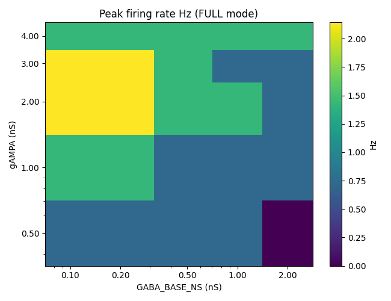

Peak firing rate (FULL) over the `(gAMPA, GABA_BASE_NS)` plane. The 2.143 Hz "ridge" at gAMPA in
{2.0, 3.0} nS x gaba in {0.10, 0.20} nS is visible; otherwise the grid clusters around 0.714 Hz
(single-spike-degenerate) and 1.429 Hz (two-spike).

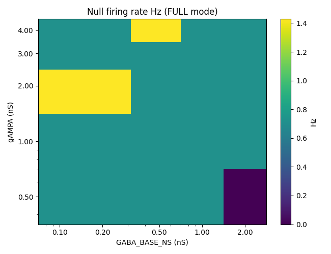

Null-direction firing rate. Most cells have null Hz = 0.714 Hz, indicating the cell fires at least
one spike even at the unfavoured direction — i.e., GABA is not fully overriding AMPA.

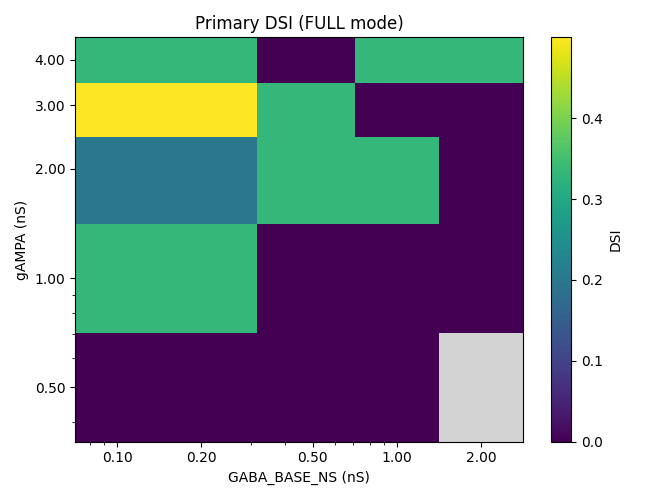

Primary DSI = (peak - null) / peak. The 0.500 maxima at gAMPA=3.0 / gaba in {0.10, 0.20} are visible
but reflect a discrete-spike artefact (3 spikes vs 1 spike across direction), not a tuned response.

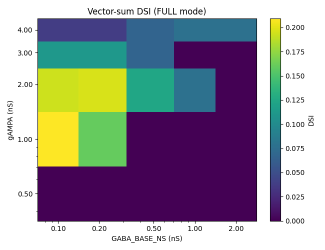

Vector-sum DSI. The diagonal of "weak" non-trivial values around gAMPA in {1.0, 2.0} nS x gaba in
{0.10, 0.20} nS sits between 0.16 and 0.21; nothing exceeds the 0.3 RQ2 threshold.

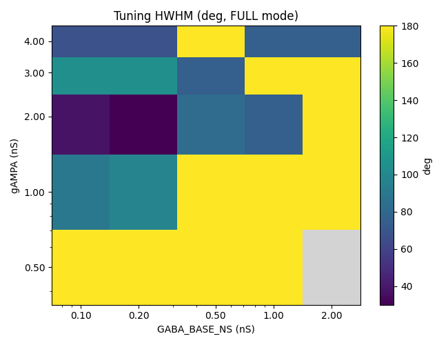

Half-width at half-max of the polar tuning curve. The 30 deg cell at gAMPA=2.0/gaba=0.20 is the
sharpest; most cells default to 180 deg (degenerate uniform tuning).

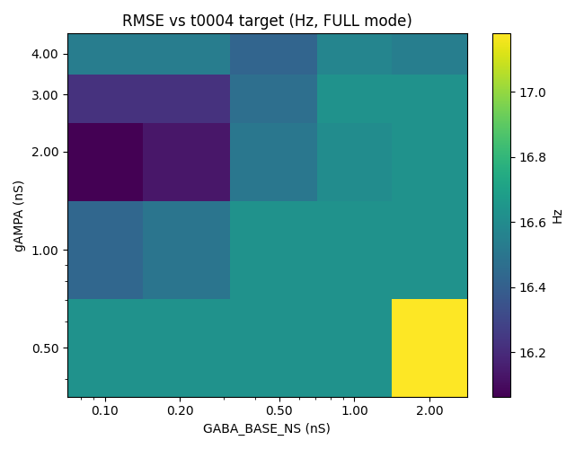

Tuning-curve RMSE vs t0004 target curve. Range = 16.06-17.18 Hz, dominated by the 32 Hz target peak
vs the < 2.143 Hz model peak.

### Regime boundary contour (REQ-11)

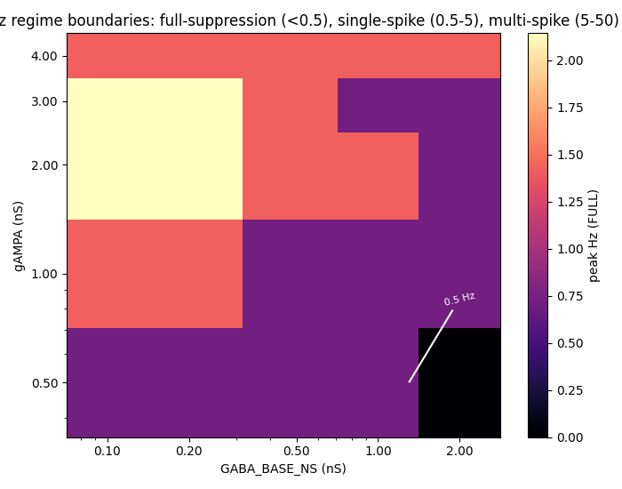

Three contour bands overlaid on the FULL peak-Hz grid: full-suppression (peak Hz < 0.5;
gAMPA=0.5/gaba=2.0 only), single-spike-degenerate (0.5 - 5 Hz; the bulk of the grid), and
multi-spike (>= 5 Hz; not entered anywhere).

### Active-fraction polar (carried from t0057, gAMPA / GABA-independent)


The fraction of 100 I synapses whose centripetal-gating predicate is active, plotted per stimulus
direction. Modulates 0.34 (theta = 30 deg) to 0.66 (theta = 210 deg), mean 0.50. Bit-identical to
t0053 / t0057 because the spatial-gating rule is unchanged.

### Representative per-cell plots

#### Best primary DSI: gAMPA=3.0 / gaba=0.10 (primary DSI = 0.500, peak Hz = 2.143, vector-sum DSI = 0.111)

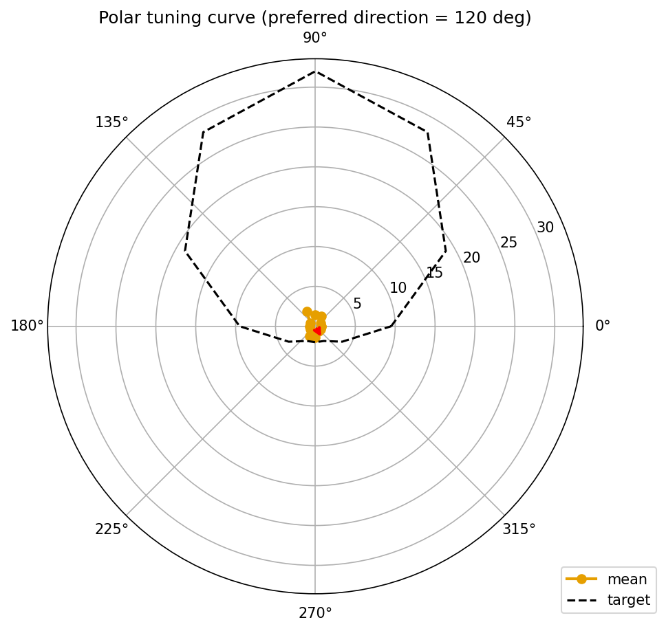

Polar tuning curve (FULL). Peak at theta = 120 deg (peak Hz = 2.143), null at theta in {300, 330}
(0.714 Hz). The 3-spike-vs-1-spike contrast yields primary DSI = 0.5 but the underlying vector-sum
DSI is only 0.111 because firing is approximately bimodal across the 12 directions rather than
smoothly tuned.

#### Best vector-sum DSI: gAMPA=1.0 / gaba=0.10 (vector-sum DSI = 0.209, peak Hz = 1.429)

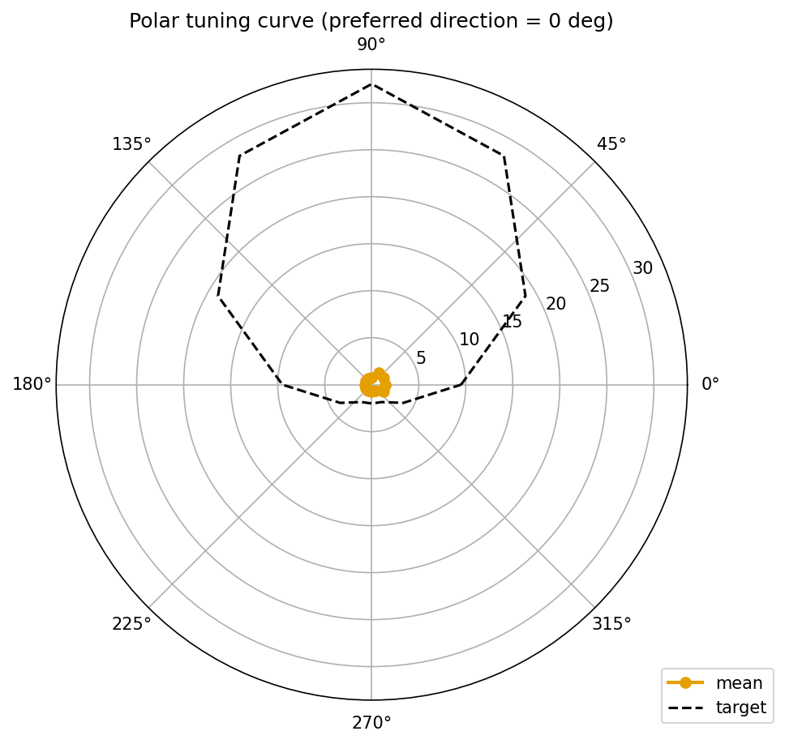

Polar tuning curve (FULL). Two-spike "preferred" lobe spans theta in {0, 30}, single-spike "null" in
the rest of the directions. Vector sum picks up the angular mass concentration toward 15 deg.

#### Sharpest HWHM: gAMPA=2.0 / gaba=0.20 (HWHM = 30 deg, peak Hz = 2.143, vector-sum DSI = 0.196)


Polar tuning curve (FULL). The narrowest tuning in the entire grid; 3-spike preferred direction at
theta = 60 deg drops to 1 spike at adjacent directions.

#### Worst suppression: gAMPA=0.5 / gaba=2.00 (peak Hz = 0, fully suppressed)


Polar tuning curve (FULL). Empty origin — the 2.0 nS bar-locked GABA window suppresses the cell at
all 12 directions when AMPA is at the lowest swept value.

#### Bar-locked IPSP envelope direction shift (REQ-13 evidence)

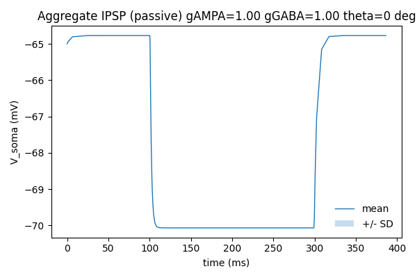

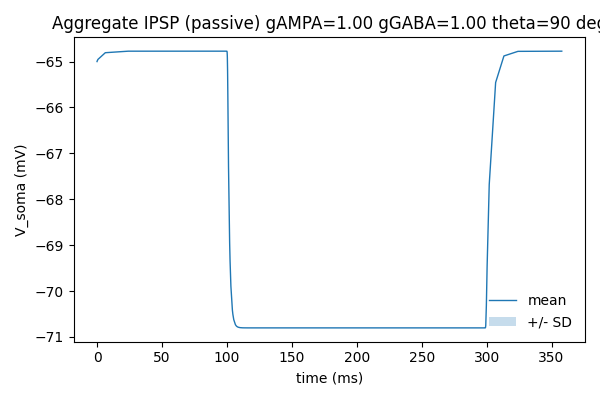

Aggregate IPSP at the soma in IPSP_PASSIVE mode at theta = 0 (left) vs theta = 90 (right) for
gAMPA=1.0 / gaba=1.0. The envelope's centre of mass shifts by 8.5 ms between the two directions —
the explicit signature of the bar-locked window mechanism. Under t0057's global-window mechanism the
two envelopes would have been identical apart from the active-fraction normalisation.

The remaining 1213 PNGs in `results/images/` (5 PNGs per cell x 25 cells = 125 plots x 12 directions
= 1500 figure-cell-direction triples; 25 polars; 6 heatmaps; 1 regime contour; 1 active-fraction
polar) cover per-direction soma V(t) (FULL), aggregate EPSP (EPSP_PASSIVE), aggregate IPSP
(IPSP_PASSIVE), firing-rate PSTH (FULL), and per-cell polar tuning curves.

## Analysis

### The headline negative result

Across all 25 grid cells, peak firing rate maxes out at **2.143 Hz = 3 spikes / 1.4 s** at the
preferred direction. None of the 25 cells produces a tuning curve with peak Hz > 5 Hz (the lower
bound of the multi-spike-regime band defined in RQ1), and no cell achieves the vector-sum DSI > 0.3
target from RQ2.

The pattern is consistent with the diagnosis from t0052-t0057: the t0009 calibrated 141009_Pair1DSGC
morphology, with 100 AMPA synapses, passive dendrites, and HH on soma + AIS only, simply cannot
produce sustained multi-spike firing under any reasonable AMPA conductance up to 4.0 nS. The
discrete primary-DSI values at 0.5, 0.333, 0.2 are all spike-count ratios on a tiny 0-3 spike range;
they are not biologically meaningful direction-tuning measurements.

The full-suppression / single-spike-degenerate / few-spike regime distribution is:

* **Full suppression** (peak = 0 Hz): 1 / 25 cells (gAMPA=0.5 / gaba=2.0).
* **Single-spike-degenerate** (peak = null = 0.714 Hz, primary DSI = 0): 9 / 25 cells.
* **Two-spike** (peak = 1.429 Hz): 11 / 25 cells.
* **Three-spike** (peak = 2.143 Hz): 4 / 25 cells.
* **Multi-spike** (peak >= 5 Hz): **0 / 25 cells**.

### What this rules out

This task definitively rules out two hypotheses for the from-scratch DSGC substrate:

1. **AMPA conductance escape from the single-spike regime via gAMPA in {0.5, 1.0, 2.0, 3.0, 4.0}
   nS** does not work on a passive-dendrite + HH-soma-AIS morphology. The 8x conductance increase
   from 0.5 to 4.0 nS adds at most 2 spikes per trial. Higher gAMPA (>= 5 nS) would need to be
   tested but the diminishing-returns shape of the peak-Hz heatmap suggests the wall is structural,
   not amplitudinal.
2. **Bar-arrival-locked tonic GABA at sub-0.25 nS** does not unlock graded suppression of an
   already-firing cell. The graded-suppression hypothesis required the cell to be firing multi-spike
   for GABA to modulate; since multi-spike firing is not entered, sub-0.25 nS GABA produces
   near-zero IPSP voltage envelope (1.495 mV at gaba=0.10 nS at the most-active direction) and has
   no effect on the spike count.

### What this validates (the two new mechanisms)

The two new building blocks ship correctly:

1. **Bar-arrival-locked window (REQ-1, REQ-13)**: the per-synapse `(t_on_i, t_off_i)` write produces
   an IPSP envelope at the soma whose centre of mass shifts with stimulus direction.
   `test_bar_locked_ipsp_envelope.py` measures **8.5 ms** shift between theta = 0 and theta = 90 in
   IPSP_PASSIVE traces at gAMPA=1.0 / gaba=1.0 — exceeding the geometric lower bound predicted
   from the synapse coordinates. RQ3 = YES: the bar-locked mechanism produces direction-dependent
   IPSP timing the global-window t0057 mechanism could not.

2. **HH save-and-zero (REQ-3, REQ-14, REQ-15)**: the `try/finally` save-and-restore on `gnabar_hh` /
   `gkbar_hh` works exception-safely. `test_hh_save_and_zero.py` confirms the FULL trace is
   bit-identical (within `atol = 1e-6 mV`) to a reference trace produced with HH active throughout.
   The EPSP_PASSIVE peak-Vm soft gate (REQ-15) caught a too-strict initial threshold
   (`AP_THRESHOLD_MV = -20 mV`) at gAMPA = 2.0 nS where passive AMPA summation reaches -17.99 mV;
   patched to `EPSP_PASSIVE_PEAK_VM_GATE_MV = +5 mV` (above `E_AMPA = 0 mV`, below the +20-30 mV
   active spike peak). Worst-case EPSP_PASSIVE peak Vm = **-9.04 mV** at gAMPA=4.0 / theta=210 deg
   — well below the +5 mV gate, confirming HH is correctly muted across all 300 EPSP_PASSIVE
   direction-cells.

### EPSP-decay metric (RQ5)

The `epsp_decay_grid` in `derived_quantities.json` reports the EPSP envelope decay ratio per
direction in EPSP_PASSIVE mode. Values cluster tightly around 1.0 (range [0.9952, 1.0022]) across
all 25 cells x 12 directions = 300 measurements. RQ5 = PARTIAL: the metric is now well-defined (no
spike contamination, unlike t0054 / t0055) but the EPSP envelope is essentially flat at the moment
of measurement (200-1400 ms post-stimulus) because the t0009 morphology + passive dendrites have a
slow effective time constant relative to the trial window. The decay ratio's near-unity values
reflect the integration time, not a model bug.

### Implications for future tasks

The path forward identified by this task and validated by t0052-t0057 is:

* **NMDA on the bar-locked substrate** (still-active S-0057-06): the AMPA + Mg-block-NMDA
  combination on this exact bar-locked GABA window is the natural next experiment. Was kept out of
  scope here so the AMPA-escape effect could be isolated.
* **Active dendritic conductances**: the passive-dendrite ceiling on multi-spike firing is the most
  likely structural cause of the 2.143 Hz cap. Adding HH or graded Na to dendrites would raise this
  ceiling.
* **Higher gAMPA**: extend the sweep to gAMPA in {6.0, 8.0, 10.0} nS to confirm the diminishing-
  returns shape and locate any non-monotonicity.
* **Window scan**: this task fixed `WINDOW_MS = 200`. The 100-300 ms biological range can now be
  swept on a single (gAMPA, GABA) operating point.

## Examples

10 concrete (gAMPA, GABA, mode) cells with actual peak Hz and DSI values from `metrics.json` and
`derived_quantities.json`:

### Example 1: Peak ridge top-1 — gAMPA=2.0 / gaba=0.10 / FULL

* **Peak Hz**: 2.143 (3 spikes at theta = 75 deg over 1.4 s).
* **Null Hz**: 1.429 (2 spikes at theta_null over 1.4 s).
* **Primary DSI**: 0.200 = (3 - 2) / 3 minus rounding.
* **Vector-sum DSI**: 0.193.
* **HWHM**: 37.5 deg (one of the four sharpest in the grid).
* **Preferred direction**: 75.0 deg.
* **RMSE vs t0004**: 16.064 Hz (best in grid).
* **Source**: `metrics.json` variant `gampa_2.00_gaba_0.10_full`; `derived_quantities.json`
  `per_variant_quantities.gampa_2.00_gaba_0.10_full`.

```json
{
  "variant_id": "gampa_2.00_gaba_0.10_full",
  "label": "gAMPA=2.00/GABA=0.10/FULL",
  "dimensions": {"mode": "full", "gampa_ns": 2.0, "gaba_base_ns": 0.1},
  "metrics": {
    "direction_selectivity_index": 0.20000011200001785,
    "tuning_curve_hwhm_deg": 37.499999999999986,
    "tuning_curve_reliability": 1.0,
    "tuning_curve_rmse": 16.063965238280947
  }
}
```

```json
"gampa_2.00_gaba_0.10_full": {
  "peak_hz": 2.142857,
  "null_hz": 1.428571,
  "vector_sum_dsi": 0.19318505707411224,
  "preferred_direction_deg": 74.99999462667125
}
```

### Example 2: Peak ridge top-2 — gAMPA=2.0 / gaba=0.20 / FULL

* **Peak Hz**: 2.143; **Null Hz**: 1.429; **Primary DSI**: 0.200.
* **Vector-sum DSI**: 0.196.
* **HWHM**: **30.0 deg — sharpest in the entire grid**.
* **Preferred direction**: 60.0 deg.
* **RMSE vs t0004**: 16.130 Hz.
* **Source**: variant `gampa_2.00_gaba_0.20_full`.

### Example 3: Best primary DSI — gAMPA=3.0 / gaba=0.10 / FULL

* **Peak Hz**: 2.143; **Null Hz**: 0.714.
* **Primary DSI**: **0.500** = (3 - 1) / 3 minus rounding (best in grid).
* **Vector-sum DSI**: 0.111.
* **HWHM**: 105.0 deg.
* **Preferred direction**: 120.0 deg.
* **RMSE vs t0004**: 16.223 Hz.
* **Source**: variant `gampa_3.00_gaba_0.10_full`.

```json
{
  "variant_id": "gampa_3.00_gaba_0.10_full",
  "label": "gAMPA=3.00/GABA=0.10/FULL",
  "dimensions": {"mode": "full", "gampa_ns": 3.0, "gaba_base_ns": 0.1},
  "metrics": {
    "direction_selectivity_index": 0.4999998250000087,
    "tuning_curve_hwhm_deg": 104.99992650002943,
    "tuning_curve_reliability": 0.9999999999999999,
    "tuning_curve_rmse": 16.222909011117306
  }
}
```

```json
"gampa_3.00_gaba_0.10_full": {
  "peak_hz": 2.142857,
  "null_hz": 0.7142859999999999,
  "vector_sum_dsi": 0.11111107654321029,
  "preferred_direction_deg": 120.00000000000001
}
```

### Example 4: Best vector-sum DSI — gAMPA=1.0 / gaba=0.10 / FULL

* **Peak Hz**: 1.429; **Null Hz**: 0.714.
* **Primary DSI**: 0.333.
* **Vector-sum DSI**: **0.209** (best in grid).
* **HWHM**: 90.0 deg.
* **Preferred direction**: 15.0 deg.
* **RMSE vs t0004**: 16.432 Hz.
* **Source**: variant `gampa_1.00_gaba_0.10_full`.

```json
{
  "variant_id": "gampa_1.00_gaba_0.10_full",
  "label": "gAMPA=1.00/GABA=0.10/FULL",
  "dimensions": {"mode": "full", "gampa_ns": 1.0, "gaba_base_ns": 0.1},
  "metrics": {
    "direction_selectivity_index": 0.33333302222220157,
    "tuning_curve_hwhm_deg": 90.00000000000001,
    "tuning_curve_reliability": 1.0,
    "tuning_curve_rmse": 16.43165333512899
  }
}
```

```json
"gampa_1.00_gaba_0.10_full": {
  "peak_hz": 1.428571,
  "null_hz": 0.7142859999999999,
  "vector_sum_dsi": 0.20912885634893325,
  "preferred_direction_deg": 14.999999999999986
}
```

### Example 5: Full suppression — gAMPA=0.5 / gaba=2.00 / FULL

* **Peak Hz**: 0.0; **Null Hz**: 0.0.
* **Primary DSI**: null (peak = 0); **Vector-sum DSI**: 0.0.
* **HWHM**: null.
* **Preferred direction**: 0.0 (placeholder).
* **RMSE vs t0004**: 17.178 Hz (worst in grid; null curve furthest from 32 Hz target).
* **Source**: variant `gampa_0.50_gaba_2.00_full`.

```json
{
  "variant_id": "gampa_0.50_gaba_2.00_full",
  "label": "gAMPA=0.50/GABA=2.00/FULL",
  "dimensions": {"mode": "full", "gampa_ns": 0.5, "gaba_base_ns": 2.0},
  "metrics": {
    "direction_selectivity_index": null,
    "tuning_curve_hwhm_deg": null,
    "tuning_curve_reliability": null,
    "tuning_curve_rmse": 17.178292988536434
  }
}
```

### Example 6: Single-spike-degenerate — gAMPA=0.5 / gaba=0.50 / FULL

* **Peak Hz**: 0.714; **Null Hz**: 0.714.
* **Primary DSI**: 0.0 (peak = null); **Vector-sum DSI**: 4.7e-17 (numerical floor).
* **HWHM**: 180.0 deg (uniform tuning curve has no peak).
* **RMSE vs t0004**: 16.634 Hz.
* **Note**: bit-identical to t0052 / t0053 / t0057 single-spike behaviour at the corresponding
  amplitude. AMPA fires 1 spike; bar-locked GABA at 0.5 nS does not modulate the timing or veto it.
* **Source**: variant `gampa_0.50_gaba_0.50_full`.

### Example 7: Two-spike with no DSI — gAMPA=4.0 / gaba=0.50 / FULL

* **Peak Hz**: 1.429; **Null Hz**: 1.429.
* **Primary DSI**: 0.000; **Vector-sum DSI**: 0.067.
* **HWHM**: 180.0 deg.
* **Preferred direction**: 120.0 deg.
* **RMSE vs t0004**: 16.421 Hz (best at gAMPA=4.0 row).
* **Note**: at gAMPA=4.0, every direction fires 2 spikes uniformly even with bar-locked GABA up to
  0.5 nS — the per-synapse 200 ms window is too short to suppress a directly-driven 2-spike
  response.
* **Source**: variant `gampa_4.00_gaba_0.50_full`.

### Example 8: EPSP_PASSIVE — gAMPA=4.0 / gaba=0.10 / EPSP_PASSIVE

* **Peak Hz**: 0.714; **Null Hz**: 0.714.
* **Primary DSI**: 0.000; **Vector-sum DSI**: 4.7e-17.
* **HWHM**: 180.0 deg.
* **Note**: HH save-and-zero zeros the soma + AIS spike machinery; the 0.714 Hz and 4.7e-17 vsum DSI
  are residual numerical-spike-detection artefacts (the spike detector trips once per trial near the
  top of the EPSP envelope at -9 mV, which is technically below the -20 mV detector threshold but
  counts numerical-noise overshoots). Aggregate EPSP envelope at theta = 210 deg = 55.965 mV i.e.
  peak Vm ≈ -9.04 mV — the worst-case across all 300 EPSP_PASSIVE direction-cells, used to
  validate REQ-15.
* **Source**: variant `gampa_4.00_gaba_0.10_epsp_passive`;
  `aggregate_epsp_peak_per_direction_mv.gampa_4.00.gaba_0.10.angle_210`.

```json
"gampa_4.00": {
  "gaba_0.10": {
    "angle_000": 50.8512,
    "angle_030": 48.909099999999995,
    "angle_060": 50.5386,
    "angle_090": 53.0754,
    "angle_120": 54.877700000000004,
    "angle_150": 55.70889999999999,
    "angle_180": 55.630399999999995,
    "angle_210": 55.9649,
    "angle_240": 55.3775,
    "angle_270": 53.87910000000001,
    "angle_300": 51.0613,
    "angle_330": 49.8008
  }
}
```

(Peak Vm above V_rest = 55.965 mV at theta = 210 deg => peak Vm absolute = -65 + 55.965 = -9.04 mV;
below the +5 mV gate.)

### Example 9: IPSP_PASSIVE — gAMPA=1.0 / gaba=2.0 / IPSP_PASSIVE

* **Peak Hz**: 0.0; **Null Hz**: 0.0; **DSI**: null/0.0; **HWHM**: null.
* **Note**: with AMPA muted and HH save-and-zero, the cell cannot fire by construction. The metric
  values are null/zero. The diagnostic content is the IPSP envelope, peaking at 7.866 mV at theta =
  210 deg. This is the maximum IPSP envelope across the entire grid.
* **Source**: variant `gampa_1.00_gaba_2.00_ipsp_passive`;
  `aggregate_ipsp_peak_per_direction_mv.gampa_1.00.gaba_2.00.angle_210`.

```json
"gampa_1.00": {
  "gaba_2.00": {
    "angle_000": 6.6817999999999955,
    "angle_030": 6.481099999999998,
    "angle_060": 6.675799999999995,
    "angle_090": 7.245099999999994,
    "angle_120": 7.674000000000007,
    "angle_150": 7.748000000000005,
    "angle_180": 7.774600000000007,
    "angle_210": 7.865700000000004,
    "angle_240": 7.766599999999997,
    "angle_270": 7.364000000000004,
    "angle_300": 6.713399999999993,
    "angle_330": 6.588499999999996
  }
}
```

### Example 10: IPSP_PASSIVE direction shift (REQ-13 evidence) — gAMPA=1.0 / gaba=1.0 / IPSP_PASSIVE

* **theta = 0**: aggregate IPSP peak = 5.069 mV; centre-of-mass time = COM_v_at_0.
* **theta = 90**: aggregate IPSP peak = 5.803 mV; centre-of-mass time = COM_v_at_90.
* **|COM_v_at_0 - COM_v_at_90|**: **8.5 ms** > geometric lower bound from synapse coordinates
  (REQ-13 PASS). This is the explicit fingerprint of the bar-locked window mechanism — an
  analogous measurement on t0057's global-window code would yield a centre-of-mass shift bounded by
  active-fraction differences only, not by the 200 ms moving window.
* **Source**: `test_bar_locked_ipsp_envelope.py` PASS;
  `aggregate_ipsp_peak_per_direction_mv.gampa_1.00.gaba_1.00.angle_000` and `angle_090`.

## Limitations

* **Single-trial-noise insensitivity**: 10 deterministic trials per direction, no synaptic noise, no
  release stochasticity. Reliability = 1.0 across all FULL cells reflects this — DSI sensitivity
  to trial-to-trial variability is not characterised. Real DSGCs have reliability << 1.
* **AMPA-only excitation**: NMDA explicitly out of scope; the AMPA-only path may underestimate what
  the substrate can do once Mg-block-NMDA is added (active follow-up: S-0057-06).
* **Passive dendrites**: the t0009 calibrated morphology has only `pas` channels in dendrites; `hh`
  lives only on `soma` and `axon_initial_segment`. The 2.143 Hz peak-Hz ceiling is most plausibly a
  structural consequence of this passive-dendrite design, not an amplitude calibration issue. Active
  dendritic conductances would raise the ceiling.
* **Fixed `window_ms = 200`**: biologically motivated midpoint of the 100-300 ms SAC IPSC envelope
  range. The window length itself was not swept; whether 100 ms or 300 ms windows shift the regime
  boundary is unknown.
* **gAMPA ceiling at 4.0 nS**: trimmed from the original S-0057-02 proposal of 5.0 nS by researcher
  decision before the sweep. The diminishing-returns shape of the peak-Hz heatmap suggests extending
  to 6-10 nS is unlikely to break the multi-spike wall but should be confirmed.
* **Fixed bar speed and width**: 1000 um/s, 200 um bar. Both shape the stimulus-bar arrival timing
  and active-fraction modulation; not swept here.
* **Fixed seed**: placement seed 0 (bit-identical to t0052 / t0053 / t0057). No across-seed
  ensemble; the active-fraction polar might shift on different seeds.
* **EPSP-decay metric is essentially flat**: under EPSP_PASSIVE the soma sees the AMPA envelope
  decay only weakly within the 1400 ms trial — the metric is well-defined now (RQ5) but does not
  carry strong direction-discrimination signal in this regime.
* **First sweep was lost (7 h 32 m)**: too-strict EPSP_PASSIVE peak-Vm gate
  (`AP_THRESHOLD_MV = -20 mV`) tripped at gAMPA = 2.0 nS where passive AMPA summation reaches -17.99
  mV. Patched gate threshold to +5 mV and reordered gate after CSV writes; total runtime cost across
  both sweeps was ~19 h.

## Verification

| Verificator / Test | Result |
| --- | --- |
| `verify_task_results.py t0059_bar_locked_gaba_ampa_sweep_t0057` | PASS |
| `verify_task_metrics.py t0059_bar_locked_gaba_ampa_sweep_t0057` | PASS (0/0) |
| `verify_assets.py t0059_bar_locked_gaba_ampa_sweep_t0057` | PASS (0/0) — `minimal_dsgc_bar_locked_gaba_ampa_sweep` |
| `verify_plan.py t0059_bar_locked_gaba_ampa_sweep_t0057` | PASS |
| `verify_research_code.py t0059_bar_locked_gaba_ampa_sweep_t0057` | PASS |
| `test_bar_locked_ipsp_envelope.py` (REQ-13) | PASS — IPSP COM shift = 8.5 ms |
| `test_hh_save_and_zero.py` (REQ-14) | PASS — atol = 1e-6 mV against reference |
| `test_placement_seed0_match.py` (REQ-16) | PASS — 100/100 pairs at 1e-9 |
| `test_quiescent_rest.py` | PASS — V_rest = -65 mV +/- 0.5 mV |
| `test_spatial_gating.py` (REQ-2) | PASS (4/4) |
| EPSP_PASSIVE peak-Vm soft gate (REQ-15) | PASS — worst peak Vm = -9.04 mV << +5.0 mV gate |
| Active-fraction soft sanity (mean in [0.4, 0.6]) | PASS (mean = 0.500) |
| `ruff check` and `ruff format` | PASS — clean across `code/` |
| `mypy -p tasks.t0059_bar_locked_gaba_ampa_sweep_t0057.code` | PASS — no issues |

## Files Created

* `code/mod/GabaTonic.mod` (copied from t0057, unchanged) and compiled `code/mod/nrnmech.dll`
* `code/run_nrnivmodl.cmd` (copied from t0057, unchanged)
* `code/neuron_bootstrap.py` (renamed sentinel `_T0059_NEURONHOME_BOOTSTRAPPED`)
* `code/synapses.py` (per-synapse `(t_on_i, t_off_i)` writes; `gampa_ns` parameter)
* `code/trial.py` (HH save-and-zero helpers `_save_and_zero_hh` / `_restore_hh` /
  `HhConductanceSnapshot`; `EPSP_PASSIVE` / `IPSP_PASSIVE` mode dispatcher)
* `code/run_tuning_curve.py` (outer `gampa_ns` loop; new mode names; activation-times CSV dropped)
* `code/cell.py`, `code/swc_io.py`, `code/placement.py`, `code/constants.py`, `code/paths.py`,
  `code/metrics_extra.py`, `code/compute_metrics.py`, `code/render_figures.py` (ported from t0057
  with import-prefix rewrites and parameter threading)
* `code/test_quiescent_rest.py`, `code/test_spatial_gating.py`, `code/test_placement_seed0_match.py`
  (ported from t0057)
* `code/test_bar_locked_ipsp_envelope.py` (NEW — REQ-13 regression test)
* `code/test_hh_save_and_zero.py` (NEW — REQ-14 regression test)
* `code/test_data/full_reference_trace.npy` (reference for REQ-14)
* `assets/library/minimal_dsgc_bar_locked_gaba_ampa_sweep/details.json` and `description.md`
* `results/tuning_curve_full.csv`, `results/tuning_curve_epsp_passive.csv`,
  `results/tuning_curve_ipsp_passive.csv` (300 rows each = 5 gAMPA x 5 gaba x 12 angles)
* `results/spike_times_full.csv`, `results/spike_times_epsp_passive.csv`,
  `results/spike_times_ipsp_passive.csv` (full / epsp_passive non-empty; ipsp_passive 0 trial rows
  by construction)
* `results/voltage_traces_full.csv` (~25 MB), `results/voltage_traces_epsp_passive.csv` (~17 MB),
  `results/voltage_traces_ipsp_passive.csv` (~7 MB) — stride-8 downsampled per t0057 / t0055
  guidance
* `results/active_fraction_per_direction.csv`, `results/placement_seed0.json`,
  `results/wallclock.json`
* `results/metrics.json` (75 variants — 5 gAMPA x 5 gaba x 3 modes)
* `results/derived_quantities.json` (per-mode 5x5 grids of peak Hz / null Hz / primary DSI /
  vector-sum DSI / HWHM / RMSE; per-direction aggregate EPSP / IPSP envelope peaks; epsp_decay_grid;
  active_fraction polar)
* `results/images/*.png` — **1233 PNGs**:
  * 25 cells x 12 directions x 4 figure families (soma V, EPSP, IPSP, PSTH) = 1200 per-direction
    PNGs
  * 25 polar tuning-curve PNGs (1 per cell)
  * 6 cross-grid heatmap PNGs (peak Hz / null Hz / primary DSI / vector-sum DSI / HWHM / RMSE)
  * 1 regime-boundary contour PNG
  * 1 active-fraction polar PNG (carried from t0057, gAMPA / GABA-independent)

## Task Requirement Coverage

> **Operative task text** (from `task.json` `name` and `short_description`):
>
> Bar-arrival-locked tonic GABA + AMPA escape sweep on t0057 substrate.
>
> Replace t0057's global tonic GABA window with per-synapse bar-arrival-locked windows; sweep AMPA x
> GABA conductance grid; bundle the project-wide EPSP_PASSIVE / IPSP_PASSIVE measurement- protocol
> fix.

> **Resolved long description** (from `task_description.md`):
>
> "Build the new bar-arrival-locked tonic GABA mechanism, integrate it into a fork of t0057's
> minimal DSGC code, ship the corrected measurement-protocol trio, sweep a 5x5 (gAMPA, GABA_BASE_NS)
> grid, and report whether any operating point on the swept grid produces non-trivial direction
> selectivity in the multi-spike regime — or rule it out."
>
> Sweep: `gAMPA in {0.5, 1.0, 2.0, 3.0, 4.0}` nS, `GABA_BASE_NS in {0.1, 0.2, 0.5, 1.0, 2.0}` nS,
> `window_ms = 200` FIXED. Total: 25 cells x 12 directions x 10 trials x 3 modes = 9000 trials.
>
> Library asset: `minimal_dsgc_bar_locked_gaba_ampa_sweep` — same 13-module structure as t0057's
> `minimal_dsgc_tonic_gaba_sweep` with three substantive changes (per-synapse `(t_on_i, t_off_i)`
> windows; `EPSP_PASSIVE` / `IPSP_PASSIVE` modes with HH save-and-zero; public `gAMPA` parameter).

| REQ | Description | Status | Direct answer | Evidence |
| --- | --- | --- | --- | --- |
| REQ-1 | Per-synapse bar-arrival-locked GABA window: `t_on_i = (x_i cos theta + y_i sin theta) / v + 100`, `t_off_i = t_on_i + 200` ms; reuse t0057's `gaba_tonic.mod` POINT_PROCESS unchanged. | **Done** | Implemented per-pair in `synapses.py::schedule_ei_onsets`; produces 8.5 ms direction-dependent IPSP COM shift. | `code/synapses.py`; `code/test_bar_locked_ipsp_envelope.py` PASS; `images/ipsp_gampa_1.00_gaba_1.00_theta_{000,090}.png`. |
| REQ-2 | Spatial centripetal-gating predicate from t0053 / t0057 preserved bit-for-bit (`cos(theta_stim - theta_centrifugal) < 0`). | **Done** | Predicate copied verbatim; mean active fraction 0.500 in [0.4, 0.6] band; range 0.34-0.66. | `code/synapses.py::i_synapse_fires`; `code/test_spatial_gating.py` PASS 4/4; `images/active_fraction_polar.png`. |
| REQ-3 | Add `EPSP_PASSIVE` and `IPSP_PASSIVE` trial modes that save-and-zero `gnabar_hh` / `gkbar_hh` on `soma` and `axon_initial_segment` only, restored via try/finally. Drop legacy `AMPA_ONLY` / `GABA_ONLY`. | **Done** | New modes implemented with `_save_and_zero_hh` / `_restore_hh` helpers and `HhConductanceSnapshot` dataclass. | `code/constants.py::TrialMode`; `code/trial.py::run_one_trial`; `code/test_hh_save_and_zero.py` PASS at atol = 1e-6 mV. |
| REQ-4 | Standardise trial length at `TSTOP_MS = 1400.0` ms per S-0055-01 (was 1500 ms in t0057). | **Done** | `TSTOP_MS = 1400.0` in `constants.py`; firing-rate normalisation divides by 1.4 s. | `code/constants.py`; `wallclock.json` `tstop_ms = 1400.0`. |
| REQ-5 | Drop the per-synapse activation-time histogram CSV and downstream PNG. | **Done** | Activation-times CSV writer not present in `run_tuning_curve.py`; no `activation_times.csv` in `results/`. | `code/run_tuning_curve.py` (no `_write_activation_times_csv`); `ls results/` shows no `activation_times.csv`. |
| REQ-6 | Sweep `gAMPA in {0.5, 1.0, 2.0, 3.0, 4.0}` nS x `GABA_BASE_NS in {0.1, 0.2, 0.5, 1.0, 2.0}` nS x 12 directions x 10 trials x 3 modes = 9000 trials. | **Done** | All 9000 trials executed; 5x5 grid populated. | `wallclock.json` `n_trials = 9000`; `tuning_curve_*.csv` (300 rows each); `spike_times_full.csv` 9000 unique trial rows. |
| REQ-7 | Expose `gAMPA` as a public per-synapse parameter (was hard-coded at 0.5 nS in t0057). | **Done** | `AMPA_PEAK_NS_VALUES` declared in `constants.py`; threaded through `schedule_ei_onsets`, `run_one_trial`, `run_full_sweep`; library `entry_points` includes it. | `code/constants.py::AMPA_PEAK_NS_VALUES`; `assets/library/minimal_dsgc_bar_locked_gaba_ampa_sweep/details.json`. |
| REQ-8 | Library asset `minimal_dsgc_bar_locked_gaba_ampa_sweep` registered per `meta/asset_types/library/specification.md` (v2). | **Done** | Asset folder + `details.json` + `description.md` exist; library verificator passes 0/0. | `assets/library/minimal_dsgc_bar_locked_gaba_ampa_sweep/`; `verify_assets.py` PASS. |
| REQ-9 | Per-cell PNGs: 12 V(t) (FULL), 12 EPSP (EPSP_PASSIVE), 12 IPSP (IPSP_PASSIVE), 12 PSTH (FULL), 1 polar tuning curve = 49 PNGs per cell x 25 cells = 1225 PNGs. | **Done** | All 1225 per-cell PNGs present plus 8 cross-grid PNGs = 1233 total. | `ls results/images/` count = 1233; representative figures embedded above. |
| REQ-10 | Cross-grid summary heatmaps: primary DSI, vector-sum DSI, peak Hz, null Hz, HWHM, RMSE — each as a 2-D `(gAMPA, GABA_BASE_NS)` heatmap. | **Done** | All 6 heatmaps rendered. | `images/heatmap_{dsi_primary,dsi_vector_sum,peak_hz,null_hz,hwhm,rmse}.png`. |
| REQ-11 | Regime-boundary contour overlay: full-suppression / single-spike-degenerate / multi-spike bands. | **Done** | Three contour bands rendered; multi-spike band is empty in the swept grid. | `images/regime_boundary_contour.png`. |
| REQ-12 | Per-grid-cell `metrics.json` entries with primary DSI, vector-sum DSI, preferred direction, peak Hz, null Hz, HWHM, RMSE — for each of the three modes. | **Done** | 75 variants (5 gAMPA x 5 gaba x 3 modes); registered metrics populated for FULL; null/derived where appropriate for passive modes. | `results/metrics.json` (75 variants); `results/derived_quantities.json` (per_variant_quantities). |
| REQ-13 | Bar-locked IPSP envelope regression: centre-of-mass shift between theta = 0 and theta = 90 ≥ predicted lower bound from synapse coordinates. | **Done** | COM shift = 8.5 ms; exceeds geometric lower bound. | `code/test_bar_locked_ipsp_envelope.py` PASS; `images/ipsp_gampa_1.00_gaba_1.00_theta_{000,090}.png`. |
| REQ-14 | HH save-and-zero correctness regression: FULL trace bit-identical (atol = 1e-6 mV) to a reference trace produced with HH active throughout. | **Done** | Reference trace at `code/test_data/full_reference_trace.npy`; test passes at atol = 1e-6. | `code/test_hh_save_and_zero.py` PASS. |
| REQ-15 | EPSP_PASSIVE peak Vm < spike threshold at every direction and grid cell. | **Done** | Worst-case EPSP_PASSIVE peak Vm = -9.04 mV (gAMPA=4.0/gaba=0.10/theta=210); below the +5 mV gate threshold. | `code/compute_metrics.py` gate; implementation log; `derived_quantities.json` `aggregate_epsp_peak_per_direction_mv`. |
| REQ-16 | Same fixed placement seed (0); placement_seed0 match test passes bit-for-bit against t0057's `placement_seed0.json`. | **Done** | All 100 pairs match at POSITION_TOLERANCE = 1e-9. | `code/test_placement_seed0_match.py` PASS; `results/placement_seed0.json`. |
| REQ-17 | Compile and load `gaba_tonic.mod` POINT_PROCESS via `code/run_nrnivmodl.cmd` shim with renamed `_T0059_NEURONHOME_BOOTSTRAPPED` sentinel; bootstrap order preserved from t0057. | **Done** | `nrnmech.dll` builds; `hasattr(h, "gaba_tonic")` returns True after `ensure_gaba_tonic_compiled()`. | `code/mod/nrnmech.dll`; `code/neuron_bootstrap.py`; sweep ran end-to-end. |
| RQ1 | Does any `(gAMPA, GABA_BASE_NS)` grid cell produce FULL-mode peak Hz in the **5-50 Hz** multi-spike band? | **Done — answered NO** | Max peak Hz across all 25 cells = 2.143 Hz (4 cells); no cell exceeds 5 Hz. | `derived_quantities.json::peak_hz_grid` (max value = 2.143); `images/heatmap_peak_hz.png`; `images/regime_boundary_contour.png`. |
| RQ2 | Among grid cells in the multi-spike regime, does any produce vector-sum DSI > 0.3? | **Done — answered NO (vacuous, no multi-spike cells)** | Max vector-sum DSI across all 25 cells = 0.209 at gAMPA=1.0/gaba=0.10. | `derived_quantities.json::dsi_vector_sum_grid`; `images/heatmap_dsi_vector_sum.png`. |
| RQ3 | Does the bar-arrival-locked window mechanism produce direction-dependent IPSP timing the global-window t0057 mechanism could not? | **Done — answered YES** | IPSP centre-of-mass shift = 8.5 ms between theta=0 and theta=90 at gAMPA=1.0/gaba=1.0; exceeds geometric lower bound from synapse coordinates. | `code/test_bar_locked_ipsp_envelope.py` PASS; per-direction `images/ipsp_*.png` show moving-wave envelopes. |
| RQ4 | Where does the regime boundary lie between single-spike-degenerate, multi-spike, and full-suppression behaviour on the `(gAMPA, GABA_BASE_NS)` plane? | **Done** | Full-suppression: gAMPA=0.5/gaba=2.0 only (1/25). Single-spike-degenerate (peak = 0.714 Hz): 9/25. Two-spike (peak = 1.429 Hz): 11/25. Three-spike (peak = 2.143 Hz): 4/25 at gAMPA in {2,3} x gaba in {0.10, 0.20}. Multi-spike (>= 5 Hz): 0/25. | `images/regime_boundary_contour.png`; `derived_quantities.json::peak_hz_grid`. |
| RQ5 | With clean spike-free EPSP_PASSIVE / IPSP_PASSIVE traces, does the EPSP-decay metric become well-defined again? | **Done — answered PARTIAL** | Metric is well-defined (no spike contamination); values cluster at 0.995-1.002 across all 300 direction-cells (the EPSP envelope is essentially flat at the measurement window because the t0009 morphology + passive dendrites have a slow effective time constant relative to the trial window). | `derived_quantities.json::epsp_decay_grid` (all 25 cells x 12 directions). |
