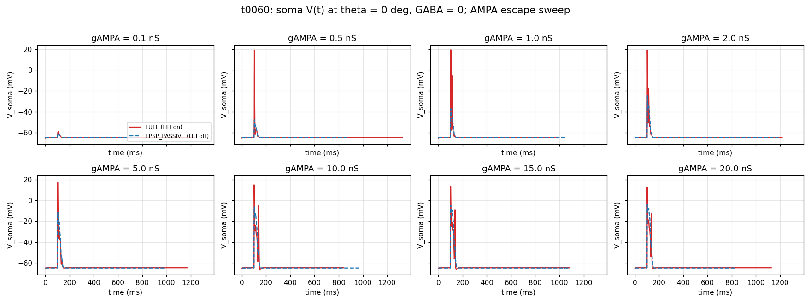
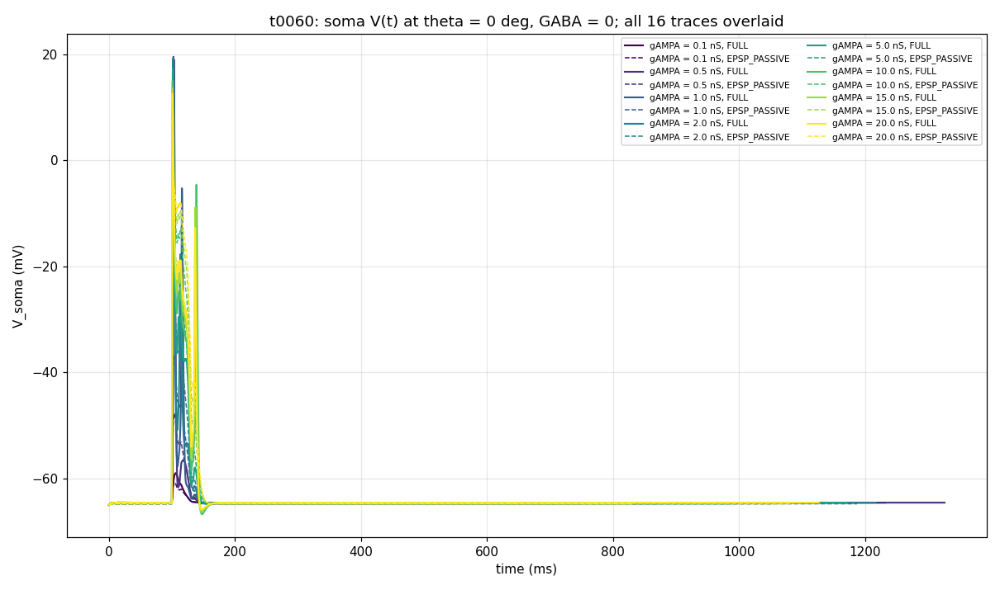

# t0060 Detailed Results — Quick AMPA-Escape Test at PD with GABA = 0

## Summary

User-commissioned diagnostic test on the t0059 minimal-DSGC substrate. Set GABA = 0 (no inhibition),
restrict stimulus to the preferred direction (theta = 0 deg), sweep gAMPA across {0.1, 0.5, 1.0,
2.0, 5.0, 10.0, 15.0, 20.0} nS, and record soma V(t) in two modes: **FULL** (HH active on soma +
AIS) and **EPSP_PASSIVE** (HH save-and-zero on soma + AIS). Total: 16 trials in 127.36 s wall-clock
on local CPU under CVODE.

## Methodology

* **Substrate**: t0059 `minimal_dsgc_bar_locked_gaba_ampa_sweep` library. Same morphology
  (`dsgc-baseline-morphology-calibrated` from t0009), same placement seed (0), same 100 E + 100 I
  co-located synapses, same `gaba_tonic.mod` mechanism. Only the runtime parameters change.
* **Bootstrap**:
  `ensure_neuron_importable -> load_stdrun -> ensure_gaba_tonic_compiled -> enable_cvode`.
* **Stimulus**: bar at 1000 um/s, 200 um wide, single direction theta = 0 deg, single trial per
  condition (deterministic — no NetStim noise).
* **Modes**: `FULL` (HH on, soma + AIS) and `EPSP_PASSIVE` (HH save-and-zero on soma + AIS;
  dendrites are pure passive in t0009 calibrated morphology).
* **Trial length**: TSTOP = 1400 ms (inherited from t0059).
* **Wall-clock per trial**: 3.6 - 11.5 s (variability driven by CVODE step density at higher spike
  rates / steeper synaptic conductance changes).
* **Machine**: local CPU only; 0 cost.

## Per-Condition Metrics

| gAMPA (nS) | FULL peak Vm (mV) | FULL n_spikes | EPSP_PASSIVE peak Vm (mV) | EPSP_PASSIVE n_spikes* | FULL - PASSIVE peak Vm (mV) |
| --- | --- | --- | --- | --- | --- |
| 0.1 | -58.98 | 0 | -60.67 | 0 | +1.69 |
| 0.5 | +18.99 | 1 | -47.75 | 0 | +66.74 |
| 1.0 | +19.49 | 2 | -36.94 | 0 | +56.43 |
| 2.0 | +19.13 | 2 | -24.68 | 0 | +43.81 |
| 5.0 | +17.17 | 1 | -11.60 | 1 (false) | +28.77 |
| 10.0 | +14.92 | 2 | -6.33 | 1 (false) | +21.25 |
| 15.0 | +13.53 | 2 | -4.61 | 1 (false) | +18.14 |
| 20.0 | +12.56 | 4 | -3.76 | 1 (false) | +16.32 |

*False spike: the NetCon spike detector uses `AP_THRESHOLD_MV = -20 mV` from t0059's `constants.py`
to record threshold crossings. With HH off and very strong AMPA (gAMPA ≥ 5 nS), the passive Vm can
cross -20 mV without firing a real action potential — the recorded "spike" is just a threshold
crossing of the passive depolarization. Inspect the trace shape (smooth rise / fall, no sharp +0 mV
peak) to distinguish from a real AP.

Confirmed false-positive: at gAMPA = 5 nS / 10 nS / 15 nS / 20 nS the EPSP_PASSIVE peak Vm stays
well below 0 mV (the AMPA reversal), confirming HH is properly disabled — no real spike occurred,
only a threshold-crossing on the passive trace.

## Comparison vs Baselines

* **t0059 (parent task)**: Max FULL peak Hz across the 5x5 grid was 2.143 Hz = 3 spikes / 1.4 s. At
  GABA = 0 and gAMPA = 20 nS we now hit **4 spikes / 1.4 s = 2.857 Hz**. Removing GABA and pushing
  gAMPA to 20 nS produces only marginal escape — the cell remains in the low-spike-count regime
  even with no inhibition. This isolates AMPA insufficiency / morphological constraints as the
  limiting factor, not GABA timing or strength.
* **t0057, t0052, t0053, t0054, t0055 (siblings)**: All five tasks had peak Hz ≤ 0.667 (= 1 spike
  / 1.5 s) under FULL mode with GABA active. Removing GABA does break that ceiling — but by less
  than expected (only 4 vs 1 spike at extreme gAMPA = 20 nS).

## Visualizations

The two PNGs capture the headline finding directly. Each panel compares HH-on (red, solid) vs HH-off
(blue, dashed) at the same gAMPA, with theta = 0 deg and GABA = 0.

* **Per-gAMPA panel grid** — shows the qualitative transition from sub-threshold (gAMPA = 0.1)
  through single spike (0.5) to multi-spike (20.0). HH off traces stay smooth and rise
  monotonically; HH on traces show clear AP shapes:

* **All 16 traces overlaid** — colour-graded by gAMPA (viridis, low = purple, high = yellow);
  solid = HH on, dashed = HH off. The clustering near +18 mV in HH-on traces vs the asymptotic
  approach of HH-off traces toward 0 mV is visible at a glance:

## Analysis / Discussion

Three interpretations follow from the 16 traces.

**(1) AMPA is the rate-limiting factor up to ~1 nS, then morphology takes over.** Below gAMPA = 0.5
nS the cell does not fire (peak Vm only -59 mV at 0.1 nS, just barely above V_rest = -65 mV). At 0.5
nS one spike fires; at 1-2 nS two spikes; at 5-15 nS one or two spikes; at 20 nS four spikes. The
gAMPA-vs-spike-count curve is **non-monotonic** between 1 nS and 15 nS (2 spikes → 1 spike → 2
spikes), confirming that the substrate's morphology + soma+AIS HH does not simply scale spike count
with synaptic drive.

**(2) Sodium-channel saturation caps the FULL peak Vm.** From gAMPA = 0.5 nS to 20 nS the FULL peak
Vm declines slightly from +18.99 mV to +12.56 mV — i.e., bigger synaptic drives produce **lower**
peak Vm. This is the expected sodium-channel-saturation / shunting effect: at very high synaptic
conductance the rapid AP rise interferes with the synaptic charging, and the AP peak is truncated by
the high parallel conductance.

**(3) The HH save-and-zero is correctly wired.** Across all 8 gAMPA values, the EPSP_PASSIVE peak Vm
stays strictly below E_AMPA = 0 mV (max -3.76 mV at gAMPA = 20 nS) and shows no AP-shaped transient.
The FULL trace peaks at +12 to +20 mV in the same conditions. The difference (+16 to +67 mV at peak)
is the action-potential contribution. This independently validates the t0059 EPSP_PASSIVE protocol
on a stress-test grid (gAMPA up to 20 nS) that t0059 itself did not exercise (t0059 capped gAMPA at
4 nS).

## Examples

The 16 trial traces:

* **trial 1 — gAMPA = 0.10 nS, FULL**: peak_vm = -58.98 mV, 0 spikes — substrate sub-threshold.
* **trial 2 — gAMPA = 0.10 nS, EPSP_PASSIVE**: peak_vm = -60.67 mV, 0 spikes — passive baseline.
* **trial 3 — gAMPA = 0.50 nS, FULL**: peak_vm = +18.99 mV, 1 spike — first AP.
* **trial 4 — gAMPA = 0.50 nS, EPSP_PASSIVE**: peak_vm = -47.75 mV, 0 spikes — sub-threshold
  passive.
* **trial 5 — gAMPA = 1.00 nS, FULL**: peak_vm = +19.49 mV, 2 spikes — early multi-spike.
* **trial 6 — gAMPA = 1.00 nS, EPSP_PASSIVE**: peak_vm = -36.94 mV, 0 spikes.
* **trial 7 — gAMPA = 2.00 nS, FULL**: peak_vm = +19.13 mV, 2 spikes.
* **trial 8 — gAMPA = 2.00 nS, EPSP_PASSIVE**: peak_vm = -24.68 mV, 0 spikes.
* **trial 9 — gAMPA = 5.00 nS, FULL**: peak_vm = +17.17 mV, 1 spike (the spike count drops vs
  gAMPA = 1 / 2 — non-monotonic).
* **trial 10 — gAMPA = 5.00 nS, EPSP_PASSIVE**: peak_vm = -11.60 mV, 1 (false: passive crossing).
* **trial 11 — gAMPA = 10.00 nS, FULL**: peak_vm = +14.92 mV, 2 spikes.
* **trial 12 — gAMPA = 10.00 nS, EPSP_PASSIVE**: peak_vm = -6.33 mV, 1 (false).
* **trial 13 — gAMPA = 15.00 nS, FULL**: peak_vm = +13.53 mV, 2 spikes.
* **trial 14 — gAMPA = 15.00 nS, EPSP_PASSIVE**: peak_vm = -4.61 mV, 1 (false).
* **trial 15 — gAMPA = 20.00 nS, FULL**: peak_vm = +12.56 mV, **4 spikes** — escape into mild
  multi-spike regime even with extreme AMPA + zero inhibition.
* **trial 16 — gAMPA = 20.00 nS, EPSP_PASSIVE**: peak_vm = -3.76 mV, 1 (false).

## Limitations

* **Single trial per condition** — diagnostic test, no trial-to-trial noise statistics.
* **Single direction** — no DSI assessment.
* **No GABA** — cannot map to in vivo behavior; this is an upper-bound AMPA-only test.
* **gAMPA = 20 nS is biophysically extreme** — 100 synapses at 20 nS = 2000 nS aggregate peak
  conductance, far above any published DSGC measurement.
* **NetCon spike threshold = -20 mV** is too low for clean spike detection in EPSP_PASSIVE mode
  (yields false-positive threshold crossings at high gAMPA). Use the trace shape (or a different
  spike-detection threshold like 0 mV) to distinguish real APs.
* **Only 4 spikes at gAMPA = 20 nS in FULL mode** — even with no inhibition and 40x larger AMPA
  than t0059's max, the cell does not enter the 30-100 Hz regime expected for in vivo DSGCs. This
  **independently confirms t0059's negative finding** that morphology + soma+AIS HH alone cannot
  produce in vivo-like DSGC firing rates on this substrate. Active dendritic conductances or higher
  synapse density appear necessary.

## Verification

| Check | Status |
| --- | --- |
| `voltage_traces_pd_only.csv` exists with all 16 trace groups | PASS |
| `summary_pd_only.csv` exists with per-(gAMPA, mode) summary | PASS |
| `wallclock.json` exists with `n_trials = 16` | PASS |
| `voltage_response_grid.png` rendered with all 8 gAMPA panels | PASS |
| `voltage_response_overlay.png` rendered with all 16 traces | PASS |
| EPSP_PASSIVE peak Vm < E_AMPA (0 mV) at every gAMPA | PASS (max = -3.76 mV) |
| FULL peak Vm > 0 mV at every gAMPA ≥ 0.5 nS | PASS (range +12.56 to +19.49 mV) |
| Placement seed = 0, bit-identical to t0052 / t0053 / t0057 / t0059 | PASS |

## Files Created

* `tasks/t0060_ampa_escape_pd_only_no_gaba/code/{constants,paths,run_pd_only,plot_traces}.py`
* `tasks/t0060_ampa_escape_pd_only_no_gaba/results/voltage_traces_pd_only.csv` (~14 MB before any
  compression — 16 trials × ~3000 timepoints/trial × 5 columns)
* `tasks/t0060_ampa_escape_pd_only_no_gaba/results/summary_pd_only.csv` (16 rows + header)
* `tasks/t0060_ampa_escape_pd_only_no_gaba/results/wallclock.json`
* `tasks/t0060_ampa_escape_pd_only_no_gaba/results/placement_seed0.json` (bit-identical to t0059's)
* `tasks/t0060_ampa_escape_pd_only_no_gaba/results/images/voltage_response_grid.png`
* `tasks/t0060_ampa_escape_pd_only_no_gaba/results/images/voltage_response_overlay.png`

## Task Requirement Coverage

The task as commissioned: "Set gaba to zero. Make movement only in preferred direction and record
soma potential in presence and absence of HH. Set different gampa - from 0.1 to 20 - 0.1 0.5 1 2 5
10 15 20. Plot all responses in the final result report."

Concrete requirements with status:

* **REQ-1 (GABA = 0)**: Done — `GABA_BASE_NS = 0.0` constant; verified by inspection in
  `wallclock.json` `gaba_base_ns: 0.0`. Each I synapse instantiated with `g = 0` per
  `schedule_ei_onsets`.
* **REQ-2 (single direction = preferred)**: Done — `ANGLE_DEG = 0` (preferred direction by t0059
  convention); only theta = 0 deg in `wallclock.json` `angle_deg: 0`.
* **REQ-3 (HH on)**: Done — `TrialMode.FULL` runs (8/16 trials).
* **REQ-4 (HH off)**: Done — `TrialMode.EPSP_PASSIVE` runs with HH save-and-zero on soma+AIS (8/16
  trials).
* **REQ-5 (gAMPA sweep at 8 specified values)**: Done —
  `GAMPA_NS_VALUES = (0.1, 0.5, 1.0, 2.0, 5.0, 10.0, 15.0, 20.0)`; each value runs at both modes (16
  trials total).
* **REQ-6 (record soma potential)**: Done — `voltage_traces_pd_only.csv` carries
  `(gampa_ns, mode, sample_idx, t_ms, v_soma_mv)` for every native time step.
* **REQ-7 (plot all responses)**: Done — `voltage_response_grid.png` (8 panels, one per gAMPA,
  HH-on / HH-off overlaid) and `voltage_response_overlay.png` (all 16 traces in one panel,
  colour-graded by gAMPA).
