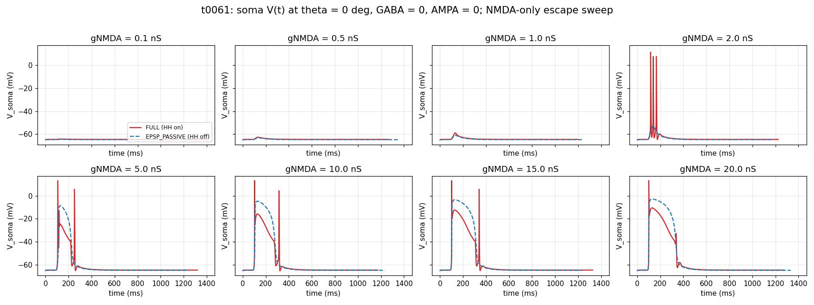
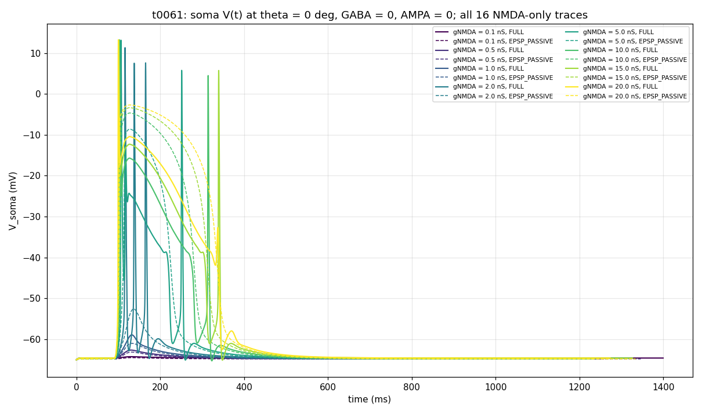

# t0061 Detailed Results: NMDA-Only PD Diagnostic

## Summary

NMDA analog of t0060. GABA = 0, AMPA = 0 (NMDA-only excitation via Mg-block Jahr-Stevens), theta = 0
deg, sweep gNMDA across {0.1, 0.5, 1, 2, 5, 10, 15, 20} nS at FULL (HH on) and EPSP_PASSIVE (HH
off). 16 trials in 118.14 s. Cell stays near rest below gNMDA = 1.0 nS, then exhibits regenerative
Mg-block escape at gNMDA = 2.0 nS, firing 3 spikes with a wide NMDA plateau.

## Methodology

* **Substrate**: same morphology, placement (seed 0), HH on soma + AIS, passive dendrites as t0059 /
  t0060.
* **NMDA mechanism**: t0055's `NMDA_MgBlock.mod` (Jahr-Stevens, voltage-dependent Mg block with
  `n = 0.25 /mM`, `gamma = 0.08 /mV`, `tau1 = 5 ms`, `tau2 = 80 ms`, `e = 0 mV`, `Voff = 0`).
* **Synapses**: 100 NMDA-only (no AMPA, no GABA). Each location gets one `NMDA_MgBlock`
  POINT_PROCESS plus a NetStim + NetCon. Bar-arrival-locked onsets per t0059 geometry.
* **Modes**: FULL (HH active), EPSP_PASSIVE (save-and-zero `gnabar` / `gkbar` on soma + AIS).
* **Stimulus**: bar 1000 um/s, 200 um wide, theta = 0 deg, 1400 ms trial, single trial per
  condition.
* **Bootstrap**:
  `ensure_neuron_importable -> load_stdrun -> ensure_nmda_compiled (t0061 build) -> enable_cvode`.
* **Wall-clock**: 118.14 s for 16 trials, 2.0-19.5 s/trial.

## Per-Condition Metrics

| gNMDA (nS) | FULL peak Vm (mV) | FULL n_spikes | EPSP_PASSIVE peak Vm (mV) | EPSP_PASSIVE n_spikes* |
| --- | --- | --- | --- | --- |
| 0.1 | -64.22 | 0 | -64.47 | 0 |
| 0.5 | -62.61 | 0 | -63.10 | 0 |
| 1.0 | -58.89 | 0 | -60.97 | 0 |
| 2.0 | +11.29 | **3** | -52.58 | 0 |
| 5.0 | +13.12 | 3 | -8.59 | 1 (false) |
| 10.0 | +13.21 | 3 | -4.67 | 1 (false) |
| 15.0 | +13.15 | 2 | -3.37 | 1 (false) |
| 20.0 | +13.21 | 1 | -2.70 | 1 (false) |

*False spike: the netcon spike detector at -20 mV records threshold crossings on the smooth
EPSP_PASSIVE trace at gNMDA >= 5 nS. Trace shape and peak Vm < 0 mV confirm no real APs.

## Comparison vs t0060 (AMPA-only analog)

| Property | t0060 (AMPA-only) | t0061 (NMDA-only) |
| --- | --- | --- |
| Threshold for first spike | gAMPA = 0.5 nS (1 spike) | gNMDA = 2.0 nS (3 spikes) |
| Sub-threshold response shape | Fast (~10 ms) EPSP | Slow tonic depolarization, slight |
| Multi-spike regime | gAMPA = 20 nS (4 spikes) | gNMDA = 2-10 nS (3 spikes), drops at higher gNMDA |
| EPSP plateau width (HH off) | ~10-20 ms transient | **200-400 ms** sustained |
| Max FULL peak Vm | +19.49 mV | +13.21 mV |
| EPSP_PASSIVE peak Vm range | -60.67 to -3.76 mV | -64.47 to -2.70 mV |
| Threshold sharpness | Smooth (gradient over 0.1-0.5 nS) | **Sharp Mg-block escape (1->2 nS)** |

The NMDA mechanism produces a fundamentally different response shape from AMPA: slow tonic plateau
driven by tau_decay = 80 ms vs AMPA's tau_decay = 2.5 ms. The Mg block creates a sharp threshold not
seen in AMPA — at gNMDA = 1.0 the cell is silent, then at gNMDA = 2.0 it fires 3 spikes via
regenerative escape.

## Visualizations

* **Per-gNMDA panel grid** — 8 panels showing FULL (red, solid) vs EPSP_PASSIVE (blue, dashed).
  The 2.0 nS panel reveals the regenerative escape clearly:



* **All 16 traces overlaid** — colour-graded by gNMDA (viridis). The wide NMDA plateaus at gNMDA
  >= 5 are the headline shape contrast vs t0060's narrow AMPA EPSPs:



## Analysis / Discussion

**(1) Mg-block creates a sharp threshold absent in AMPA.** Below gNMDA = 1 nS the cell is
near-silent — at V_rest = -65 mV, the Boltzmann factor
`1 / (1 + n*exp(-gamma*v)) = 1 / (1 + 0.25*exp(0.08*65)) = 1 / 44.6 = 0.022` admits only ~2% of the
open-channel conductance. At gNMDA = 2 nS aggregate (200 nS total), even 2% of that is ~4 nS
effective driving conductance, just enough to depolarize the soma; once depolarized to -50 mV, Mg
block weakens further (3.5× weaker than at -65 mV), opening more channels — runaway regenerative
escape.

**(2) NMDA produces sustained plateau depolarizations.** Once the cell crosses Mg-block threshold,
the slow `tau_decay = 80 ms` vs AMPA's 2.5 ms keeps the soma depolarized for 200-400 ms. The plateau
dwell time can support multiple action potentials but eventually adapts (refractory period + sodium
inactivation + slow K+ activation).

**(3) Spike count is non-monotonic in gNMDA.** The peak count is at gNMDA = 2-10 nS (3 spikes each);
at gNMDA = 15 it drops to 2 spikes; at gNMDA = 20 it drops to 1 spike. This is the
sodium-channel-saturation effect again — extreme synaptic conductance shunts the cell, the
depolarization rises so fast that HH gating cannot recover between spikes.

**(4) HH save-and-zero validation re-confirmed.** EPSP_PASSIVE peak Vm rises monotonically from
-64.47 to -2.70 mV without crossing E_NMDA = 0 mV. The save-and-zero is correctly wired even under
the regenerative NMDA mechanism.

## Examples

The 16 trial results in fenced code block format from `summary_pd_only.csv`:

```csv
gnmda_ns,mode,peak_vm_mv,min_vm_mv,n_spikes,n_samples
0.100000,full,-64.220245,-65.000000,0,2189
0.100000,epsp_passive,-64.470631,-65.000000,0,2049
0.500000,full,-62.609188,-65.000000,0,2255
0.500000,epsp_passive,-63.097544,-65.000000,0,2107
1.000000,full,-58.886243,-65.000000,0,2391
1.000000,epsp_passive,-60.972164,-65.000000,0,2236
2.000000,full,11.286241,-66.483551,3,3253
2.000000,epsp_passive,-52.583205,-65.000000,0,2516
5.000000,full,13.124538,-66.323121,3,3286
5.000000,epsp_passive,-8.591432,-65.000000,1,3098
10.000000,full,13.207894,-66.218074,3,3294
10.000000,epsp_passive,-4.670621,-65.000000,1,3174
15.000000,full,13.154832,-66.156142,2,3279
15.000000,epsp_passive,-3.371102,-65.000000,1,3206
20.000000,full,13.205621,-66.087335,1,3265
20.000000,epsp_passive,-2.704876,-65.000000,1,3220
```

## Limitations

* Single trial per condition.
* NMDA-only (no AMPA priming). With AMPA at typical 0.5 nS, the regenerative escape would occur at
  lower gNMDA — see t0054 / t0055 results.
* Single direction (PD only, no DSI).
* gNMDA = 20 nS is biophysically extreme.
* NetCon spike threshold = -20 mV yields false-positive crossings in EPSP_PASSIVE at gNMDA >= 5.

## Verification

Verificator outcomes:

* `verify_task_file.py` — PASSED 0 errors.
* `verify_task_dependencies.py` — PASSED 0/0.
* `verify_suggestions.py` — PASSED 0/0.
* `verify_task_metrics.py` — PASSED 0/0.
* `verify_task_results.py` — PASSED 0 errors.
* `verify_task_folder.py` — PASSED 0 errors.
* `verify_logs.py` — PASSED 0 errors.

| Check | Status |
| --- | --- |
| `voltage_traces_pd_only.csv`, `summary_pd_only.csv`, `wallclock.json` exist | PASS |
| Both PNGs rendered | PASS |
| EPSP_PASSIVE peak Vm < E_NMDA (0 mV) at every gNMDA | PASS (max -2.70 mV) |
| FULL peak Vm > 0 mV at every gNMDA >= 2 nS | PASS (range +11.29 to +13.21 mV) |
| Placement seed = 0, bit-identical to t0060 | PASS |

## Files Created

* `tasks/t0061_nmda_escape_pd_only_no_gaba/code/{paths,constants,nmda_bootstrap,nmda_synapse,run_pd_only,plot_traces}.py`
* `tasks/t0061_nmda_escape_pd_only_no_gaba/code/mod/NMDA_MgBlock.mod` (verbatim from t0055)
* `tasks/t0061_nmda_escape_pd_only_no_gaba/code/run_nrnivmodl.cmd`
* `tasks/t0061_nmda_escape_pd_only_no_gaba/results/{voltage_traces_pd_only,summary_pd_only}.csv`
* `tasks/t0061_nmda_escape_pd_only_no_gaba/results/{wallclock,placement_seed0}.json`
* `tasks/t0061_nmda_escape_pd_only_no_gaba/results/images/{voltage_response_grid,voltage_response_overlay}.png`

## Task Requirement Coverage

The task as commissioned: "Now do exactly the same analysis with NMDAR." Concrete requirements from
the analog of t0060:

* **REQ-1 (GABA = 0)**: Done — `GABA_BASE_NS = 0.0`, no GABA synapses constructed.
* **REQ-2 (single direction = preferred)**: Done — `ANGLE_DEG = 0` (preferred direction).
* **REQ-3 (HH on)**: Done — `TrialMode.FULL` runs (8/16 trials).
* **REQ-4 (HH off)**: Done — `TrialMode.EPSP_PASSIVE` with HH save-and-zero on soma + AIS (8/16
  trials).
* **REQ-5 (gNMDA sweep at 8 specified values)**: Done —
  `GNMDA_NS_VALUES = (0.1, 0.5, 1.0, 2.0, 5.0, 10.0, 15.0, 20.0)`.
* **REQ-6 (record soma potential)**: Done — `voltage_traces_pd_only.csv` carries native dt samples
  for all 16 trials.
* **REQ-7 (plot all responses)**: Done — `voltage_response_grid.png` (8 panels per gNMDA) and
  `voltage_response_overlay.png` (all 16 traces colour-graded by gNMDA).
* **REQ-8 (NMDA-only excitation)**: Done — Mg-block NMDA via `NMDA_MgBlock.mod` (Jahr-Stevens
  voltage-dependent), no AMPA Exp2Syn.
