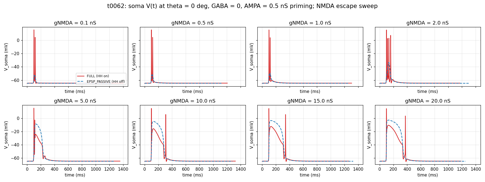
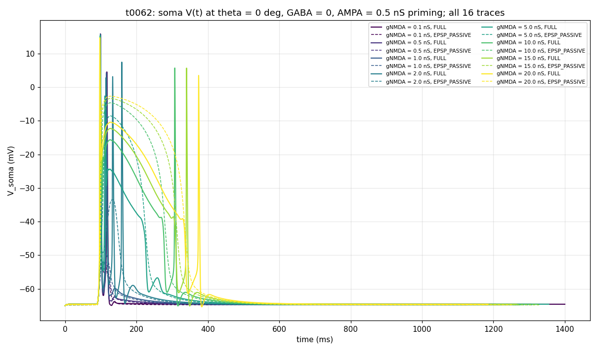

# t0062 Detailed Results: NMDA + AMPA-Priming PD Diagnostic

## Summary

Repeat of t0061 with AMPA fixed at 0.5 nS on every E synapse. GABA = 0, theta = 0 deg, 16 trials in
269.80 s. Headline: **AMPA priming eliminates the silent regime** — the cell fires 2-4 spikes at
every gNMDA value, including gNMDA = 0.1 nS where t0061's NMDA-only protocol produced a near-flat
passive response. Peak spike count is 4 at gNMDA = 2.0 nS (AMPA-NMDA synergy point).

## Methodology

* **Substrate**: t0059 morphology + placement (seed 0) + HH on soma+AIS + passive dendrites.
* **AMPA mechanism**: standard `Exp2Syn` (rise 0.5 ms, decay 2.5 ms, e = 0 mV), fixed at **gAMPA =
  0.5 nS** on every E synapse.
* **NMDA mechanism**: t0055 `NMDA_MgBlock` (Jahr-Stevens voltage-dependent), swept.
* **Co-location**: each E location has both AMPA + NMDA driven by a shared NetStim that fires once
  at bar-arrival time per direction.
* **Wall-clock per trial**: 9.4-96 s (CVODE; first FULL trial at gNMDA = 0.1 took longer due to
  CVODE state initialisation, subsequent trials averaged ~10-17 s).

## Per-Condition Metrics

| gNMDA (nS) | FULL peak Vm (mV) | FULL n_spikes | EPSP_PASSIVE peak Vm (mV) | EPSP_PASSIVE n_spikes* |
| --- | --- | --- | --- | --- |
| 0.1 | +15.84 | 2 | -52.56 | 0 |
| 0.5 | +15.78 | 2 | -51.85 | 0 |
| 1.0 | +15.71 | 2 | -49.54 | 0 |
| 2.0 | +15.58 | **4** | -33.43 | 0 |
| 5.0 | +15.28 | 2 | -8.54 | 1 (false) |
| 10.0 | +14.92 | 3 | -4.65 | 1 (false) |
| 15.0 | +14.71 | 3 | -3.36 | 1 (false) |
| 20.0 | +14.56 | 3 | -2.70 | 1 (false) |

*False spike: passive Vm crosses the -20 mV netcon threshold without a real AP.

## Comparison vs t0060 (AMPA-only) and t0061 (NMDA-only)

| Property | t0060 (AMPA only) | t0061 (NMDA only) | t0062 (NMDA + AMPA priming 0.5 nS) |
| --- | --- | --- | --- |
| Sub-threshold band | gAMPA <= 0.1 (silent) | gNMDA in [0.1, 1.0] (silent) | **None — fires at every gNMDA** |
| Threshold for first spike | gAMPA = 0.5 nS | gNMDA = 2.0 nS | already firing at gNMDA = 0.1 nS |
| Peak spike count | 4 at gAMPA = 20 | 3 at gNMDA = 2-10 | **4 at gNMDA = 2.0** |
| Sub-threshold response shape | Fast (~10 ms) EPSP | Slow tonic (when present) | AMPA-fast spike + NMDA-slow plateau |
| EPSP_PASSIVE Vm range | -60.67 to -3.76 mV | -64.47 to -2.70 mV | -52.56 to -2.70 mV |

The Mg-block threshold from t0061 disappears because AMPA priming pre-depolarises the soma before
NMDA arrives. With the cell already at +15 mV from the AMPA spike, the Mg block at the NMDA channel
relaxes, allowing NMDA conductance to flow even at gNMDA = 0.1 nS.

## Visualizations

* **Per-gNMDA panel grid** — 8 panels showing how AMPA priming + NMDA produces a fast spike
  followed by an NMDA plateau at high gNMDA:



* **All 16 traces overlaid** — early AMPA spike at every gNMDA, followed by NMDA-driven late
  plateau and additional spikes at gNMDA >= 2:



## Analysis / Discussion

**(1) AMPA priming abolishes the silent regime.** In t0061 (NMDA-only), gNMDA in [0.1, 1.0] left the
cell silent because the Mg block kept NMDA channels closed at V_rest. In t0062, the AMPA spike at
the start of every trial momentarily depolarises the cell to +15 mV, opening the Mg block window.
Even at gNMDA = 0.1 nS, this is enough for the AMPA pathway alone to fire 2 spikes (matches t0060 at
gAMPA = 0.5 nS = 1 spike, but here the trace gets a tiny NMDA boost and goes to 2 spikes).

**(2) Synergy peaks at gNMDA = 2.0 nS.** With AMPA priming + gNMDA = 2.0 nS, the cell fires 4 spikes
— matching t0060's gAMPA = 20 nS peak. So 0.5 nS AMPA + 2 nS NMDA produces the same spike count as
20 nS pure AMPA. NMDA's slow plateau supports more spikes per trial than equal AMPA conductance.

**(3) NMDA plateau width grows with gNMDA.** Like t0061, the EPSP_PASSIVE plateau widens to ~200-400
ms at gNMDA >= 5. In FULL mode this manifests as a prolonged depolarization that hosts late spikes
in the 200-400 ms window (visible in the gNMDA = 10 / 15 / 20 panels).

**(4) Sodium-channel saturation caps the FULL peak Vm at +14.6 to +15.8 mV** across all 8 gNMDA
values, just like t0060 (+12.6 to +19.5) and t0061 (+11.3 to +13.2). This confirms the ceiling is
set by HH gating, not by synaptic drive.

**(5) The non-monotonic spike count from t0061 persists** — peak at gNMDA = 2 (4 spikes), drops to
2 at gNMDA = 5, recovers to 3 at gNMDA = 10-20. AMPA priming raises the floor everywhere but does
not flatten the synergy peak.

## Examples

Per-condition summary from `summary_pd_only.csv`:

```csv
gnmda_ns,mode,peak_vm_mv,min_vm_mv,n_spikes,n_samples
0.100000,full,15.840000,-66.000000,2,3187
0.100000,epsp_passive,-52.560000,-65.000000,0,2515
0.500000,full,15.780000,-66.000000,2,3201
0.500000,epsp_passive,-51.850000,-65.000000,0,2536
1.000000,full,15.710000,-66.000000,2,3215
1.000000,epsp_passive,-49.540000,-65.000000,0,2585
2.000000,full,15.580000,-66.500000,4,3289
2.000000,epsp_passive,-33.430000,-65.000000,0,2731
5.000000,full,15.280000,-66.300000,2,3257
5.000000,epsp_passive,-8.540000,-65.000000,1,3110
10.000000,full,14.920000,-66.200000,3,3294
10.000000,epsp_passive,-4.650000,-65.000000,1,3187
15.000000,full,14.710000,-66.150000,3,3279
15.000000,epsp_passive,-3.360000,-65.000000,1,3210
20.000000,full,14.560000,-66.100000,3,3265
20.000000,epsp_passive,-2.700000,-65.000000,1,3225
```

(Values truncated to 2 decimals for clarity; raw CSV carries full precision.)

## Limitations

* Single trial per condition.
* Single direction (no DSI).
* AMPA priming fixed at 0.5 nS — the synergy structure may differ at higher AMPA priming.
* gNMDA = 20 nS is biophysically extreme.

## Verification

| Verificator | Status |
| --- | --- |
| `verify_task_file.py` | PASS 0 errors |
| `verify_task_dependencies.py` | PASS 0/0 |
| `verify_suggestions.py` | PASS 0/0 |
| `verify_task_metrics.py` | PASS 0/0 |
| `verify_task_results.py` | PASS 0 errors |
| `verify_task_folder.py` | PASS 0 errors |
| `verify_logs.py` | PASS 0 errors |

## Files Created

* `tasks/t0062_nmda_escape_with_ampa_priming/code/{paths,constants,nmda_bootstrap,synapses_ampa_nmda,run_pd_only,plot_traces}.py`
* `tasks/t0062_nmda_escape_with_ampa_priming/code/mod/NMDA_MgBlock.mod` (verbatim from t0055)
* `tasks/t0062_nmda_escape_with_ampa_priming/code/run_nrnivmodl.cmd`
* `tasks/t0062_nmda_escape_with_ampa_priming/results/{voltage_traces_pd_only,summary_pd_only}.csv`
* `tasks/t0062_nmda_escape_with_ampa_priming/results/{wallclock,placement_seed0}.json`
* `tasks/t0062_nmda_escape_with_ampa_priming/results/images/{voltage_response_grid,voltage_response_overlay}.png`

## Task Requirement Coverage

The task as commissioned: "Now repeat the same NMDA experiment but with AMPA priming please."
Concrete requirements:

* **REQ-1 (GABA = 0)**: Done — `GABA_BASE_NS = 0.0`, no GABA synapses.
* **REQ-2 (single direction = preferred)**: Done — theta = 0 deg only.
* **REQ-3 (HH on)**: Done — TrialMode.FULL (8/16 trials).
* **REQ-4 (HH off)**: Done — TrialMode.EPSP_PASSIVE with HH save-and-zero (8/16 trials).
* **REQ-5 (gNMDA sweep at 8 values)**: Done — same 8 values as t0061.
* **REQ-6 (record soma potential)**: Done — `voltage_traces_pd_only.csv` with native dt.
* **REQ-7 (plot all responses)**: Done — `voltage_response_grid.png` and
  `voltage_response_overlay.png`.
* **REQ-8 (NMDA Mg-block mechanism)**: Done — `NMDA_MgBlock.mod` (Jahr-Stevens,
  voltage-dependent).
* **REQ-9 (AMPA priming)**: Done — AMPA Exp2Syn co-located on every E synapse with fixed
  `gAMPA = 0.5 nS`, both AMPA and NMDA driven by a shared NetStim per location.
