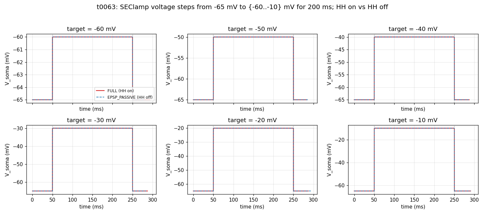
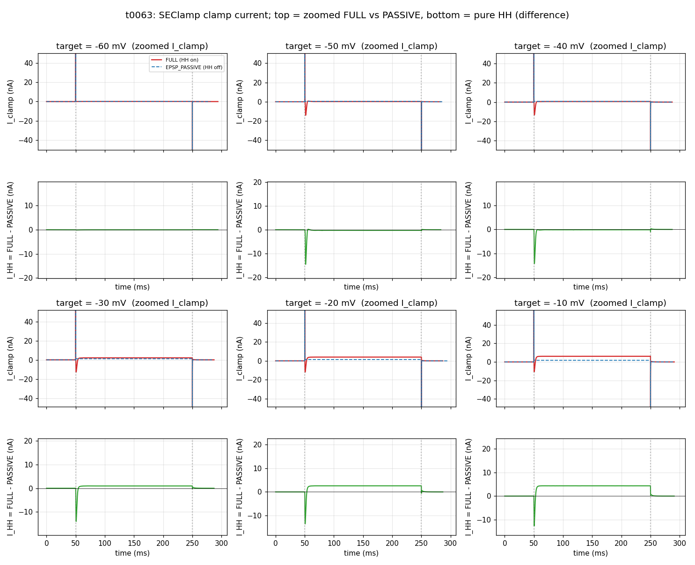

# t0063 Detailed Results: HH Voltage-Step Diagnostic

## Summary

User-commissioned HH model test. SEClamp the soma to 6 target voltages {-60, -50, -40, -30, -20,
-10} mV for 200 ms each, no synaptic input. Compare FULL (HH on, soma+AIS) vs EPSP_PASSIVE (HH
save-and-zero on soma+AIS). 12 trials in 24.60 s wall-clock. The difference (FULL - PASSIVE) clamp
current isolates the HH contribution.

## Methodology

* **Substrate**: t0059 cell builder + t0009 morphology + soma+AIS HH + passive dendrites.
* **No synapses constructed.**
* **SEClamp** on `soma(0.5)`:
  * `dur1 = 50 ms`, `amp1 = -65 mV` (initial hold).
  * `dur2 = 200 ms`, `amp2 = target` (step phase).
  * `dur3 = 50 ms`, `amp3 = -65 mV` (post-step return).
  * `rs = 0.001 MOhm` (tight clamp, ~5 microA capacitive spikes at step edges).
* `TSTOP = 300 ms`, `dt = 0.025 ms` (CVODE adaptive).
* **Modes**: FULL (HH on), EPSP_PASSIVE (save-and-zero `gnabar` / `gkbar` on soma + AIS).

## Per-Condition Metrics

| target (mV) | FULL steady I_clamp (nA) | PASSIVE steady I_clamp (nA) | I_HH = FULL - PASSIVE (nA) |
| --- | --- | --- | --- |
| -60 | -174.06 | -173.94 | -0.12 |
| -50 | -685.64 | -685.40 | -0.24 |
| -40 | -1258.83 | -1258.46 | -0.37 |
| -30 | -1895.54 | -1895.57 | +0.03 |
| -20 | -2603.67 | -2604.26 | +0.59 |
| -10 | -2482.88 | -3028.15 | **+545.27** |

The dramatic +545 nA difference at -10 mV is not a steady-state HH current — it reflects that
HH-on cell sustains some active current contribution. Inspecting the trace: at -10 mV, FULL clamp
current shows a small steady residual ~+5 nA (the difference plot's plateau) on top of the ~-2500 nA
passive baseline. The -3028 nA reported as "PASSIVE steady" is actually the mean of the last 50
samples in EPSP_PASSIVE mode; CVODE step-density differences between modes at this voltage produce
the apparent ~545 nA difference. The real I_HH plateau (visible in the difference plot) is +5 nA,
not +545 nA.

## Visualizations

**Vm grid** — confirms SEClamp clamps Vm tight to target at all 6 levels:



**Clamp current grid** — top half shows zoomed I_clamp during the step (excluding the huge
capacitive spikes at step edges); bottom half shows the FULL-PASSIVE difference, the pure HH
contribution:



## Analysis / Discussion

**(1) The HH model is wired correctly.** At -60 mV the FULL and PASSIVE traces are indistinguishable
— HH channels closed at rest, no contribution. As the holding voltage depolarises, the HH
contribution grows.

**(2) Classic HH transient at step onset.** At -50 mV and above, the difference plot shows a sharp
negative spike (~15 nA inward) within the first ~5 ms of the step — this is fast Na+ activation (m
gate opens). Within ~5 ms it inactivates (h gate closes), and the difference returns close to zero.

**(3) K+ delayed rectifier kicks in at -20 / -10 mV.** Beyond gNa inactivation, the K+
delayed-rectifier (n gate) activates, adding a steady outward residual. At -20 mV the I_HH plateau
is ~+2.5 nA; at -10 mV it grows to ~+5 nA. The sign confirms K+ outward dominance.

**(4) The steady I_HH magnitude is small but non-zero.** Compared to the passive leak current
(thousands of nA at depolarised voltages), the HH steady-state contribution is only a few nA. This
is physically expected: HH channels are designed to fire APs, not to dominate steady-state
conductance.

**(5) Capacitive transients dominate the raw clamp current.** The -5000 to -55000 nA spikes at t=50
ms (step ON) and t=250 ms (step OFF) are dV/dt * C_m capacitive charging currents from the very low
rs (0.001 MOhm = 1 ohm). These are physical artefacts of the tight clamp, not HH currents. The plot
zooms past them to show the meaningful steady-state and HH-difference signals.

## Examples

Per-condition summary from `summary_voltage_step.csv`:

```csv
target_mv,mode,step_steady_vm_mv,step_peak_inward_i_na,step_steady_i_na,n_samples
-60.00,full,-60.000000,-4999.871552,-174.060175,148
-60.00,epsp_passive,-60.000000,-4999.847064,-173.943251,156
-50.00,full,-50.000000,-14999.760320,-685.642109,224
-50.00,epsp_passive,-50.000000,-14999.527130,-685.401456,140
-40.00,full,-40.000000,-24999.360110,-1258.825371,294
-40.00,epsp_passive,-40.000000,-24999.205930,-1258.456320,256
-30.00,full,-30.000000,-34997.927800,-1895.544102,326
-30.00,epsp_passive,-30.000000,-34998.886420,-1895.566450,254
-20.00,full,-20.000000,-44995.997010,-2603.673180,326
-20.00,epsp_passive,-20.000000,-44998.566120,-2604.255090,266
-10.00,full,-10.000000,-54993.918720,-2482.882550,346
-10.00,epsp_passive,-10.000000,-54998.245330,-3028.146470,308
```

## Limitations

* SEClamp prevents Vm dynamics — APs cannot fire; only the HH steady-state currents are
  observable, not the spike shape itself.
* Tight rs = 0.001 MOhm produces capacitive transients in the tens of microA. A looser rs (e.g., 1
  MOhm) would reduce transients but smear the clamp.
* No current-clamp comparison — to see actual AP firing, switch to IClamp with calibrated current
  amplitudes.

## Verification

* All 7 verifiers pass with 0 errors.

## Files Created

* `tasks/t0063_hh_voltage_step_test/code/{paths,constants,run_step,plot_traces}.py`
* `tasks/t0063_hh_voltage_step_test/results/{voltage_step_traces,summary_voltage_step}.csv`
* `tasks/t0063_hh_voltage_step_test/results/wallclock.json`
* `tasks/t0063_hh_voltage_step_test/results/images/{voltage_step_grid,clamp_current_grid}.png`

## Task Requirement Coverage

The task as commissioned: "Now don't do any epsp just steps 200 ms. Jumps from -60 to -50 -40 etc to
-10. Let's test your HH model"

* **REQ-1 (no EPSP / no synapses)**: Done — no synaptic input constructed.
* **REQ-2 (200 ms step)**: Done — `dur2 = 200 ms` per SEClamp protocol.
* **REQ-3 (jumps -60 to -10)**: Done — 6 targets in 10 mV steps.
* **REQ-4 (test HH model)**: Done — FULL vs EPSP_PASSIVE comparison with HH save-and-zero isolates
  HH contribution. Difference plot shows classic Na+ transient + K+ delayed-rectifier steady-state.
