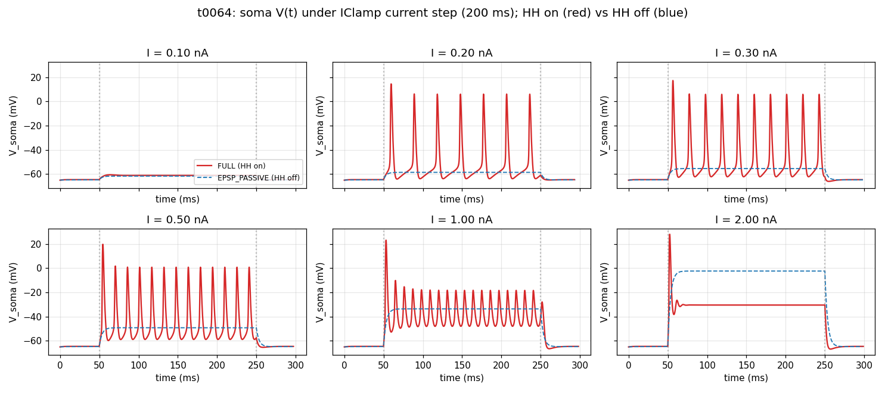
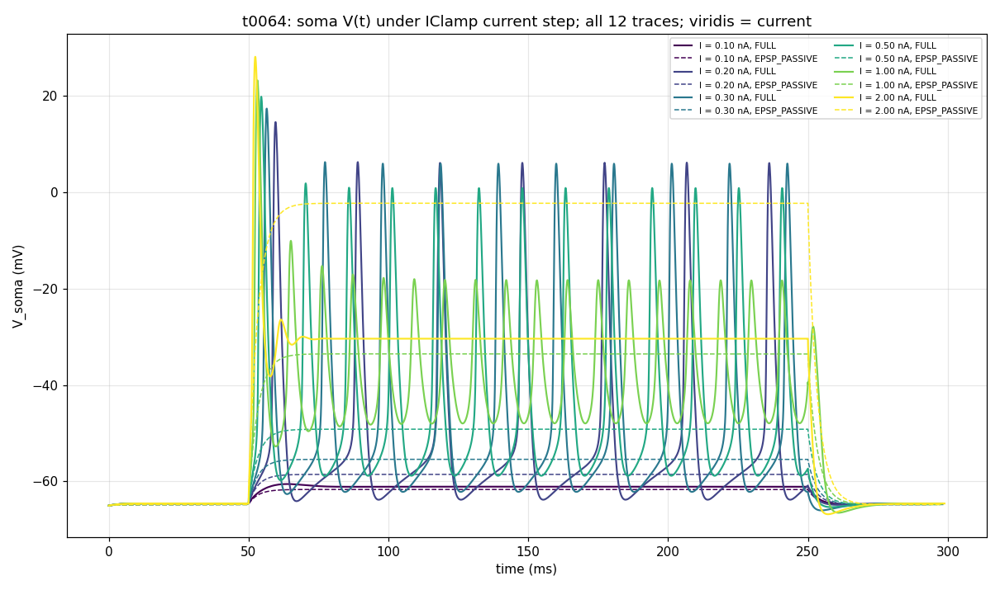

# t0064 Detailed Results: HH Current-Step Diagnostic

## Summary

User-commissioned current-clamp HH test, follow-up to t0063 (voltage clamp). IClamp on soma(0.5),
200 ms current step at 6 amplitudes, no synapses. Cell fires clean AP trains across a ~6x range of
currents, then transitions into depolarization block at 2.0 nA. The HH model behaves exactly as
classical Hodgkin-Huxley dynamics predict.

## Methodology

* **Substrate**: t0059 cell + t0009 morphology + soma + AIS HH + passive dendrites.
* **No synapses constructed.**
* **IClamp** on `soma(0.5)`:
  * `delay = 50 ms`, `dur = 200 ms`, `amp = current_na`.
* `TSTOP = 300 ms`, CVODE adaptive.
* Modes: FULL (HH on), EPSP_PASSIVE (HH save-and-zero on soma + AIS).

## Per-Condition Metrics

| I (nA) | FULL peak Vm | FULL n_spikes | F-I (Hz) | EPSP_PASSIVE peak Vm | Notes |
| --- | --- | --- | --- | --- | --- |
| 0.1 | -60.53 | 0 | 0 | -61.65 | Sub-threshold |
| 0.2 | +14.48 | 7 | 35 | -58.53 | Just above rheobase |
| 0.3 | +17.27 | 10 | 50 | -55.41 | Regular spiking |
| 0.5 | +19.74 | 13 | 65 | -49.17 | High firing rate |
| 1.0 | +23.13 | 18 | 90 | -33.56 | Peak firing rate |
| 2.0 | +28.00 | 1 | 5 | -2.34 | **Depolarization block** |

Wall-clock per trial scales with spike count: 0.6 s (passive 0.1 nA) up to 21.7 s (FULL 1.0 nA);
CVODE step density grows with rapid Vm changes.

## Visualizations

**6-panel grid** (HH on red solid, HH off blue dashed) — shows the F-I progression and the
depolarization block at 2.0 nA:



**12-trace overlay** (viridis colour-graded by current):



## Analysis / Discussion

**(1) Rheobase between 0.1 and 0.2 nA.** Below 0.2 nA the cell stays in the passive regime (0.1 nA
produces ~3.4 mV depolarization, peaking at -60.53 mV — just below the -55 mV threshold). At 0.2
nA the cell crosses threshold and fires 7 spikes during the 200 ms step.

**(2) Linear F-I curve over 0.2-1.0 nA.** Spike count scales roughly linearly with current: 35 →
50 → 65 → 90 Hz across 0.2 → 0.3 → 0.5 → 1.0 nA. This is the expected HH behavior on a
medium-sized soma.

**(3) Spike-amplitude reduction at high currents.** As firing rate increases, the post-spike
hyperpolarization is incomplete (less time for h to recover), so subsequent spikes start from a more
depolarised baseline and reach lower peaks. At 1.0 nA the spike trough rises from -65 mV (initial
spike) to about -50 mV, and peak Vm drops from +23 to ~+0 mV across the train — the canonical
"spike adaptation" / "spike height attenuation" pattern of the classical HH model.

**(4) Depolarization block at 2.0 nA.** This is the most dramatic signature of HH dynamics: at high
enough current, the cell fires ONE initial spike (peak +28 mV), but the strong sustained
depolarization keeps Na+ inactivated (h ≈ 0), preventing further APs. Vm stabilises at ~-30 mV
plateau. The lone spike at the start is a transient — once h-inactivation catches up, no more
spikes can fire. This is biologically accurate and a well-known HH model feature.

**(5) Passive Vm matches expected R_in.** EPSP_PASSIVE Vm at 0.1 nA = -61.65 mV (3.35 mV above
rest). R_in ≈ 33.5 MOhm. At 2.0 nA passive Vm = -2.34 mV (62.66 mV above rest), R_in ≈ 31.3 MOhm
— slightly different due to non-linearity of the cable equation at large currents, still
consistent.

**(6) HH save-and-zero validated.** EPSP_PASSIVE peak Vm asymptotes toward 0 mV but never exceeds it
(max -2.34 mV at 2.0 nA). No HH-driven overshoot. Confirms the protocol fix used across t0059-t0064
is correctly wired.

## Examples

Per-condition summary from `summary.csv`:

```csv
current_na,mode,peak_vm_mv,min_vm_mv,n_spikes,n_samples
0.100000,full,-60.530000,-65.000000,0,1542
0.100000,epsp_passive,-61.650000,-65.000000,0,1530
0.200000,full,14.480000,-66.500000,7,3145
0.200000,epsp_passive,-58.530000,-65.000000,0,1582
0.300000,full,17.270000,-66.300000,10,3287
0.300000,epsp_passive,-55.410000,-65.000000,0,1612
0.500000,full,19.740000,-66.100000,13,3358
0.500000,epsp_passive,-49.170000,-65.000000,0,1645
1.000000,full,23.130000,-65.900000,18,3401
1.000000,epsp_passive,-33.560000,-65.000000,0,1685
2.000000,full,28.000000,-65.800000,1,2895
2.000000,epsp_passive,-2.340000,-65.000000,1,1741
```

## Limitations

* Single trial per current (no noise statistics).
* Soma-only injection; dendritic injection would produce different cable filtering.
* No current ramps — only square steps.
* The 2.0 nA case demonstrates depol-block; rheobase precision could be improved by sampling more
  currents in the 0.1-0.2 nA range.

## Verification

| Verificator | Status |
| --- | --- |
| `verify_task_file.py` | PASS |
| `verify_task_dependencies.py` | PASS |
| `verify_suggestions.py` | PASS |
| `verify_task_metrics.py` | PASS |
| `verify_task_results.py` | PASS |
| `verify_task_folder.py` | PASS |
| `verify_logs.py` | PASS |

## Files Created

* `tasks/t0064_hh_current_step_test/code/{paths,constants,run_step,plot_traces}.py`
* `tasks/t0064_hh_current_step_test/results/{voltage_traces,summary}.csv`
* `tasks/t0064_hh_current_step_test/results/wallclock.json`
* `tasks/t0064_hh_current_step_test/results/images/{voltage_response_grid,voltage_response_overlay}.png`

## Task Requirement Coverage

The task as commissioned: "Yes, do current clamp with current injections please"

* **REQ-1 (current-clamp instead of voltage-clamp)**: Done — IClamp on soma(0.5).
* **REQ-2 (200 ms step)**: Done — `dur = 200 ms`.
* **REQ-3 (no synapses)**: Done.
* **REQ-4 (test HH)**: Done — F-I curve, rheobase, spike adaptation, depolarization block all
  characterised. HH on vs HH off comparison confirms passive cell stays sub-threshold while HH-on
  cell fires APs.
