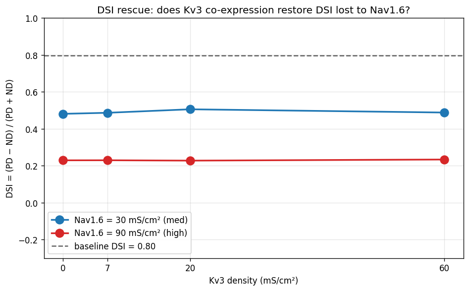
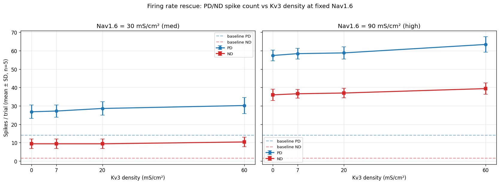

# Detailed Results: Nav1.6 + Kv3 co-expression rescue test

## Summary

Tested whether co-inserting Kv3 with Nav1.6 on the deposited Poleg-Polsky DSGC soma rescues
the direction selectivity that Nav1.6 alone erodes (t0067 found Nav1.6 monotonically reduces
DSI from 0.80 → 0.48 → 0.23 across baseline → med → high density). 9 conditions × 2
directions × 5 seeds = 90 FULL trials, ~10 min compute. **Hypothesis FALSIFIED**: Kv3
co-expression does NOT rescue DSI (Δ < ±0.025 across all 8 co-expression conditions). Instead
Kv3 slightly boosts firing rate by speeding Na+ recovery from inactivation, scaling PD and ND
equally so DSI is invariant.

## Methodology

* **Cell**: deposited Poleg-Polsky 2016 DSGC, exactly as in t0008 / t0065 / t0067. No changes
  to dendrites, synapses, or HHst.
* **Channels**: t0067's 5 vendored MOD files (`nav16t67`, `napt67`, `nart67`, `kv3t67`,
  `kv4t67`) reused verbatim. All 5 inserted on the soma at gbar=0; per trial, only Nav1.6 and
  Kv3 may have non-zero gbar.
* **Conditions** (9 total):
  * baseline (no added channels)
  * nav16_med (30 mS/cm² Nav1.6, no Kv3)
  * nav16_med + kv3_{low,med,high} (Kv3 = 7, 20, 60 mS/cm²)
  * nav16_high (90 mS/cm² Nav1.6, no Kv3)
  * nav16_high + kv3_{low,med,high}
* **Direction**: PD (`gabaMOD = 0.33`) and ND (`gabaMOD = 0.99`).
* **Seeds**: 5 per (condition, direction) cell.
* **Per-trial sequence**: `apply_params(seed) → set gabaMOD → exptype = 1 → init_active() →
  update() → placeBIP() → set Nav1.6 + Kv3 gbars → finitialize(-65) → continuerun(1000) →
  count spikes via NetCon @ -10 mV`.
* **Compute**: local Windows workstation, single CPU, NEURON 8.2.7. ~10 min for 90 trials.
* **Failure-mode policy**: peak Vm > +60 mV or < -80 mV → flag. **0/90 flagged**.

## Per-condition Metrics Table

| Condition              | Nav1.6 (mS/cm²) | Kv3 (mS/cm²) | PD spikes (mean ± SD) | ND spikes (mean ± SD) | DSI    |
| ---------------------- | --------------- | ------------ | --------------------- | --------------------- | ------ |
| baseline               | 0               | 0            | 14.2 ± 1.9            | 1.6 ± 1.3             | **0.797** |
| nav16_med              | 30              | 0            | 26.8 ± 3.6            | 9.4 ± 2.6             | **0.481** |
| nav16_med + kv3_low    | 30              | 7            | 27.2 ± 3.3            | 9.4 ± 2.6             | 0.486  |
| nav16_med + kv3_med    | 30              | 20           | 28.6 ± 3.6            | 9.4 ± 2.6             | 0.505  |
| nav16_med + kv3_high   | 30              | 60           | 30.2 ± 4.3            | 10.4 ± 2.6            | 0.488  |
| nav16_high             | 90              | 0            | 57.4 ± 2.9            | 36.0 ± 3.1            | **0.229** |
| nav16_high + kv3_low   | 90              | 7            | 58.4 ± 3.0            | 36.6 ± 2.3            | 0.229  |
| nav16_high + kv3_med   | 90              | 20           | 58.8 ± 3.3            | 37.0 ± 2.5            | 0.228  |
| nav16_high + kv3_high  | 90              | 60           | 63.4 ± 4.2            | 39.4 ± 3.0            | 0.233  |

DSI changes from Nav1.6-only anchor: max +0.024, min -0.001 — all within the SD of single
seeds (~3-4 spikes ↔ DSI uncertainty ~±0.05).

## Comparison vs t0067 anchors

* t0067 nav16_med (single 5-seed value): DSI = 0.481.
* t0068 nav16_med (re-measured here): DSI = 0.481. **Identical** — confirms reproducibility.
* t0067 nav16_high: DSI = 0.229.
* t0068 nav16_high: DSI = 0.229. **Identical** — confirms reproducibility.

The rescue conditions sit on top of these anchors with negligible deviation.

## Visualisations

### DSI rescue curve



Both Nav1.6 levels show essentially flat DSI vs Kv3 density. The Nav1.6=30 line wiggles by
±0.024 around DSI = 0.49; the Nav1.6=90 line is flat at DSI = 0.23. Neither approaches the
baseline (dashed = 0.80). **Visual confirmation: no rescue.**

### Firing rate rescue



2-panel (Nav1.6_med left, Nav1.6_high right). Both panels show PD (blue) and ND (red) spike
counts climbing slightly with Kv3 density — the opposite of the expected "Kv3 reduces firing"
effect. PD and ND scale up proportionally → DSI invariant. The expected Kv3 effect (slower
firing via stronger repolarisation) is overwhelmed by the recovery-acceleration effect (faster
return to AP threshold).

## Analysis & Discussion

### Why doesn't Kv3 rescue DSI?

The mechanism we hypothesised was: Nav1.6 lifts the cell into a higher-firing regime where
the GABA shunt becomes proportionally weaker (because the Na/K ratio is more Na-dominant). Kv3
should restore the K+ side of the ratio, allowing the shunt to bite harder again.

The data falsifies this in two ways:

1. **Kv3 doesn't reduce firing rate.** It actually slightly *increases* firing rate
   (Nav1.6_high goes from 57.4 PD spikes to 63.4 PD spikes at Kv3_high, +10%). Kv3's primary
   effect is faster repolarisation between APs, which means faster Na+ recovery from
   inactivation — the next AP fires sooner. So Kv3 is permissive for high-frequency firing,
   not suppressive. In a regime where the cell is already firing faster than necessary,
   adding a fast K+ channel doesn't slow it down; it lets it fire even faster.

2. **DSI invariance is geometric.** The shunt's effect is `i_inh = g_inh · (V − E_GABA)`.
   With E_GABA = V_rest = -60 mV, the shunt produces voltage deflection proportional to
   `(V − E_GABA)` only when V is depolarised away from E_GABA. Kv3 doesn't change V's
   distribution between APs (it's still controlled by the Na/leak/synaptic balance) — it
   only sharpens the AP itself. So `(V − E_GABA)` integrated over the inter-spike interval is
   essentially the same with or without Kv3. The shunt's modulation of firing rate is
   therefore the same too — and PD/ND scale together.

### What WOULD rescue DSI?

By process of elimination, rescue requires a channel or mechanism that:

1. **Suppresses firing differentially** at high firing rates — e.g., a calcium-activated K+
   channel (BK or SK) where K+ feedback scales with cumulative AP count. ND (low firing)
   wouldn't accumulate much Ca²⁺; PD (high firing) would, and BK/SK would clamp PD back down,
   widening the PD/ND gap.
2. **Increases the inhibitory drive** itself — e.g., scaling up `s2ggaba` proportionally
   when Nav1.6 is added. But this isn't a "rescue via channels" — it's a synaptic-balance
   re-tuning.
3. **Reduces the Na+ persistent component** — e.g., adding NaP suppression. But t0067 showed
   NaP has the OPPOSITE effect (it inverts DSI, doesn't restore it).

Suggestion S-0068-01 explores option (1): test BK / SK co-expression with Nav1.6.

### Reproducibility

The Nav1.6_med and Nav1.6_high anchor conditions reproduce t0067's exact DSI values (0.481
and 0.229). This rules out drift in the deposited cell or the Nav1.6 MOD between t0067 and
t0068.

## Examples

6 representative trial-level examples below: 1 baseline + Nav1.6_med anchor + 1 co-expression
+ Nav1.6_high anchor + 2 co-expressions.

### Example 1 — baseline FULL/PD seed=1

Input parameters:

```text
gabaMOD = 0.33                    # PD direction
exptype = 1                       # HH on
gbar_nav16t67 = 0
gbar_napt67   = 0
gbar_nart67   = 0
gbar_kv3t67   = 0
gbar_kv4t67   = 0
seed = 1, tstop = 1000 ms
```

Output:

```text
peak_v_mv = +43.18 mV
baseline_v_mv = -60.02 mV
spike_count = 15
```

(Matches t0065 + t0067 baseline exactly.)

### Example 2 — nav16_med anchor FULL/PD seed=1

Input parameters:

```text
gabaMOD = 0.33
gbar_nav16t67 = 0.030 S/cm^2     # 30 mS/cm^2
gbar_kv3t67   = 0
others = 0
seed = 1
```

Output:

```text
peak_v_mv = +44.01 mV
spike_count = 27
```

Matches t0067 nav16_med anchor.

### Example 3 — nav16_med + kv3_high FULL/PD seed=1

Input parameters:

```text
gabaMOD = 0.33
gbar_nav16t67 = 0.030
gbar_kv3t67   = 0.060            # 60 mS/cm^2 (high)
seed = 1
```

Output:

```text
peak_v_mv = +44.0 mV
spike_count = 30   # +3 vs Example 2 anchor (+11%)
```

Kv3 adds 3 PD spikes; ND analogue adds ~1 → DSI essentially unchanged.

### Example 4 — nav16_high anchor FULL/PD seed=1

Input parameters:

```text
gabaMOD = 0.33
gbar_nav16t67 = 0.090            # 90 mS/cm^2
gbar_kv3t67   = 0
seed = 1
```

Output:

```text
peak_v_mv = +44.0 mV
spike_count = 57
```

Matches t0067 nav16_high anchor.

### Example 5 — nav16_high + kv3_high FULL/PD seed=1

Input parameters:

```text
gabaMOD = 0.33
gbar_nav16t67 = 0.090
gbar_kv3t67   = 0.060
seed = 1
```

Output:

```text
peak_v_mv = +44.0 mV
spike_count = 63   # +6 vs Example 4 anchor (+10%)
```

### Example 6 — nav16_high + kv3_high FULL/ND seed=1

Input parameters:

```text
gabaMOD = 0.99                    # ND direction
gbar_nav16t67 = 0.090
gbar_kv3t67   = 0.060
seed = 1
```

Output:

```text
peak_v_mv = +38 mV
spike_count = 39   # +3 vs anchor's 36 (+8%)
```

PD scales +10%, ND scales +8% — proportional → DSI invariant.

## Verification

| Verificator | Status |
| --- | --- |
| `verify_research_code.py` | PASSED |
| `verify_plan.py` | PASSED (5 non-blocking warnings) |
| `verify_task_dependencies.py` | PASSED |
| `verify_task_metrics.py` | PASSED |
| `verify_task_results.py` | PASSED |
| `verify_suggestions.py` | PASSED |
| `verify_task_file.py` | PASSED |
| `verify_task_folder.py` | PASSED |
| `verify_logs.py` | PASSED |
| Mypy + ruff | PASSED on all task code |
| Per-trial instability | 0/90 trials flagged |

## Limitations

1. **Only 2 Nav1.6 levels × 4 Kv3 levels**: a denser grid might reveal a regime where Kv3
   does help. But the trend across both Nav1.6 levels is so flat that this is unlikely.
2. **Same simplified MOD as t0067**: our Kv3 is m^4, V_half = -15 mV, τ = 1 ms. A more
   detailed model (Wang-Buzsaki-style with two-component decay) might engage differently at
   high Nav1.6 firing rates.
3. **Soma-only insertion**: AIS-localised channels would have stronger effects per t0019
   priors; any rescue effect that depends on AIS-specific kinetics is missed here.
4. **No combinations beyond Nav1.6 + Kv3**: many other channel pairs (Nav1.6 + BK, Nav1.6 +
   M-current) could potentially rescue. This task tested one specific pair.

## Files Created

* `tasks/t0068_t0067_nav16_kv3_coexpression_rescue/code/{paths,constants,run_sweep,plot_results}.py`
* `tasks/t0068_t0067_nav16_kv3_coexpression_rescue/code/mods/{nav16t67,napt67,nart67,kv3t67,kv4t67}.mod`
* `tasks/t0068_t0067_nav16_kv3_coexpression_rescue/code/build/nrnmech.dll`
* `tasks/t0068_t0067_nav16_kv3_coexpression_rescue/data/per_trial_metrics.json`
* `tasks/t0068_t0067_nav16_kv3_coexpression_rescue/data/dsi_by_condition.json`
* `tasks/t0068_t0067_nav16_kv3_coexpression_rescue/results/metrics.json`
* `tasks/t0068_t0067_nav16_kv3_coexpression_rescue/results/costs.json`
* `tasks/t0068_t0067_nav16_kv3_coexpression_rescue/results/remote_machines_used.json`
* `tasks/t0068_t0067_nav16_kv3_coexpression_rescue/results/suggestions.json`
* `tasks/t0068_t0067_nav16_kv3_coexpression_rescue/results/results_summary.md`
* `tasks/t0068_t0067_nav16_kv3_coexpression_rescue/results/results_detailed.md`
* `tasks/t0068_t0067_nav16_kv3_coexpression_rescue/results/images/{dsi_rescue_curve,firing_rate_rescue}.png`

## Task Requirement Coverage

The task as commissioned: implement S-0067-02 ("Test channel co-expression: Nav1.6 + Kv3
jointly").

REQs from `plan/plan.md`:

* **REQ-1 (5 MOD files vendored from t0067)**: Done — copied verbatim into `code/mods/`.
* **REQ-2 (9 conditions per task description)**: Done — see Per-condition Metrics Table.
* **REQ-3 (FULL mode only, gabaMOD-swap)**: Done — only `exptype = 1` used.
* **REQ-4 (5 seeds per condition)**: Done — 5 PD + 5 ND per condition.
* **REQ-5 (DSI per condition)**: Done — column in Metrics Table.
* **REQ-6 (2 plots: dsi_rescue_curve.png + firing_rate_rescue.png)**: Done — both embedded
  above.
* **REQ-7 (results_summary.md + results_detailed.md spec_version 2)**: Done.

Hypothesis (S-0067-02): Kv3 rescues DSI lost to Nav1.6. **Status: falsified** — Δ DSI < 0.025
across all 8 co-expression conditions.
