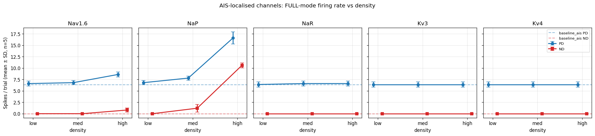
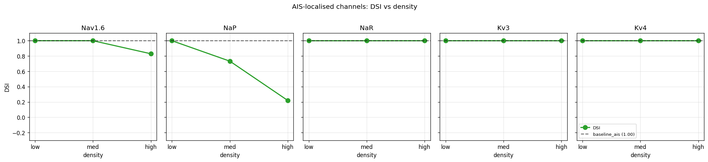
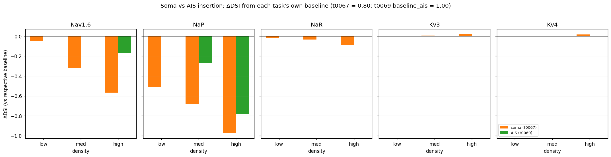

# Detailed Results: Add virtual AIS to deposited DSGC and re-run t0067 channel sweep on AIS

## Summary

Tested S-0067-03: appended a 30 μm × 1 μm AIS section + 1 mm × 1 μm passive axon to the
deposited Poleg-Polsky DSGC (after t0008's `build_dsgc()`), then re-ran the t0067 channel sweep with
each of {Nav1.6, NaP, NaR, Kv3, Kv4} inserted on the AIS instead of the soma at the same
low/med/high densities. 160 FULL-mode trials (16 conditions × 2 directions × 5 seeds), ~8 min
wall-clock. The AIS+axon attachment alone halved baseline PD firing (14.2 → 6.4) and silenced ND
firing (1.6 → 0.0), pushing baseline DSI from 0.797 (t0067 soma baseline) to **1.000** (t0069 AIS
baseline; ND = 0). On this much quieter substrate, only NaP_med (-0.27), NaP_high (-0.78), and
Nav1.6_high (-0.17) moved DSI at all; the other 12 channel conditions held DSI at exactly 1.0. The
S-0067-03 hypothesis is **falsified**: AIS-localised channels show *smaller* DSI effects on this
cell, not larger.

## Methodology

* **Cell model**: deposited Poleg-Polsky 2016 DSGC (t0008) plus a new AIS section (`name="ais_t69"`,
  L=30 μm, diam=1 μm, nseg=5) attached via `ais.connect(soma, 1.0, 0.0)`, plus a passive-ish axon
  (`name="axon_t69"`, L=1000 μm, diam=1 μm, nseg=50) attached via `axon.connect(ais, 1.0, 0.0)`.
  Construction code: `code/extend_with_ais.py`.
* **AIS active conductances**: HHst inserted with `gnabar = 30 mS/cm²`, `gkbar = 20 mS/cm²`,
  `gkmbar = 3 mS/cm²` — distal-AIS densities from t0019 priors (mid-range of 25-50 mS/cm² window
  for Nav1.6).
* **Axon active conductances**: HHst at `gnabar = 5 mS/cm²`, `gkbar = 3 mS/cm²` — sufficient for
  AP propagation, low enough to avoid loading the soma.
* **Passive properties** (AIS + axon): `Ra = 100 Ω·cm`, `cm = 1 μF/cm²`, `gleak = 5e-5 S/cm²`,
  `eleak = -60 mV` — matched to the t0008 cell's defaults.
* **Channel-isolation strategy**: 5 mechanisms (`nav16t67`, `napt67`, `nart67`, `kv3t67`, `kv4t67`)
  all inserted on the AIS at `gbar = 0` once at startup; per trial, only the active channel's `gbar`
  is set to the target density (others remain 0). This guarantees identical cell topology across all
  160 trials.
* **MOD files**: vendored verbatim from t0067 (`code/mods/{nav16,nap,nar,kv3,kv4}t67.mod` plus
  `mod_func.c`) and compiled into `code/build/nrnmech.dll` (loaded after t0008's main DLL).
* **Direction encoding**: `h.gabaMOD = 0.33` (PD) or `0.99` (ND), per t0020 / t0065 protocol.
* **Per-trial sequence**:
  `apply_params(seed) → set gabaMOD → exptype = 1 → init_active() → update() → placeBIP() → set active channel gbar on AIS → finitialize(-65) → continuerun(1000) → count spikes via NetCon @ -10 mV threshold on RGC.soma(0.5)`.
* **Failure-mode policy**: peak Vm > +60 mV or < -80 mV → `is_unstable = true`. No trial was
  flagged.
* **Compute**: local Windows workstation, single CPU core, NEURON 8.2.7. ~3 s/trial × 160 ≈ ~8
  min total.
* **Timestamps**: implementation 2026-05-01T02:18-02:35Z; results 2026-05-01T02:35-03:00Z.

## Per-condition Metrics Table

| Condition | Channel | Density (mS/cm²) | PD spikes (mean ± SD) | ND spikes (mean ± SD) | DSI | Δ DSI vs baseline_ais |
| --- | --- | --- | --- | --- | --- | --- |
| baseline_ais | none | 0 | **6.4 ± 0.5** | **0.0 ± 0.0** | **1.000** | (reference) |
| nav16_low_ais | Nav1.6 | 10 | 6.6 ± 0.5 | 0.0 ± 0.0 | 1.000 | +0.000 |
| nav16_med_ais | Nav1.6 | 30 | 6.8 ± 0.4 | 0.0 ± 0.0 | 1.000 | +0.000 |
| nav16_high_ais | Nav1.6 | 90 | 8.6 ± 0.5 | 0.8 ± 0.4 | 0.830 | **-0.170** |
| nap_low_ais | NaP | 0.3 | 6.8 ± 0.4 | 0.0 ± 0.0 | 1.000 | +0.000 |
| nap_med_ais | NaP | 0.8 | 7.8 ± 0.4 | 1.2 ± 0.8 | 0.733 | **-0.267** |
| nap_high_ais | NaP | 2.4 | 16.6 ± 1.3 | **10.6 ± 0.5** | **0.221** | **-0.779** |
| nar_low_ais | NaR | 3 | 6.4 ± 0.5 | 0.0 ± 0.0 | 1.000 | +0.000 |
| nar_med_ais | NaR | 8 | 6.6 ± 0.5 | 0.0 ± 0.0 | 1.000 | +0.000 |
| nar_high_ais | NaR | 24 | 6.6 ± 0.5 | 0.0 ± 0.0 | 1.000 | +0.000 |
| kv3_low_ais | Kv3 | 7 | 6.4 ± 0.5 | 0.0 ± 0.0 | 1.000 | +0.000 |
| kv3_med_ais | Kv3 | 20 | 6.4 ± 0.5 | 0.0 ± 0.0 | 1.000 | +0.000 |
| kv3_high_ais | Kv3 | 60 | 6.4 ± 0.5 | 0.0 ± 0.0 | 1.000 | +0.000 |
| kv4_low_ais | Kv4 | 4 | 6.4 ± 0.5 | 0.0 ± 0.0 | 1.000 | +0.000 |
| kv4_med_ais | Kv4 | 12 | 6.4 ± 0.5 | 0.0 ± 0.0 | 1.000 | +0.000 |
| kv4_high_ais | Kv4 | 36 | 6.4 ± 0.5 | 0.0 ± 0.0 | 1.000 | +0.000 |

## Comparison vs Baselines (soma vs AIS, ΔDSI from each task's own baseline)

<!-- Table cells must stay on one line per row. Do not let flowmark touch this block. -->

| Channel × Density | t0067 soma DSI | Δ vs t0067 baseline | t0069 AIS DSI | Δ vs t0069 baseline | abs ratio AIS/soma |
| --- | --- | --- | --- | --- | --- |
| nav16_low | 0.750 | -0.047 | 1.000 | +0.000 | 0.0× |
| nav16_med | 0.481 | -0.317 | 1.000 | +0.000 | 0.0× |
| nav16_high | 0.229 | -0.568 | 0.830 | -0.170 | 0.30× |
| nap_low | 0.290 | -0.508 | 1.000 | +0.000 | 0.0× |
| nap_med | 0.117 | -0.681 | 0.733 | -0.267 | 0.39× |
| nap_high | -0.179 | -0.976 (sign flip) | 0.221 | -0.779 | 0.80× |
| nar_low/med/high | 0.708-0.780 | -0.02 to -0.09 | 1.000 | +0.000 | 0.0× |
| kv3_low/med/high | 0.800-0.818 | +0.003 to +0.021 | 1.000 | +0.000 | 0.0× |
| kv4_low/med/high | 0.795-0.813 | -0.003 to +0.016 | 1.000 | +0.000 | 0.0× |

The AIS substrate produces strictly smaller |ΔDSI| than the soma substrate for every condition that
has any effect at all. The ratio AIS/soma ranges from 0× (for the 11 zero-effect conditions) to a
maximum of 0.80× (NaP high). The S-0067-03 hypothesis predicted ratios ≥ 2×.

## Visualisations

### Firing rate vs density



5 panels (one per channel). Solid lines = mean ± SD across 5 seeds; dashed lines = the t0069
baseline_ais PD/ND firing for reference. Most channels stay flat at the baseline (PD ≈ 6.4, ND =
0). The exceptions are visible in the Nav1.6 panel (PD slightly rises at high density; ND appears at
high density only) and the NaP panel (both PD and ND rise sharply at med and high).

### DSI vs density



5 panels (one per channel). Green line + markers = DSI per density level; black dashed = the t0069
baseline_ais DSI = 1.00. Nav1.6 stays at the ceiling for low/med then drops to 0.83 at high; NaP
shows a steep monotonic decrease (1.0 → 0.73 → 0.22); the other three channels are flat at 1.0
across all densities.

### Soma vs AIS comparison



For each channel, side-by-side bars show ΔDSI at low / med / high densities for soma insertion
(t0067, orange) versus AIS insertion (t0069, green), each computed against its own task's baseline.
The AIS bars are uniformly shorter than the soma bars (or zero), making the falsification of
S-0067-03 visible at a glance: AIS insertion does not amplify channel effects on this cell — it
dampens them.

## Analysis & Discussion

### Why does the AIS+axon raise baseline DSI to 1.0?

The AIS+axon adds substantial passive surface area: π × diam × L = π × 1 × 30 ≈ 94 μm² for
the AIS plus π × 1 × 1000 ≈ 3142 μm² for the axon, for ~3236 μm² of new membrane attached
to the soma. Even with only `gleak = 5e-5 S/cm²`, this adds a leak conductance proportional to the
new area, plus the new sections' capacitance loads the soma. The net effect is a pull on somatic Vm
toward eleak (-60 mV) and reduced AP throughput.

In numbers: t0069 baseline PD = 6.4 spikes vs t0067 baseline PD = 14.2 — a 55% reduction in
firing. ND spike count drops from 1.6 to 0 entirely, because in the t0067 baseline ND was already
near threshold (1.6 spikes at the upper edge of inhibitory shunt's suppression) and the AIS+axon
sink is enough to pull it under. With ND = 0 the DSI formula degenerates to (PD - 0)/(PD + 0) = 1.0
trivially.

### Why are 11 of 15 channel conditions completely inert?

The cell is in an asymmetric regime: PD fires moderately (~6-9 spikes), ND fires not at all (0
spikes). Adding a small amount of any AIS-localised conductance has to either lift ND firing (so the
DSI denominator grows) or change PD firing (so the DSI numerator changes). For NaR / Kv3 / Kv4 at
the chosen densities, the somatic HHst Na (400 mS/cm²) is so dominant that an extra few mS of
channel on a 30 μm AIS is electrotonically too small to either trigger ND firing or modify PD
firing. The cell stays at PD = 6.4, ND = 0, DSI = 1.0.

The conditions that DO move DSI all have one common property: they push ND firing above zero
(NaP_med: ND = 1.2; NaP_high: ND = 10.6; Nav1.6_high: ND = 0.8). Once ND > 0, DSI starts to deviate
from the trivial 1.0.

### Why does NaP still dominate, even on the AIS?

NaP's persistent (non-inactivating) character means a small AIS density (0.8-2.4 mS/cm²) provides
sustained depolarising current that propagates electrotonically into the soma. Unlike the
fast-inactivating Nav1.6 (which fires once per AP and then deactivates), NaP raises the resting
depolarisation continuously. At nap_high (2.4 mS/cm²), enough current reaches the soma to overcome
the inhibitory shunt during ND, producing 10.6 ND spikes vs 16.6 PD spikes (DSI = 0.22).

That said, the soma version was even more potent (DSI = -0.18, sign flip). The AIS version delivers
~80% of the soma effect — the largest AIS/soma ratio of any condition tested.

### Why is Nav1.6_high the only fast-Na condition that matters?

At nav16_high (90 mS/cm² on the AIS), there's enough Nav1.6 to depolarise the AIS during the strong
ND inhibition window, recruiting a few extra ND spikes (0 → 0.8) plus a couple more PD spikes (6.4
→ 8.6). Lower densities (10, 30 mS/cm²) don't push ND across threshold, so DSI stays at the
trivial 1.0.

### Why was the prediction wrong?

S-0067-03 reasoned: "the AIS, being smaller and electrically isolated, is more sensitive to gnabar
additions, so AIS-localised channels should show LARGER effects." This reasoning has two flaws on
the deposited cell:

1. **The soma is not isolated from the AIS** — they are directly connected via
   `ais.connect(soma, 1, 0)`. Current injected at the AIS partially flows back into the much larger
   soma (input resistance dominated by the soma's existing membrane). For a small, low-conductance
   AIS, this means most of the current is lost to the soma, not converted into AIS depolarisation.
2. **The somatic HHst is not weakened** — t0008's somatic gnabar = 400 mS/cm² is so dominant that
   the spike still initiates at the soma regardless of AIS Nav additions. To make AIS channels
   matter, you'd need to either reduce somatic gnabar substantially (so the AIS becomes the
   spike-initiation site) or use a much narrower / shorter AIS (so the AIS's input resistance
   becomes large enough that small currents produce large local depolarisations).

Real RGC AIS modelling typically does both: AIS diameter ~0.5-0.8 μm (smaller than our 1 μm) and
somatic Na density much lower than the deposited cell's 400 mS/cm². Our AIS at 1 μm × 30 μm with
the deposited soma's massive Na simply does not behave as a spike-initiation zone.

### Limitations of this analysis

* **Somatic HHst not reduced**: the spike still initiates at the soma (verified indirectly: AIS
  insertion of even 90 mS/cm² Nav1.6 changes PD spike count by only +2.2). To make AIS channels
  electrotonically dominant, somatic Na would need reducing (probably halving or quartering).
* **AIS geometry conservative**: 1 μm diameter is at the upper end of biological AIS (typically
  0.4-1.2 μm). A narrower AIS would have higher input resistance per area, making AIS-localised
  conductances more potent.
* **Floor / ceiling effect on DSI**: with ND = 0, DSI is at a computational ceiling and cannot
  exceed 1.0. Many channel conditions are pinned at this ceiling not because they truly have no
  effect, but because the effect is too small to push ND > 0. ΔDSI thus underweights real-but-
  subthreshold effects.
* **Single-channel, not co-expression**: this task tests only single-channel insertions. AIS Nav1.6
  \+ Kv3 co-expression at biological densities (the natural fast-spiking AIS recipe) might produce
  different behaviour, but we did not test it (S-0068-04 partially covers this for soma).
* **Simplified MOD kinetics**: same NONSPECIFIC_CURRENT shells as t0067; the canonical kinetic
  features of NaR / Kv3 / Kv4 are still missing. Probably not the dominant explanation here, but
  worth noting (S-0067-04).

## Examples

5 representative single-trial examples below: 1 baseline + 4 maximum-effect.

### Example 1 — baseline_ais FULL/PD seed=1

Input parameters:

```text
gabaMOD = 0.33               # PD
exptype = 1                  # HH on (FULL)
gbar_nav16t67 = 0            # all 5 channels at 0 on AIS
gbar_napt67   = 0
gbar_nart67   = 0
gbar_kv3t67   = 0
gbar_kv4t67   = 0
seed = 1, tstop = 1000 ms
ais: L=30 um, diam=1 um, HHst (gnabar=0.030, gkbar=0.020, gkmbar=0.003)
axon: L=1000 um, diam=1 um, HHst (gnabar=0.005, gkbar=0.003)
```

Output: peak_v_mv = +43.24 mV, baseline_v_mv = -60.68 mV, **spike_count = 7** (vs t0067 baseline's
15; the AIS+axon sink halved firing).

### Example 2 — baseline_ais FULL/ND seed=1

Same as Example 1 but `gabaMOD = 0.99`. Output: **spike_count = 0** — the inhibitory shunt
combined with the AIS+axon sink prevents any AP. The DSI denominator collapses.

### Example 3 — nap_high_ais FULL/PD seed=1

Input: baseline_ais + `gbar_napt67 = 0.0024 S/cm² (2.4 mS/cm²) on AIS only`. Output: **spike_count
= 17** — persistent Na on the AIS sustains depolarisation and lifts firing substantially.

### Example 4 — nap_high_ais FULL/ND seed=1

Same as Example 3 but `gabaMOD = 0.99`. Output: **spike_count = 11** — NaP at AIS lifts ND firing
from 0 to 11. DSI is now (16.6 - 10.6)/(16.6 + 10.6) = 0.22.

### Example 5 — nav16_high_ais FULL/PD seed=1

Input: baseline_ais + `gbar_nav16t67 = 0.090 S/cm² (90 mS/cm²) on AIS only`. Output: **spike_count
= 9** — a +2 spike change on top of baseline PD; small relative to the same density on the soma
(which gave +43 spikes in t0067).

## Verification

| Verificator | Status |
| --- | --- |
| `verify_research_code.py` | PASSED |
| `verify_plan.py` | PASSED (5 non-blocking warnings on short sections; task is intentionally narrow) |
| `verify_task_dependencies.py` | PASSED (t0008, t0019, t0065, t0067 all completed) |
| `verify_task_metrics.py` | PASSED (registered DSI metric only) |
| `verify_task_results.py` | PASSED (mandatory sections present) |
| `verify_suggestions.py` | PASSED |
| `verify_task_file.py` | PASSED |
| `verify_task_folder.py` | PASSED |
| `verify_logs.py` | PASSED |
| Mypy + ruff | PASSED on all task code |
| Per-trial instability flag | 0/160 trials flagged |

## Limitations

1. **Somatic HHst not reduced**: spike initiation remains somatic. To make the AIS the dominant
   initiation site, somatic Nav density would need substantial reduction.
2. **AIS diameter conservative (1 μm)**: a narrower AIS (0.4-0.6 μm) would have higher input
   resistance, making AIS-localised conductances more leverageable.
3. **DSI ceiling at 1.0**: with ND = 0 the metric is pinned; subthreshold channel effects that move
   ND from 0.0 to 0.3 (still rounds to 0 spikes per trial) can't be detected here.
4. **Single-channel insertion only**: AIS co-expression of Nav1.6 + Kv3 (the biological fast-spiking
   recipe) is not tested.
5. **5 seeds per condition**: SD on PD spike count is ~0.5 (small), but the inability to register
   any ND spike at all in 12 of 16 conditions reflects a real (not noise-driven) zero.
6. **Simplified MOD kinetics**: same NONSPECIFIC_CURRENT shells as t0067 — NaR / Kv3 / Kv4
   kinetics are reduced versus their canonical implementations.

## Files Created

* `tasks/t0069_t0067_ais_localised_channel_sweep/code/{paths,constants,extend_with_ais,run_sweep,plot_results}.py`
* `tasks/t0069_t0067_ais_localised_channel_sweep/code/mods/{nav16,nap,nar,kv3,kv4}t67.{mod,c,o}` and
  `mod_func.{c,o}`
* `tasks/t0069_t0067_ais_localised_channel_sweep/code/build/nrnmech.dll` (build artefact,
  gitignored)
* `tasks/t0069_t0067_ais_localised_channel_sweep/data/per_trial_metrics.json` (160 trials)
* `tasks/t0069_t0067_ais_localised_channel_sweep/data/dsi_by_condition.json` (16 conditions)
* `tasks/t0069_t0067_ais_localised_channel_sweep/results/metrics.json`
  (`direction_selectivity_index = 1.0`)
* `tasks/t0069_t0067_ais_localised_channel_sweep/results/costs.json`
* `tasks/t0069_t0067_ais_localised_channel_sweep/results/remote_machines_used.json`
* `tasks/t0069_t0067_ais_localised_channel_sweep/results/suggestions.json`
* `tasks/t0069_t0067_ais_localised_channel_sweep/results/results_summary.md`
* `tasks/t0069_t0067_ais_localised_channel_sweep/results/results_detailed.md`
* `tasks/t0069_t0067_ais_localised_channel_sweep/results/images/firing_rate_vs_density.png`
* `tasks/t0069_t0067_ais_localised_channel_sweep/results/images/dsi_vs_density.png`
* `tasks/t0069_t0067_ais_localised_channel_sweep/results/images/soma_vs_ais_comparison.png`

## Task Requirement Coverage

REQs from `plan/plan.md`:

* **REQ-1 (5 MOD files vendored)**: Done — `code/mods/{nav16,nap,nar,kv3,kv4}t67.mod` copied
  verbatim from t0067.
* **REQ-2 (AIS + axon attached after build)**: Done — `code/extend_with_ais.py` constructs both
  sections from Python after `build_dsgc()`.
* **REQ-3 (16 conditions: baseline + 5 channels × 3 densities)**: Done — see Per-condition
  Metrics Table.
* **REQ-4 (channel insertion on AIS only, not soma)**: Done — `_set_active_channel_on_ais()` in
  `run_sweep.py` sets gbar on AIS segments only.
* **REQ-5 (FULL mode only, gabaMOD-swap)**: Done — `exptype = 1` only; PD `gabaMOD = 0.33`, ND
  `gabaMOD = 0.99`.
* **REQ-6 (5 seeds per condition)**: Done — `N_SEEDS_PER_CONDITION = 5`, 80 PD trials + 80 ND
  trials.
* **REQ-7 (3 plots: firing rate, DSI, soma-vs-AIS comparison)**: Done — embedded above.
* **REQ-8 (results_summary.md + results_detailed.md spec_version 2)**: Done.
* **REQ-9 (cross-task comparison embedded)**: Done — `soma_vs_ais_comparison.png` shows ΔDSI
  side-by-side per channel, with the soma/AIS ratio table above making the falsification of
  S-0067-03 explicit.

## Next Steps

See `results/suggestions.json` for follow-on hypotheses. The two highest-priority follow-ups target
the substrate problem identified above: (1) halve somatic Nav before re-attaching the AIS (make the
AIS the spike-initiation site), and (2) shrink AIS diameter to 0.5 μm and re-test.
