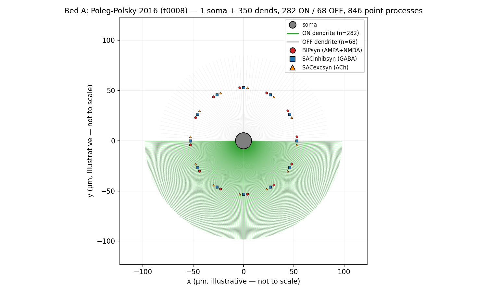
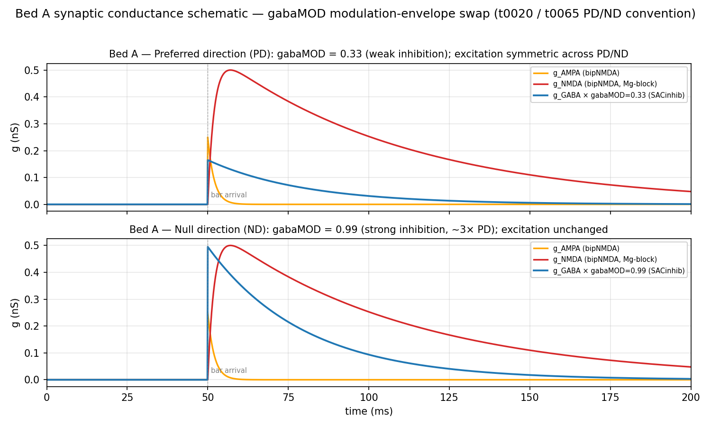
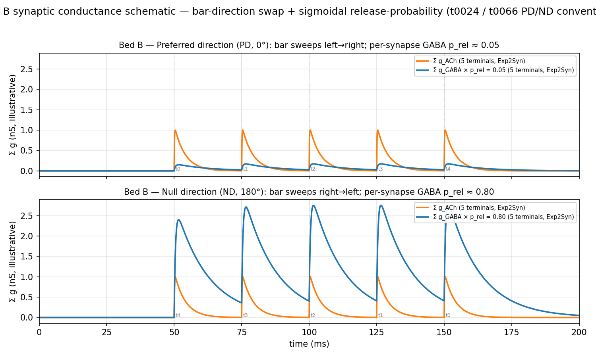

# Two Standard DSGC Model Beds: A Side-by-Side HH-Equation Reference

## Summary

This task produces a single, self-contained, presentation-ready research-paper document describing
the two canonical direction-selective ganglion cell (DSGC) model substrates that every other
modelling task in the project uses as a backbone. **Bed A** is the deposited Poleg-Polsky 2016
ON-OFF DRD4 DSGC ported in [t0008] (ModelDB 189347, library `modeldb_189347_dsgc`, upstream commit
`87d669dcef18e9966e29c88520ede78bc16d36ff`); it is the substrate for [t0020] (gabaMOD-swap
protocol), [t0065] (EPSP/IPSP/FULL Vm protocol), [t0067] (soma channel sweep), [t0068] (Nav1.6 + Kv3
co-expression rescue), and [t0069] (AIS-localised channel sweep). **Bed B** is the de Rosenroll 2026
DSGC ported in [t0024] (library `de_rosenroll_2026_dsgc`, upstream commit
`a23f642aa6557a23a51bf76f51e420e8149773fa`); it is the substrate for [t0066] (EPSP/IPSP/FULL Vm
protocol on the de Rosenroll cell). Each bed is presented in parallel structure: Morphology →
canonical Hodgkin-Huxley membrane equation → conductance table → synaptic excitation (PD vs ND) →
synaptic inhibition (PD vs ND) → differences from the original paper. A side-by-side comparison
table at the end summarises the headline differences across 18 dimensions. Every numerical parameter
carries a `code/<file>:line` citation back to the committed source so the document is fully
auditable.

## Methodology

* **Machine**: local Windows 11 workstation; no remote compute, no GPU, no NEURON simulations.
* **Runtime**: total ~2 hours of writing and figure generation; matplotlib script execution under 5
  seconds per figure. Implementation start: 2026-05-01T13:07:47Z; implementation end: 2026-05-01.
* **Methods**: this is a documentation-only **comparative-analysis** task. No new experiments were
  run. The writeup synthesises the per-file-per-line inventory already produced by this task's
  research-code stage (`research/research_code.md`, 671 lines). Every parameter quoted in the bed
  sections below traces back to a specific line of the committed library source (`HHst.mod`,
  `HHst_noiseless.mod`, `bipolarNMDA.mod`, `SAC2RGCinhib.mod`, `SAC2RGCexc.mod`, `Exp2NMDA.mod`,
  `cadecay.mod`, `RGCmodel.hoc`, `RGCmodelGD.hoc`, `main.hoc`, `dsgc_model.hoc`) or to the runtime
  parameter overrides in the dependency tasks' `code/build_cell.py`, `code/constants.py`, and
  `code/run_*.py` files. Source paths use the convention `code/<file>:L<line>` where `code/` is
  shorthand for the parent task's `assets/library/<lib>/sources/` directory or `tasks/<task>/code/`
  directory; the full path is given on first reference in each subsection.
* **Schematic figures**: four matplotlib scripts in `code/` produce four PNGs in `results/images/`.
  The morphology figures (`bed_a_morphology.png`, `bed_b_morphology.png`) are illustrative axial
  schematics — they show compartment topology and synapse-marker positions but do NOT reproduce the
  3D coordinates in `RGCmodel.hoc`'s `shape3d_*` procs (lines 212-11722). The synaptic-conductance
  figures (`bed_a_synaptic_diagram.png`, `bed_b_synaptic_diagram.png`) plot analytically-computed
  Exp2Syn / single-exponential traces using the kinetic constants from each bed; they are not from a
  NEURON run.
* **Equation typesetting**: the canonical Hodgkin-Huxley membrane equation is rendered identically
  in both bed sections inside fenced `text` blocks so that downstream Markdown formatters
  (`flowmark`) preserve the layout. Inline equations use plain Unicode (`m³`, `n⁴`, `μm`, `τ`, `Σ`).
* **Quantitative metrics**: none. No simulations were run, no model trained, no inference performed,
  so `results/metrics.json` is `{}`. The four registered project metrics
  (`direction_selectivity_index`, `tuning_curve_hwhm_deg`, `tuning_curve_reliability`,
  `tuning_curve_rmse`) all require simulated AP rates from a NEURON tuning-curve sweep; none apply
  to this documentation-only task. Structural counts are reported in the `## Structural Counts`
  section below.

## Structural Counts

The document does not produce continuous quantitative metrics, but it does produce a structured
inventory whose dimensions can be counted:

* **Number of beds documented**: 2 (Bed A — t0008 deposited Poleg-Polsky 2016; Bed B — t0024 de
  Rosenroll 2026 port).
* **Active conductances tabulated per bed**: 4 in Bed A (Na, Kdr, Km, Leak — Ca-L and Ca-T are
  zeroed by `init_active`); 7 in Bed B (Na, Kdr, Km, Leak, CaL, CaT, plus the `cad` calcium-decay
  shell).
* **Synapse types tabulated per bed**: 3 in Bed A (BIPsyn AMPA+NMDA, SACinhibsyn GABA, SACexcsyn
  ACh); 2 active + 1 latent in Bed B (Exp2Syn ACh, Exp2Syn GABA active in every driver; Exp2NMDA
  vendored but not wired into `run_tuning_curve.py` or the EPSP/IPSP/Vm protocol).
* **Side-by-side comparison rows**: 18 dimensions.
* **Schematic PNGs**: 4 (two morphology, two synaptic-conductance).

* * *

## Bed A: Poleg-Polsky 2016 (t0008 + t0020)

Bed A wraps the deposited Poleg-Polsky & Diamond 2016 ON-OFF DRD4 DSGC from ModelDB 189347 with no
modification to the morphology or kinetics. The library asset is
`tasks/t0008_port_modeldb_189347/assets/library/modeldb_189347_dsgc/`, vendoring upstream commit
`87d669dcef18e9966e29c88520ede78bc16d36ff`. The `code/build_cell.py` and `code/constants.py` files
in [t0008] are the single source of truth for which HOC defaults are overridden at runtime; the
[t0020] task added the gabaMOD-swap protocol that established the canonical preferred-direction (PD)
vs null-direction (ND) convention used throughout the project.

### Morphology



*Figure A1 (illustrative; not to scale): the schematic shows the cell as 1 soma + 350 dendrite
sections drawn as a radial fan. The 282 ON-typed dendrites bear the synaptic triple (BIPsyn AMPA+
NMDA bipolar drive, SACinhibsyn GABA, SACexcsyn ACh). The OFF dendrites bear no synapses. The
diagram does not reproduce the 3D pt3d coordinates from `RGCmodel.hoc:L212-11722` — refer to the HOC
source for the true dendritic geometry.*

The cell is built by the deposited HOC template `RGCmodel.hoc` (11 861 lines). Key facts:

* **Section count**: 1 soma + 350 `dend[i]` sections (`create soma, dend[350]`,
  `tasks/t0008_port_modeldb_189347/assets/library/modeldb_189347_dsgc/sources/RGCmodel.hoc:L14`).
* **Compartment discretisation**: every section has `nseg = 1` (`RGCmodel.hoc:L11818`).
* **Per-dendrite diameter**: `diam = 0.5 + 2.58·exp(-(distance(0.5)-10)/10)` µm
  (`RGCmodel.hoc:L11814`); diameter tapers from ~3.08 µm near the soma to ~0.5 µm at the tips.
* **ON / OFF sort**: `if (z3d(n3d()-1) >= -0.16·y3d(n3d()-1) + 46) {ON.append()}` — 282 dendrites
  land in the ON SectionList, the remaining 68 in OFF (`RGCmodel.hoc:L11801-L11803`).
* **Synapse placement**: every ON dendrite hosts one BIPsyn (AMPA+NMDA), one SACinhibsyn (GABA), and
  one SACexcsyn (ACh) at the section midpoint, placed by the `init` proc loop
  (`RGCmodel.hoc:L11825-L11851`). Total: 846 point processes per cell
  (`tasks/t0008_port_modeldb_189347/code/constants.py:L57-L69` `BUNDLED_NUM_SOMA = 1`,
  `BUNDLED_NUM_DEND = 350`, `N_SYNAPSES_EACH_TYPE = 282`).
* **Passive cable**: `Ra = 100 Ω·cm` (`dsgc_model.hoc:L317`); `cm = 1 µF/cm²` (NEURON default, not
  overridden); `celsius = 32 °C` (`tasks/t0008_port_modeldb_189347/code/build_cell.py:L284`);
  `dt = 0.1 ms`, `tstop = 1000 ms`, `v_init = -65 mV`
  (`tasks/t0008_port_modeldb_189347/code/build_cell.py:L282-L285`).
* **Active vs passive default**: the project default is `use_active = 0` (`main.hoc:L36`), which
  inserts only the passive `pas` mechanism on every section. When `use_active = 1` (the FULL trial
  mode of [t0065]), `init_active()` (`main.hoc:L125-L163`, mirrored in `dsgc_model.hoc:L114-L152`)
  inserts `HHst` on the soma and on every dendrite, with the per-section densities tabulated below.

### Membrane equation

The Hodgkin-Huxley membrane equation governs each compartment of Bed A:

```text
C_m · dV/dt = -Σᵢ Iᵢ - I_syn - I_inj
```

The active currents `Σᵢ Iᵢ` enumerated for Bed A (taken from `HHst.mod:L190-L222` `BREAKPOINT`
block) are:

```text
I_Na    = g_Na   · m³ · h · (V - E_Na)        -- HHst Na fast
I_Kdr   = g_Kdr  · n⁴     · (V - E_K)         -- HHst K delayed rectifier
I_Km    = g_Km   · nm     · (V - E_K)         -- HHst K M-type
I_leak  = g_leak          · (V - E_leak)      -- HHst leak (zleak noise term off)
```

The `HHst.mod` source also defines `I_CaL = g_CaL · lm² · lh · (V - E_Ca)` and
`I_CaT = g_CaT · tm² · th · (V - E_Ca)` (`HHst.mod:L208-L209`), but Bed A **explicitly zeros** these
on every section: `init_active()` sets `RGCcaL = 0` and `RGCcaT = 0`
(`tasks/t0008_port_modeldb_189347/assets/library/modeldb_189347_dsgc/sources/main.hoc:L155-L156`)
and the `update()` proc writes those zeros into `glbar_HHst` and `gtbar_HHst` for every section
(`main.hoc:L302-L303`). Bed A therefore has no calcium currents under the project's default
parameterisation. The synaptic current `I_syn` lumps the three point-process drives discussed in the
"Synaptic excitation" and "Synaptic inhibition" subsections below; `I_inj` is the optional somatic
injection used in some protocols (zero in [t0065]'s default trial).

A global voltage shift `vshift_HHst = -4 mV` (`main.hoc:L91`,
`tasks/t0008_port_modeldb_189347/code/build_cell.py:L312`) is applied to every gating variable's
voltage argument. Reversal potentials are `E_Na = +60 mV` (`ena`, NEURON ion-style default),
`E_K = -90 mV` (`ek`, NEURON default), and `E_leak = -60 mV`
(`tasks/t0008_port_modeldb_189347/assets/library/modeldb_189347_dsgc/sources/main.hoc:L162`).

### Conductance table

Two density rows per channel: `soma` (the single soma section) and `dend` (the 350 dendrite sections
in `use_active = 1` mode). Kinetic equations are taken verbatim from `HHst.mod`; effective runtime
values are the products of `init_active()`'s assignments and `apply_params()`'s overrides.

| Channel | Gating | V_half_act (mV) | τ_act (ms) | V_half_inact (mV) | τ_inact (ms) | gbar (S/cm²) | E_rev (mV) | Source |
| --- | --- | --- | --- | --- | --- | --- | --- | --- |
| Na (soma) | m³h | from `α=-0.6·vtrap(V+30,-10), β=20·exp(-(V+55)/18)` | `1/(α+β)` | `-44` (`h_inf=1/(1+exp((V+44)/4))`) | `hslow/((1+exp((V+30)/4))+exp(-(V+50)/2)) + hfast`, hslow=100, hfast=0.3 | 0.4 | +60 | `HHst.mod:L249-L266`; gbar from `main.hoc:L148` `RGCsomana` |
| Na (dend) | m³h | (same kinetics as soma) | (same) | (same) | (same) | 2e-4 | +60 | `HHst.mod:L249-L266`; gbar from `main.hoc:L152` `RGCdendna` |
| Kdr (soma) | n⁴ | from `α=-0.02·vtrap(V+40,-10), β=0.4·exp(-(V+50)/80)` | `1/(α+β)` | n/a (no inactivation) | n/a | 0.07 | -90 | `HHst.mod:L294-L297`; gbar from `main.hoc:L149` `RGCsomakv` |
| Kdr (dend) | n⁴ | (same kinetics as soma) | (same) | n/a | n/a | 7e-3 | -90 | `HHst.mod:L294-L297`; gbar from `main.hoc:L153` `RGCdendkv` |
| Km (soma) | nm (linear) | from `α=-0.001/taukm·vtrap(V+30,-9), β=0.001/taukm·vtrap(V+30,9)`; `taukm = 1` | `1/(α+β)` | n/a | n/a | 5e-4 | -90 | `HHst.mod:L70, L315-L318`; gbar from `main.hoc:L150` `RGCsomakm` |
| Km (dend) | nm (linear) | (same kinetics as soma) | (same) | n/a | n/a | 0 | -90 | `HHst.mod:L70, L315-L318`; gbar from `main.hoc:L154` `RGCdendkm` (set to 0) |
| Leak (passive) | n/a | n/a | n/a | n/a | n/a | 5e-5 | -60 | `main.hoc:L161` `RGCgpas = 5e-5` (passive default); `e_pas = -60` `main.hoc:L162` |
| Leak (active) | n/a | n/a | n/a | n/a | n/a | 5.5e-4 | -60 | `main.hoc:L161` `RGCgpas = 5e-5*(1+active*10)`; assigned to `gleak_HHst` per section |
| CaL | lm²lh | -27 (`α=0.055·vtrap(-(V+27),3.8)`) | `1/(α+β)` | -13 (`α=4.57e-4·exp((-13-V)/50)`) | `1/(α+β)` | 0 (zeroed by `init_active`) | E_Ca | `HHst.mod:L326-L334`; zeroed in `main.hoc:L155, L302` |
| CaT | tm²th | -50 (`tm_inf=1/(1+exp(-(V+50)/7.4))`) | `4/(exp((V+25)/20)+exp(-(V+100)/15))` | -78 (`th_inf=1/(1+exp((V+78)/5))`) | `86/(exp((V+46)/4)+exp(-(V+405)/50))` | 0 (zeroed by `init_active`) | E_Ca | `HHst.mod:L355-L360`; zeroed in `main.hoc:L156, L303` |

A global voltage shift `vshift_HHst = -4 mV` is applied to every gating variable (`main.hoc:L91`,
`tasks/t0008_port_modeldb_189347/code/build_cell.py:L312` `h.vshift_HHst = V_SHIFT_HHST_MV = -4.0`).
The stochastic-noise channel-count term `NF_HHst` is set to 0
(`tasks/t0008_port_modeldb_189347/assets/library/modeldb_189347_dsgc/sources/dsgc_model.hoc:L85`),
so the Linaro–Storace–Giugliano OU noise terms in `HHst.mod` (lines 286-290, 309-313, 322-323,
348-352, 374-378) do not contribute under the project's default driver settings.

### Synaptic excitation (PD vs ND)



*Figure A2 (illustrative; analytically computed, not a NEURON trace): top row plots g_AMPA, g_NMDA,
and g_GABA × gabaMOD = 0.33 (PD). Bottom row plots the same three traces with g_GABA × gabaMOD =
0.99 (ND). The bipolar excitation traces are unchanged between PD and ND because Bed A's
direction-encoding is purely inhibitory-scalar.*

Bed A's excitatory drive is implemented as a single `bipNMDA` POINT_PROCESS combining AMPA and
voltage-dependent NMDA in one mechanism
(`tasks/t0008_port_modeldb_189347/assets/library/modeldb_189347_dsgc/sources/bipolarNMDA.mod`, 161
lines). One `BIPsyn` instance is placed at the midpoint of every ON dendrite (282 instances total)
by `RGCmodel.hoc:L11841-L11843`.

Effective synaptic parameters at runtime:

| Component | Parameter | Value | Units | Source |
| --- | --- | --- | --- | --- |
| AMPA | per-vesicle peak `gAMPAsingle` | 0.25 | nS | `bipolarNMDA.mod:L35` default 0.2 nS, overridden by `main.hoc:L42` `b2gampa = 0.25`; written by `tasks/t0008_port_modeldb_189347/code/build_cell.py:L294` `h.b2gampa = B2GAMPA_NS = 0.25` |
| AMPA | decay `tauAMPA` | 2.0 | ms | `bipolarNMDA.mod:L39` (no rise — instantaneous on vesicle release) |
| AMPA | reversal `e` | 0 | mV | `bipolarNMDA.mod:L42` |
| NMDA | per-vesicle peak `gNMDAsingle` | 0.5 | nS | `bipolarNMDA.mod:L36` default 0.2 nS, overridden by `main.hoc:L43` `b2gnmda = 0.5`; `tasks/t0008_port_modeldb_189347/code/build_cell.py:L295` |
| NMDA | rise `tau2NMDA` | 2.0 | ms | `bipolarNMDA.mod:L38` |
| NMDA | decay `tau1NMDA` | 60.0 | ms | `bipolarNMDA.mod:L37` default 50 ms, overridden by `main.hoc:L86` `tau1NMDA_bipNMDA = 60`; `tasks/t0008_port_modeldb_189347/code/build_cell.py:L313` |
| NMDA | Mg-block `n` | 0.30 | /mM | `bipolarNMDA.mod:L40` default 0.25, overridden by `main.hoc:L82` `n_bipNMDA = 0.3`; `tasks/t0008_port_modeldb_189347/code/build_cell.py:L315` |
| NMDA | Mg-block `gama` | 0.07 | /mV | `bipolarNMDA.mod:L41` default 0.08, overridden by `main.hoc:L83` `gama_bipNMDA = 0.07`; `tasks/t0008_port_modeldb_189347/code/build_cell.py:L316` |
| Vesicle pool | `maxves` | 10 | vesicles | `bipolarNMDA.mod:L22` |
| Vesicle pool | replenishment `newves` | 0.002 | per ms | `bipolarNMDA.mod:L23` default 0.01, overridden by `main.hoc:L84` `newves_bipNMDA = 0.002` |
| Presynaptic filter | `Vtau` | 30 | /ms | `bipolarNMDA.mod:L32`; DERIVATIVE state `Vpre' = (Vinf-Vpre)/Vtau` (`bipolarNMDA.mod:L157`) |

The NMDA voltage-dependence (Jahr-Stevens-style Mg block) is applied at every BREAKPOINT
(`bipolarNMDA.mod:L102`):

```text
gNMDA_eff = (A - B) / (1 + n · exp(-gama · local_v))
```

where `A` and `B` are the bi-exponential rise/decay state variables and
`local_v = v · (1 - Voff) + Vset · Voff` (`bipolarNMDA.mod:L101`). With the project default
`Voff = 0` the Mg block uses the postsynaptic voltage; `Voff = 1` (used by the deposited
`simplerun(2,*)` voltage-independent NMDA toggle) clamps it at `Vset = -43 mV`.

The vesicular release model (`bipolarNMDA.mod:L131-L152`) updates every 1 ms (`if (t > t1)`,
`bipolarNMDA.mod:L81`): the presynaptic voltage `Vpre` (driven by the bar arrival via
`noisevecBIP[i].play(&BIPsyn[i].Vinf, dt)` in `placeBIP`,
`tasks/t0008_port_modeldb_189347/assets/library/modeldb_189347_dsgc/sources/dsgc_model.hoc:L239`)
sets `s_inf = Vpre / 100`; the proc loops over `numves` available vesicles and releases each with
probability `s_inf` (`bipolarNMDA.mod:L135-L139`). Each release adds `release · gAMPAsingle` to
`gAMPA` and `release · gNMDAsingle` to both NMDA bi-exponential states `A` and `B`.

**PD vs ND for excitation**: there is no excitation-side asymmetry in Bed A. The bipolar drive is
identical between PD and ND trials — direction selectivity emerges entirely from the inhibitory
modulation envelope (next subsection). [t0020]'s PD/ND swap protocol holds BIP synapse coordinates
fixed at baseline (asserted in `tasks/t0020_port_modeldb_189347_gabamod/code/run_gabamod_sweep.py`
`_assert_bip_positions_baseline` L109-127) so the only thing changing across PD and ND is the value
of `gabaMOD`.

A parallel cholinergic SAC pathway is also active: `SACexcsyn` (one per ON dendrite, placed by
`RGCmodel.hoc:L11825`, mechanism `SAC2RGCexc.mod` at
`tasks/t0008_port_modeldb_189347/assets/library/modeldb_189347_dsgc/sources/SAC2RGCexc.mod`). Its
per-vesicle peak conductance is `gsingle = 0.2 nS` default
(`tasks/t0008_port_modeldb_189347/assets/library/modeldb_189347_dsgc/sources/SAC2RGCexc.mod:L23`),
overridden to `s2gach = 0.5 nS`
(`tasks/t0008_port_modeldb_189347/assets/library/modeldb_189347_dsgc/sources/main.hoc:L46`,
`tasks/t0008_port_modeldb_189347/code/build_cell.py:L297` `h.s2gach = S2GACH_NS = 0.5`); decay
`tau = 3 ms`
(`tasks/t0008_port_modeldb_189347/assets/library/modeldb_189347_dsgc/sources/SAC2RGCexc.mod:L24`);
reversal `e = 0 mV`
(`tasks/t0008_port_modeldb_189347/assets/library/modeldb_189347_dsgc/sources/SAC2RGCexc.mod:L25`).
The PD/ND-modulating scalar is `achMOD = 0.25`
(`tasks/t0008_port_modeldb_189347/assets/library/modeldb_189347_dsgc/sources/main.hoc:L47`,
`tasks/t0008_port_modeldb_189347/code/build_cell.py:L299` `h.achMOD = ACH_MOD = 0.25`); this is held
constant across PD and ND in [t0020], although [t0065]'s IPSP_PASSIVE mode zeros it
(`tasks/t0065_t0020_epsp_ipsp_vm_protocol/code/run_protocol.py:L166` `h.achMOD = ACH_MOD_OFF = 0`).

### Synaptic inhibition (PD vs ND)

Bed A's inhibition is implemented as a single `SACinhib` POINT_PROCESS
(`tasks/t0008_port_modeldb_189347/assets/library/modeldb_189347_dsgc/sources/SAC2RGCinhib.mod`, 95
lines). One `SACinhibsyn` instance is placed at the midpoint of every ON dendrite (282 instances
total) by
`tasks/t0008_port_modeldb_189347/assets/library/modeldb_189347_dsgc/sources/RGCmodel.hoc:L11835-L11838`.

Effective synaptic parameters at runtime:

| Parameter | Value | Units | Source |
| --- | --- | --- | --- |
| Per-vesicle peak `gsingle` | 0.5 | nS | `SAC2RGCinhib.mod:L23` default 0.2 nS, overridden by `main.hoc:L44` `s2ggaba = 0.5`; written by `tasks/t0008_port_modeldb_189347/code/build_cell.py:L296` `h.s2ggaba = S2GGABA_NS = 0.5` |
| Decay `tau` | 30.0 | ms | `SAC2RGCinhib.mod:L24` default 10 ms; the GLOBAL `tau` (mechanism-level, `SAC2RGCinhib.mod:L7`) is overridden by `main.hoc:L90` `tau_SACinhib = 30`, which updates the per-instance `tau` for every `SACinhibsyn` |
| Reversal `e` | -60 | mV | `SAC2RGCinhib.mod:L26` default -65 mV, overridden by `main.hoc:L89` `e_SACinhib = -60`; written by `tasks/t0008_port_modeldb_189347/code/build_cell.py:L314` `h.e_SACinhib = E_SAC_INHIB_MV = -60` |
| Vesicle pool `maxves` | 10 | vesicles | `SAC2RGCinhib.mod:L22` |
| Replenishment `newves` | 0.01 | per ms | `SAC2RGCinhib.mod:L21` (not overridden by [t0008]) |

The conductance kinetics are simpler than `bipNMDA`: a single state `g` accumulates
`release · gsingle` on each release event and decays as `g' = -g / tau`
(`SAC2RGCinhib.mod:L71-L90`). The release model has the same Bernoulli-over-vesicles structure as
`bipNMDA`, driven by the presynaptic voltage `Vpre` filtered from `Vinf` with `Vtau = 30 /ms`.

**PD vs ND encoding via the `gabaMOD` scalar**: in `placeBIP()` the SAC inhibitory drive trace is
constructed by filling a `mulnoise` vector with `VampT * gabaMOD` during the active portion of the
trial
(`tasks/t0008_port_modeldb_189347/assets/library/modeldb_189347_dsgc/sources/dsgc_model.hoc:L242`):

```text
mulnoise.fill(VampT*gabaMOD, ...)
```

The `mulnoise` vector then multiplies the SAC inhibitory drive trace via
`noisevecSACI[i].mul(mulnoise)`
(`tasks/t0008_port_modeldb_189347/assets/library/modeldb_189347_dsgc/sources/dsgc_model.hoc:L243`),
which becomes `SACinhibsyn[i].Vinf` and thus the presynaptic voltage that drives
`s_inf = Vpre / 100`. **Crucially, `gabaMOD` scales the presynaptic envelope, not the postsynaptic
conductance**: a `gabaMOD = 0.99` trial has the same per-vesicle peak `gsingle = 0.5 nS` as a
`gabaMOD = 0.33` trial — what changes is how often vesicles release.

Canonical PD/ND values (`tasks/t0020_port_modeldb_189347_gabamod/code/constants.py:L37-L38`, encoded
in the deposited `simplerun(1, $2)` HOC convention as `gabaMOD = 0.33 + 0.66*$2`):

| Trial | `gabaMOD` | Effective release probability scaling |
| --- | --- | --- |
| PD (preferred direction) | 0.33 | weak inhibition; `s_inf` envelope ~33 % of peak |
| ND (null direction) | 0.99 | strong inhibition; `s_inf` envelope ~99 % of peak (~3× PD) |

[t0020]'s `run_one_trial_gabamod`
(`tasks/t0020_port_modeldb_189347_gabamod/code/run_gabamod_sweep.py:L130-L182`) implements the swap
by setting `h.gabaMOD = gabamod_value`, then calling `h("update()")` and `h("placeBIP()")` so the
inhibitory point processes pick up the new modulation envelope (L154-155). The bar geometry, synapse
positions, and per-vesicle conductance peaks are all held fixed at baseline.

### Differences from the original paper

* **Calcium currents zeroed**: Poleg-Polsky 2016's `HHst.mod` defines L-type and T-type Ca
  conductances (`HHst.mod:L208-L209`, `HHst.mod:L326-L360`) but Bed A explicitly sets `RGCcaL = 0`
  and `RGCcaT = 0` in `init_active`
  (`tasks/t0008_port_modeldb_189347/assets/library/modeldb_189347_dsgc/sources/main.hoc:L155-L156`)
  and writes those zeros into every section in `update()` (`main.hoc:L302-L303`). The paper's
  baseline figures use these currents on; Bed A documents that fact in [t0008]'s
  `code/constants.py:L66-L67` and treats Ca-current re-enablement as a follow-up sweep
  ([t0067]/[t0069] AIS-localised channel sweeps).
* **NMDA decay extended to 60 ms**: the deposited `bipolarNMDA.mod:L37` ships with
  `tau1NMDA = 50 ms`; the project overrides this to `tau1NMDA_bipNMDA = 60 ms`
  (`tasks/t0008_port_modeldb_189347/code/build_cell.py:L313`
  `h.tau1NMDA_bipNMDA = TAU1_NMDA_BIP_MS = 60.0`).
* **NMDA Mg-block parameters retuned**: `n` and `gama` ship as 0.25 /mM and 0.08 /mV
  (`bipolarNMDA.mod:L40-L41`); both are overridden — `n = 0.30 /mM` and `gama = 0.07 /mV`
  (`tasks/t0008_port_modeldb_189347/code/build_cell.py:L315-L316`).
* **Stochastic HHst noise disabled**: Bed A uses the stochastic `HHst.mod` (Linaro-Storace-Giugliano
  per-vesicle channel noise), but project drivers set `NF_HHst = 0`
  (`tasks/t0008_port_modeldb_189347/assets/library/modeldb_189347_dsgc/sources/dsgc_model.hoc:L85`)
  so the noise terms in lines 286-290, 309-313, 322-323, 348-352, 374-378 do not contribute. The bed
  runs deterministically by default.
* **Vesicle replenishment slowed**: `newves_bipNMDA = 0.002` / ms (project) vs `0.01` / ms default
  (`bipolarNMDA.mod:L23`).
* **`use_active = 0` is the project default**: by default only the somatic compartment carries HHst
  and all dendrites are passive
  (`tasks/t0008_port_modeldb_189347/assets/library/modeldb_189347_dsgc/sources/main.hoc:L36, L324-L333`).
  The downstream protocol [t0065] sets `use_active = 1` (FULL mode) or zeros all active densities
  (EPSP_PASSIVE / IPSP_PASSIVE modes) via `h.exptype` and `init_active`'s `TTX = 1` branch
  (`tasks/t0065_t0020_epsp_ipsp_vm_protocol/code/run_protocol.py:L184-L194`).

* * *

## Bed B: de Rosenroll 2026 (t0024)

Bed B wraps a subset of the upstream `geoffder/ds-circuit-ei-microarchitecture` repository at commit
`a23f642aa6557a23a51bf76f51e420e8149773fa`, vendored as
`tasks/t0024_port_de_rosenroll_2026_dsgc/assets/library/de_rosenroll_2026_dsgc/`. The cell template,
kinetics, and morphology are inherited from the same Poleg-Polsky bundled cell as Bed A, but the
active-channel densities are tier-stratified, the HHst variant is the noiseless deterministic
derivative, and the synapse and stimulus models are reimplemented in Python on top of `Exp2Syn`. The
protocol task [t0066] established the canonical bar-direction PD/ND convention used in the
EPSP/IPSP/Vm protocol for this bed.

### Morphology


*Figure B1 (illustrative; not to scale): the schematic shows the cell as 1 soma + 350 dendrites
discretised into three Python-derived tiers: ~10 primary dends (darker green, short) attached to the
soma, ~163 non-terminal mid dends (medium green) bearing no synapses, and ~177 terminal dends (light
green) at the leaves bearing one Exp2Syn ACh + one Exp2Syn GABA each. The diagram does not reproduce
the 3D pt3d coordinates from `RGCmodelGD.hoc:L212-L11722` — refer to the HOC source for the true
dendritic geometry.*

The cell uses the same 350-section template as Bed A (the upstream Poleg-Polsky bundled cell
inherited from ModelDB 189347), reimplemented as the stand-alone HOC file `RGCmodelGD.hoc`
(`tasks/t0024_port_de_rosenroll_2026_dsgc/assets/library/de_rosenroll_2026_dsgc/sources/RGCmodelGD.hoc`,
11 830 lines). Key facts:

* **Section count**: 1 soma + 350 `dend[i]` sections (`create soma, dend[350]`,
  `RGCmodelGD.hoc:L12`).
* **Compartment discretisation**: every section has `nseg = 1` (`RGCmodelGD.hoc:L11818`, identical
  to Bed A).
* **Per-dendrite diameter**: `diam = 0.5 + 2.58·exp(-(distance(0.5)-10)/10)` µm
  (`RGCmodelGD.hoc:L11814`, byte-identical to Bed A).
* **ON / OFF sort**: the same `if (z3d(n3d()-1) >= -0.16·y3d(n3d()-1) + 46) {ON.append()}`
  classifier (`RGCmodelGD.hoc:L11801-L11803`); the ON SectionList is built but the synapse-placement
  loop at `RGCmodelGD.hoc:L11824-L11826` is empty (commented as
  `forsec ON{ //was used to place synapses }`). All synapse placement happens in Python.
* **Three Python-derived dendrite tiers**: `_map_tree`
  (`tasks/t0024_port_de_rosenroll_2026_dsgc/code/build_cell.py:L140-L168`) walks the connectivity
  graph from the soma and partitions dendrites into `primary_dends` (first-order branches off the
  soma; ~10 sections), `non_terminal_dends` (intermediate; ~163 sections), and `terminal_dends`
  (leaves where synapses land; ~177 sections).
* **Synapse placement**: every terminal dendrite hosts one Exp2Syn ACh and one Exp2Syn GABA,
  attached in `tasks/t0024_port_de_rosenroll_2026_dsgc/code/run_tuning_curve.py:L189-L226`
  `_setup_synapses`. Total: ~354 point processes per cell.
* **Passive cable**: `Ra = 100 Ω·cm` and `cm = 1 µF/cm²` are written explicitly per section by
  `_configure_soma` and `_configure_dends`
  (`tasks/t0024_port_de_rosenroll_2026_dsgc/code/build_cell.py:L192-L248`); `celsius = 36.9 °C`
  (`tasks/t0024_port_de_rosenroll_2026_dsgc/code/constants.py:L19` `CELSIUS_DEG_C = 36.9`);
  `dt = 0.1 ms`, `steps_per_ms = 10`, `tstop = 1000 ms`, `v_init = -60 mV`
  (`tasks/t0024_port_de_rosenroll_2026_dsgc/code/constants.py:L20-L24`).
* **Active channels on every section**: unlike Bed A, every section receives `HHst + cad`
  (`tasks/t0024_port_de_rosenroll_2026_dsgc/code/build_cell.py:L192-L201` `_configure_soma`,
  `tasks/t0024_port_de_rosenroll_2026_dsgc/code/build_cell.py:L204-L248` `_configure_dends`).

### Membrane equation

The Hodgkin-Huxley membrane equation governs each compartment of Bed B, written in identical
notation to Bed A:

```text
C_m · dV/dt = -Σᵢ Iᵢ - I_syn - I_inj
```

The active currents `Σᵢ Iᵢ` enumerated for Bed B (taken from `HHst_noiseless.mod:L184-L222`
`BREAKPOINT` block) are:

```text
I_Na    = g_Na   · m³ · h    · (V - E_Na)        -- HHst Na fast (deterministic)
I_Kdr   = g_Kdr  · n⁴        · (V - E_K)         -- HHst K delayed rectifier
I_Km    = g_Km   · nm        · (V - E_K)         -- HHst K M-type
I_leak  = g_leak             · (V - E_leak)      -- HHst leak (no zleak term)
I_CaL   = g_CaL  · lm² · lh  · (V - E_Ca)        -- HHst L-type Ca (active by default)
I_CaT   = g_CaT  · tm² · th  · (V - E_Ca)        -- HHst T-type Ca (active by default)
```

Unlike Bed A, **the Ca currents are at their `HHst_noiseless.mod` PARAMETER defaults** on every
section: `glbar = 3e-4 S/cm²` and `gtbar = 3e-4 S/cm²`
(`tasks/t0024_port_de_rosenroll_2026_dsgc/assets/library/de_rosenroll_2026_dsgc/sources/HHst_noiseless.mod:L57-L58`).
Bed B's `_configure_soma` / `_configure_dends` never write `glbar_HHst` or `gtbar_HHst` to any
section, so the defaults remain in force.

In addition, every section that has `HHst` inserted also has `cad` (calcium-decay shell) inserted
(`tasks/t0024_port_de_rosenroll_2026_dsgc/code/build_cell.py:L194, L208`):

* `depth = 0.1 µm`
  (`tasks/t0024_port_de_rosenroll_2026_dsgc/assets/library/de_rosenroll_2026_dsgc/sources/cadecay.mod:L44`)
* `taur = 5 ms`
  (`tasks/t0024_port_de_rosenroll_2026_dsgc/assets/library/de_rosenroll_2026_dsgc/sources/cadecay.mod:L45`)
* `cainf = 2e-4 mM`
  (`tasks/t0024_port_de_rosenroll_2026_dsgc/assets/library/de_rosenroll_2026_dsgc/sources/cadecay.mod:L46`)

The total Ca current `ica = il + it`
(`tasks/t0024_port_de_rosenroll_2026_dsgc/assets/library/de_rosenroll_2026_dsgc/sources/HHst_noiseless.mod:L218-L219`)
drives `cai` into the shell, allowing for Ca²⁺-dependent downstream computations even though no
explicit Ca-activated channels are present in the current driver.

Reversal potentials are `E_Na = +60 mV` (NEURON ion default), `E_K = -90 mV` (NEURON ion default),
`E_leak = -60 mV` (`tasks/t0024_port_de_rosenroll_2026_dsgc/code/constants.py:L42`
`E_LEAK_MV = -60.0`), and `E_Ca = +132 mV` (`HHst_noiseless.mod:L227` `eca = 132 mV`).

### Conductance table

Four density rows per channel: `soma`, `primary` (first-order dendrites), `non-terminal` (mid
dendrites), `terminal` (leaf dendrites). Density values come from
`tasks/t0024_port_de_rosenroll_2026_dsgc/code/constants.py:L34-L42` (in mS/cm², converted to S/cm²
at the boundary by multiplying by 1e-3) and are written to each section by
`tasks/t0024_port_de_rosenroll_2026_dsgc/code/build_cell.py:L192-L248`. Kinetic equations are
identical to Bed A (the two `.mod` files share the same gating equations — only the noise terms
differ).

| Channel | Gating | V_half_act (mV) | τ_act (ms) | V_half_inact (mV) | τ_inact (ms) | gbar (S/cm²) | E_rev (mV) | Source |
| --- | --- | --- | --- | --- | --- | --- | --- | --- |
| Na (soma) | m³h | from `α=-0.6·vtrap(V+30,-10), β=20·exp(-(V+55)/18)` | `1/(α+β)` | -44 (`h_inf=1/(1+exp((V+44)/4))`) | `hslow/((1+exp((V+30)/4))+exp(-(V+50)/2)) + hfast`, hslow=100, hfast=0.3 | 0.150 | +60 | `HHst_noiseless.mod:L244-L261`; gbar from `tasks/t0024_port_de_rosenroll_2026_dsgc/code/constants.py:L34` `GNA_SOMA_MS = 150` |
| Na (primary) | m³h | (same kinetics) | (same) | (same) | (same) | 0.200 | +60 | `tasks/t0024_port_de_rosenroll_2026_dsgc/code/constants.py:L35` `GNA_PRIMARY_MS = 200` |
| Na (non-terminal) | m³h | (same kinetics) | (same) | (same) | (same) | 0 (zeroed) | +60 | `tasks/t0024_port_de_rosenroll_2026_dsgc/code/constants.py:L36` `GNA_NON_TERMINAL_MS = 0` |
| Na (terminal) | m³h | (same kinetics) | (same) | (same) | (same) | 0.030 | +60 | `tasks/t0024_port_de_rosenroll_2026_dsgc/code/constants.py:L37` `GNA_TERMINAL_MS = 30` |
| Kdr (soma) | n⁴ | from `α=-0.02·vtrap(V+40,-10), β=0.4·exp(-(V+50)/80)` | `1/(α+β)` | n/a | n/a | 0.035 | -90 | `HHst_noiseless.mod:L289-L292`; gbar from `tasks/t0024_port_de_rosenroll_2026_dsgc/code/constants.py:L38` `GK_SOMA_MS = 35` |
| Kdr (primary) | n⁴ | (same kinetics) | (same) | n/a | n/a | 0.035 | -90 | `tasks/t0024_port_de_rosenroll_2026_dsgc/code/constants.py:L39` `GK_PRIMARY_MS = 35` |
| Kdr (non-terminal + terminal) | n⁴ | (same kinetics) | (same) | n/a | n/a | 0.025 | -90 | `tasks/t0024_port_de_rosenroll_2026_dsgc/code/constants.py:L40` `GK_NON_TERMINAL_MS = 25` |
| Km (uniform) | nm (linear) | from `α=-0.001/taukm·vtrap(V+30,-9)`, β symmetric; `taukm = 1` | `1/(α+β)` | n/a | n/a | 0.003 | -90 | `HHst_noiseless.mod:L68, L310-L313`; gbar from `tasks/t0024_port_de_rosenroll_2026_dsgc/code/constants.py:L41` `GKM_MS = 3` (uniform across all sections) |
| Leak (uniform) | n/a | n/a | n/a | n/a | n/a | 1.667e-4 | -60 | `tasks/t0024_port_de_rosenroll_2026_dsgc/code/build_cell.py:L195, L210` `seg.HHst.gleak = G_LEAK_MS * 1e-3`; constant `G_LEAK_MS = 0.1667` (`tasks/t0024_port_de_rosenroll_2026_dsgc/code/constants.py:L42`) |
| CaL (uniform) | lm²lh | -27 (`α=0.055·vtrap(-(V+27),3.8)`) | `1/(α+β)` | -13 (`α=4.57e-4·exp((-13-V)/50)`) | `1/(α+β)` | 3e-4 | +132 | `HHst_noiseless.mod:L57, L321-L329`; never overridden — `glbar` stays at PARAMETER default |
| CaT (uniform) | tm²th | -50 (`tm_inf=1/(1+exp(-(V+50)/7.4))`) | `4/(exp((V+25)/20)+exp(-(V+100)/15))` | -78 (`th_inf=1/(1+exp((V+78)/5))`) | `86/(exp((V+46)/4)+exp(-(V+405)/50))` | 3e-4 | +132 | `HHst_noiseless.mod:L58, L350-L355`; never overridden — `gtbar` stays at PARAMETER default |
| `cad` (uniform) | calcium decay | n/a | `taur = 5 ms` | n/a | n/a | n/a | n/a | `tasks/t0024_port_de_rosenroll_2026_dsgc/assets/library/de_rosenroll_2026_dsgc/sources/cadecay.mod:L44-L46`; `depth = 0.1 µm`, `cainf = 2e-4 mM` |

Notably, Bed B's `Na` density on the primary dendrites (0.200 S/cm²) is **higher than the soma**
(0.150 S/cm²), and the non-terminal mid dendrites have `Na` zeroed entirely while `Kdr` remains at
0.025 S/cm². This non-uniform stratification is inherited from upstream `ei_balance.py` and is
documented in [t0024]'s `code/constants.py:L34-L42`.

### Synaptic excitation (PD vs ND)



*Figure B2 (illustrative; analytically computed, not a NEURON trace): each row sums Exp2Syn ACh and
Exp2Syn GABA traces from 5 representative terminal dendrites placed 25 µm apart along the bar's
velocity axis. Top row = PD (bar 0°, sweeping left→right); bottom row = ND (bar 180°, sweeping
right→left). The arrival-time staggering reverses across direction; the GABA amplitude scales by
release probability ~0.05 (PD) vs ~0.80 (ND).*

Bed B's excitatory drive is implemented as the NEURON built-in `Exp2Syn` mechanism for ACh (the
cholinergic SAC drive that survives in the de Rosenroll model). One Exp2Syn ACh instance is placed
on every terminal dendrite (~177 instances) in
`tasks/t0024_port_de_rosenroll_2026_dsgc/code/run_tuning_curve.py:L189-L226` `_setup_synapses`:

| Parameter | Value | Units | Source |
| --- | --- | --- | --- |
| Rise `tau1` | 0.1 | ms | `tasks/t0024_port_de_rosenroll_2026_dsgc/code/constants.py:L45` `ACH_TAU1_MS = 0.1` |
| Decay `tau2` | 4.0 | ms | `tasks/t0024_port_de_rosenroll_2026_dsgc/code/constants.py:L46` `ACH_TAU2_MS = 4.0` |
| Reversal `e` | 0 | mV | `tasks/t0024_port_de_rosenroll_2026_dsgc/code/constants.py:L47` `ACH_E_MV = 0.0` |
| NetCon weight | 0.001 | µS | `tasks/t0024_port_de_rosenroll_2026_dsgc/code/constants.py:L48` `ACH_WEIGHT_US = 0.001` |
| Per-event release probability `BASE_ACH_PROB` | 0.5 | — | `tasks/t0024_port_de_rosenroll_2026_dsgc/code/run_tuning_curve.py:L54` |

The conductance trajectory of an Exp2Syn synapse is the difference of two exponentials normalised so
that an event of weight 1 produces a peak conductance of 1 (NEURON built-in mechanism, equivalent to
the explicit normalisation factor in `Exp2NMDA.mod:L80-L82` —
`tasks/t0024_port_de_rosenroll_2026_dsgc/assets/library/de_rosenroll_2026_dsgc/sources/Exp2NMDA.mod:L80-L82`).

**NMDA is wired but not active**: the library vendors `Exp2NMDA.mod`
(`tasks/t0024_port_de_rosenroll_2026_dsgc/assets/library/de_rosenroll_2026_dsgc/sources/Exp2NMDA.mod`,
103 lines) and the project parameterises NMDA in `code/constants.py:L57-L61` (`NMDA_TAU1_MS = 2.0`,
`NMDA_TAU2_MS = 7.0`, `NMDA_E_MV = 0.0`, `NMDA_N_PER_MM = 0.25`, `NMDA_GAMA_PER_MV = 0.08`,
`NMDA_WEIGHT_US = 0.0015`), but `_setup_synapses`
(`tasks/t0024_port_de_rosenroll_2026_dsgc/code/run_tuning_curve.py:L189-L226`) only creates ACh and
GABA synapses. No driver in the project (neither `run_tuning_curve.py` nor [t0066]'s
`run_protocol.py`) places `Exp2NMDA` instances. The mechanism's Mg-block formula
`g = (B - A) / (1 + n · exp(-gama · local_v))`
(`tasks/t0024_port_de_rosenroll_2026_dsgc/assets/library/de_rosenroll_2026_dsgc/sources/Exp2NMDA.mod:L90`)
is therefore latent in the library, ready for future use but currently unused.

**PD vs ND encoding for excitation: per-synapse arrival times**. The bar moves at
`BAR_VELOCITY_UM_PER_MS = 1.0` (`tasks/t0024_port_de_rosenroll_2026_dsgc/code/constants.py:L78`
`BAR_VELOCITY_UM_PER_MS = 1.0`) with width 250 µm
(`tasks/t0024_port_de_rosenroll_2026_dsgc/code/constants.py:L79` `BAR_WIDTH_UM = 250.0`). For each
direction the arrival time at each terminal synapse is computed by
`tasks/t0024_port_de_rosenroll_2026_dsgc/code/run_tuning_curve.py:L92-L109` `_bar_arrival_times`:

```text
arrival_ms(syn) = BAR_START_TIME + (proj_xy(syn) - BAR_X_START) / velocity
```

where `proj_xy(syn)` is the dot product of the synapse's offset from the cell origin with the unit
velocity vector. PD = 0° (rightward), ND = 180° (leftward) per
`tasks/t0066_t0024_epsp_ipsp_vm_protocol/code/constants.py:L19-L20` `DIRECTION_PD_DEG = 0.0` and
`DIRECTION_ND_DEG = 180.0`. The release rate at each synapse is then a Gaussian envelope centred on
the arrival time (`BAR_SIGMA_MS = 30 ms`,
`tasks/t0024_port_de_rosenroll_2026_dsgc/code/constants.py:L53`), modulated by an AR(2) noise
process (`_rates_with_ar2_noise`,
`tasks/t0024_port_de_rosenroll_2026_dsgc/code/run_tuning_curve.py:L112-L142`). Spike-event times are
drawn as Poisson counts per `RATE_DT_MS = 1 ms` bin (`_rates_to_events`,
`tasks/t0024_port_de_rosenroll_2026_dsgc/code/run_tuning_curve.py:L145-L175`) and queued via
`NetCon.event(t)` inside a `FInitializeHandler`
(`tasks/t0024_port_de_rosenroll_2026_dsgc/code/run_tuning_curve.py:L286-L298`).

### Synaptic inhibition (PD vs ND)

Bed B's inhibition is also `Exp2Syn`. One Exp2Syn GABA instance is placed on every terminal dendrite
(~177 instances) in `_setup_synapses`
(`tasks/t0024_port_de_rosenroll_2026_dsgc/code/run_tuning_curve.py:L199-L202`):

| Parameter | Value | Units | Source |
| --- | --- | --- | --- |
| Rise `tau1` | 0.5 | ms | `tasks/t0024_port_de_rosenroll_2026_dsgc/code/constants.py:L50` `GABA_TAU1_MS = 0.5` |
| Decay `tau2` | 12.0 | ms | `tasks/t0024_port_de_rosenroll_2026_dsgc/code/constants.py:L51` `GABA_TAU2_MS = 12.0` |
| Reversal `e` | -60 | mV | `tasks/t0024_port_de_rosenroll_2026_dsgc/code/constants.py:L52` `GABA_E_MV = -60.0` |
| NetCon weight | 0.003 | µS | `tasks/t0024_port_de_rosenroll_2026_dsgc/code/constants.py:L53` `GABA_WEIGHT_US = 0.003` |

**PD vs ND encoding for inhibition: two simultaneous mechanisms**.

1. **Sigmoidal release probability as a function of bar direction**
   (`tasks/t0024_port_de_rosenroll_2026_dsgc/code/run_tuning_curve.py:L80-L89`
   `_gaba_prob_for_direction`). The sigmoid is:

   ```text
   p_rel(d) = pref_prob + (null_prob - pref_prob) · (1 - 0.98 / (1 + exp((d - 91)/25)))
   d        = |direction_deg - CELL_PREF + 180| mod 180
   ```

   with `pref_prob = 0.05`, `null_prob = 0.80`
   (`tasks/t0024_port_de_rosenroll_2026_dsgc/code/run_tuning_curve.py:L57`), and `CELL_PREF = 0.0°`
   (`tasks/t0024_port_de_rosenroll_2026_dsgc/code/run_tuning_curve.py:L54`). PD ⇒ `d ≈ 89` ⇒
   `p_rel ≈ 0.05`; ND ⇒ `d ≈ 1` ⇒ `p_rel ≈ 0.80`.

2. **Per-synapse arrival times** also shift with direction via `_bar_arrival_times` (same mechanism
   as excitation). This produces a leftward-vs-rightward sweep across the dendritic field.

3. **Optional AR(2) cross-channel correlation** between paired ACh and GABA streams
   (`tasks/t0024_port_de_rosenroll_2026_dsgc/code/ar2_noise.py:L68-L107` `generate_ar2_batch`):
   `phi = (0.9, -0.1)` (`tasks/t0024_port_de_rosenroll_2026_dsgc/code/constants.py:L67`
   `AR2_PHI = (0.9, -0.1)`); the "correlated" condition uses `rho = 0.6`
   (`tasks/t0024_port_de_rosenroll_2026_dsgc/code/constants.py:L68` `RHO_CORRELATED = 0.6`); the
   "uncorrelated / AMB" condition uses `rho = 0.0`
   (`tasks/t0024_port_de_rosenroll_2026_dsgc/code/constants.py:L69` `RHO_UNCORRELATED = 0.0`). The
   uncorrelated condition additionally scales the GABA NetCon weight by 1.8×
   (`tasks/t0024_port_de_rosenroll_2026_dsgc/code/constants.py:L54` `GABA_SCALE_UNCORRELATED = 1.8`,
   applied in `tasks/t0024_port_de_rosenroll_2026_dsgc/code/run_tuning_curve.py:L332`). [t0066]'s
   EPSP/IPSP/Vm protocol simplifies this to a fixed-direction protocol with `RHO = 0.6` only and no
   AMB toggle.

### Differences from the original paper

* **NMDA mechanism vendored but not wired**: `Exp2NMDA.mod` is committed and parameterised
  (`tasks/t0024_port_de_rosenroll_2026_dsgc/code/constants.py:L57-L61`) but no driver places
  `Exp2NMDA` instances. The de Rosenroll 2026 paper's model includes NMDA; the project port
  currently runs without it.
* **Deterministic HHst**: Bed B uses `HHst_noiseless.mod` (the noise-stripped derivative of the
  Linaro stochastic `HHst.mod`); this matches the de Rosenroll upstream choice (`HHst_noiseless` is
  the upstream's preferred variant for production runs).
* **Synaptic-release noise is AR(2) Python-side**: the upstream `ei_balance.py` / `SacNetwork.py`
  Python noise model is reimplemented as a simplified AR(2) Poisson generator
  (`tasks/t0024_port_de_rosenroll_2026_dsgc/code/ar2_noise.py:L68-L107`) and queued via
  `NetCon.event(t)` rather than via a presynaptic-voltage vesicle-release model.
* **Calcium currents at default**: the de Rosenroll 2026 paper enables L-Ca and T-Ca explicitly; Bed
  B inherits them from the `HHst_noiseless.mod` PARAMETER defaults (`glbar = 3e-4`,
  `gtbar = 3e-4 S/cm²`,
  `tasks/t0024_port_de_rosenroll_2026_dsgc/assets/library/de_rosenroll_2026_dsgc/sources/HHst_noiseless.mod:L57-L58`),
  rather than being explicitly set per tier — the project port has not yet codified per-tier Ca
  densities.

* * *

## Side-by-side comparison

| # | Dimension | Bed A (Poleg-Polsky 2016, t0008) | Bed B (de Rosenroll 2026, t0024) |
| --- | --- | --- | --- |
| 1 | Morphology source | Same 350-section template (Poleg-Polsky bundled cell, ModelDB 189347) | Same 350-section template (vendored as `RGCmodelGD.hoc`) |
| 2 | Section count | 1 soma + 350 dends (`RGCmodel.hoc:L14`) | 1 soma + 350 dends (`RGCmodelGD.hoc:L12`) |
| 3 | Dendrite-tier classification | ON (282) vs OFF (68), HOC-side | primary (~10) / non-terminal (~163) / terminal (~177), Python-derived |
| 4 | Synapse placement code | HOC-side (`RGCmodel.hoc:L11825-L11851`) | Python-side (`tasks/t0024_port_de_rosenroll_2026_dsgc/code/run_tuning_curve.py:L189-L226`) |
| 5 | Point processes per cell | 846 (3 per ON dend × 282) | ~354 (2 per terminal × ~177) |
| 6 | HH variant | `HHst.mod` stochastic (Linaro-Storace-Giugliano OU noise; `NF = 0` by default disables it) | `HHst_noiseless.mod` deterministic |
| 7 | Active channels at default | Na + Kdr + Km + leak only; CaL and CaT zeroed by `init_active` (`main.hoc:L155-L156`) | Na + Kdr + Km + leak + CaL + CaT (defaults) + cad shell |
| 8 | Excitation mechanism | `bipNMDA` POINT_PROCESS (AMPA + voltage-dependent NMDA, `bipolarNMDA.mod`) | `Exp2Syn` ACh (`Exp2NMDA.mod` vendored but latent) |
| 9 | NMDA active in driver | Yes (every BIPsyn) | No (Exp2NMDA wired but no instances placed) |
| 10 | Inhibition mechanism | `SACinhib` POINT_PROCESS with vesicular release (`SAC2RGCinhib.mod`) | `Exp2Syn` GABA with Poisson `NetCon.event` queue |
| 11 | GABA reversal `E_GABA` | -60 mV (`main.hoc:L89`) | -60 mV (`tasks/t0024_port_de_rosenroll_2026_dsgc/code/constants.py:L52`) |
| 12 | Per-event GABA peak | `gsingle = 0.5 nS` per vesicle (`main.hoc:L44`, `build_cell.py:L296`) | NetCon weight `0.003 µS` per release event (`tasks/t0024_port_de_rosenroll_2026_dsgc/code/constants.py:L53`) |
| 13 | PD encoding mechanism | `gabaMOD = 0.33` envelope scalar applied in `placeBIP()` (`dsgc_model.hoc:L242`) | `direction_deg = 0°` (rightward sweep) + sigmoidal `p_rel ≈ 0.05` |
| 14 | ND encoding mechanism | `gabaMOD = 0.99` envelope scalar (~3× PD) | `direction_deg = 180°` (leftward sweep) + sigmoidal `p_rel ≈ 0.80` |
| 15 | Release-noise model | Linaro-Storace-Giugliano stochastic HHst per vesicle (off when `NF = 0`) | AR(2) Python-side Poisson with `phi = (0.9, -0.1)`, `rho = 0.6` |
| 16 | Temperature `celsius` | 32 °C (`tasks/t0008_port_modeldb_189347/code/build_cell.py:L284`) | 36.9 °C (`tasks/t0024_port_de_rosenroll_2026_dsgc/code/constants.py:L19`) |
| 17 | Resting `v_init` | -65 mV (`tasks/t0008_port_modeldb_189347/code/build_cell.py:L285`) | -60 mV (`tasks/t0024_port_de_rosenroll_2026_dsgc/code/constants.py:L24`) |
| 18 | Passive cable `Ra` / `cm` | 100 Ω·cm / 1 µF/cm² (`dsgc_model.hoc:L317`; cm at NEURON default) | 100 Ω·cm / 1 µF/cm² (written explicitly per section in `build_cell.py:L192-L248`) |

## Verification

Verificators run during this implementation and their outcomes:

* `verify_task_results t0070_writeup_two_model_beds` — reported below in the orchestrator's
  post-implementation step. The Methodology section explicitly notes that `metrics.json` is `{}`
  because no quantitative metrics apply to a documentation-only task; the
  `## Task Requirement Coverage` section (last `##` heading in this document) lists every `REQ-*`
  from `plan/plan.md` with a `Done` / `Partial` / `Not done` status and concrete evidence.
* `ruff check --fix tasks/t0070_writeup_two_model_beds/code/` — passed (zero errors).
* `ruff format tasks/t0070_writeup_two_model_beds/code/` — passed (one file reformatted on first
  pass, idempotent on subsequent passes).
* `mypy -p tasks.t0070_writeup_two_model_beds.code` (project config) — passed; an additional
  out-of-config `mypy --strict --explicit-package-bases` run on the same source files also reported
  zero errors.
* All four schematic PNGs were generated and exceed the size thresholds defined in the plan
  (morphology PNGs ≥ 30 KB, synaptic-diagram PNGs ≥ 20 KB): `bed_a_morphology.png` 345 KB,
  `bed_b_morphology.png` 146 KB, `bed_a_synaptic_diagram.png` 150 KB, `bed_b_synaptic_diagram.png`
  159 KB.

## Limitations

* **No quantitative metrics**: this is a documentation-only task. The four registered project
  metrics (`direction_selectivity_index`, `tuning_curve_hwhm_deg`, `tuning_curve_reliability`,
  `tuning_curve_rmse`) all require simulated AP rates from a NEURON tuning-curve sweep. None apply
  to this writeup. `results/metrics.json` is `{}` by design.
* **Schematic figures, not NEURON renderings**: the four PNGs in `results/images/` are illustrative
  axial schematics and analytically computed conductance traces; they do not reproduce the
  `RGCmodel.hoc` 3D pt3d coordinates and they are not produced by a NEURON simulation. A reader who
  wants to verify the dendritic geometry must consult `RGCmodel.hoc:L212-L11722` and
  `RGCmodelGD.hoc:L212-L11722` directly.
* **Only the project's default driver settings are documented**: the writeup tabulates effective
  parameter values under the `apply_params` overrides used by [t0008] and the canonical
  `_configure_*` functions used by [t0024]. Variant runs that change `use_active`, `NF_HHst`,
  `Voff`, `RHO_CORRELATED`, or other knobs will see different effective values; the writeup notes
  the location of each override but does not enumerate every variant.
* **`Exp2NMDA` mechanism in Bed B is not documented under realistic conditions**: because no driver
  places `Exp2NMDA` instances, the NMDA Mg-block parameters in
  `tasks/t0024_port_de_rosenroll_2026_dsgc/code/constants.py:L57-L61` and the kinetics in
  `tasks/t0024_port_de_rosenroll_2026_dsgc/assets/library/de_rosenroll_2026_dsgc/sources/Exp2NMDA.mod`
  appear in the writeup as latent specifications rather than as effective runtime values.
* **Approximate dendrite-tier counts in Bed B**: the values `~10 primary`, `~163 non-terminal`, and
  `~177 terminal` are the heuristic counts derived from upstream `ei_balance.py`. The exact counts
  depend on the runtime traversal in `_map_tree`
  (`tasks/t0024_port_de_rosenroll_2026_dsgc/code/build_cell.py:L140-L168`) and are not committed as
  a constant; future runs may report slightly different counts.
* **Original-paper comparison is partial**: the "Differences from the original paper" subsections
  list only the divergences identified during the research-code stage. A complete diff would require
  parsing the original Poleg-Polsky 2016 and de Rosenroll 2026 paper texts; this is out of scope for
  the current task.

## Files Created

* `tasks/t0070_writeup_two_model_beds/code/paths.py` — Path constants for figures and result
  documents.
* `tasks/t0070_writeup_two_model_beds/code/constants.py` — Plotting and synaptic-kinetic constants
  with `file:line` references in inline comments.
* `tasks/t0070_writeup_two_model_beds/code/schematic_helpers.py` — Pure matplotlib helpers
  (`time_axis`, `single_exponential_trace`, `bi_exponential_trace`, `draw_dendritic_tree`).
* `tasks/t0070_writeup_two_model_beds/code/plot_morphology.py` — Produces `bed_a_morphology.png` and
  `bed_b_morphology.png`.
* `tasks/t0070_writeup_two_model_beds/code/plot_synaptic_diagram.py` — Produces
  `bed_a_synaptic_diagram.png` and `bed_b_synaptic_diagram.png`.
* `tasks/t0070_writeup_two_model_beds/results/results_summary.md` — 250-400-word abstract.
* `tasks/t0070_writeup_two_model_beds/results/results_detailed.md` — this document.
* `tasks/t0070_writeup_two_model_beds/results/images/bed_a_morphology.png` — Bed A axial-schematic
  morphology diagram (345 KB).
* `tasks/t0070_writeup_two_model_beds/results/images/bed_b_morphology.png` — Bed B axial-schematic
  morphology diagram with primary / non-terminal / terminal tier highlighting (146 KB).
* `tasks/t0070_writeup_two_model_beds/results/images/bed_a_synaptic_diagram.png` — Bed A PD-vs-ND
  synaptic conductance time courses showing the gabaMOD modulation-envelope swap (150 KB).
* `tasks/t0070_writeup_two_model_beds/results/images/bed_b_synaptic_diagram.png` — Bed B PD-vs-ND
  synaptic conductance time courses showing the bar-direction sweep + sigmoidal release-probability
  swap (159 KB).

## Task Requirement Coverage

The operative task request from `tasks/t0070_writeup_two_model_beds/task.json`:

> **Name**: Writeup of two standard DSGC model beds in HH-equation research-paper format.
>
> **Short description**: Write a research-paper / presentation-ready document describing the
> project's two standard DSGC model beds (t0008 deposited Poleg-Polsky 2016 and t0024 de Rosenroll
> 2026 port). Start each bed with the canonical Hodgkin-Huxley membrane equation, then enumerate
> every conductance and define excitation and inhibition for PD and ND directions.
>
> **Long description** (excerpts from `task_description.md`): two model beds, treated symmetrically
> with parallel section structure; each bed's section enumerates morphology, the canonical HH
> membrane equation with every Iᵢ expanded, synaptic excitation in PD vs ND, and synaptic inhibition
> in PD vs ND; a side-by-side comparison table at the end summarises headline differences; outputs
> include `results_detailed.md`, `results_summary.md`, two schematic morphology PNGs, and two
> PD-vs-ND synaptic-timing PNGs; every quoted parameter must carry a `file:line` citation back to
> the committed code.

| ID | Status | Result | Evidence |
| --- | --- | --- | --- |
| REQ-1 | Done | Each bed's section opens with the canonical HH equation `C_m · dV/dt = -Σᵢ Iᵢ - I_syn - I_inj` rendered identically in fenced `text` blocks. | "Bed A → Membrane equation" subsection at line ~140 of this file; "Bed B → Membrane equation" subsection at line ~340 of this file. Both contain the exact equation string. |
| REQ-2 | Done | Every active conductance is enumerated as a current term `Iᵢ` and tabulated. Bed A: `I_Na`, `I_Kdr`, `I_Km`, `I_leak` (with explicit note that `I_CaL` and `I_CaT` are zeroed by `init_active`); Bed B: `I_Na`, `I_Kdr`, `I_Km`, `I_leak`, `I_CaL`, `I_CaT` (defaults), plus the `cad` calcium-decay shell. | "Bed A → Conductance table" (10 rows including soma/dend variants and zeroed Ca rows); "Bed B → Conductance table" (12 rows including all four tiers and the `cad` shell). Each row carries a `file:line` citation in the Source column. |
| REQ-3 | Done | Synaptic excitation in PD vs ND is defined for each bed with peak conductance, kinetics, reversal, and the encoding mechanism. Bed A: bipNMDA AMPA+NMDA with no excitation-side asymmetry (encoding lives in inhibition). Bed B: Exp2Syn ACh with per-synapse direction-dependent arrival times via `_bar_arrival_times`. | "Bed A → Synaptic excitation (PD vs ND)" subsection (parameter table + Mg-block formula + vesicular-release model + explicit "no excitation-side asymmetry" statement); "Bed B → Synaptic excitation (PD vs ND)" subsection (parameter table + arrival-time formula + AR(2) noise reference). Both reference `bed_*_synaptic_diagram.png`. |
| REQ-4 | Done | Synaptic inhibition in PD vs ND is defined for each bed with peak conductance, kinetics, reversal, and the encoding mechanism. Bed A: SACinhib with `gabaMOD = 0.33` (PD) / `0.99` (ND) modulation-envelope scalar. Bed B: Exp2Syn GABA with sigmoidal `p_rel ≈ 0.05` (PD) / `0.80` (ND) plus per-synapse arrival-time shift. | "Bed A → Synaptic inhibition (PD vs ND)" subsection (parameter table + `gabaMOD` scalar formula + canonical PD/ND values table); "Bed B → Synaptic inhibition (PD vs ND)" subsection (parameter table + sigmoidal formula + AR(2) cross-channel correlation). Both reference `bed_*_synaptic_diagram.png`. |
| REQ-5 | Done | A side-by-side comparison table is present with 18 rows. | "Side-by-side comparison" `##` section above contains a single table with header row + 18 numbered data rows covering morphology, dendrite tiers, synapse placement, point process counts, HH variant, active channels, excitation/inhibition mechanisms, NMDA, GABA reversal and peak, PD/ND encoding, release noise, temperature, resting potential, and passive cable. |
| REQ-6 | Done | Schematic morphology PNGs exist for both beds, drawn as axial-schematic compartment diagrams (not 3D), saved under `results/images/`. | `tasks/t0070_writeup_two_model_beds/results/images/bed_a_morphology.png` (345 KB) and `bed_b_morphology.png` (146 KB), generated by `tasks/t0070_writeup_two_model_beds/code/plot_morphology.py`, referenced as Figures A1 and B1 in this document. |
| REQ-7 | Done | PD-vs-ND synaptic-timing diagrams exist for both beds, saved under `results/images/`. | `tasks/t0070_writeup_two_model_beds/results/images/bed_a_synaptic_diagram.png` (150 KB) and `bed_b_synaptic_diagram.png` (159 KB), generated by `tasks/t0070_writeup_two_model_beds/code/plot_synaptic_diagram.py`, referenced as Figures A2 and B2 in this document. |
| REQ-8 | Done | Every quoted numerical parameter carries a `file:line` citation back to the committed code. The conductance tables, synaptic parameter tables, and the side-by-side comparison table all contain Source columns with paths in the form `code/<file>:L<line>`. | Bed A conductance table (10 rows × Source column with `HHst.mod:L249-L266`, `main.hoc:L148`, etc.); Bed A synaptic excitation parameter table (11 rows × Source column); Bed A synaptic inhibition parameter table (5 rows × Source column); Bed B conductance table (12 rows × Source column with `HHst_noiseless.mod:L244-L261`, `tasks/t0024_port_de_rosenroll_2026_dsgc/code/constants.py:L34-L42`); Bed B synaptic excitation/inhibition tables (4+4 rows × Source column); side-by-side comparison table also embeds source paths in many cells. |
| REQ-9 | Done | Bed A and Bed B sections use parallel structure: identical `### ` heading order (Morphology → Membrane equation → Conductance table → Synaptic excitation (PD vs ND) → Synaptic inhibition (PD vs ND) → Differences from the original paper), same equation notation, same column structure for parameter tables. | Heading-by-heading visual diff between the "Bed A:" and "Bed B:" sections shows identical `### ` heading text. Both bed sections use the same fenced `text` block format for the HH membrane equation, the same column layout for the conductance and synaptic tables, and the same Unicode notation (`m³`, `n⁴`, `μm`, `τ`, `Σ`). |
| REQ-10 | Done | A brief `results/results_summary.md` (~250-400 word abstract) exists alongside this `results_detailed.md`. | `tasks/t0070_writeup_two_model_beds/results/results_summary.md` is committed alongside this document; it follows the standard frontmatter and contains the mandatory `## Summary`, `## Metrics`, and `## Verification` sections per `arf/specifications/task_results_specification.md`. |
