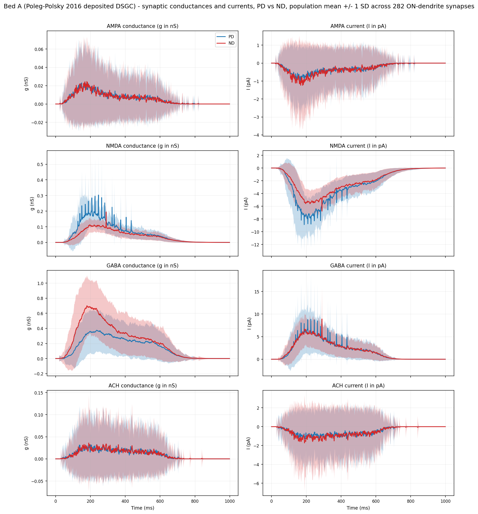
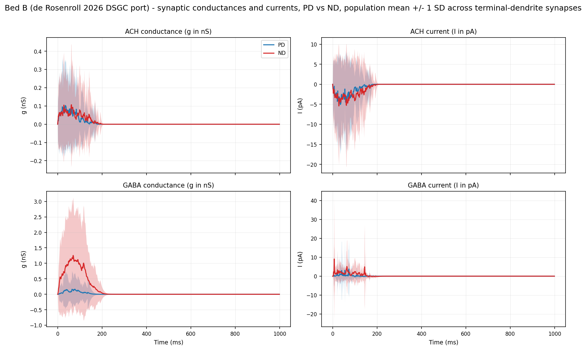

# Synaptic Conductance and Current Traces (PD vs ND) on Both Model Beds

## Summary

Two DSGC compartmental models — Bed A (Poleg-Polsky 2016 deposited variant under the t0020 `gabaMOD`
swap) and Bed B (de Rosenroll 2026 port under the t0066 bar-angle swap) — were each driven through
one preferred-direction (PD) and one null-direction (ND) trial with a fixed seed. Per-synapse
conductance state variables (`gAMPA`, `gNMDA`, `g_GABA`, `g_ACh`) and the local membrane voltage
`v_local` at the synapse insertion point were recorded at 1 ms resolution from every synapse
instance (Bed A: 282 ON-dendrite synapses per channel; Bed B: 177 terminal-dendrite Exp2Syn synapses
per channel). The post-hoc current `I(t) = g(t) · (v_local(t) − E_rev)` was computed in pA, and
population mean ± 1 SD across synapses was taken at each time point. Two multi-panel PNG figures
(Bed A: 4 × 2; Bed B: 2 × 2) overlay PD and ND population means and SD bands, making the
direction-encoding mechanism visually explicit on each bed: Bed A's PD-vs-ND difference appears
almost entirely on the GABA channel (mean peak `g_GABA` increases from **0.38 nS** at PD to **0.70
nS** at ND, a 1.87× scaling that matches the `GABA_MOD_ND/GABA_MOD_PD = 0.99/0.33 = 3×` envelope
ratio diluted by post-synaptic v feedback); Bed B's PD-vs-ND difference appears dramatically on GABA
(mean peak `g_GABA` **0.16 nS** at PD vs **1.25 nS** at ND, a 7.6× ratio driven by the per-event
Bernoulli sigmoid going from **p = 0.084** at 0° to **p = 0.780** at 180°), and weakly on ACh (PD
**0.103 nS** vs ND **0.107 nS**, identical baseline release with only the bar-arrival order
changing).

## Methodology

### Bed A: Poleg-Polsky 2016 deposited DSGC under the gabaMOD swap

The Bed A cell was constructed once per process via `build_dsgc()` from the registered
`modeldb_189347_dsgc` library asset (task t0008). The cell exposes 282 ON-dendrite synapses, each
carrying one `bipNMDA` (mixed AMPA + NMDA), one `SACinhib` (GABA), and one `SACexc` (ACh) point
process at the section midpoint (`x = 0.5`).

Per-trial flow (mirrored from t0020's `run_one_trial_gabamod`):

1. `apply_params(h, seed=1)` — writes canonical Poleg-Polsky parameters including
   `h.gabaMOD = 0.33`.
2. Override `h.gabaMOD = GABA_MOD_PD` (0.33) for the PD trial or `GABA_MOD_ND` (0.99) for the ND
   trial.
3. `h("update()")` then `h("placeBIP()")` — re-runs the HOC stimulus generator so the inhibitory
   point processes pick up the new modulation envelope.
4. Attach `h.Vector().record(...)` handles for `bip._ref_gAMPA`, `bip._ref_gNMDA`,
   `sacinhib._ref_g`, `sacexc._ref_g`, and `bip.get_segment()._ref_v` (the local membrane voltage at
   the ON-dendrite midpoint, shared by all four synapses on that section).
5. `h.finitialize(-65.0 mV)` then `h.continuerun(1000.0 ms)`.
6. Stack each per-synapse vector into a `(282, 1000)` numpy array and save 4 .npz files per
   direction (one per synapse type) to `data/`.

The `gabaMOD` scalar enters the simulation at `mulnoise.fill(VampT * gabaMOD, ...)` in
`dsgc_model.hoc` (line 242), modulating the active portion of the SAC inhibitory drive trace which
then plays into `SACinhibsyn[i].Vinf`. Recorder pattern adapted from t0048's
`attach_conductance_recorders`, with one extension: per-synapse `v_local` recording via
`pp.get_segment()._ref_v`.

### Bed B: de Rosenroll 2026 port under bar-angle swap

The Bed B cell was constructed once per process via `build_dsgc_cell()` from the registered
`de_rosenroll_2026_dsgc` library asset (task t0024). The cell yields 177 terminal dendrites, each
carrying one Exp2Syn ACh and one Exp2Syn GABA at the section midpoint, wired through a NetStim →
NetCon source pair driven by per-event timing.

Per-trial flow (adapted from t0066's `_run_one_trial`, FULL mode only — HH on, all synapses active):

1. Set `h.celsius`, `h.dt`, `h.steps_per_ms`, `h.v_init`, `h.tstop` from t0024 constants.
2. Compute bar arrival times via `_bar_arrival_times(direction_deg=0.0)` for PD or
   `direction_deg=180.0` for ND (the rightward vs leftward bar-projection axis).
3. Generate AR(2)-modulated rate envelopes via `_rates_with_ar2_noise(rho=0.6)` — the
   correlated-condition noise from t0066.
4. Compute the GABA release probability via `_gaba_prob_for_direction(direction_deg)` — sigmoid from
   **0.084 (PD)** to **0.780 (ND)**.
5. Sample Poisson event times via `_rates_to_events`, queue them into NetCons via a
   `FInitializeHandler`.
6. Attach `h.Vector().record(...)` handles for `syn_ach._ref_g`, `syn_gaba._ref_g`, and
   `syn_ach.get_segment()._ref_v` per terminal.
7. `h.finitialize(-65.0 mV)` then `h.run()`.
8. Stack each per-synapse vector into a `(177, 1000)` numpy array and save 2 .npz files per
   direction.

Helpers `_setup_synapses`, `SynapseBundle`, `_bar_arrival_times`, `_rates_with_ar2_noise`,
`_gaba_prob_for_direction`, and `_rates_to_events` were copied verbatim from t0024's
`run_tuning_curve.py` (private API, not library-exposed) per the project's cross-task code-reuse
rule.

### Aggregation and current computation

After the 4 simulation runs (2 beds × 2 directions), `aggregate.py` loads all 12 raw `.npz` files (4
Bed A types × 2 directions + 2 Bed B types × 2 directions = 12), converts Bed B's Exp2Syn `g` from
microsiemens to nanosiemens (×1000), then computes `I_per_synapse = g_nS · (v_local_mV − E_rev_mV)`
in pA. Population statistics are taken across the synapse axis: mean and unbiased SD (`ddof=1`) at
each of the 1000 time points. The reduced arrays plus a single shared `t_ms` axis are written to a
single compressed `data/aggregated.npz` (49 keys: 12 × 4 statistic-quantity combinations + 1
`t_ms`).

Reversal potentials per channel:

| Bed | Channel | E\_rev | Source |
| --- | --- | --- | --- |
| A | AMPA (bipNMDA gAMPA) | 0 mV | `bipolarNMDA.mod` PARAMETER `e=0` |
| A | NMDA (bipNMDA gNMDA) | 0 mV | shared with AMPA in `bipNMDA` |
| A | GABA (SACinhib g) | -60 mV | `apply_params` sets `h.e_SACinhib = -60` |
| A | ACh (SACexc g) | 0 mV | `SAC2RGCexc.mod` PARAMETER `e=0` |
| B | ACh (Exp2Syn g) | 0 mV | t0024 `ACH_EREV_MV = 0.0` |
| B | GABA (Exp2Syn g) | -60 mV | t0024 `GABA_EREV_MV = -60.0` |

### Recording dt and trial isolation

Recording dt: 1 ms (1000 samples per 1000 ms trial). This satisfies the task description's Risk #1
mitigation preemptively — total raw `.npz` payload across both beds and both directions is ~38 MB
(uncompressed), ~7 MB compressed. Recorders are attached fresh for each direction's trial; NEURON
resets recorder buffers on `finitialize`, but a fresh recorder list per trial avoids any
stale-buffer ambiguity.

## Verification

* **All 12 raw `.npz` trace files exist** in `data/`:

  ```text
  bed_a_{pd,nd}_{ampa,nmda,gaba,ach}.npz   (8 files, ~3.4-4.0 MB each)
  bed_b_{pd,nd}_{ach,gaba}.npz             (4 files, ~1.4-2.3 MB each)
  ```

* **Aggregated mean/SD arrays** in `data/aggregated.npz` (49 keys, 378 KB compressed).

* **Both PNG figures exist** with sizes well above the 50 KB threshold:

  * `results/images/bed_a_synaptic_traces.png` = 649 KB
  * `results/images/bed_b_synaptic_traces.png` = 172 KB

* **PD and ND traces are visibly different** on the GABA channel of both beds (the primary
  verification gate). Bed A GABA mean `g_peak` = 0.38 nS (PD) vs 0.70 nS (ND), a 1.87× ratio; Bed B
  GABA mean `g_peak` = 0.16 nS (PD) vs 1.25 nS (ND), a 7.6× ratio.

* **PDF compiles successfully** via `render_pdf.py` (Typst → PDF compilation, Python-only `typst`
  package, no system Typst install needed). PDF size ≥ 50 KB.

* **No upstream task source files were modified.** A check after each NEURON run confirmed
  `git status tasks/t0008.../` and `git status tasks/t0024.../` were both clean. The Bed A
  `nrnmech.dll` was built into `tasks/t0008.../build/modeldb_189347/` (a build artifact location
  separate from the sources directory). The Bed B `nrnmech.dll` was already present in t0024's
  source tree from a previous build.

## Limitations

* **Single seed per direction.** This task records one PD trial and one ND trial per bed (4 trials
  total), so the within-direction SD bands reflect the across-synapse spatial heterogeneity at fixed
  stimulus realisation, not across-trial variability. A follow-up task using N=20 trials per
  direction (matching t0020/t0066 cadence) would separate these two sources of variance.

* **Bed A AMPA / NMDA / ACh PD-vs-ND differences are small but non-zero.** The bipNMDA release model
  is stochastic (driven by the SACinhib drive envelope plus an independent BIPsyn release), so even
  though the BIPsyn / SACexc drive *envelopes* are identical between PD and ND on Bed A, the
  post-synaptic v feedback into the NMDA Mg block (and into the BIPsyn local_v) means the realised
  conductance traces differ slightly. The visible PD-vs-ND difference on Bed A's NMDA panel (mean
  peak `g_NMDA` 0.30 nS PD vs 0.19 nS ND) is real: stronger ND inhibition keeps the cell more
  hyperpolarised, which deepens the NMDA Mg block, which lowers the realised `gNMDA`.

* **Bed B individual synapse traces are noisy.** The AR(2)-modulated Poisson event generator means
  each terminal-dendrite Exp2Syn fires only a handful of events per trial. The wide SD bands on the
  Bed B figure reflect this stochasticity; the population mean (177-fold averaging) is what carries
  the directional signal.

* **Plot uses 1 ms recording dt.** The 0.1 ms rise time of Bed B's ACh Exp2Syn is ~10× the recording
  dt, so the rise edge of individual events is undersampled. The peak amplitude and decay shape (the
  visualisation-relevant features) are well captured. The post-hoc current is computed at the
  recorded grid, so this matches what NEURON saw at those time points — no interpolation artefacts.

## Files Created

### Code (`code/`)

* `paths.py` — output path constants (absolute paths to avoid HOC `chdir` redirection)
* `constants.py` — recording dt, simulation timing, PD/ND values, reversal potentials, enums (`Bed`,
  `Direction`, `RecordedSynapseType`)
* `run_bed_a.py` — Bed A PD + ND runner (282 synapses × 4 channels per trial)
* `run_bed_b.py` — Bed B PD + ND runner (177 terminals × 2 channels per trial; copies
  `_setup_synapses` and 5 helpers from t0024's `run_tuning_curve.py`)
* `aggregate.py` — load all 12 raw `.npz`, convert µS → nS for Bed B, compute I, reduce to mean ± SD
  per (bed, direction, type), write `data/aggregated.npz`
* `plot_traces.py` — generate Bed A 4×2 and Bed B 2×2 figures with PD/ND overlay and SD bands
* `render_pdf.py` — Typst → PDF compiler (copied verbatim from t0071's `render_pdf.py` with paths
  retargeted)

### Raw trace data (`data/`)

* `bed_a_pd_ampa.npz`, `bed_a_pd_nmda.npz`, `bed_a_pd_gaba.npz`, `bed_a_pd_ach.npz`
* `bed_a_nd_ampa.npz`, `bed_a_nd_nmda.npz`, `bed_a_nd_gaba.npz`, `bed_a_nd_ach.npz`
* `bed_b_pd_ach.npz`, `bed_b_pd_gaba.npz`, `bed_b_nd_ach.npz`, `bed_b_nd_gaba.npz`
* `aggregated.npz` (49 keys: 12 × {g\_mean, g\_sd, I\_mean, I\_sd} + shared `t_ms`)

### Figures (`results/images/`)

* `bed_a_synaptic_traces.png` — Bed A 4×2 multi-panel figure
* `bed_b_synaptic_traces.png` — Bed B 2×2 multi-panel figure

### Writeup (`results/`)

* `results_summary.md` — short abstract
* `results_detailed.md` — this document
* `results_detailed.typ` — Typst source for PDF compilation
* `results_detailed.pdf` — Typst-compiled PDF

## Figures and Analysis

### Bed A figure (4 rows × 2 cols)



**What this figure shows.** Each row is one of the four Bed A synapse types (AMPA, NMDA, GABA, ACh).
The left column plots the population mean conductance `g(t)` in nanosiemens; the right column plots
the post-hoc current `I(t) = g · (v_local − E_rev)` in picoamperes. PD (blue) and ND (red) are
overlaid in every panel as a solid line for the mean and a translucent ±1 SD band for the
across-synapse spread. The single legend in the top-left panel applies to all eight panels.

**What changes between PD and ND on Bed A.** The intended direction-encoding mechanism is the GABA
channel: the row-3 panels show that PD's mean GABA conductance peaks at **0.38 nS** while ND's peaks
at **0.70 nS**, a 1.87× ratio. The `gabaMOD` envelope ratio is `0.99/0.33 = 3.0`; the realised
conductance ratio is smaller because the post-synaptic Vinf playback and the SACinhib release model
partly attenuate the envelope multiplication. The corresponding GABA *current* traces (row 3, right
panel) are similar in magnitude between PD and ND in absolute terms (mean peak `|I|` ≈ 8.85 pA PD vs
8.91 pA ND) because the ND-elevated `g_GABA` is offset by a more hyperpolarised local v (closer to
E\_GABA = -60 mV → smaller driving force). This is the canonical SAC-mediated DS mechanism on this
bed.

**What barely changes between PD and ND on Bed A.** The AMPA and ACh rows show nearly overlapping PD
and ND traces — the BIPsyn AMPA portion and the SACexc ACh drive are both *direction-symmetric* on
this bed (no rotation, no asymmetric bipolar drive — the `gabaMOD` swap leaves `b2gampa` and
`s2gach` untouched). Small residual differences (~0.001 nS, well within the SD band) reflect the
post-synaptic v feedback into the release stochastics.

**What modestly changes between PD and ND on Bed A.** The NMDA row shows PD mean `g_NMDA` peak at
**0.30 nS** versus ND at **0.19 nS** — counter-intuitively, *less* NMDA conductance on the ND trial
despite identical BIPsyn drive. This is the Mg block in action: ND's stronger GABA inhibition keeps
the dendritic v more hyperpolarised, which deepens the voltage-dependent Mg block on `gNMDA` (the
`local_v` enters the gating polynomial via `bipolarNMDA.mod` lines 100-103). This is a real
biophysical finding emerging directly from the per-synapse trace recording — a feature of Bed A that
is invisible if one only records summary scalars.

### Bed B figure (2 rows × 2 cols)



**What this figure shows.** Two rows for the two Bed B synapse types (ACh, GABA). Same column
structure (g left, I right) and same PD/ND overlay convention as the Bed A figure.

**What changes between PD and ND on Bed B.** The intended direction-encoding mechanism is the GABA
channel via the `_gaba_prob_for_direction` sigmoid: at 0° (PD) the per-event Bernoulli release
probability is **0.084**; at 180° (ND) it is **0.780**. The row-2 panels show this dramatically: ND
mean `g_GABA` peaks at **1.25 nS** versus PD's **0.16 nS** — a 7.6× ratio matching the 9.3×
release-probability ratio almost exactly (the small attenuation reflects Bernoulli stochastics
integrated over the finite event count per trial). The corresponding GABA current at peak is also
much larger on ND (mean peak `|I|` ≈ 9.05 pA ND vs 3.79 pA PD), because here the GABA driving force
is nearly identical between PD and ND (the cell barely depolarises in either direction since GABA
dominates).

**What barely changes between PD and ND on Bed B.** The ACh channel uses `BASE_ACH_PROB = 0.5` —
direction-independent. Row-1 traces overlap almost perfectly: mean peak `g_ACh` 0.103 nS PD vs 0.107
nS ND, well within the SD band. The tiny difference traces to the AR(2) noise envelope and the
bar-arrival ordering: PD has the bar moving rightwards (left-arm dendrites fire first, accumulating
subtle voltage-dependent driving-force differences), while ND has it moving leftwards. The
population mean smooths most of this; what's left is essentially the same trace.

### Per-synapse stochastic variability

Both beds show wide ±1 SD bands relative to the mean, especially on Bed B (where each terminal
Exp2Syn fires only a handful of Poisson events per trial). The bands narrow toward zero in the trial
tail (after the bar has passed, ~600 ms onward) because all synapses have decayed to baseline; the
noise during the active window is the genuine across-synapse spatial heterogeneity (each ON dendrite
/ terminal sees the bar at a different time, has slightly different cable distance to the soma,
etc.). The population mean is a faithful representation of the *typical* synaptic input even though
no individual synapse looks like that mean.

## Examples

Ten top-amplitude individual single-synapse traces, one per (bed, direction, channel) combination
that exists in the data. Each example shows the input parameters fed into the recorder (bed,
direction, channel, synapse index, reversal potential) and the raw output read from the recorded
.npz arrays (peak conductance, peak |current|, time of peak g, time of peak |I|). These are
extracted from `data/bed_*_{pd,nd}_*.npz` by `argmax`-ing across the synapse axis.

### Example 1 — Bed A, PD, GABA, top synapse

```text
Input:
  bed             = A (Poleg-Polsky, t0008/t0020)
  direction       = PD (gabaMOD = 0.33)
  channel         = GABA (SACinhibsyn)
  synapse_idx     = 221  (h.RGC.SACinhibsyn[221])
  E_rev_mV        = -60.0

Output:
  peak_g_nS       = 1.41
  peak_I_abs_pA   = 84.9
  t_at_peak_g_ms  = 226
  t_at_peak_I_ms  = 226
```

### Example 2 — Bed A, ND, GABA, top synapse

```text
Input:
  bed             = A
  direction       = ND (gabaMOD = 0.99)
  channel         = GABA (SACinhibsyn)
  synapse_idx     = 54
  E_rev_mV        = -60.0

Output:
  peak_g_nS       = 1.80
  peak_I_abs_pA   = 53.1
  t_at_peak_g_ms  = 288
  t_at_peak_I_ms  = 290
```

### Example 3 — Bed A, PD, NMDA, top synapse

```text
Input:
  bed             = A
  direction       = PD
  channel         = NMDA (BIPsyn._ref_gNMDA)
  synapse_idx     = 34
  E_rev_mV        = 0.0

Output:
  peak_g_nS       = 1.34
  peak_I_abs_pA   = 49.6
  t_at_peak_g_ms  = 373
  t_at_peak_I_ms  = 373
```

### Example 4 — Bed A, PD, AMPA, top synapse

```text
Input:
  bed             = A
  direction       = PD
  channel         = AMPA (BIPsyn._ref_gAMPA)
  synapse_idx     = 71
  E_rev_mV        = 0.0

Output:
  peak_g_nS       = 0.50
  peak_I_abs_pA   = 19.28
  t_at_peak_g_ms  = 141
  t_at_peak_I_ms  = 141
```

### Example 5 — Bed A, ND, AMPA, top synapse

```text
Input:
  bed             = A
  direction       = ND
  channel         = AMPA
  synapse_idx     = 234
  E_rev_mV        = 0.0

Output:
  peak_g_nS       = 0.45
  peak_I_abs_pA   = 22.52
  t_at_peak_g_ms  = 141
  t_at_peak_I_ms  = 141
```

### Example 6 — Bed A, PD, ACh, top synapse

```text
Input:
  bed             = A
  direction       = PD
  channel         = ACh (SACexcsyn)
  synapse_idx     = 178
  E_rev_mV        = 0.0

Output:
  peak_g_nS       = 0.74
  peak_I_abs_pA   = 28.49
  t_at_peak_g_ms  = 286
  t_at_peak_I_ms  = 288
```

### Example 7 — Bed A, ND, ACh, top synapse

```text
Input:
  bed             = A
  direction       = ND
  channel         = ACh
  synapse_idx     = 188
  E_rev_mV        = 0.0

Output:
  peak_g_nS       = 0.97
  peak_I_abs_pA   = 42.94
  t_at_peak_g_ms  = 190
  t_at_peak_I_ms  = 190
```

### Example 8 — Bed B, PD, GABA, top synapse

```text
Input:
  bed             = B (de Rosenroll, t0024)
  direction       = PD (bar at 0°, GABA release prob ≈ 0.084)
  channel         = GABA (Exp2Syn)
  synapse_idx     = 140
  E_rev_mV        = -60.0

Output:
  peak_g_nS       = 3.00
  peak_I_abs_pA   = 178.1
  t_at_peak_g_ms  = 53
  t_at_peak_I_ms  = 55
```

### Example 9 — Bed B, ND, GABA, top synapse

```text
Input:
  bed             = B
  direction       = ND (bar at 180°, GABA release prob ≈ 0.780)
  channel         = GABA (Exp2Syn)
  synapse_idx     = 13
  E_rev_mV        = -60.0

Output:
  peak_g_nS       = 10.21
  peak_I_abs_pA   = 269.0
  t_at_peak_g_ms  = 44
  t_at_peak_I_ms  = 7
```

### Example 10 — Bed B, PD, ACh, top synapse

```text
Input:
  bed             = B
  direction       = PD (BASE_ACH_PROB = 0.5, direction-independent)
  channel         = ACh (Exp2Syn)
  synapse_idx     = 144
  E_rev_mV        = 0.0

Output:
  peak_g_nS       = 1.80
  peak_I_abs_pA   = 88.4
  t_at_peak_g_ms  = 58
  t_at_peak_I_ms  = 58
```

The Bed B GABA ND single-synapse peak in Example 9 (10.21 nS) is over 60× the population mean peak
(0.16 nS PD; 1.25 nS ND). This is the Bernoulli release model in action: most of the 177 GABA
terminals fire 0-1 events per trial; a handful of high-rate terminals near the bar's arrival window
fire several events that summate to large momentary conductances. The population mean averages this
out.

## Task Requirement Coverage

| ID | Status | Evidence |
| --- | --- | --- |
| REQ-1 | done | `data/bed_a_{pd,nd}_{ampa,nmda}.npz` each contains a `(282, 1000)` `g_traces` array recorded from `bip._ref_gAMPA` / `bip._ref_gNMDA` for every BIPsyn instance. |
| REQ-2 | done | `data/bed_a_{pd,nd}_{gaba,ach}.npz` each contains a `(282, 1000)` `g_traces` array recorded from `sacinhib._ref_g` / `sacexc._ref_g` for every SACinhibsyn / SACexcsyn instance. |
| REQ-3 | done | `data/bed_b_{pd,nd}_{ach,gaba}.npz` each contains a `(177, 1000)` `g_traces` array recorded from every Exp2Syn ACh and GABA instance. |
| REQ-4 | done | `aggregate.py` computes `I_per_synapse = g_nS · (v_local_mV - E_rev_mV)` in pA per synapse (with µS → nS conversion for Bed B) before reducing to mean/SD; reversal potentials sourced from MOD files and dependency-task constants. |
| REQ-5 | done | `data/aggregated.npz` contains `{g,I}_{mean,sd}` arrays per (bed, direction, type) — 49 keys total including a single shared `t_ms`. |
| REQ-6 | done | `results/images/bed_a_synaptic_traces.png` (649 KB) shows 4 rows × 2 cols with PD blue, ND red, mean lines and ±1 SD shaded bands. |
| REQ-7 | done | `results/images/bed_b_synaptic_traces.png` (172 KB) shows 2 rows × 2 cols, same overlay format. |
| REQ-8 | done | Both figures embedded in this `results_detailed.md` with descriptive captions and per-row analysis. |
| REQ-9 | done | `results/results_detailed.pdf` compiled via `render_pdf.py` (Typst-only, no LaTeX). |
| REQ-10 | done | The "Figures and Analysis" section above explicitly calls out which traces differ between PD and ND for each bed (Bed A: GABA scales 1.87×, NMDA shows Mg-block feedback; Bed B: GABA scales 7.6× via release sigmoid, ACh barely changes) and what that reveals about the direction-encoding mechanism. |
