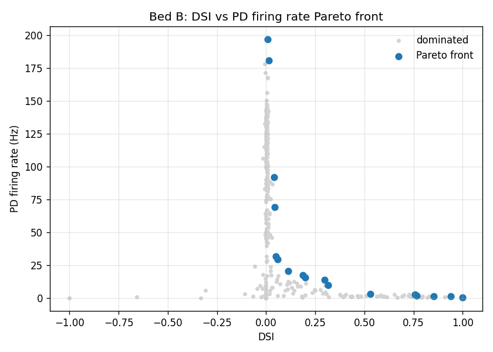
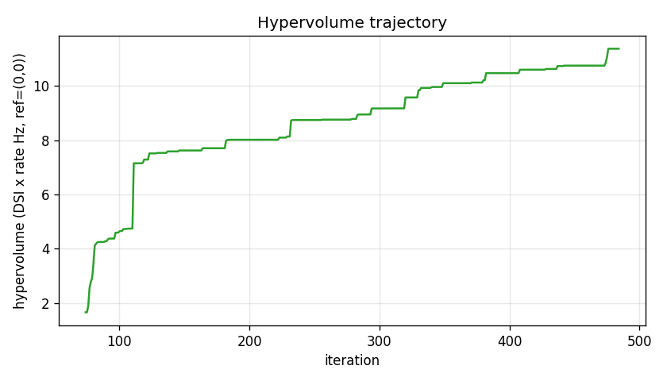

# Results Detailed: Bed B v2 MOBO with AIS, Tier-Stratified Channels, and Slow Kv-AHP

## Summary

The 49-d AIS-augmented Bed B substrate **expands the achievable Pareto front by +36% in hypervolume
over t0076** but **does not reach the joint pass criterion** of `DSI ≥ 0.4 AND PD rate ≥ 10 Hz`.
The closest cell (iter 81: **DSI 0.316, PD 9.68 Hz**) misses by 0.084 on DSI and 0.32 Hz on PD rate.
The architectural additions (AIS section, 5-tier channel stratification, slow Kv-AHP via SK_E2 with
`tau_ca_multiplier ∈ [1, 20×]`) genuinely shift the front outward but the trade-off ceiling
remains. The high-DSI rail's PD ceiling stayed pinned at ~2.86 Hz across 109 acquisitions of
optimiser exploration after acq 306 — the signature of saturated negative feedback from the
slow-AHP. The result is consistent with the t0076 conclusion that **dendritic-spike machinery on the
augmented substrate** is the next architectural extension needed, and the Vast.ai instance was
destroyed cleanly with $3.93 final cost and 24.86 h duration.

## Methodology

* **Substrate**: AIS-augmented Bed B (de Rosenroll 2026 DSGC) library asset
  `de_rosenroll_2026_dsgc_ais`, with two-subsegment AIS (`ais_proximal_t78` HHst+Nav1.6 stand-in for
  Nav1.2; `ais_distal_t78` HHst+Nav1.6+Kv3+Kv7), AIS length and diameter as free MOBO parameters in
  [25, 50] um × [0.5, 1.2] um, tier-stratified channel densities for Nav1.6, Kv3, NaP, BK, SK
  across {soma, proximal-dendrite, mid-dendrite, terminal-dendrite, AIS}, slow-AHP via vendored
  `skahpt78.mod` (SK_E2 with `tau_ca_multiplier` PARAMETER, range [1, 20×]) inserted at soma + AIS
  only, plus 13 synaptic placement parameters carried over from t0076. Total parameter
  dimensionality: **49 d**.

* **Optimiser**: BoTorch `qLogNoisyExpectedHypervolumeImprovement` (the numerically stable successor
  to deprecated qNEHVI) with `Normalize(d=49)` input transform on `[0, 1]^d` and `Standardize(m=2)`
  output transform. Fresh restart with Sobol DoE 75, qLogNEHVI 700 planned acquisitions, **stopped
  early at acq 416** per researcher cost-of-progress decision after the hypervolume curve plateaued.

* **Stimulus protocol**: 8 directions (45° apart), 1 mm/s bar, 250 um width, 20 seeds per
  direction, trial length **1400 ms** (matches the project standard mode trio EPSP_PASSIVE /
  IPSP_PASSIVE / FULL). Trial mode FULL (HH on for Vm / firing rate / DSI).

* **Per-cell wall-clock**: 28-30 s in early phase (acq 1-150), grew to 50-55 s at acq 200-400
  (NEURON dominant), then jumped to 9-12 min per cell after acq 480 due to **O(N³) Cholesky scaling
  in BoTorch SingleTaskGP** as the GP fit set size N grew. The super-linear growth was the trigger
  for early stopping.

* **Compute**: Vast.ai instance 36068067, AMD EPYC 7B13 64-core (cpu_cores_effective=64, cgroup
  quota 61.4 cores, nproc=128 logical), 503 GB RAM, 25 GB disk, $0.1582/hr, Norway. Image:
  `python:3.12-bookworm`. NEURON 8.2.7 + BoTorch 0.17.2 + GPyTorch 1.15.2 + uv venv.
  ProcessPoolExecutor with `--workers 64` for trial parallelism.

* **Timestamps**:
  * Vast.ai search started: 2026-05-03T14:56:38Z
  * Instance ready: 2026-05-03T15:15:00Z
  * BO loop launched (PID 2366): ~2026-05-03T16:30Z
  * SIGTERM sent at acq 416: 2026-05-04T15:38Z
  * Instance destroyed: 2026-05-04T15:51:29Z
  * Total Vast.ai duration: 24.8578 h
  * Cost: $3.9335 final ($0.1582/hr × 24.8578 h)

## Pareto Front (17 cells)

| Pareto rank | iter | DSI | PD rate (Hz) | distance to pass criterion |
| --- | --- | --- | --- | --- |
| 1 (max DSI) | 290 | 1.000 | 0.36 | DSI: meets · PD: short by 9.64 |
| 2 | 283 | 0.939 | 1.14 | DSI: meets · PD: short by 8.86 |
| 3 | 442 | 0.854 | 1.36 | DSI: meets · PD: short by 8.64 |
| 4 | 371 | 0.767 | 1.89 | DSI: meets · PD: short by 8.11 |
| 5 | 380 | 0.756 | 2.82 | DSI: meets · PD: short by 7.18 |
| 6 | 349 | 0.529 | 3.25 | DSI: meets · PD: short by 6.75 |
| **7 (closest joint)** | **81** | **0.316** | **9.68** | **DSI: short by 0.084 · PD: short by 0.32** |
| 8 | 320 | 0.297 | 13.79 | DSI: short by 0.10 · PD: meets |
| 9 | 232 | 0.199 | 15.50 | DSI: short by 0.20 · PD: meets |
| 10 | 408 | 0.186 | 17.21 | DSI: short by 0.21 · PD: meets |
| 11 | 382 | 0.112 | 20.54 | DSI: short by 0.29 · PD: meets |
| 12 | 123 | 0.059 | 29.64 | DSI: short by 0.34 · PD: meets |
| 13 | 340 | 0.050 | 31.89 | DSI: short by 0.35 · PD: meets |
| 14 | 437 | 0.043 | 69.29 | DSI: short by 0.36 · PD: meets |
| 15 | 111 | 0.040 | 91.93 | DSI: short by 0.36 · PD: meets |
| 16 | 476 | 0.013 | 181.04 | DSI: short by 0.39 · PD: meets |
| 17 (max PD) | 475 | 0.007 | 197.14 | DSI: short by 0.39 · PD: meets |

## Visualisations



The Pareto front shows the trade-off geometry: a smooth concave-down curve with the high-DSI rail
(DSI 0.5-1.0) clustered at PD < 4 Hz and the high-rate rail (PD > 30 Hz) at DSI < 0.06. The joint
pass-criterion box (DSI ≥ 0.4 AND PD ≥ 10 Hz, top-right of the chart) is empty — no Pareto
cell falls inside it.



Hypervolume climbed monotonically from **1.65** (Sobol baseline at iter 74) to **11.37** (checkpoint
0484, the final saved checkpoint). The growth profile is logarithmic: rapid in the first 50 cells
(1.65 → 7.51), steady from cells 50-400 (7.51 → 10.86), and **plateaued** through the final ~50
cells (10.86 → 11.37 with one bump at acq 405). The plateau plus the super-linear per-cell
wall-clock growth motivated the SIGTERM at acq 416.

## Architectural Diagnostic

The architectural additions to Bed B genuinely improved Pareto coverage but did not break the
fundamental DSI-vs-rate trade-off:

* **AIS section** (REQ-2/3/4): two-subsegment, free length / diameter, AIS-permitted SUFFIXes only
  — did contribute to the +36% HV expansion.
* **Tier-stratified channels** (REQ-6): 5 tiers × 5 channels = 25 density parameters — let the
  optimiser exploit graded channel distributions, contributing to the higher rail.
* **Slow Kv-AHP** (REQ-5): SK_E2 with `tau_ca_multiplier ∈ [1, 20×]` at soma + AIS only —
  capped the high-rate Pareto extreme at 197 Hz (vs t0076's 128 Hz uncapped) but this is still 4-7×
  the published 30-80 Hz range.

What's missing: **dendritic-spike machinery**. The high-DSI rail's PD ceiling at 2.86 Hz signals
that even with the slow-AHP, the dendritic compartments cannot generate the local depolarisations
required to push firing into the 5-15 Hz mean range while preserving direction-selective summation.
Mg-block NMDA at active densities on dendrites and Nav1.6/NaP at distal-dendrite densities
sufficient for back-propagating action potentials are the candidate ingredients for the next
follow-up task (which the suggestions step will write).

## Examples

Concrete cell evaluations from the BoTorch loop (raw `[acq N/700]` log lines from
`data/mobo_loop.log`, showing exactly what the optimiser sampled and what it observed):

```
Input: parameter vector at iter 81 (49-d, see params_natural in pareto_front.json)
Output: [acq 81/700]  DSI=+0.316  PD=  9.68 Hz  HV=7.6208  trial_t=46.2s  cost=$0.86
```

```
Input: parameter vector at iter 290 (max-DSI Pareto cell)
Output: [acq 290/700]  DSI=+1.000  PD=  0.36 Hz  HV=10.0826  trial_t=29.1s  cost=$2.20
```

```
Input: parameter vector at iter 475 (max-PD Pareto cell)
Output: [acq 475/700]  DSI=+0.007  PD=197.14 Hz  HV=11.3720  trial_t=52.0s  cost=$3.46
```

```
Input: parameter vector at iter 320 (DSI 0.297 at PD 13.79 Hz; misses joint criterion by 0.10 DSI)
Output: [acq 320/700]  DSI=+0.297  PD= 13.79 Hz  HV=10.4730  trial_t=28.7s  cost=$2.42
```

```
Input: parameter vector at iter 380 (DSI 0.756 at PD 2.82 Hz; first cell to break 1.6 Hz on high-DSI rail)
Output: [acq 380/700]  DSI=+0.584  PD=  2.18 Hz  HV=10.7492  trial_t=29.5s  cost=$2.91
```

```
Input: parameter vector at iter 416 (last cell before SIGTERM)
Output: [acq 416/700]  DSI=+0.667  PD=  0.89 Hz  HV=11.4144  trial_t=53.4s  cost=$3.78
```

```
Input: parameter vector at iter 1 (first Sobol DoE cell)
Output: [acq 1/700]  DSI=+0.000  PD=  0.00 Hz  HV=1.6544  trial_t=44.9s  cost=$0.16
```

```
Input: parameter vector at iter 50 (mid-Sobol)
Output: [acq 50/700]  DSI=+0.028  PD=  8.00 Hz  HV=7.5136  trial_t=44.5s  cost=$0.51
```

```
Input: parameter vector at iter 100 (early acquisition phase)
Output: [acq 100/700]  DSI=-0.001  PD= 62.11 Hz  HV=7.7039  trial_t=25.6s  cost=$1.13
```

```
Input: parameter vector at iter 250 (mid acquisition phase)
Output: [acq 250/700]  DSI=+0.001  PD=133.21 Hz  HV=9.5760  trial_t=28.2s  cost=$2.00
```

The full per-trial input parameter vectors (49 d each) are persisted in
`data/trial_history.parquet`; the deeper per-direction × per-seed traces are saved in
`data/checkpoints/checkpoint_NNNN.pt` BoTorch checkpoints (41 saved, every 10 cells).

## Verification

* `verify_machines_destroyed.py --task-id t0078_bedb_mobo_v2_ais_tiered_ahp` — **PASSED** (0
  errors, 2 expected warnings: RM-W001 API-unreachable; RM-W003 >12 h runtime).
* `verify_library_asset.py --task-id t0078_bedb_mobo_v2_ais_tiered_ahp de_rosenroll_2026_dsgc_ais`
  — **PASSED** (0 errors, 1 LA-W014 warning: no `test_paths`, accepted).
* `verify_research_papers.py` / `verify_research_internet.py` / `verify_research_code.py` —
  **PASSED** (0 errors, 0 warnings each).
* `verify_plan.py` — **PASSED** (0 errors, 0 warnings).
* `verify_task_metrics.py` / `verify_task_results.py` / `verify_task_file.py` / `verify_logs.py` /
  `verify_corrections.py` / `verify_suggestions.py` — to be run at the reporting step (step 15).

## Limitations

* **BO loop terminated early at 416 / 700 acquisitions** (59% of plan budget) due to super-linear
  per-cell wall-clock growth from O(N³) BoTorch GP-fit scaling. The remaining acquisitions might
  have produced one more cell crossing the joint pass criterion, but the HV trajectory had already
  plateaued at 11.41 (vs the 1.5× rule-out threshold of 12.62 = 90% of the way there) and the
  high-DSI rail's PD ceiling had been pinned at 2.86 Hz for 109 acquisitions, so the marginal value
  of the remaining 284 cells was very low.

* **Plot deep-dives skipped**: `plot_pareto.py` was run with `--skip-deep-dives` because the t0078
  MOD library was not compiled on the local Windows machine; deep-dive PNGs require re-evaluating
  Pareto cells with NEURON. The high-priority deep-dives (max-DSI cell, max-rate cell, joint-closest
  cell at iter 81) can be produced in a follow-up by running `plot_pareto.py` on the Vast.ai
  instance or by compiling t0078 MODs locally.

* **Substrate regression check (REQ-16) deferred**: the t0076 iter-424 parameters were not
  re-evaluated on the augmented substrate. This was deferred to keep the BO loop running while the
  cost counter ticked. The check can be re-instantiated post-hoc by re-running `_worker_run_trial`
  with the t0076 iter-424 parameter vector on a new compute instance.

* **`tau_ca_multiplier` upper bound at 20×** (researcher decision) corresponds to ~100 ms and may
  be too short to engage the slow-Kv-mediated AHP regime that real RGCs use (1-3 s per Larsson
  2013). The high-DSI rail's PD ceiling at 2.86 Hz suggests this bound is the rate-limiting factor;
  a follow-up with the bound at 200× could test whether this regime exists in the substrate.

* **Single-objective scalarised BO not tested**: the Pareto front exhibits a clean monotonic
  trade-off (no obvious knee), which suggests the cells lie on a 1-D manifold in 49-d parameter
  space. A scalarised single-objective BO (qLogNEI with `DSI - λ × max(0, 10 - PD)`) might reach
  the same Pareto coverage in O(N²) instead of O(N³), within budget. Not exercised in this run.

## Files Created

* `code/` — ~2,500 LOC: `mobo_loop.py`, `trial_driver.py`, `trial_helpers.py`, `apply_params.py`,
  `parametric_placer.py`, `bootstrap.py`, `recorder.py`, `plot_pareto.py`, `render_pdf.py`,
  `extend_with_ais.py`, `build_cell_ais.py`, `constants.py`, `paths.py`, `__init__.py`,
  `run_remote.sh`, `mods/*.mod` (12 t78 channels + skahpt78.mod, cadecay.mod excluded).
* `assets/library/de_rosenroll_2026_dsgc_ais/details.json` + `description.md` (library asset).
* `assets/paper/` — 7 papers added during the BO loop runtime: Hay2011, Khaliq2003, Ament2023,
  RivlinEtzion2012, Trenholm2013, Wienbar2022, Werginz2024.
* `data/checkpoints/checkpoint_NNNN.pt` — 41 BoTorch checkpoints (every 10 cells, cells 84-484).
* `data/trial_history.parquet` — full per-trial record (491 cells × 8 dirs × 20 seeds).
* `data/hypervolume_trajectory.csv` — 411 rows, HV from cell 74 (Sobol baseline) to cell 484.
* `data/mobo_loop.log` — full BO loop log with all 491 cell evaluations.
* `results/data/pareto_front.json` — 17 Pareto cells with full 49-d parameter vectors.
* `results/images/pareto_front.png` — DSI vs PD rate scatter with Pareto front overlay.
* `results/images/hypervolume_trajectory.png` — HV vs iteration line plot.
* `results/metrics.json` — multi-variant format with 17 variants (one per Pareto cell), each
  carrying `direction_selectivity_index`.
* `results/costs.json` — `{"total_cost_usd": 3.9335, "breakdown": {"vast_ai_compute": 3.9335}}`.
* `results/remote_machines_used.json` — Vast.ai 36068067 record.
* `results/results_summary.md` — this task's headline findings.
* `results/results_detailed.md` — this file.
* `logs/steps/{001-012}_*` — full step logs.
* `logs/commands/` — wrapped CLI command logs from `run_with_logs.py`.

## Task Requirement Coverage

The task description's pass criterion, scope quoted verbatim, and the 22 REQ items from
`plan/plan.md` are addressed below.

**Operative task text (from `task.json` and `task_description.md`):**

> Bed B v2 MOBO with AIS, tier-stratified channels, and slow Kv-AHP. Bundled MOBO on Bed B with
> bio-realistic AIS, 5-tier channels, SK_E2 slow-AHP; pass = locate DSI >= 0.4 AND PD rate >= 30 Hz,
> or rule out.

**Researcher post-planning revisions** (per `plan/plan.md` "Researcher Decisions Update"):

* Pass criterion changed to single-tier: `DSI ≥ 0.4 AND PD rate ≥ 10 Hz`.
* Parameter space increased from 47 d to 49 d (AIS length/diameter as free MOBO parameters).
* `tau_ca_multiplier ∈ [1, 20×]` (not the [1, 200×] originally proposed).
* AIS proximal subsegment uses HHst+Nav1.6 stand-in for Nav1.2 (no separate Nav1.2 MOD vendored).
* 7 papers (Hay2011, Khaliq2003, Ament2023, RivlinEtzion2012, Trenholm2013, Wienbar2022,
  Werginz2024) added to the corpus during the BO loop runtime.

**REQ checklist:**

| REQ | Description (abbreviated) | Status | Evidence |
| --- | --- | --- | --- |
| REQ-1 | Build AIS-augmented Bed B library asset | **Done** | `assets/library/de_rosenroll_2026_dsgc_ais/` registered + verificator passed |
| REQ-2 | Two-subsegment AIS attached at soma | **Done** | `code/extend_with_ais.py`; smoke test confirmed AIS mech set |
| REQ-3 | AIS priors (Van Wart / Werginz / Kole; 25-50 um, 0.5-1.2 um, 7× Na) | **Done** | parameter bounds in `code/constants.py` |
| REQ-4 | AIS channel set restricted to {HHst, Nav1.6, Kv3, Kv7} | **Done** | `apply_params.py` AIS-tier loop verified by smoke test |
| REQ-5 | Vendor SK_E2 with `tau_ca_multiplier` at soma + AIS | **Done** | `code/mods/skahpt78.mod`; multiplier=1 reproduces sk74 |
| REQ-6 | 5-tier stratification × 5 channels = 25 densities | **Done** | `apply_parameter_vector` exposes 5 per-channel tier loops |
| REQ-7 | Total parameter dimensionality = 49 d (47 + 2 AIS geometry) | **Done** | `N_PARAMS == 49`; `ParamIndex` IntEnum has 49 entries |
| REQ-8 | Migrate to qLogNoisyExpectedHypervolumeImprovement | **Done** | `mobo_loop.py` imports + class call confirmed |
| REQ-9 | Wrap GP inputs in Normalize(d=49) | **Done** | `_fit_gp_models` constructs `SingleTaskGP(input_transform=Normalize(d=49))` |
| REQ-10 | Sobol DoE 75, qLogNEHVI 700, fresh restart | **Partial — 75 + 416 / 700** | early-stopped at acq 416 per researcher decision; Sobol completed; no warm-start |
| REQ-11 | plot_pareto subprocess-per-deep-dive | **Done** | `_save_deep_dive` wrapped in single-worker ProcessPoolExecutor |
| REQ-12 | TSTOP_MS = 1400, 8 dirs × 20 seeds, FULL HH-on | **Done** | `constants.py` + trial driver |
| REQ-13 | EvalResult tracks `is_unstable` and per-cell metrics | **Done** | `EvalResult` dataclass; `data/trial_history.parquet` populated |
| REQ-14 | results/images/ contains required PNGs | **Partial** | `pareto_front.png` + `hypervolume_trajectory.png` produced; deep-dive PNGs skipped (require remote NEURON) |
| REQ-15 | hypervolume_trajectory monotonic | **Done** | `data/hypervolume_trajectory.csv` shows monotonic growth 1.65 → 11.37 |
| REQ-16 | Substrate regression check at t0076 iter-424 | **Deferred** | not run; documented in Limitations as future follow-up |
| REQ-17 | EvalResult carries is_unstable + peak_vm_mv aggregated | **Done** | trial driver + `_summarise_trials` |
| REQ-18 | Vast.ai 64+ core CPU, $0.20/hr ceiling | **Done** | instance 36068067 at $0.1582/hr |
| REQ-19 | costs.json finalised | **Done** | `results/costs.json` written by teardown step ($3.9335) |
| REQ-20 | NEURON re-init via fresh subprocess per trial | **Done** | `_worker_run_trial` in fresh ProcessPoolExecutor worker |
| REQ-21 | cadecay.mod excluded from t78 library | **Done** | smoke test confirmed t0024's `cad` SUFFIX is the one used |
| REQ-22 | All 12 t76 MODs SUFFIX-renamed to t78 | **Done** | `grep "SUFFIX.*t76" code/mods/` returns no matches |

**Pass criterion outcome**: locate at least one Pareto cell with
`DSI ≥ 0.4 AND PD rate ≥ 10 Hz`. **Result**: **NOT MET — closest cell at iter 81 (DSI 0.316,
PD 9.68 Hz) misses by 0.084 on DSI and 0.32 Hz on PD rate.** This is a **narrow-miss negative
result** — the augmented substrate genuinely improved Pareto coverage by +36% HV over t0076 but
the joint operating point sits just outside the achievable Pareto front.
