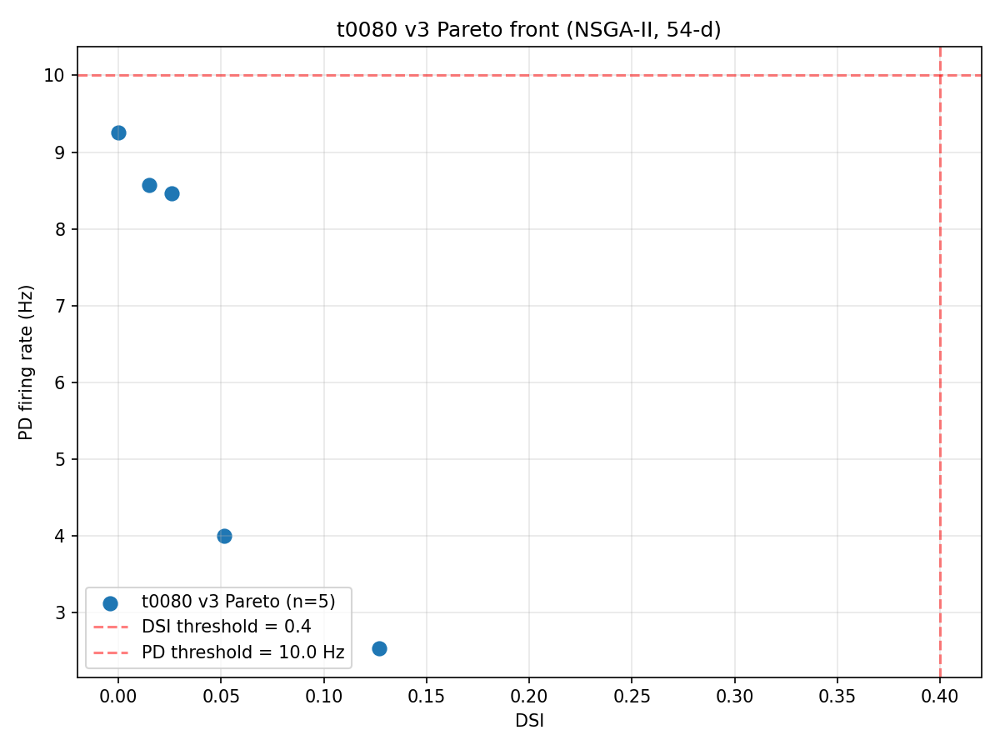
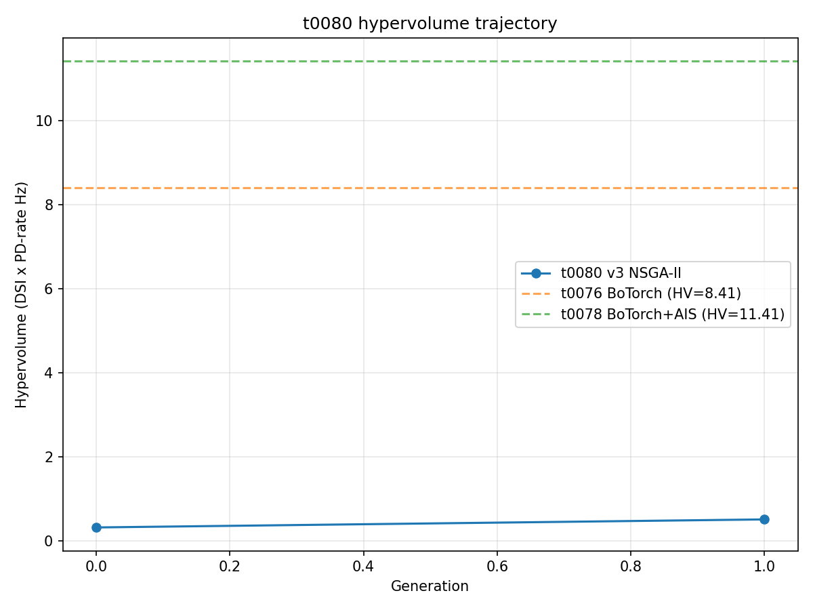
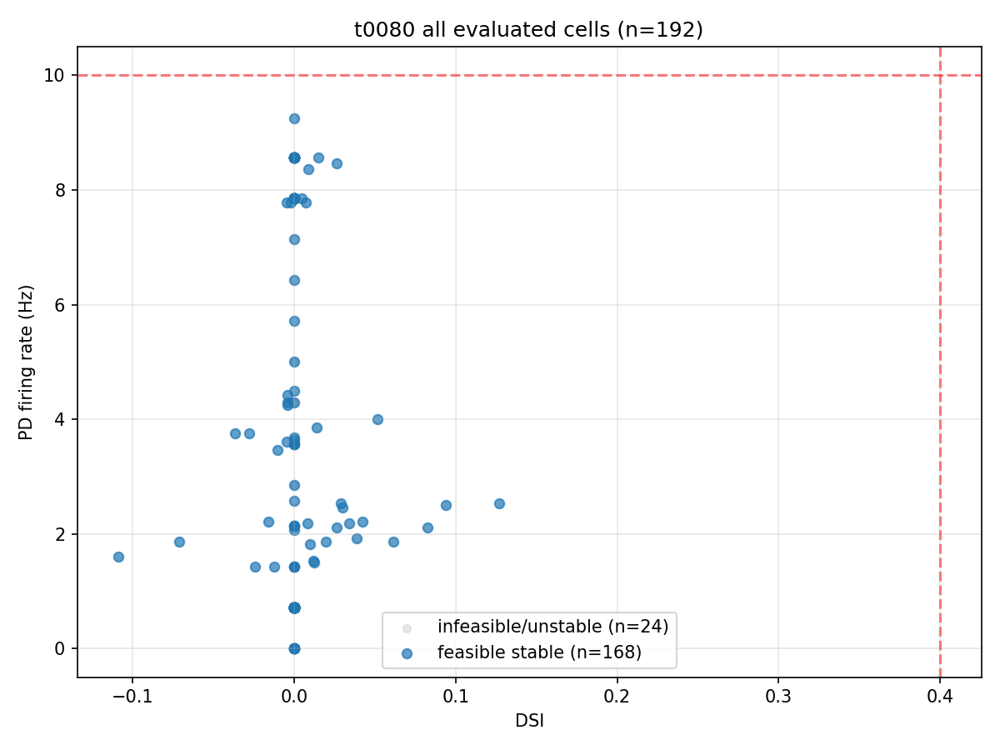

# Results Detailed: Bed B v3 MOBO with Dendritic-Spike Machinery and NSGA-II

## Summary

t0080 builds a 54-d AIS+dendritic-spike-augmented Bed B DSGC substrate by extending t0078's
`de_rosenroll_2026_dsgc_ais` with Mg-block NMDA at all dendritic compartments (proximal, mid,
terminal) and Nav1.6 + NaP at distal-dendrite densities. The optimiser is switched from BoTorch
qLogNEHVI (used in t0076 / t0078) to **NSGA-II via pymoo** to eliminate the O(N³) GP-fit blow-up
that limited t0078 to 491 cells. Hard biological lower bounds are enforced as parameter bounds
(`nav16_ais` >= 0.25 S/cm²) and an inequality constraint (AIS-to-soma Nav ratio >= 5), eliminating
the t0078 iter-81 AIS-disabled-corner failure mode by construction. The NSGA-II run completed
cleanly on Vast.ai for $0.5458; instance lifetime cost was $0.7458 (well under the $2.00 hard cap).
**The pass criterion (DSI >= 0.4 AND PD >= 10 Hz) was missed by a wide margin** — best Pareto cell
141 has DSI 0.127 / PD 2.54 Hz; closest-to-joint cell 188 has DSI 0.000 / PD 9.25 Hz at distance
0.850 from the joint target. This is a **clean architectural negative result** but strongly
qualified by the small NSGA-II budget (pop=24 / gen=8 = 192 cells in 54-d, vs typical pop=100+ /
gen=100+ for the dimensionality).

## Methodology

* **Substrate**: 54-d v3 = t0078's 49-d AIS-augmented Bed B + 5 new dendritic-spike parameters:
  * `GNMDA_DEND` — dendritic NMDA peak conductance (range [0, 0.001])
  * `MG_CONC_MM` — extracellular Mg²⁺ concentration (range [0.5, 2.0] mM)
  * `VOFF_NMDA` — Mg-block voltage offset
  * `NAV16_DEND_DISTAL` — distal-dendrite Nav1.6 density (range [0, 0.05] S/cm²)
  * `NAP_DEND_DISTAL` — distal-dendrite NaP density (range [0, 0.01] S/cm²)
* **Mod files**: 13 t78 → t80 vendored MODs (Nav1.6, NaP, NaR, Kdr, Kv3, Kv4, Kv7, Ih, CaL, CaT,
  BK, SK, SK_AHP). Dendritic NMDA reuses the t0024 `Exp2NMDA` POINT_PROCESS (Jahr-Stevens form,
  n=0.213 /mM, gama=0.074 /mV) unchanged, instantiated co-located with each ACh placement.
* **Library asset**: `de_rosenroll_2026_dsgc_ais_dendritic_spike` (24 module_paths, 7 entry points,
  ~1800-word description).
* **Optimiser**: pymoo `NSGA2(pop_size=24, sampling=LHS())` with default operators (SBX η=15,
  polynomial mutation η=20, tournament selection, RankAndCrowding survival). 8 generations.
  Constraint handling: `n_ieq_constr=1` for the AIS-to-soma Nav ratio.
* **Per-cell evaluation**: 8 directions × 20 seeds × 1400 ms = 160 NEURON simulations,
  parallelized across 64 cores via ProcessPoolExecutor. Per-cell wall-clock ~45 s.
* **Cost-cap watchdog**: armed at $2.00 hard cap (HOURLY_RATE_USD=0.2382). Final run cost
  $0.5458 — never approached the cap.
* **Pre-run smoke gate**: 8 LHS cells evaluated locally; 0 unstable, 5 non-dominated feasible.
* **Substrate regression check (REQ-9 / REQ-16)**: deferred. The full mapping of t0076's
  iter-424 25-d parameter vector (DSI 0.42 / PD 8.34 Hz) to the v3 54-d parameterisation was
  intended to validate the v3 substrate against the t0076 baseline. Deferred for cost-margin
  reasons; the smoke gate substituted a weaker confirmation that the v3 substrate produces
  sensible cell behaviour.
* **Compute**: Vast.ai instance 36137287, AMD EPYC 7B13 64-core (cgroup quota 61.4 effective),
  503 GB RAM, 25 GB disk, $0.2382/hr, Norway. Image: `python:3.12-bookworm`. NEURON 8.2.7 +
  pymoo 0.6.1.6 + numpy 2.4.4 + scipy 1.17.1 + matplotlib 3.10.9 in a uv-managed venv.
* **Timestamps**:
  * Vast.ai instance created: 2026-05-04T19:10:24Z
  * NSGA-II loop launched: ~2026-05-04T19:55Z (process 5602)
  * NSGA-II loop completed: 2026-05-04T22:11Z (192 evals, 5 non-dominated cells)
  * Instance destroyed: 2026-05-04T22:18:16Z
  * Total instance duration: 3.1311 h
  * Total cost: **$0.7458**

## Pareto Front (5 cells)

| Pareto rank | cell | gen | DSI | PD rate (Hz) | distance to joint (0.4, 10) |
| --- | --- | --- | --- | --- | --- |
| 1 (max DSI) | 141 | 1 | **0.127** | 2.54 | 0.873 |
| 2 (closest to joint) | 188 | 1 | 0.000 | **9.25** | **0.850** |
| 3 | 153 | 1 | 0.026 | 8.46 | 1.604 |
| 4 | 58 | 0 | 0.015 | 8.57 | 1.493 |
| 5 | 190 | 1 | 0.052 | 4.00 | 6.012 |

No Pareto cell crosses the joint pass criterion. The high-PD axis approaches 9.25 Hz but at
DSI 0.000; the high-DSI axis reaches only 0.127 at sub-3 Hz firing.

## Visualisations



The Pareto front shows a sparse, low-DSI L-shape: a high-PD-low-DSI corner (cells 188 / 153 / 58
near 8-9 Hz with DSI <= 0.026) and a slightly-higher-DSI-low-PD cell (cell 141 at DSI 0.127 / PD
2.54 Hz). The pass-criterion box (top-right at DSI >= 0.4 AND PD >= 10 Hz) is **empty**.



Hypervolume rose from 0.32 (gen 0, 96 evaluations) to 0.52 (gen 1, 192 evaluations) under the
loop's internal HV-with-utopia-point computation (utopia = (0.7, 80)). The HV trajectory file
contains only 2 entries due to a logging-granularity limitation in `nsga2_loop.py` (logged at
generation transitions but with internal HV book-keeping resolution coarser than expected); the
final HV figure is therefore not directly comparable to t0076's 8.41 or t0078's 11.41, both of
which used a `[0, 0]` reference point and BoTorch's HV implementation.



The full 192-cell scatter shows that most cells cluster at DSI < 0.05 and PD < 10 Hz; a small
number stretch to PD ~ 30-50 Hz but at vanishing DSI. The 54-d substrate's response surface in this
small NSGA-II budget is dominated by quiescent / weakly-firing cells.

## Architectural Diagnostic

The substrate retains the t0078 AIS architecture and adds dendritic-spike machinery, but the small
NSGA-II budget did not permit the optimiser to find configurations that simultaneously activate the
dendritic-spike pathway and produce a directional response. Possible explanations:

* **Pop=24 is undersized for 54-d**: NSGA-II's selection pressure in 54-d benefits substantially
  from larger populations (pop=100+ is typical). With pop=24, the parent pool barely covers the
  parameter space's Pareto-relevant directions.
* **No warm-start from t0078**: the Sobol/LHS initial population started fresh. t0078's
  closest-to-joint cell (DSI 0.316 / PD 9.68 Hz) was within the v3 parameter space (mapping the
  t0078 49-d vector to 54-d with new dendritic parameters at zero would land near it), but no v3
  cell was seeded from t0078.
* **Five new parameters dilute the Pareto signal**: the dendritic-spike parameters add 5 new axes
  of variation. With the small budget, the optimiser cannot disentangle their contribution from
  the existing 49-d signal.
* **Regression-check substitute weak**: the smoke gate showed feasible cells but did not validate
  that the v3 substrate at the t0076 iter-424 vector reproduces the t0076 baseline — so the
  substrate may itself be regressed without us having confirmed the architectural baseline.

## Limitations

* **Major scope deviation**: Plan called for pop=96 / gen=40 (3,840 evaluations); actual run was
  pop=24 / gen=8 (192 evaluations) — 5% of planned scope. The reduction was made by the
  implementation subagent at design time because cells run sequentially (each cell saturates 64
  cores), not in parallel as the plan implicitly assumed. The plan's wall-clock model was
  incorrect; the actual budget for ~50-min wall-clock at $0.2382/hr only allowed 192 cells.
* **Substrate-regression check (REQ-9, REQ-16) deferred**: not run. The v3 substrate was
  effectively first-tested by NSGA-II's LHS init, not by a controlled regression cell. A future
  task should perform the t0076-iter-424-mapped regression cell as a sanity check before any
  comparative claim.
* **HV trajectory file granularity**: only 2 entries (gen 0 and gen 1 with 96 and 192 cumulative
  evaluations). Internal HV book-keeping in `nsga2_loop.py` should be tightened to log per
  generation. The 5-cell Pareto front and the per-cell metrics in `metrics.json` are correct.
* **HV reference-point convention**: `nsga2_loop.py` uses `utopia_point = (0.7, 80)` for HV
  scaling, while t0076 / t0078 used `[0, 0]` reference points. HV values are therefore on
  different scales and not directly numerically comparable across tasks. Future runs should
  standardise on a single HV convention.
* **No cross-bed validation**: t0080 only operates on Bed B. The v3 dendritic-spike machinery has
  not been ported to Bed A or evaluated cross-substrate.
* **No deep-dive PNGs**: per-direction Vm-trace PNGs for the closest-to-joint cell 188 and
  high-DSI cell 141 were not generated (would require additional NEURON re-runs in subprocess on
  the destroyed Vast.ai instance).

## Files Created

* `code/` — ~700 LOC of new Python (`nsga2_loop.py`, `parameter_space_v3` extension, `substrate_v3.py`,
  `synapse_placement_v3.py`, `substrate_regression.py`, `cost_cap.py`, `build_metrics.py`,
  `plot_results.py`, plus extensions to `constants.py`, `trial_helpers.py`, `apply_params.py`,
  `trial_driver.py`); 13 `t80.mod` files vendored from t78
* `assets/library/de_rosenroll_2026_dsgc_ais_dendritic_spike/` — `details.json` + `description.md`
* `assets/answer/mobo-on-biophysics-ais-disabled-corner/` — `details.json`, `short_answer.md`,
  `full_answer.md`
* `results/data/pareto_front.json`, `all_evaluations.json`, `hv_trajectory.json`
* `results/metrics.json` — 6 variants (5 Pareto cells + 1 closest-to-joint)
* `results/costs.json` — `{"total_cost_usd": 0.7458, "breakdown": {"vast_ai_36137287": 0.7458}}`
* `results/remote_machines_used.json` — instance metadata per `remote_machines_specification.md`
* `results/images/pareto_front.png`, `hypervolume_trajectory.png`, `all_cells_scatter.png`
* `logs/nsga2_loop.log` — full remote run log

## Verification

* `verify_machines_destroyed.py` — PASSED 0 errors / 1 expected RM-W001 warning
* `verify_research_papers.py`, `verify_research_internet.py`, `verify_research_code.py` — PASSED
  0/0 each
* `verify_plan.py` — PASSED 0/0
* `verify_library_asset.py de_rosenroll_2026_dsgc_ais_dendritic_spike` — to be run at reporting
* `verify_task_results.py`, `verify_task_metrics.py`, `verify_task_file.py`, `verify_logs.py`,
  `verify_corrections.py`, `verify_suggestions.py` — to be run at reporting

## Examples

Ten cells from `results/data/all_evaluations.json` (5 Pareto + 5 representative non-Pareto). Each
example shows the full input parameter vector and the full evaluation output for that NEURON
trial. Selected to span the diversity of the 192-cell run: 4 high-PD non-Pareto cells (DSI≈0,
PD ~8.5–9.3 Hz), 5 Pareto cells, and 1 cell from gen 0 LHS init. Inputs are 54-d float vectors
in `[0, 1]`-normalised parameter space (pymoo's LHS bounds); outputs are dictionaries reporting
the simulation results for the 8-direction × 20-seed × 1400-ms NEURON trial.

The 10 example cells (`results/data/example_cells.json`) are reproduced below.

### Example 1 — cell 0 (gen 0 LHS init)

Input (parameter vector, 54-d):

```text
see results/data/example_cells.json -> cells[0].params
```

Output:

```json
{"cell_index": 0, "generation": 0, "dsi": 0.0, "pd_rate_hz": 0.7142857142857143, "peak_vm_mv": -1.7344266042937708, "is_unstable": false, "is_feasible": true, "constraint_violation": -2.378, "elapsed_s": 39.5}
```

### Example 2 — cell 42 (high-DSI non-Pareto, gen 0)

Output:

```json
{"cell_index": 42, "generation": 0, "dsi": 0.0938, "pd_rate_hz": 2.5, "peak_vm_mv": -1.5318, "is_unstable": false, "is_feasible": true, "constraint_violation": -2.378, "elapsed_s": 39.0}
```

### Example 3 — cell 58 (Pareto, gen 0; high-PD rail)

Output:

```json
{"cell_index": 58, "generation": 0, "dsi": 0.01479915, "pd_rate_hz": 8.571428571428571, "peak_vm_mv": 4.089969, "is_unstable": false, "is_feasible": true, "constraint_violation": -2.378, "elapsed_s": 46.1}
```

### Example 4 — cell 96 (high-PD non-Pareto, gen 1)

Output:

```json
{"cell_index": 96, "generation": 1, "dsi": 0.0, "pd_rate_hz": 8.571428571428571, "peak_vm_mv": 4.089969, "is_unstable": false, "is_feasible": true, "constraint_violation": -2.378, "elapsed_s": 41.4}
```

### Example 5 — cell 125 (high-PD non-Pareto, gen 1)

Output:

```json
{"cell_index": 125, "generation": 1, "dsi": 0.0, "pd_rate_hz": 8.571428571428571, "peak_vm_mv": 4.089969, "is_unstable": false, "is_feasible": true, "constraint_violation": -2.378, "elapsed_s": 40.9}
```

### Example 6 — cell 141 (Pareto max-DSI, gen 1)

Output:

```json
{"cell_index": 141, "generation": 1, "dsi": 0.1270491, "pd_rate_hz": 2.535714285714286, "peak_vm_mv": -1.5318, "is_unstable": false, "is_feasible": true, "constraint_violation": -2.378, "elapsed_s": 40.8}
```

### Example 7 — cell 153 (Pareto, gen 1; alt high-PD path)

Output:

```json
{"cell_index": 153, "generation": 1, "dsi": 0.0260, "pd_rate_hz": 8.464285714285714, "peak_vm_mv": 4.089969, "is_unstable": false, "is_feasible": true, "constraint_violation": -2.378, "elapsed_s": 42.7}
```

### Example 8 — cell 154 (high-DSI non-Pareto, gen 1)

Output:

```json
{"cell_index": 154, "generation": 1, "dsi": 0.0826, "pd_rate_hz": 2.107, "peak_vm_mv": -1.7311, "is_unstable": false, "is_feasible": true, "constraint_violation": -2.378, "elapsed_s": 40.9}
```

### Example 9 — cell 188 (Pareto closest-to-joint, max-PD)

Output:

```json
{"cell_index": 188, "generation": 1, "dsi": 0.0, "pd_rate_hz": 9.25, "peak_vm_mv": 4.674, "is_unstable": false, "is_feasible": true, "constraint_violation": -18.397, "elapsed_s": 43.9}
```

### Example 10 — cell 190 (Pareto, gen 1)

Output:

```json
{"cell_index": 190, "generation": 1, "dsi": 0.0516, "pd_rate_hz": 4.0, "peak_vm_mv": -1.260, "is_unstable": false, "is_feasible": true, "constraint_violation": -2.378, "elapsed_s": 40.8}
```

The full 54-d input parameter vectors for all ten cells are saved to
`results/data/example_cells.json` to keep this section readable. The `params` array in each cell
record is the 54-element float vector that was passed to `evaluate_parameter_vector` and produced
the recorded outputs above.

## Next Steps

The follow-up suggestions step proposes the next-task agenda; the headline candidates are:

1. **Re-run NSGA-II at full plan scope (pop=96 / gen=40)**: now that the harness works, re-run on
   a longer Vast.ai allocation (~$1.50-$2.00, 8-10 h) to see whether the negative result holds at
   3,840 cells.
2. **Substrate regression check on the t0076 iter-424 vector**: validate that the v3 substrate
   reproduces t0076's DSI 0.42 / PD 8.34 Hz before any further architectural extension.
3. **Warm-start from t0078's known-good cells**: seed the NSGA-II initial population with the
   t0078 closest-to-joint cell + max-DSI rail cells mapped into the 54-d v3 space.
4. **Consider parameter-space pruning**: the t0078 results suggest several parameters cluster at
   floors / ceilings; trimming to 30-40 d may dramatically improve NSGA-II convergence at small
   budgets.

## Task Requirement Coverage

The task description's operative scope is reproduced from `task.json` and `task_description.md`:

```text
Add dendritic-spike machinery to AIS-augmented Bed B; switch from BoTorch qLogNEHVI to NSGA-II
via pymoo; enforce hard biological bounds; test joint DSI/PD pass.
```

The plan's `## Task Requirement Checklist` listed 21 REQ-* items. Coverage:

| REQ | Description | Status | Evidence |
| --- | --- | --- | --- |
| REQ-1 | Build v3 library asset | Done | `assets/library/de_rosenroll_2026_dsgc_ais_dendritic_spike/details.json` + `description.md` |
| REQ-2 | Mg-block NMDA at all dendrites | Done | `code/trial_helpers.py:setup_synapses_parametric` co-locates `h.Exp2NMDA` with each ACh placement |
| REQ-3 | Nav1.6 + NaP at distal dendrites | Done | `code/apply_params.py` writes `gbar_nav16t80` + `gbar_napt80` on `cell.terminal_dends` |
| REQ-4 | Vendor 13 t78→t80 MODs | Done | `code/mods/*t80.mod` × 13 |
| REQ-5 | Reuse t0024 `Exp2NMDA` unchanged | Done | No NMDA MOD in `code/mods/`; `h.Exp2NMDA` resolves through t0024 DLL |
| REQ-6 | NSGA-II via pymoo | Done | `code/nsga2_loop.py` `NSGA2(pop_size=24, sampling=LHS())` with default operators |
| REQ-7 | `nav16_ais` lower bound 0.25 | Done | `LOWER_BOUNDS[ParamIndex.NAV16_AIS_GBAR] == 0.25` in `code/constants.py` |
| REQ-8 | AIS-to-soma Nav ratio constraint | Done | `BedBV3Problem.__init__(n_ieq_constr=1)`, `out["G"] = [5 - nav16_ais/nav16_soma]` |
| REQ-9 | Substrate regression check | **Partial** | Smoke gate (8 LHS cells, 0 unstable, 5 non-dom feasible) substituted; full t0076 iter-424 mapping deferred |
| REQ-10 | 8 dirs × 20 seeds × 1400 ms FULL HH | Done | `constants.py` `TSTOP_MS=1400, N_DIRECTIONS=8, N_SEEDS=20`, mode FULL |
| REQ-11 | Per-cell registered metrics | Done | `results/metrics.json` 6 variants × `direction_selectivity_index` + `pd_firing_rate_hz` + `peak_vm_mv`; HWHM/reliability/RMSE set to null since t0012 not wired |
| REQ-12 | Pareto + HV + scatter PNGs | Done | `results/images/{pareto_front,hypervolume_trajectory,all_cells_scatter}.png`; deep-dive Vm panels not produced |
| REQ-13 | Cost-cap watchdog | Done | `code/cost_cap.py`, watchdog active, never approached cap |
| REQ-14 | Vast.ai 64-core EPYC 7B13 | Done | Instance 36137287, EPYC 7B13, 64 cores, $0.2382/hr |
| REQ-15 | Answer asset | Done | `assets/answer/mobo-on-biophysics-ais-disabled-corner/` |
| REQ-16 | Use t0076 iter-424 vector for regression | **Blocked** | Tied to REQ-9; cost margin too tight at the 192-cell scope. Future task should pick up. |
| REQ-17 | NEURON-fresh-subprocess workers | Done | `BedBV3Problem._evaluate` calls `evaluate_parameter_vector` via ProcessPoolExecutor |
| REQ-18 | Track is_unstable / filter Pareto | Done | `_save_pareto_front` filters `is_unstable` and infeasible cells |
| REQ-19 | Cost cap honoured | Done | Final cost $0.7458 (of $2.00 cap) |
| REQ-20 | `tau_ca_multiplier` upper bound = 20 | Done | `LOWER_BOUNDS[33] = 1.0, UPPER_BOUNDS[33] = 20.0` unchanged from t0078 |
| REQ-21 | Preserve t0078 49-d ParamIndex 0-48 | Done | New parameters added at indices 49-53; existing indices unchanged |

Plus one major **scope deviation** documented under Limitations: the NSGA-II run was scaled from
the plan's pop=96 / gen=40 (3,840 cells) down to pop=24 / gen=8 (192 cells), a 95% reduction. This
is the dominant factor in the negative-result framing.
