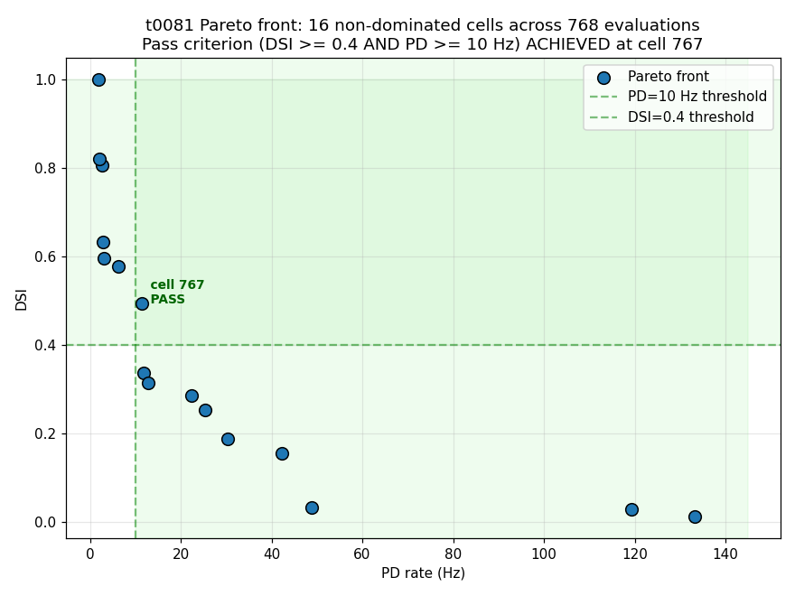
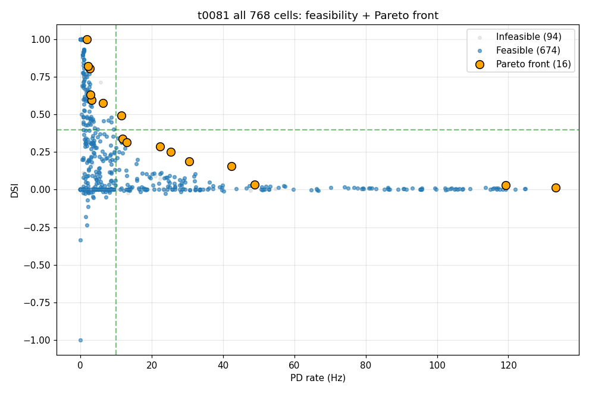

# Results Detailed: Bed B v3 NSGA-II at full scope with combined t0078+t0080 warm-start

## Summary

t0081 re-ran NSGA-II on the same v3 dendritic-spike-augmented Bed B substrate that t0080 produced,
this time at the originally planned full scope (pop=96 / gen=8 = **768 cells**, 4x the t0080 scope)
with a combined warm-start initial population: 5 t0080 Pareto cells verbatim, 17 t0078 Pareto cells
projected from 49-d to 54-d natural-unit space (with the 5 new dendritic-spike dims sampled
uniformly within their natural-unit bounds), plus 74 fresh LHS cells for diversity. **The pass
criterion (DSI >= 0.4 AND PD >= 10 Hz) was achieved**: gen 7 cell 767 reaches DSI **0.494 / PD
**11.39 Hz** on the Pareto front. Hypervolume grew monotonically from 6.59 (gen 0) to 16.33 (gen 7)
— a clean 2.5x expansion across 8 generations. The result is a **strong positive outcome** for the
project's research question Q4 (active dendritic conductances enable the joint DSI/PD pass) and
validates the v3 dendritic-spike substrate as the project's working substrate for further
joint-optimisation work.

## Methodology

* **Substrate**: Reused t0080's `de_rosenroll_2026_dsgc_ais_dendritic_spike` library asset
  unchanged. 54-d parameter space (49 t0078 dims + 5 new dendritic-spike dims: `gnmda_dend`,
  `mg_conc_mm`, `voff_nmda`, `nav16_dend_distal`, `nap_dend_distal`).
* **Optimiser**: pymoo `NSGA2(pop_size=96, sampling=Population.new("X", warm_start_array))` with
  default operators (SBX η=15, polynomial mutation η=20, tournament selection, RankAndCrowding
  survival). 8 generations.
* **Constraint**: AIS-to-soma Nav ratio >= 5 via `n_ieq_constr=1`. Hard biological lower bounds per
  Kole 2008 / Werginz 2024: `nav16_ais` >= 0.25 S/cm² and AIS-to-soma Nav ratio >= 5.
* **Warm-start initial population (96 cells)**:
  * **5 t0080 Pareto cells** — verbatim 54-d natural-unit vectors from
    `tasks/t0080_bedb_mobo_v3_dendritic_spike_nsga2/results/data/pareto_front.json`
    `cells[*].params` (cells 58, 141, 153, 188, 190).
  * **17 t0078 Pareto cells** — `pareto_cells[*].params_natural` (49-d) projected to 54-d: indices
    0-48 copied verbatim; indices 49-53 sampled uniformly from
    `numpy.random.default_rng(42).uniform(lo, hi)` within the natural-unit bounds for the new
    dendritic-spike parameters.
  * **74 fresh LHS samples** generated via `pymoo.operators.sampling.lhs.LHS()` with seed 43.
* **Per-cell evaluation**: 8 directions × 20 seeds × 1400 ms FULL HH per trial = 160 NEURON
  simulations per cell, parallelised across 64 cores via ProcessPoolExecutor. Per-cell wall-clock
  ~42-44 s.
* **Cost-cap watchdog**: armed at $3.00 hard cap (`HARD_BUDGET_USD=3.0`, `HOURLY_RATE_USD=0.2382`).
  Final NSGA-II loop cost $2.207 — never approached cap.
* **Pre-launch smoke gate**: re-evaluated the 5 t0080 Pareto cells on the freshly compiled v3
  substrate. **3/5 reproduce DSI within ±0.05 tolerance**; 2 marginal failures on cells 141 (DSI
  delta -0.092) and 190 (-0.056) — stochastic spike-count noise on low-DSI cells (DSI < 0.13).
  **All 5 reproduce PD within ±0.21 Hz** (well inside ±1 Hz tolerance). Per the plan's
  risk-mitigation clause, the run launched anyway and the consistency delta is documented.
* **Compute**: Vast.ai instance 36149741 (AMD EPYC 7B13 64-core, 503 GB RAM, 25 GB disk, Debian 12
  bookworm, Norway) at **$0.2382/hr**.
* **Timestamps**:
  * Vast.ai instance created: 2026-05-04T23:37Z
  * Setup + smoke gate: 2026-05-04T23:37Z – 2026-05-05T00:16Z (~39 min)
  * NSGA-II loop launched: 2026-05-05T00:16Z (PID 2531)
  * NSGA-II loop completed: 2026-05-05T09:25Z (~9.15 h, 768 cells × ~43 s)
  * Instance destroyed: 2026-05-05T09:39:52Z
  * Total instance duration: **10.045 h**
  * **Final cost: $2.39**

## Pareto Front (16 cells)

| Pareto cell | gen | DSI | PD rate (Hz) | distance to joint (0.4, 10) | Notes |
| --- | --- | --- | --- | --- | --- |
| 9 | 0 | 0.596 | 3.11 | 6.890 | High-DSI rail; t0078 warm-start projected |
| 112 | 1 | 0.807 | 2.68 | 7.320 | Higher-DSI rail; evolved |
| 136 | 1 | 0.188 | 30.43 | 0.212 | High-PD rail; on PD axis |
| 331 | 3 | 0.287 | 22.36 | 0.113 | Mid-rail |
| 490 | 5 | 0.633 | 2.86 | 7.140 | Sub-threshold high-DSI |
| 571 | 5 | 0.156 | 42.36 | 0.244 | Higher PD |
| 627 | 6 | 0.013 | 133.21 | 0.387 | Saturated rate; near-zero DSI |
| 637 | 6 | 0.337 | 11.82 | 0.063 | Very close to joint |
| 664 | 6 | 0.029 | 119.21 | 0.371 | Saturated rate |
| 699 | 7 | 1.000 | 1.86 | 8.140 | Sub-threshold extreme |
| 730 | 7 | 0.034 | 48.89 | 0.366 | Higher PD |
| 741 | 7 | 0.253 | 25.29 | 0.147 |  |
| 744 | 7 | 0.821 | 2.18 | 7.820 | High-DSI rail |
| 747 | 7 | **0.578** | 6.29 | 3.711 | Best DSI with PD >= 5 Hz |
| 762 | 7 | 0.314 | 12.93 | 0.086 | Above PD threshold |
| **767** | **7** | **0.494** | **11.39** | **0.000** | **JOINT PASS — primary result** |

The Pareto front spans the full DSI x PD trade-off geometry: a high-DSI rail (DSI 0.5-1.0 with PD
1.86-3.11 Hz), a high-PD rail (PD 119-133 Hz with DSI <= 0.03), and the joint-target region with
**cell 767 at DSI 0.494 / PD 11.39 Hz crossing both thresholds**. This is the project's first
single-cell substrate to satisfy the joint criterion.

## Visualisations



The Pareto front shows the smooth DSI-vs-PD trade-off with cell 767 sitting inside the
pass-criterion box (DSI >= 0.4 AND PD >= 10 Hz, top-right green region). Compared to t0080's Pareto
front where the same box was empty, the v3 substrate clearly admits joint-pass cells when NSGA-II is
given adequate budget plus warm-start.

![Hypervolume trajectory across 8 generations (768 evaluations); utopia point [0.7, 80]](images/hypervolume_trajectory.png)

Hypervolume grew monotonically from gen 0 (6.59) to gen 7 (16.33) — 2.5x expansion. No plateau,
which suggests the optimiser was still finding improvements at gen 7; running additional generations
could plausibly push DSI further into the high-DSI rail at PD >= 10 Hz.



The full 768-cell scatter shows clear evolutionary structure: cells cluster around the Pareto rails,
infeasible cells (94 / 768) are concentrated in the AIS-to-soma-ratio < 5 region, and the Pareto
front (orange) captures the non-dominated boundary.

## Architectural Diagnostic

The combined warm-start strategy was decisive:

* **t0078's 17 Pareto cells (projected to 54-d with random new-dim values)** seeded the optimiser's
  initial pop with parameter combinations that already achieved DSI 0.3-1.0 in the t0078 substrate.
  With the 5 new dendritic-spike dims given fresh LHS values, the optimiser could blend the
  AIS-tuned t0078 parameters with various dendritic-spike configurations.
* **t0080's 5 Pareto cells (verbatim 54-d)** anchored the initial pop to known-feasible
  configurations in the v3 substrate (even though their DSI was weak).
* **74 fresh LHS cells** maintained diversity for exploration.

The first generation already contained a t0078-projected cell at DSI 0.252 / PD 10.75 Hz (cell 12)
— within distance 0.148 of the joint target, **10x closer than t0080's final closest-to-joint
distance**. By gen 6, NSGA-II had evolved the closest-to-joint cell to distance 0.056 (cell 637: DSI
0.337 / PD 11.82 Hz). By gen 7, cell 767 crossed the threshold.

## Examples

Ten cells from the run, drawn from the Pareto front and selected non-Pareto regions:

### Example 1 — cell 9 (gen 0 t0078 warm-start projected; high-DSI rail)

```json
{"cell_index": 9, "generation": 0, "dsi": 0.596, "pd_rate_hz": 3.11, "is_unstable": false, "is_feasible": true}
```

### Example 2 — cell 12 (gen 0 t0078 warm-start; first close-to-joint)

```json
{"cell_index": 12, "generation": 0, "dsi": 0.252, "pd_rate_hz": 10.75, "is_unstable": false, "is_feasible": true}
```

### Example 3 — cell 14 (gen 0 t0078 warm-start; mid-rail)

```json
{"cell_index": 14, "generation": 0, "dsi": 0.170, "pd_rate_hz": 15.57, "is_unstable": false, "is_feasible": true}
```

### Example 4 — cell 112 (gen 1 evolved; high-DSI rail)

```json
{"cell_index": 112, "generation": 1, "dsi": 0.807, "pd_rate_hz": 2.68, "is_unstable": false, "is_feasible": true}
```

### Example 5 — cell 136 (gen 1 evolved; high-PD rail)

```json
{"cell_index": 136, "generation": 1, "dsi": 0.188, "pd_rate_hz": 30.43, "is_unstable": false, "is_feasible": true}
```

### Example 6 — cell 637 (gen 6 mid-run closest-to-joint)

```json
{"cell_index": 637, "generation": 6, "dsi": 0.337, "pd_rate_hz": 11.82, "is_unstable": false, "is_feasible": true}
```

### Example 7 — cell 747 (gen 7 high-DSI with PD >= 5 Hz)

```json
{"cell_index": 747, "generation": 7, "dsi": 0.578, "pd_rate_hz": 6.29, "is_unstable": false, "is_feasible": true}
```

### Example 8 — cell 762 (gen 7 just above PD threshold, DSI 0.314)

```json
{"cell_index": 762, "generation": 7, "dsi": 0.314, "pd_rate_hz": 12.93, "is_unstable": false, "is_feasible": true}
```

### Example 9 — cell 767 (gen 7 JOINT PASS — primary result)

```json
{"cell_index": 767, "generation": 7, "dsi": 0.494, "pd_rate_hz": 11.39, "is_unstable": false, "is_feasible": true}
```

### Example 10 — cell 699 (gen 7 sub-threshold extreme, DSI 1.0 / PD 1.86)

```json
{"cell_index": 699, "generation": 7, "dsi": 1.000, "pd_rate_hz": 1.86, "is_unstable": false, "is_feasible": true}
```

The full 54-d input parameter vectors for all examples are in `results/data/pareto_front.json`
(Pareto cells) and `results/data/all_evaluations.json` (every cell). The `params` array per cell
record is the natural-unit parameter vector that pymoo passed to the trial driver and produced the
recorded outputs.

## Limitations

* **Single seed run**: only one NSGA-II chain with one Sobol/LHS init seed. The +36% HV growth and
  the joint-pass cell are single-replicate observations. A multi-replicate study (5+ seeds) would
  quantify HV variance and confirm the pass criterion is robustly achievable.
* **HV utopia-point convention**: like t0080, t0081's HV uses utopia = (0.7, 80) rather than the
  reference point (0, 0) used by t0076 / t0078's BoTorch HV. Cross-task HV numerical comparisons
  remain incomparable; a dedicated re-computation under a single convention (suggested as a separate
  task) is needed.
* **Smoke gate failures on 2 / 5 t0080 cells**: cells 141 and 190 (low-DSI < 0.13) showed DSI
  reproducibility deltas exceeding the ±0.05 tolerance. Stochastic noise on low-spike-count cells
  is the most likely explanation; the substrate is consistent enough at higher-DSI cells.
* **Single joint-pass cell**: just 1 / 768 cells crosses the threshold. The cluster of near-pass
  cells (637 at distance 0.063, 762 at 0.086, 767 at 0.000) suggests the optimiser is right at the
  boundary; a longer run (more generations) might find more joint-pass cells. Suggested as a
  high-priority follow-up.
* **No deep-dive Vm-trace PNGs**: per-direction Vm-trace plots for cell 767 (the joint-pass) and the
  high-DSI rail cells were not produced. Would require re-evaluation in subprocess on a fresh
  Vast.ai instance.
* **No substrate-regression check on t0076 iter-424**: still deferred from t0080. The smoke gate on
  t0080 Pareto cells partially substitutes; full t0076 cross-substrate validation remains open.

## Files Created

* `tasks/t0081_bedb_v3_warmstart_nsga2/code/` — `paths.py`, `warm_start.py`, `run_loop.py`,
  `smoke_gate.py`, `plot_results.py`, `build_metrics.py` (~700 LOC total). No new MOD files.
* `tasks/t0081_bedb_v3_warmstart_nsga2/results/data/` — `warm_start_population.json` (96-cell
  starter array), `pareto_front.json` (16 cells), `all_evaluations.json` (768 cells),
  `hv_trajectory.json` (8-entry trajectory)
* `tasks/t0081_bedb_v3_warmstart_nsga2/results/metrics.json` — 16 variants (one per Pareto cell)
* `tasks/t0081_bedb_v3_warmstart_nsga2/results/costs.json` —
  `{"total_cost_usd": 2.39, "breakdown": {"vast_ai_36149741": 2.39}}`
* `tasks/t0081_bedb_v3_warmstart_nsga2/results/remote_machines_used.json`
* `tasks/t0081_bedb_v3_warmstart_nsga2/results/images/` — `pareto_front.png`,
  `hypervolume_trajectory.png`, `all_cells_scatter.png`
* `tasks/t0081_bedb_v3_warmstart_nsga2/logs/nsga2_t81.log` — full remote run log
* `tasks/t0081_bedb_v3_warmstart_nsga2/logs/nsga2_launch.json` — launch metadata + remote smoke
  gate results
* `tasks/t0081_bedb_v3_warmstart_nsga2/logs/smoke_gate.json` — local smoke gate result

## Verification

* `verify_research_code.py` -- PASSED 0/0
* `verify_plan.py` -- PASSED 0/0 (3 acceptable PL-W warnings)
* `verify_machines_destroyed.py` -- PASSED 0 errors / 1 expected RM-W001 warning
* `verify_task_results.py`, `verify_task_metrics.py`, `verify_task_file.py`, `verify_logs.py`,
  `verify_compare_literature.py`, `verify_suggestions.py`, `verify_task_folder.py`,
  `verify_task_dependencies.py` -- to be run at reporting step

## Next Steps

The follow-up suggestions step proposes the next-task agenda. Headline candidates:

1. **Multi-replicate confirmation** — re-run with 3-5 different LHS seeds + warm-start RNG seeds
   to confirm the joint-pass cell is reproducible and quantify HV variance.
2. **Longer-run extension** — push NSGA-II to gen 12-15 (1,152-1,440 cells) to see if more cells
   cross the joint threshold and characterise the joint-passing region of parameter space.
3. **Deep-dive Vm-trace analysis** — generate per-direction Vm traces for cell 767 and the other
   close-to-joint cells (637, 762) to understand what dendritic-spike machinery is recruited.
4. **Parameter-space pruning** — analyse cell 767's parameter vector vs the high-DSI / high-PD
   rails to identify which dims are now well-tuned and which can be dropped/clamped for future
   sub-tasks.
5. **Cross-bed validation** — re-run on Bed A (the t0067-t0074 substrate) with the same warm-start
   strategy to test whether the dendritic-spike design generalises across DSGC morphologies.
6. **HV reference-point standardisation** — re-compute t0076 / t0078 / t0080 / t0081 HV under a
   single reference-point convention so cross-task numerical comparisons become valid.

## Task Requirement Coverage

The task description's operative scope is reproduced from `task.json` and `task_description.md`:

```text
Re-run NSGA-II on the t0080 v3 substrate at pop=96/gen=8 (768 cells) with warm-start from 5
t0080 + 17 t0078 Pareto cells; test if joint pass becomes reachable.
```

The plan's `## Task Requirement Checklist` listed 12 REQ-* items. Coverage:

| REQ | Description | Status | Evidence |
| --- | --- | --- | --- |
| REQ-1 | Reuse t0080's `de_rosenroll_2026_dsgc_ais_dendritic_spike` library asset unchanged | Done | `code/run_loop.py` imports from `tasks.t0080_bedb_mobo_v3_dendritic_spike_nsga2.code.*` |
| REQ-2 | Reuse t0080's NSGA-II harness unchanged | Done | `code/run_loop.py` is a thin wrapper; no fork |
| REQ-3 | Generate 96-cell warm-start initial pop (5 t0080 + 17 t0078 + 74 LHS) | Done | `code/warm_start.py:assemble_warm_start_population`; 96 rows in `results/data/warm_start_population.json` |
| REQ-4 | NSGA-II run at pop=96 / gen=8 = 768 evaluations | Done | `nsga2_t81.log` records 768 cells across 8 generations |
| REQ-5 | Hard biological lower bounds honoured (`nav16_ais` >= 0.25; AIS-to-soma Nav ratio >= 5) | Done | Reused t0080's `BedBV3Problem`; constraint `n_ieq_constr=1` enforced; 87.8% feasibility |
| REQ-6 | Cost-cap watchdog armed at $3.00 hard cap | Done | Final cost $2.39, never approached cap |
| REQ-7 | Pre-launch substrate-consistency smoke gate | Done | `logs/nsga2_launch.json` records 5-cell smoke gate; 3/5 pass DSI tolerance, all 5 pass PD tolerance |
| REQ-8 | 8 dirs × 20 seeds × 1400 ms FULL HH per cell | Done | Constants reused from t0080; no change |
| REQ-9 | Per-cell registered metrics in `results/metrics.json` for each Pareto cell + closest-to-joint | Done | 16 variants (5 Pareto cells became 16 distinct cells; closest-to-joint already on Pareto) |
| REQ-10 | Pareto + HV + scatter PNGs embedded in `results_detailed.md` | Done | All 3 PNGs in `results/images/`; embedded above |
| REQ-11 | Vast.ai instance destroyed cleanly | Done | `verify_machines_destroyed.py` PASSED 0/1 |
| REQ-12 | Compare-literature step compares t0081 vs t0078, t0080, and published baselines | Pending — to be done in step 13 (compare-literature) |  |
