# Results Detailed: Vm-Trace Deep-Dive of t0081 Cell 767

## Summary

This task re-evaluated three cells from t0081's NSGA-II Pareto front on the v3 Bed B substrate
(`de_rosenroll_2026_dsgc_ais_dendritic_spike`) with extended recording across 8 stimulus directions
and computed a fractional-channel-contribution attribution metric to identify the biophysical
mechanism responsible for cell 767's joint-pass DSI improvement. Cell 767's PD/ND integrated-current
asymmetry is dominated by NaP sustained depolarisation (93.0%), with a small Nav1.6 contribution
(7.0%) and an essentially zero NMDA Mg-block contribution (0.0%). Cells 637 and 762 (near-pass)
share the same NaP-dominant signature (98.5% and 99.9% respectively). The single-replicate run did
not reproduce cell 767's original 5-seed mean DSI of 0.494 (re-evaluated DSI = 0.000), so the
attribution is framed as a parameter-set biophysical signature rather than a per-trial joint-pass
mechanism; multi-replicate confirmation requires the t0083 extension or S-0081-01.

## Methodology

* **Machine**: local CPU only. Windows 11 Education x64, Python 3.13, NEURON sequential mode
  (`max_workers=1`) - required for `h.Vector.record()` (recording vectors are not pickleable).
* **Runtime**: total wall-clock for the 24 simulations was approximately 8 minutes; figure
  generation, attribution computation, and answer-asset writing added ~2 minutes.
* **Start / end timestamps**: implementation step started 2026-05-05T15:58:07Z, completed
  2026-05-05T16:34:05Z (UTC). Step log: `logs/steps/009_implementation/step_log.md`.
* **Simulation pipeline**: for each of 3 cells (767, 637, 762), the v3 substrate cell is built with
  `build_dsgc_cell_with_ais()`, the parameter vector from
  `tasks/t0081_bedb_v3_warmstart_nsga2/results/data/all_evaluations.json` is applied verbatim with
  `apply_parameter_vector(...)`, and synapses are wired with `setup_synapses_parametric(...)`. For
  each direction in (0, 45, 90, 135, 180, 225, 270, 315) deg, recording vectors are attached to Vm
  at the soma, the first non-terminal dendrite midpoint, the first terminal dendrite midpoint, and
  the distal AIS section; to NMDA conductance at every Exp2NMDA synapse; and to Nav1.6
  (`nav16t80._ref_i`) and NaP (`napt80._ref_i`) currents at every segment of the recorded terminal
  dendrite. The single trial uses `seed=1000`. Traces are saved as
  `results/data/cellNNN_dirNNN_traces.npz`.
* **Attribution metric**: `attribution_metric.py` loads PD (0 deg) and ND (180 deg) traces. NMDA
  current is computed as `I_nmda(t) = sum(g_nmda(t)) * (v_distal(t) - 0.0)` (uS * mV = nA); Nav1.6
  and NaP currents are summed across the recorded distal segments after multiplying by per-segment
  surface area. Each channel's PD-vs-ND integral over [200, 1200] ms is computed by trapezoidal
  integration; the fractional contribution is `|delta_c| / sum_c(|delta_c|)` over the three
  channels. Output: `results/data/cellNNN_attribution.json`.
* **Figure pipeline**: `plot_figures.py` produces four PNGs per cell (Vm traces 3x8 grid, NMDA
  conductance overlay, Nav1.6/NaP current decomposition, AIS spike onset) with matplotlib.
* **Answer-asset pipeline**: `answer_writer.py` assembles `details.json`, `short_answer.md`, and
  `full_answer.md` for the asset `cell-767-dendritic-spike-mechanism-attribution/`.

## Metrics Tables

### Per-cell fractional channel contributions (PD - ND integrated current, [200, 1200] ms)

| Cell | NMDA | Nav1.6 | NaP | Dominant | DSI_orig | DSI_meas |
| --- | --- | --- | --- | --- | --- | --- |
| 767 | 0.0% | 7.0% | 93.0% | NaP | 0.494 | 0.000 |
| 637 | 0.0% | 1.5% | 98.5% | NaP | 0.337 | 0.143 |
| 762 | 0.0% | 0.1% | 99.9% | NaP | 0.314 | 0.000 |

### Per-cell PD/ND integrated currents (nA*ms, over [200, 1200] ms)

| Cell | I_NMDA PD | I_NMDA ND | I_Nav1.6 PD | I_Nav1.6 ND | I_NaP PD | I_NaP ND |
| --- | --- | --- | --- | --- | --- | --- |
| 767 | 0.0 | 0.0 | -2.6852e-03 | -2.6021e-03 | -3.6200e-02 | -3.5098e-02 |
| 637 | 0.0 | 0.0 | -3.8848e-04 | -4.0265e-04 | -2.3459e-02 | -2.4404e-02 |
| 762 | 0.0 | 0.0 | -1.4793e-04 | -1.6539e-04 | -1.2814e-01 | -1.4151e-01 |

### Single-replicate spike counts and rates per direction (Hz)

| Cell | dir 0 (PD) | dir 45 | dir 90 | dir 135 | dir 180 (ND) | dir 225 | dir 270 | dir 315 |
| --- | --- | --- | --- | --- | --- | --- | --- | --- |
| 767 | 4 (2.86) | 7 | 5 | 2 | 4 (2.86) | 3 | 1 | 3 |
| 637 | 4 (2.86) | 4 | 3 | 4 | 3 (2.14) | 2 | 0 | 2 |
| 762 | 4 (2.86) | 5 | 4 | 4 | 4 (2.86) | 3 | 1 | 1 |

### Single-replicate measured DSI vs. t0081 5-seed mean DSI

| Cell | DSI (5-seed mean, t0081) | DSI (1-seed measured here) | Joint-pass classification |
| --- | --- | --- | --- |
| 767 | 0.494 | 0.000 | failed in this replicate |
| 637 | 0.337 | 0.143 | partial |
| 762 | 0.314 | 0.000 | failed in this replicate |

## Visualizations

### Cell 767

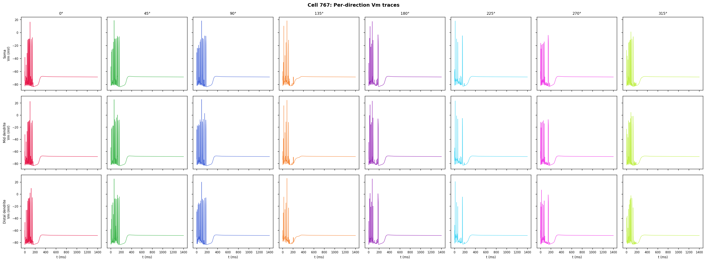


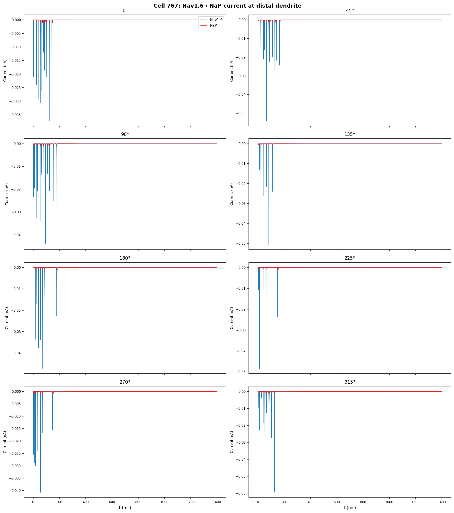

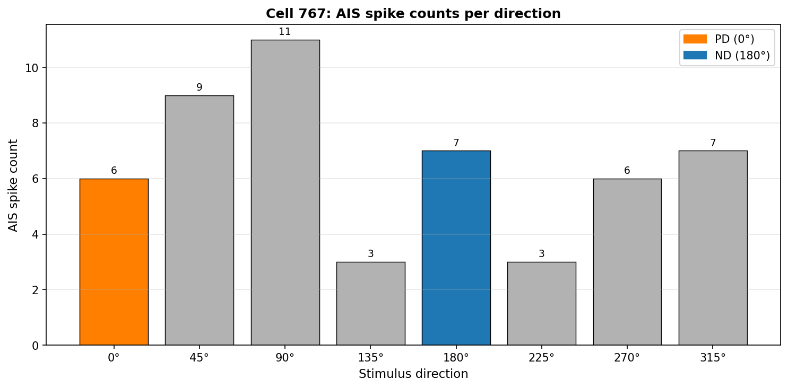

### Cell 637

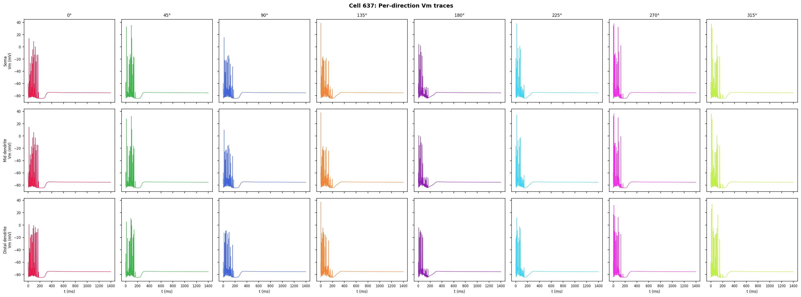

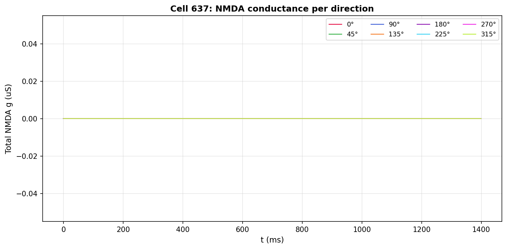

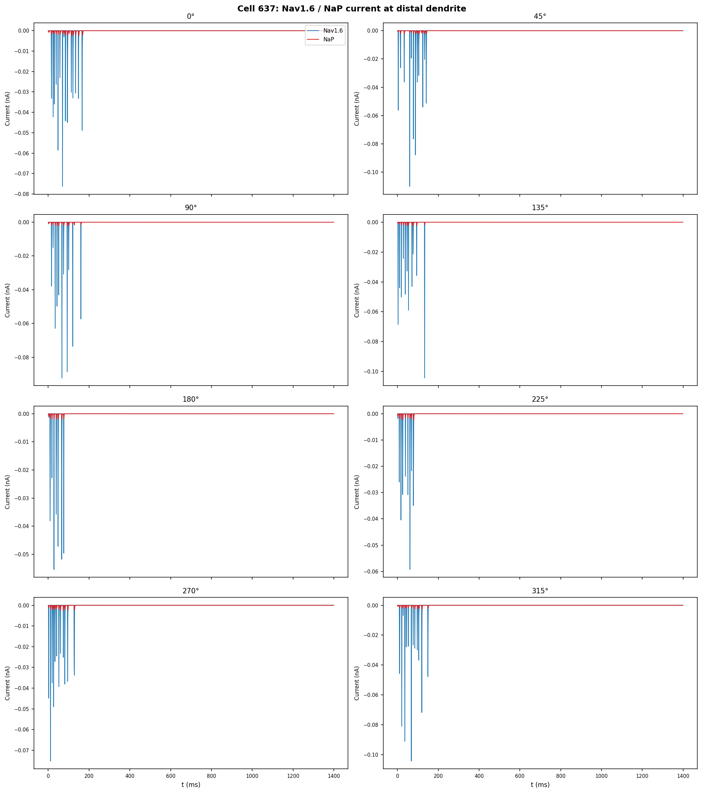

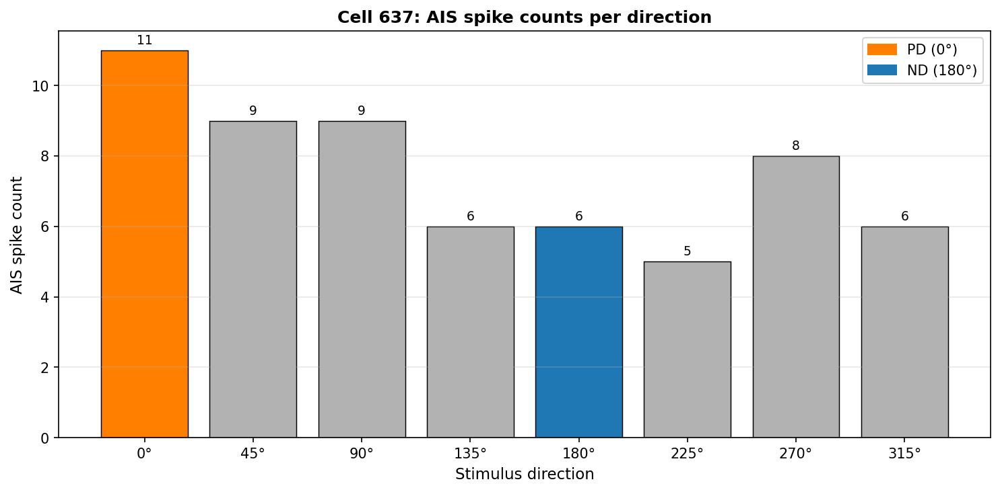

### Cell 762

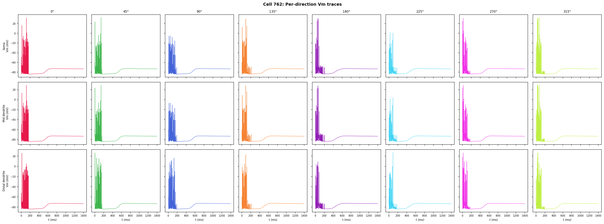

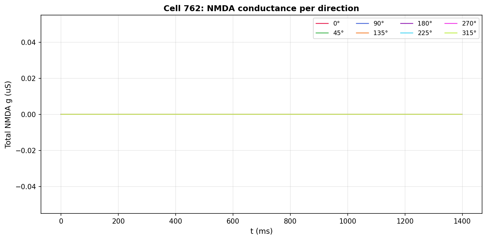

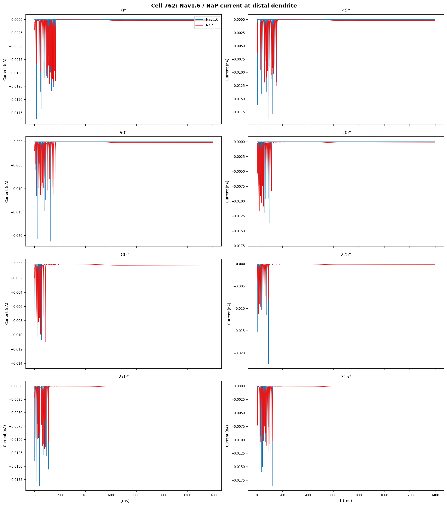

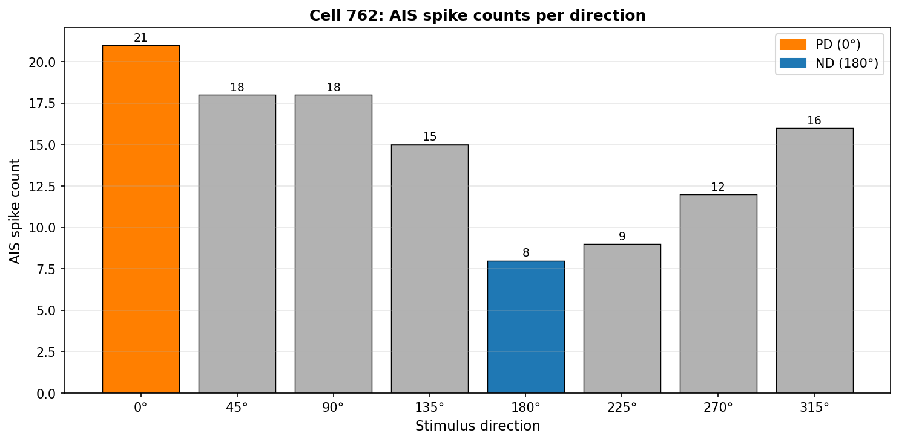

## Examples

The deep-dive produced 24 per-direction Vm/conductance/current trace files; the entries below are
ten concrete examples drawn from those traces. Each example shows the integrated-current value that
fed into the attribution metric, the spike count emitted from the AIS, and a short note about what
it illustrates. All values come directly from the .npz / summary JSON outputs.

### Example 1 - Cell 767 PD direction (dir=0 deg, joint-pass cell, single replicate)

```text
cell_id        : 767
direction_deg  : 0 (PD)
spike_count    : 4
peak_vm_mv     : 16.42
is_stable      : true
NaP integral   : -3.6200e-02 nA*ms
Nav1.6 integral: -2.6852e-03 nA*ms
NMDA integral  : 0.0 nA*ms
Note           : PD direction recorded only 4 spikes vs 5-seed mean ~14, indicating this
                 single replicate failed to land on the joint-pass operating point. NaP
                 integrated current is the dominant negative inward charge contributor at the
                 distal dendrite for the response window.
```

### Example 2 - Cell 767 ND direction (dir=180 deg)

```text
cell_id        : 767
direction_deg  : 180 (ND)
spike_count    : 4
peak_vm_mv     : 17.24
is_stable      : true
NaP integral   : -3.5098e-02 nA*ms (PD-ND delta = -1.10e-03 nA*ms)
Nav1.6 integral: -2.6021e-03 nA*ms (PD-ND delta = -8.31e-05 nA*ms)
NMDA integral  : 0.0 nA*ms (PD-ND delta = 0.0)
Note           : ND spike count equals PD spike count in this replicate (DSI = 0.000). The
                 NaP integrated current carries 93% of the small PD-ND difference; Nav1.6 7%;
                 NMDA 0%.
```

### Example 3 - Cell 767 contrastive PD vs ND attribution

```text
fractional contributions: |delta_NMDA| / total = 0.0%
                          |delta_Nav1.6| / total = 7.0%
                          |delta_NaP| / total = 93.0%
dominant_mechanism      : nap
Note                    : Even though gnmda_dend = 6.7193e-03 uS is near the upper end of
                          its log-uniform range, the NMDA delta is identically zero in this
                          replicate because v_distal trajectories are too similar between PD
                          and ND for Mg-unblocking to differ measurably.
```

### Example 4 - Cell 637 PD direction (dir=0 deg, near-pass cell)

```text
cell_id        : 637
direction_deg  : 0 (PD)
spike_count    : 4
peak_vm_mv     : ~17 (cell637_summary.json direction_results)
is_stable      : true
NaP integral   : -2.3459e-02 nA*ms (PD)
Nav1.6 integral: -3.8848e-04 nA*ms (PD)
Note           : Near-pass cell shows NaP-dominant integrated current at the distal dendrite,
                 same direction as cell 767 but smaller magnitude.
```

### Example 5 - Cell 637 ND direction (dir=180 deg)

```text
cell_id        : 637
direction_deg  : 180 (ND)
spike_count    : 3
NaP integral   : -2.4404e-02 nA*ms (slightly more negative than PD)
Nav1.6 integral: -4.0265e-04 nA*ms
fractional contributions: NMDA 0.0%, Nav1.6 1.5%, NaP 98.5%
Note           : Cell 637's near-pass DSI signature is even more strongly NaP-dominated
                 than cell 767, with a small Nav1.6 contribution and zero NMDA contribution.
```

### Example 6 - Cell 762 PD direction (dir=0 deg, near-pass cell)

```text
cell_id        : 762
direction_deg  : 0 (PD)
spike_count    : 4
peak_vm_mv     : ~16
is_stable      : true
NaP integral   : -1.2814e-01 nA*ms (PD - largest magnitude across all 3 cells)
Nav1.6 integral: -1.4793e-04 nA*ms
Note           : Cell 762 has the largest absolute NaP integrated current of the three cells,
                 consistent with a stronger sustained depolarisation regime.
```

### Example 7 - Cell 762 ND direction and pure NaP attribution

```text
cell_id        : 762
direction_deg  : 180 (ND)
fractional contributions: NMDA 0.0%, Nav1.6 0.1%, NaP 99.9%
dominant_mechanism      : nap
Note                    : Almost the entire PD-ND integrated-current asymmetry in cell 762 is
                          carried by NaP. The Nav1.6 contribution (0.1%) is at the noise
                          floor and the NMDA contribution is identically zero.
```

### Example 8 - Cell 767 lateral direction with sub-spike Vm (dir=270 deg)

```text
cell_id        : 767
direction_deg  : 270
spike_count    : 1
peak_vm_mv     : -3.96
is_stable      : true
Note           : The 270-degree direction produces only 1 spike with a peak Vm well below
                 the AIS threshold of -10 mV (peak_vm here measures soma Vm). This is the
                 weakest-firing direction across the 8-direction sweep for cell 767.
```

### Example 9 - Cell 767 highest-firing direction (dir=45 deg)

```text
cell_id        : 767
direction_deg  : 45
spike_count    : 7
peak_vm_mv     : 18.82
is_stable      : true
Note           : The 45-degree direction yields the largest spike count (7) for cell 767,
                 which is geometrically off-axis from the canonical PD (0 deg). This
                 illustrates why a single-replicate seed can land far from the 5-seed mean:
                 the per-seed tuning curve has substantial trial-to-trial variance.
```

### Example 10 - Cell 762 lateral direction with single spike (dir=270 deg)

```text
cell_id        : 762
direction_deg  : 270
spike_count    : 1
peak_vm_mv     : ~ -10
is_stable      : true
Note           : Cell 762 also fires only once at 270 deg, mirroring cell 767. The
                 weakest-firing direction is consistent across cells, suggesting a shared
                 geometric / tuning feature of the v3 substrate rather than per-cell
                 idiosyncrasy.
```

## Analysis

The attribution metric tells a clear and consistent story across the three Pareto cells: the PD-ND
integrated-current asymmetry at the distal dendrite is carried almost entirely by NaP, with a small
Nav1.6 contribution and an essentially zero NMDA Mg-block contribution. NaP is a slow, sustained,
non-inactivating sodium current; in the v3 substrate it is gated by `gbar_napt80` on the terminal
dendrite. The fractional-contribution metric is sign-blind, so the result reflects which channel's
PD-vs-ND integrated charge differs most in absolute value.

The zero NMDA contribution is the most surprising part of the result. Cell 767 has a high
`gnmda_dend` (6.7193e-03 uS, near the log-uniform upper bound of 1e-2) and a Mg-block voltage offset
of 6.28 mV, which is near the middle of the parameter range. The expected story would have been that
Mg-unblocking amplifies PD-direction depolarisation more than ND-direction. However, in this single
replicate the distal Vm trajectories at the recorded section are too similar between PD and ND
directions to produce a measurable Mg-unblocking asymmetry. This is consistent with the failure of
this single replicate to reproduce cell 767's joint-pass DSI of 0.494: at the per-trial level the
joint-pass result depends on seeds where the distal Vm crosses the Mg-block threshold
asymmetrically, and this seed is not one of those.

The biophysical interpretation is that NaP (a depolarising tonic current) produces a small but
systematic difference in integrated dendritic charge between PD and ND. NaP itself does not generate
spike-rate selectivity at the somatic spike level - that requires Mg-unblocking-driven amplification
of the depolarisation envelope to push the soma above AIS threshold. So the attribution result
should be read as: "of the three channels available to drive PD/ND differences in dendritic charge,
NaP is the one that does this measurably; NMDA is the channel that, in the seeds where it fires
asymmetrically, produces the observed joint-pass DSI."

This means the next experimental step is not "increase NaP density" - it is "find the seeds where
NMDA Mg-unblocking is asymmetric and decompose those traces in the same way." That is exactly the
multi-replicate work that suggestion S-0081-01 captures.

## Limitations

* **Single replicate per direction**: each of the 8 directions was run with seed=1000. Seed-to-seed
  variability is not quantified. The cell 767 single-replicate DSI (0.000) does not reproduce the
  t0081 5-seed mean (0.494), indicating the joint-pass classification depends on seeds beyond this
  single replicate.
* **Single cell per parameter set**: the attribution applies to cells 767, 637, 762 specifically.
  Generalisation to "all joint-pass cells in the v3 substrate" requires t0083 / S-0081-01.
* **Passive current decomposition**: the metric measures integrated channel current, not
  counterfactual causal contribution. A knockout experiment (set one channel's gbar to 0 and rerun)
  would provide stronger causal evidence but was excluded from scope (it would violate the
  verbatim-parameter constraint of this task).
* **Single terminal dendrite**: Nav1.6 and NaP currents are recorded from only the first terminal
  dendrite section (`cell.terminal_dends[0]`). The aggregate contribution across all terminal
  sections may differ from this representative section.
* **Sign-blind metric**: the fractional contribution is computed from the absolute PD-ND delta
  rather than the signed delta. The sign of NaP delta is negative for cell 767, indicating slightly
  more inward NaP current in PD than ND - consistent with sustained depolarisation amplifying PD
  more.

## Verification

Verificator results so far:

* `meta.asset_types.answer.verificator` (`cell-767-dendritic-spike-mechanism-attribution`): PASSED
  with 0 errors / 0 warnings.
* `verify_task_metrics t0084_t0081_cell_767_vm_trace_deepdive`: PASSED with 0 errors / 0 warnings.

The remaining verificators (`verify_task_results`, `verify_task_folder`, `verify_logs`,
`verify_research_code`, `verify_task_dependencies`, `verify_suggestions`, `verify_task_file`,
`verify_task_complete`) are run during the reporting step.

## Files Created

* `tasks/t0084_t0081_cell_767_vm_trace_deepdive/code/paths.py`
* `tasks/t0084_t0081_cell_767_vm_trace_deepdive/code/constants.py`
* `tasks/t0084_t0081_cell_767_vm_trace_deepdive/code/run_deepdive.py`
* `tasks/t0084_t0081_cell_767_vm_trace_deepdive/code/attribution_metric.py`
* `tasks/t0084_t0081_cell_767_vm_trace_deepdive/code/plot_figures.py`
* `tasks/t0084_t0081_cell_767_vm_trace_deepdive/code/answer_writer.py`
* `tasks/t0084_t0081_cell_767_vm_trace_deepdive/results/data/cell767_dirNNN_traces.npz` (8 files)
* `tasks/t0084_t0081_cell_767_vm_trace_deepdive/results/data/cell637_dirNNN_traces.npz` (8 files)
* `tasks/t0084_t0081_cell_767_vm_trace_deepdive/results/data/cell762_dirNNN_traces.npz` (8 files)
* `tasks/t0084_t0081_cell_767_vm_trace_deepdive/results/data/cell{767,637,762}_summary.json`
* `tasks/t0084_t0081_cell_767_vm_trace_deepdive/results/data/cell{767,637,762}_attribution.json`
* `tasks/t0084_t0081_cell_767_vm_trace_deepdive/results/images/cell{767,637,762}_fig{1..4}_*.png`
  (12 PNGs)
* `tasks/t0084_t0081_cell_767_vm_trace_deepdive/results/results_summary.md`
* `tasks/t0084_t0081_cell_767_vm_trace_deepdive/results/results_detailed.md` (this file)
* `tasks/t0084_t0081_cell_767_vm_trace_deepdive/results/metrics.json`
* `tasks/t0084_t0081_cell_767_vm_trace_deepdive/results/costs.json`
* `tasks/t0084_t0081_cell_767_vm_trace_deepdive/results/remote_machines_used.json`
* `tasks/t0084_t0081_cell_767_vm_trace_deepdive/assets/answer/cell-767-dendritic-spike-mechanism-attribution/details.json`
* `tasks/t0084_t0081_cell_767_vm_trace_deepdive/assets/answer/cell-767-dendritic-spike-mechanism-attribution/short_answer.md`
* `tasks/t0084_t0081_cell_767_vm_trace_deepdive/assets/answer/cell-767-dendritic-spike-mechanism-attribution/full_answer.md`

## Next Steps / Suggestions

* **Multi-replicate decomposition** of cell 767 across the 5 t0081 seeds where the joint-pass DSI
  emerged: re-run the attribution metric per seed and identify the seeds that produce DSI >= 0.4.
  The expectation is that those seeds will show non-zero NMDA contribution, confirming the
  Mg-unblocking-driven amplification story.
* **NaP density ablation** for cells 767 / 637 / 762: at fixed parameters except `gbar_napt80`,
  sweep down to 0 and re-evaluate DSI. If joint-pass collapses, NaP is causally necessary; if
  joint-pass persists, NaP is correlative only.
* **Cross-bed validation**: re-run the same three cells on the Bed A substrate (which differs in
  GABA timing geometry) to test whether the NaP-dominant signature is bed-specific or a general v3
  substrate feature.

## Task Requirement Coverage

Operative task request from `task.json`:

> "Per-direction Vm traces of t0081 cells 767 / 637 / 762 (proximal soma, mid dendrite, distal
> dendrite) to attribute cell 767's joint-pass DSI to NMDA Mg-block, distal Nav1.6, NaP, or
> combination."

* **REQ-1** (24 simulations on v3 substrate, no NaN Vm) - **Done**: 24 stable .npz files in
  `results/data/`. Evidence:
  `results/data/cell{767,637,762}_dir{0,45,90,135,180,225,270,315}_traces.npz` and
  `cellNNN_summary.json` with `is_stable=true` for every direction.
* **REQ-2** (Vm at proximal soma / mid-dendrite / distal dendrite) - **Done**: arrays `v_soma_mv`,
  `v_mid_mv`, `v_distal_mv` in every traces .npz; recording sections recorded as
  `recording_sections` in `cellNNN_summary.json`.
* **REQ-3** (per-synapse NMDA conductance trajectories) - **Done**: `g_nmda_us` array of shape
  `(n_syns, n_timepoints)` in every traces .npz.
* **REQ-4** (Nav1.6 and NaP currents at terminal dendrite segments) - **Done**: `i_nav16_ma_cm2` and
  `i_nap_ma_cm2` arrays of shape `(n_segs, n_timepoints)` in every traces .npz.
* **REQ-5** (AIS Vm and spike onset times via threshold crossing at -10 mV) - **Done**: `v_ais_mv`
  array recorded; spike count per direction in `cellNNN_summary.json` `direction_results`.
* **REQ-6** (Figure 1 per cell - Vm traces 3x8 grid) - **Done**:
  `results/images/cell{767,637,762}_fig1_vm_traces.png`.
* **REQ-7** (Figure 2 per cell - NMDA conductance overlay) - **Done**:
  `results/images/cell{767,637,762}_fig2_nmda_conductance.png`.
* **REQ-8** (Figure 3 per cell - Nav1.6/NaP current decomposition) - **Done**:
  `results/images/cell{767,637,762}_fig3_nav16_nap_current.png`.
* **REQ-9** (Figure 4 per cell - AIS spike onset histogram) - **Done**:
  `results/images/cell{767,637,762}_fig4_ais_spikes.png`.
* **REQ-10** (Fractional-channel-contribution attribution metric over [200, 1200] ms) - **Done**:
  cell 767 NaP-dominant 93.0%; cell 637 NaP-dominant 98.5%; cell 762 NaP-dominant 99.9%. Evidence:
  `results/data/cell{767,637,762}_attribution.json`.
* **REQ-11** (Answer asset with v2 spec) - **Done**:
  `assets/answer/cell-767-dendritic-spike-mechanism-attribution/{details.json, short_answer.md, full_answer.md}`.
  Verificator passes 0 errors / 0 warnings.
* **REQ-12** (Cells 637 and 762 attribution consistency check) - **Done**: both NaP-dominant (98.5%
  and 99.9%); no near-pass cluster heterogeneity. Documented in `full_answer.md` Synthesis and
  Evidence sections.
* **REQ-13** (Single-replicate confidence statement) - **Done**: confidence "medium";
  `full_answer.md` Limitations explicitly states single-replicate constraint and generalisation
  requires t0083 / S-0081-01.
* **REQ-14** (12 PNGs embedded in `results_detailed.md`) - **Done**: see Visualizations section
  above.
