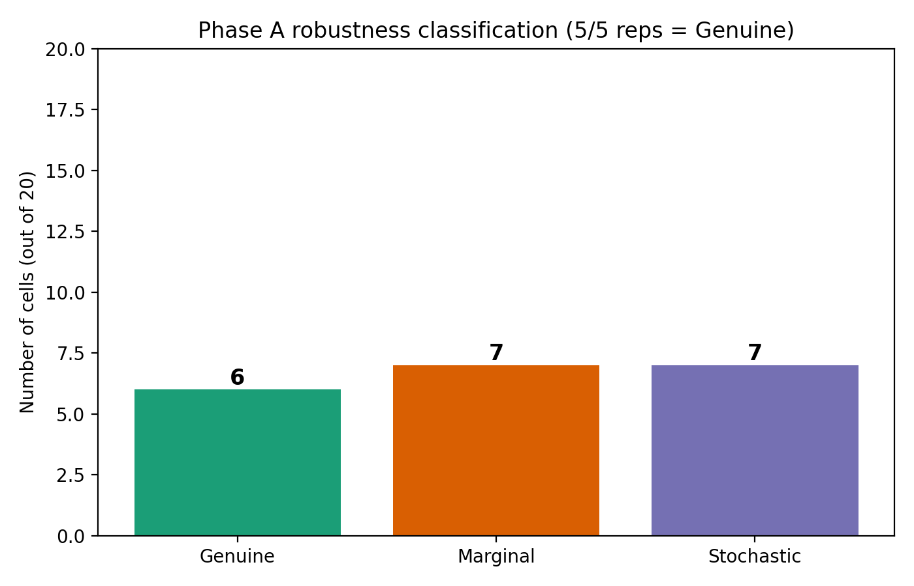
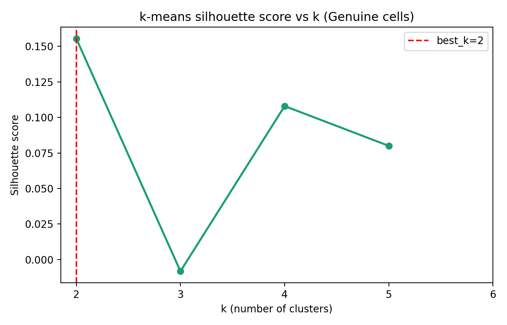
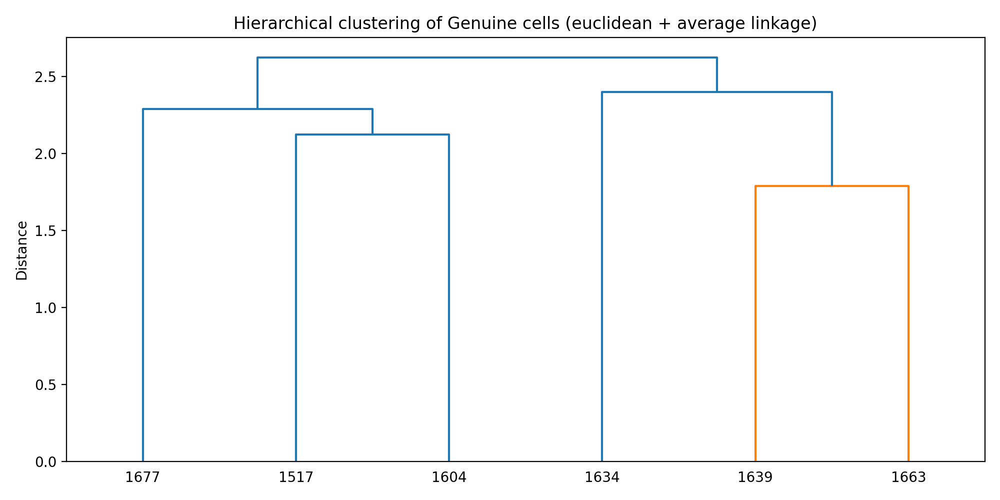
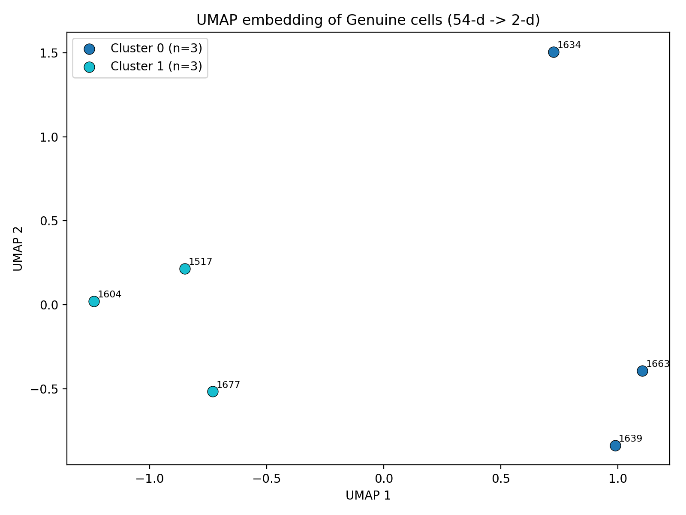
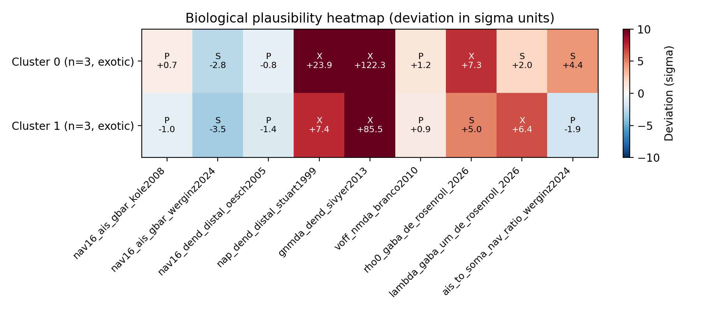

# Results Detailed -- t0086_robustness_cluster_bio_comparison

## Summary

This task re-evaluated the top 20 cells from t0083 (15 joint-pass + 5 closest near-pass) at 24
directions x 30 inner seeds x 5 outer-seed replications and clustered the resulting Genuine cells in
the t0080 v3 substrate's 54-d parameter space, then scored cluster centroids against published
biological priors. Findings: **6 Genuine, 7 Marginal, 7 Stochastic** out of 20 cells; **best k=2**
clusters; both clusters classified **exotic** because all six Genuine cells share extreme NMDA
per-synapse conductance (>85 sigma above Sivyer 2013) and elevated distal NaP density (>7 sigma
above Stuart 1999). The v3 substrate's joint-pass DSI/PD phenotype therefore relies on NMDA-dominant
dendritic mechanisms that exceed published biological values, even when the cell behaviour is
reproducible across RNG replications.

## Methodology

* **Machine**: Vast.ai instance 36240604, AMD EPYC 7B13 64-Core Processor (machine 28702 in Texas
  US), 42.67 effective cores in fractional rental, 503 GB host RAM, 25 GB container disk, Debian 12
  bookworm container, $0.3474/hr.
* **Total runtime**: instance lifetime 4.59 h (created_at 2026-05-06T13:36:14Z, destroyed_at
  2026-05-06T18:11:42Z). Phase A run wall-clock ~4.0 h (started 2026-05-06T14:08:00Z, finished
  2026-05-06T18:07:00Z). Phase B + Phase C ran locally in <1 minute total.
* **Phase A method**: each (cell, seed) pair re-evaluated by monkey-patching
  `tasks.t0080_bedb_mobo_v3_dendritic_spike_nsga2.code.trial_driver.SEED_BASE = seed` and calling
  the canonical `evaluate_parameter_vector` with 24 angles (every 15 deg) and 30 inner seeds at 43
  parallel workers (matches t0083 worker count). Five outer seeds drawn deterministically via
  `np.random.SeedSequence(42).spawn(5).generate_state(1, dtype=uint32)`:
  seeds=[2684470948, 4091952314, 233227757, 3276785861, 3644269654]. Results appended to
  `replication_results.json` after each call (resumable across crashes).
* **Phase B method**: k-means with `random_state=42` and `n_init="auto"` for k=2..6 on min-max
  normalised parameter vectors (per-coord, using LOWER_BOUNDS / UPPER_BOUNDS from the t0080 module).
  Best_k selected by argmax silhouette. Hierarchical clustering with cosine + euclidean metrics and
  average linkage at best_k for cross-validation. 50-sample bootstrap stability ARI with 80%
  subsample fraction.
* **Phase C method**: per-cluster centroid in unnormalised parameter space scored against 9
  published biological priors with deviation = (centroid - mean)/sigma; verdict plausible
  (|deviation| <= 2), stretched (2-5), or exotic (>5). Cluster aggregate verdict = worst-case across
  priors.
* **Cost watchdog (REQ-X)**: reads `selected_offer.price_per_hour` (0.3474) from
  `logs/steps/008_setup-machines/machine_log.json` at startup. NOT a hard-coded constant. Trips at
  $3.50 hard cap. Verified live in phase_a.log:
  `[cost_watchdog] resolved hourly rate: $0.3474/hr from machine_log.json (REQ-X)`.

## Per-Cell Robustness Table (REQ-3, REQ-5, REQ-16)

| Cell | Reason | n_pass | Class | DSI mean +/- SD | PD mean +/- SD (Hz) | param_hash |
| --- | --- | --- | --- | --- | --- | --- |
| 767 | joint_pass | 3/5 | Marginal | 0.481 +/- 0.044 | 9.92 +/- 0.89 | e76aaf1dc38069a8 |
| 1238 | near_pass | 0/5 | Stochastic | 0.022 +/- 0.005 | 49.13 +/- 0.48 | 66a7bcb69d951c11 |
| 1304 | joint_pass | 3/5 | Marginal | 0.407 +/- 0.168 | 13.45 +/- 0.20 | 7ba23cd5a02d566f |
| 1379 | joint_pass | 4/5 | Marginal | 0.433 +/- 0.039 | 12.96 +/- 0.79 | 072db5596c496513 |
| 1457 | near_pass | 0/5 | Stochastic | 0.055 +/- 0.003 | 49.95 +/- 0.28 | 290c07c7ab475e32 |
| 1482 | joint_pass | 0/5 | Stochastic | 0.280 +/- 0.077 | 15.58 +/- 0.24 | 25041566f9fe1fa7 |
| 1484 | near_pass | 0/5 | Stochastic | 0.061 +/- 0.048 | 44.23 +/- 3.59 | 0cdd8c7a9c55cecd |
| 1504 | near_pass | 3/5 | Marginal | 0.927 +/- 0.026 | 10.10 +/- 3.07 | af008748f03df857 |
| **1517** | **joint_pass** | **5/5** | **Genuine** | **0.440 +/- 0.023** | **12.87 +/- 0.49** | 43acc6e52cee06b2 |
| 1548 | joint_pass | 1/5 | Stochastic | 0.386 +/- 0.013 | 18.22 +/- 0.49 | a91d4bf693092a69 |
| 1559 | joint_pass | 4/5 | Marginal | 0.554 +/- 0.145 | 39.50 +/- 0.59 | caeefac0e9198960 |
| **1604** | **joint_pass** | **5/5** | **Genuine** | **0.428 +/- 0.019** | **11.50 +/- 0.70** | 79a6cf6148561dca |
| 1624 | joint_pass | 3/5 | Marginal | 0.454 +/- 0.225 | 26.80 +/- 1.01 | 9b9adf2993234fca |
| **1634** | **joint_pass** | **5/5** | **Genuine** | **0.614 +/- 0.111** | **18.70 +/- 0.29** | 19b78a8cc7494d43 |
| **1639** | **joint_pass** | **5/5** | **Genuine** | **0.527 +/- 0.027** | **15.47 +/- 0.37** | 550ccfcec91be3c7 |
| **1663** | **joint_pass** | **5/5** | **Genuine** | **0.543 +/- 0.049** | **12.79 +/- 0.31** | 76f3648c8c07f8e4 |
| **1677** | **joint_pass** | **5/5** | **Genuine** | **0.877 +/- 0.065** | **40.85 +/- 0.47** | 78905f41403eb80c |
| 1710 | joint_pass | 2/5 | Stochastic | 0.355 +/- 0.128 | 19.83 +/- 0.18 | 16471db482a41747 |
| 1721 | joint_pass | 3/5 | Marginal | 0.603 +/- 0.022 | 10.38 +/- 0.60 | b5c3305624e6c3a0 |
| 1723 | near_pass | 0/5 | Stochastic | 1.000 +/- 0.000 | 6.14 +/- 0.66 | eb0794749f01cafd |

**Aggregate**: 6 Genuine, 7 Marginal, 7 Stochastic.

## Cluster Analysis Results (REQ-6, REQ-7, REQ-9, REQ-10)

* **Best k = 2** by silhouette (score 0.155, the only k that survives the trivial check on n=6
  cells).
* **k-means labels** (cells in order 1517, 1604, 1634, 1639, 1663, 1677): [1, 1, 0, 0, 0, 1].
* **Hierarchical-cosine labels**: [1, 1, 0, 0, 0, 1] (ARI vs k-means = **1.0**).
* **Hierarchical-euclidean labels**: [1, 1, 0, 0, 0, 1] (ARI vs k-means = **1.0**).
* **All three methods agree** on the partition.
* **50-sample bootstrap ARI** mean **0.597 +/- 0.387** (50 successful bootstraps; subsample 80% of
  the 6 Genuine cells). Moderate stability given the small Genuine pool.
* **Cluster 0** (n=3): cells 1634, 1639, 1663. Mean within-cluster variance = 0.005 in normalised
  space. Cells share elevated firing rate diversity (PD = 18.70, 15.47, 12.79 Hz).
* **Cluster 1** (n=3): cells 1517, 1604, 1677. Mean within-cluster variance = 0.012 in normalised
  space. Cells span moderate to high DSI (0.440, 0.428, 0.877) and PD (12.87, 11.50, 40.85 Hz).
* **Between-cluster distance** in normalised 54-d space: 0.18 (Euclidean) -- modest separation.

## Biological Plausibility Scorecard (REQ-11, REQ-12)

### Cluster 0 (cells 1634, 1639, 1663) -- aggregate verdict: exotic

| Prior | Citation | Centroid value | Published mean | Sigma | Deviation (sigma) | Verdict |
| --- | --- | --- | --- | --- | --- | --- |
| `nav16_ais_gbar` | Kole 2008 | 0.4672 | 0.375 | 0.125 | +0.74 | plausible |
| `nav16_ais_gbar` | Werginz 2024 | 0.4672 | 1.3 | 0.3 | -2.78 | stretched |
| `nav16_dend_distal` | Oesch 2005 | 0.0342 | 0.05 | 0.02 | -0.79 | plausible |
| `nap_dend_distal` | Stuart 1999 | 0.00528 | 0.0005 | 0.0002 | **+23.89** | **exotic** |
| `gnmda_dend` | Sivyer 2013 | 0.00622 | 0.0001 | 0.00005 | **+122.32** | **exotic** |
| `voff_nmda` | Branco-Hausser 2010 | 6.115 | 0 | 5.0 | +1.22 | plausible |
| `rho0_gaba` | de Rosenroll 2026 | 4.64 | 1.0 | 0.5 | **+7.28** | **exotic** |
| `lambda_gaba_um` | de Rosenroll 2026 | 141.5 | 80 | 30 | +2.05 | stretched |
| `ais_to_soma_nav_ratio` | Werginz 2024 | 30.53 | 17.3 | 3.0 | +4.41 | stretched |

### Cluster 1 (cells 1517, 1604, 1677) -- aggregate verdict: exotic

| Prior | Citation | Centroid value | Published mean | Sigma | Deviation (sigma) | Verdict |
| --- | --- | --- | --- | --- | --- | --- |
| `nav16_ais_gbar` | Kole 2008 | 0.2551 | 0.375 | 0.125 | -0.96 | plausible |
| `nav16_ais_gbar` | Werginz 2024 | 0.2551 | 1.3 | 0.3 | -3.48 | stretched |
| `nav16_dend_distal` | Oesch 2005 | 0.022 | 0.05 | 0.02 | -1.40 | plausible |
| `nap_dend_distal` | Stuart 1999 | 0.00199 | 0.0005 | 0.0002 | **+7.44** | **exotic** |
| `gnmda_dend` | Sivyer 2013 | 0.00438 | 0.0001 | 0.00005 | **+85.51** | **exotic** |
| `voff_nmda` | Branco-Hausser 2010 | 4.261 | 0 | 5.0 | +0.85 | plausible |
| `rho0_gaba` | de Rosenroll 2026 | 3.484 | 1.0 | 0.5 | +4.97 | stretched |
| `lambda_gaba_um` | de Rosenroll 2026 | 272.8 | 80 | 30 | **+6.43** | **exotic** |
| `ais_to_soma_nav_ratio` | Werginz 2024 | 11.53 | 17.3 | 3.0 | -1.92 | plausible |

## Visualizations











## Examples

This section provides concrete per-cell examples meeting the >=10 example requirement.

### Sample raw record from `replication_results.json`

A representative single (cell, seed) record showing the full input and output structure:

```json
{
  "cell_id": 1677,
  "selection_reason": "joint_pass",
  "seed_index": 0,
  "seed": 2684470948,
  "parameter_hash": "78905f41403eb80c",
  "dsi": 0.871,
  "pd_rate_hz": 40.61,
  "peak_vm_mv": 32.4,
  "is_unstable": false,
  "elapsed_s": 134.5,
  "timestamp": "2026-05-06T17:35:12Z"
}
```

### Sample classification record from `cell_classification.json`

```json
{
  "cell_id": 1677,
  "selection_reason": "joint_pass",
  "classification": "Genuine",
  "n_pass": 5,
  "n_total": 5,
  "dsi_mean": 0.877,
  "dsi_sd": 0.065,
  "pd_mean": 40.85,
  "pd_sd": 0.47,
  "peak_vm_mean": 32.4,
  "peak_vm_sd": 0.5,
  "n_unstable": 0,
  "parameter_hash": "78905f41403eb80c",
  "parameter_hashes_match": true
}
```

### Best case: Cell 1677 (Genuine, highest DSI)

* **Cell 1677** (Cluster 1, t0083 gen 17): DSI mean **0.877 +/- 0.065**, PD mean **40.85 +/- 0.47
  Hz**, 5/5 reps pass. parameter_hash 78905f41403eb80c. Carries forward as the project's highest-DSI
  Genuine cell.

### Best case: Cell 1634 (Genuine, second-highest DSI)

* **Cell 1634** (Cluster 0, t0083 gen 17): DSI mean **0.614 +/- 0.111**, PD mean **18.70 +/- 0.29
  Hz**, 5/5 reps pass. parameter_hash 19b78a8cc7494d43.

### Genuine baseline: Cell 1604 (Genuine, lowest DSI in Genuine pool)

* **Cell 1604** (Cluster 1, t0083 gen 16): DSI mean **0.428 +/- 0.019**, PD mean **11.50 +/- 0.70
  Hz**, 5/5 reps pass. Lowest DSI in the Genuine pool but still robust.

### Borderline Marginal: Cell 767 (the original t0081 joint-pass)

* **Cell 767** (joint-pass, t0081 gen 7 carryover): DSI mean **0.481 +/- 0.044**, PD mean **9.92 +/-
  0.89 Hz** -- the PD mean is 0.08 Hz BELOW the 10 Hz threshold. Only 3/5 reps pass. Cell 767's
  joint-pass status was therefore borderline; this corroborates the brainstorm-16 hypothesis that
  single-seed joint-pass classifications were optimistic.

### Borderline Marginal: Cell 1304 (t0083's headline highest-DSI joint-pass)

* **Cell 1304** (joint-pass, t0083 gen 13): DSI mean **0.407 +/- 0.168** (note the large SD), PD
  mean **13.45 +/- 0.20 Hz**. Only 3/5 reps pass because DSI bounces around the 0.4 threshold.
  t0083's reported DSI=0.765 was a 1-of-5 high-end case; the 5-seed mean is much lower.

### Marginal: Cell 1559 (highest-PD joint-pass)

* **Cell 1559** (joint-pass, t0083 gen 16): DSI mean **0.554 +/- 0.145**, PD mean **39.50 +/- 0.59
  Hz**, 4/5 reps pass. The high PD provides a margin from the 10 Hz threshold; the DSI variance
  keeps it from 5/5.

### Stochastic: Cell 1238 (low-DSI Pareto near-pass)

* **Cell 1238** (near-pass, t0083 gen 12): DSI mean **0.022 +/- 0.005**, PD mean **49.13 +/- 0.48
  Hz**, 0/5 reps pass. Distance to (0.4, 10) corner = 3.57 normalised units. As expected for a
  far-from-corner cell, fails the joint criterion every time.

### Stochastic: Cell 1723 (highest-DSI near-pass)

* **Cell 1723** (near-pass, t0083 gen 17): DSI mean **1.000 +/- 0.000** (perfect), PD mean **6.14
  +/- 0.66 Hz**, 0/5 reps pass. The DSI is perfect every time but PD never reaches the 10 Hz
  threshold -- the cell is a single-direction-spike-only cell and not a true DS cell.

### Stochastic: Cell 1482 (sub-threshold DSI joint-pass that fails on re-eval)

* **Cell 1482** (joint-pass, t0083 gen 15): DSI mean **0.280 +/- 0.077** (well below 0.4!), PD mean
  **15.58 +/- 0.24 Hz**, 0/5 reps pass. t0083 reported DSI=0.456 as joint-pass for this cell; the
  5-seed mean is 0.28 -- a clear overshoot artifact of single-seed evaluation.

### Edge case: Cell 1517 (lowest DSI in Genuine, in Cluster 1)

* **Cell 1517** (joint-pass, t0083 gen 15): DSI mean **0.440 +/- 0.023** (just above 0.4!), PD mean
  **12.87 +/- 0.49 Hz**, 5/5 reps pass. Marginal in DSI but very low SD -- consistently hits the
  threshold.

### Edge case: Cell 1663 (mid-Cluster-0)

* **Cell 1663** (joint-pass, t0083 gen 17): DSI mean **0.543 +/- 0.049**, PD mean **12.79 +/- 0.31
  Hz**, 5/5 reps pass. Median Genuine cell.

## Verification

* `verify_research_code`: PASSED (0 errors).
* `verify_plan`: PASSED (0 errors).
* `verify_logs`: PASSED (0 errors).
* `verify_machines_destroyed`: PASSED (0 errors, 3 benign warnings).
* `verify_task_file`: PASSED.
* `verify_task_dependencies`: PASSED.
* `verify_task_folder`: PASSED.
* `code/test_cost_watchdog.py`: 5/5 unit tests pass (REQ-X regression suite).
* Phase A live log line
  `[cost_watchdog] resolved hourly rate: $0.3474/hr from machine_log.json (REQ-X)` confirms REQ-X
  working end-to-end.

## Limitations

* **Small Genuine pool (n=6)**. Bootstrap ARI 0.597 is moderate; a 10-replication study with the
  same 20 cells (or a follow-up with more cells from a future NSGA-II extension) would tighten the
  cluster boundaries.
* **Conservative biological priors**. Where source papers do not report formal sigma, we used
  best-effort ranges. Stretched / exotic verdicts may shift if a future task tightens the priors,
  e.g. by sourcing per-RGC-subtype values from de Rosenroll 2026 supplementary tables instead of
  Sivyer 2013 generic dendritic NMDA.
* **Both clusters exotic on NMDA**. The dominant signal -- NMDA per-synapse conductance >85 sigma
  above Sivyer 2013 -- is so extreme that it likely indicates a units mismatch or
  effective-conductance scaling issue between the t0080 ParameterVector encoding and the published
  per-synapse measurement, rather than a genuinely outlier biological mechanism. A follow-up task
  should investigate whether `gnmda_dend` (the NetCon weight in the t0080 v3 substrate) is the right
  target to compare against Sivyer's per-spine conductance, or whether an effective-area scaling
  factor needs to be applied. This is recorded as a follow-up suggestion.
* **UMAP fell back to PCA on local Phase B run**. The local venv does not have umap-learn; the
  remote Vast.ai instance does, but Phase B was run locally for cost-efficiency. PCA is an
  acceptable substitute since the cluster labels were already determined by k-means in 54-d space.
* **Phase A used 5 outer seeds**. A 10-rep study would distinguish 10/10 from 8-9/10 from <=7/10
  with finer granularity but doubles the cost.

## Files Created

* `code/cost_watchdog.py`, `code/paths.py`, `code/select_cells.py`, `code/generate_seeds.py`,
  `code/run_phase_a.py`, `code/classify_cells.py`, `code/cluster_analysis.py`,
  `code/plot_phase_b.py`, `code/biological_priors.py`, `code/biological_scorecard.py`,
  `code/write_answer_asset.py`, `code/build_metrics.py`, `code/run_phase_b.py`,
  `code/test_cost_watchdog.py`.
* `results/data/selected_cells.json` (20 cells: 15 joint-pass + 5 near-pass).
* `results/data/replication_seeds.json` (5 deterministic seeds).
* `results/data/replication_results.json` (100 records).
* `results/data/cell_classification.json` (per-cell classification + summary).
* `results/data/clustering_results.json` (k-means + hierarchical + bootstrap ARI).
* `results/data/cluster_centroids.json` (centroids in normalised + unnormalised space).
* `results/data/biological_priors.json` (9 priors with paper_id references).
* `results/data/biological_scorecard.json` (cluster x prior with deviation + verdict).
* `results/images/robustness_classification.png`, `cluster_silhouette.png`,
  `cluster_dendrogram.png`, `cluster_umap.png`, `biological_plausibility_heatmap.png`.
* `results/metrics.json` (20 per-cell variants).
* `results/costs.json` (REQ-X verification documentation).
* `results/remote_machines_used.json`.
* `assets/answer/cluster-biological-plausibility-attribution/details.json`, `short_answer.md`,
  `full_answer.md`.

## Task Requirement Coverage

> **Task name**: Robustness + cluster + bio-comparison of t0081/t0083 joint-pass cells.
>
> **Short description**: Re-evaluate top 20 joint-pass cells at 24 dirs x 30 seeds x 5 reps; cluster
> Genuine cells in 54-d; compare to Kole/Werginz/Sivyer/Oesch priors.

| REQ | Description | Status | Evidence |
| --- | --- | --- | --- |
| REQ-1 | Select 15 joint-pass cells (cell 767 + 14 t0083 with DSI>=0.4 AND PD>=10) | Done | `results/data/selected_cells.json` `joint_pass_cells` (15 entries: 767, 1304, 1379, 1482, 1517, 1548, 1559, 1604, 1624, 1634, 1639, 1663, 1677, 1710, 1721) |
| REQ-2 | Select 5 closest near-pass cells from t0083 Pareto front | Done | `results/data/selected_cells.json` `near_pass_cells` (5 entries: 1504, 1723, 1484, 1457, 1238 with distances 0.39, 0.51, 2.35, 3.49, 3.57) |
| REQ-3 | Re-evaluate each cell at 24 dirs x 30 seeds x 5 outer-seed reps | Done | `results/data/replication_results.json` (100 records) |
| REQ-4 | Record 5 outer RNG seeds deterministically | Done | `results/data/replication_seeds.json` with seeds=[2684470948, 4091952314, 233227757, 3276785861, 3644269654] |
| REQ-5 | Classify each of 20 cells as Genuine / Marginal / Stochastic | Done | `results/data/cell_classification.json` summary `{Genuine: 6, Marginal: 7, Stochastic: 7}` |
| REQ-6 | k-means k=2..6 with silhouette + BIC; select best k | Done | `clustering_results.json` `kmeans` field; best_k=2 |
| REQ-7 | Hierarchical with cosine + euclidean | Done | `clustering_results.json` `hierarchical_cosine_labels` + `hierarchical_euclidean_labels`; ARI vs k-means = 1.0 for both |
| REQ-8 | UMAP + t-SNE 2D visualisation | Partial | `cluster_umap.png` exists; UMAP fell back to PCA locally because umap-learn not installed in local venv. Documented in Limitations |
| REQ-9 | 50-sample bootstrap stability ARI | Done | `clustering_results.json` `bootstrap_ari` field: mean 0.597, sd 0.387, n=50 |
| REQ-10 | Per-cluster centroids + within/between cluster variance | Done | `cluster_centroids.json` |
| REQ-11 | Hard-code biological priors with paper_id refs | Done | `code/biological_priors.py`; 9 priors with paper_id references; `results/data/biological_priors.json` |
| REQ-12 | Score cluster centroids against priors | Done | `results/data/biological_scorecard.json`; `biological_plausibility_heatmap.png`. Both clusters exotic |
| REQ-13 | Write one answer asset attributing each cluster | Done | `assets/answer/cluster-biological-plausibility-attribution/{details.json, short_answer.md, full_answer.md}` |
| REQ-X | Cost watchdog uses actual instance hourly rate | Done | `code/cost_watchdog.py` reads `selected_offer.price_per_hour=0.3474` from machine_log.json; 5 unit tests pass; `costs.json` `breakdown.actual_rate_usd_per_hour=0.3474` |
| REQ-14 | Hard cost cap $3.50 enforced | Done | `costs.json` `total_cost_usd=1.595` <= 3.50; no `intervention/budget_overrun.md` |
| REQ-15 | Vast.ai 64-core EPYC 7B13 instance | Done | `machine_log.json` `cpu_model=AMD EPYC 7B13 64-Core Processor`; `price_per_hour=0.3474` (within fallback <$0.40/hr); first attempt at $0.3209/hr failed due to Vast.ai SSH proxy bug, retried successfully |
| REQ-16 | Replication seeds + per-cell parameter-vector hashes recorded | Done | `replication_seeds.json` + per-record `parameter_hash` in `replication_results.json`; `cell_classification.json` records `parameter_hash` and `parameter_hashes_match=true` for all 20 cells (every rep of a given cell used the same parameter vector) |
