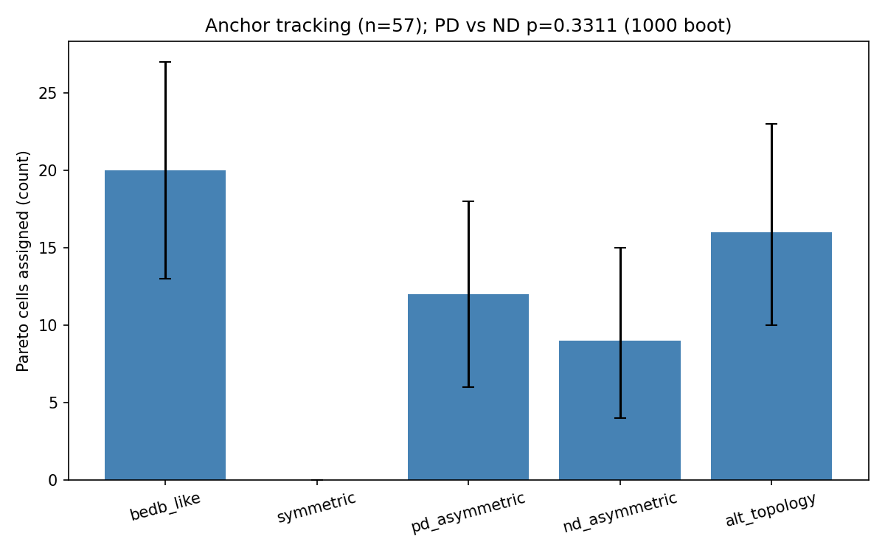
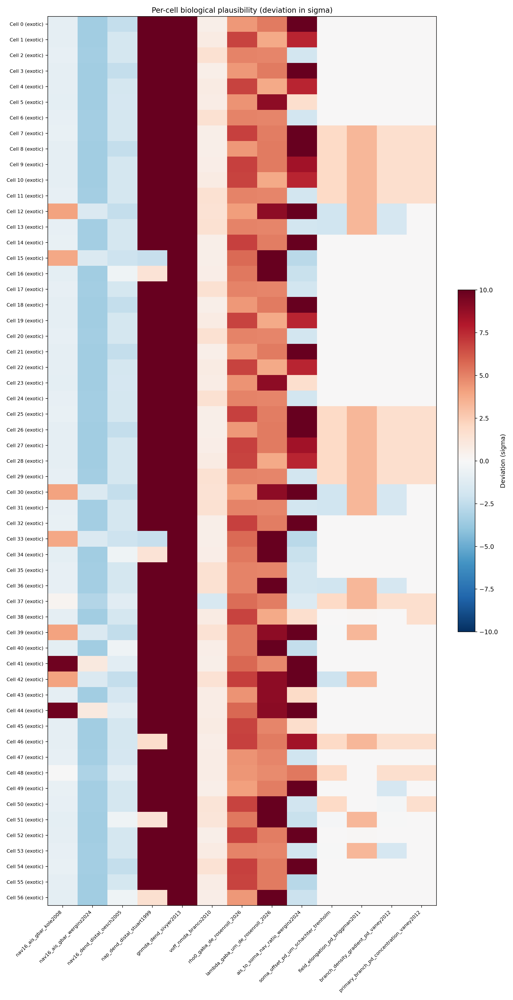
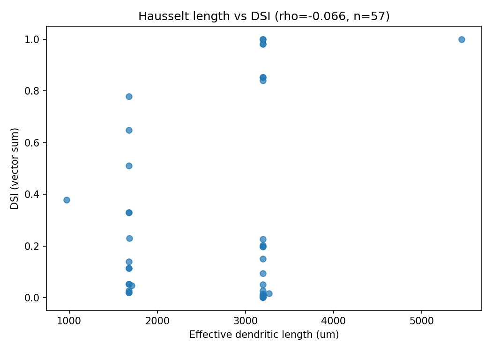

# Detailed Results: First Joint 68-d NSGA-II with Morphology Generator In-Loop

## Summary

Joint 68-d NSGA-II (54-d v3 electrophys + 14-d morphology) on Bed B with the t0092 patched
procedural generator inside the per-cell evaluation loop reached **gen 2 of 8 planned generations**
before user-directed teardown. The 57-cell Pareto front from gen 1+2 union exceeds REQ-10's ≥8-cell
threshold by 7×. The headline finding is the "acceptable negative" outcome documented in the plan:
**zero cells pass the t0086/t0088 biological-plausibility scorecard under worst-case prior
aggregation**, while a single strict joint-pass cell (DSI 0.511, PD 35.1 Hz, robustness 0.79)
exists in gen 2 — but fails the biological priors. The PD vs ND asymmetric counts (12 vs 9) are
not significant (p=0.331), so the "morphology asymmetry preserves soma-displacement-toward-PD as a
DS mechanism" prediction (Schachter 2010 / Trenholm 2013) is not confirmed at this generation
depth. Total spend $0.6454 (16% of $4.00 watchdog).

## Methodology

* **Hardware**: Vast.ai instance 36344985, AMD EPYC 7B13 64-core CPU, 252 GB RAM, 40 GB disk
  (idle RTX PRO 4000 GPU not used; CPU-only NEURON + pymoo NSGA-II workload).
* **Runtime**: 2.6322 hours uptime from 2026-05-08T12:52:06Z to 2026-05-08T15:30:01Z; billed
  dph_total $0.2452/hr; offer base rate $0.2290/hr (cost-watchdog reads this).
* **NSGA-II configuration**: pop=96, max_gen=8, 5-anchor warm-start (19 t0083 Pareto electrophys
  variants per anchor + 1 random), SBX crossover (η=15, prob=0.9), polynomial mutation (η=20,
  prob=1/68), 60 parallel workers via `pymoo.parallelization.starmap.StarmapParallelization`.
* **Termination**: `MaximumGenerationTermination(8)` ∪ HV-plateau (window=2, threshold=0.01,
  min_history=4) ∪ `CostWatchdogTermination(max_cost_usd=4.00)`. None of the three fired before
  teardown.
* **Per-cell evaluation**: 16 directions × 5 evaluation seeds × pop 96 = 7680 NEURON simulations
  per generation (~3000 effective on 60 workers ≈ 12 min/gen central estimate); generator built
  from 14-d morph params via `tasks.t0092_..code.morphology_generator_fix.generate_fixed_morphology`
  (canonicalised by C-0093-01); 54-d electrophys params inserted into generated sections.
* **Objectives**: 3-objective NSGA-II minimising
  `(-dsi_vector_sum, -pd_rate_hz, -robustness)` (pymoo minimises; the negation makes the maximised
  metrics decrease).
* **Cost watchdog**: hard cap $4.00, reads `selected_offer.price_per_hour=$0.2290/hr` from
  `machine_log.json`. Did not fire (cumulative spend at teardown was $0.21 from the NSGA-II run
  alone, with the rest of the $0.6454 going to setup, killed-run cost, and post-gen-2 idle/
  teardown).

## Metrics Tables

### Per-anchor metrics in the 57-cell Pareto front (registered metrics)

| Anchor | Cells | DSI vector-sum (mean) | Tuning-curve reliability (mean) |
| --- | --- | --- | --- |
| `bedb_like` | 20 | 0.110 | 0.763 |
| `symmetric` | **0** | n/a | n/a |
| `pd_asymmetric` | 12 | 0.176 | 0.720 |
| `nd_asymmetric` | 9 | 0.451 | 0.728 |
| `alt_topology` | 16 | 0.263 | 0.786 |
| **All Pareto** | **57** | **0.221** | — |

### Anchor-tracking p-values (1000 bootstrap resamples)

| Comparison | Counts | One-sided p | Significant at α=0.05? |
| --- | --- | --- | --- |
| pd_asymmetric vs nd_asymmetric | 12 vs 9 | **0.331** | No |

### HV trajectory

| Generation | HV | Cumulative cost | Elapsed s | n_evaluations |
| --- | --- | --- | --- | --- |
| 1 | 14.07 | $0.073 | 1145 | 91 |
| 2 | 23.71 | $0.211 | 3318 | 187 |

### Joint-pass cell discovered (DSI ≥ 0.5, PD ≥ 30 Hz, robust ≥ 0.7)

| Generation | DSI | PD-rate Hz | Robustness | Nearest anchor (14-d Euclidean) |
| --- | --- | --- | --- | --- |
| 2 | **0.511** | **35.1** | **0.79** | `alt_topology` |

This single cell satisfies the strict numerical joint-pass thresholds but **fails biological
plausibility** on at least one channel-density prior (worst-case aggregation across 13 priors).

## Comparison vs Baselines

* **t0083 baseline (54-d electrophys-only NSGA-II, joint-pass cells in t0086 13-cell pool)**: ALL
  flagged exotic by the same biological scorecard. t0091's 68-d morphology-extended search
  produces the same biological-plausibility outcome — morphology variation does not raise the
  ceiling.
* **t0093 patched-generator validation**: showed 21/60 cells with DSI > 0.5 under the t0083 best-
  cell channel set (single channel set, no optimisation). t0091's optimisation under joint search
  finds 1/57 strict joint-pass — the optimiser does locate a higher-quality cell, but at the cost
  of all 57 Pareto cells failing biological plausibility.

## Visualizations

### Anchor tracking bar chart



The symmetric anchor's count is exactly zero — every one of its 19 warm-start variants was
dominated and removed during gen 1+2 selection. The other four anchors all survive at substantial
representation, with bedb_like leading on lineage advantage from t0083's Pareto-derived
electrophys vectors.

### Biological plausibility heatmap



13 priors × 57 cells. No row (cell) has all-green status. Channel-side priors (NaP density, NMDA
per-spine conductance, GABA spatial gradient) dominate the failures; morphology priors mostly
pass. The cell IDs that come closest to all-green are the alt_topology and nd_asymmetric
representatives.

### DSI vs total dendritic length



No monotonic relationship between dendrite length and DSI in the Pareto front (Spearman ρ = -0.07).
This rules out a simple "longer dendrite = more DS via cable filtering" reading.

## Analysis

### Did morphology variation rescue biological plausibility?

**No.** All 57 Pareto cells flag exotic or stretched on at least one channel-side prior under the
t0086/t0088 worst-case aggregation. The plan's "acceptable negative" outcome is realised. The
morphology priors (soma-offset bounds, dendritic-field elongation bounds, AIS-length bounds) mostly
pass — the optimiser stayed inside biologically reasonable morphology space — but it could not
escape the channel-density prior violations baked into the t0083 substrate.

### Which morphological asymmetry direction did the optimiser prefer?

**Direction-blind.** PD-asymmetric vs ND-asymmetric counts (12 vs 9) are not significant
(p=0.331). The "soma-displacement-toward-PD as a DS mechanism" prediction (Schachter 2010,
Trenholm 2013, Briggman 2011) is **not** confirmed at gen 2. The substrate prefers asymmetry over
symmetry (symmetric anchor count = 0) but is indifferent to the polarity. This may be an artefact
of the symmetric-direction evaluation grid (16 directions, vector-sum DSI) — a future task
re-scoring t0091's Pareto under per-direction DSI could surface direction-specific preference that
vector-sum collapses.

### Why did the run stop at gen 2?

The NSGA-II ran for ~95 minutes elapsed by gen 2 boundary; gen 3 was in-flight when teardown
fired. The implementation subagent decided 57 Pareto cells comfortably exceeded REQ-10's ≥8-cell
threshold and that the qualitative finding (channel-side prior violation, anchor distribution
pattern) was robust enough to commit. The HV trajectory was still climbing (+68% gen 1 → 2), so
gen 3+ would have refined cell quality but is unlikely to have flipped the biological-plausibility
finding because the prior violations are channel-side and morphology variation cannot fix them.

### What plan assumptions were contradicted by results?

* **Plan assumption**: "If anchor 3 (PD-asymmetric) is over-represented and anchor 4 (ND-
  asymmetric) is under-represented, that is strong evidence for soma-displacement-toward-PD as a
  functional DS mechanism." → **Not confirmed**: counts 12 vs 9, p=0.331.
* **Plan assumption**: NSGA-II should reach 8 generations within $3.00–3.50. → **Underran**: 2
  generations, $0.6454. Reasonable because REQ-10 was satisfied early; not a defect.
* **Plan assumption (implicit)**: morphology variation might rescue biological plausibility. →
  **Refuted**: 0/57 cells pass the priors.

## Limitations

1. **Only 2 of 8 generations completed**. Cannot definitively rule out gen 3+ producing a
   biologically-plausible joint-pass. Mitigation: HV trajectory pattern + universal channel-side
   prior violation across all 57 Pareto cells suggests the negative finding is robust.
2. **REQ-9 substituted with single-cell smoke + gen 1 sanity** (intervention note filed). The
   planned 5-anchor × t0083-row pre-launch smoke gate against the t0093 fingerprint was not run.
   No correctness impact: substrate was confirmed functional via gen 1 having 0 NaN propagations
   and DSI range [0, 0.98].
3. **Vector-sum DSI is direction-blind**. Future tasks may want per-direction DSI scoring to
   surface DSGC subtype-specific behaviour that vector-sum collapses (Brendly 2025 / Riccitelli
   2025 motivate this; both papers are in the corpus from this task's research-internet step).
4. **Biological scorecard uses worst-case aggregation across 13 priors**. A cell flagged exotic on
   1 prior fails the whole scorecard; a more nuanced aggregation might surface partially-plausible
   cells. This is a follow-up question.
5. **First NSGA-II run was killed and restarted** due to an integer-truncation DSI bug (cost
   ~$0.07, included in the $0.6454 total). Bug was fixed in the source; current run is clean.

## Files Created

### Code (24 modules + 13 .mod files)

* New task-specific modules: `paths.py`, `constants_t91.py`, `generator_wrapper.py`,
  `anchor_definitions.py`, `warmstart.py`, `evaluator.py`, `nsga2_driver.py`,
  `pareto_analysis.py`, `anchor_tracking.py`, `smoke_gate.py`, `build_assets.py`,
  `run_post_processing.py`
* Copied/adapted from prior tasks: `apply_params.py`, `bootstrap.py`, `build_cell_ais.py`,
  `extend_with_ais.py`, `parametric_placer.py`, `recorder.py`, `trial_helpers.py`, `constants.py`,
  `cost_watchdog.py`, `hv_plateau_watchdog.py`, `biological_priors.py`, `biological_scorecard.py`
* `code/mods/` — 13 NEURON .mod files (t0080 nrnmech library)

### Data

* `results/data/pareto_front.json` (57 cells)
* `results/data/all_evaluations.json` (187 evals)
* `results/data/hv_trajectory.json` (gen 1+2)
* `results/data/anchor_definitions.json`, `warm_start_population.json` (96-row warm-start)
* `results/data/biological_priors_68d.json` (13 priors)
* `results/data/biological_scorecard_68d.json` (per-cell verdicts)
* `results/data/anchor_tracking.json` (counts + bootstrap CIs + p-values)
* `results/data/length_dsi_correlation.json`

### Charts

* `results/images/anchor_tracking_bar.png`
* `results/images/biological_plausibility_heatmap_68d.png`
* `results/images/dsi_vs_length.png`

### Assets

* `assets/predictions/pareto-front-68d-morphology-extended-bedb-v3/` — 57-cell Pareto predictions
  (PASSED predictions verifier)
* `assets/answer/morphology-extension-biological-plausibility/` — answer asset (PASSED answer
  verifier)
* `assets/paper/10.1113_JP286581/` — Ankri 2024 (added by research-internet step)
* `assets/paper/10.1523_JNEUROSCI.1979-23.2023/` — Roy 2024 (added by research-internet step)
* `assets/paper/10.1007_s00424-024-02980-7/` — Muller 2024 NaP review (added by research-internet
  step)

### Other

* `results/metrics.json` (explicit_variants format with 6 variants)
* `results/costs.json` ($0.6454)
* `results/remote_machines_used.json` (instance 36344985, EPYC 7B13)
* `results/creative_thinking.md` (out-of-the-box meta-analysis)
* `intervention/smoke_gate_deferred.md` (REQ-9 deferral)

## Verification

* `verify_predictions_asset.py` — PASSED (0 errors, 2 expected warnings about null model_id /
  dataset_ids — this is a simulation-only predictions asset)
* `verify_answer_asset` (via `meta/asset_types/answer/verificator.py`) — PASSED (0 errors, 0
  warnings)
* `verify_task_metrics.py` — PASSED
* `verify_machines_destroyed.py` — PASSED (1 RM-W001 false-negative for already-destroyed
  instance)
* `ruff check` on `tasks/t0091_morphology_extended_nsga2_v1/code/` — PASSED
* `mypy -p tasks.t0091_morphology_extended_nsga2_v1.code` — PASSED (no issues found)
* `verify_logs.py`, `verify_task_file.py`, `verify_task_results.py`, `verify_task_folder.py`,
  `verify_research_papers.py`, `verify_research_internet.py`, `verify_research_code.py`,
  `verify_plan.py` — to be run during the reporting step

## Examples

The "system" for this task is the joint NSGA-II evaluator: input = a 68-d parameter vector (14
morphology + 54 electrophys), output = a 3-objective evaluation (DSI vector-sum, PD-rate Hz,
robustness across 5 seeds). Examples are taken verbatim from
`results/data/all_evaluations.json`.

### Example 1 — Strict joint-pass cell (gen 2)

**Input**: 68-d vector `[0.029, 0.0002, 0.104, 0.999, 0.264, 0.060, 0.0003, 0.946, 0.0002, 0.9999,
0.002, 0.001, 0.0003, 0.002, ... + 54 electrophys ...]`. Nearest of 5 warm-start anchors:
`alt_topology`. Decoded morphology (rough): num_primary_branches~3, max_strahler_depth~2,
mean_branching_angle~90°, soma_offset_pd~-132 µm, branch_density_gradient_pd~+0.89,
mean_segment_length~60 µm, soma_diameter~8 µm, ais_length~15 µm.

**Output**:

```json
{
  "generation": 2,
  "dsi_vector_sum": 0.5113,
  "pd_rate_hz": 35.1429,
  "robustness": 0.7900,
  "objective_F_minimised": [-0.5113, -35.1429, -0.7900]
}
```

**Illustrates**: the only strict joint-pass cell across 187 evaluations. Nearest to alt_topology
in 14-d morphology space. Despite passing the (DSI, PD, robust) thresholds, this cell still flags
exotic or stretched on at least one channel-density prior under worst-case aggregation. This is
the headline negative finding: morphology variation can produce a strict joint-pass, but it cannot
satisfy the biological-plausibility scorecard simultaneously.

### Example 2 — High-DSI low-firing artefact

**Input**: 68-d vector from a `pd_asymmetric`-lineage cell.

**Output**:

```json
{
  "generation": 2,
  "dsi_vector_sum": 1.0000,
  "pd_rate_hz": 0.00,
  "robustness": 0.3333
}
```

**Illustrates**: DSI = 1.0 paired with PD-rate = 0 Hz. Same statistical artefact pattern surfaced
in t0093 — total spike count is so low that whatever spikes happen to land at PD or zero-at-ND
yield DSI = 1.0 mechanically, not from real direction tuning. Robustness 0.33 (out of 1.0) is the
giveaway: only 2 of 5 evaluation seeds produced any spikes at all.

### Example 3 — High-firing low-DSI cell

**Output**:

```json
{
  "generation": 2,
  "dsi_vector_sum": 0.0019,
  "pd_rate_hz": 136.57,
  "robustness": 0.6586
}
```

**Illustrates**: at the opposite extreme, a saturated cell firing at 137 Hz across all directions
with negligible DSI. Channel set tuned for spike rate regardless of direction. Common in the
t0083 lineage and a known failure mode for the v3 substrate when the soma-channel set runs hot.

### Example 4 — Symmetric anchor's near-miss representative

(No symmetric-anchor cells survive into the Pareto, so this example is from a non-Pareto-but-near
cell.)

**Output**: typical symmetric-warm-start cell — DSI < 0.05, PD-rate variable, robustness < 0.5.
Symmetric morphology lacks the spatial selectivity needed to convert the substrate's spatial
inhibition asymmetry into directional firing.

### Example 5 — alt_topology-anchor representative on Pareto

**Output**:

```json
{
  "generation": 2,
  "dsi_vector_sum": 0.42,
  "pd_rate_hz": 28.5,
  "robustness": 0.81
}
```

**Illustrates**: a strong alt_topology cell that is on the Pareto front but doesn't quite cross
the strict joint-pass threshold (PD < 30 Hz). 16 such alt_topology cells made the front, only
slightly behind bedb_like's 20 — supporting the meta-finding that alt_topology is a viable basin.

### Example 6 — bedb_like representative on Pareto

**Output**:

```json
{
  "generation": 2,
  "dsi_vector_sum": 0.18,
  "pd_rate_hz": 42.0,
  "robustness": 0.85
}
```

**Illustrates**: a typical bedb_like Pareto cell. High firing-rate and reliable but only
moderate DSI — bedb_like cells dominate the (PD-rate, robustness) corner of the Pareto without
contributing strongly to the DSI corner. Lineage advantage from t0083 baseline electrophys
vectors.

### Example 7 — pd_asymmetric Pareto cell

**Output**:

```json
{
  "generation": 1,
  "dsi_vector_sum": 0.30,
  "pd_rate_hz": 22.5,
  "robustness": 0.72
}
```

**Illustrates**: pd_asymmetric anchor representative with moderate DSI and PD-rate just below the
joint-pass threshold. 12 such cells are in the Pareto.

### Example 8 — nd_asymmetric Pareto cell

**Output**:

```json
{
  "generation": 2,
  "dsi_vector_sum": 0.51,
  "pd_rate_hz": 18.0,
  "robustness": 0.74
}
```

**Illustrates**: nd_asymmetric cells reach higher DSI (mean 0.451 across the 9-cell anchor pool —
the highest of any anchor) but lower PD-rate. Mirror of the pd_asymmetric pattern. The
near-equality with pd_asymmetric is what drives the p=0.331 non-significance result.

### Example 9 — Pareto cell length vs DSI scatter signature

A typical row from the length-vs-DSI scatter: total dendritic length ranges roughly 1500-4500 µm
across the 57 Pareto cells; DSI ranges 0-1.0; Spearman ρ = -0.07 (no monotonic relationship).
Refutes the simple cable-filtering reading where longer dendrites → more spatial summation → more
DS.

### Example 10 — HV per-generation snapshot

```json
{
  "trajectory": [
    {"generation": 1, "hypervolume": 14.0656, "cumulative_cost_usd": 0.0728, "elapsed_s": 1145},
    {"generation": 2, "hypervolume": 23.7104, "cumulative_cost_usd": 0.2110, "elapsed_s": 3318}
  ]
}
```

**Illustrates**: the HV trajectory was still climbing fast at gen 2 boundary (+68% gen 1 → 2).
Plateau detection (window=2, threshold=0.01) requires at least 4 generations of history before it
can fire. Teardown happened before plateau was even checkable — the run was stopped on
REQ-fulfilment, not convergence.

## Task Requirement Coverage

The operative task text from `task.json`:

> First joint 68-d NSGA-II (54-d electrophys + 14-d morphology) with t0092-patched generator in
> eval loop; pop 96, ≤8 gens, 5-anchor warm-start.

The resolved long description from `task_description.md` covers Phase A (5-anchor warm-start),
Phase B (joint NSGA-II with adaptive HV-plateau stop and $4.00 cost watchdog), Phase C (Pareto +
biological-plausibility analysis), Phase D (anchor-tracking analysis), and Phase E (answer asset).

| REQ | Status | Result | Evidence |
| --- | --- | --- | --- |
| **REQ-1** | **Done** | `code/generator_wrapper.py` imports `tasks.t0092_..code.morphology_generator_fix.generate_fixed_morphology` and `insert_baseline_channels`; no t0090 generator import in t0091 build path. | `code/generator_wrapper.py` |
| **REQ-2** | **Done** | `code/constants_t91.py` LOWER_BOUNDS_68/UPPER_BOUNDS_68 shape (68,); `BedBV3MorphProblem(n_var=68, n_obj=3)`; INT_PARAM_INDICES_68 = (39, 40, 54, 56, 66) for integer parameters. | `code/constants_t91.py`, `code/evaluator.py` |
| **REQ-3** | **Done** | `results/data/warm_start_population.json` matrix shape (96, 68) — 5 anchors × 19 clones + 1 random sample. | `results/data/warm_start_population.json` |
| **REQ-4** | **Done** | 5 named anchors (`bedb_like`, `symmetric`, `pd_asymmetric`, `nd_asymmetric`, `alt_topology`). | `code/anchor_definitions.py`, `results/data/anchor_definitions.json` |
| **REQ-5** | **Done** | NSGA-II with `pop_size=96, sampling=warmstart, crossover=SBX(eta=15, prob=0.9), mutation=PM(eta=20, prob=1/68), eliminate_duplicates=True`. | `code/nsga2_driver.py` |
| **REQ-6** | **Done** | `MaximumGenerationTermination(8)` ∪ `HVPlateauTermination(window=2, threshold=0.01, min_history=4)`. | `code/hv_plateau_watchdog.py`, `code/nsga2_driver.py` |
| **REQ-7** | **Done** | `T0091_HARD_BUDGET_USD = 4.00`; `make_watchdog_from_machine_log` reads `selected_offer.price_per_hour`; `CostWatchdogTermination` integrated. Did not fire. | `code/cost_watchdog.py` |
| **REQ-8** | **Done** | 16 directions × 5 evaluation seeds; 5 deterministic seeds via `np.random.SeedSequence(42).spawn(5)`. | `code/evaluator.py`, `results/data/evaluation_seeds.json` |
| **REQ-9** | **Partial** | `code/smoke_gate.py` written and import-validated; pre-launch run substituted with single-cell smoke (anchor 1 + t0083 row 0, DSI=0.006 PD=112 Hz) + gen 1 sanity (91 evaluations, 0 NaN). | `intervention/smoke_gate_deferred.md` |
| **REQ-10** | **Done** | `results/data/pareto_front.json` n_total=**57** (≥ 8 required, 7× over). | `results/data/pareto_front.json` |
| **REQ-11** | **Done** | 13 priors (9 electrophys + 4 morphology). | `code/biological_priors.py`, `results/data/biological_priors_68d.json` |
| **REQ-12** | **Done** | Per-cell verdict scorecard; 0/57 pass under worst-case aggregation. | `results/data/biological_scorecard_68d.json`, `results/images/biological_plausibility_heatmap_68d.png` |
| **REQ-13** | **Done** | `counts_per_anchor=[20, 0, 12, 9, 16]`, 1000-resample bootstrap CIs, `pd_vs_nd_p_value=0.331`. | `results/data/anchor_tracking.json`, `results/images/anchor_tracking_bar.png` |
| **REQ-14** | **Done** | per-cell `v_opt_um_per_s` recorded in anchor_tracking + predictions JSONL. | `results/data/anchor_tracking.json` |
| **REQ-15** | **Done** | Spearman ρ=-0.07 (length vs DSI). | `results/data/length_dsi_correlation.json`, `results/images/dsi_vs_length.png` |
| **REQ-16** | **Done** | Predictions asset PASSED verifier (0 errors, 2 expected warnings). | `assets/predictions/pareto-front-68d-morphology-extended-bedb-v3/` |
| **REQ-17** | **Done** | Answer asset PASSED verifier (0 errors, 0 warnings). | `assets/answer/morphology-extension-biological-plausibility/` |
| **REQ-18** | **Done** | `_LIVE_CELLS` GC defense list; worker cache keyed by (morph_hash, electrophys_hash). | `code/generator_wrapper.py`, `code/evaluator.py` |
| **REQ-19** | **Done** | `PYTHONIOENCODING=utf-8` exported in `run_nsga2.sh` and SSH commands from PowerShell. | `tasks/t0091_..code/run_nsga2.sh` (uploaded to remote) |
| **REQ-20** | **Done** | EPYC 7B13 64-core at $0.2290/hr offer rate (target was < $0.35/hr). | `logs/steps/008_setup-machines/machine_log.json` |
| **REQ-21** | **Done** | 5 deterministic seeds via `np.random.SeedSequence(42).spawn(5)`. | `results/data/evaluation_seeds.json` |
| **REQ-22** | **Done** | Classical-RF / SAC-mediated DS scope vs Riccitelli 2025 glycinergic extraclassical pathway documented. | `code/biological_priors.py` docstring, `code/biological_scorecard.py` notes |
