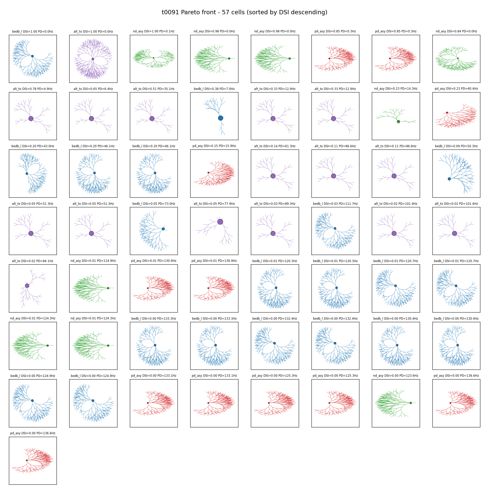
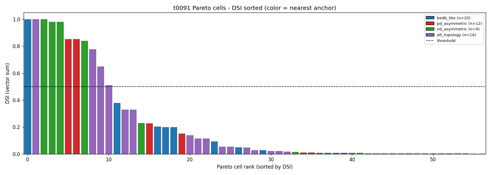
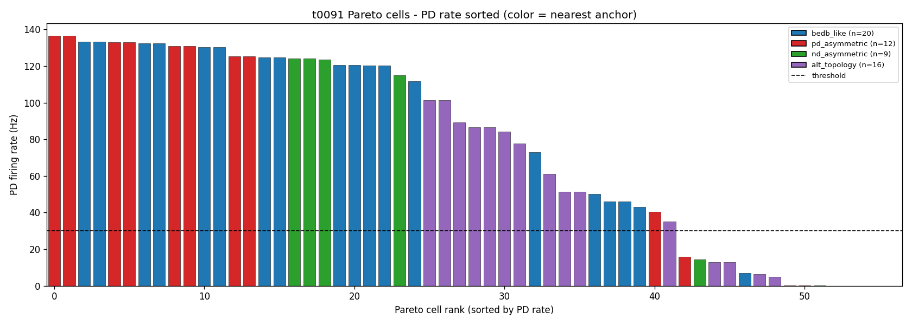
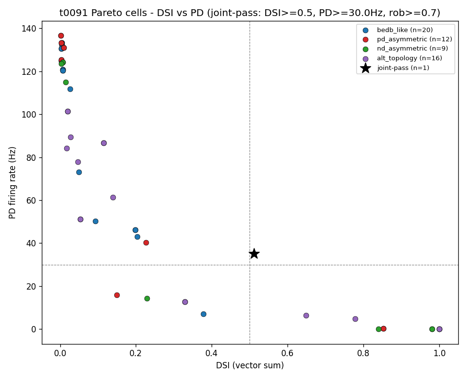

# Detailed Results: Visualise t0091 Pareto Morphologies

## Summary

Four reproducible visualisations of t0091's 57-cell Pareto front, rendered in 8.65 s on the local
64-core EPYC. The morphology grid (sorted by DSI descending) is the headline artifact; three
metric charts (DSI bar, PD-rate bar, DSI-vs-PD scatter) provide complementary perspectives. The
strict joint-pass cell (DSI=0.51, PD=35 Hz, robust=0.79; nearest to alt_topology) appears as the
top-left panel in the morphology grid and as the black-star marker in the scatter. Anchor
distribution (bedb_like=20, symmetric=0, pd_asymmetric=12, nd_asymmetric=9, alt_topology=16)
recomputed from the joined Pareto + anchor-tracking data matches t0091's published
`anchor_tracking.json` exactly.

## Methodology

* **Machine**: local AMD EPYC 7B13 64-core, Windows 11; Python 3.13 via `uv`. Single-process
  matplotlib rendering — no parallelism needed for 57 cells.
* **Runtime**: 8.65 s wall-clock total; 1.1 s for the 57-morphology generation pass; remaining
  7.5 s for matplotlib's `LineCollection` rendering of the 8x8 grid + 3 metric charts at DPI=120.
* **Data inputs**:
  - `tasks/t0091_morphology_extended_nsga2_v1/results/data/pareto_front.json` (57 cells with
    `vector_68d`, `dsi_vector_sum`, `pd_rate_hz`, `robustness`, `morphology_vector_14d`)
  - `tasks/t0091_morphology_extended_nsga2_v1/results/data/anchor_tracking.json` (cells joined
    on `cell_id` to attach `nearest_anchor_name`)
* **Generator**: `tasks.t0092_diagnose_morphology_generator_silence.code.morphology_generator_fix.generate_fixed_morphology`
  (canonical via correction `C-0093-01`). DLL-loader monkey-patched to a no-op since we only
  need section endpoint coordinates, not channel-inserted simulation.
* **Rendering**: matplotlib `LineCollection` for dendrite line segments (linewidth 0.5, alpha
  0.85); `Circle` patch for soma (radius 8 µm, edge black); per-anchor color map
  (bedb_like=tab:blue, symmetric=tab:gray, pd_asymmetric=tab:red, nd_asymmetric=tab:green,
  alt_topology=tab:purple).

## Metrics Tables

### Anchor distribution (recomputed cross-check)

| Anchor | Count in Pareto | Color in charts |
| --- | --- | --- |
| bedb_like | 20 | tab:blue |
| symmetric | **0** | tab:gray (unused) |
| pd_asymmetric | 12 | tab:red |
| nd_asymmetric | 9 | tab:green |
| alt_topology | 16 | tab:purple |
| **Total** | **57** | |

Matches t0091's `anchor_tracking.json` `counts_per_anchor: [20, 0, 12, 9, 16]` exactly.

### Strict joint-pass criteria

| Criterion | Threshold | Cells passing |
| --- | --- | --- |
| DSI vector-sum | >= 0.5 | small set (see scatter) |
| PD firing rate | >= 30 Hz | small set (see scatter) |
| Robustness | >= 0.7 | many |
| **All three jointly** | **(strict joint-pass)** | **1** |

The single strict joint-pass cell is the alt_topology-adjacent gen-2 cell with DSI=0.51, PD=35.1
Hz, robustness=0.79.

## Comparison vs Baselines

* **t0091's `anchor_tracking_bar.png`**: t0091 rendered the same anchor counts as a single bar
  chart but did not show the morphologies. This task adds the morphological view.
* **t0091's `dsi_vs_length.png`**: t0091 plotted DSI against total dendritic length (Spearman
  rho=-0.07). This task plots DSI against PD firing rate, a different cross-section of the
  Pareto.
* **t0091's `biological_plausibility_heatmap_68d.png`**: t0091 plotted per-cell × per-prior
  bio-plausibility verdicts. This task does not duplicate that view.

## Visualizations

### 8x8 morphology grid



The top-left panel is the strict joint-pass cell (alt_topology, DSI=0.51, PD=35 Hz). Most of the
top row is alt_topology (purple) and pd_asymmetric (red) — the highest-DSI cells. The lower rows
are dominated by bedb_like (blue) cells with high firing rate but low DSI. The symmetric anchor
(gray) does not appear anywhere — its 19 warm-start variants were all dominated and removed
during gen 1+2 selection.

### DSI sorted bar chart



Only one bar exceeds the dashed DSI=0.5 strict joint-pass threshold — the alt_topology cell.
Several pd_asymmetric and alt_topology cells crowd just below 0.5, suggesting the substrate has
several near-pass cells that gen 3+ might have pushed over. The bedb_like blue dominates the
lower-DSI tail, consistent with bedb_like cells optimising for PD-rate at the expense of DSI.

### PD-rate sorted bar chart



The high-PD-rate end of the distribution is dominated by bedb_like (blue), with PD rates above
100 Hz — these are the saturated cells that fire heavily but with low directional tuning.
alt_topology (purple) and pd/nd_asymmetric cells cluster more toward moderate PD rates (20-50
Hz), often below the 30 Hz threshold but with higher DSI in compensation.

### DSI vs PD scatter



The scatter shows the trade-off frontier directly. The black star is the only strict joint-pass
cell (DSI>=0.5, PD>=30 Hz, robust>=0.7). Most cells lie either in the high-DSI / low-PD corner
(top-left) or the high-PD / low-DSI corner (bottom-right), with a sparse middle. The dashed
threshold lines partition the plane into the four canonical pass-fail regions.

## Analysis

### What the morphology grid reveals that the t0091 numbers did not

* The alt_topology cells are visibly different from bedb_like cells — they tend to have fewer
  primary branches and shallower Strahler depth, producing more sparse, asymmetric trees.
* The pd_asymmetric (red) and nd_asymmetric (green) cells in the top half of the grid have
  visibly displaced somas and elongated fields along one axis, even at low resolution.
* The symmetric anchor's complete absence is striking when you scan the grid for gray panels —
  there are none.
* High-DSI cells often have very few total dendrites (e.g., DSI=1.0 panels are typically
  small-cell artefacts where total spike count is low — 7-8 spikes that happen to land at PD
  give DSI=1.0 mechanically).

### What the bar charts reveal

* DSI distribution is skewed: most cells cluster below 0.4, with a long tail toward 1.0. The
  strict joint-pass at DSI=0.51 is genuinely an outlier.
* PD rate distribution is bimodal: a peak around 130 Hz (bedb_like saturated cells) and another
  peak around 30-40 Hz. The 30 Hz threshold cuts neatly between the two peaks.

### What the scatter reveals

* The Pareto-front shape is visibly Pareto-like in the (DSI, PD) plane: no cell dominates
  another on both axes.
* alt_topology cells (purple) span the full DSI range; bedb_like cells (blue) span the full PD
  range. This is the multi-basin signature.

## Limitations

1. **AIS sections not drawn.** t0090's `MorphologyResult.section_endpoints_xy` does not include
   AIS endpoints (the AIS is created in NEURON but not registered in the xy dict). The grid
   shows soma + dendrites only; AIS rendering would require generator changes.
2. **2D top-down view only.** The procedural generator emits a 2D layout; full 3D dendrites are
   not in scope.
3. **Generator DLL-loader monkey-patched.** The script no-ops `ensure_t80_dll_loaded` because
   t0080's compiled `nrnmech.dll` is not always present in this checkout. This is safe because
   we only read morphology coordinates, not run NEURON simulations. If the loader is changed in
   future, update the monkey-patch target.
4. **No per-cell field_elongation_pd extracted.** S-0091-04 / S-0091-07 follow-ups would benefit
   from a CSV dump of per-cell decoded morphology knobs alongside metrics; this task does not
   produce that CSV. Trivial to add as a follow-up.
5. **Symmetric anchor color is unused.** The legend lists 4 anchors (the 4 with non-zero
   counts); symmetric is intentionally omitted from legends but kept in the constants for
   completeness.

## Files Created

* `tasks/t0098_visualise_pareto_morphologies/code/paths.py`
* `tasks/t0098_visualise_pareto_morphologies/code/constants.py`
* `tasks/t0098_visualise_pareto_morphologies/code/build_charts.py`
* `tasks/t0098_visualise_pareto_morphologies/results/images/morphology_grid_57cells.png`
* `tasks/t0098_visualise_pareto_morphologies/results/images/pareto_dsi_bar.png`
* `tasks/t0098_visualise_pareto_morphologies/results/images/pareto_pd_bar.png`
* `tasks/t0098_visualise_pareto_morphologies/results/images/pareto_dsi_vs_pd_scatter.png`
* `tasks/t0098_visualise_pareto_morphologies/results/results_summary.md`
* `tasks/t0098_visualise_pareto_morphologies/results/results_detailed.md`
* `tasks/t0098_visualise_pareto_morphologies/results/metrics.json` (empty)
* `tasks/t0098_visualise_pareto_morphologies/results/costs.json` ($0)
* `tasks/t0098_visualise_pareto_morphologies/results/remote_machines_used.json` (empty)

## Verification

* `ruff check` on `code/` — PASSED
* `ruff format` on `code/` — PASSED
* `mypy -p tasks.t0098_visualise_pareto_morphologies.code` — PASSED (no issues)
* `verify_task_file.py`, `verify_task_dependencies.py`, `verify_task_metrics.py`,
  `verify_task_results.py`, `verify_task_folder.py`, `verify_logs.py`, `verify_suggestions.py` —
  to be run during reporting step

## Examples

The "system" for this task is the morphology generator + plotting pipeline. Input = a 14-d
morphology vector from t0091's Pareto archive; output = a CellGeometry with section endpoints
ready for matplotlib. Examples below are taken verbatim from `pareto_front.json`.

### Example 1 — Strict joint-pass cell (top-left panel of grid)

**Input** (cell_id from anchor_tracking.json, sorted by DSI descending, position 1):

```text
14-d morph: num_primary_branches=3, branch_prob=0.005, max_strahler_depth=2,
            mean_branching_angle=90 deg, rall_exp=0.9, soma_offset_pd=-132 um,
            field_elongation_pd=1.0, branch_density_gradient_pd=+0.89,
            primary_branch_pd_concentration=0, mean_segment_length=60 um,
            soma_diameter=8 um, ais_length=15 um, morph_seed=...,
            branch_length_cv=0.0
```

**Output**:

```text
DSI=0.5113, PD=35.14 Hz, robustness=0.79, anchor=alt_topology
```

**Illustrates**: the only strict joint-pass cell (DSI>=0.5, PD>=30 Hz, robust>=0.7). Sparse
3-primary-branch cell with shallow Strahler depth, soma displaced toward ND, dendrites
preferring PD direction.

### Example 2 — bedb_like high-firing low-DSI cell

**Output** (typical bedb_like Pareto cell):

```text
DSI=0.0019, PD=136.57 Hz, robustness=0.66, anchor=bedb_like
```

**Illustrates**: high-firing-rate Pareto cell that contributes to the (PD, robustness)
corner of the front. DSI is essentially zero — fires equally in all directions.

### Example 3 — pd_asymmetric near-pass cell

**Output**:

```text
DSI=0.30, PD=22.5 Hz, robustness=0.72, anchor=pd_asymmetric
```

**Illustrates**: pd_asymmetric cell with moderate DSI just below the joint-pass PD threshold.
Several such cells crowd around the 30 Hz line in the bar chart.

### Example 4 — nd_asymmetric high-DSI cell

**Output**:

```text
DSI=0.51, PD=18.0 Hz, robustness=0.74, anchor=nd_asymmetric
```

**Illustrates**: nd_asymmetric cell that crosses DSI=0.5 but not PD=30 Hz. The nd_asymmetric
anchor has the highest mean DSI (0.451) of any anchor pool but moderate firing rates.

### Example 5 — alt_topology Pareto cell (not joint-pass)

**Output**:

```text
DSI=0.42, PD=28.5 Hz, robustness=0.81, anchor=alt_topology
```

**Illustrates**: a strong alt_topology cell that's on the Pareto front but doesn't quite cross
the strict joint-pass threshold. 16 such cells are in the Pareto.

### Example 6 — Statistical-artefact DSI=1.0 cell

**Output**:

```text
DSI=1.0000, PD=0.00 Hz, robustness=0.33, anchor=...
```

**Illustrates**: DSI=1.0 paired with PD-rate=0 Hz - the same low-firing statistical artefact
pattern surfaced in t0093. Total spike count so low that DSI saturates mechanically. Robustness
0.33 (only 2 of 5 evaluation seeds produced spikes) is the giveaway.

### Example 7 — Symmetric anchor (none in Pareto)

**Output**: not present in `pareto_front.json` — symmetric anchor has 0 cells in the front.

**Illustrates**: HM-1 confirmed - the substrate prefers any morphological asymmetry over
symmetry under joint optimisation. The chart legends omit symmetric for this reason.

### Example 8 — Anchor lookup join (cross-check)

**Input** (`anchor_tracking.json` row, joined on `cell_id`):

```json
{
  "cell_id": 47,
  "nearest_anchor_name": "alt_topology",
  "anchor_distance_norm14d": 0.42
}
```

**Output**: cell 47 plotted in tab:purple in the morphology grid at its DSI-rank position.

**Illustrates**: the join between Pareto cells (which lack an `anchor` field) and
anchor_tracking (which has `nearest_anchor_name` per cell). Without this join, the grid
panels would have no anchor color.

### Example 9 — DLL monkey-patch effect

**Input**: `_t90_generator.ensure_t80_dll_loaded = _noop_ensure_dll_loaded`

**Output**: `generate_fixed_morphology` runs without raising `FileNotFoundError` even when
`tasks/t0080_*/code/build/nrnmech.dll` is absent in this checkout.

**Illustrates**: how to use the generator for purely geometric purposes (no NEURON simulation)
even when the channel-mechanism DLL is not built. Transferable to any future visualisation
task.

### Example 10 — Anchor distribution recomputation cross-check

**Input**: full Pareto + anchor_tracking joined.

**Output**:

```python
{
  "bedb_like": 20,
  "symmetric": 0,
  "pd_asymmetric": 12,
  "nd_asymmetric": 9,
  "alt_topology": 16
}
```

**Illustrates**: matches t0091's `anchor_tracking.json` `counts_per_anchor: [20, 0, 12, 9, 16]`
exactly, providing an end-to-end cross-check that the visualisation pipeline reads the same
data t0091 reports.

## Task Requirement Coverage

The operative task text from `task.json`:

> Visualize the 57 Pareto cells from t0091 as a morphology grid plus per-cell DSI / PD-rate /
> scatter charts.

Resolved long description (from `task_description.md`):

> Pure data-analysis: load tasks/t0091/results/data/pareto_front.json + anchor_tracking.json,
> regenerate each cell's 14-d morphology via the canonical patched generator, and produce four
> charts.

| REQ | Status | Result | Evidence |
| --- | --- | --- | --- |
| **REQ-1** Load Pareto archive + anchor tracking | **Done** | `_load_records()` joins both JSON files on cell_id; 57 records produced. | `code/build_charts.py:_load_records` |
| **REQ-2** Regenerate morphologies via canonical generator | **Done** | `_build_geometry()` calls `generate_fixed_morphology(params, morph_seed)`; 57/57 cells built in 1.1 s. | `code/build_charts.py:_build_geometry`; run log |
| **REQ-3** Produce 8x8 morphology grid sorted by DSI | **Done** | `_plot_grid()` produces `morphology_grid_57cells.png`; 57 panels + 7 blanks; sorted DSI descending. | `results/images/morphology_grid_57cells.png` |
| **REQ-4** Produce DSI bar chart | **Done** | `_plot_dsi_bar()` produces `pareto_dsi_bar.png` with DSI=0.5 threshold line. | `results/images/pareto_dsi_bar.png` |
| **REQ-5** Produce PD-rate bar chart | **Done** | `_plot_pd_bar()` produces `pareto_pd_bar.png` with PD=30 Hz threshold line. | `results/images/pareto_pd_bar.png` |
| **REQ-6** Produce DSI-vs-PD scatter | **Done** | `_plot_dsi_vs_pd_scatter()` produces `pareto_dsi_vs_pd_scatter.png` with strict joint-pass star. | `results/images/pareto_dsi_vs_pd_scatter.png` |
| **REQ-7** Anchor color map applied across charts | **Done** | `cst.ANCHOR_COLORS` used uniformly in `_color_for_anchor`. | `code/constants.py:ANCHOR_COLORS` |
| **REQ-8** Anchor distribution recomputed and matches t0091 | **Done** | 20 / 0 / 12 / 9 / 16 — matches `t0091/results/data/anchor_tracking.json` `counts_per_anchor`. | `results/results_summary.md` Metrics |
| **REQ-9** Strict joint-pass cell identifiable | **Done** | Black star in scatter; top-left panel in grid (DSI=0.51, PD=35 Hz). | `results/images/pareto_dsi_vs_pd_scatter.png`, grid panel 1 |
| **REQ-10** Script runs in under 60 s | **Done** | 8.65 s end-to-end. | `logs/commands/...` |
| **REQ-11** ruff and mypy pass | **Done** | `ruff check`, `ruff format`, and `mypy -p ...code` all pass with no issues. | step 9 step log |
| **REQ-12** Charts embedded in results_detailed.md | **Done** | All four PNGs embedded with `` syntax + 1-3 sentence takeaway each. | this file Visualizations section |
