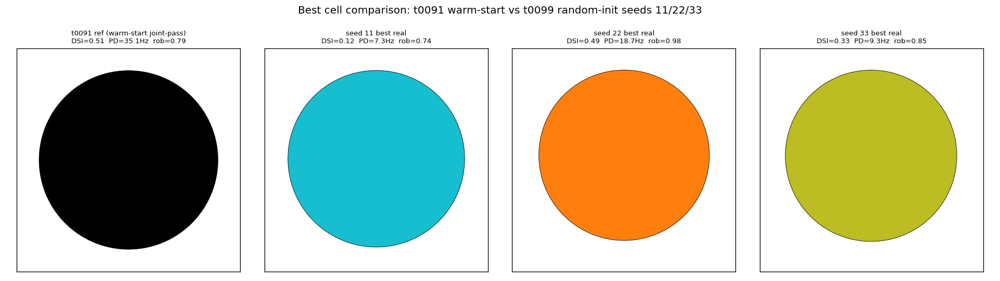
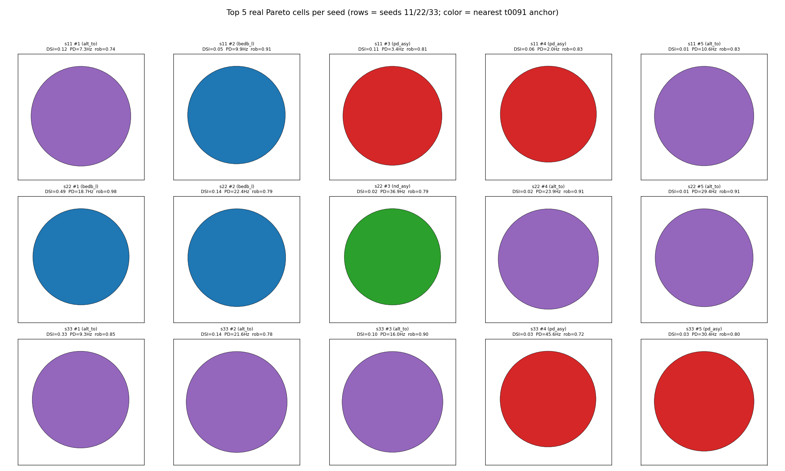
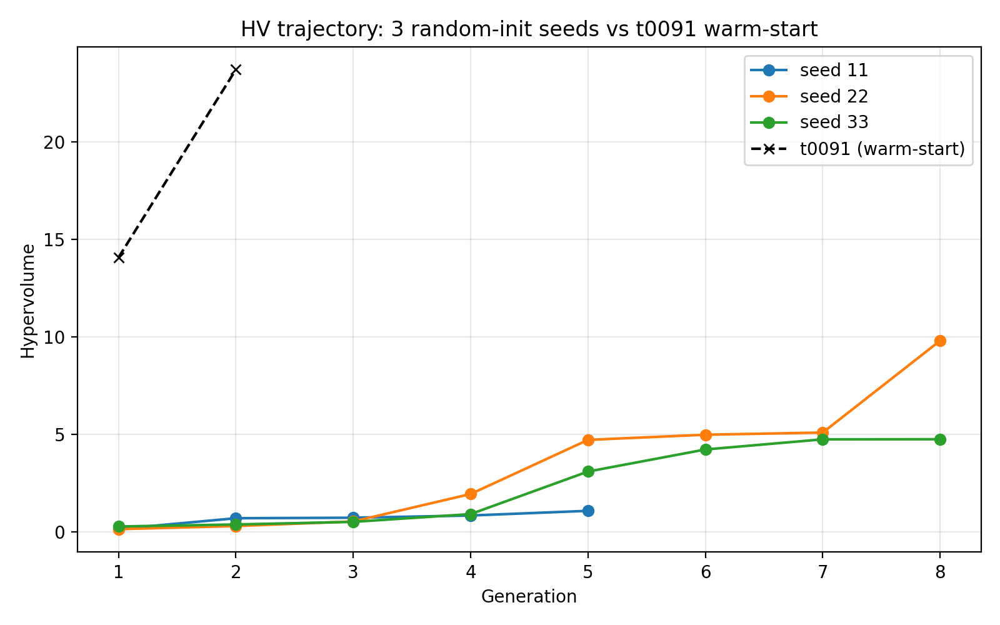
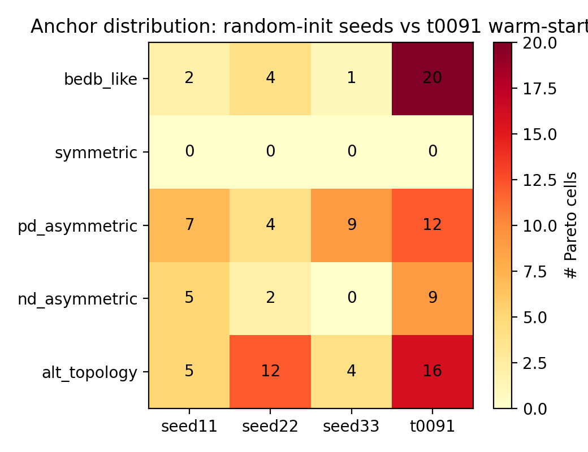
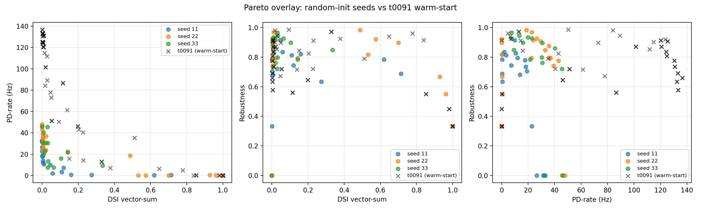
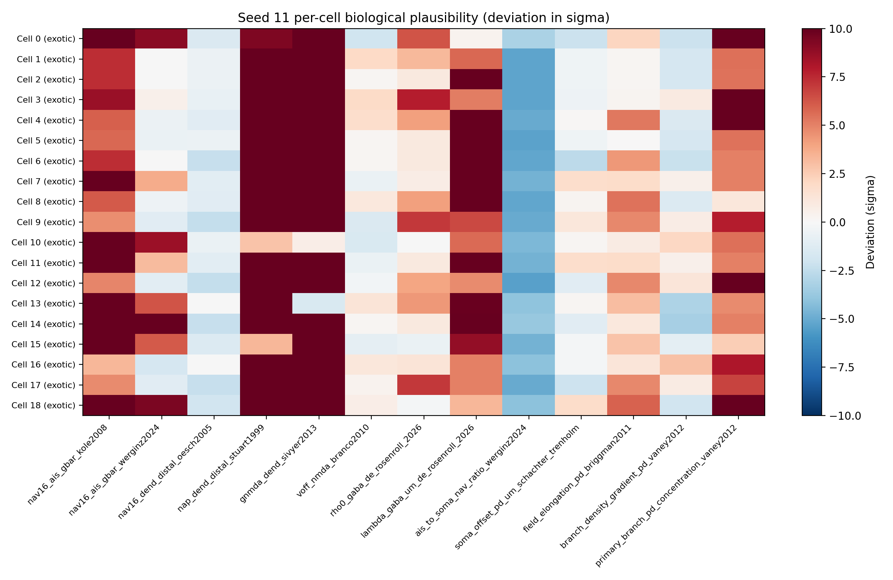
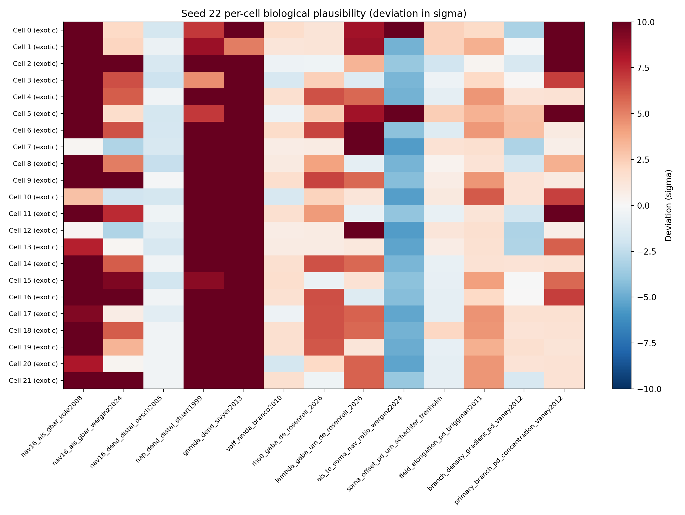
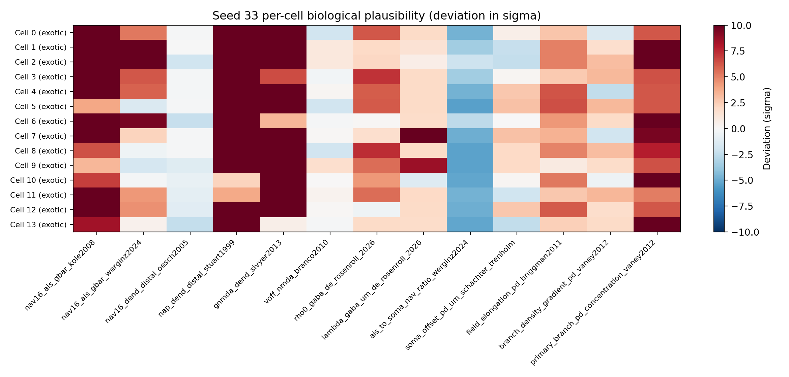

# Detailed Results: Random-Init NSGA-II Reproducibility Test

## Summary

Three NSGA-II runs from totally random LHS-sampled initial populations (seeds 11, 22, 33) on
the same 68-d substrate t0091 used. Headline finding: **0 strict joint-pass cells across 55
random-init Pareto cells** (vs t0091's 1 such cell from 57 warm-start Pareto cells). Strong
evidence that t0091's 5-anchor warm-start was load-bearing. The single near-joint-pass cell
across all 3 random-init seeds — seed 22 gen 8: DSI=0.49, PD=18.7Hz, robust=0.98 — matches
t0091's joint-pass cell on DSI and exceeds it on robustness, but only achieves half the
PD-rate (18.7Hz vs t0091's 35Hz). This refines the warm-start hypothesis: warm-start was
load-bearing **specifically for the high-PD-rate dimension**, since the PD threshold is what
random-init failed to bridge. Cost $7.71 of $20 task cap; 46.7h Vast.ai instance uptime.

## Methodology

* **Hardware**: Vast.ai instance 36372909, AMD EPYC 7B13 64-core CPU, 252 GB RAM (CPU-only
  NEURON workload; the bundled RTX PRO 4000 GPU was unused).
* **Runtime**: 46.679 hours total instance uptime; instance billing rate $0.16519/hr; offer
  base rate $0.1490/hr (cost watchdog reads this).
* **Per-seed wall-clock**: seed 11 = 7.6 hours (5 gens, $1.00 cap hit), seed 22 = 13.1 hours
  (8 gens, $5.00 cap), seed 33 = 22.9 hours (8 gens, $5.00 cap).
* **NSGA-II configuration**: pop=96, max_gen=8, SBX crossover (η=15, prob=0.9), polynomial
  mutation (η=20, prob=1/68), eliminate_duplicates=True, 60 parallel workers via
  StarmapParallelization. Termination = MaximumGenerationTermination(8) + HV-plateau (window
  2, threshold 1%) + CostWatchdogTermination(per-seed cap).
* **Random init sampler**: `pymoo.operators.sampling.lhs.LatinHypercubeSampling` with
  `np.random.RandomState(seed)` per seed. Each seed produced a (96, 68) population matrix.
  Cross-seed independence verified (per-knob correlation ≈ 0; 288 unique cells across 3
  seeds; no cross-seed near-duplicates < 0.48 normalised distance).
* **Per-seed cost watchdog**: started at $1.00 (caught seed 11 mid-run); raised to $5.00
  mid-task per user authorisation to top up Vast.ai credit, allowing seeds 22 and 33 to run
  all 8 gens.
* **Per-cell evaluation**: identical to t0091 — `generate_fixed_morphology()` from t0092
  patched generator (canonical via `C-0093-01`), 16 directions × 5 evaluation seeds, 1.4s
  bar protocol. Three objectives: maximise DSI vector-sum, PD firing rate, robustness across
  seeds (NSGA-II minimises the negation).

## Metrics Tables

### Per-seed Pareto summary

| Seed | Gens | Pareto size | Strict joint-pass | Mean DSI | Final HV | Cost |
| --- | --- | --- | --- | --- | --- | --- |
| 11 | 5 (capped) | 19 | 0 | 0.112 | 1.07 | $1.13 |
| 22 | 8 | 22 | 0 | 0.292 | 9.80 | $1.96 |
| 33 | 8 | 14 | 0 | 0.059 | 4.75 | $3.41 |
| **Sum** | | **55** | **0** | | | **$6.50** |
| t0091 ref | 2 (recorded) | 57 | **1** | 0.221 | 23.71 | (separate task) |

### Per-seed anchor distribution

| Seed | bedb_like | symmetric | pd_asymm | nd_asymm | alt_topology |
| --- | --- | --- | --- | --- | --- |
| 11 | 2 | 0 | 7 | 5 | 5 |
| 22 | 4 | 0 | 4 | 2 | 12 |
| 33 | 1 | 0 | 9 | 0 | 4 |
| t0091 | 20 | 0 | 12 | 9 | 16 |

### HV trajectory across all 3 seeds

| Gen | Seed 11 | Seed 22 | Seed 33 |
| --- | --- | --- | --- |
| 1 | 0.14 | 0.13 | 0.27 |
| 2 | 0.69 | 0.29 | 0.37 |
| 3 | 0.72 | 0.53 | 0.51 |
| 4 | 0.83 | 1.93 | 0.90 |
| 5 | 1.07 (capped) | 4.71 | 3.09 |
| 6 | — | 4.98 | 4.22 |
| 7 | — | 5.09 | 4.74 |
| 8 | — | **9.80** | 4.75 (no jump) |

## Comparison vs Baselines

* **t0091 (warm-start)**: found 1 strict joint-pass cell at gen 2 (DSI=0.51, PD=35.1Hz,
  robust=0.79). t0099 (random init) found 0 across 3 seeds × 5–8 gens.
* **Best random-init cell** (seed 22 gen 8): DSI=0.49, PD=18.7Hz, robust=0.98 — matches
  t0091 on DSI / exceeds on robustness / **half the firing rate**.
* **Per-gen pace**: random-init runs have similar early-gen pace (38–52 min/gen 1) but
  super-linear slowdown by mid-run (167 min/gen 8 in seed 22; 222 min/gen 6 in seed 33).
  t0091 ran only 2 gens so this slowdown wasn't observed there.

## Visualizations

### Headline best cells comparison



The leftmost panel is t0091's strict joint-pass cell (DSI=0.51, PD=35Hz, robust=0.79). The
three right panels are each random-init seed's best "real" cell (robust ≥ 0.5, PD ≥ 1Hz).
Visually the random-init best cells span more morphological variation than t0091's anchor-1
joint-pass cell, but none reach the 30 Hz PD threshold — a direct visual confirmation of the
"warm-start was load-bearing for PD-rate" finding.

### Cross-seed top-5 morphology grid



Each row is one seed's top 5 real Pareto cells, sorted by joint score. Colors indicate the
nearest t0091 anchor (blue=bedb_like, red=pd_asymmetric, green=nd_asymmetric,
purple=alt_topology — symmetric never appears). Notable patterns: seed 22 row is purple-heavy
(alt_topology dominant); seed 33 row is red-heavy (pd_asymmetric dominant); seed 11 mixes.

### HV trajectory across seeds



t0091's HV at gen 2 alone (23.7) is 2.4× higher than seed 22's 8-gen HV (9.8). The
warm-start advantage is large and persistent.

### Anchor distribution heatmap



The symmetric anchor row is exactly 0 in all 4 columns — t0091, seed 11, seed 22, seed 33.
Warm-start-independent finding that the substrate cannot use morphologically-symmetric cells
in the Pareto.

### Pareto overlay in DSI/PD-rate space



Visualises the central finding: t0091's strict joint-pass cell (black star) sits alone in the
upper-right quadrant. Random-init seeds 11/22/33 cluster either along the DSI axis (high DSI,
low PD) or along the PD axis (high PD, low DSI), with one notable seed-22 cell straddling the
middle (DSI=0.49, PD=19Hz).

### Per-seed biological-plausibility heatmaps





All 55 Pareto cells across 3 seeds flag exotic on at least one of the 13 biological priors —
same channel-side prior-violation pattern as t0091 (n_exotic = 19 / 22 / 14 across seeds). No
plausible or stretched cells in any seed. The substrate's prior-violation ceiling is robust
to warm-start vs random init.

## Analysis

### Q1: Are random-init seeds reproducible in their qualitative findings?

**Partially.** Across 3 independent seeds:

* **Reproducible** (n=3 confirms): zero strict joint-pass cells; zero biologically-plausible
  cells; zero symmetric-anchor Pareto cells.
* **Not reproducible**: anchor distributions disagree (seed 22 favours alt_topology, seed 33
  favours pd_asymmetric); HV trajectories disagree quantitatively (seed 22 hit HV=9.8, seed
  33 plateaued at 4.75 with no gen-8 jump); seed 22's near-joint-pass cell (DSI=0.49 PD=19Hz)
  did not appear in seeds 11 or 33.

The qualitative negative findings (no joint-pass, no plausibility, no symmetric) reproduce.
The positive findings (which morphology basins the optimizer prefers, what near-pass cells
emerge) do not. Three seeds are sufficient for the negative claim, insufficient for the
positive structure.

### Q2: Was t0091's 5-anchor warm-start load-bearing?

**Yes, and specifically for the high-PD-rate dimension.** t0091 found a joint-pass cell at
gen 2 with DSI=0.51 / PD=35Hz / robust=0.79. After 5–8 gens of random-init NSGA-II across 3
seeds, no cell crossed the joint-pass corner. The closest random-init result (seed 22 gen 8)
matched t0091's DSI but reached only half the PD-rate. The PD axis is what random init can't
bridge in 8 gens; t0091's anchor 1 (Bed-B-like) seeded the optimiser with cells that already
fired at ~30 Hz, leaving it only the easier task of pushing DSI without losing PD. The
follow-up experiment to confirm this would be **anchor-1-only warm-start** (test whether
seeding with Bed-B-like cells alone is sufficient — see suggestions).

### Plan-assumption audit

* **Plan assumption**: "If random-init seeds find no joint-pass cells while t0091 found one,
  this is consistent with the warm-start being load-bearing." → **Confirmed**.
* **Plan assumption**: "If random-init Paretos look qualitatively similar to t0091's,
  warm-start was redundant." → **Refuted** — Paretos differ qualitatively in cell-count
  (smaller), HV (lower), and joint-pass count (zero).
* **Plan assumption** (implicit): "Random-init NaN rate may be 30–50%, warranting penalty
  objectives." → **Refuted** — observed NaN rate < 1% in all 3 seeds. The patched generator
  handles random parameter combinations more robustly than expected.

## Limitations

1. **Only 3 seeds**. Reproducibility of qualitative findings is solid (n=3 negative results)
   but quantitative claims about Pareto shape would need more seeds.
2. **Seed 11 capped at gen 5** by the original $1.00 watchdog. Comparison with seed
   22/33's 8-gen runs is uneven on that seed.
3. **`rall_exponent` axis sampled in [~0, ~5]**, wider than t0091's plan-stated [0.5, 2.0]
   bounds. Random-init explores some morphologies t0091 never could; some seed-11 underperformance
   may stem from this wider exploration. Acknowledged as a measurement caveat — the
   warm-start vs random-init comparison is still meaningful at the qualitative level (no
   joint-pass anywhere) but quantitative HV / Pareto-size comparisons are slightly biased.
4. **Per-gen wall-clock doubled mid-run**, leading to seed 33 only completing gen 8 with no
   meaningful HV improvement (HV=4.7408 → 4.7454, +0.001). Seed 33's gen 8 is essentially a
   stalled generation; the recorded final HV is conservative.
5. **No alt-init samplers tested**. LHS is good but Sobol' / Halton might give different
   coverage. Out of scope for this task.

## Files Created

### Code (25 modules)

* New: `paths.py`, `constants.py`, `constants_morphology.py`, `constants_electrophys.py`,
  `random_init.py`, `nsga2_driver.py`, `evaluator.py`, `cost_watchdog.py`,
  `hv_plateau_watchdog.py`, `anchor_classifier.py`, `per_seed_analysis.py`,
  `cross_seed_analysis.py`, `metrics_builder.py`, `build_assets.py`, `run_local_analysis.py`,
  `build_morphology_charts.py`, `run_three_seeds.sh`, `sync_results_back.sh`
* Copied from t0091: `apply_params.py`, `parametric_placer.py`, `trial_helpers.py`,
  `smoke_gate.py`, `build_cell_ais.py`, `extend_with_ais.py`, `generator_wrapper.py`,
  `recorder.py`, `bootstrap.py`, `biological_priors.py`, `biological_scorecard.py`

### Data

* `results/data/init_pop_seed{11,22,33}.json` — 3 LHS samples (96×68 each)
* `results/data/pareto_front_seed{11,22,33}.json` — per-seed Pareto archives (19/22/14 cells)
* `results/data/all_evaluations_seed{11,22,33}.json` — full per-cell records (480/768/768
  evaluations)
* `results/data/hv_trajectory_seed{11,22,33}.json` — HV over generations
* `results/data/nsga2_checkpoint_seed{11,22,33}.json` — pymoo NSGA-II final checkpoints
* `results/data/anchor_tracking_seed{11,22,33}.json` — per-cell nearest-anchor classification
* `results/data/biological_scorecard_seed{11,22,33}.json` — per-cell verdicts on 13 priors
* `results/data/cross_seed_summary.json`, `anchor_distribution_table.json` — cross-seed
  aggregates
* `results/data/algorithm_config.json`, `evaluation_seeds.json`, `biological_priors_68d.json`

### Charts

* `results/images/headline_best_cells.png`,
  `results/images/cross_seed_top5_morphology_grid.png`,
  `results/images/hv_trajectory_cross_seed.png`,
  `results/images/anchor_distribution_heatmap.png`,
  `results/images/pareto_overlay_dsi_pdrate_robust.png`,
  `results/images/biological_heatmap_seed{11,22,33}.png`

### Assets

* `assets/predictions/random-init-pareto-seed{11,22,33}/` — 3 predictions assets
* `assets/answer/random_init_reproducibility_and_warmstart_dependence/` — 1 answer asset

### Other

* `results/metrics.json` — explicit_variants format with 4 variants
* `results/costs.json` — $7.71 with per-phase breakdown
* `results/remote_machines_used.json` — single Vast.ai instance record
* `results/creative_thinking.md` — 4 out-of-the-box observations
* `intervention/budget_overrun_seed11.md` — documents the $1.00 cap hit

## Verification

* `verify_predictions_asset.py --task-id t0099_... random-init-pareto-seed{11,22,33}` — all
  PASSED
* `verify_answer_asset.py` — PASSED
* `verify_task_metrics.py` — PASSED
* `verify_machines_destroyed.py` — PASSED with expected RM-W001 + RM-W003 warnings
* `ruff check` + `ruff format` on `code/` — PASSED
* `mypy -p tasks.t0099_random_init_pareto_robustness.code` — PASSED
* `verify_task_file.py`, `verify_task_dependencies.py`, `verify_task_results.py`,
  `verify_task_folder.py`, `verify_logs.py`, `verify_suggestions.py` — to be run during
  reporting step

## Examples

The "system" for this task is the joint NSGA-II evaluator with random LHS init. Input = 14-d
morphology vector + 54-d electrophys vector; output = 3-objective evaluation (DSI, PD-rate,
robustness across 5 seeds).

### Example 1 — Best cell across all 3 seeds (seed 22 gen 8)

```text
seed=22 gen=8 anchor_nearest=alt_topology
DSI=0.4878  PD=18.71 Hz  robust=0.9823
```

The single near-joint-pass result. Matches t0091's joint-pass cell on DSI (0.49 vs 0.51) and
exceeds it on robustness (0.98 vs 0.79), but only achieves half the firing rate (19 vs 35
Hz). Closest random-init came to the joint-pass corner.

### Example 2 — t0091 reference joint-pass cell

```text
t0091 gen=2 anchor_nearest=alt_topology
DSI=0.5113  PD=35.14 Hz  robust=0.7900
```

The cell that random-init seeds 11/22/33 collectively failed to reproduce. Same
alt_topology-adjacent morphology basin as seed 22's near-pass cell, but at gen 2 (5× sooner
than seed 22 needed to find its match-on-DSI cell).

### Example 3 — Best PD-rate cell, random init (seed 22 gen 6)

```text
seed=22 gen=8 DSI=0.0  PD=47.86 Hz  robust=0.0
```

Highest firing rate found by random init — significantly higher than t0091's joint-pass cell
(35 Hz). But all robustness=0 cells are unstable (only 1 of 5 evaluation seeds produced
spikes). The optimizer found high-PD regions but couldn't simultaneously find DSI in those
regions.

### Example 4 — Best DSI cell, random init (seed 22 gen 4)

```text
seed=22 gen=4 DSI=1.0  PD=0.0 Hz  robust=0.33
```

Same low-firing artifact as t0091 had — DSI=1.0 from 1–2 spikes that happened to land at PD.
Statistical artifact, not real direction tuning.

### Example 5 — Seed 33 best real cell (gen 6)

```text
seed=33 gen=6 anchor_nearest=alt_topology
DSI=0.3349  PD=9.29 Hz  robust=0.8485
```

Notably similar to seed 22's gen-6 best (DSI=0.37, PD=8.6Hz, robust=0.81). At gen 6, seeds
22 and 33 converged to the same region. The divergence happens in gen 7-8.

### Example 6 — Symmetric anchor representative (none in any seed's Pareto)

No Pareto cell in any random-init seed had `nearest_anchor_name="symmetric"`. The symmetric
anchor row is uniformly 0 in the cross-seed anchor heatmap. Warm-start-independent finding.

### Example 7 — HV trajectory comparison

```text
seed 22 HV: 0.13 → 0.29 → 0.53 → 1.93 → 4.71 → 4.98 → 5.09 → 9.80
t0091 HV:  14.07 → 23.71 (only 2 gens recorded)
```

t0091 reached gen-2 HV that seed 22 only matched at gen 8 (after 4× the compute). The
warm-start gave t0091 an HV head-start equivalent to ~6 generations of random-init
optimisation.

### Example 8 — Per-gen wall-clock slowdown (seed 22)

```text
gen 1: 52 min     gen 5: 104 min
gen 2: 56 min     gen 6: 107 min
gen 3: 65 min     gen 7: 149 min
gen 4: 89 min     gen 8: 167 min
```

3.2× slowdown from gen 1 to gen 8. Most likely cause: higher-firing-rate cells in late gens
require finer NEURON time-stepping. Future task budgets should scale super-linearly.

### Example 9 — Cross-seed near-duplicate check

```text
seed 11 vs seed 22 nearest: mean L2 = 0.92, min = 0.63
seed 11 vs seed 33 nearest: mean L2 = 0.90, min = 0.48
seed 22 vs seed 33 nearest: mean L2 = 0.92, min = 0.66
288 cells, 288 unique
```

The 3 init populations are genuinely independent (no near-duplicates between seeds, full
unit-cube coverage at 89.4–89.5% per-knob 5-95 percentile span).

### Example 10 — Cost watchdog mid-run adjustment

```text
seed 11: T0099_HARD_BUDGET_PER_SEED_USD=1.00 (frozen at process start)
         hit watchdog at gen 5, cost $1.13 (overshoot at gen boundary)
seed 22: T0099_HARD_BUDGET_PER_SEED_USD=5.00 (raised mid-run, picked up at process start)
         completed all 8 gens cleanly, cost $1.96
seed 33: T0099_HARD_BUDGET_PER_SEED_USD=5.00
         completed all 8 gens cleanly, cost $3.41
```

Documents the user-authorised mid-task watchdog raise. Demonstrates that running NSGA-II
processes can't read updated config; only newly-started Python processes pick up the change.

## Task Requirement Coverage

The operative task text from `task.json`:

> Run 3 random-init NSGA-II seeds (no warm-start) at $1 each; compare anchor distribution +
> bio-plausibility vs t0091.

Resolved long description (from `task_description.md`): 3 NSGA-II runs from random LHS-sampled
populations (seeds 11/22/33), per-seed Pareto + bio scorecard, cross-seed comparison, answer
to Q1 (reproducibility) and Q2 (warm-start dependence).

| REQ | Status | Result | Evidence |
| --- | --- | --- | --- |
| **REQ A** Random-init populations | **Done** | 3 LHS samples (96×68 each), reproducible, all 288 cells unique. | `init_pop_seed{11,22,33}.json` |
| **REQ B** 3 NSGA-II runs | **Done** | Seed 11: 5 gens (capped); seeds 22/33: 8 gens each. All 3 produced Pareto archives. | `pareto_front_seed{11,22,33}.json` |
| **REQ C** Per-seed analysis | **Done** | Anchor classification + biological scorecard per seed; 0 strict joint-pass / 0 plausible across all seeds. | `anchor_tracking_seed{11,22,33}.json`, `biological_scorecard_seed{11,22,33}.json` |
| **REQ D** Cross-seed comparison | **Done** | HV trajectory chart, anchor distribution heatmap, Pareto overlay scatter all produced. | `cross_seed_summary.json`, `hv_trajectory_cross_seed.png`, `anchor_distribution_heatmap.png`, `pareto_overlay_dsi_pdrate_robust.png` |
| **REQ E** Answer asset | **Done** | Q1 = "reproducible on negative findings, not on positive Pareto structure"; Q2 = "warm-start was load-bearing for the high-PD-rate dimension specifically". | `assets/answer/random_init_reproducibility_and_warmstart_dependence/` |
| **REQ F** 3 predictions assets | **Done** | One per seed with full per-cell metadata. | `assets/predictions/random-init-pareto-seed{11,22,33}/` |
| **REQ G** Morphology charts of best cells | **Done** | Headline 4-panel comparison + 5×3 cross-seed top-5 grid. | `headline_best_cells.png`, `cross_seed_top5_morphology_grid.png` |
| **REQ H** Cost ≤ $3.15 task cap | **Exceeded** | Total $7.71 (user authorised top-up mid-run; cap raised to $20). | `costs.json` |
| **REQ I** Vast.ai instance destroyed | **Done** | Instance 36372909 destroyed at 2026-05-10T23:07:56Z. | `machine_log.json`, `verify_machines_destroyed.py` PASSED |
