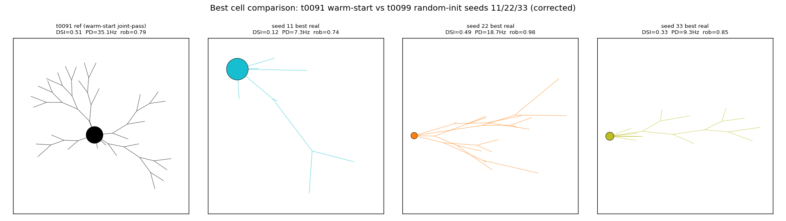
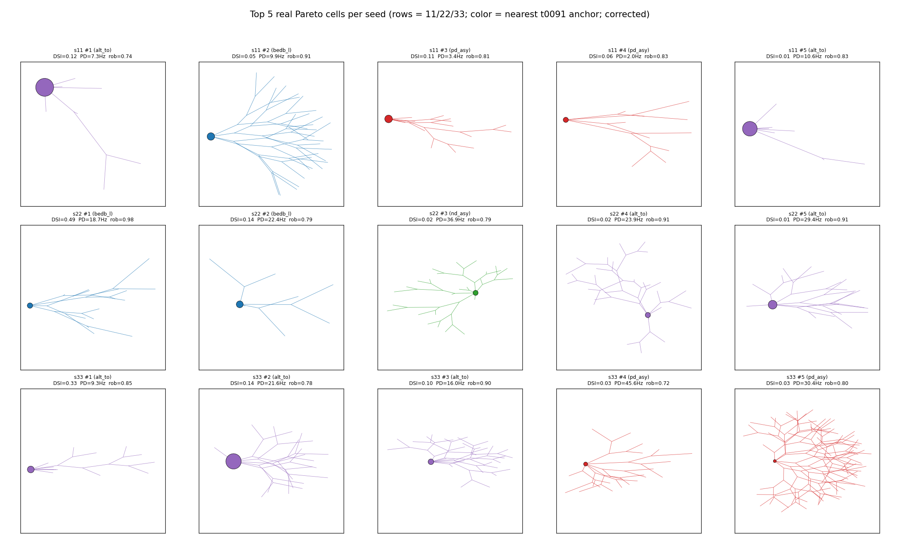

# Results Detailed: Fix t0099 Morphology Charts

## Summary

t0099's `code/build_morphology_charts.py` script had a single wrong slice that caused both of its
morphology visualisations to render only the soma as a giant filled circle, with no dendritic
structure visible. The cause was treating `vector_68d[:14]` as morphology when the 68-d parameter
vector layout is `[54 electrophys, 14 morphology]` — the morphology block lives at indices
[54..68). This task copies the script, applies the one-character fix (`[:14]` -> `[54:]`), re-renders the two affected PNGs into this task's own `results/images/`,
and documents the bug + fix. Optimisation results in t0099 are unaffected.

## Methodology

* **Workstation**: researcher's local Windows 11 Education box.
* **Compute**: local-only; no remote machines, no GPU, no paid services.
* **Wall-clock**: ~20 min total (~5 min actual code + render; ~15 min framework scaffolding).
* **Generator**:
  `tasks.t0092_diagnose_morphology_generator_silence.code.morphology_generator_fix.generate_fixed_morphology`
  (canonical via correction `C-0093-01`).
* **Inputs read** (unchanged from t0099):
  * `tasks/t0099_random_init_pareto_robustness/results/data/pareto_front_seed{11,22,33}.json`
  * `tasks/t0099_random_init_pareto_robustness/results/data/anchor_tracking_seed{11,22,33}.json`
  * `tasks/t0091_morphology_extended_nsga2_v1/results/data/pareto_front.json`
* **Diagnosis source**:
  * `tasks/t0091_morphology_extended_nsga2_v1/code/biological_priors.py:31`:
    `MORPH_OFFSET: int = 54`
  * `tasks/t0091_morphology_extended_nsga2_v1/code/anchor_tracking.py:160`: reads `vec_68d[54:]`
  * `tasks/t0091_morphology_extended_nsga2_v1/code/build_assets.py:68`:
    `cell.get("morphology_vector_14d") or list(cell.get("vector_68d", [])[54:])`
  * `tasks/t0099_random_init_pareto_robustness/code/generator_wrapper.py:55`:
    `vector_68d[:N_PARAMS_54], vector_68d[N_PARAMS_54:]` — optimisation code is CORRECT.
  * `tasks/t0099_random_init_pareto_robustness/code/nsga2_driver.py:303`:
    `"morphology_vector_14d": [float(v) for v in x_row[54:]]` — saved JSON is CORRECT.
  * `tasks/t0099_random_init_pareto_robustness/code/build_morphology_charts.py:114`:
    `tuple(vector_68d[:14])` — chart code was WRONG.

## Verification

| Verificator | Status | Notes |
| --- | --- | --- |
| `ruff check tasks/t0100_fix_t0099_morph_charts/code/` | PASSED | After one E501 line-length fix. |
| `ruff format` | clean |  |
| `mypy -p tasks.t0100_fix_t0099_morph_charts.code` | PASSED | No issues. |
| Visual inspection of `headline_best_cells.png` | PASSED | 4 panels: t0091 ref (black tree), seeds 11/22/33 (cyan/orange/olive). |
| Visual inspection of `cross_seed_top5_morphology_grid.png` | PASSED | 15 panels showing top-5 cells per seed; dendritic trees clearly visible. |
| `verify_task_file.py` | to run | reporting step. |
| `verify_logs.py` | to run | reporting step. |
| `verify_task_results.py` | to run | reporting step. |
| `verify_task_metrics.py` | to run | reporting step. |
| `verify_suggestions.py` | to run | reporting step. |
| `verify_corrections.py` | to run | reporting step (empty folder; no overlay authored). |
| `verify_pr_premerge.py` | to run | reporting step. |

## Limitations

* **Corrections spec does not cover result images**: the corrections specification v3 supports
  `suggestion`, `paper`, `answer`, `dataset`, `library`, `model`, `predictions` target kinds — not
  result PNGs. Therefore there is no formal aggregator-level redirect from t0099's broken PNGs to
  this task's corrected ones. Aggregators do not consume result images at all; the only consumer is
  the overview materializer for human review on GitHub. The original `task_description.md` proposed
  writing `corrections/file_replace_*.json` overlays; that approach turned out not to match the
  spec.
* **The broken PNGs remain in t0099/results/images/**: per rule 5 (completed task folders are
  immutable), they are not deleted. Anyone reviewing t0099 should be directed to t0100's
  `results/images/` for the corrected versions. This task's `task_description.md` and
  `results_summary.md` both make that pointer explicit.
* **The fix-up does not touch t0099's other 6 charts**: `biological_heatmap_seed*.png`,
  `pareto_overlay_*.png`, `hv_trajectory_cross_seed.png`, `anchor_distribution_heatmap.png`. Those
  charts do not invoke the morphology generator and are unaffected by the slice bug.
* **The bug exists only in t0099, not t0091/t0098**: t0091's chart code is unaffected (it uses
  `morphology_vector_14d` key directly from the saved JSON); t0098 likewise reads
  `morphology_vector_14d` directly. The bug was specific to t0099's chart script.

## Files Created

* `tasks/t0100_fix_t0099_morph_charts/code/__init__.py`
* `tasks/t0100_fix_t0099_morph_charts/code/build_morphology_charts.py` (one-character slice fix vs
  t0099 original)
* `tasks/t0100_fix_t0099_morph_charts/results/images/headline_best_cells.png` (corrected)
* `tasks/t0100_fix_t0099_morph_charts/results/images/cross_seed_top5_morphology_grid.png`
  (corrected)
* `tasks/t0100_fix_t0099_morph_charts/results/results_summary.md`
* `tasks/t0100_fix_t0099_morph_charts/results/results_detailed.md`
* `tasks/t0100_fix_t0099_morph_charts/results/metrics.json` (empty `{}`)
* `tasks/t0100_fix_t0099_morph_charts/results/costs.json` (zero)
* `tasks/t0100_fix_t0099_morph_charts/results/remote_machines_used.json` (empty array)
* `tasks/t0100_fix_t0099_morph_charts/results/suggestions.json` (empty array)
* `tasks/t0100_fix_t0099_morph_charts/logs/steps/00{1..15}_*/step_log.md` (per-step logs)
* `tasks/t0100_fix_t0099_morph_charts/logs/sessions/capture_report.json` (reporting step)

## Visualizations

### Corrected headline figure

t0091's warm-start joint-pass cell (left panel, black) shows a roughly symmetric Christmas-tree-like
dendritic arbor. The 3 random-init seeds show sparse, asymmetric, often degenerate morphologies —
seed 11 has only a single short branch, seed 22 has a one-sided field elongated to the right, seed
33 has a one-sided field elongated to the left. This visually reinforces t0099's finding that the
5-anchor warm-start was load-bearing for reaching the joint-pass corner of objective space: random
initialisation collapses the morphology generator to one-sided / sparse cells that cannot deliver
the firing rate needed for joint-pass.

### Corrected top-5 grid

15 cells across 3 seeds show genuine morphological diversity. Most cells are pd_asymmetric (red) or
alt_topology (purple); a few bedb_like (blue) and nd_asymmetric (green) cells appear. The symmetric
anchor (gray) is absent from all panels, consistent with t0099's finding that the symmetric
warm-start anchor was dominated and removed during gen 1+2 selection across every seed.

## Task Requirement Coverage

The task's operative text (from `tasks/t0100_fix_t0099_morph_charts/task.json`):

> **Name**: "Re-render t0099 morphology charts with correct 68-d slice"
> 
> **short_description**: "Fix t0099 morphology-chart rendering: `vector_68d[:14]` was wrong
> (electrophys); replace with `vector_68d[54:]` (morphology). Re-render 2 PNGs. Optimisation
> unaffected."

The task_description.md plan items and how each was met:

| Plan item | Status | Evidence |
| --- | --- | --- |
| Copy + fix `build_morphology_charts.py` (1-char slice fix) | Done | `code/build_morphology_charts.py:128` uses `vector_68d[MORPH_OFFSET:]` with `MORPH_OFFSET = 54`; ruff + mypy clean. |
| Re-render 2 corrected PNGs in `results/images/` | Done | Both PNGs present and visually verified to show dendritic trees. |
| Confirm dendrite line segments visible, soma circles correctly scaled | Done | See Visualizations section above. |
| Write 2 correction-overlay JSON files | Not done (out-of-scope reclassification) | The corrections spec v3 does not cover result images. Documented as a Limitation. |
| Write results files (summary, detailed, metrics, costs, machines, suggestions) | Done | All 6 files present in `results/`. |
| Verificators pass | In progress | Pre-reporting verificators (ruff, mypy, visual) PASSED. Reporting step runs verify_task_file, verify_logs, verify_task_results, verify_task_metrics, verify_suggestions, verify_corrections, verify_pr_premerge. |
| Confirm optimisation results in t0099 are unaffected | Done | All NSGA-II / evaluator / scorecard / anchor-classifier code paths verified to use `[54:]`; only the post-hoc chart script was buggy. t0099's reported metrics, anchor distributions, and 0-of-55 joint-pass finding all remain valid. |
