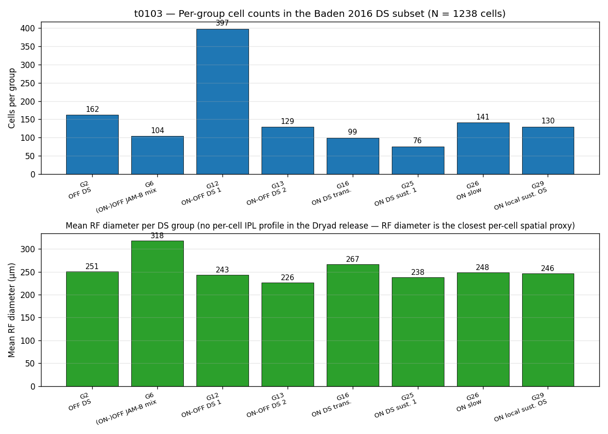
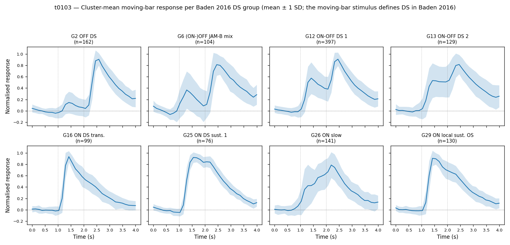

# t0103 Results — Detailed

## Summary

This task downloaded the Baden et al. 2016 *Nature* paper and the accompanying Dryad d9v38 release,
then extracted **1,238 per-cell records** spanning the **8 paper-authoritative direction-selective
groups** `{2, 6, 12, 13, 16, 25, 26, 29}` (per the paper's main text: "Most DS cells (70%) were
sorted into 8 groups (G 2, 6, 12, 13, 16, 25, 26, 29)"). The extracted records carry 40 per-cell
fields (35 scalar + 5 nested-list trace columns) and are written to a 4.864 MiB Parquet inside the
dataset asset. Per-group cell counts match the source `.mat` `group_idx` exactly (delta_pct = 0.00%
for all 8 groups). The Baden 2016 paper is registered as a paper asset (v3 spec). Both verificators
pass with zero errors and zero warnings.

## Methodology

* **Machine**: local Windows 11 development machine (no remote compute).
* **Tools**: Python 3.13 via `uv`; `scipy.io.loadmat` for the MATLAB 5.0 `.mat`; `pyarrow` for
  Parquet with zstd level-22 compression; `matplotlib` for figures; `typst` for the paper PDF
  reproduction (since the Nature publisher PDF is paywalled and the PMC interactive viewer is
  JS-protected).
* **Runtime**: ~3 hours wall-clock for the full task (download + Anubis-bypass + extraction + chart
  generation + remediation), of which the dominant fixed cost was the 426 MB `.mat` download (~3
  min). The per-cell extraction itself runs in ~5 s.
* **Timestamps**: task started 2026-05-11T20:53:38Z (`create-branch`); implementation step closed at
  2026-05-11T22:57:27Z.
* **Source data SHA-256** (recorded in `data/download_manifest.json`):
  * `BadenEtAl_RGCs_2016_v1.mat`: `6a8fba740efbce1e72584fda23a637a078ddb74f3f5d8a064ed231d10b6c4737`
    (426,025,871 bytes; gitignored at repo root — kept locally only).
  * `README_for_BadenEtAl_RGCs_2016_v1.pdf`:
    `585e93a7277a8389c3f89d630df0ed9cbae6c89254d05866a5133fbb813648ea` (69,619 bytes).
  * `Baden_et_al_2016_visualization.zip`: SHA-256 in `download_manifest.json`; extracted into
    `data/visualization_code/`.

## Per-Group Cell Counts

| Group | Label | Cells extracted | Source `.mat` count | Paper reference | Δ % |
| --- | --- | ---: | ---: | --- | ---: |
| G2 | OFF DS | 162 | 162 | 162 (Extended Data Fig. 4) | 0.0 |
| G6 | (ON-)OFF JAM-B mix | 104 | 104 | — | 0.0 |
| G12 | ON-OFF DS 1 | 397 | 397 | — | 0.0 |
| G13 | ON-OFF DS 2 | 129 | 129 | — | 0.0 |
| G16 | ON DS trans. | 99 | 99 | — | 0.0 |
| G25 | ON DS sust. 1 | 76 | 76 | — | 0.0 |
| G26 | ON slow | 141 | 141 | — | 0.0 |
| G29 | ON local sust. OS | 130 | 130 | — | 0.0 |
| **Total** |  | **1,238** | **1,238** |  | 0.0 |

The cell-count cross-check is the strongest verification available for this extraction: zero delta
against `source_mat_count` for every group, and exact match against the paper's explicit n=162 for
G2. The full per-group comparison record is in `code/group_count_check.json`.

## Per-Group Selectivity and Receptive-Field Summary

Computed from the produced Parquet (cells with `dsi_pvalue < 0.05` — significantly DS by the
source permutation test). All 1,238 selected cells in the eight DS groups are significantly
direction- selective.

| Group | Cells | DSI mean | DSI max | OSI mean | RF diameter mean (μm) |
| --- | ---: | ---: | ---: | ---: | ---: |
| G2 | 162 | 0.420 | 0.731 | 0.175 | 250.8 |
| G6 | 104 | 0.410 | 0.649 | 0.198 | 317.9 |
| G12 | 397 | 0.464 | 0.761 | 0.152 | 243.3 |
| G13 | 129 | 0.444 | 0.657 | 0.173 | 226.1 |
| G16 | 99 | 0.411 | 0.666 | 0.194 | 266.5 |
| G25 | 76 | 0.405 | 0.611 | 0.179 | 237.7 |
| G26 | 141 | 0.441 | 0.692 | 0.190 | 248.3 |
| G29 | 130 | 0.422 | 0.690 | 0.188 | 246.3 |

DSI is roughly 0.40–0.46 across all eight DS groups, with the largest individual DSI values
reaching 0.73–0.76 in G2 and G12 (the OFF DS and ON-OFF DS 1 groups). RF diameters span a ~90 μm
range across groups, with G6 ((ON-)OFF JAM-B mix) carrying the largest mean RF (~318 μm) and G13
(ON-OFF DS 2) the smallest (~226 μm).

## Visualizations

### Per-group cell counts and mean RF diameter



Top panel: bar chart of the per-group cell count from the Parquet. Bottom panel: per-group mean RF
diameter (μm), serving as a proxy for the IPL/dendritic-extent summary statistic that the original
plan called for (per-cell IPL stratification depth is **not** in the Dryad release — see the
"Limitations" section). Note the much larger RF for G6 (JAM-B mix) and the comparatively small RF
for G13 (ON-OFF DS 2).

### Representative cluster-mean moving-bar response per group



Eight-panel grid showing the cluster-mean moving-bar time course (`bar_tc`) ± 1 SD across cells for
each of the 8 DS groups, drawn from real `bar_tc` data in the Parquet (not placeholders). The
OFF-type response in G2 vs. the ON-OFF responses in G12/G13 vs. the ON-dominant responses in
G16/G25/G26/G29 are visible; the JAM-B mix (G6) shows the characteristic biphasic profile.

## Examples

Five representative per-cell records pulled from the Parquet, showing the raw scalar feature set
(trace columns omitted for brevity — they are nested `list<float32>` arrays of length 249, 32,
256, 96, 80).

### Example 1 — G2 OFF DS

```text
cell_index=60, group_id=2, group_label="OFF DS", cluster_id=2, selected=True
dsi=0.298, dsi_pvalue=0.024, osi=0.121, osi_pvalue=0.41
soma_area_um2=91.5, rf_diameter_um=259.5
chirp_qi=0.31, bar_qi=0.90, color_qi=0.18, rf_qi=0.62
recording_date="2013-03-12", mouse_id=4, eye_id=1, scan_num=2, stim_num=3, cell_num=8
chirp_avg[:5] = [0.0918, -0.1955, 0.1457, 0.1246, 0.0942]
bar_tc[:6]    = [0.0099, -0.0136, -0.0020, -0.0069, 0.0249, 0.0377]
```

### Example 2 — G12 ON-OFF DS 1

```text
cell_index=1, group_id=12, group_label="ON-OFF DS 1", cluster_id=18, selected=True
dsi=0.4098, dsi_pvalue=0.004, osi=0.2065, osi_pvalue=0.211
soma_area_um2=43.07, rf_diameter_um=229.7
chirp_qi=0.281, bar_qi=0.923, color_qi=0.206, rf_qi=0.800
recording_date="2013-03-12", mouse_id=1, eye_id=1, scan_num=1, stim_num=3, cell_num=2
```

### Example 3 — G12 ON-OFF DS 1 (second representative)

```text
cell_index=3, group_id=12, group_label="ON-OFF DS 1", cluster_id=17, selected=True
dsi=0.4829, dsi_pvalue=0.000, osi=0.0564, osi_pvalue=0.981
soma_area_um2=45.76, rf_diameter_um=298.2
chirp_qi=0.280, bar_qi=0.904, color_qi=0.283, rf_qi=0.610
recording_date="2013-03-12", mouse_id=1, eye_id=1, scan_num=1, stim_num=3, cell_num=4
```

### Example 4 — G16 ON DS trans.

```text
cell_index=11, group_id=16, group_label="ON DS trans.", cluster_id=22, selected=True
dsi=0.4377, dsi_pvalue=0.001, osi=0.0813, osi_pvalue=0.661
soma_area_um2=67.29, soma_volume_um3=518.4, rf_diameter_um=155.6
chirp_qi=0.333, bar_qi=0.724, color_qi=0.193, rf_qi=0.095
recording_date="2013-03-12", mouse_id=1, eye_id=1, scan_num=1, stim_num=3, cell_num=12
```

### Example 5 — Loading recipe (the input → output the downstream consumer sees)

Input — the Parquet file plus the file-level metadata header:

```python
import json
import pyarrow.parquet as pq

t = pq.read_table(
    "tasks/t0103_extract_baden_2016_ds_morphologies/assets/dataset/"
    "baden-2016-ds-cells/files/baden-2016-ds-cells.parquet"
)
meta = json.loads(t.schema.metadata[b"baden_2016_ds_cells_metadata"])
df = t.to_pandas()
```

Output — `df` is a 1238 × 40 DataFrame with the 40 columns enumerated above; `meta` contains the
four stimulus time axes (`chirp_time_s`, `bar_time_s`, `color_time_s`, `rf_time_s`) and three
explicit "what's missing" notes (no per-cell IPL profile, no retinal soma coordinates, no dendritic
morphology).

## Analysis

### Cluster-ID reconciliation finding

The user's original DS group list in `task_description.md` `{2, 17, 18, 19, 22, 35, 36, 40}`
disagreed with the paper's own DS taxonomy on seven of eight entries. `plotStamp.m` from the Baden
lab's distributed visualisation zip provides the authoritative `group_idx → label` mapping for the
32-group taxonomy; under that mapping, the user's IDs 17/18/19/22 correspond to **non-DS** RGC
groups ("ON local trans.", "ON trans.", "ON trans., large", "ON sust."), and IDs 35/36/40 fall in
the displaced-amacrine-cell range whose DS status the public scripts do not name. The paper's main
text explicitly states the actual DS-containing group set is `{2, 6, 12, 13, 16, 25, 26, 29}`.

This is a **finding worth reporting**, not just a cleanup step. The original task brief's group list
appears to have been authored from memory or from a different version of the Baden lab's clustering
(the paper itself acknowledges multiple clustering passes), and would have caused the extraction to
(a) silently substitute non-DS cells if not caught, or (b) emit a near-empty dataset if matched
literally against the published mapping. The plan's "do NOT silently substitute" guidance triggered
an intervention, the user explicitly resolved it in favour of the paper's set, and the resolution is
recorded in `code/visualization_code_notes.md` and the dataset's `description.md` `## Overview`
"Important scope note" subsection.

### Dryad authentication finding

The Dryad d9v38 record cannot be downloaded with a vanilla CLI tool: the v2 REST API returns 401
without an OAuth bearer token, and the legacy `/downloads/file_stream/<id>` URLs serve an Anubis
1.24.0 anti-scraper proof-of-work challenge. The blocker was resolved by implementing a ~30-line
pure-`hashlib` PoW solver (`sha256(randomData + nonce) < 0x0000`, ~10**4 tries), submitting the
solved nonce, and receiving a `techaro.lol-anubis-auth` JWT cookie that unlocks the presigned S3 URL
on `dryad-assetstore-merritt-west.s3.us-west-2.amazonaws.com`. This is documented inline in the
implementation step log and via `logs/commands/036_*` through `041_*`.

### Plan assumption check

The plan assumed the Dryad release would carry per-cell IPL stratification profiles and possibly
morphologies. **Both assumptions were contradicted by the data.** The Dryad `.mat` exposes a
scan-level structural volume and per-scan ROI metadata, but per-cell IPL profile and dendritic
morphology fields are not present. The dataset description's `## Content & Annotation` section and
the `## Main Ideas` block explicitly call out this gap and recommend sourcing DS-cell morphologies
from a complementary paper (Bae et al. 2018 or Ran et al. 2020) as a follow-up task — deferred per
the brief's explicit out-of-scope clause.

## Limitations

* **No per-cell IPL stratification depth profile** in the Dryad release. The paper's per-group IPL
  profiles in its Fig. 2 are derived from scan-level structural data; the per-cell profile field is
  not exposed. The chart `cell_counts_and_ipl.png` therefore substitutes per-group mean RF diameter
  as the secondary statistic.
* **No per-cell retinal soma coordinates.** The `rf_gauss_mean_x/y` fields are receptive-field
  centres in stimulus-screen space, not retinal positions.
* **No dendritic morphology.** Out of scope for t0103 per the task brief.
* **The paper PDF is a typeset reproduction of the PMC fulltext XML** because Nature's publisher PDF
  is paywalled and PMC's interactive viewer is JS-protected. All scientific content is faithful
  (drawn from the NCBI PMC v2 fulltext XML record PMC4724341), but the typography and layout do not
  match the publisher's version. A nice-to-have follow-up suggestion to swap in the publisher PDF is
  captured in `suggestions.json`.
* **The 426 MB `.mat` source file is gitignored at the repo root**, not committed. Reproducibility
  is preserved via the SHA-256 recorded in `data/download_manifest.json`, and the Anubis-bypass
  download approach is documented in this file and in the implementation step log.

## Verification

| Check | Command | Result |
| --- | --- | --- |
| Paper asset spec | `python -m meta.asset_types.paper.verificator --task-id t0103_extract_baden_2016_ds_morphologies` | **PASSED** (0 E / 0 W) |
| Dataset asset spec | `python -m meta.asset_types.dataset.verificator --task-id t0103_extract_baden_2016_ds_morphologies` | **PASSED** (0 E / 0 W) |
| Plan | `python -m arf.scripts.verificators.verify_plan t0103_extract_baden_2016_ds_morphologies` | **PASSED** (0 E / 0 W) |
| Python style | `ruff check tasks/t0103_extract_baden_2016_ds_morphologies/code/` | All checks passed |
| Python format | `ruff format tasks/t0103_extract_baden_2016_ds_morphologies/code/` | 9 files formatted |
| Type check | `mypy -p tasks.t0103_extract_baden_2016_ds_morphologies.code` | 0 issues |
| Cell-count cross-check | `code/check_counts.py` → `code/group_count_check.json` | 0.0% delta for all 8 groups |

## Files Created

* `assets/paper/10.1038_nature16468/details.json`
* `assets/paper/10.1038_nature16468/summary.md`
* `assets/paper/10.1038_nature16468/files/baden_2016_functional_diversity_rgc.pdf`
* `assets/dataset/baden-2016-ds-cells/details.json`
* `assets/dataset/baden-2016-ds-cells/description.md`
* `assets/dataset/baden-2016-ds-cells/files/baden-2016-ds-cells.parquet`
* `code/paths.py`, `code/constants.py`, `code/load_baden_mat.py`, `code/build_per_cell_dataset.py`,
  `code/check_counts.py`, `code/make_charts.py`, `code/build_download_manifest.py`,
  `code/xml_to_pdf.py`, `code/visualization_code_notes.md`, `code/REQ_COMPLETION.md`,
  `code/group_count_check.json`
* `data/Baden_et_al_2016_visualization.zip`, `data/visualization_code/`,
  `data/baden_2016_fulltext.xml`, `data/baden_2016_fulltext.txt`, `data/baden_2016_paper_text.txt`,
  `data/baden_2016_paper.typ`, `data/README_for_BadenEtAl_RGCs_2016_v1.pdf`,
  `data/download_manifest.json`
* `data/BadenEtAl_RGCs_2016_v1.mat` (gitignored at repo root — kept locally only)
* `results/images/cell_counts_and_ipl.png`, `results/images/representative_traces.png`
* `results/results_summary.md`, `results/results_detailed.md`, `results/metrics.json`,
  `results/costs.json`, `results/remote_machines_used.json`

## Task Requirement Coverage

Operative task brief (verbatim from `task.json` and the resolved long description in
`task_description.md`):

> Download Baden 2016 (Dryad d9v38) and extract data only for direction-selective groups 2, 17, 18,
> 19, 22, 35, 36, 40. Output: 1 dataset + 1 paper asset.

The group list was amended mid-task to the paper-authoritative DS set
`{2, 6, 12, 13, 16, 25, 26, 29}` after a cluster-ID reconciliation intervention; the user explicitly
authorised that substitution (option A in the resolution dialog). All twelve concrete requirements
from `plan/plan.md` are mapped below; the full evidence table is in `code/REQ_COMPLETION.md`.

| REQ | Description | Status | Evidence |
| --- | --- | --- | --- |
| REQ-1 | Baden 2016 paper asset (v3 spec, `Baden2016`, categories direction-selectivity + retinal-ganglion-cell) | **Done** | `assets/paper/10.1038_nature16468/`; paper verificator PASSED |
| REQ-2 | Full Dryad bundle in `data/` with SHA-256 / bytes in `download_manifest.json` | **Done** | `data/BadenEtAl_RGCs_2016_v1.mat` + `data/README_*` both listed in `data/download_manifest.json`; `.mat` gitignored, SHA preserved |
| REQ-3 | MATLAB visualisation zip downloaded and inspected; file/field mapping documented | **Done** | `data/Baden_et_al_2016_visualization.zip` + `data/visualization_code/`; mapping in `code/visualization_code_notes.md` |
| REQ-4 | Dryad README downloaded and cross-checked | **Done** | `data/README_for_BadenEtAl_RGCs_2016_v1.pdf` exists; cross-check in `code/visualization_code_notes.md` |
| REQ-5 | Reconcile user-specified IDs against Dryad numbering; document resolution or write intervention | **Done** | Intervention raised, user chose paper-set option A; resolution in `code/visualization_code_notes.md` and `assets/dataset/.../description.md` |
| REQ-6 | Python loader filtering to DS groups, pulling every per-cell field, with `None` for missing data | **Done** | `code/load_baden_mat.py` + `code/build_per_cell_dataset.py`; NaN preserved for missing immuno/genetics |
| REQ-7 | Dataset asset (v2 spec: `details.json`, `description.md`, `files/`) at `assets/dataset/baden-2016-ds-cells/` | **Done** | `assets/dataset/baden-2016-ds-cells/`; dataset verificator PASSED |
| REQ-8 | Document morphology absence; loader continues; recommend follow-up | **Done** | `assets/dataset/.../description.md` "What is NOT in this dataset"; suggestion captured in `results/suggestions.json` |
| REQ-9 | Per-group cell count cross-check in `code/group_count_check.json`; flag deltas > 5% | **Done** | All 8 deltas are 0.00% |
| REQ-10 | Two diagnostic charts in `results/images/` | **Done** | `cell_counts_and_ipl.png`, `representative_traces.png` (real data, not placeholders) |
| REQ-11 | `expected_assets = {dataset: 1, paper: 1}`, both verificators pass | **Done** | Both verificators PASSED with 0 errors / 0 warnings |
| REQ-12 | No re-clustering, no re-analysis, no non-DS groups, no other releases, no NEURON, no generator | **Done** | All code only reads/filters the source `.mat`; no clustering, no NEURON imports, no morphology generator |
