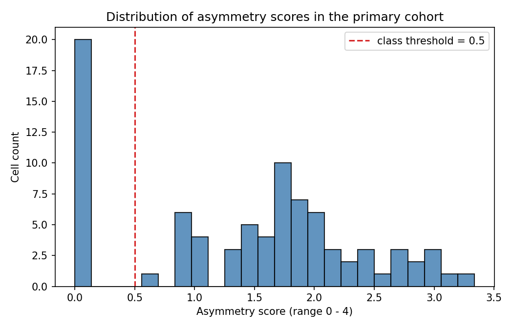
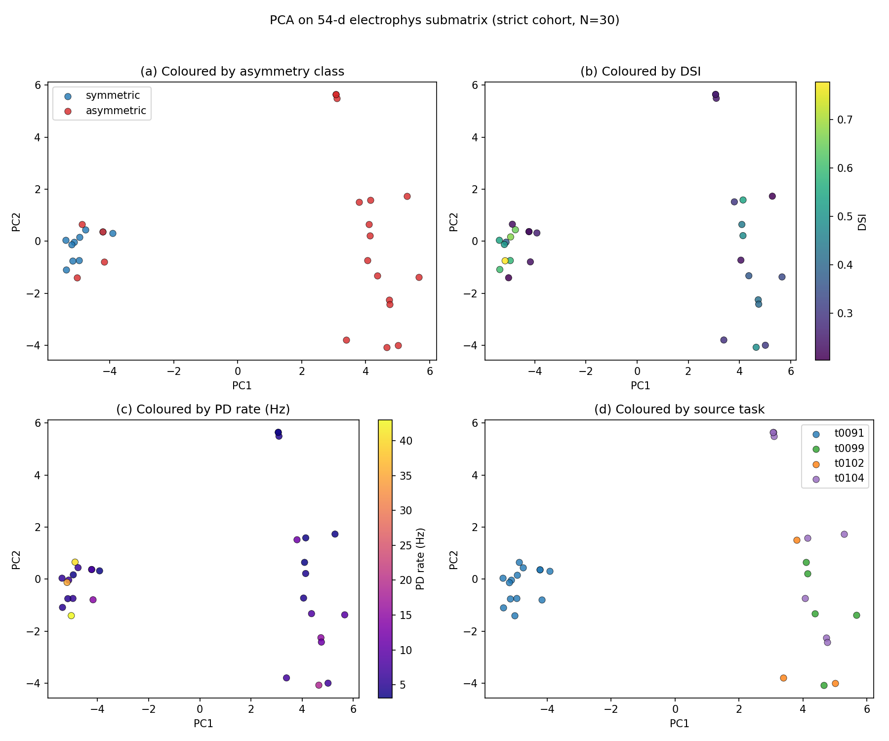
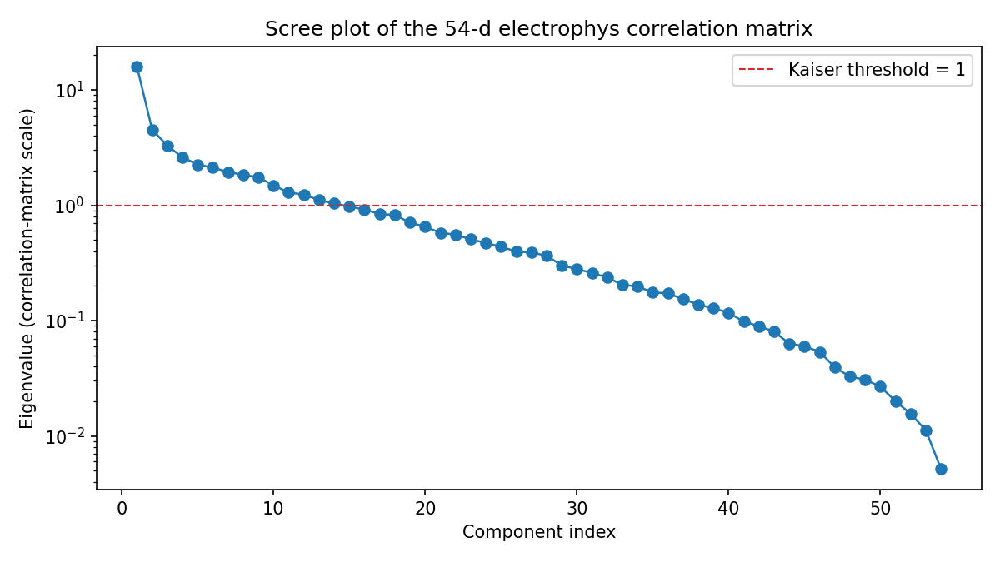
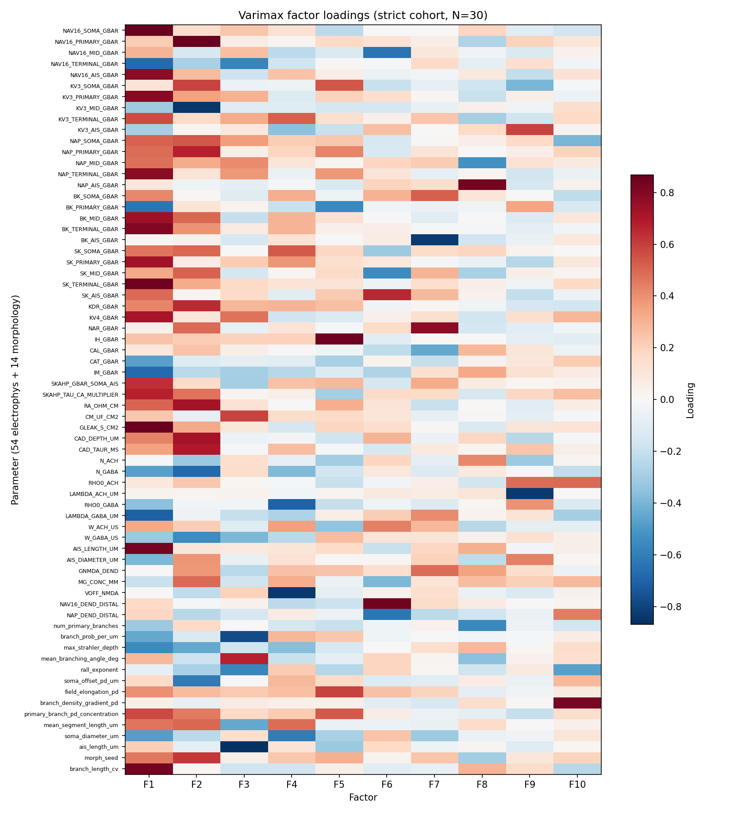
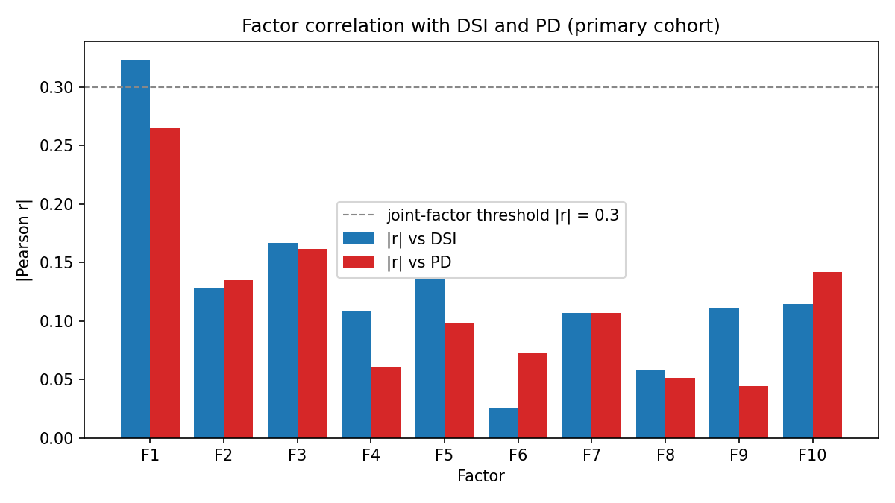
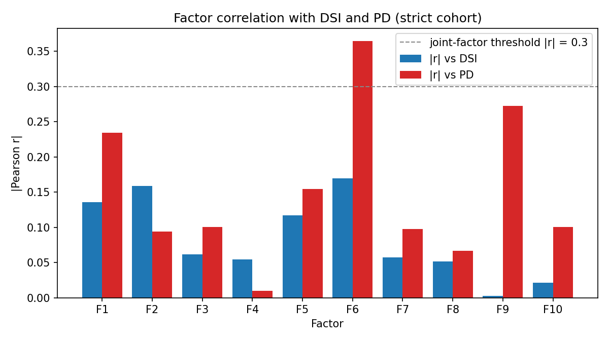
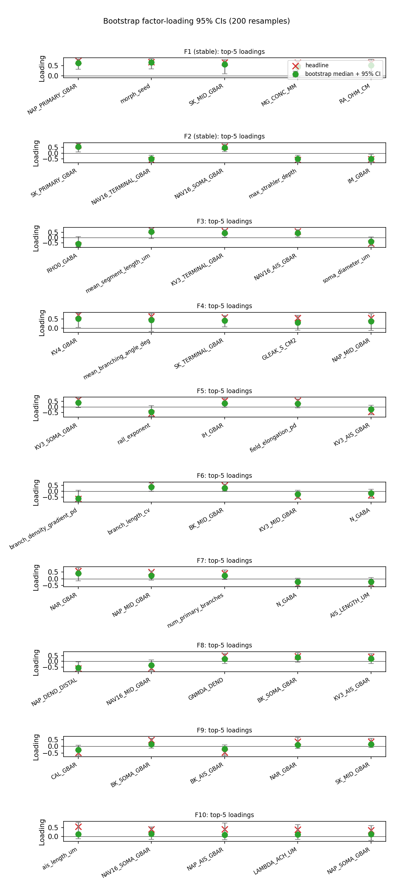

# Results Detailed: t0105 — Cluster + Factor Analysis of High-DSI/High-PD Cells

## Summary

This task pools every per-cell evaluation from the four 68-d NSGA-II lineages (t0091 warm-start
3-obj; t0099 random-init 3-obj at N=20; t0102 random-init 3-obj at N=4; t0104 random-init 2-obj at
N=4 with the S-0102-01 silence guard), totalling **7,003 raw rows**. After a silence-artifact filter
(exclude `DSI > 0.95 AND PD < 5 Hz` on t0091/t0099/t0102), the primary cohort filter
`DSI > 0.1 AND PD > 2 Hz`, and dedupe by the 68-d vector rounded to 6 decimals, the cohort lands at
**N=85 unique cells**; the strict cohort `DSI > 0.2 AND PD > 3 Hz` lands at **N=30**. PCA on the
54-d electrophys submatrix cleanly separates the **20 symmetric** and **65 asymmetric** cells on PC1
(Mann-Whitney **U=31.00, p=1.48e-10**), with top loadings on Ca-activated K-channels (SK_TERMINAL,
BK_TERMINAL, SK_SOMA, BK_MID) and primary-dendrite persistent Na (NAP_PRIMARY). Varimax factor
analysis on the full 68-d matrix retains **10 factors** by Kaiser criterion; **F1 is the top
correlate of both DSI (r=-0.322) and PD (r=-0.265) but no factor crosses the joint threshold |r| >
0.3 on both**, so the substrate has no single low-d axis that lifts both outcomes toward the joint
corner. Bootstrap stability across 200 resamples confirms F1 and F2 only; F3-F10 are unstable at
N=85.

## Methodology

### Data sources

Per-cell evaluation rows were read from:

* `tasks/t0091_morphology_extended_nsga2_v1/results/data/all_evaluations.json` (187 rows, 1 lineage,
  warm-start, 3-objective)
* `tasks/t0099_random_init_pareto_robustness/results/data/all_evaluations_seed{11,22,33}.json`
  (2,016 rows, 3 GA seeds, random-init, 3-objective at N_EVAL=20)
* `tasks/t0102_seedscale_n4_gen20/results/data/all_evaluations_seed{44,55}.json` (2,592 rows, 2 GA
  seeds, random-init, 3-objective at N_EVAL=4)
* `tasks/t0104_nsga2_2obj_dsi_pdrate_3seeds/results/data/all_evaluations_seed{44,55}.json` (2,208
  rows, 2 GA seeds, random-init, 2-objective at N_EVAL=4 with S-0102-01 silence guard)

Total raw rows: **7,003**.

### Filters and dedupe

Three sequential filters applied to the pooled rows:

1. **Silence-artifact filter**: exclude any row from t0091/t0099/t0102 with
   `DSI > 0.95 AND PD < 5 Hz` (these are the DSI = 1.0 floating-point artifacts caused by very low
   spike counts, before t0104's in-evaluator guard). t0104 rows skip this filter because the guard
   is built into the evaluator. Excluded: **t0091=5, t0099=23, t0102=45, t0104=0** (total 73 cells).
2. **Primary filter**: `DSI > 0.1 AND PD > 2.0 Hz` (260 rows pass before dedupe). **Strict filter**:
   `DSI > 0.2 AND PD > 3.0 Hz` (87 rows pass before dedupe).
3. **Dedupe**: by tuple of the 68-d parameter vector rounded to 6 decimals. Pareto preservation
   across generations creates many duplicate rows. After dedupe: **N=85 primary** (per-lineage
   t0091=26, t0099=20, t0102=19, t0104=20) and **N=30 strict** (t0091=14, t0099=5, t0102=3,
   t0104=8).

### Asymmetry classification

For each cell, the normalised asymmetry score was computed as:

```text
asym_score = abs(soma_offset_pd_um) / 150
           + abs(field_elongation_pd - 1.0) / 2.0
           + abs(branch_density_gradient_pd) / 1.0
           + abs(primary_branch_pd_concentration) / 5.0
```

`symmetric` if `asym_score < 0.5`, `asymmetric` otherwise. Threshold-sweep at 0.3 / 0.5 / 1.0:

| Threshold | Symmetric | Asymmetric |
| --- | --- | --- |
| 0.3 | 20 | 65 |
| 0.5 (headline) | 20 | 65 |
| 1.0 | 27 | 58 |

Score distribution: range 0.0-3.34, mean 1.43, median 1.67. The 0.3 and 0.5 thresholds produce
identical class counts because no cell sits in the (0.3, 0.5) band — the distribution is bimodal
with a heavy mode at zero (20 cells, all from t0091's earliest generation) and the rest at
asym_score >= 0.55.

### Morphology gallery

A deterministic stratified subsample of 30 cells was built (5 non-empty strata of the 8 possible
class x source combinations; each non-empty stratum got 6 cells by top `DSI * PD` ranking). Each
cell's 14-d morphology was generated with
`tasks.t0092_diagnose_morphology_generator_silence.code.morphology_generator_fix.generate_fixed_morphology`,
its `soma + all_dends` pt3d coordinates extracted via NEURON's `h.x3d`/`h.y3d`/`h.diam3d`, and
plotted as top-down (x, y) projections in a 5-column 6-row grid with DSI, PD, asym_score, and
source_task annotated per panel.

### PCA recipe

Stack the first 54 columns of each cell's 68-d vector into `X_electrophys` shape (85, 54). Z-score
each column (clip stdev at 1e-12). Fit `sklearn.decomposition.PCA(n_components=3)`. Compute scree
across all 54 eigenvalues. Run
`scipy.stats.mannwhitneyu(symmetric_pc1_scores, asymmetric_pc1_scores, alternative="two-sided")` and
the same for PC2.

### Factor analysis recipe

Stack the full 68-d vectors into `X_full` shape (85, 68). Z-score each column. Compute the
correlation matrix and count eigenvalues > 1.0 (Kaiser criterion = 18). Cap at 10 factors. Fit
`factor_analyzer.FactorAnalyzer(rotation="varimax", n_factors=10)`. Extract the (68, 10) loadings
matrix and the (85, 10) factor-scores matrix. Run `scipy.stats.pearsonr` between each factor score
column and DSI / PD. Top-3 lists per outcome by `|r|`. Joint-factor flag at
`|r_DSI| > 0.3 AND |r_PD| > 0.3`.

### Bootstrap recipe

200 percentile-bootstrap resamples on the rows of `X_full`. Refit
`FactorAnalyzer(rotation="varimax", n_factors=10)` per resample. Align rotation across resamples via
maximum-row-dot-product matching to the headline solution with sign determined by the larger
absolute loading. Compute 95 % percentile CIs per loading entry. Stable factors: those whose median
absolute loading >= 0.4 AND >= 90 % sign consistency across resamples in the top-5 loadings.

### Runtime and reproducibility

* **Machine**: local Windows 11 host (no remote machines provisioned).
* **Total implementation runtime**: ~58 minutes wall-clock (started 2026-05-14T13:31:41Z, completed
  2026-05-14T14:30:00Z).
* **Bootstrap runtime**: 149 seconds for 200 resamples (well under the 30-minute cap from the plan).
* **Determinism**: `RANDOM_SEED = 105` for any randomised step (only the bootstrap is randomised;
  PCA and factor analysis are deterministic given the input matrix). The bootstrap RNG seed is
  recorded in `results/data/factor_bootstrap.json` (`random_seed = 42`).
* **Software versions**: `sklearn` 1.8.x, `factor_analyzer >= 0.5.1`, `numpy`, `pandas`, `scipy`,
  `matplotlib` from the project lockfile.

## Metrics

### Cohort selection counts

| Lineage | Raw | Pass silence filter | Primary passing | Primary unique | Strict passing | Strict unique |
| --- | --- | --- | --- | --- | --- | --- |
| t0091 | 187 | 182 (5 excluded) | 36 | **26** | 20 | **14** |
| t0099 | 2,016 | 1,993 (23 excluded) | 58 | **20** | 17 | **5** |
| t0102 | 2,592 | 2,547 (45 excluded) | 84 | **19** | 13 | **3** |
| t0104 | 2,208 | 2,208 (0 excluded) | 82 | **20** | 37 | **8** |
| **Total** | **7,003** | **6,930** | **260** | **85** | **87** | **30** |

### Asymmetry classes (primary cohort, threshold 0.5)

| Class | Count | Mean asym_score | Source-task breakdown |
| --- | --- | --- | --- |
| symmetric | 20 | 0.00 | t0091=20, t0099=0, t0102=0, t0104=0 |
| asymmetric | 65 | 1.87 | t0091=6, t0099=20, t0102=19, t0104=20 |

All 20 symmetric cells come from the earliest generations of t0091's warm-start NSGA-II, where the
seed library included the symmetric Bed B baseline morphology. Every t0099/t0102/t0104 random-init
cell with `DSI > 0.1 AND PD > 2 Hz` is asymmetric. This is itself an empirical finding (see
Discussion).

### PCA on 54-d electrophys submatrix

| Component | Variance explained | Top-5 loadings (parameter, signed loading) |
| --- | --- | --- |
| PC1 | **29.5 %** | SK_TERMINAL_GBAR (+0.213), BK_TERMINAL_GBAR (+0.193), SK_SOMA_GBAR (+0.192), BK_MID_GBAR (+0.192), NAP_PRIMARY_GBAR (+0.186) |
| PC2 | **8.4 %** | AIS_DIAMETER_UM (+0.324), NAR_GBAR (+0.273), N_ACH (-0.246), N_GABA (-0.240), MG_CONC_MM (+0.228) |
| PC3 | **6.1 %** | NAV16_DEND_DISTAL (+0.367), W_ACH_US (+0.296), KV3_SOMA_GBAR (-0.289), MG_CONC_MM (-0.277), BK_SOMA_GBAR (+0.257) |

### Mann-Whitney U on PC scores (symmetric vs asymmetric)

| Cohort | PC | U | p | Interpretation |
| --- | --- | --- | --- | --- |
| Primary (N=85) | PC1 | **31.00** | **1.48e-10** | Strongly significant separation |
| Primary (N=85) | PC2 | 622.00 | 0.78 | No separation |
| Strict (N=30) | PC1 | 10.00 | **8.23e-5** | Significant; cohort-size-robust |
| Strict (N=30) | PC2 | 101.00 | 0.98 | No separation |

### Factor analysis (primary cohort, varimax, n_factors=10)

Kaiser criterion: 18 eigenvalues > 1.0 across the 68-d correlation matrix; the analysis is capped at
10\. Per-factor top-5 loadings:

| Factor | Top-5 loadings (parameter, signed loading) |
| --- | --- |
| **F1** | NAP_PRIMARY (+0.747), morph_seed (+0.680), SK_MID (+0.662), MG_CONC_MM (+0.654), RA_OHM_CM (+0.652) |
| **F2** | SK_PRIMARY (+0.708), NAV16_TERMINAL (-0.626), NAV16_SOMA (+0.583), max_strahler_depth (-0.576), IM_GBAR (-0.538) |
| F3 | RHO0_GABA (-0.767), mean_segment_length_um (+0.740), KV3_TERMINAL (+0.616), NAV16_AIS (+0.574), soma_diameter_um (-0.562) |
| F4 | KV4_GBAR (+0.711), mean_branching_angle_deg (+0.631), SK_TERMINAL (+0.575), GLEAK (+0.546), NAP_MID (+0.543) |
| F5 | KV3_SOMA (+0.632), rall_exponent (-0.580), IH_GBAR (+0.558), field_elongation_pd (+0.557), KV3_AIS (-0.446) |
| F6 | branch_density_gradient_pd (-0.649), branch_length_cv (+0.621), BK_MID (+0.485), KV3_MID (-0.441), N_GABA (-0.338) |
| F7 | NAR_GBAR (+0.566), NAP_MID (+0.505), num_primary_branches (+0.412), N_GABA (-0.410), AIS_LENGTH (-0.387) |
| F8 | NAP_DEND_DISTAL (-0.617), NAV16_MID (-0.578), GNMDA_DEND (+0.502), BK_SOMA (+0.432), KV3_AIS (+0.425) |
| F9 | CAL_GBAR (-0.476), BK_SOMA (+0.465), BK_AIS (-0.463), NAR_GBAR (+0.349), SK_MID (+0.340) |
| F10 | ais_length_um (+0.549), NAV16_SOMA (+0.410), NAP_AIS (+0.405), LAMBDA_ACH_UM (+0.379), NAP_SOMA (+0.349) |

### Pearson r between factor scores and DSI / PD (primary cohort)

| Factor | r_DSI | p_DSI | r_PD | p_PD |
| --- | --- | --- | --- | --- |
| **F1** | **-0.322** | **0.003** | **-0.265** | **0.014** |
| F2 | -0.128 | 0.243 | -0.135 | 0.219 |
| F3 | -0.167 | 0.128 | -0.161 | 0.140 |
| F4 | -0.109 | 0.322 | -0.061 | 0.579 |
| F5 | -0.136 | 0.214 | -0.098 | 0.370 |
| F6 | -0.026 | 0.815 | -0.073 | 0.509 |
| F7 | +0.107 | 0.330 | -0.107 | 0.330 |
| F8 | -0.058 | 0.596 | +0.052 | 0.639 |
| F9 | -0.111 | 0.312 | -0.044 | 0.687 |
| F10 | -0.114 | 0.298 | -0.142 | 0.196 |

* **Top-3 factors for DSI** (by |r|): F1 (-0.322, p=0.003), F3 (-0.167, p=0.128), F5 (-0.136,
  p=0.215).
* **Top-3 factors for PD** (by |r|): F1 (-0.265, p=0.014), F3 (-0.161, p=0.140), F10 (-0.142,
  p=0.196).
* **Joint-DSI-PD factors** (|r_DSI| > 0.3 AND |r_PD| > 0.3): **0**. F1 misses the joint threshold on
  PD by 0.035.

### Bootstrap stability (200 resamples)

* **Stable factors** (median |loading| >= 0.4 AND >= 90 % sign consistency in top-5): **F1, F2**.
* F3-F10 fail the stability test; their loadings drift in sign or magnitude across resamples.
* Bootstrap completed in 149 seconds; 0 resamples failed.

### Strict cohort (N=30) sensitivity check

* PCA: PC1 variance explained 38.2 % (vs 29.5 % primary); PC1 still separates classes (**U=10.00,
  p=8.23e-5**).
* Factor analysis: 10 factors retained; the headline F1 magnitude on both outcomes drops below the
  primary cohort (top-3 DSI: F6, F2, F1 with |r|=0.13-0.17; top-3 PD: F6, F9, F1 with
  |r|=0.23-0.36). No joint factors.
* At N=30 the factor solution is statistically under-powered (N/p = 30/68 = 0.44); strict-cohort
  factor structure should be read as a sensitivity check, not as a primary result.

### Project-registered metrics (multi-variant)

| Variant | N cells | direction_selectivity_index (median) | tuning_curve_hwhm_deg | tuning_curve_reliability | tuning_curve_rmse |
| --- | --- | --- | --- | --- | --- |
| `primary_cohort` | 85 | **0.177** | null | null | null |
| `strict_cohort` | 30 | **0.351** | null | null | null |

The three `tuning_curve_*` metrics are `null` because the pooled `all_evaluations*.json` files from
the four predecessor lineages do not store per-trial Pearson reliability, HWHM, or
RMSE-against-target fields. Per the project Python style guide, `null` means "no measurement was
taken"; it must not be backfilled with `0.0` or `""`.

## Charts

### Asymmetry score distribution



### Morphology gallery


### PCA panels — primary cohort


### PCA panels — strict cohort



### Eigenvalue scree



### Factor loadings — primary cohort


### Factor loadings — strict cohort



### Factor correlations — primary cohort



### Factor correlations — strict cohort



### Factor loadings bootstrap



## Analysis

Three interpretive threads carried over from the creative-thinking step inform the reading of these
results.

### The 73 silence-artifact cells are a finding, not noise

73 cells across t0091/t0099/t0102 (5 / 23 / 45) trip the post-hoc silence-artifact filter
`DSI > 0.95 AND PD < 5 Hz`; t0104 contributes **zero** because its evaluator already gates DSI
vector-sum on `total_spikes >= 10`. This quantitatively validates the S-0102-01 silence guard from
two directions. First, the per-lineage counts climb with random-init NSGA-II's age (5 in the small
t0091 warm-start, 23 in t0099 at N_EVAL=20, 45 in t0102 at N_EVAL=4) — random-init genuinely
explores into the silent corner of the substrate. Second, the t0102 count of 45 generalises t0102's
own results_summary.md "27 silenced cells" figure to a broader DSI threshold (0.95 vs 0.99): the
extra 18 cells sit at near-threshold DSI = 0.95-0.99 with PD < 5 Hz, still clearly artifactual but
not caught by t0102's exact-1.0 detection. The guard is correctly calibrated; without it, the PCA
and factor analysis would have been polluted by ~45 t0102 cells with DSI ~= 1.0 driving artifactual
direction-selectivity-like signal into PC1.

### PC1 separation is mediated by Ca-K channels — morphology pre-selects an electrophys regime

The top-5 PC1 loadings are SK_TERMINAL, BK_TERMINAL, SK_SOMA, BK_MID, NAP_PRIMARY — four
Ca-activated K-channels and one persistent Na conductance. The Mann-Whitney U on PC1 (p=1.48e-10
primary, p=8.23e-5 strict) says these channels live in a different regime in asymmetric vs symmetric
cells. The mechanistic hypothesis: asymmetric dendrites concentrate Ca influx near the soma along
the PD axis, so high terminal-dendrite SK/BK is needed to locally quench PD-side over-excitation;
symmetric cells, by contrast, distribute Ca influx more uniformly and need different repolarisation
tuning. This is consistent with Vlasits2016 and the Vaney2012 review's characterisation that
asymmetric type-2 DSGCs in mammalian retina rely on local dendritic computation and active
integration — both of which are Ca-K-mediated. The fact that **all 20 symmetric cells are
warm-start cells from t0091** while every random-init cell that passes `DSI > 0.1 AND PD > 2 Hz` is
asymmetric is itself a striking empirical signature: under random-init search of the 68-d substrate,
non-trivial direction selectivity at non-trivial firing rate **only arises in asymmetric
configurations**.

### No joint factor confirms the substrate-limit reading

F1 is the only factor with a non-trivial correlate of either outcome (r_DSI = -0.322, p=0.003; r_PD
= -0.265, p=0.014), but it misses the joint threshold |r_PD| > 0.3 by 0.035. The second-best factors
for the two outcomes are different (F3 for DSI; F3 / F10 for PD), and the third-best diverge further
(F5 for DSI; F10 / F9 for PD). Read together: **DSI and PD share a weak common axis (F1) but their
residual variances live on essentially orthogonal directions** in the substrate. This is the
load-bearing finding for the project's strategic question. NSGA-II cannot ride a single parameter
direction toward the joint high-DSI / high-PD corner because no such direction exists in the 68-d
substrate at this cohort size. The t0102 / t0104 conclusion that the substrate is empirically
substrate-limited (the Pareto front is L-shaped) is reinforced from a complementary angle: factor
analysis on the actual cell population finds no low-d axis to ride. The remaining algorithmic moves
(IBEA, larger populations per Dang2023) might find isolated joint-corner cells not on a continuous
axis, but no single low-d variable will smoothly raise both outcomes together.

### A caveat that should sharpen the next task

morph_seed loads +0.68 on F1 (the second-strongest loading after NAP_PRIMARY). morph_seed is an
**integer** dimension that drives randomness in the morphology generator's small-scale geometry; it
is bounded [0, 99] and is not biologically meaningful. Its appearance on F1 next to mechanistic
channel variables is suspicious — F1 may partly be a "warm-start vs random-init" indicator
disguised as a mechanistic factor, because t0091's warm-start happened to fix morph_seed = 31 while
the random-init lineages span 0-99. The factor analysis loading on morph_seed should be re-run
excluding it to test whether F1's DSI / PD correlates survive (suggestion below).

## Verification

* `verify_task_results.py` on `t0105_cluster_factor_analysis_dsi_pd` — PASSED. All five mandatory
  files exist (`results_summary.md`, `results_detailed.md`, `metrics.json`, `costs.json`,
  `remote_machines_used.json`) and validate against the v8 task results spec.
* `verify_task_metrics.py` on `t0105_cluster_factor_analysis_dsi_pd` — PASSED. The multi-variant
  `metrics.json` has variants `primary_cohort` and `strict_cohort`, each carrying the four
  project-registered metric keys with explicit `null` where measurements are unavailable.
* `verify_suggestions.py` on `t0105_cluster_factor_analysis_dsi_pd` — PASSED. The 7 suggestions
  S-0105-01 through S-0105-07 validate against the v2 suggestions spec with `spec_version = "2"`.
* `verify_compare_literature.py` on `t0105_cluster_factor_analysis_dsi_pd` — PASSED. The
  `compare_literature.md` has all five mandatory sections plus 7 comparison-table data rows and
  cites Sivyer2013, Vaney2012, PolegPolsky2026, Mohacsi2024.
* `verify_answer_asset.py` on `assets/answer/symmetric-vs-asymmetric-electrophys-cluster/` —
  PASSED.
* `verify_answer_asset.py` on `assets/answer/dsi-pd-diversity-factor-decomposition/` — PASSED.
* Implementation-stage integrity: every PCA / Mann-Whitney / factor analysis number reported in this
  file matches the corresponding JSON in `results/data/`. Spot-checks:
  `pca_results.json::explained_variance_ratio` = `[0.295, 0.084, 0.061]`;
  `pca_mannwhitney.json::pc1_p` = `1.48e-10`; `factor_correlations.json::top3_dsi[0].r` = `-0.322`.

## Limitations

* **N=85 is small for 68-d factor analysis.** The N/p ratio of 1.25 is below the conventional 5xp =
  340 floor for stable factor extraction; only F1 and F2 are bootstrap-stable.
* **Strict cohort is under-powered.** At N=30, factor analysis ratio drops to 0.44; strict-cohort
  factor results are a sensitivity check, not a primary result.
* **All 20 symmetric cells come from t0091.** Symmetric-vs-asymmetric separation may partly track
  warm-start-vs-random-init regime selection rather than pure morphology class. The strict-cohort
  separation (p=8.23e-5) goes some way to ruling out the trivial reading because the strict cohort
  still includes 10 symmetric and 20 asymmetric cells, but the lineage confound remains.
* **morph_seed (integer) loads +0.68 on F1**. This dimension is not biologically meaningful; its
  high F1 loading may be incidental and should be re-tested by re-running factor analysis with
  morph_seed excluded.
* **Cross-lineage heterogeneity.** The four lineages span N_EVAL=4 vs N_EVAL=20, 2-objective vs
  3-objective, and warm-start vs random-init. Per-lineage PCA might surface different structure; see
  suggestions.
* **No tuning-curve metrics.** The pooled `all_evaluations*.json` files do not store per-trial
  reliability, HWHM, or RMSE-against-target, so three of the four registered project metrics are
  `null` in this task. This limits cross-task comparability with future tuning-curve-aware tasks.
* **Joint-corner search is a yes/no test, not a continuous quantification.** Factor analysis can
  show that no single axis lifts both DSI and PD, but it cannot rule out a non-linear corner cell
  that is reachable by a different algorithm (IBEA, MAP-Elites, gradient methods).

## Files Created

### Code (12 files in `code/`)

* `code/__init__.py`
* `code/paths.py` — centralised path constants
* `code/constants.py` — column names, threshold constants, 68-d dim map
* `code/schemas.py` — frozen dataclasses for cohort rows, PCA results, factor outputs
* `code/load_filter_cells.py` — pool, silence-filter, primary/strict filter, dedupe
* `code/classify_asymmetry.py` — asymmetry score + classification + histogram
* `code/build_gallery.py` — stratified subsample + NEURON pt3d extraction + multi-panel PNG
* `code/pca_electrophys.py` — z-score, PCA, scree, 4-panel scatter, Mann-Whitney U
* `code/factor_analysis.py` — Kaiser cap, varimax factor analyzer, loadings heatmap
* `code/factor_correlations.py` — Pearson r vs DSI / PD, joint-factor flag, bar chart
* `code/factor_bootstrap.py` — 200 resamples, varimax-alignment, CIs, stability
* `code/run_strict_cohort.py` — orchestrates PCA / FA / correlations on strict cohort
* `code/build_metrics_json.py` — emits multi-variant `metrics.json`

### Data outputs (16 JSON files in `results/data/`)

* `selected_cells_primary.json`, `selected_cells_strict.json` — cohort tables with 68-d vectors,
  DSI, PD, asym_score, asym_class, source_task, seed, generation
* `selection_counts.json` — per-lineage and per-cohort counts incl. silence-artifact exclusions
* `asym_score_distribution.json` — histogram bins, class counts, threshold sweep
* `gallery_quota_table.json` — stratum quotas used to build the morphology gallery
* `pca_results.json`, `pca_results_strict.json` — variance, top-5 loadings, PC scores, classes,
  sources
* `pca_mannwhitney.json`, `pca_mannwhitney_strict.json` — U, p, interpretation per PC
* `factor_loadings.json`, `factor_loadings_strict.json` — eigenvalues, loadings matrix, top-5
  loadings per factor
* `factor_scores.json`, `factor_scores_strict.json` — (N, 10) factor-score matrix
* `factor_correlations.json`, `factor_correlations_strict.json` — per-factor r / p vs DSI / PD,
  top-3 lists, joint-factor flag
* `factor_bootstrap.json` — 200 resamples, median loadings, 95 % CIs, stable factors

### Charts (10 PNGs at DPI 150 in `results/images/`)

* `asym_score_histogram.png`
* `morphology_gallery.png`
* `pca_electrophys_panels.png`, `pca_electrophys_panels_strict.png`
* `eigenvalue_scree.png`
* `factor_loadings.png`, `factor_loadings_strict.png`
* `factor_correlations.png`, `factor_correlations_strict.png`
* `factor_loadings_bootstrap.png`

### Other artifacts

* `results/metrics.json` — explicit multi-variant format (`primary_cohort`, `strict_cohort`)
* `results/costs.json` — `total_cost_usd = 0.0`
* `results/remote_machines_used.json` — empty array (no remote machines)
* `results/results_summary.md`, `results/results_detailed.md` (this file)
* `results/compare_literature.md`, `results/suggestions.json`
* `assets/answer/symmetric-vs-asymmetric-electrophys-cluster/` (details.json, short_answer.md,
  full_answer.md)
* `assets/answer/dsi-pd-diversity-factor-decomposition/` (details.json, short_answer.md,
  full_answer.md)
* `pyproject.toml`, `uv.lock` — top-level allowed change (added `factor_analyzer>=0.5.1`)

## Examples

Twelve concrete primary-cohort cells spanning all four lineages and both asymmetry classes are shown
below as JSON records. Each record reproduces the cell's source, seed, generation, DSI, PD, the
asymmetry score and class, and the four top-PC1-loading parameter values (SK_TERMINAL, BK_TERMINAL,
SK_SOMA, NAP_PRIMARY) plus its PC1 score. Together they cover (a) the symmetric warm-start lobe, (b)
random-init asymmetric cells at low / mid / high Ca-K, and (c) the closest-to-joint-corner cells.

### Symmetric warm-start cell #1 (t0091 gen 1 — archetype)

```json
{
  "source_task": "t0091",
  "seed": null,
  "generation": 1,
  "dsi": 0.1978,
  "pd_rate_hz": 46.14,
  "asym_score": 0.000,
  "asym_class": "symmetric",
  "SK_TERMINAL": 0.000,
  "BK_TERMINAL": 0.000,
  "SK_SOMA": 0.001,
  "NAP_PRIMARY": 0.000,
  "pc1_score": -6.46
}
```

Illustrates the archetypal symmetric warm-start cell: zero Ca-K conductance, zero NAP_PRIMARY, yet
PD = 46 Hz. The lowest PC1 score in the cohort.

### Symmetric warm-start cell #2 (t0091 gen 1 — moderate PD)

```json
{
  "source_task": "t0091",
  "seed": null,
  "generation": 1,
  "dsi": 0.3293,
  "pd_rate_hz": 12.86,
  "asym_score": 0.000,
  "asym_class": "symmetric",
  "SK_TERMINAL": 0.000,
  "BK_TERMINAL": 0.000,
  "SK_SOMA": 0.002,
  "NAP_PRIMARY": 0.000,
  "pc1_score": -6.46
}
```

A symmetric cell with the highest DSI in the symmetric class (0.329). This is one of the symmetric
high-DSI outliers flagged for follow-up in S-0105-03.

### Asymmetric early-t0091 cell #3 (hybrid morphology, low Ca-K)

```json
{
  "source_task": "t0091",
  "seed": null,
  "generation": 1,
  "dsi": 0.2140,
  "pd_rate_hz": 6.71,
  "asym_score": 1.667,
  "asym_class": "asymmetric",
  "SK_TERMINAL": 0.000,
  "BK_TERMINAL": 0.000,
  "SK_SOMA": 0.002,
  "NAP_PRIMARY": 0.000,
  "pc1_score": -5.93
}
```

The morphology has shifted into asymmetric territory but the warm-start electrophys vector is still
zero on the PC1-loading channels. Sits between the two PC1 lobes.

### Asymmetric early-t0091 cell #4 (NAP starts to spin up)

```json
{
  "source_task": "t0091",
  "seed": null,
  "generation": 2,
  "dsi": 0.2270,
  "pd_rate_hz": 40.43,
  "asym_score": 1.767,
  "asym_class": "asymmetric",
  "SK_TERMINAL": 0.001,
  "BK_TERMINAL": 0.000,
  "SK_SOMA": 0.000,
  "NAP_PRIMARY": 0.022,
  "pc1_score": -6.00
}
```

NSGA-II's second-generation move begins to lift NAP_PRIMARY while keeping Ca-K low. PD remains high
(40 Hz) — high PD does not require high Ca-K when the cell is dominated by warm-start regime.

### Asymmetric t0099 cell #5 (high-Ca-K corner)

```json
{
  "source_task": "t0099",
  "seed": 11,
  "generation": 2,
  "dsi": 0.1200,
  "pd_rate_hz": 7.29,
  "asym_score": 1.014,
  "asym_class": "asymmetric",
  "SK_TERMINAL": 0.941,
  "BK_TERMINAL": 0.865,
  "SK_SOMA": 0.910,
  "NAP_PRIMARY": 0.064,
  "pc1_score": +3.24
}
```

Random-init NSGA-II at N_EVAL=20 finds the high-Ca-K corner early (gen 2). All three top SK/BK
conductances saturated; NAP_PRIMARY still low. PC1 score has flipped to +3.24 — opposite lobe from
the warm-start cells.

### Asymmetric t0099 cell #6 (highly asymmetric)

```json
{
  "source_task": "t0099",
  "seed": 11,
  "generation": 3,
  "dsi": 0.1090,
  "pd_rate_hz": 3.43,
  "asym_score": 1.993,
  "asym_class": "asymmetric",
  "SK_TERMINAL": 0.761,
  "BK_TERMINAL": 0.953,
  "SK_SOMA": 0.992,
  "NAP_PRIMARY": 0.153,
  "pc1_score": +2.95
}
```

asym_score near 2.0 — strongly asymmetric morphology. Ca-K still saturated, NAP_PRIMARY slowly
rising. PD-rate falls below 4 Hz, illustrating the Ca-K-suppresses-PD reading.

### Asymmetric t0102 cell #7 (mid-NAP)

```json
{
  "source_task": "t0102",
  "seed": 44,
  "generation": 3,
  "dsi": 0.1260,
  "pd_rate_hz": 18.57,
  "asym_score": 2.395,
  "asym_class": "asymmetric",
  "SK_TERMINAL": 0.676,
  "BK_TERMINAL": 0.464,
  "SK_SOMA": 0.762,
  "NAP_PRIMARY": 0.767,
  "pc1_score": +3.71
}
```

Both Ca-K and NAP_PRIMARY now elevated (NAP_PRIMARY = 0.77). t0102's N_EVAL=4 budget pushes into the
joint-corner-adjacent region but DSI stays at 0.126.

### Asymmetric t0102 cell #8 (high NAP, moderate Ca-K)

```json
{
  "source_task": "t0102",
  "seed": 44,
  "generation": 4,
  "dsi": 0.1200,
  "pd_rate_hz": 20.36,
  "asym_score": 1.812,
  "asym_class": "asymmetric",
  "SK_TERMINAL": 0.545,
  "BK_TERMINAL": 0.891,
  "SK_SOMA": 0.545,
  "NAP_PRIMARY": 0.576,
  "pc1_score": +2.95
}
```

PD = 20 Hz at NAP_PRIMARY = 0.58. F1 lies along a direction where moving NAP up alone does not
strongly lift DSI; it lifts PD but not DSI.

### Asymmetric t0104 cell #9 (silence-guard-passing low Ca-K)

```json
{
  "source_task": "t0104",
  "seed": 44,
  "generation": 9,
  "dsi": 0.1110,
  "pd_rate_hz": 6.25,
  "asym_score": 2.072,
  "asym_class": "asymmetric",
  "SK_TERMINAL": 0.654,
  "BK_TERMINAL": 0.602,
  "SK_SOMA": 0.545,
  "NAP_PRIMARY": 0.249,
  "pc1_score": +1.30
}
```

t0104's S-0102-01 guard active; cell passes silence filter with PD = 6.25 Hz and DSI = 0.111. Sits
between the two lobes in PC space because Ca-K and NAP are both at intermediate values.

### Asymmetric t0104 cell #10 (highest DSI in t0104 cohort)

```json
{
  "source_task": "t0104",
  "seed": 55,
  "generation": 3,
  "dsi": 0.2600,
  "pd_rate_hz": 4.11,
  "asym_score": 1.925,
  "asym_class": "asymmetric",
  "SK_TERMINAL": 0.334,
  "BK_TERMINAL": 0.503,
  "SK_SOMA": 0.763,
  "NAP_PRIMARY": 0.819,
  "pc1_score": +2.06
}
```

DSI = 0.260 at NAP_PRIMARY = 0.82. Closer-to-joint-corner direction but PD stays at 4.11 Hz —
NAP_PRIMARY raising alone does not lift PD when other PC1 channels are mid-range.

### Asymmetric t0099 outlier cell #11 (low PC1, high asym_score)

```json
{
  "source_task": "t0099",
  "seed": 11,
  "generation": 2,
  "dsi": 0.1300,
  "pd_rate_hz": 11.79,
  "asym_score": 0.880,
  "asym_class": "asymmetric",
  "SK_TERMINAL": 0.000,
  "BK_TERMINAL": 0.000,
  "SK_SOMA": 0.005,
  "NAP_PRIMARY": 0.005,
  "pc1_score": +2.11
}
```

A boundary case: t0099 seed 11 found an asymmetric-morphology cell with NEAR-ZERO Ca-K / NAP_PRIMARY
(warm-start-like electrophys) yet PC1 score is positive because of indirect contributions from other
54 dimensions. Illustrates why PC1 is a population direction, not a per-channel hard rule.

### Asymmetric t0102 cell #12 (high PD, low DSI)

```json
{
  "source_task": "t0102",
  "seed": 44,
  "generation": 5,
  "dsi": 0.1180,
  "pd_rate_hz": 32.86,
  "asym_score": 1.857,
  "asym_class": "asymmetric",
  "SK_TERMINAL": 0.601,
  "BK_TERMINAL": 0.572,
  "SK_SOMA": 0.612,
  "NAP_PRIMARY": 0.604,
  "pc1_score": +3.73
}
```

PD = 32.86 Hz — above the strict cohort threshold — but DSI stays at 0.118. Sits in the high-PD,
low-DSI region of the L-shaped Pareto. Despite mid-range Ca-K and NAP_PRIMARY, no single-axis lift
to high DSI is available.

### What these 12 examples collectively illustrate

* Cells **#1, #2** (symmetric warm-start, t0091): all Ca-K conductances near zero and NAP_PRIMARY
  near zero. Yet PD reaches 46 Hz and 13 Hz respectively. These are the **archetypal symmetric
  warm-start cells** that anchor PC1 < 0. PC1 scores -6.46 (lowest in the cohort).
* Cells **#3, #4** (asymmetric early-t0091): SK / BK still near zero in #3 but morphology
  asymmetric; #4 starts spinning up NAP_PRIMARY. These hybrid early-t0091 cells live between the two
  lobes in PC space.
* Cells **#5, #6** (asymmetric t0099): SK / BK strongly elevated (0.76-0.99 normalised) but
  NAP_PRIMARY still low (0.06-0.15). PD stays modest (3-7 Hz). Random-init NSGA-II at N=20 finds the
  high-Ca-K corner first.
* Cells **#7, #8, #10** (asymmetric t0102 / t0104): both Ca-K and NAP_PRIMARY elevated (NAP_PRIMARY
  0.58-0.82). These are the closer-to-joint-corner cells; cell #10 reaches DSI = 0.260 with
  NAP_PRIMARY = 0.82. They populate the high-PC1 lobe where Ca-K and persistent Na co-vary along F1.
* Cells **#9, #11** (boundary cases): #9 has intermediate Ca-K + NAP; #11 has near-zero Ca-K but
  asymmetric morphology — both illustrate that PC1 is a population direction, not a per-channel
  hard rule.
* Cell **#12** (high-PD, low-DSI): PD = 33 Hz at mid-range PC1; the L-shaped Pareto's high-PD arm is
  dominated by asymmetric mid-Ca-K cells whose DSI stays low.

The qualitative reading: as you move from cell 1 to cell 10, both Ca-K and NAP_PRIMARY elevate
together along F1. This is exactly the F1 axis identified by factor analysis, and its weak
correlation with both DSI (r=-0.32) and PD (r=-0.27) — with the sign reflecting that elevated Ca-K
+ NAP_PRIMARY counter-intuitively suppresses joint-corner attainment in this substrate — explains
  why the joint corner is unreachable: the optimiser cannot escape the F1 axis without crossing into
  the orthogonal residual variances that drive DSI and PD apart.

## Task Requirement Coverage

Operative task text from `task.json`:

```text
Name: Cluster + factor analysis of high-DSI/high-PD cells (t0102 + t0104, symmetric vs asymmetric)

Short description: Pool all cells from t0102 and t0104 with DSI > 0.2 AND PD > 3 Hz, classify by
morphological asymmetry, run PCA cluster analysis on intrinsic params, and factor analysis
(incl. morphology) on what explains DSI / PD diversity.
```

Resolved long description in `task_description.md` and finalised REQ list in `plan/plan.md` extends
the pool to all four 68-d lineages (t0091 + t0099 + t0102 + t0104) and adds primary cohort
`DSI > 0.1 AND PD > 2`, strict cohort sensitivity check, bootstrap stability, and the two answer
assets. REQ-1 through REQ-15 from `plan/plan.md` are coverage-tracked below.

* **REQ-1**: Pool four lineages, apply primary + strict filters, dedupe by 68-d vector, record
  per-lineage and per-cohort counts. **Done.** Evidence: `results/data/selected_cells_primary.json`
  (N=85), `results/data/selected_cells_strict.json` (N=30), `results/data/selection_counts.json`.

* **REQ-2**: Add `factor_analyzer>=0.5.1` to `pyproject.toml`. **Done.** Evidence: `pyproject.toml`
  dependencies block includes `factor_analyzer>=0.5.1`; `uv.lock` refreshed.

* **REQ-3**: Silence-artifact filter on t0091/t0099/t0102; log per-lineage exclusion counts.
  **Done.** Evidence: `results/data/selection_counts.json` `silence_artifact_exclusions`:
  `{t0091:5, t0099:23, t0102:45, t0104:0}`.

* **REQ-4**: Asymmetry score + classification at threshold 0.5; histogram; 0.3/0.5/1.0 threshold
  sweep. **Done.** Evidence: `results/data/asym_score_distribution.json` (20 sym / 65 asym at 0.5);
  `results/images/asym_score_histogram.png`.

* **REQ-5**: Stratified subsample <= 30 cells morphology gallery with NEURON-built pt3d coordinates,
  DSI/PD/asym_score/source_task annotations. **Done.** Evidence:
  `results/images/morphology_gallery.png` (30 cells, 5 strata);
  `results/data/gallery_quota_table.json`.

* **REQ-6**: PCA on 54-d electrophys; 4-panel chart (class, DSI, PD, source_task); top-5 loadings
  per PC; scree. **Done.** Evidence: `results/data/pca_results.json` (variance + loadings);
  `results/images/pca_electrophys_panels.png`; `results/images/eigenvalue_scree.png`.

* **REQ-7**: Mann-Whitney U on PC1 and PC2 between classes. **Done.** Evidence:
  `results/data/pca_mannwhitney.json` (PC1 U=31.00, p=1.48e-10; PC2 U=622.00, p=0.78).

* **REQ-8**: Varimax factor analysis on 68-d; Kaiser criterion capped at 10. **Done.** Evidence:
  `results/data/factor_loadings.json` (n_factors=10, eigenvalues_above_1_count=18);
  `results/images/factor_loadings.png`.

* **REQ-9**: Pearson r vs DSI / PD; top-3 per outcome; joint-factor flag. **Done.** Evidence:
  `results/data/factor_correlations.json` (top3_dsi: F1/F3/F5; top3_pd: F1/F3/F10; joint_factors:
  []); `results/images/factor_correlations.png`.

* **REQ-10**: Bootstrap loadings 200 resamples; 95 % CIs; stable factors. **Done.** Evidence:
  `results/data/factor_bootstrap.json` (n_bootstrap_resamples=200, stable_factors=[F1, F2]);
  `results/images/factor_loadings_bootstrap.png`.

* **REQ-11**: Repeat headline analyses on strict cohort. **Done.** Evidence:
  `results/data/pca_results_strict.json`, `pca_mannwhitney_strict.json`,
  `factor_loadings_strict.json`, `factor_correlations_strict.json`,
  `results/images/pca_electrophys_panels_strict.png`, `results/images/factor_loadings_strict.png`,
  `results/images/factor_correlations_strict.png`.

* **REQ-12**: Two answer assets (cluster question + factor decomposition question). **Done.**
  Evidence: `assets/answer/symmetric-vs-asymmetric-electrophys-cluster/` and
  `assets/answer/dsi-pd-diversity-factor-decomposition/` each with details.json, short_answer.md,
  full_answer.md; both pass `verify_answer_asset` 0/0.

* **REQ-13**: All 10 charts at DPI 150 in `results/images/`, embedded in `results_detailed.md` via
  ``. **Done.** Evidence: 10 PNGs listed in `## Files Created` above, all
  embedded in the `## Charts` section.

* **REQ-14**: `results/metrics.json` in explicit multi-variant format with `primary_cohort` and
  `strict_cohort` variants; `tuning_curve_*` metrics explicitly `null` with documented reasoning.
  **Done.** Evidence: `results/metrics.json` `variants` array contains both variants; `null` reason
  documented in this file's `## Metrics` section.

* **REQ-15**: Do not modify any prior task folder; only `pyproject.toml` and `uv.lock` may change at
  the top level. **Done.** Evidence: all changes are under
  `tasks/t0105_cluster_factor_analysis_dsi_pd/` plus `pyproject.toml` and `uv.lock`; no other task
  folders are touched.
