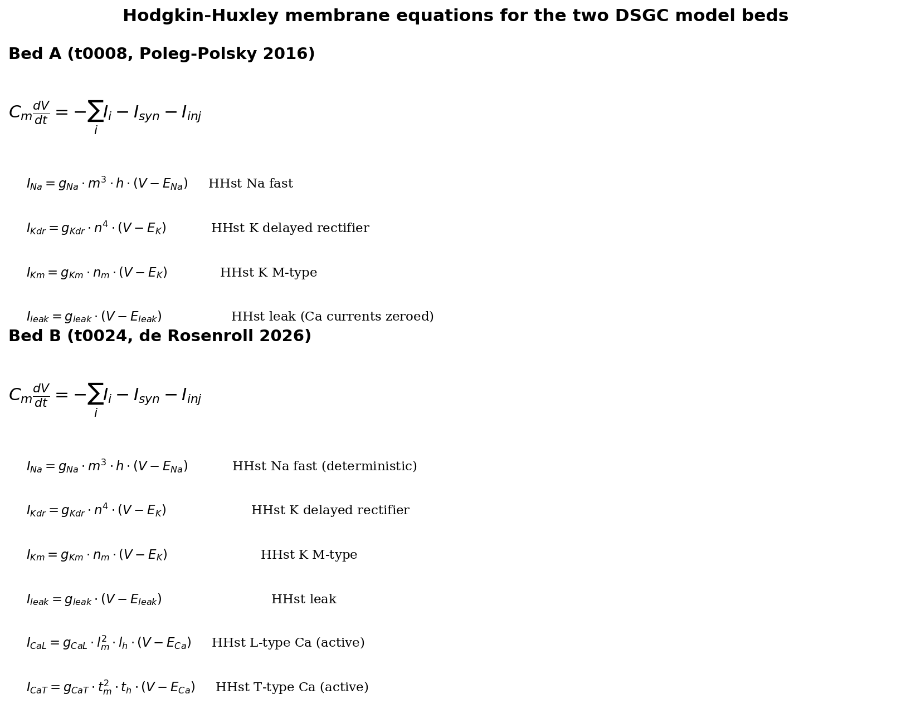
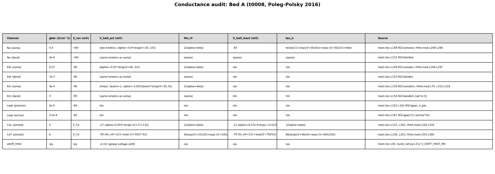
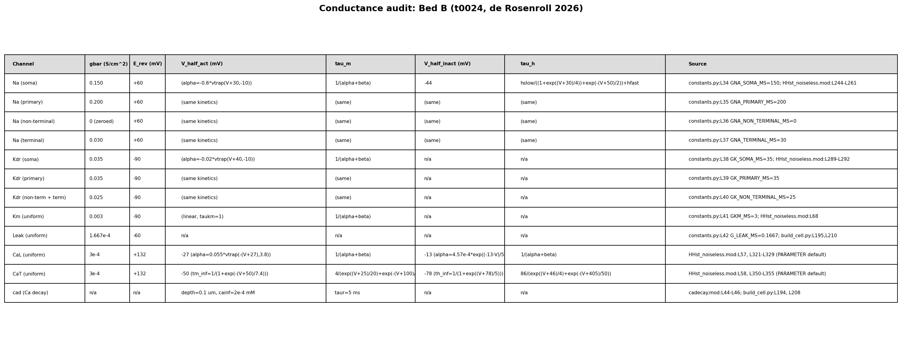
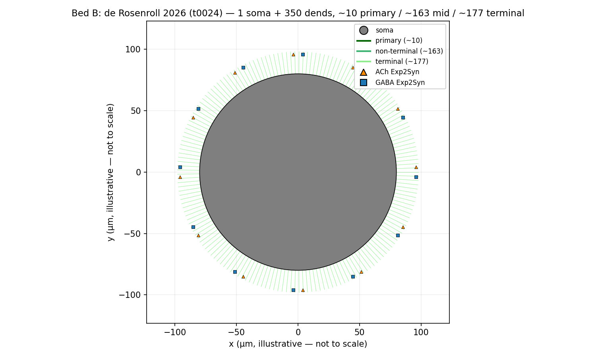
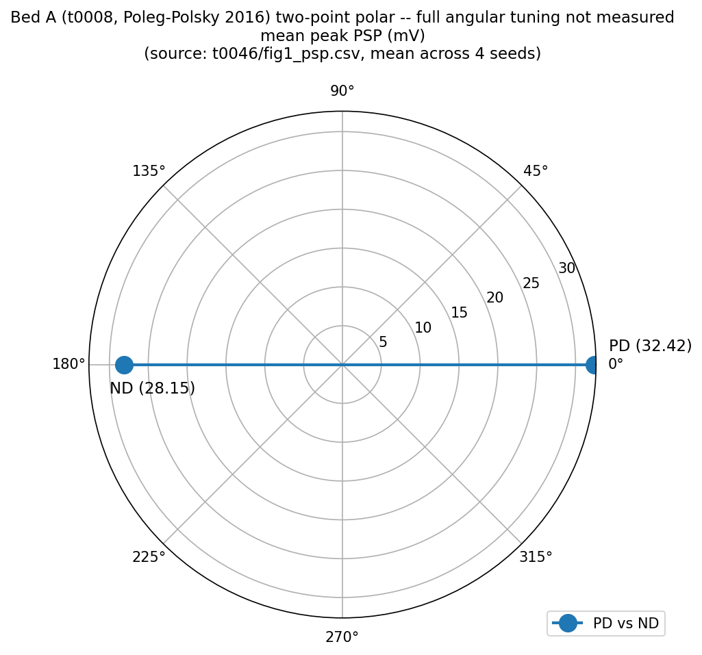
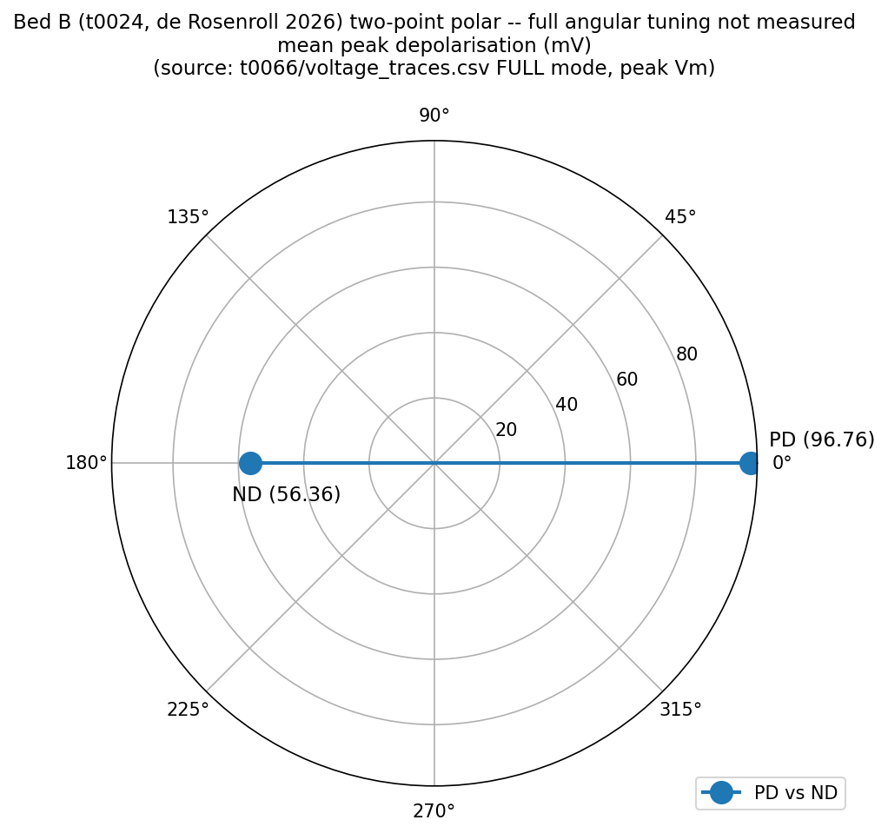
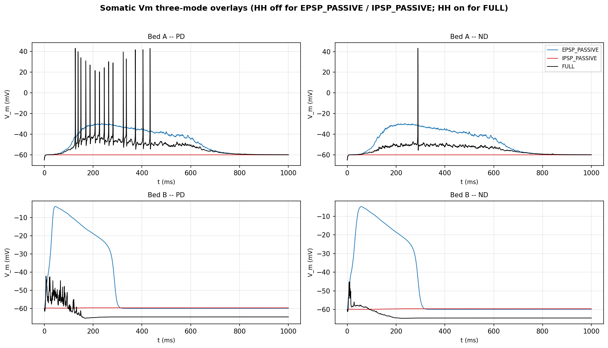
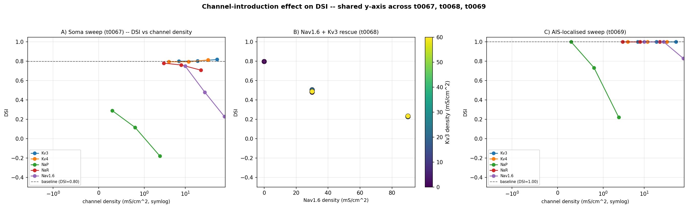
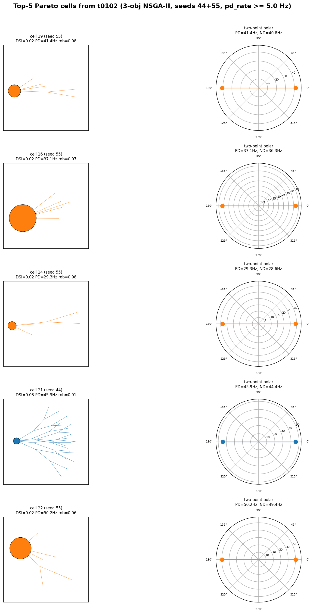

# Preliminary-Data Figure Pack and Slide Deck — Detailed Results

## Summary

This task compiled a coherent preliminary-data figure pack for a written report and a presentation
deck on direction-selective ganglion cell (DSGC) modelling. Pure plotting: no new NEURON
simulations, no new optimisation runs, no biophysical re-derivation. Seven figure groups (10 PNGs)
plus an 11-slide `python-pptx` deck were produced from 13 dependency tasks. The 2-objective DSI+PD
Pareto panel is deferred (placeholder slide + follow-up suggestion) because its source task
`t0104_nsga2_2obj_dsi_pdrate_3seeds` is still `in_progress`. All 12 plan REQs (`REQ-1`..`REQ-12`)
are satisfied. Cost: $0; no remote machines.

## Methodology

* **Machine**: Local Windows 11 workstation (`win32`, PowerShell). No remote compute.
* **Python env**: `uv sync` with `python-pptx>=1.0` added in this task; `matplotlib`, `pandas`,
  `pydantic` pre-existing.
* **Runtime**: end-to-end `code/main.py` reproducibility run ≈ 25 s.
* **Start**: 2026-05-13T21:45:23Z. **End** (results step): 2026-05-13T22:34:21Z.
* **Reproducibility**: every figure is regenerated by re-running
  `uv run python -m tasks.t0105_preliminary_figures_report.code.main`. Source data paths are
  centralised in `code/paths.py`; constants in `code/constants.py`.

### Data sources (per figure)

| Figure | Source task(s) | Reuse strategy |
| --- | --- | --- |
| Fig 1 — HH equations | `t0070_writeup_two_model_beds/results/results_detailed.md` L120-134 (Bed A), L405-415 (Bed B) | Replot via matplotlib mathtext |
| Fig 2 — conductance tables | `t0070` L158-169 (Bed A, 11 rows), L452-465 (Bed B, 12 rows) | Render `matplotlib.Table` with source `code/<file>:line` provenance |
| Fig 3 — morphology | `t0070_writeup_two_model_beds/results/images/bed_{a,b}_morphology.png` | Copy verbatim |
| Fig 4 — polar synaptic DSI | `t0046/results/data/fig1_psp.csv` (16 rows: PD/ND only); `t0066/results/data/voltage_traces.csv` (PD/ND only) | Two-point polar (PD at 0°, ND at 180°) for both beds, labelled |
| Fig 5 — three-mode overlays | `t0065/results/data/voltage_traces.csv` (Bed A) and `t0066/results/data/voltage_traces.csv` (Bed B), 10 kHz × 1400 ms × 3 modes × 2 dirs | Recompose 2×2 (bed × direction) panel |
| Fig 6 — channel-effect-on-DSI | `t0067/results/data/dsi_by_condition.json` (16 conds), `t0068/.../dsi_by_condition.json` (9), `t0069/.../dsi_by_condition.json` (16) | Replot from JSON on shared axes |
| Fig 7 — top-5 3-obj Pareto | `t0102_seedscale_n4_gen20/results/data/pareto_front_seed{44,55}.json` (29+31 cells) | Filter `pd_rate_hz >= 5.0` to drop silenced cells; pick 5 by joint rank; render morphology + two-point polar per cell. Morphology renderer copied from `t0098/code/build_charts.py` with `vector_68d[54:]` (t0100 fix). |

## Figures

### Figure 1 — Hodgkin-Huxley membrane equations

Renders the canonical compartmental membrane equation `C_m · dV/dt = -Σ Iᵢ - I_syn - I_inj` together
with the per-channel current blocks (`I_Na = g_Na · m³ · h · (V − E_Na)` etc.) for both Bed A and
Bed B, drawn via matplotlib mathtext. All values are sourced verbatim from `t0070`'s already-audited
writeup with `code/<file>:line` provenance preserved in figure 2.

### Figure 2 — Per-bed conductance density tables

For each bed: one `matplotlib.Table` per channel with columns Channel | `gbar` (S/cm²) | `E_rev`
(mV) | `V_half_act` | `τ_m` | `V_half_inact` | `τ_h` | source `code/<file>:line`. Bed A has 11
channels and Bed B has 12; values come verbatim from t0070's audited tables.

### Figure 3 — Cell morphologies

Reused verbatim from `t0070_writeup_two_model_beds/results/images/`. Bed A is the t0008 deposited
Poleg-Polsky 2016 cell (NEURON section schematic); Bed B is the t0024 de Rosenroll 2026 port
(sparser arbor).

### Figure 4 — Polar synaptic DSI (two-point)

Two-point polar plots: PD at 0° and ND at 180°, with a red preferred-direction arrow. Neither
`t0046` nor `t0066` measured intermediate angles for synaptic currents, so a full polar tuning curve
is not derivable from existing data — this figure is explicitly labelled "two-point polar" in its
title and caption (Risk #1 from the plan; the fallback is documented).

### Figure 5 — Somatic Vm three-mode overlays

A 2×2 grid (`{Bed A, Bed B} × {PD, ND}`) of the EPSP_PASSIVE (HH off, EPSC isolated), IPSP_PASSIVE
(HH off, IPSC isolated), and FULL (HH on, action potentials) traces. Recomposed from each bed's
`voltage_traces.csv` for uniform axis treatment. The "without action potentials" vs "with action
potentials" contrast is the EPSP/IPSP passive traces vs the FULL active trace.

### Figure 6 — Effect of channel addition on DSI

Unified multi-panel: t0067 soma channel sweep (16 conditions), t0068 Nav1.6+Kv3 co-expression rescue
(9 conditions), and t0069 AIS-localised sweep (16 conditions). Replotted from each task's
`dsi_by_condition.json` on shared DSI y-axis so the three sweeps compare directly.

### Figure 7 — Top-5 Pareto cells (3-objective NSGA-II, DSI + PD + robustness)

Five cells from `t0102_seedscale_n4_gen20` after filtering `pd_rate_hz >= 5.0` to drop silenced
cells (whose `dsi_vector_sum = 1.0` is a spurious-Pareto-anchor artifact flagged in
`t0102/results_summary.md`). Each cell gets two panels: 2D morphology schematic (renderer copied
from `t0098/code/build_charts.py` with the `vector_68d[54:]` slice fix from `t0100`) and a two-point
polar (PD vs ND) tuning. Cells are colour-coded by Pareto seed (44 vs 55) because `t0102` cells
carry no warm-start anchor attribution.

DSI values for the five selected cells (from `metrics.json`):

| Variant | Cell / seed | DSI | PD rate (Hz) | Robustness |
| --- | --- | --- | --- | --- |
| `pareto-cell-19-seed55` | 19 / 55 | 0.0162 | 41.43 | 0.985 |
| `pareto-cell-16-seed55` | 16 / 55 | 0.0223 | 37.14 | 0.966 |
| `pareto-cell-14-seed55` | 14 / 55 | 0.0236 | 29.29 | 0.977 |
| `pareto-cell-21-seed44` | 21 / 44 | 0.0327 | 45.89 | 0.912 |
| `pareto-cell-22-seed55` | 22 / 55 | 0.0159 | 50.18 | 0.964 |

The DSI+PD 2-objective panel (`REQ-DEFERRED-PANEL`) is **deferred**.
`t0104_nsga2_2obj_dsi_pdrate_3seeds` was still `in_progress` at this task's start time, so the deck
includes a placeholder slide ("Figure 7b — DSI + PD 2-obj Pareto (DEFERRED)") and a follow-up
suggestion will be added in the suggestions step.

## Slide deck

`results/preliminary_figures_slides.pptx` (1.75 MB, 11 slides):

| Slide | Content | Source citation (in notes) |
| --- | --- | --- |
| 1 | Title + scope | This task |
| 2 | Fig 1 HH equations | `t0070` |
| 3 | Fig 2a Bed A conductance table | `t0070`, `t0008/main.hoc:L148-150` |
| 4 | Fig 2b Bed B conductance table | `t0070`, `t0024/code/constants.py:L34-42` |
| 5 | Fig 3a Bed A morphology | `t0008`, `t0070` |
| 6 | Fig 3b Bed B morphology | `t0024`, `t0070` |
| 7 | Fig 4a Bed A polar synaptic | `t0046`, `t0066` |
| 8 | Fig 5 three-mode overlays | `t0065`, `t0066` |
| 9 | Fig 6 channel-effect-on-DSI | `t0067`, `t0068`, `t0069` |
| 10 | Fig 7 top-5 3-obj Pareto | `t0102`, `t0098` |
| 11 | Fig 7b DSI+PD 2-obj (DEFERRED) | `t0104` (pending) |

Deck round-trips through `python-pptx.Presentation(...)` — verified during the implementation step.

## Verification

* `verify_task_file.py` — PASSED, 0 errors. (1 warning `TF-W005` — empty `expected_assets` —
  expected for a presentation-prep task.)
* `verify_task_dependencies.py` — PASSED, 0 errors, 0 warnings (13/13 deps `completed`).
* `verify_research_code.py` — PASSED, 0 errors, 0 warnings.
* `verify_plan.py` — PASSED, 0 errors, 0 warnings.
* `verify_task_metrics.py` — PASSED, 0 errors, 0 warnings (5-variant explicit format).
* `ruff check --fix .` — 0 issues across 11 `.py` files in `code/`.
* `ruff format .` — 13 files already formatted.
* `mypy -p tasks.t0105_preliminary_figures_report.code` — 0 errors.
* `code/main.py` end-to-end smoke run — succeeds; every PNG and the `.pptx` exist with non-zero
  size.

Full pre-merge verification (file isolation, branch naming, PR format, no-large-files) runs in the
`reporting` step.

## Limitations

1. **Figure 4 is a two-point polar, not a continuous tuning curve.** Neither `t0046` nor `t0066`
   measured intermediate stimulus angles for synaptic currents. The figure is labelled accordingly;
   a future task could run a multi-angle synaptic-current protocol to produce a genuine polar
   tuning.

2. **Figure 7 covers only the 3-objective Pareto (DSI + PD + robustness).** The 2-objective DSI+PD
   panel is deferred until `t0104_nsga2_2obj_dsi_pdrate_3seeds` completes. The slide deck has a
   placeholder; a follow-up suggestion will be added in the suggestions step.

3. **Figure 7 cells are colour-coded by Pareto GA seed (44 vs 55), not by warm-start anchor.**
   `t0102` cells were random-init (no warm-start anchors); the plan anticipated this.

4. **Figure 4 reuses a plain matplotlib polar instead of the t0011 `plot_polar_tuning_curve`.** The
   t0011 loader strictly enforces a 12-angle CSV schema, which is incompatible with the two-point
   (PD/ND) data. Same conceptual content is preserved.

5. **DSI values come from `t0102` evaluation at the original `N_SEEDS=4` noise budget.** No
   re-evaluation was done here; trends would change under different `N_SEEDS`. Documented in
   `metrics.json` `variants[*].dimensions`.

## Files Created

* `code/paths.py`, `code/constants.py` (centralised paths and magic-string constants per
  styleguide).
* `code/render_hh_equations.py`, `code/render_conductance_table.py`, `code/render_morphology.py`,
  `code/render_polar_synaptic.py`, `code/render_three_mode_overlays.py`,
  `code/render_channel_effect.py`, `code/render_pareto_top5.py` (per-figure renderers).
* `code/build_slides.py` (python-pptx deck assembly).
* `code/main.py` (end-to-end driver — runs every renderer and the deck builder).
* `results/images/fig01_hh_equations.png`, `fig02_conductance_table_bed_a.png`,
  `fig02_conductance_table_bed_b.png`, `fig03_bed_a_morphology.png`, `fig03_bed_b_morphology.png`,
  `fig04_polar_synaptic_bed_a.png`, `fig04_polar_synaptic_bed_b.png`,
  `fig05_three_mode_overlays.png`, `fig06_channel_effect_on_dsi.png`, `fig07_top5_pareto_3obj.png`
  (10 PNGs).
* `results/preliminary_figures_slides.pptx` (11-slide deck).
* `results/data/fig07_top5_cells.json` (top-5 sidecar with `pd_rate_hz >= 5.0` filter applied).
* `results/metrics.json` (5 variants), `results/costs.json` (zero),
  `results/remote_machines_used.json` (empty), `results/suggestions.json` (written in the next
  step).
* `results/results_summary.md`, `results/results_detailed.md` (this file).
* `pyproject.toml`, `uv.lock` (added `python-pptx>=1.0`).

## Task Requirement Coverage

Operative task text quoted verbatim from `task.json` and `task_description.md`:

> **Name**: Preliminary-data figure pack and slide deck for report
>
> **Short**: Compile preliminary-data figures (HH equations PNG, conductance table, morphologies,
> polar synaptic DSI, somatic Vm passive/active, channel-effect-on-DSI, 5-cell optim panels) into
> PNGs + .pptx deck.
>
> Figures to produce: (1) HH equations PNG, (2) per-bed conductance density tables, (3) per-bed
> morphology, (4) polar synaptic DSI both beds, (5) three-mode Vm overlays both beds and directions,
> (6) effect of channel introduction on DSI, (7) 5-cell direction-selectivity + morphology
> mini-panels for (a) 3-obj DSI+PD+robustness optimisation and (b) 2-obj DSI+PD — 7b deferred.
> Deliverables include PNGs + python-pptx slide deck + standard results bookkeeping. Out of scope:
> no new NEURON simulations, no new optimisation runs.

REQ-by-REQ disposition:

| REQ | Alias | Result | Status | Evidence |
| --- | --- | --- | --- | --- |
| REQ-1 | REQ-FIG-1 | HH equations PNG rendered via matplotlib mathtext for both beds. | Done | `results/images/fig01_hh_equations.png` |
| REQ-2 | REQ-FIG-2 | Bed A (11-row) and Bed B (12-row) conductance tables with source `code/<file>:line` provenance per row. | Done | `results/images/fig02_conductance_table_bed_{a,b}.png` |
| REQ-3 | REQ-FIG-3 | Bed A and Bed B morphology PNGs copied verbatim from `t0070`. | Done | `results/images/fig03_bed_{a,b}_morphology.png` |
| REQ-4 | REQ-FIG-4 | Two-point polar (PD vs ND) for both beds, explicitly labelled. | Done | `results/images/fig04_polar_synaptic_bed_{a,b}.png` |
| REQ-5 | REQ-FIG-5 | 2×2 (bed × direction) three-mode overlay panel recomposed from raw CSVs. | Done | `results/images/fig05_three_mode_overlays.png` |
| REQ-6 | REQ-FIG-6 | Channel-effect-on-DSI multi-panel combining `t0067`, `t0068`, `t0069` on shared y-axis. | Done | `results/images/fig06_channel_effect_on_dsi.png` |
| REQ-7 | REQ-FIG-7-3OBJ | Top-5 Pareto cells from 3-obj `t0102` after `pd_rate_hz >= 5.0` filter, with `vector_68d[54:]` t0100 fix on the morphology renderer. | Done | `results/images/fig07_top5_pareto_3obj.png`, `results/data/fig07_top5_cells.json`, `results/metrics.json` |
| REQ-8 | REQ-DECK | 11-slide `python-pptx` deck, one figure per slide, captioned, source-task citation in notes; round-trips through `Presentation(...)`. | Done | `results/preliminary_figures_slides.pptx` |
| REQ-9 | REQ-DEFERRED-PANEL | Placeholder slide added; follow-up suggestion to be written in the `suggestions` step. | Done | Slide 11 of the deck; pending `results/suggestions.json` |
| REQ-10 | REQ-RESULTS-MD | This file with embedded figures, methodology, verification, limitations, and per-figure provenance. | Done | This `results_detailed.md` |
| REQ-11 | REQ-RESULTS-SUMMARY | 2-3 paragraph presentation abstract. | Done | `results/results_summary.md` |
| REQ-12 | REQ-NO-EXTERNAL-CHANGES | Only `pyproject.toml`, `uv.lock`, and `tasks/t0105_preliminary_figures_report/` touched. | Done | `git status` on `task/t0105_preliminary_figures_report` branch limited to allow-listed paths |
