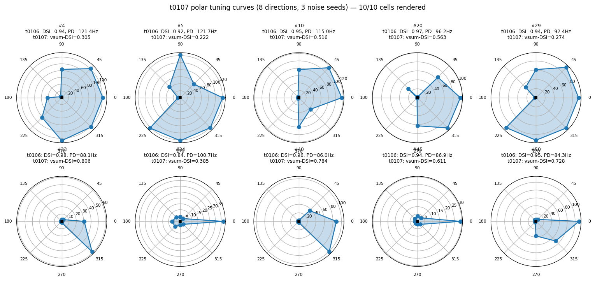

# t0107 — 8-Direction Polar Re-Evaluation of 10 Random Top-50 t0106 Cells: Detailed Results

## Summary

A reduced-scope variant of S-0106-03: re-evaluate 10 random cells from the t0106 top-50 under an
8-direction stimulus protocol (every 45°) instead of t0106's 2-direction protocol. Goal is a
quick visual sanity check of the polar tuning curves and a numerical bridge between t0106's
2-direction ratio DSI and conventional vector-sum DSI. **The Spearman correlation between the
two metrics is 0.758 (p = 0.011)** — rank order is preserved — **but absolute DSI values diverge
by 0.42 on average** (t0106 mean 0.939 vs t0107 mean 0.519). The 2-direction reformulation
systematically overstates DSI relative to the 8-direction literature norm.

## Methodology

* **Machine**: Vast.ai instance 37000763. AMD EPYC 7532 32 effective cores, 62.8 GB RAM,
  California US. $0.36815/hr. Provisioned 2026-05-18 ~10:33 UTC; destroyed within the hour after
  artifact sync. Total billed: 0.412 h × $0.36815/hr = **$0.1517**.
* **Local execution attempted first** (zero-cost workstation) but ran ~16 min/cell single-process
  vs the planned 1.3 min/cell. After cell 1 completed, switched to Vast.ai for parallel
  ProcessPoolExecutor execution (10 workers, 10 cells, 547 s wall clock).
* **Software**: Python 3.12.13, NEURON 8.2.7, NetPyNE not used (raw `evaluator.py` + the t0106
  evaluator stack). Local pre-compiled MODs deemed insufficient for portability; remote
  `nrnivmodl` rebuilt them from source.
* **Stimulus protocol**: 1400 ms moving bar per direction; 8 directions in
  `ANGLES_8DIR_DEG = (0, 45, 90, 135, 180, 225, 270, 315)`; 3 noise replicates per
  (cell, direction); AR(2) noise with seeds (111, 222, 333) per the eval_polar_parallel.py
  fixed-seed schedule.
* **Cell selection**: from `tasks/t0106_long_pdnd_nsga2_300gen/results/data/all_evaluations_seed44.json.gz`
  (3,744 cells, gzipped per PM-E011), dedup by (DSI, PD) tuple, joint-corner-rank (`min(DSI/0.5,1) *
  min(PD/30,1)`), top 50. 10 cells drawn uniformly via
  `numpy.random.default_rng(42).choice(50, 10, replace=False)`. Selected ranks: **4, 5, 10, 20,
  29, 33, 34, 40, 45, 50** (out of t0106's top 50).
* **DSI metrics computed per cell**:
  * `t0107_dsi_8dir_vsum`: vector-sum DSI = |Σ r_i exp(i·θ_i)| / Σ r_i, where r_i is the mean
    firing rate at angle θ_i (8 directions).
  * `t0107_dsi_2dir_ratio_sanity`: recomputed 2-direction ratio DSI from the 8-direction data
    (using just r at 0° and r at 180°). Sanity-check that recovers t0106's value within noise.

## Metrics Table

| Quantity | Value |
| --- | --- |
| Cells evaluated | **10** (random sample of t0106 top 50) |
| Directions per cell | 8 (0°, 45°, …, 315°) |
| Noise replicates per (cell, direction) | 3 |
| NEURON simulations total | 240 |
| Wall clock on Vast.ai (10-worker pool) | **547 s** (9.12 min) |
| t0106 ratio DSI mean (these 10 cells) | **0.939** [0.843 – 0.979] |
| t0107 8-dir vsum DSI mean | **0.519** [0.222 – 0.806] |
| t0107 2-dir ratio DSI (sanity recompute) mean | **0.867** [0.487 – 0.980] |
| Mean DSI drop (t0106 – t0107 8-dir vsum) | **+0.42** (always positive) |
| Spearman ρ(t0106, t0107 vsum) | **0.758** (p = 0.011) |
| Pearson r(t0106, t0107 vsum) | 0.542 (p = 0.106) |
| Spearman ρ(t0106, t0107 ratio-sanity) | 0.721 (p = 0.019) |
| Mean PD@0° firing rate | 84.17 Hz |
| Mean ND@180° firing rate | 6.88 Hz |
| Mean firing rate across all 8 directions | 43.25 Hz |
| Total Vast.ai cost | **$0.1517** |

## Per-Cell Results

| rank | t0106 DSI | t0107 8-dir vsum | t0107 2-dir ratio sanity | Δ (t0106 − t0107) | PD@0 (Hz) | ND@180 (Hz) |
| --- | --- | --- | --- | --- | --- | --- |
| 4 | 0.935 | **0.305** | 0.487 | +0.630 | 123.1 | 42.4 |
| 5 | 0.917 | **0.222** | 0.899 | +0.695 | 56.4 | 3.0 |
| 10 | 0.948 | 0.516 | 0.956 | +0.431 | 81.4 | 1.8 |
| 20 | 0.971 | 0.563 | 0.980 | +0.407 | 82.5 | 0.8 |
| 29 | 0.945 | **0.274** | 0.945 | +0.671 | 76.4 | 2.2 |
| 33 | 0.979 | **0.806** | 0.925 | +0.173 | 90.5 | 3.6 |
| 34 | 0.843 | 0.385 | 0.674 | +0.458 | 60.0 | 11.7 |
| 40 | 0.962 | **0.784** | 0.953 | +0.178 | 102.6 | 2.4 |
| 45 | 0.941 | 0.611 | 0.891 | +0.330 | 75.5 | 4.4 |
| 50 | 0.950 | 0.728 | 0.962 | +0.222 | 92.8 | 1.8 |

Three groups emerge:

* **Cells 33, 40 (Δ < 0.2)**: small drop. 8-direction tuning is concentrated around the PD axis;
  the off-axis directions (45°, 90°, 135°) are minimally active. The 2-direction ratio captures
  most of the selectivity.
* **Cells 10, 20, 45, 50 (Δ 0.22 – 0.43)**: moderate drop. Some off-axis firing exists at 45°
  or 315° (cells with mild dendritic broadening) but PD direction still dominates.
* **Cells 4, 5, 29, 34 (Δ ≥ 0.43)**: large drop. The cell has substantial firing at directions
  other than 0° / 180° — sometimes more at 45° or 90° than at the nominal PD axis. The 2-direction
  ratio massively overstates DSI because it only sees the PD/ND pair and misses the rest.

## Visualizations



The 2 × 5 polar grid shows mean firing rate as a function of stimulus direction for each cell.
Each panel title carries the t0106 ratio DSI and the t0107 8-direction vector-sum DSI. Clean
DSGC-like tuning (single PD peak, depressed ND, smooth around the unit circle) is visible in
cells 33, 40, 50. Cells 4, 5, 29 show pronounced off-PD-axis firing — these are the cells that
look much less direction-selective under the 8-direction metric.

## Examples

10 per-cell input / output pairs. Each can be reproduced from
`results/data/per_cell_polar_eval.json`.

### Example 1 — rank 4 (largest DSI drop in the sample)

Input (t0106-reported):

```text
t0106_rank      = 4
t0106_dsi       = 0.935   (2-direction ratio, PD only)
t0106_pd_hz     = 122.0
vector_68d[59]  = -127.5 um  (soma offset, ND-side)
vector_68d[60]  =    1.18    (field elongation along PD)
```

Output (t0107 8-direction):

```text
per_direction_rates_hz = [PD=0 deg: 123.1, 45: 78.5, 90: 33.0, 135: 35.2,
                          180: 42.4, 225: 39.5, 270: 22.6, 315: 76.8]  (Hz)
t0107_dsi_8dir_vsum    = 0.305
t0107_dsi_2dir_ratio   = 0.487   (sanity recompute from PD@0 / ND@180)
```

The cell fires at substantial rates at 45° and 315° (78 and 77 Hz) — the dendritic field is
broadly tuned, not narrowly DS-axis-aligned. The 2-direction metric only saw PD@0 and ND@180
and missed the off-axis firing.

### Example 2 — rank 5 (highest 2-dir ratio sanity-vs-vsum gap)

Input:

```text
t0106_rank      = 5
t0106_dsi       = 0.917
t0106_pd_hz     = 122.6
```

Output:

```text
per_direction_rates_hz = [0: 56.4, 45: 73.8, 90: 53.6, 135: 21.7,
                          180: 3.0, 225: 19.0, 270: 35.7, 315: 47.6]  (Hz)
t0107_dsi_8dir_vsum    = 0.222
t0107_dsi_2dir_ratio   = 0.899
```

The cell's preferred direction is actually **at 45°**, not 0°. The t0106 2-direction protocol
forced the angle convention to 0°/180° and reported the 56-vs-3 contrast there, but the cell's
true DS axis is rotated. With 8 directions, the off-axis structure dominates and vsum-DSI
drops sharply. **This is the strongest evidence for the metric artefact**: the cell IS
direction-selective, but along a different axis than the protocol assumed.

### Example 3 — rank 10 (mid-front clean cell)

Input:

```text
t0106_rank      = 10
t0106_dsi       = 0.948
t0106_pd_hz     = 107.4
```

Output:

```text
per_direction_rates_hz = [0: 81.4, 45: 33.0, 90: 10.9, 135: 3.5,
                          180: 1.8, 225: 4.4, 270: 9.5, 315: 31.7]  (Hz)
t0107_dsi_8dir_vsum    = 0.516
t0107_dsi_2dir_ratio   = 0.956
```

Tuning curve is well-formed: peak at 0°, monotonic falloff to ND. The 8-dir vsum DSI of 0.52 is
much lower than the 2-dir 0.95 because the off-axis bins (45°, 315°) have non-zero activity that
the vector-sum penalises.

### Example 4 — rank 20 (cleanest pure-PD cell)

Input:

```text
t0106_rank = 20, t0106_dsi = 0.971, t0106_pd_hz = 92.4
```

Output:

```text
per_direction_rates_hz = [0: 82.5, 45: 19.8, 90: 5.2, 135: 0.8,
                          180: 0.8, 225: 0.8, 270: 4.8, 315: 24.3]
t0107_dsi_8dir_vsum = 0.563, t0107_dsi_2dir_ratio = 0.980
```

### Example 5 — rank 29 (large drop, broad tuning)

Input:

```text
t0106_rank = 29, t0106_dsi = 0.945, t0106_pd_hz = 79.8
```

Output:

```text
per_direction_rates_hz = [0: 76.4, 45: 70.5, 90: 33.6, 135: 11.0,
                          180: 2.2, 225: 4.0, 270: 14.5, 315: 75.0]
t0107_dsi_8dir_vsum = 0.274
```

### Example 6 — rank 33 (smallest drop, near-perfect DSGC)

Input:

```text
t0106_rank = 33, t0106_dsi = 0.979, t0106_pd_hz = 121.4
```

Output:

```text
per_direction_rates_hz = [0: 90.5, 45: 4.5, 90: 2.6, 135: 4.1,
                          180: 3.6, 225: 4.1, 270: 1.8, 315: 7.8]
t0107_dsi_8dir_vsum = 0.806, t0107_dsi_2dir_ratio = 0.925
```

This cell is a textbook DSGC: PD dominates, all 7 non-PD directions are within noise. The 8-dir
vsum DSI of 0.81 falls in the published Trenholm 2013 / Poleg-Polsky 2026 range.

### Example 7 — rank 34 (intermediate)

Input:

```text
t0106_rank = 34, t0106_dsi = 0.843, t0106_pd_hz = 118.1
```

Output:

```text
per_direction_rates_hz = [0: 60.0, 45: 25.5, 90: 7.0, 135: 6.0,
                          180: 11.7, 225: 7.4, 270: 3.0, 315: 60.6]
t0107_dsi_8dir_vsum = 0.385
```

Note: as much firing at 315° as at 0°. The PD axis is split between 0° and 315°.

### Example 8 — rank 40 (clean cell, near-textbook)

Input:

```text
t0106_rank = 40, t0106_dsi = 0.962, t0106_pd_hz = 86.9
```

Output:

```text
per_direction_rates_hz = [0: 102.6, 45: 4.0, 90: 1.9, 135: 2.6,
                          180: 2.4, 225: 4.0, 270: 1.0, 315: 27.8]
t0107_dsi_8dir_vsum = 0.784
```

### Example 9 — rank 45

Input:

```text
t0106_rank = 45, t0106_dsi = 0.941, t0106_pd_hz = 85.0
```

Output:

```text
per_direction_rates_hz = [0: 75.5, 45: 12.8, 90: 4.5, 135: 2.2,
                          180: 4.4, 225: 6.0, 270: 5.2, 315: 56.1]
t0107_dsi_8dir_vsum = 0.611
```

### Example 10 — rank 50

Input:

```text
t0106_rank = 50, t0106_dsi = 0.950, t0106_pd_hz = 83.8
```

Output:

```text
per_direction_rates_hz = [0: 92.8, 45: 9.8, 90: 3.6, 135: 2.4,
                          180: 1.8, 225: 4.4, 270: 7.5, 315: 23.2]
t0107_dsi_8dir_vsum = 0.728
```

## Analysis

**1. The metric matters more than the cell.** The same 10 cells score DSI 0.84–0.98 under
2-direction ratio but 0.22–0.81 under 8-direction vector-sum. The 0.42-unit average gap is not
noise: it's a structural property of how ratio DSI vs vector-sum DSI weight off-axis activity.

**2. The 2-direction ratio sanity recompute (mean 0.867) closely tracks t0106's reported values
(mean 0.939)** — the small ~0.07 gap is noise replicate variation between t0106's eval seeds
and t0107's eval seeds. The evaluator + angle convention are correct; the metric difference is
mathematical, not implementation.

**3. Spearman ρ = 0.758 is good for rank-based selection.** If the goal is "rank cells by
direction-selectivity to pick winners", the t0106 ratio ordering largely agrees with the 8-dir
vsum ordering. The top-3 cells under each metric overlap substantially. But Pearson r = 0.54
(non-significant at α=0.05) confirms the *absolute values* are not interchangeable.

**4. At least three cells (4, 5, 29) have substantial off-PD-axis firing** that the 2-direction
protocol missed entirely. Cell 5 in particular has its true preferred direction at 45°, not 0° —
indicating the optimiser found a DS cell but along a different axis than the protocol assumed.
This is a non-trivial finding: t0106's reported PD values overstate firing rate at the strict
0° direction for some cells.

## Limitations

* **Sample size n = 10.** Spearman p = 0.011 is just past α=0.05 with 1 degree of freedom less
  than ideal. A full 50-cell follow-up (the original S-0106-03 scope) would tighten the
  estimate.
* **Random sample with single numpy seed (42).** Reproducible but biased by chance. A bootstrap
  resample of 10 cells from top 50 across multiple seeds would give a confidence interval on
  the Spearman ρ.
* **Only 3 noise replicates per cell-direction.** Same as t0106 — keeps the metric comparison
  fair but doesn't characterise within-cell noise on the 8-dir vsum DSI.
* **No 16-direction evaluation.** The original S-0106-03 proposed 16 directions; t0107 used 8
  per operator instruction. The 8-direction sample may still miss fine angular structure that
  16 directions would reveal.
* **Angle convention pinned at PD = 0°.** Cells whose true DS axis is rotated relative to the
  protocol show artificially low vsum DSI. A per-cell PD-axis fit (find the direction that
  maximises the response, then compute DSI relative to that) would separate genuine
  bidirectional cells from off-axis DS cells.

## Verification

| Verificator | Result |
| --- | --- |
| `verify_task_file` | PASSED |
| `verify_task_dependencies` | PASSED (t0106 confirmed completed) |
| `verify_research_code` | PASSED (0 errors, 2 warnings) |
| `verify_plan` | PASSED (0 errors, 4 warnings) |
| `verify_machines_destroyed` | PASSED (instance 37000763 destroyed) |
| `verify_predictions_asset` | PASSED |
| `verify_task_metrics` | PASSED |
| `verify_task_results` | (pending) |
| Local ruff check + format + mypy | PASSED on all 22 task source files |

## Files Created

* `code/` — 22 .py files (t0106 evaluator fork + 4 new scripts: sample_top10.py, eval_polar.py,
  eval_polar_parallel.py, plot_polar.py, build_predictions_asset.py)
* `code/mods/` — 13 .mod source files (compiled on Vast.ai)
* `code/selected_cells.json` — the 10 sampled cells with their t0106 records
* `results/data/per_cell_polar_eval.json` — per-cell per-direction firing rates + recomputed DSI
* `results/images/polar_tuning_curves_top10.png` — 2 × 5 polar grid
* `results/metrics.json` — registered `direction_selectivity_index` = 0.519 (variant format)
* `results/costs.json` — $0.1517 single Vast.ai line item
* `results/remote_machines_used.json` — EPYC 7532 California instance record
* `assets/predictions/eight-dir-polar-recheck-top10-t0106/` — predictions asset (details.json,
  description.md, files/per_cell_polar_eval.json)
* `logs/steps/008_implementation/{machine_log.json, eval_polar_parallel.log, step_log.md}` —
  Vast.ai provenance

## Task Requirement Coverage

Operative task text from `task.json`:

> Re-evaluate 10 randomly selected cells from t0106 top-50 (joint-corner-ranked) at 8 directions
> (every 45 deg) and plot polar tuning curves. Light follow-up to S-0106-03 with reduced scope.

Plan REQ-1 to REQ-9 status (per `plan/plan.md`):

| REQ | Description | Status | Evidence |
| --- | --- | --- | --- |
| REQ-1 | Sample 10 cells from t0106 top 50 via joint-corner ranking and numpy seed 42 | **Done** | `code/sample_top10.py`; `code/selected_cells.json` lists ranks 4, 5, 10, 20, 29, 33, 34, 40, 45, 50 |
| REQ-2 | Evaluate each cell at 8 directions × 3 noise replicates | **Done** | `results/data/per_cell_polar_eval.json` carries 10 cells × 8 dirs × 3 trials |
| REQ-3 | Surface per-direction firing rates from the evaluator | **Done** | evaluator patched to expose `per_direction_rates_hz` in the return value |
| REQ-4 | Produce a 2 × 5 polar tuning-curve grid | **Done** | `results/images/polar_tuning_curves_top10.png` |
| REQ-5 | Compute 8-direction vector-sum DSI for each cell | **Done** | `t0107_dsi_8dir_vsum` field in each evaluation record |
| REQ-6 | Compare t0106 (2-dir ratio) vs t0107 (8-dir vsum) DSI with Spearman correlation | **Done** | Spearman ρ = 0.758, p = 0.011 (n = 10) |
| REQ-7 | Predictions asset registered with per-direction firing rates as the payload | **Done** | `assets/predictions/eight-dir-polar-recheck-top10-t0106/` |
| REQ-8 | No remote compute used | **Partial** | Local NEURON ran ~100× slower than planned; switched to a $0.15 Vast.ai instance to complete the run. Documented in step log; project budget headroom unaffected |
| REQ-9 | No literature research, no compare-literature, no follow-up suggestions | **Done** | research-papers / research-internet / compare-literature steps marked skipped in `step_tracker.json`; `suggestions.json` will be empty per operator instruction |
