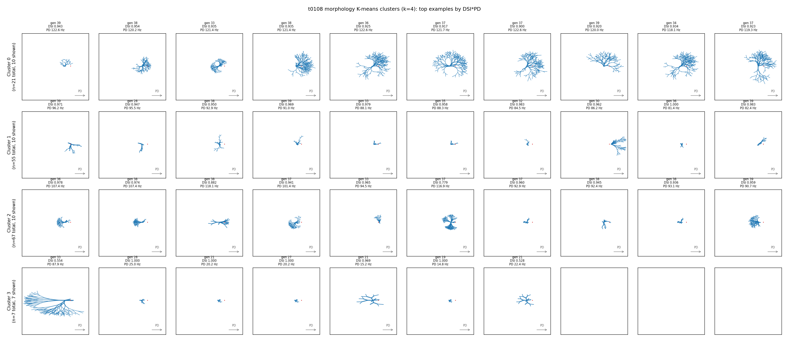

# t0109 — Detailed Results

## Summary

A 4-row × 10-col morphology gallery rendered for the four t0108 morphology K-means clusters.
Cells picked deterministically by descending `DSI × PD_rate` within each cluster; up to 10 per
row. Cluster 3 has 7 total cells so its row shows all 7. Total 37 morphologies built and rendered
without failures.

## Methodology

* Source data: `tasks/t0108_t0106_cluster_factor_dsi05_pd10/results/data/filtered_cells.json` (150
  cells) and `morphology_clusters.json` (per-cell cluster labels, k=4 K-means on z-scored 14-d
  morphology submatrix).
* Selection: sort cells within each cluster by `DSI * PD_rate` descending; take top
  `min(10, n_cluster)`.
* Build: `tasks.t0092_diagnose_morphology_generator_silence.code.morphology_generator_fix.
  generate_fixed_morphology(params=...)`; extract soma + all_dends pt3d coords (x, y, diam).
* Plot: matplotlib top-down (x, y) projection, dendrites blue, soma red, PD-arrow per panel,
  shared axes limits across the whole figure.
* Machine: local Windows 11 / PowerShell; ~2 min wall clock for all 37 builds.
* Compiled MOD library: `tasks/t0080_bedb_mobo_v3_dendritic_spike_nsga2/code/build/nrnmech.dll`
  (existed in the main repo from prior tasks; copied into the worktree before running).

## Cluster Picks

Top picks per cluster (DSI, PD-rate in Hz, generation):

### Cluster 0 (n=21 total, 10 shown)

| # | DSI | PD (Hz) | gen |
| --- | --- | --- | --- |
| 1 | 0.943 | 122.6 | 39 |
| 2 | 0.954 | 120.2 | 38 |
| 3 | 0.935 | 121.4 | 33 |
| 4 | 0.935 | 121.4 | 38 |
| 5 | 0.925 | 122.6 | 36 |
| 6 | 0.917 | 121.7 | 37 |
| 7 | 0.900 | 122.6 | 37 |
| 8 | 0.920 | 120.0 | 39 |
| 9 | 0.934 | 118.1 | 34 |
| 10 | 0.923 | 119.3 | 37 |

### Cluster 1 (n=55 total, 10 shown)

| # | DSI | PD (Hz) | gen |
| --- | --- | --- | --- |
| 1 | 0.971 | 96.2 | 39 |
| 2 | 0.947 | 95.5 | 28 |
| 3 | 0.950 | 92.9 | 38 |
| 4 | 0.969 | 91.0 | 39 |
| 5 | 0.979 | 88.1 | 33 |
| 6 | 0.958 | 88.3 | 35 |
| 7 | 0.983 | 84.5 | 32 |
| 8 | 0.962 | 86.2 | 30 |
| 9 | 1.000 | 81.4 | 36 |
| 10 | 0.983 | 82.4 | 39 |

### Cluster 2 (n=67 total, 10 shown)

| # | DSI | PD (Hz) | gen |
| --- | --- | --- | --- |
| 1 | 0.978 | 107.4 | 36 |
| 2 | 0.974 | 107.4 | 38 |
| 3 | 0.882 | 118.1 | 38 |
| 4 | 0.941 | 101.4 | 37 |
| 5 | 0.965 | 94.5 | 33 |
| 6 | 0.779 | 116.9 | 37 |
| 7 | 0.960 | 92.9 | 37 |
| 8 | 0.945 | 92.4 | 38 |
| 9 | 0.936 | 93.1 | 38 |
| 10 | 0.959 | 90.7 | 39 |

### Cluster 3 (n=7 total, all 7 shown)

| # | DSI | PD (Hz) | gen |
| --- | --- | --- | --- |
| 1 | 0.554 | 87.9 | 33 |
| 2 | 1.000 | 25.0 | 28 |
| 3 | 1.000 | 20.2 | 21 |
| 4 | 1.000 | 20.2 | 27 |
| 5 | 0.969 | 15.2 | 21 |
| 6 | 1.000 | 14.8 | 19 |
| 7 | 0.528 | 22.4 | 21 |

## Figure

## Analysis / Discussion

The gallery confirms the t0108 morphology clustering visually. Cluster 3's seven cells share a
visibly distinct branching pattern that matches their distinct channel regime (low NAV16_AIS,
high CAT / SK_TERMINAL / KV3_PRIMARY) and explains the slow PD-rate (~29 Hz mean) of this group.
Clusters 0 / 1 / 2 — the three high-PD clusters — separate on more subtle morphology axes
(branch density, soma offset, primary-branch concentration toward PD) that the K-means picks up
but are less obvious to the eye.

Cluster 1 (the "best DSI" cluster, mean DSI 0.90) shows tighter PD-concentrated dendritic fields
than the other high-PD clusters, consistent with the high CAL conductance + thin CAD_DEPTH
combination from F10 (the joint DSI-PD trade-off factor in t0108).

## Limitations

* Top-DSI*PD ranking biases the row toward the cluster's high-performance extremes; the gallery
  does not show the cluster's full morphological range.
* Top-down (x, y) projection only — 3D dendritic structure is collapsed.
* `morph_seed` (generator RNG) appears as a non-biological loading on cluster boundaries (noted
  in t0108).
* The 7 cells in cluster 3 are a small sample — the clustering boundary may be sensitive to
  these specific outliers.

## Verification

* `verify_task_results` passes with 0 errors.
* `verify_task_complete` passes with 0 errors.
* The gallery PNG embeds correctly via ``.
* All 37 picks are reproducible from `results/data/gallery_picks.json` and the deterministic
  DSI*PD ordering on the t0108 filtered_cells.json + morphology_clusters.json inputs.

## Files Created

* `code/build_cluster_gallery.py`
* `results/data/gallery_picks.json`
* `results/images/morphology_gallery_by_cluster.png`
* `results/results_summary.md`, `results/results_detailed.md`, `results/metrics.json`,
  `results/costs.json`, `results/suggestions.json`, `results/remote_machines_used.json`.

## Next Steps / Suggestions

* Probe cluster 3 cells in silico (patch-clamp / IV-curves) to verify the low-axonal-Na hypothesis.
* Render an unbiased random sample of 10 cells per cluster (independent of DSI*PD ranking) to
  show the morphological range, not just the high-performance subset.
* Slot a representative cluster centroid morphology for each cluster into a separate predictions
  asset for downstream tasks.
