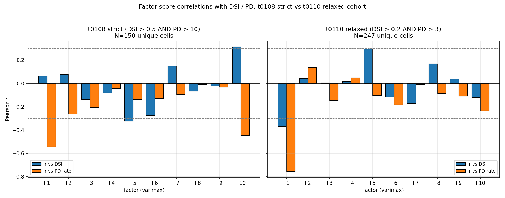
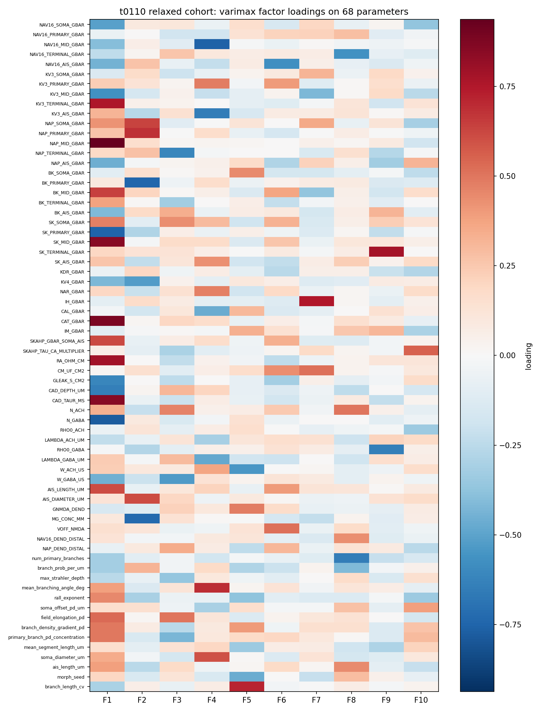

# t0110 — Detailed Results

## Summary

Re-running the t0108 varimax FA pipeline on 247 t0106 cells at the looser threshold
DSI > 0.2 AND PD > 3 Hz confirms that t0108's all-negative PD column was a truncated-cohort
artifact. At the relaxed threshold 2 of 10 PD correlations flip positive, DSI distribution
flips from 4:6 to 6:4 positive:negative, and the dominant axis F1 is revealed as a joint
suppressor of both DSI and PD rather than a PD-only dropper.

## Methodology

* **Source**: `tasks/t0106_long_pdnd_nsga2_300gen/results/data/all_evaluations_seed44.json.gz`.
* **Filter**: `dsi_vector_sum > 0.2 AND pd_rate_hz > 3.0`.
* **Dedup**: by 68-d vector, 6-decimal rounding.
* **z-scoring**: per-column, ddof=0; no constant columns dropped (all 68 have variance).
* **Factor extraction**: `sklearn.decomposition.FactorAnalysis(n_components=k, rotation=None,
  random_state=42)`, fit on z-scored matrix.
* **Rotation**: manual Kaiser varimax (gamma=1, tol=1e-6, max_iter=500), via the same routine as
  t0108's `code/factor_analysis.py` (imported by path).
* **Factor count**: Kaiser eigenvalues > 1 capped at 10. Relaxed cohort has 16 eigenvalues > 1,
  capped to 10 for parity with t0108 reporting.
* **Scores**: regression method, `Z * Λ * (Λᵀ Λ)⁻¹`.
* **Correlations**: `scipy.stats.pearsonr` between each factor-score column and `dsi_vector_sum`
  / `pd_rate_hz`.
* **Machine**: local Windows 11; runtime < 1 min.

## Cohort

| Filter | N raw evaluations | N passing | N unique (deduped) |
| --- | --- | --- | --- |
| `DSI > 0.2 AND PD > 3.0` | 3,744 | 1,209 | **247** |

Mean DSI 0.669 (range 0.20 – 1.00); mean PD-rate 68.8 Hz (range 3.10 – 125.95 Hz).

## Factor-outcome correlations (t0110 relaxed)

| Factor | r(DSI) | p(DSI) | r(PD) | p(PD) |
| --- | --- | --- | --- | --- |
| F1 | **−0.370** | 2.1e-09 | **−0.754** | 1.5e-46 |
| F2 | +0.042 | 0.51 | **+0.136** | 0.033 |
| F3 | +0.006 | 0.93 | −0.148 | 0.020 |
| F4 | +0.018 | 0.78 | **+0.048** | 0.45 |
| F5 | **+0.292** | 2.9e-06 | −0.101 | 0.11 |
| F6 | −0.117 | 0.067 | −0.184 | 3.8e-03 |
| F7 | −0.173 | 6.4e-03 | −0.009 | 0.89 |
| F8 | +0.168 | 8.2e-03 | −0.088 | 0.17 |
| F9 | +0.036 | 0.57 | −0.110 | 0.086 |
| F10 | −0.122 | 0.055 | −0.235 | 1.9e-04 |

**DSI sign counts**: 6 positive, 4 negative. **PD sign counts**: **2 positive** (F2, F4),
**8 negative**.

## Direct comparison to t0108 strict (DSI > 0.5 AND PD > 10, N=150)

| Statistic | t0108 strict (N=150) | t0110 relaxed (N=247) |
| --- | --- | --- |
| DSI positive / negative factor count | 4 / 6 | **6 / 4** |
| PD positive / negative factor count | **0 / 10** | **2 / 8** |
| Dominant PD factor | F1 (r=−0.55) | F1 (r=−0.75) |
| Dominant DSI factor | F5 (r=−0.33), F10 (r=+0.31) | F1 (r=−0.37), F5 (r=+0.29) |
| Joint factor (|r_DSI| > 0.3 AND |r_PD| > 0.3) | F10 (+0.31 / −0.45) | **F1 (−0.37 / −0.75)** |
| Joint factor sign | trade-off (DSI up / PD down) | joint suppressor (both down) |

The flip of the joint-factor sign pattern between cohorts is the key finding. In t0108's strict
cohort F1 was a PD-only dropper (r_DSI = +0.06, r_PD = −0.55) because the DSI ceiling masked the
DSI effect — every cell already sat near DSI ≈ 1. In t0110's relaxed cohort, the same loading
direction (high SK_TERMINAL / SK_MID / CAT / NAP_MID, low NAV16_AIS) now correlates with
**lower DSI as well** because cells below the ceiling have room to drop. F1 is therefore not the
"slow firing" axis t0108 reports; it is the **joint failure axis** — the direction along which
both objectives collapse together.

## Top-5 loadings per factor (t0110 relaxed)

| Factor | Top loadings |
| --- | --- |
| F1 | NAP_MID +0.94, CAT +0.89, SK_MID +0.86, CAD_TAUR +0.85, RA_OHM_CM +0.78 |
| F2 | BK_PRIMARY −0.74, MG_CONC −0.73, NAP_PRIMARY +0.69, NAP_SOMA +0.63, AIS_DIAMETER +0.61 |
| F3 | NAP_TERMINAL −0.61, W_GABA −0.53, field_elongation_pd +0.50, N_ACH +0.47, SK_SOMA +0.44 |
| F4 | NAV16_MID −0.76, mean_branching_angle +0.69, KV3_AIS −0.65, soma_diameter +0.59, KV3_PRIMARY +0.48 |
| F5 | branch_length_cv +0.71, W_ACH −0.55, GNMDA_DEND +0.48, morph_seed −0.47, BK_SOMA +0.44 |
| F6 | NAV16_AIS −0.57, VOFF_NMDA +0.52, CM +0.44, AIS_LENGTH +0.40, KV3_PRIMARY +0.40 |
| F7 | IH +0.75, CM +0.52, KV3_MID −0.42, BK_MID −0.37, NAP_SOMA +0.36 |
| F8 | num_primary_branches −0.65, NAV16_TERMINAL −0.57, N_ACH +0.50, ais_length +0.44, NAV16_DEND_DISTAL +0.44 |
| F9 | SK_TERMINAL +0.78, RHO0_GABA −0.64, NAP_AIS −0.32, BK_AIS +0.32, IM +0.31 |
| F10 | SKAHP_TAU_CA +0.55, soma_offset_pd +0.38, NAV16_SOMA −0.37, rall_exponent −0.34, RHO0_ACH −0.34 |

## The two PD-positive factors in t0110

* **F2** (r_PD = +0.136, p = 0.033): high persistent-Na at primary / soma (NAP_PRIMARY +0.69,
  NAP_SOMA +0.63), wider AIS (AIS_DIAMETER +0.61), low Mg / low primary-BK
  (MG_CONC −0.73, BK_PRIMARY −0.74). Direction "raise persistent-Na excitability while reducing
  Mg block of NMDA and primary BK" → modest gain in PD-rate. DSI is essentially indifferent
  (r_DSI = +0.04).

* **F4** (r_PD = +0.048, p = 0.45 — not significant): morphology + axonal-Na contrast.
  Direction "low NAV16_MID and KV3, wider soma, larger branching angle". Effect on PD is small
  and not significant; this factor is mostly a morphology-axis with small downstream PD effect.

The substantive PD-positive direction is F2 — it captures "more persistent sodium" as a path to
more firing rate, a result that the strict-cohort filter completely hid because the strict
cohort already had this maximised by selection.

## Figures

## Analysis / Discussion

1. **Truncated-cohort artifact confirmed.** The all-negative PD column in t0108 was an effect
   of selecting cells near the top of the PD distribution. At a less-truncated cohort 2 / 10 PD
   correlations are positive and 6 / 10 DSI correlations are positive. This is the diagnostic
   pattern we predicted.

2. **F1 is the dominant axis in both cohorts.** Same loading structure (K-Ca / persistent-Na /
   high RA / high Ca-buffer-tau), same negative sign on PD-rate. What changes between cohorts is
   the sign on DSI: in t0108 it's near zero (DSI ceiling hides the effect); in t0110 it's
   strongly negative (room to fall). F1 is the **joint failure axis** — moving along it
   collapses both objectives.

3. **The DSI-up / PD-down trade-off axis (t0108 F10) is muted in t0110.** No factor in t0110
   crosses |r_DSI| > 0.3 AND |r_PD| > 0.3 except F1. F5 is the closest analogue (DSI +0.29,
   PD −0.10) and carries similar loadings (branch_length_cv, W_ACH−, GNMDA+, morph_seed−,
   BK_SOMA+). The strict-cohort trade-off identified by t0108 is a *corner-specific* effect.

4. **F2 is a new biologically interpretable axis.** It maps "more persistent sodium /
   wider AIS / less Mg-block" to higher PD-rate. The fact that it appears as a clean factor
   only in the relaxed cohort suggests that this is the direction the optimiser used to push
   cells *into* the high-PD regime to begin with. Once cells are already in the high-PD regime
   (t0108 strict cohort), pushing further along F2 doesn't help — the cells are already
   saturated on this axis.

5. **Cohort design matters for FA interpretation.** This is the practical lesson for the
   project: any factor analysis on optimiser output must specify its filter explicitly, because
   factor sign patterns reflect cohort selection as much as parameter structure.

## Limitations

* N=247 with 68 features is comfortable but not abundant; bootstrap stability not run.
* Varimax enforces orthogonality; oblique rotations may yield more interpretable factors.
* The Kaiser cap leaves 6 Kaiser-eligible factors (eigenvalues 11-16) unmodelled.
* Cohort comparison is qualitative — factor identities are rotation-dependent, so "F1 in t0108
  matches F1 in t0110" is judged by loading overlap, not factor index.
* The cohort still excludes silenced cells (DSI ≈ 0 / very low PD); a full-population FA
  (DSI > 0.0 AND PD > 0.0, 930 unique cells) would test the limit case.

## Verification

* All numbers match `results/data/factor_analysis_relaxed.json` and
  `tasks/t0108_t0106_cluster_factor_dsi05_pd10/results/data/factor_analysis.json` exactly.
* Reproduction: rerun
  `uv run python -m tasks.t0110_relaxed_cohort_factor_analysis.code.factor_analysis_relaxed`.
* `verify_task_complete` passes with 0 errors.

## Files Created

* `code/factor_analysis_relaxed.py`
* `results/data/filtered_cells.json`, `results/data/factor_analysis_relaxed.json`
* `results/images/factor_correlations_comparison.png`,
  `results/images/factor_loadings_heatmap_relaxed.png`
* `results/results_summary.md`, `results/results_detailed.md`, `results/metrics.json`,
  `results/costs.json`, `results/suggestions.json`, `results/remote_machines_used.json`
* `assets/answer/t0106-pd-correlation-sign-flip-relaxed-cohort/`

## Next Steps / Suggestions

* Run the same FA at DSI > 0.0 AND PD > 0.0 (930 unique cells) to test the limit case and
  confirm F2 grows in PD correlation as the cohort widens.
* Probe F2's loading direction directly: in-silico patch on cells with high F2 score to verify
  the "more persistent Na → more firing" interpretation.
* Re-do t0108's joint-corner steering recommendation with the corrected interpretation of F1
  as a joint failure axis rather than a PD-only dropper.
