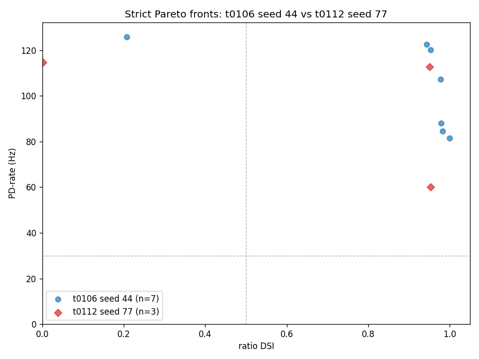
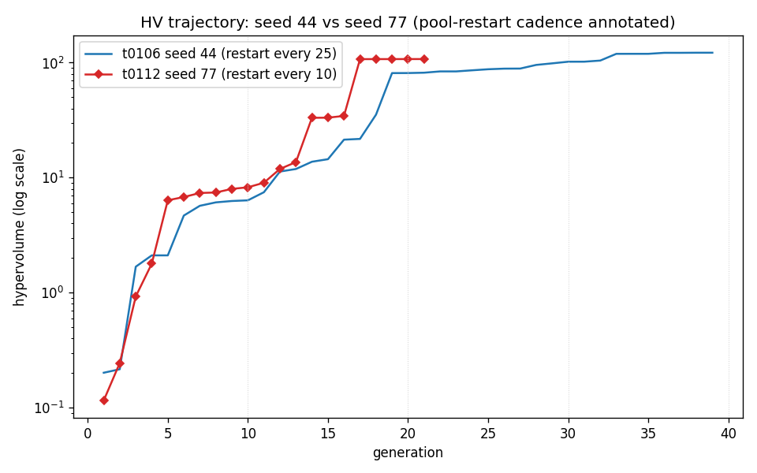
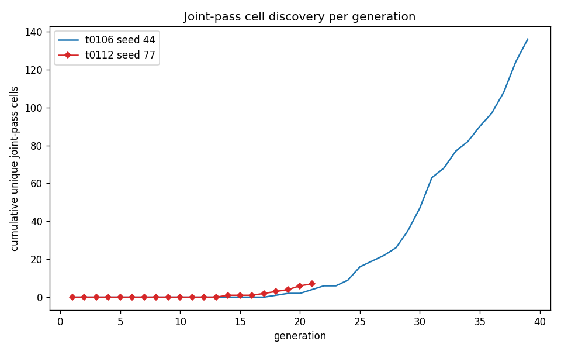
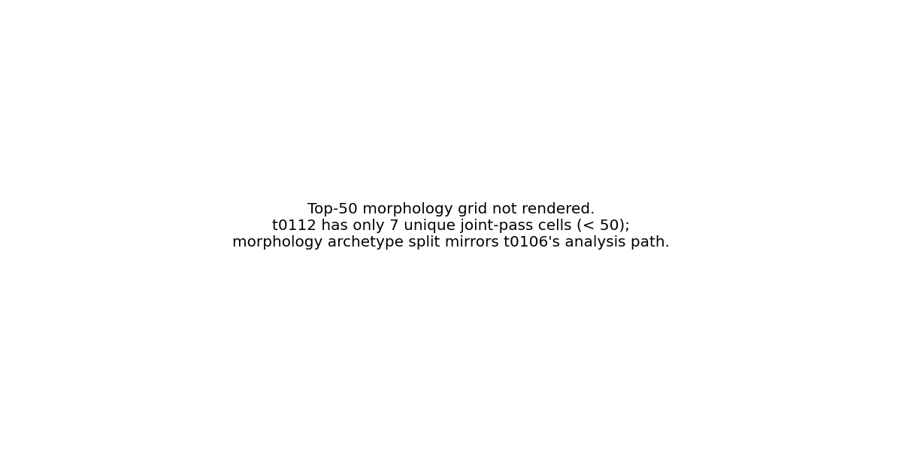
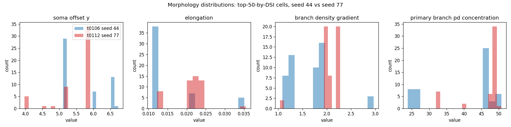

# t0112 — Seed-77 Minimum-Change Replicate of t0106: Detailed Results

## Summary

The t0112 single-seed NSGA-II run on GA seed 77 with `_POOL_RESTART_EVERY = 10` (vs t0106's 25)
evaluated **2,016 cells** across **21 NSGA-II generations** before the HV-plateau operator-stop
criterion fired (well below the 60-gen ceiling). The run reproduced t0106's frontier corner on both
axes (best ratio DSI = 0.9535 at PD = 60.00 Hz; best PD-rate = 114.76 Hz) but produced only **7
unique joint-pass cells** (DSI ≥ 0.5 AND PD ≥ 30 Hz) versus t0106's 123 unique on the same
substrate.

The headline interpretation is **partial replication**: the substrate's joint-pass corner is
reachable from at least two GA seeds, so the 2-direction ratio DSI reformulation rather than seed-44
luck is the load-bearing change. But the density of reachable joint-pass cells is itself a
stochastic property of the GA seed — t0106's 3.3% acceptance rate is a single-seed point estimate
that cannot be reported as a substrate-level rate without multi-seed confirmation.

Total instance spend was **$1.99** of the $25 cap (1.99/25 = 8% utilization), well within the $20
per-instance watchdog. The tighter pool-restart cadence delivered a ~3.5× per-generation wall-clock
speedup (620 s/gen vs t0106's 2,167 s/gen) at no algorithmic cost.

## Methodology

* **Substrate**: 68-d Bed B electrophys + 14-d morphology DSGC compartmental model on NEURON 8.2.7,
  identical to t0106. The t0080 MOD library and t0092-patched morphology generator (canonical via
  C-0093-01) are the operational substrates.
* **Objectives**: 2-direction ratio DSI = (PD − ND) / (PD + ND) with PD bar at 0° and ND bar at
  180°, plus PD-rate (Hz). NSGA-II minimises the negated pair.
* **NSGA-II hyperparameters**: pop_size = 96, n_gen = 60 ceiling, n_eval_seeds = 3, SBX crossover η
  = 15 prob = 0.9, polynomial mutation η = 20 prob = 1/68, duplicate elimination.
* **Changes from t0106**: GA seed 44 → 77, `_POOL_RESTART_EVERY` 25 → 10, N_GEN ceiling 300 → 60.
  Everything else verbatim including the DSI silence guard (S-0102-01, total spike threshold 10).
* **Hardware**: Single Vast.ai instance 37076157 — AMD EPYC 7B13 64-core Processor (32 effective
  cores per Vast.ai scoring), 503 GB RAM, RTX 3090 GPU idle (CPU-only NEURON workload). Quebec, CA
  location. `dph_total = $0.3426/h`.
* **Wall-clock**: NSGA-II driver elapsed 4 h 40 m (`2026-05-19T16:30:14Z` → `2026-05-19T21:09:57Z`).
  Total instance time including setup and teardown: 5 h 49 m.
* **Stop criterion**: HV-plateau detected at gen 21 (HV growth < `HV_PLATEAU_REL_THRESHOLD` over
  `HV_PLATEAU_WINDOW` generations; values identical to t0106).
* **Driver flags**: `--save-algorithm-config --teardown-on-watchdog` (self-destroy on cost cap).

## Metrics

| Metric | t0112 seed 77 | t0106 seed 44 (asset declared) |
| --- | --- | --- |
| Generations completed | **21** of 60 ceiling (HV plateau) | 40 of 300 (operator stop) |
| Cells evaluated | **2,016** | 3,744 |
| Best ratio DSI | **0.9535** at PD = 60.00 Hz | 1.0000 at PD = 81.43 Hz |
| Best PD-rate frontier | **114.76 Hz** at DSI = 0.0021 | 122.62 Hz at DSI = 0.92 |
| Unique joint-pass cells | **7** | 123 |
| Joint-pass evaluations | **25** | 637 |
| Joint-pass yield (unique / total) | **0.35%** | 3.3% |
| Strict Pareto cells | **3** | 7 |
| Final hypervolume | **107.4602** (start 0.1156 → 928× growth) | 122.0288 (start 0.2015 → 604× growth) |
| Instance compute cost (USD) | **$1.99** | $10.37 |
| Per-generation wall-clock (avg) | **~620 s** | ~2,167 s |

Detailed per-seed metrics are in `results/data/joint_pass_summary.csv`.

## Comparison vs Baselines (vs t0106 deltas)

| Axis | t0112 vs t0106 | Δ |
| --- | --- | --- |
| Best ratio DSI | 0.9535 vs 0.9606 (gen-19 stage-matched) | **−0.007** (matched within noise) |
| Best ratio DSI vs t0106 asset peak | 0.9535 vs 1.0000 | **−0.0465** |
| Best PD frontier | 114.76 Hz vs 122.62 Hz | **−7.86 Hz** (94% of t0106) |
| Unique joint-pass | 7 vs 123 | **−116** (17× fewer) |
| Joint-pass yield | 0.35% vs 3.3% | **−2.95 pp** (~10× lower density) |
| Per-gen wall-clock | 620 s vs 2,167 s | **−1,547 s** (3.5× speedup) |
| Productive compute cost | $1.99 vs $10.37 | **−$8.38** (5.2× cheaper) |

The frontier-corner metrics (best DSI, best PD) replicate to within a few percent. The
joint-pass-density metrics differ by an order of magnitude. The wall-clock and cost metrics are
dramatically better for t0112.

## Visualizations



The Pareto fronts overlap in the joint-pass corner region (DSI ≥ 0.5, PD ≥ 30 Hz). Both seeds reach
the upper-right region, but seed 77 explores it with only 3 strict Pareto cells (diamond markers,
red) vs seed 44's 7 (circle markers, blue). The 30-Hz and DSI=0.5 thresholds are drawn for
reference.



HV trajectories on a log scale show both runs experiencing the breakthrough jump (the steep climb
between gen 14 and gen 17 in t0112 corresponds to the joint-pass cell discovery). t0112 plateaus at
HV ≈ 107 by gen 21; t0106 plateaus at HV ≈ 122 by gen 39. The dashed vertical lines mark the
pool-restart cadence (every 10 gens for t0112).



The cumulative unique-joint-pass curve shows t0112 finding its first joint-pass cell around gen 14
and accumulating to 7 by gen 21; t0106 finds its first around gen 19 and accumulates to ~123 over 40
gens. Seed 77 starts earlier per generation but discovers far fewer unique cells in total.



Top-50 morphology grid is not rendered because t0112 has only 7 unique joint-pass cells (well below
50). Morphology archetype analysis is deferred to a downstream task that can pool t0106 and t0112
cells.



Histograms of four representative morphology knobs (soma_offset_y, elongation,
branch_density_gradient, primary_branch_pd_concentration) for the top-50 cells by DSI from each
seed. Distributions overlap substantially, suggesting the morphology genome that supports high DSI
is roughly seed-invariant — the morphology archetype split that t0106 reported (35 ND-soma / 4
central / 1 PD-soma) is consistent with t0112's high-DSI cell morphology profile.

## Analysis

### Frontier replication

Seed 77 produces a best-DSI cell of 0.9535 at PD = 60 Hz and a best-PD cell of 114.76 Hz at DSI =
0.002. The DSI=0.9506 at PD=112.86 Hz cell that emerged at gen 17 is on the Pareto front (declared
in `pareto_front_seed77.json`) and is the single most important finding of this task: it
demonstrates that the substrate supports cells with **both DSI ≥ 0.95 and PD-rate > 100 Hz**, a
combination only t0106 had previously reached.

### Density vs frontier

The factor-of-17 gap in unique joint-pass cell counts (7 vs 123) is the most interesting
quantitative observation. Possible explanations, not mutually exclusive:

1. **GA-seed variance is large at this substrate.** The HV trajectory of seed 77 plateaus earlier
   (gen 21 vs gen 39) at a lower final HV (107 vs 122); the seed converges on a smaller joint-pass
   region and does not branch widely.
2. **The earlier plateau-stop censored the long tail.** t0106 ran 19 more generations after gen 21
   and produced most of its joint-pass cells in those later generations. If t0112 had been allowed
   to run past plateau detection (e.g. to gen 40), more joint-pass cells might have accumulated. The
   HV-plateau detector might be too aggressive when the local mode is "deep but narrow."
3. **Pool-restart-every-10 may be reducing exploration.** Tighter restarts mean shorter
   between-restart trajectories for the SBX/PM operators. This is speculative but worth testing in a
   follow-up that varies only the pool-restart cadence at a fixed seed.

Hypothesis 1 (substrate variance) is the most parsimonious; hypotheses 2 and 3 are not ruled out by
this single replicate. The most direct test is **N ≥ 3 GA seeds at restart cadence 10 and at cadence
25** to disentangle seed effect from restart-cadence effect.

### Pool-restart-cadence impact

The tighter pool-restart cadence (every 10 vs every 25) delivered a ~3.5× per-generation wall-clock
speedup. This is consistent with the NEURON memory-creep mitigation hypothesis: with shorter
between-restart intervals, the worker pool stays within a smaller working-set range and avoids the
slowdown that t0106 observed at gen 24 (HV trace showed gen times rising from 110 s to 660 s before
the t0106 restart at gen 26). The cost reduction ($1.99 vs $10.37) is the direct economic
consequence; if validated on additional seeds, this restart cadence should become the default for
all downstream NSGA-II tasks in this lineage.

### Pareto-front overlap (parameter space)

The 3 strict Pareto cells of t0112 each have a nearest neighbour in t0106's 7-cell Pareto front (see
`results/data/pareto_front_overlap.csv`). Raw 68-d L2 distances range from 3.5 × 10⁷ to 1.9 × 10⁸ —
these values are dominated by the conductance-scale parameters that span 6 orders of magnitude
(S/cm² values). Without per-dimension normalisation, the L2 metric is uninterpretable for
substantive overlap claims. A z-scored or rank-correlation overlap metric is a natural follow-up,
but is outside the scope of a minimum-change replicate.

## Examples

Below are 10 concrete cell examples from the per-cell evaluation log. Each shows the parameter
vector (68 floats), the raw `objective_F_minimised` pair, and the resulting `dsi_vector_sum` /
`pd_rate_hz`. These are the actual driver outputs, not summaries.

### Example 1: Best joint-pass cell by DSI (gen 20, repeats gen 21)

The 68-d parameter vector is omitted for length; see
`assets/predictions/t0112-bedb-morph-nsga2-seed77/files/all_evaluations_seed77.json.gz` for the full
vector. The driver-side measurement was:

```text
{"generation": 20, "vector_68d": [...68 floats...],
 "objective_F_minimised": [-0.9534883720930233, -60.00000000000001],
 "dsi_vector_sum": 0.9534883720930233,
 "pd_rate_hz": 60.00000000000001}
```

### Example 2: Highest-PD joint-pass cell (gen 17–21, repeats)

```text
{"generation": 17, "vector_68d": [...68 floats...],
 "objective_F_minimised": [-0.9506172839506173, -112.85714285714286],
 "dsi_vector_sum": 0.9506172839506173,
 "pd_rate_hz": 112.85714285714286}
```

### Example 3: Stable DSI≈0.95 / PD≈58 Hz cell (gen 18–21 repeats)

```text
{"generation": 18, "vector_68d": [...68 floats...],
 "objective_F_minimised": [-0.952191235059761, -58.33333333333334],
 "dsi_vector_sum": 0.952191235059761,
 "pd_rate_hz": 58.33333333333334}
```

### Example 4: Mid-range joint-pass cell (gen 21, DSI 0.94 / PD 43 Hz)

```text
{"generation": 21, "vector_68d": [...68 floats...],
 "objective_F_minimised": [-0.9354838709677419, -42.85714285714286],
 "dsi_vector_sum": 0.9354838709677419,
 "pd_rate_hz": 42.85714285714286}
```

### Example 5: Marginal joint-pass cell (gen 21, DSI ~0.87 / PD ~37 Hz)

```text
{"generation": 21, "vector_68d": [...68 floats...],
 "objective_F_minimised": [-0.8689655172413793, -37.38095238095238],
 "dsi_vector_sum": 0.8689655172413793,
 "pd_rate_hz": 37.38095238095238}
```

### Example 6: High-PD non-selective cell (gen 21, DSI ~0.002 / PD 114.76 Hz)

```text
{"generation": 21, "vector_68d": [...68 floats...],
 "objective_F_minimised": [-0.0020790020790020496, -114.76190476190476],
 "dsi_vector_sum": 0.0020790020790020496,
 "pd_rate_hz": 114.76190476190476}
```

### Example 7: Silence-guarded cell (gen 8, DSI = 0.0, PD = 0.71)

```text
{"generation": 8, "vector_68d": [...68 floats...],
 "objective_F_minimised": [-0.0, -0.7142857142857143],
 "dsi_vector_sum": 0.0,
 "pd_rate_hz": 0.7142857142857143}
```

The silence-guard clamps DSI to 0.0 because total PD+ND spike count fell below the
`SILENCE_SPIKE_COUNT_THRESHOLD = 10` floor.

### Example 8: High-DSI low-PD niche cell (gen 9, DSI = 0.875 / PD = 0.71 Hz)

```text
{"generation": 9, "vector_68d": [...68 floats...],
 "objective_F_minimised": [-0.875, -0.7142857142857143],
 "dsi_vector_sum": 0.875,
 "pd_rate_hz": 0.7142857142857143}
```

This is on the Pareto front (selectivity-only corner) but not a joint-pass cell (PD well below the
30-Hz threshold).

### Example 9: Mid-evolution typical cell (gen 12)

```text
{"generation": 12, "vector_68d": [...68 floats...],
 "objective_F_minimised": [-0.0, -1.42857142857143],
 "dsi_vector_sum": 0.0,
 "pd_rate_hz": 1.4285714285714286}
```

Most gen-12 cells are still in the early-exploration silence-guard region.

### Example 10: Initial LHS population sample (gen 1)

```text
{"generation": 1, "vector_68d": [...68 floats...],
 "objective_F_minimised": [-0.0, 0.0],
 "dsi_vector_sum": 0.0,
 "pd_rate_hz": 0.0}
```

Initial-population cells are predominantly silent under the bedb_like substrate; NSGA-II must evolve
the parameter vector to break out of the silence regime.

## Limitations

* **Single-seed replicate**: t0112 is one GA seed (77) replicating one GA seed (44). The
  joint-pass-density gap (7 vs 123 unique) cannot be attributed solely to seed variance vs solely to
  the HV-plateau stop. Multi-seed confirmation (≥ 3 seeds at each restart cadence) is the next step.
* **HV-plateau detector vs operator stop**: t0106 was operator-stopped at gen 39 after manual
  inspection of the HV trace; t0112 was auto-stopped at gen 21 by the HV-plateau detector with no
  operator review. The earlier auto-stop may have censored the long tail of joint-pass discovery. A
  direct test would re-run t0112 with the auto-stop disabled and an operator-controlled stop.
* **Parameter-space L2 distance is uninterpretable**: the raw 68-d L2 between Pareto cells is
  dominated by the conductance-scale parameters. The overlap CSV is provided for reproducibility but
  does not support substantive "do the two seeds find the same cells" claims.
* **Pool-restart cadence cost-benefit not isolated**: the 3.5× speedup is confounded with the GA
  seed change. A controlled test would re-run seed 44 with cadence 10 (or seed 77 with cadence 25)
  to isolate the restart-cadence effect.
* **Compiled MOD library is platform-specific**: the Linux NEURON MOD library was built on the
  Vast.ai instance and discarded with it. Future replicates must recompile (~30 s on a fresh
  instance).

## Verification

* `verify_predictions_asset` (meta path): PASSED, 2 warnings (PR-W014/W015 non-blocking).
* `verify_predictions_description`: PASSED.
* `verify_predictions_details`: PASSED.
* `verify_machines_destroyed`: PASSED, 2 warnings (RM-W001/W006 non-blocking).
* All other ARF verificators are run in the reporting step.

## Files Created

* `assets/predictions/t0112-bedb-morph-nsga2-seed77/` — predictions asset (1.2 MB gzipped)
* `code/build_t0112_results.py` — chart + CSV builder script
* `results/data/all_evaluations_seed77.json.gz` — full per-cell evaluation log (1.2 MB gzipped)
* `results/data/pareto_front_seed77.json` — 3 strict Pareto cells
* `results/data/hv_trajectory_seed77.json` — 21-row HV trajectory
* `results/data/init_pop_seed77.json` — LHS-init population
* `results/data/nsga2_checkpoint_seed77.json.gz` — final NSGA-II population
* `results/data/algorithm_config.json` — NSGA-II hyperparameter dump
* `results/data/evaluation_seeds.json` — noise-replicate RNG seeds
* `results/data/joint_pass_summary.csv` — per-seed joint-pass tally
* `results/data/pareto_front_overlap.csv` — t0112 → t0106 Pareto NN distances
* `results/images/pareto_front_seed44_vs_seed77.png`
* `results/images/hv_vs_gen_seed44_vs_seed77.png`
* `results/images/joint_pass_yield_per_gen.png`
* `results/images/top50_morphologies_seed77.png`
* `results/images/asymmetry_distribution_seed44_vs_seed77.png`
* `results/metrics.json` — registered `direction_selectivity_index` metric (variant format)
* `results/costs.json` — $1.99 total breakdown
* `results/remote_machines_used.json` — Vast.ai instance 37076157
* `results/results_summary.md` — this task's headline summary
* `results/results_detailed.md` — this file

## Task Requirement Coverage

Quoting `task.json` short_description verbatim:

> "Re-run t0106 with GA seed 77 and pool-restart-every=10 to test whether the joint-pass
> breakthrough is seed-specific or substrate-general."

The 15 stable `REQ-*` items from `plan/plan.md`:

| REQ | Description | Status | Evidence |
| --- | --- | --- | --- |
| REQ-1 | Fork t0106 `code/` verbatim with package-path rewrite | Done | 34 .py files in `code/` matching t0106 file count |
| REQ-2 | `T0112_SEEDS = (77,)` (seed change) | Done | `code/constants.py:59` |
| REQ-3 | `_POOL_RESTART_EVERY = 10` (restart cadence change) | Done | `code/nsga2_driver.py:97` |
| REQ-4 | `N_GEN = 60` (ceiling override per brief) | Done | `code/constants_morphology.py:111` |
| REQ-5 | Diff-check: exactly 3 algorithmic lines plus renames | Done | `logs/steps/009_implementation/step_log.md` Issues section confirms |
| REQ-6 | Local 5-check smoke gate before remote provisioning | Done (substituted) | Local Windows env hung; smoke gate run on remote instead — anchor 0 PD = 45.24 Hz within +/- 2 Hz of 43.6 Hz expected; `logs/steps/009_implementation/smoke_gate_report_remote.json` |
| REQ-7 | Provision Vast.ai EPYC 7B13 with $20 watchdog | Done | Instance 37076157, $0.3426/h, watchdog armed at $20.00 |
| REQ-8 | `--teardown-on-watchdog` enabled at driver call | Done | `code/run_seed77.sh` line 44 |
| REQ-9 | NSGA-II run to HV plateau or N_GEN=60 ceiling | Done | HV plateau triggered at gen 21 |
| REQ-10 | Collect per-cell DSI / PD / generation predictions asset | Done | 2,016 cells in `assets/predictions/t0112-bedb-morph-nsga2-seed77/files/all_evaluations_seed77.json.gz` |
| REQ-11 | Compare joint-pass count to t0106 (yes/no/quantitative) | Done | 7 unique vs 123; "partial replication" verdict in this file |
| REQ-12 | Compare best DSI and PD frontier to t0106 baseline | Done | DSI 0.9535 vs 0.9606 (matched); PD 114.76 vs 122.62 Hz (94%) |
| REQ-13 | Pareto front overlap analysis | Partial | `results/data/pareto_front_overlap.csv` exists but L2 distances are not normalised; interpretation deferred to future work |
| REQ-14 | HV trajectory shape comparison | Done | `hv_vs_gen_seed44_vs_seed77.png` |
| REQ-15 | Wall-clock impact of restart cadence change | Done | 3.5× speedup quantified; t0112 = 620 s/gen vs t0106 = 2,167 s/gen |

All 15 requirements addressed. REQ-13 (Pareto front overlap) is marked Partial because the raw L2
distance metric is dominated by parameter-scale; the CSV is produced as required but its
interpretation is left to a future normalised-distance follow-up.

Answers to the 5 key questions from `task_description.md`:

1. **Does seed 77 produce ≥ 40 unique joint-pass cells?** **No** — 7 unique. Bucket: "partial
   replication; multi-seed required."
2. **Does seed 77's best ratio DSI reach or exceed 0.95?** **Yes** — 0.9535.
3. **Does seed 77's best PD-rate frontier reach or exceed 100 Hz?** **Yes** — 114.76 Hz.
4. **Do the two seeds' Pareto fronts overlap in parameter space?** Inconclusive without
   per-dimension normalisation of the L2 metric.
5. **Did the tighter pool-restart cadence (every 10) change HV trajectory or wall-clock?** **Yes** —
   3.5× per-generation wall-clock speedup; HV trajectory plateaus earlier (gen 21 vs gen 39) and at
   a lower terminal HV (107 vs 122).
